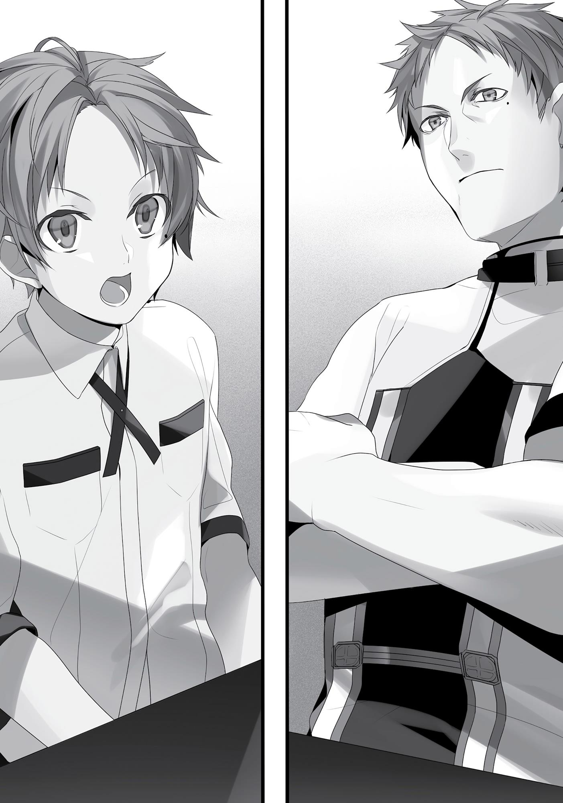

+++
title = "Chapter 10 Stunted Growth"
date = 2026-07-20
weight = 10
[extra]
volume = 1
chapter = 11
+++
I was now seven years old.
My two little sisters, Norn and Aisha, were growing quickly. They
cried when they peed themselves, they cried when they pooped
themselves, they cried when they were upset about something, and
they cried even when they weren’t. They’d cry in the middle of the
night, and they’d cry first thing in the morning, and when afternoon
rolled around, there’d be some particularly energetic wailing.
Before long, Paul and Zenith were having a shared nervous
breakdown. The only one who kept her cool was Lilia. “See!” she
said, tending skillfully to the two girls, as she usually did. “Now this is
what childrearing is! Things with young Rudeus were much too easy!
You could hardly call that real childrearing!”
In my case, I was already used to crying babies, thanks to my
younger brother from my last life, so it didn’t bother me much. And,
not to brag, but I had experience in looking after babies—again,
thanks to my brother—so I’d briskly change diapers and help out
with the laundry and the cleaning. Paul would watch me, looking
quite embarrassed for himself. Much like a Japanese man born
before World War II, he didn’t know how to do anything around the
house.
Certainly, his skills with the sword were undeniable, and the
people of the town held him in esteem, but he was only half the man
he needed to be in order to be a dad.
And this was his second time around, too. Good grief.

To help restore some of Paul’s honor, here, let me talk some
about his more amazing points. Now, I admit that he was a man with
plenty of flaws, and was, in fact, undeniably human garbage. So why
do this?
Because he was strong. These were his skills:
Sword God Style: Advanced.
Water God Style: Advanced.
North God Style: Advanced.
Yeah. Advanced in all three schools. To put that into
perspective, they said that it took a talented individual a good ten
years of dedication to reach the Advanced level in a given school. To
put it in kendo terms, it was somewhere around fourth or fifth dan.
Intermediate level was somewhere around first through third dan,
and was the rank at which someone was considered a full-fledged
knight. To reach Saint-level required the skill of someone the
equivalent of sixth dan or higher, but that’s irrelevant here.
Essentially, Paul possessed skills equivalent to someone who’d
reached fourth dan in kendo, judo, and karate—and he’d given up on
all of those before finishing his training. He made a poor excuse for
an adult, but in terms of strength, the man was a certifiable badass.
Moreover, for someone only in his mid-twenties, he had an almost
scary amount of real-world combat experience.
That experience had made him both cunning and pragmatic. It
was an intuitive thing, so I barely made sense of half of it, but I could
tell that he was the real deal. In my two years of training under Paul,
I hadn’t even broken out of the Beginner level. Maybe that might
change after my physique developed more in a few years, but for
now, no matter what mental simulations I ran, I couldn’t see myself
defeating him. Even if I made full use of my spell catalog and tried
every dirty trick I could, victory didn’t feel within my grasp at all.
I had seen Paul do battle with monsters before.

Actually, it was more accurate to say he showed me. He’d
gotten some reports that monsters had turned up, and so he’d
dragged me along so I could watch from a distance, saying that
“seeing a battle would be a good experience” for me.
And I’ll be honest, here: It was pretty damn amazing.
Paul was up against four monsters. Three of them were what we
called Assault Dogs, canine monsters that moved about like trained
Dobermanns. The fourth was a bipedal, four-armed porcine
monstrosity known as a Terminator Boar. The boar had emerged
from within the forest with the three dogs in formation behind him.
Paul handled them with ease, beheading the lot of them in a
single stroke.
I’ll say it again: It was pretty damn amazing.
His fighting style had a certain beauty to it—a mysterious
rhythm that made your heart race, yet put you at ease while
watching. I had no good way to explain it, but if I had to boil it down
to one word, I’d say it was charisma.
Paul’s fighting style had charisma. It earned absolute trust from
the men in his command, won Zenith’s heart and Lilia’s lust, and
even stoked the passions of Mrs. Eto. He was the most desirable guy
in the whole entire village.
Charisma aside, I was grateful to have Paul around—to have
someone more powerful than me so close by. If he hadn’t been
around, I might have grown up to be an arrogant punk. I would’ve let
my skill in magic convince me to challenge some monsters to a fight,
and, unable to handle a pack of Assault Dogs, I’d have wound up
getting torn to literal pieces.
And if the monsters didn’t do it, people would have. If I’d let my
skills go to my head, I’d definitely have picked a fight with someone I
couldn’t beat. It was a common story, and I’d have deserved
whatever came to me, too.

Swordsmen in this world had skills beyond what I was used to.
They could run at speeds approaching fifty kilometers per hour, and
their reflexes and ability to track movement were quite impressive.
Thanks to the existence of Healing magic, death from injury was
something that could be staved off, so these swordsmen were
practiced in killing their foes in a single stroke. In a world where
monsters existed, it only made sense for people to grow so powerful.
Still, even Paul was only at the Advanced level. There were
plenty of people higher up the rankings within the official framework
alone. And there were enough world-famous individuals and
monsters out there that Paul couldn’t hope to defeat even if he had
backup.
There’s always a bigger fish, after all.
I was grateful for Paul teaching me to wield a sword. Other than
that, though, he was still no good as a dad. He was like an Olympic
gold medalist who also happened to be a convicted criminal.
One day, I was working on my sword practice with Paul, as I
usually did. Once again, I could tell I wasn’t going to beat him that
day. I probably wouldn’t beat him the day after, either. Lately, I
hadn’t felt the sense that I was improving at all. Still, if I didn’t keep
trying, I definitely wasn’t going to get better.
Besides, even if I wasn’t feeling that sense of improvement, my
body was still internalizing the practice. Probably. I mean, it had to
be, right?
As I was mulling that over, Paul broke the silence.

“By the way, Rudy,” he said, as if suddenly remembering
something, “about school… No, you probably don’t need that. Never
mind. Let’s get back to it.”
He quickly broke off and brought his practice sword to bear, as if
nothing had happened.
I wasn’t going to let that slide. “What do you mean, school?” I
asked.
“There’s an educational institution in Roa, the capital of Fittoa,
where they teach things like reading and writing, arithmetic, history,
etiquette, and that sort of thing.”
“I’ve heard of it.”
“Normally, you’d start going there around your age, but…you
probably don’t need to? You already know how to read and write
and do sums, right?”
“Well, yeah.”
I let everyone think that Roxy had taught me arithmetic. With
two new baby girls, the financial situation at home had gotten rather
tough, and with Zenith constantly poring over our accounts ledger,
I’d decided to help her out—to her great shock. It had looked like
there was going to be another uproar over what a genius I was, so I’d
blurted out Roxy’s name to fend that off.
And hey, if that made their estimation of Roxy go up as a result,
all the better.
“I’m interested in school, though,” I said. “There’d be a lot of
other children around my age there, right? Maybe I could make
some friends.”
Paul swallowed, as if he had a lump in his throat.
“I mean it’s not all that great a place. Etiquette is just stuffy
nonsense, knowing history doesn’t help with anything, and you’re
definitely going to get bullied. A bunch of local noble brats will be

there, sure, but they just get all bitchy whenever they’re not number
one. With a kid like you there, they’ll probably form a clique and
push you around. And my father was a marquis, so with you being of
even lower standing than I was, you’ll be seen as even more of an
upstart.”
Paul’s rundown sounded like it was coming from personal
experience. He’d run away from home because he was disgusted by
his rigid father and the corrupt nobility. Etiquette and history were
an inescapable part of being a proper Asuran noble, so he must have
found those subjects tough to tolerate.
An unmistakable tension filled the air between us as we talked.
“Really?” I asked. “I would’ve figured that noblewomen had some
pretty cute daughters.”
“Let me stop you right there. Noble daughters cake their faces
thick with makeup, fuss obsessively over their hairdos, and reek of
perfume. I mean, sure, some of them practice swordplay and are hot,
but the bulk of them keep their bodies hidden underneath corsets,
and even when you do get one into bed and get her clothes off, they
never get any exercise, so their bodies are all loose and flabby to
boot. Your dad’s been tricked many times on that front.” Paul had a
distant look in his eyes as he spoke.
What a heap of rubbish. Then again, he’d had those experiences
and then wound up with a lovely wife like Zenith, so maybe there
was something to it.
“Maybe I won’t go to school, then,” I said. There was still a lot of
stuff I wanted to teach Sylphie, for starters. And I’d have to be crazy
to go someplace where I knew for sure I’d be bullied. I hadn’t been a
shut-in for close to twenty years just for show.
“Good call,” Paul said. “If you ever feel like schooling, you can
just become an adventurer and go delving in some labyrinths.”
“An adventurer?”

“Yeah. Hitting up labyrinths is great. The ladies there don’t wear
makeup, so you can tell at a glance who’s pretty and who’s not. And
whether they’re swordswomen or soldiers or wizards, they’re all in
great shape.”
Okay, setting the garbage bits of all that aside, based on what I’d
read, labyrinths were a kind of monster themselves. They started as
simple caverns, but were altered by accumulations of magical
energy, transforming them into labyrinths.
At the deepest part of the labyrinth was a magical crystal you
could think of as the power source, which was protected by a boss
that acted as the guardian. This magical crystal was bait, exuding a
powerful, attractive energy. Monsters were drawn in by that energy
and made their way into the labyrinth, where they fell victim to
traps, starved to death, or were killed by the boss that guarded the
crystal; the labyrinth then absorbed the magical essence of those
dead monsters.
However, newly formed labyrinths often had their magical
crystals devoured by monsters instead, or the crystal was shattered
by the cavern collapsing. Hearing that some of them met clumsy
ends made them seem all the more like living creatures.
But monsters weren’t the only thing drawn in by these magical
crystals. Humans found them quite tempting as well. The crystals
could be used as catalysts for certain spells, and they fetched a
rather high price. The price went up with size, but even a small one
would bring in enough to afford someone a full year of easy living.
And while these magical crystals were the only treasures the
monsters cared about, that wasn’t the case for humans.
As time passed, the equipment that belonged to the monsters
and adventurers that the labyrinth had devoured would grow
imbued with magical energy. They became a new sort of bait:
magical items.

Magical items differed from magical implements in that they
could be used without drawing upon the wielder’s own magical
energy. Most magical items, however, didn’t come with useful
abilities; the majority of them had powers that were garbage. Still,
there was a chance that you might find one among them that gave
the user the abilities of someone who was a Saint-tier magician.
Items like this sold for a fortune, and people delved into labyrinths
with dreams of striking it rich quick.
The bulk of them fell before they could reach their prize,
however, their deaths feeding the labyrinth as it took their magical
essence and used it to grow larger and deeper. This was how longstanding labyrinths came to have their depths filled with hoards of
treasure.
The oldest and deepest known labyrinth was the Pit of the
Dragon God, situated at the foot of the holy Mount Dragoncry in the
Red Wyrm mountain range. From what I’d read, it had been around
for at least ten thousand years, and was estimated to contain some
twenty-five hundred floors.
Apparently, this colossal dungeon was connected to a hole at
the pinnacle of Mount Dragoncry itself. By leaping into it, you could
presumably plunge right to the very deepest floor, but no one who
tried that stunt ever made it back alive.
That “hole” wasn’t a volcanic crater or anything, by the way. The
labyrinth itself had supposedly created it in order to consume red
dragons; when one flew by, the Pit would suck it into its maw.
There wasn’t much proof to support that particular myth. But it
wouldn’t have been too surprising, given that the Pit was a truly
ancient monster.
As for the most purely challenging labyrinths… you had the
aptly-named Hell, located on the Divine Continent, and Devil’s Cave,
which sat in the middle of the Ringus Sea. Both of these were

brutally difficult even to reach, meaning it was all but impossible to
resupply once you arrived. Given their great depth, and the fact that
you couldn’t really take your time exploring them, they’d earned a
reputation as the toughest tests an adventurer could face.
That was basically the extent of my knowledge on this topic at
the moment.
“I’ve read a bit about labyrinths…”
“Ah. The Three Swordsmen and the Labyrinth, right? Exploring a
legendary dungeon like that’s a sure way to get your name into the
history books. Ever thought about giving it a shot yourself?”
The Three Swordsmen and the Labyrinth was the tale of three
brilliant young fighters who would come to be known as the Sword
God, the Water God, and the North God. The book began with their
initial meeting and followed them through a series of twists and
turns that led them to challenge a huge labyrinth together. There
was plenty of conflict, laughter, and male bonding along the way, as
well as a few painful farewells; in the end, naturally, they achieved
their goal triumphantly.
The labyrinth in that book only went down about a hundred
floors, but it was bad enough.
“Isn’t that just a story, though?”
“Nope. They say the three great styles we’ve passed down
through the generations were born inside that labyrinth.”
“Hmm, really? But those guys became Divine-class swordsmen,
and they had all sorts of trouble… I don’t think I’d last five minutes in
that place.”
“Hey, I used to poke around in labyrinths all the time, okay?
You’d be fine.”
Paul rolled right into the story of a young Oni man who teamed
up with a group of human warriors to enter a labyrinth full of

Fishmen, and their eventual victory at the cost of several comrades.
Before I had time to process that one, he moved on to the tale of an
incompetent magician who accidentally fell into a labyrinth, joined a
party that happened to have lost its own magician, and discovered
his latent talents in the heat of battle.
It kind of felt like Paul had been rehearsing this conversation in
advance.
Come to think of it… he wanted me to be a swordsman, didn’t
he? I guess the plan was to barrage me with stories of adventure and
fill my head with dreams of labyrinths and dramatic battles. I
wouldn’t say I was uninterested, especially when it came to the
labyrinths themselves. But on the whole, it sounded way too
dangerous.
The people in that book tended to meet their ends pretty damn
abruptly, for one thing. The three swordsmen weren’t the only
characters, of course, but they were the only ones who survived their
expedition. One of their allies got charred to a crisp in the middle of
a conversation by a fireball that came flying out of nowhere. Another
one fell through a hole in the floor and went splat. Oh, and then
there was that guy who got chopped in half the moment he poked
his head out of cover. Even warriors strong enough to take down
fearsome monsters easily were slaughtered by traps the instant they
got a little careless.
Being the protagonists and all, our three heroes made their way
past these obstacles unscathed, but I doubted a clumsy guy like me
could manage that. I was the oblivious type, after all.
“What d’you think? Adventuring might be pretty fun, too,
right?”
“Come on, you can’t be serious.”

Why would I deliberately put myself in highly risky situations
just to get a thrill? A relaxed life full of women— just like Paul’s—
seemed way more appealing.
“I think I’m more inclined to spend my life chasing skirts.”
“Oho. I guess you really are my son!”
“Ideally, I’d like to build myself a little harem, just like my dear
old dad.”
“No kidding? Think you’d better stick to chasing one skirt at a
time for now, though.”
Paul pointed behind me with a grin. I turned around to find
myself face to face with a very sulky-looking Sylphie.
Perfect timing, moron.
I’d been spending a lot of time in my room with Sylphie recently,
walking her through the basics of math and science. It seemed like
the quickest way to help her understand how silent spellcasting
really worked in detail.
Unfortunately, I’d left school after junior high in my previous
life. While I’d technically gotten into some high school for morons,
I’d dropped out almost immediately.
As a result, there was a real limit to how much I could teach her.
Book learning wasn’t everything, sure…but I was starting to get angry
at myself for not having taken my studies a bit more seriously.
By now, Sylphie had mastered the basics of reading and writing,
and could handle multiplying two-digit numbers. The times table had
been something of a struggle, but the girl clearly wasn’t dumb. She’d

probably pick up division soon enough as well. I was also teaching
her some fundamental science, in parallel with magic.
“Why does water turn into, uh…vapor when you heat it up?”
“Well, water naturally dissolves into air, but it takes some heat
for that to happen. So, the hotter it gets, the more easily it
dissolves.”
Today, we were covering the cycle of evaporation,
condensation, and precipitation.
“…?”
From the look on Sylphie’s face, it was clear she didn’t really
understand what I was saying. Still, she’d proven herself a quick
learner in general. Probably because she always paid attention and
tried her best.
“Uhm… Basically, anything melts if you get it hot enough, okay?
And if it gets colder again, it turns back into a solid.” I wasn’t a
teacher or anything, so this was the best I could manage.
Sylphie was cleverer than me, anyway. She’d probably try a few
things out herself until it all made sense to her. Thanks to magic, you
didn’t really need tools to experiment with stuff like this.
“Anything can melt? Even stuff like rocks?”
“Yep. You’d need some really intense heat, though.”
“Could you melt one, Rudy?”
“Of course.” Not that I’d ever tried.
Still, when I really focused, I could now roughly distinguish
between the different elements in the air around me. I could
probably just pump oxygen and hydrogen into a rock until it melted.
Incidentally, there was also a spell called Magma Gusher that let
you create a spontaneous burst of lava. I felt like that one had to be
some combination of earth and fire magic, but it was classed as an
Advanced-level fire spell.

They liked to divide things neatly into their different disciplines
here, but it was all interrelated. And pumping more raw magical
power into your spells wasn’t the only way to make them stronger;
by manipulating combustible gases, for example, you could produce
intense heat more efficiently.
I’d figured all that out by now. But not much else. My skill as a
magician hadn’t really improved since Roxy left. I’d just been finding
ways to combine my current spells, use them more effectively, and
increase their power with some minor scientific tweaks.
At a glance, it probably looked like I was growing stronger…but
it felt more like I’d hit a dead end. Given my current level of
knowledge, I might never manage to do anything more challenging
than what I could pull off now.
Back in my former life, it was easy enough to find information
on the internet when I needed it, but there
wasn’t anything so convenient in this world. Maybe I really did
need someone to teach me…
“Hmm. School, huh…?”
Roxy had mentioned that schools for magicians tended to have
very strict rules and standards, but maybe I could find some way to
get into one.
“Are you going to a school, Rudy?”
Apparently, I’d been thinking out loud. Sylphie turned to look at
me, an anxious expression on her face.
The movement left her emerald green hair swaying slightly.
She’d been growing it out a little lately…probably because I’d kept
dropping casual suggestions, once a month or so. At the moment, it
only qualified as a short bob, but it was kind of nice to see her messy
little curls react to every movement of her head.
We’d be in ponytail territory in no time.

“No, I’m not planning on it. Father says I’d be bullied so
mercilessly that I wouldn’t learn a thing.”
“But you’ve been acting kind of strange again…”
Wait, seriously?
That was news to me. Had I screwed up again? I’d been trying so
hard to keep up the “totally oblivious” act around her, too…
“I’ve been strange ever since I was a baby, according to my
parents.”
I was trying to probe for details with a little joke, but Sylphie
frowned and shook her head.
“That’s not what I meant. You seem kind of sad lately.” ‘
Oh. Phew.
I was worried she’d gotten a glimpse of my true nature
somehow, but apparently, she was just concerned about me.
“Well, I haven’t made that much progress lately, you know? I’m
not getting any better with magic or the sword.”
“But you’re already amazing, Rudy…”
“For my age, maybe.”
True, there probably weren’t that many children in this world on
my level. But that said, I hadn’t yet accomplished much of anything.
My “skill” with magic came partially from my memories of my
previous life, and partially from my initial breakthrough with the
silent spellcasting. Those two factors had given me a leg up over
most people. But now that I’d hit this wall, I couldn’t find a way past
it. The fact that I could remember thirty-four mostly wasted years
wasn’t that much help anymore.
It was easy to curse myself for not having studied when I had
the chance, but what was done was done. And facts from my former
world wouldn’t necessarily apply to this one, anyway. This place had

its own set of rules I needed to discover. I couldn’t just lean on my
old memories forever.
Magic was the fundamental law here. And to understand it, I
needed to understand this world.
“Still, I feel like it’s about time I took my next step forward, you
know?”
Sylphie was improving steadily at magic, and getting smarter by
the day. Watching her progress was starting to make me feel a little
pathetic. I was just treading water by comparison.
For the moment, I could still think of myself as the oblivious
protagonist of this story. But unless I got my arrogant butt in gear,
this girl was going to leave me in the dust someday.
Her frown only deepening, Sylphie pressed me further. “Are you
gonna go somewhere?”
“Well, maybe,” I answered. “Father did say I should give
exploring labyrinths a shot, and there isn’t that much I can do in this
village… I’ll probably end up going to some school or trying the
adventurer thing, I guess.”
I’d spoken casually, without giving it too much thought. But for
some reason…
“N-no!” Sylphie cried out and threw her arms around me.
Oho. What’s this, hmm? Time for a confession scene?!
But even as the thought was running through my mind, I
realized she was trembling.
“Uh… Miss Sylphiette?”
“No… No… No!”
The girl was squeezing me so hard it was difficult to breathe.
Not sure how to respond, I fell silent for a moment.
“Don’t… Don’t go, Rudy! Hic… Waaaah!”

Apparently interpreting this negatively, Sylphie burst into tears.
Little shoulders shuddering, she proceeded to bury her face in my
chest.
Huh? Seriously? Uh, what’s going on here?
For the moment, the girl clearly needed comforting, so I stroked
her head and rubbed her back. I wrapped my arms around Sylphie.
When I buried my face in her hair, I discovered that it smelled
extremely nice.
Oh man. Pure bliss.
Can I just…keep her? Please?
“Hic… Please, Rudy… Don’t… Don’t go away…”
Whoops. Snap out of it, stupid.
“O-okay…”
It made perfect sense, really.
For a while now, Sylphie had been coming over to our house
first thing in the morning almost every day. She would happily watch
me practice my swordplay, after which we moved on to magic and
her studies.
If I suddenly left, Sylphie’s whole daily routine would disappear,
and she’d go right back to being a loner. She could fend off bullies
with her magic now, but it wasn’t like she’d made any other friends.
The more I thought about it, the more affection I felt for her. I
was the only one Sylphie cared about this deeply. She was mine, and
mine alone.
“I get the message, okay? I won’t go anywhere.”
How could I even think of tossing a sweet little girl like this aside
and wandering off somewhere? To do what? Improve my magic? To
hell with that. I could already cast Advanced- and Saint-tier spells.
That was good enough to make a living as a tutor, the way Roxy did.

So why couldn’t I just stay here with Sylphie until we were old
enough to get by on our own?
Sounded pretty good to me. We’d grow up together…and she’d
grow up into my perfect woman.
Hikaru Genji style, baby!
Gweheheh.
…Crap! No. No. Bad thoughts. Bad thoughts.
What happened to the whole ‘oblivious’ thing, buddy? You’re
getting way too far ahead of yourself.
Hm. Well, that said… there’s nothing in the rulebook that says
an oblivious protagonist can’t brainwash their childhood friend,
right?
Gah! What am I thinking?! But… ugggh.
The girl was only six years old. She was clearly very fond of me,
but she wasn’t capable of feeling romantic love yet.
So, uh… yeah. Let’s put all that on hold.
For how long, though? Now that was the question. Did I need to
wait until she turned ten? Fifteen? Even older…?
What if she ended up hating me for wasting her time?
Her affection meter was at max for now, but there was no
guarantee it would stay that way forever. Could I live with myself if it
dropped to zero?
No. Hell no!!! I’m a man who knows my limits, damn it!
Seriously, she’s so soft and warm and fluffy! And she smells so
freakin’ good! She’s baring her soul to me right now, and I’m
supposed to just sit here slack-jawed?! That’s so messed up! We both
know how we feel, so we should just take this to the next level!
Why force myself to waste precious time? Why not just admit I
made the wrong call?!
That does it. I’ve decided! I’ll make her into my perfect girl!

I’m…I’m oblivious no more, Sylphieeee!
“Hey, Rudy…letter for you.”
At this point, Paul barged into the room, pulling me out of my
own little world—and not a moment too soon. Startled, I pulled
away from Sylphie.
My dear father probably deserved some gratitude for that one.
I’d been about two minutes away from turning into an extremely
pathetic kind of villain.
Still, a man’s endurance had its limits. I’d managed to weather
this storm, but there was no telling what might happen next time.
The letter I received that day was from Roxy, as it happened.
Dear Rudeus, How have you been?
It’s hard to believe, but I suppose two years have flown by since
we parted.
Things have finally settled down a bit on my end, so I thought
I’d take the chance to write.
At the moment, I’m staying in the royal capital of the Kingdom
of Shirone. In the course of exploring various labyrinths, it seems I’ve
made something of a name for myself, so I ended up getting hired to
tutor a certain prince.
Teaching him brings back memories of the time I spent in the
Greyrat household. For one thing, the prince is actually quite a bit like
the young man I tutored there. While not quite as talented as you,
he’s a quick-witted boy and a budding young magician in his own
right. Regrettably, he’s also prone to stealing my underwear and
peeping on me when I’m changing, just like someone else I could

name. His personality’s a bit on the pompous side, and he’s
considerably more energetic, but on the whole your patterns of
behavior are quite similar.
Perhaps ambitious men are all sex-crazed animals at heart? I’m
a bit worried he’ll assault me before I’m finished teaching him. Can’t
say I understand what you people find so appealing about my
scrawny little body, honestly.
Hmm. Maybe I shouldn’t be writing this. If anyone were to read
it, they might toss me in the dungeon for besmirching the honor of
the royal family.
I’ll just have to cross that bridge when I come to it. It’s not like I
mean any of this in a bad way, really.
In any case, it seems the royal court is planning to appoint me
as a “court magician” for the duration of my stay. There’s still a great
deal of magical research I’m itching to pursue, so that should work
out quite nicely.
Oh, that reminds me—I’ve finally managed to get the hang of
casting King-tier water spells. The royal library here happened to
have some helpful books on the subject. Back when I first mastered
Saint-tier magic, I thought that was the best I could ever do, but it
seems a bit of good old-fashioned effort goes a long way.
I wouldn’t be surprised if you’re already casting Imperial-tier
water spells by now, Rudeus. Or maybe you broadened your horizons
and reached the Saint-tier in a different discipline? I know how
voracious your thirst for knowledge is, so I could certainly see you
dabbling in Healing or Summoning as well.
Then again, maybe you chose to focus on your swordplay
instead. I’d be a bit disappointed, to be honest, but I’m positive you’d
make your mark on the world either way. Personally, I’m aiming to
become a Water Saint-tier magician.
Like I mentioned before…if you ever find yourself hitting a dead
end in your magical studies, go get yourself admitted to the Ranoa
University of Magic. Without a letter of recommendation, you’ll need

to pass an entrance exam. But I don’t think that should pose you any
difficulty at all.
Well then, until we meet again—
Roxy
P.S. It’s quite possible I will have left the royal court by the time
your reply reaches it, so don’t feel obliged to respond.
Well, damn. Talk about a wake-up call.
It took a moment for me to find the Kingdom of Shirone on the
map. It was a small country in the southeastern part of the Central
Continent. Not so far away from here as the crow flies, but the
mountain range in between was infested with red dragons, making it
totally impassable. You’d have to take the long way around and
approach it from the south.
For all intents and purposes, Shirone was a far-off land. And as
for Ranoa, home to that university of magic… you’d need to take a
big loop around to the northwest to get there.
“Hmm…”
At least now I knew why Roxy had never told me anything about
magic above the King-tier. She didn’t know any better spells herself
at the time.
I decided to write a brief, vague reply to the letter. No need to
explain the sad truth about my current situation. The girl seemed to
have a mental image of me as some sort of genius, and I didn’t want
to disappoint her.
Anyway…the Ranoa University of Magic, huh?
Roxy always made it sound like an amazing place. But it wasn’t
exactly close to home, and I couldn’t just abandon Sylphie here.

What to do?
For the moment, I finished my letter, paused, and then added a
brief note.
P.S. Sorry about stealing your panties.
The next day, I waited until my family was gathered at the
dinner table, and then made my move.
“Father, can I make a selfish request?”
“Hell no.”
…only to be shot down instantly.
Fortunately, Paul’s response earned him a good hard smack to
the head from Zenith, who was seated at his side. And a follow-up
attack from Lilia, who was seated on his other side.
Ever since that whole mess with the unexpected pregnancy, Lilia
had been joining us at the dinner table instead of waiting on us like a
maid. It seemed like she was officially part of the family now.
Was polygamy…even a thing in this country? Ah, well. Not my
problem!
“You just tell your father what you want, Rudy. He’ll make it
happen,” said Zenith, with a sidelong glare at her husband—who was
currently cradling his head in his hands.
“The young master’s never asked for much. This is a golden
opportunity to demonstrate some paternal dignity, Master Paul,”
Lilia added supportively.
After resettling himself in his seat, Paul folded his arms and
stuck out his chin imperiously. “Look, the kid wants something so

crazy that he asked permission just to bring it up. Whatever it is, it’s
probably impossible.”
This comment earned him another two smacks that knocked
him right back down to the table. Just our usual family slapstick
routine.
All right, let’s get straight to the point.
“The thing is, I’ve recently hit a dead end in my magical studies.
And for that reason, I was hoping to attend the Ranoa University of
Magic…”
“Oh?”
“But when I mentioned this to Sylphie, she broke down in tears
and begged me not to leave her.”
“Hah, what a little lady-killer! Wonder who you got that from?”
Another two smacks followed that one, naturally.
“The ideal solution would be for the two of us to go together,
but Sylphie’s family isn’t as well-off as ours. I wanted to ask if you’d
consider paying for both of us to attend.”
“You don’t say?”
Leaning his elbows on the table, Paul shot me a sharp look that
brought to mind a certain spectacled commander. His eyes were
deadly serious—the same way they got when he picked up a sword.
“Well, the answer’s no.”
Once again, he’d shot me down. But this time it wasn’t just a
joke, and Zenith and Lilia stayed silent.
“I’ve got three reasons. First, you’re still in the middle of your
training with the sword. If you drop it now, you’ll end up a
permanent amateur with no hope of improving. As your teacher, I
can’t allow that. Second, the money is an issue. We could probably
manage your tuition, but not Sylphie’s, too. Magic schools aren’t
cheap, and it’s not like we have a magical money tree ourselves.

Third, you’re only seven years old. You’re a clever kid, but there’s still
plenty you don’t know, and you’re seriously lacking in real-world
experience. It would just be irresponsible for me to cut you loose
right now.”
Paul’s refusal didn’t surprise me in the least. I wasn’t about to
give up, though. Unlike before, he was grounding his denial in three
rational, well-defined objections. That meant that if I addressed
those points, I could gain his permission.
There was no need to rush. I never expected any of this to
happen tomorrow, anyway.
“I understand, Father. I’ll continue training with you in the
sword, of course… but can I ask how old you think I need to be
before this could happen?”
“Let’s see… Fifteen? Nah, let’s say twelve. Stick around that
long, at least.”
Twelve? Hmm. Fifteen was the age kids came of age in this
country, as I recalled.
“Can I ask why you chose twelve, specifically?”
“That’s the age I was when I left home myself.”
“Ah. All right.”
This didn’t seem like something Paul would be willing to
compromise on. No point arguing about it and getting his hackles up.
“Well then, one last thing.”
“Sure.”
“Can you help me find a job? I can read, write, and do
arithmetic, so I might make a decent tutor. I wouldn’t mind working
as a magician, either. I’d take whatever pays best.”
“You want a job? Why?” Paul asked, his eyes narrowing.
“I want to earn Sylphie’s tuition for her.”

“I don’t think it’s in her best interest for you to do that.”
“Maybe not. I think it’s in my best interest, though.”

The room fell completely silent for a long moment. I had to fight
the urge to squirm awkwardly in my seat.
“I see. So, that’s how it is, huh?”
In the end, Paul nodded to himself, apparently convinced
of…something.
“All right, fine. In that case, I’ll look into a few things for you.”
While Zenith and Lilia’s faces now expressed open concern, the
look in Paul’s eyes told me that I could take him at his word.
“Thank you very much,” I said, lowering my head in gratitude as
my family resumed their meal.
Paul

Well, I can’t say I was expecting that.
I knew my boy was growing up quickly, but most kids don’t start
talking like that until they’re fourteen or fifteen at the earliest. Even I
didn’t hit this stage until I turned eleven, when I reached Advanced
level in the Sword God Style. And some people never get to it at all.
What was that phrase again? “Don’t rush through your life too
fast, or it’ll end before you know it.”
A certain warrior had told me that a long time ago. I’d just rolled
my eyes back then. The way I saw it, everyone else was taking things
too damn slowly. Any given human has a limited window of time in
which they can actually accomplish things, but nobody seemed to
feel any sense of urgency at all.
I wanted to do everything I possibly could while I had the
chance. And if someone wanted to criticize me after the fact, well, I’d
cross that bridge when I came to it.

Of course, thanks to “doing” everything I could, I’d eventually
found myself with a pregnant wife on my hands. Ended up quitting
the adventuring business and leaning on my high-status relatives’
connections to get myself a steady job as a knight.
Forget that part for now, though. Point is, Rudeus was taking
things at a much quicker pace than I ever did. The kid was sprinting
forward so fast that it made me a little nervous just to watch him go.
I’m sure the adults around me had similar thoughts when I was
young. There was one major difference, though: Rudeus was actually
planning things in advance instead of randomly flailing about the way
I used to. I have to assume he got that side of his personality from
Zenith.
Still, I think I need to keep him in one place a little longer.
With that thought in mind, I began to write a letter.
Just like Laws had been telling me the other day, Sylphie had
clearly gotten quite attached to Rudeus.
From her perspective, he was both the knight in shining armor
who’d saved her from the misery of her early childhood and the allknowing big brother who could answer all her questions.
She obviously admired him. Recently, she seemed to be
developing a crush on him as well.
Laws, for his part, told me he was hoping the two of them might
end up getting hitched someday. At the time, I was pretty pleased at
the prospect of adding such a cute daughter to the family…but after
hearing what Rudeus had said today, I had to reconsider.
Right now, the girl was basically putty in his hands. If the two of
them continued to grow up together like this, Sylphie was going to
be permanently dependent on Rudeus. Even as an adult.
I’d seen a few cases like that back when I was still “nobility.” I’d
seen human beings who were little more than puppets, totally

controlled by their parents. That life’s not so bad while the guy who
pulls your strings is still around, I guess. As long as Rudeus kept
loving Sylphie, she’d probably be just fine.
But unfortunately, the kid had a bit of his dad in him as well. He
was a born womanizer, in other words. There was a chance he might
go running off after every other girl who caught his eye.
A chance? Nah. The boy was my son. He was definitely going to
mess around. And when the dust settled, he might not end up
choosing Sylphie.
She’d never recover from that blow. Never. My son might very
well end up entirely ruining that sweet little kid’s life. I couldn’t allow
that to happen. It sure as hell wouldn’t be in his best interests,
either.
And so, I wrote my letter. Hopefully I’d get the response I was
looking for.
That said…how was I going to convince that smooth-talking kid
to go along with this?
Hmm. Maybe this called for a brute-force approach.
