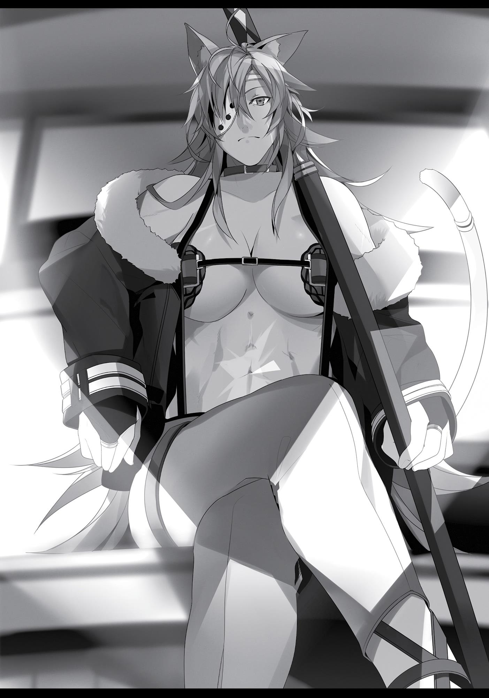

+++
title = "Chapter 11 Parted"
date = 2026-07-20
weight = 11
[extra]
volume = 1
chapter = 12
+++
One morning, maybe a month after I told Paul that I
wanted to start working, a letter addressed to him arrived at our
home.
It was probably the reply that I’d been waiting for. I tried my
best to brace myself for the news without getting too impatient.
Would he tell me after training? At lunch? Maybe dinner?
For the moment, I decided to focus on our sword practice.
As it happened, though, he chose to bring it up before we’d
even finished training.
“Hey, Rudy.”
“Yes, Father? What is it?”
Trying to keep my face composed, I waited eagerly for Paul’s
next words. This was going to be my first job ever… in either life. I
had to nail this.
But instead of giving me the good news I was expecting, Paul
took things in a strange direction.
“Tell me something. What would you do if I said you had to stop
seeing Sylphie for a while?”
“What? Uh, I’d object, obviously…”
“Right, right. Figures.”
“What’s this about?”
“Ah, forget it. No point talking this over. You’d just twist it all
around on me, I’m sure.”

The instant these words left Paul’s mouth, his expression
changed dramatically. All of a sudden, there was murder in his eyes.
Even an amateur like me could sense what was coming next.
“Wha—?!”
“…!”
In one smooth, intimidating motion, my father leapt forward.
Death was rushing straight at me, cold and silent.
Acting on pure instinct, I responded with all the power at my
disposal—using fire and wind magic simultaneously to create a blast
between us. I jumped backwards just as the wave of hot wind struck
me, letting the impact carry me farther.
As it happened, I’d played out this scenario in my mind more
than once. In a fight against Paul, I had no chance unless I put some
distance between us at the start. The blast would hurt me as much
as him, but as long as I took the damage without flinching, it would
buy me a bit of space.
Only a bit, of course.
My totally unscathed father was still running forward, his body
low to the ground.
Didn’t do a damn thing to him!
I hadn’t expected anything else, but it was still terrifying. I
needed to make my next move, and fast.
Just backing up wouldn’t work. The guy running forward would
always be faster. Acting on a reflexive judgment call, I set off a
shockwave right next to myself. The blow hit me hard enough to
send me flying to the side.
In that same instant, I heard something slice through the air
next to my ear, and my blood ran cold. Paul’s sword had slashed
through the space where my head had been a split second earlier.
Well. That’s good, I guess…

I’d dodged the first attack. That was a very big deal. He was still
close, but I’d put a little distance between us.
I started seeing some possibility I might win this.
As Paul turned toward me to press the attack, I cast a spell that
turned the ground in front of him into a sinkhole. His leading foot
stepped right into the trap.
He instantly shifted his body’s entire weight onto his other leg
and freed himself—barely even missing a beat.
Damn! Do I need to catch both his legs at once?!
This time, I transformed the ground around me into a thick,
watery bog. Before I could sink into it, I fired a small jet of water at
the ground in front of me, sending myself gliding backward across
the surface.
By the time I realized that I wasn’t moving fast enough, it was
too late. Paul reached the edge of my little swamp and took one
great bound forward. The force of his stride actually left a small
crater in the ground.
The man was going to reach me in a single leap.
“Aaaaaah!”
I swung my sword in a blind panic, trying to intercept him. It was
an ugly, careless attack, nothing like the strikes I’d learned.
The grip of my sword wobbled unpleasantly in my hands as my
blow was gently turned aside. I could tell Paul had used a Water God
Style defense…for all the good it did me.
Once a Water God swordsman deflects your blow, they always
follow up with a counterstrike. I knew what was coming, but I
couldn’t do a thing about it.
Paul’s blade arced toward me for a moment that lasted an
eternity.
Well, I’m glad we’re using wooden swords, at least…

A short, sharp blow to my neck knocked me instantly
unconscious.
When I woke up, I found myself inside a box of some sort. Given
all the swaying and clattering going on, it was presumably some kind
of vehicle.
I tried to sit up, only to discover that I couldn’t move at all.
Looking down, I realized I was tightly bound in… quite a lot of rope.
What the hell is going on here?
I managed to turn my neck enough to look around, and saw
there was a woman in there with me. She had dark brown skin, a
muscular body covered in scars, and skimpy leather clothes that
didn’t leave much to the imagination. The strong features of her
face, combined with the eyepatch she was wearing, gave her a
definite tough-guy vibe.
Pretty much the picture of a fearless female warrior from some
fantasy show… especially given those big, furry ears and tiger-like
tail.
Apparently sensing my eyes on her, the woman glanced down at
me.
“Nice to meet you,” I said. “My name’s Rudeus Greyrat. Pardon
my manners—I can’t seem to get up at the moment.”
A preemptive introduction felt like the right move. The most
basic rule of conversation was to start talking first. Once you seized
the initiative, you could control where things went from there.
“For Paul’s son, you’re oddly polite.”
“I’m my mother’s son as well, as it happens.”

“Ah, right. Guess you’ve got some Zenith in you, too.”
Apparently, she knew both of my parents. That was something
of a relief.
“The name’s Ghislaine. We’ll be getting very well acquainted
starting tomorrow, kid.”
Starting tomorrow? What?
“Uhm, well, okay. Nice to meet you, Ghislaine.”
“Yeah. Same here.”

At this point, I went ahead and burned away the ropes around
me with a bit of fire magic.
My body was sore as hell. That wasn’t too surprising, since I
hadn’t been sleeping in the most comfortable of places. I stretched
out my arms and legs and reveled in the blissful sense of release.
Sure, I’d spent most of my previous life sitting in a cramped little
room moving nothing but my fingers, but that didn’t mean I wanted
to spend so much time lying bound and helpless at the feet of some
sadistic-looking older lady. Might have gotten a little uncomfortable
after a while.
There were benches to the front and rear of our little “box,” so I
sat down across from Ghislaine. Windows to the left and right
offered a view of the world outside; nothing I saw outside looked
remotely familiar.
Okay, so this was definitely a vehicle.
It was swaying so vigorously that I was a little worried I might
get sick, and I could hear a sort of clopping coming from the direction
we were moving in. Seemed reasonable to assume it was a horsedrawn carriage.
Right. So. I was taking a carriage ride with some macho lady, for
reasons totally unclear to me.
Gah! H-have I been kidnapped by some wanton woman
weightlifter?! Did she steal the cutest boy in all the land to be her sex
slave?
Please, have mercy! I…I sorta dig girls with muscles, yes… but
I’ve already pledged my heart to Sylphie!
Well… if you must do it… be gentle with me, pwease…
Wait. Wait, wait. Bad thoughts.
C-c-calm down, dumbass. At times like these, a man’s gotta
stay cool! Count off prime numbers in your head until you relax!
Remember what that one priest guy said. “The primes are solitary

numbers, divisible only by one and themselves… they give me
strength!”
Three. Five. Uhm…eleven. Thirteen…? Uh, er… I can’t
remember, damn it!
Okay, screw the prime numbers. Just calm down, dude. Think
through this calmly. You need to figure out what’s going on here.
Deep breaths. Deeeeeep breaths.
“Hooo… haaaa…”
Attaboy. Now then, let’s piece this together as best we can.
First of all, Paul had attacked me for no apparent reason and
knocked me senseless. And when I’d woken up, I’d found myself
inside a carriage, bound hand and foot. Presumably, he’d KO’d me
for some specific reason and then tossed me in here.
The only other person in said carriage was a macho lady who
said we’d be getting “acquainted” starting tomorrow. Come to think
of it…Paul also said something strange right before he attacked me.
Something like, “Stop seeing Sylphie.”
Or maybe, “Sylphie’s too good for the likes of you.”
Or maybe, ‘Sylphie’s mine now, kiddo!’
Th-that scumbag pedo! Does his lust know no bounds?!
Wait, I think I just made up those last two. Hmm.
It was hard to think straight where Sylphie was concerned. I’d
gotten completely derailed in no time at all. Damn it. This is all Paul’s
fault… Ah, well, guess I’ll just have to ask.
“Uhm, Miss?”
“You can call me Ghislaine.”
“Oh, okay. In that case, you can call me Ruru.”
“Sure thing, Ruru.”

Right. So, the woman clearly didn’t know a joke when she heard
one.
“Miss Ghislaine, did my father tell you what’s going on here?”
“Just Ghislaine, kid. No miss required.”
As she spoke, Ghislaine reached into her jacket to retrieve a
letter and handed it over to me. The front of it was completely blank.
“That’s for you, from Paul. Read it out loud, will you? I’m not so
good with writing.”
“Okay.”
Opening up the sloppily folded piece of paper, I began to read.
“To my dear son Rudeus. If you’re reading this letter, it means that
I’m no longer in this world.”
“What, what?!” Ghislaine shouted, jumping to her feet.
Good thing this carriage had a high ceiling.
“Please sit down, Ghislaine. There’s more.”
“Hm. Right…”
Just like that, she sat right back down.
“Sorry, just kidding! I always wanted to try that one out on
somebody.
“So, anyway. I knocked you down into the dirt, tied you up, and
tossed you into a carriage like a bandit kidnapping a princess. I
expect you’re wondering what the hell is going on, hey? Ideally, that
ball of muscle in there with you would just explain everything…but
sadly, her brain mutated into an extra bicep some time ago, so I don’t
think that’s going to work.”
“What was that?!” Ghislaine shouted, jumping to her feet again.
“Please sit down, Ghislaine. The next part’s nothing but
compliments.”
“Hm. Right.”

Right back down she went. Okay then, moving on.
“That woman’s a Sword King. When it comes to the blade, you
won’t find a better teacher this side of the Sword Sanctum. Trust your
old man on this one: She’s really damn good. I never once got the
upper hand on her…except in bed.”
Dad. Please. Could you not have just left that last part out?
Ghislaine didn’t exactly look displeased, though. The old man
was certainly popular with the ladies.
Anyway…I was evidently travelling with one hell of a fighter.
“Now then, let’s move on to your job. You’re going to be
tutoring a young lady in Roa, the biggest city in the Fittoa Region.
Teach her reading, writing, math, and some basic magic, all right?
The girl’s a spoiled, violent brat who was asked to leave her school,
and she’s already chased off a number of other tutors. But I’ve got
faith in you, kiddo! I’m sure you’ll manage somehow.”
Wow. Very helpful, Paul.
“Uh… y-you don’t really look spoiled, Ghislaine…”
“I’m not the young lady in question.”
“Right. Of course.”
Okay, let’s keep moving.
“That lump of muscle with you works for the young lady’s
family as a bodyguard and swordsmanship instructor. In exchange for
training you in the sword, she wants you to teach her reading,
writing, and arithmetic as well. I know, it’s a ridiculous request
coming from a woman with a bicep-brain, but try not to laugh out
loud. She’s probably serious.”
“That son of a…”
Was I seeing things, or was that a vein throbbing on Ghislaine’s
forehead? The main purpose of this letter was to explain the
situation to me, but Paul’s secondary goal was clearly to piss her off.
Made me kind of curious about the nature of their relationship.

“She won’t be a quick learner, I’m sure, but it’s not such a bad
deal. You won’t have to pay for your lessons, at least.”
My lessons, huh? Right. I guess she was my new instructor from
now on…
Paul’s swordsmanship was mostly instinct-based. Maybe he felt
I needed a better teacher at this point. Or maybe he’d just gotten
sick of watching me not improve at all.
I think you could have stuck it out a little longer, man…
“How much would it usually cost to learn the sword from you,
Ghislaine?”
“Two gold Asuran coins per month.”
Say what?! I was pretty sure that Roxy had earned five silver
coins a month back when she was tutoring me. This lady charged
about four times more.
This was really a pretty solid deal, then. A normal person in
Asura could get by on about two silver coins a month.
“For the next five years, you’ll be staying at the young lady’s
house to teach her. Five whole years, you got that? You don’t get to
come back home until then. And no writing letters, either. Sylphie’s
never going to learn how to stand on her own two feet if you keep
hanging around the village. And you were growing increasingly
reliant on her, as well. That’s why I made the call to separate the two
of you.”
“Wait… what?”
H-hold on a second. What?
Are you serious? I can’t see Sylphie for five whole years? I can’t
even write her letters?!
“What’s the matter, Ruru? Did you break up with your
girlfriend?” Ghislaine asked, apparently amused by the look of
despair on my face.
“No. My childish bully of a father broke us up by force.”

I hadn’t even had a chance to say goodbye. Damn it, Paul. You’ll
pay for this…
“Hang in there, Ruru. It’ll be okay.”
“Uhm…”
“What?”
“I think I’d rather you just called me Rudeus, actually.”
“Hmm. All right, then.”
When I really thought about it, though, Paul had a point. At the
rate things were going, Sylphie might have turned into a “childhood
friend” character from a particularly shitty visual novel. You
know…the kind who sticks to the protagonist constantly, revolving
around him like a satellite, and never develops a personality of her
own.
In the real world, a girl like that would make her own friends
and learn about new things at school. But thanks to her hair, Sylphie
was always going to have a tough time with that. There was a real
chance she would have stayed glued to my side for years and years. I
wouldn’t really have minded, but the adults involved felt differently.
This made sense. Paul had made the right call this time.
“As for your compensation, you’ll be paid two silver Asuran
coins a month. That’s below the going rate for a live-in tutor, but it’s
more than enough for a child’s allowance. When you have a little
spare time, try to head out into the city and get a feel for spending
money. A little practice is the best way to make sure you can use your
cash effectively when you really need to. Then again, maybe that
won’t even be an issue for a kid as gifted as you. Just don’t go buying
any women, though. You got that?”
Seriously, man. You could just leave that part out!
What, was he trying some sort of reverse psychology here? Like,
‘Don’t hit up any brothels, son! Wink wink, nudge nudge’?

“Additionally, once you complete five years of consistent
service and finish providing the young lady with a solid education in
all respects, your contract entitles you to a special reward: a payment
covering the cost of tuition for two people to the University of
Magic.”
Hrm. I see.
In other words, once I did my time as a tutor, Paul was going to
let me do what I wanted…just as he’d promised.
“Of course, there’s no guarantee Sylphie will want to tag along
with you five years from now, and you might lose interest in her
yourself. But in any case, I’ll make sure to explain the situation
perfectly to her.”
Uh…not sure I trust you on that one, daddy dearest.
“I hope the years you spend in this new environment will teach
you many things, allowing you to develop your talents even further.
Sincerely, your noble, wise, and brilliant father, Paul.”
Brilliant my ass! Your whole plan was just to beat me into
submission!
Still, I had to admit his overall line of thinking was pretty solid.
This was for the best, for both Sylphie and me. She might go back to
being a loner again, but…unless she learned to face her own
problems, she was never really going to grow as a person.
“Paul really loves you, doesn’t he?” Ghislaine said.
I couldn’t help smiling a little at that one.
“He used to be kind of distant, but he started really getting into
the whole fatherhood thing. Anyway, seems like he’s pretty fond of
you as well, Ghislaine…”
“Hm? Why d’you say that?”
I proceeded to read the letter’s final line out loud.
“P.S. Feel free to make a move on the young lady as long as it’s
consensual, but that ball of muscle’s already mine, so hands off.”

“Hmm,” Ghislaine said. “Send that letter on to Zenith for me,
will you?”
“Sounds like a plan.”
Just like that, I found myself travelling to the Citadel of Roa, the
largest settlement in the Fittoa Region.
I had some mixed feelings about that, of course, but it really was
for the best. I couldn’t just stay with Sylphie, so this was something
that needed to happen.
I definitely wasn’t bitter about it at all. Nope.
Man. I wish I could go see her once a year or so, at least…
Well… maybe I’d manage to convince myself of that at some
point. I just wasn’t quite there yet.
Paul

“D-damn, that was close…”
My son lay unconscious on the ground before my filthy, mudcaked shoes.
Since this would be my last day teaching him the sword, I’d
decided to put the fear of God in him before I knocked
him out, but the kid actually snapped off a bunch of spells the
instant I made my move. Wasn’t just a bunch of panicked attacks,
either. He was mainly trying to slow me down. And every single time
he cast something, it was a different spell.
“That’s my son for you, all right. Kid’s got a knack for battle…”
Sure, the fight had only lasted a few seconds. But it was a
complete surprise attack, and I still needed three steps to take him
down. That last one had been especially dangerous. If I’d hesitated

even slightly, he would have snared both my legs and taken me out
in no time.
Three steps was just too many when you’re fighting a magician.
If he’d been in a group, one of his allies would have stepped in to
protect him by the time I’d taken my second stride. And if there’d
been just a bit more distance between us, I might have needed four
steps.
For all intents and purposes, the kid got the best of me. You
could probably toss him into a party of adventurers right now. He’d
more than pull his own weight in a labyrinth.
“Guess you’d expect no less from the prodigy who gave a Water
Saint-tier magician an inferiority complex…”
The boy was downright terrifying. But for some reason, that
made me happy. Up until now, I’d been jealous of anyone more
talented than me…but where my son was concerned, all I felt was
pride.
“Okay, this isn’t the time to be talking to myself. Let’s get this
done before Laws makes it over here…”
I quickly proceeded to tie up my son. The carriage had arrived by
the time I finished, so I picked him up and prepared to toss him into
it.
Of course, Laws picked that moment to show up with Sylphie in
tow.
“Rudy?!”
Seeing her playmate bound hand and foot, the girl immediately
fired off an Intermediate-tier offensive spell at me without so much
as an incantation. I warded it off easily enough, but on top of the
silent spellcasting, the attack’s power and speed were both
impressive. She could easily have killed a normal person.
Damn it, Rudeus. Don’t go teaching her that crap…

After handing Ghislaine my letter, I unceremoniously dumped
Rudeus in the carriage and let the coachman know he was good to
go. Glancing over, I saw Laws crouched next to Sylphie, speaking to
her firmly but quietly.
Yeah, that’s the way. It’s the parent’s job to teach their kid
what’s what.
Laws had allowed Rudeus to take over many of his duties, but
now he’d get the chance to reclaim his rightful role. Exhaling quietly,
I watched the little family conference from a distance; after a
moment, the wind carried Sylphie’s voice over to me.
“No… I’ll get strong enough to help Rudy!”
Hmm. That girl really adores you, son of mine.
At this point, my two wives emerged from the house. I’d told
them to stay inside if they wanted to watch, mostly for their own
safety. But I suppose they wanted to see the boy off, at least.
“Oh, my sweet little Rudy’s leaving me!”
“Be brave, Madam. This is a trial we must endure!”
“I know, Lilia. I know! Oh, Rudeus, Rudeus! My little son is riding
off! He’s left his poor mother all alone. Woe is me!”
“You’re not alone, Madam. He’s not your only child!”
“You’re right, of course. He has two little sisters now.”
“Two?! Oh, Madam!”
“Of course, Lilia. I’ll love your child as much as mine!
As much as I love you!”
“Oh, Madam! I feel just the same!”
For some reason, Zenith and Lilia acted out a weirdly theatrical
scene as the carriage set off down the road. I suppose they weren’t
really too worried about Rudeus.
The kid had a solid head on his shoulders, after all.

In any case…those two sure do get along these days. Wish
they’d be that friendly with Daddy, too. Or at least stop ganging up
on me.
“Still… I guess Rudeus won’t be around to watch the little ones
grow up, huh?”
I knew he’d been planning to become the “best big brother
ever,” but things weren’t going to work out that way.
Tough luck, kid. Daddy’s going to get all his little daughters’
love! Eheheheh.
Hm. Wait a second, though.
Rudeus was about to start special, accelerated training under a
Sword King. Five years from now, he would be twelve. Much bigger
and stronger than he was now. If we had another anything-goes
scrap when he came back, was I even going to stand a chance?
Oh, man. My paternal dignity was on the line.
“Zenith, dear? Lilia? Now that Rudy’s left us, I think I’ll have to
start training a bit as well.”
Zenith glanced at me with a disinterested expression. Lilia
leaned over to stage-whisper in her ear. “Did it really take a near loss
to make him realize that the young master might soon surpass him?”
“Honestly, he’s always like this. Never puts a bit of effort in until
someone nearly embarrasses him.”
Apparently, I was already somewhat lacking in the paternal
dignity department.
Ah well. What’s dignity good for, anyway? My old man was a
walking lump of pride and nobility, and I was never exactly fond of
him. I wanted to be a friendly, lovable kind of father, not a dignified
one.

So for now, I’d just keep pretending to be a good-for-nothing
guy with a weakness for the ladies. Until my three kids were all
grown up, at least…
At this point, I glanced at Zenith out of the corner of my eye.
Damn, that’s a nice body. You’d never know she’s already had
two kids… Maybe we could try for four or five? That’s one way to
earn myself an extension, I guess. Nheheh.
Well, there was time enough to think about that later.
Thoughts ran through my mind as Rudeus’s carriage rumbled off
down the road.
Rudeus… Believe me, this isn’t how I wanted to do this, either. I
don’t think you would have agreed to my plan, and I’m not sure I
could have convinced you in an argument.
Still… as your father, I couldn’t just do nothing. I’m basically
passing you off to someone else for now, but I think that’s how it has
to be.
I know I didn’t give you any choice, but I’m sure a clever kid like
you will understand. The experiences you’re going to have out there
wouldn’t have been possible in this village. Even if you don’t
understand my reasons, dealing with the challenges in front of you
will make you stronger in the end.
So resent me all you like. Resent me, and resent yourself for
letting me do this.
I grew up under my old man’s thumb myself, you know? Ended
up just running away, rather than ever facing up to him. I do regret
that to some degree. And I wish I’d done some things differently.
I don’t want you to feel that way, of course. But you know…
running away like that did make me stronger. I’m not sure if I’m
stronger than my dad was, but I found women I loved, protected the
things I cared about, and grew tough enough to put the screws on my
own kid.
You want to fight back? Fine by me. Have at it.

Come back stronger, kid. Strong enough to stand up to your
tyrant of a dad.
