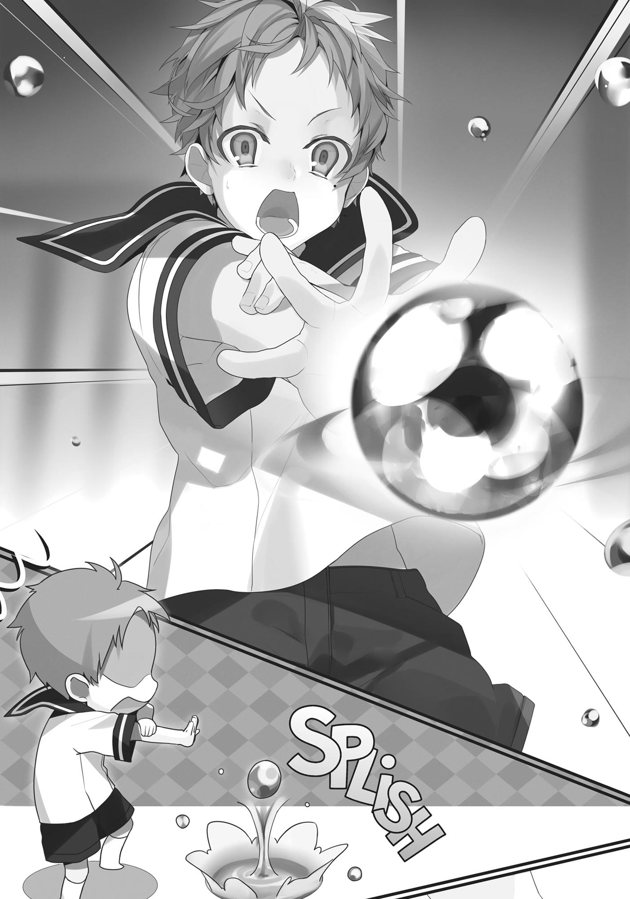

+++
title = "Chapter 3 A Textbook Of Magic"
date = 2026-07-20
weight = 3
[extra]
volume = 1
chapter = 4
+++
It had been roughly two years since I’d been reincarnated.
My legs had finally developed enough that I could walk.
Also, I was finally able to speak this world’s language.
***
Having decided to give my life an honest shot this time, I first
needed to make a plan.
What had I lacked in my previous life? Study, exercise, and
technique, that’s what.
As a baby, however, there wasn’t much I could do. Nothing
much beyond burying my face in someone’s chest when I was picked
up, anyway. Whenever I did that to the maid, she made no attempt
to mask the displeasure on her face; clearly, she wasn’t a fan of
children.
Figuring that exercise was something that could wait, I began
learning to read books around the house. The study of language is a
crucial thing; almost one hundred percent of Japanese people are
literate in their own language, but many of them neglect their study
of English or hesitate to interact with people when abroad, so much
so that the ability to speak a foreign language is a valued skill. With
that in mind, I decided to make this world’s writing system my first
subject.
There were only five books in our house. I didn’t know if that
was because books were expensive in this world or because Paul and
Zenith weren’t big readers. Probably some combination of both. As
someone who used to own a collection of several thousand books—

even if they were all light novels—the situation was tough to come to
grips with.
Still, even five books were enough material to learn how to
read. The language of this world was close to Japanese, so I was able
to pick it up quickly enough. The written characters were completely
different, but the grammar was close to what I was familiar with,
which thankfully meant I mostly needed to learn vocabulary, a good
chunk of which I’d already been exposed to. My father would read to
me, which allowed me to readily pick up words. My new self being
better at learning things probably had something to do with it, too.
Once I could read, I found the contents of our books pretty
interesting. I’d never had fun studying at any point in my life before,
but after some thought, I realized it wasn’t that different from
hunting down new information about online games. And that wasn’t
so bad.
Anyway, I wondered if my father knew that his infant son
understood the things he was reading. I mean, I was cool with it, but
I figured a normal kid my age would throw a temper tantrum or
something, so that’s just what I did.
These were the five books in our house:
Wandering the World, a reference guide to the various countries
of the world and their unique characteristics.
The Ecology and Weaknesses of Fittoan Monsters, which
detailed the various monstrous creatures of the Fittoa Region, where
they lived, and how to deal with them.
A Textbook of Magic, a wizard’s manual of attack spells, ranging
from the Beginner to Advanced levels.
The Legend of Perugius, a fairytale about a summoner named
Perugius and his companions, who battle a demon and save the
world in a classic good-versus-evil epic.

The Three Swordsmen and the Labyrinth, a tale of action and
adventure where three master swordsmen of different styles meet
and head into the depths of the titular labyrinth.
Those last two were essentially fantasy novels, but the other
three made for good study. It was A Textbook of Magic that
particularly drew my attention. As someone who came from a world
without magic, the chance to read actual documentation on it was
very relevant to my interests. Reading the book taught me some of
the fundamentals.
First, magic came in three types: Attack magic, to do battle
against others; Healing magic, to treat the wounds of others; and
Summoning magic, to call things forth. And that was it. There
seemed to be lots of other things you could do with magic, but
according to the textbook, magic was something birthed and
developed in battle, and therefore not used much outside of combat
or hunting.
Second, you needed magical power in order to use magic—
meaning, anyone could use magic so long as they had magical power.
There were chiefly two ways of doing this: using one’s innate magical
power or drawing on the magical power imbued in an object. Either
would suffice. There weren’t specific examples, but I got the
impression that people who did the former were like their own
power generators, whereas the second type had to use batteries.
In days of yore, the book said, people had largely used the
power within their own bodies for magic. But as research on magic
progressed, things got more and more complex. Accordingly,
expendable sources of magical energy were developed at an
explosive rate. People with strong magical reserves had been able to
make do, but those who had little power couldn’t cast even basic
spells, and so the old magical masters developed ways to draw
power from things other than themselves and channel that into
magic.

Third, there were two ways of performing magic: incantation
and magic circles. This didn’t need too much explanation: It simply
referred to reciting words or inscribing mystic patterns to cast a
spell, respectively. In the old days, magic circles were the chief
source of magical power, but in modern times, incantations were far
more commonplace. In older times, even the shortest magical
incantations took one or two minutes—not exactly something you
could use in the heat of battle. But once you’d inscribed a magic
circle, you could use it over and over again.
Incantations started becoming the norm when one magician
succeeded at greatly shortening them. The simplest such
incantations were reduced to around five seconds, and consequently
became the only way people utilized Attack magic. For the more
complex rituals involved in Summoning magic, where greater
efficiency wasn’t attainable, magic circles remained the primary
means.
Four, the amount of magical power someone had was pretty
much determined at birth. In your typical RPG, you gain more MP as
you level up, but things didn’t work that way in this world. Almost
everyone was stuck where they were.
Almost everyone, which implied that some people changed over
time. I wondered which group I’d fall into.
The book also said that one’s level of magical power was
inherited. I knew my mother was able to use Healing magic, so
maybe it was all right to have some expectations for myself. Still, I
was uneasy. Even if my parents excelled at this sort of thing, I wasn’t
sure my own genes would be up to the task.
***

For the time being, I decided to try my hand at the simplest
magic I could. The textbook included both incantations and magic
circle spells. Since the former was now mainstream, and I had
nothing to draw a magic circle with, I opted to start by studying the
incantations. As I understood it, as the scope of a spell got larger, the
invocations involved got longer, until you eventually needed to use a
magic circle in concert. But if I was starting out with simpler things, I
ought to be fine.
The most proficient of wizards, the book said, could cast spells
without incanting anything at all—or drastically shorten the incanting
time at the very least. I wasn’t sure why training allowed people to
circumvent the incantation, though. After all, the amount of
someone’s magical power didn’t change; there was no leveling up
and no corresponding increase to maximum MP. Maybe with
training, the amount of MP spent on the spell decreased? But
spending less MP wouldn’t make the process less involved, would it?
Well, anyway. Whatever the case, I just needed to give it a shot.
With A Textbook of Magic in my left hand, I held out my right
and began to recite the words.
“Let the vast and blessed waters converge where thou wilt and
issue forth a single pure stream thereof— Waterball!”
I felt a sensation like blood pooling in my right hand, and then,
as if that blood had extruded through my palm, a sphere of water
about the size of my fist manifested itself.
“Gah!” I yelped at the strange feeling, and a moment later, the
ball of water fell and splattered onto the floor.
It looked like concentration was required in order to maintain a
spell.
Concentrate… Concentrate…
I could feel the blood welling in my hand once more. That’s it.
There we go. Yeah, this feels right. Once again, I held out my right

hand, forming an image in my head as I recalled how things had gone
the last time. I wasn’t sure how much magical power I had, but I
figured that I couldn’t just keep using it over and over.
My plan was to practice one thing at a time until I could pull it
off. I would form the image in my mind and play it out, over and
over, and try to enact it upon reality. If I tripped up, I would call that
image back to mind until I had it perfectly emblazoned within my
head.
This was the same way I’d practiced combos in fighting games,
back in my previous life. Thanks to that, I almost never screwed up a
combo during a real match. Hopefully that meant my training
methodology would be sound here, too.
I drew a deep breath. My blood coursed through my body, from
my toes to the top of my head, collecting in my right hand, filling it
with power. Then, I felt that power pop into being before my palm.
Now, bit by bit, so very, very carefully, my thoughts fell in line with
the beating of my heart.
Waterball, ball of water, water, wetness, wet…wet panties…
Whoops. That kinda just slipped in there. Getting back to it,
then…
I buckled down, and set my mind to it: water, water water
waterwaterwater—
“Hah!” I cried out in pure reflex as my hand shot out before me,
fingers spread. In that instant, the ball of water came into being.
“Whoa, what?”
Splish.
In my moment of shock, the ball of water plopped to the floor.

“Wait.” I hadn’t shouted an invocation, had I? But then… why?
All I’d done was put myself into the same mental space as the last
time I’d tried the spell. Did incantation not matter much when
reproducing the flow of magical power?
Was using magic without chanting really that easy? That had to
be a high-level skill, right? “If it’s that easy, what’s the point of the
incantation at all?” I mused aloud. Here I was, a complete beginner,
and I’d successfully pulled off a spell without any words at all. I’d
simply focused the magical energy of my body in the front of my
mind and then willed it to take shape.
That’s all it was. Which implied that the incantation wasn’t really
necessary after all. Anyone could do what I’d just done.
Hmm. Perhaps the incantation was an activation trigger for the
spell, where uttering the words would create the effect without
having to focus on the energy coursing through your body. That had
to be what it was. Sort of like the difference between manual and
automatic transmissions in a car, where you could still take manual
control if you really wanted to.
“Using an incantation allows magical effects to trigger
automatically.”
This had some huge advantages. First, it made for easy teaching.
Rather than needing a convoluted explanation about feeling the
blood coursing through your veins converging and all that, casting a
spell by chanting words was both easier to explain and easier to
understand. And then, as one’s studies progressed, the idea of the
incantation being an indispensable part of the process would
naturally take root.
The second advantage was that incantations were easy to use.
Attack magic, by its very nature, was something that needed to be
done in the heat of battle. It was a lot faster to rattle off a chant than
it was to close your eyes and stand there humming as you tried to

concentrate. Also, in the heat of the moment, it was far easier to
blurt something out than it was to go through a series of minute
gestures.
“But maybe some people do find the first option easier…”
I flipped through the book, but there was nothing about casting
spells without incantation. That was odd. What I’d just done hadn’t
been all that difficult.
Maybe I had some kind of special talent, but I doubted it was
something that others weren’t able to tap into at all, I reasoned. A
magician typically used incantations from when they were a beginner
to when they became a master. After casting thousands or even tens
of thousands of spells, the body grew accustomed to the incanting;
even if they did try to cast a spell wordlessly, they wouldn’t know
how. Therefore, it wasn’t something that was ordinarily done, and
hence the book said nothing of it.
“Yeah, that does make sense!” After all, I was hardly ordinary
myself. That was cool, right? Sorta like having a sneaky trick up my
sleeves. “Did she just activate the Crime Catalyst without an
Oratorio?” “But that catalyst is usually just supposed to open up the
channel!”
Oh, now I sure was interested!
Okay, okay. No getting ahead of myself. I needed to calm down
and keep my cool. My past self had gotten all caught up in this
feeling, too, and we know how he turned out: someone who puffed
himself up because he was better with computers than the average
person, then got way too cocky and failed hard at life.
I needed to keep a level head. Restrain myself. The important
thing here was not to think of myself as being better than other
people. I was just a beginner. A n00b. I was like a novice bowler who
just happened to land a strike on my first toss through dumb luck.

Beginner’s luck—that’s all it was. I needed to buckle down and focus
on studying instead of mistaking this for some sort of innate knack.
All right. I had it: I’d first attempt a spell by chanting the
incantation, then practice single-mindedly by mimicking how it felt
without using the incantation.
“Okay, let’s try this again,” I said, holding my right hand out in
front of me. My arm felt vaguely heavy, and my shoulder like I had
something big weighing it down. This was exhaustion. Had I been
concentrating too hard?
No, that couldn’t be right. I was a (self-styled) low-end MMO
master who could go without sleep for six days when grinding. No
way had this paltry mental exertion drained me that much.
“Am I out of MP, then?” What the heck? If someone’s magical
power was determined at birth, did that mean I only had enough MP
to cast two Waterball spells? That seemed way too low. Or maybe
since this was my first time, I just had less magical power to work
with? No, that didn’t make sense.
I tried once more, just to make sure, and I wound up passing
out.
***
“Honestly, Rudy,” my mother said, “when you get tired, you
need to go to the toilet first and then get to bed.”
I woke to find I’d fallen asleep with the book in hand, and wet
myself in the meantime. Dammit. I couldn’t believe I’d wet myself at
my age. That was humiliating.
Dammit. How could I—
Wait. I was only two years old, right? Wetting myself was still
forgivable at that age, yeah?

So, it seemed my magical power had been too low after all. That
deflated my mood some. Still, even if all I could muster was two
Waterballs, what mattered was how I used them, I supposed. Maybe
I should concentrate on conjuring them more quickly?
Ugh.
***
The next day, I still felt fine after conjuring my fourth Waterball.
It was after the fifth that I started to feel tired.
“What the hell?”
Given my experience the day before, I knew that casting
another would cause me to black out, so I decided to stop.
And then it hit me: That put my limit at six Waterballs—twice
what I’d managed yesterday. I stared into the bucket that held five
spells’ worth of water and wondered why I’d been able to do twice
as much as the day before. Had I been more tired because it was my
first time? Had the spells consumed more MP because it was my first
time casting them?
I’d cast all my spells today without incantations, so I doubted it
had anything to do with that. I had no idea. Perhaps my abilities
would grow further the next day.
***
The following day, my Waterball count increased significantly.
Now I was up to eleven.

What was the deal? It felt like the more I used the spell, the
more I was able to use it. If I was right, I would be able to pull off
twenty-one the next day.
The day after that, just to be on the safe side, I only cast five
before calling it a day.
The day after that, though, I managed twenty-six. It looked like I
was right—using the spell more frequently did allow me to cast it
more.
I’d been lied to! What was all that stuff about a person’s magical
reserves being set at birth? People were just assigning limitations to
talent when it didn’t have any. How dare adults tell children where
their limits were?! “Guess I can’t take what this book says at face
value, then,” I muttered. The stuff written in the book seemed to
take the perspective that there were limits on what a person could
achieve.
Or maybe it was talking about how things worked after training
one’s skills? Perhaps the book was saying that there was an upper
limit on magical power that no further amount of effort and training
could get you past.
No. It was still too soon to come to that conclusion. For now,
that would just be a hypothesis. Maybe it was like…maybe
someone’s power increased as they grew, or something. And using
magic during childhood might rapidly cause that upper limit to
increase. Which meant I alone had a special quality that—no. I’d
already said I wouldn’t consider myself special.
In my former world, they said that exercising while you were
growing let your abilities develop more rapidly; conversely, after you
were done growing, improvement only went so far even with intense
effort. We might be talking about magic in this world, but the
realities of how the human body worked couldn’t be that different.
The principle was still the same.

Which meant there was only one thing for me to do: continue
honing my skills as best I could while I was still growing up.
***
The next day, I decided that I would continue to push my magic
to its limits daily, which increased how much I could use it. As I could
recreate the right feeling, casting a spell without an incantation was
easy enough. I hoped to master the Beginner spells for each branch
of magic before long.
By “Beginner spells,” I meant the most basic spells that could be
used for offense. This included spells like Waterball and Fireball, as
well as other even more entry-level spells.
Spells were broken up into seven levels of difficulty: Beginner,
Intermediate, Advanced, Saint, King, Imperial, and Divine. Typically,
magicians with training could use the Advanced spells from the
discipline of magic they focused on, but could only use Beginner or
Intermediate spells from the other schools. Once someone was able
to cast spells of a rank higher than Advanced, they were
acknowledged as a Fire Saint or Water Saint or whatever, depending
on their chosen branch.
Saint-tier magic. I kinda hoped to be that good someday. My
magic textbook, however, only included fire, water, wind, and earth
spells up to the Advanced level. Where was I ever going to learn
Saint-tier magic, then?
No—I shouldn’t dwell on that so much, I decided. In RPG M*ker,
if you start out by making all your strongest monsters first, odds are
it’s just going to be frustrating. You need to start with the low-level
stuff, like slimes.

Although I personally never managed to complete anything in
that game, even when I did start with slimes.
***
The Beginner-level water spells listed in the tome were as
follows:
Waterball: hurls a spherical projectile of water.
Water Shield: causes a spout of water to erupt from the ground,
forming a wall.
Water Arrow: launches a bolt of water roughly twenty
centimeters long at a target.
Ice Smash: strikes an opponent with a mound of ice.
Ice Blade: creates a sword made out of ice.
These were all Beginner spells, but the amount of magical
power they required was very different, taking somewhere roughly
between twice and twenty times as much as the basic Waterball
spell. For my fundamentals, I stuck to water magic; if I tried fire
magic, I might accidentally burn the house down.
Speaking of fire magic, the amount of magical energy you put
into a spell affected the temperature of the results, so it stood to
reason that Advanced ice spells worked the same way. But despite
the fact that the book claimed both Waterball and Water Arrow
were supposed to fly through the air, I wasn’t able to get them to do
that for some reason. I wasn’t sure why. Was I getting some part of
the spell wrong? I couldn’t really tell.
A Textbook of Magic did say something about the size and speed
of spells. Maybe, after conjuring my projectile, I needed to imbue it
with additional magical energy in order to control its movement?

I decided to give it a try. “Huh?” I murmured as my sphere of
water grew larger. “Whoa!”
And then: Splash!
“Oh…”
I’d dropped it on the floor again.
After that, I experimented with making the Waterball bigger and
smaller. I tried creating two Waterballs at once, then attempted to
change their sizes separately.
I discovered a few things, but still didn’t manage to make any of
my spells fly.
Fire and wind spells remained floating in the air, since they
weren’t subject to gravity, but they fizzled out and disappeared after
a while. I tried using the wind to move the hovering orbs of flame,
but I got the impression something wasn’t right with that.
Hmm…
***
Two months later, thanks to a mistake in my studies, I managed
to get a Waterball to fly. As a result, it finally became clear why
incantations were a key part of the process.
All incantations followed a similar process: spell genesis, size
determination, speed determination, and then activation. The caster
was the one who regulated those two intermediary steps before
completing the spell.
First, the caster called forth the shape of the spell they wished
to use. Next, there was a window of time where they could add
additional magical power to impact its size. Third, after the size had
been determined, there was another window for the caster to adjust

the spell’s velocity. Finally, the caster released the finished spell from
their hand.
That was how it worked…or at least how I understood it. The
trick was to add magical power in two discrete stages after the initial
casting. There was an order to it. Unless you did something to adjust
the spell’s size, you couldn’t move on to adjusting its speed. It made
sense that if you tried to change the spell’s speed first, you’d only
make it bigger and nothing more.
In that vein, when using a spell without incanting, the caster had
to hold that entire process in their head. That sounded like an
inconvenience, but it did shorten the time it took to infuse the spell
with power to affect its shape and speed. This allowed for a spell to
be cast a few seconds quicker.
I was also able to tweak the process of creating the initial spell.
For instance, this wasn’t listed in the book, but it was possible to
freeze a Waterball and turn it into an Iceball—that sort of thing. If I
kept up my studies, maybe I’d be able to pull off the Kaiser Phoenix
(heh!), or something like that.
Lots of things could work; it all just depended on what ideas
came to mind. This was starting to get fun!
Still, fundamentals were important. I needed to build up my
magical potential before I started experimenting.
I had two items on my training regimen now: increasing my
magical reserves and making silent spellcasting second nature.
Setting goals that were too grand upfront would only lead to
disappointment. The trick was to start small.
Okay, then. It was time to buckle down and do it. Every day from
that point on, I practiced my Beginner-tier spells until I was on the
verge of passing out from exhaustion.
