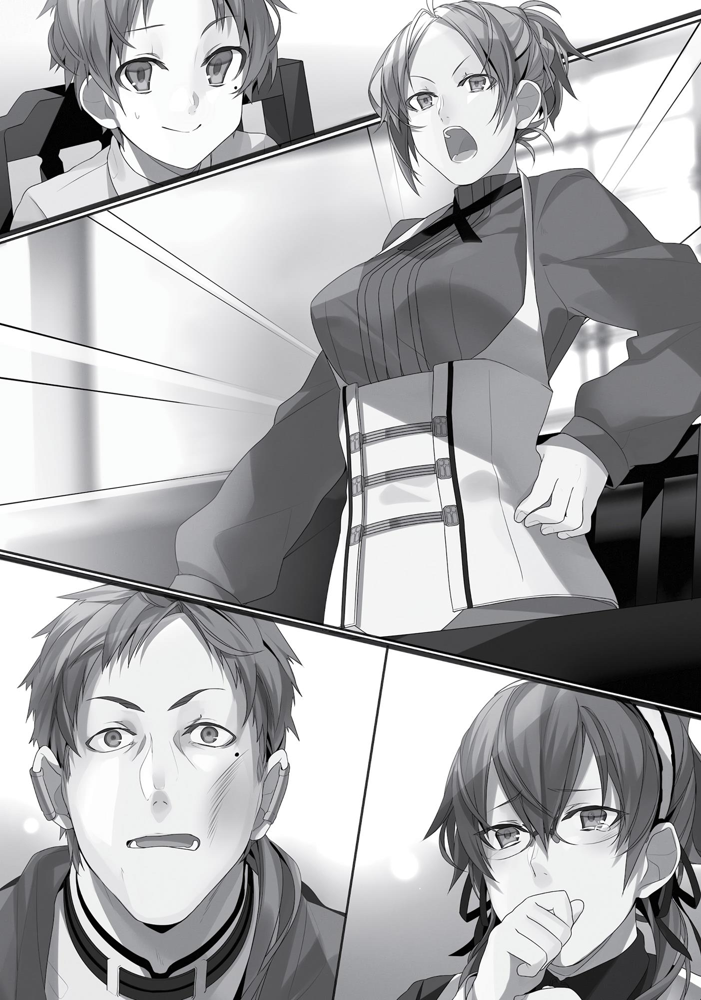

+++
title = "Chapter 9 Emergency Family Meeting"
date = 2026-07-20
weight = 9
[extra]
volume = 1
chapter = 10
+++
Zenith had learned she was pregnant. I was going to have a
little brother or sister. Our family was growing. Oh, Rudy, you lucky
guy!
For a few years now, Zenith had been worried about her
inability to conceive another child. I’d heard her mutter and sigh on
occasion about how maybe she couldn’t bear children anymore, but
about a month earlier, there was a shift in her food cravings, along
with nausea, vomiting, and a general sense of fatigue—in other
words, symptoms of classic morning sickness. The feelings were
familiar, and a trip to the doctor confirmed that her self-diagnosis
was almost certainly correct.
The Greyrat household was abuzz at the announcement. What
will we name the baby if it’s a boy? What will we name it if it’s a girl?
We still have rooms, right? Oh, we can use Rudy’s old clothes and
hand-me-downs. There was no end to the topics to be discussed.
It was a day of bubbling joy and countless smiles. I was honestly
very happy, hoping that I’d wind up with a little sister. A younger
brother might break all of my precious things (with a baseball bat).
The problems didn’t arise until about a month later.
Our maid, Lilia, had discovered that she was pregnant, as well.
“I’m so sorry,” she announced matter-of-factly to the family as
we sat at the table. “I’m pregnant.”
In that instant, the Greyrat family froze. Who was the father?
But, given the circumstances, nobody could bring themselves to ask.

Everyone had realized it on some level at least. Lilia was our
maid. She sent almost all of her pay back home to her family. Unlike
Paul, who frequently headed into town to help settle problems, or
Zenith, who helped out at the local clinic at certain times, Lilia almost
never left the house unless it was on work-related duties, and
nobody had heard rumors about her developing an especially close
relationship with anyone. Perhaps it had been a casual fling?
I knew the truth, though.
Ever since Zenith had gotten pregnant, Paul had been forced to
go without sex. And he was an especially lustful man who’d been
sneaking into Lilia’s room in the middle of the night. If I’d been an
actual kid, I would have thought they were just playing cards or
something.
Unfortunately, I knew all too well what was really going on. They
weren’t playing any game of Old Maid; there was playing around,
and there was a maid involved, but this was no mere round of cards.
Still, I wish they’d been more careful. Which is probably what
both of them were thinking, too.
Hello, boys and girls! The phrase of the day is “You can do it!”
Today we’ll be learning all about the importance of contraception!
Part of me wanted to say that to Paul with a completely
deadpan face, but I wasn’t sure if the concept of contraception was
even a thing in this world. And obviously it wasn’t like I wanted to
tear the whole family apart by spilling the beans. Also, if I messed
with the maid, I was pretty sure she’d never forgive me.
Besides, I owed Paul for helping me through that incident with
Sylphie. I’d let this one slide. Being a guy who all the chicks were hot
for seemed tough. If they suspected him, I’d cover for him. Heck, I’d
lie to give him an alibi if I had to.
Having come to that decision, I looked over at Paul, letting him
know with my eyes that he had nothing to worry about.

At the same time, however, Zenith shot a look right over at Paul,
her shocked assumption plain on her face.
Conveniently enough, our gazes both fell upon Paul as one,
bearing down on him.
“Uh, sorry,” he blurted. “This child is, uh…probably mine.”
Good grief. Really? Well, no; I suppose I should commend the
man for being honest. Seeing as how he constantly told me to “be
honest” and “be a real man” and “be sure to protect women” and
“never impugn your sense of honor” and other high-and-mighty stuff
like that day in and day out, the least he could do was practice what
he preached.
Well, whatever. I couldn’t say I hated him for it.
Anyway, this really was the worst-case scenario. That sentiment
solidified as I watched Zenith draw herself up to her full height, her
face livid, her hand rising into the air.
And thus was convened an emergency family meeting, with Lilia
included.
It was Zenith who first broke the silence. She had the authority
in this meeting. “So, what are we going to do?”
From what I could see, she was as calm as anything. Instead of
going into a fit of hysterics over how her husband had cheated on
her, she’d contented herself with a single smack. A red mark like a
maple leaf spread across Paul’s cheek.
“After I’ve assisted with the lady of the house’s birth,” Lilia said,
“I assume I would take my leave from your home.”

She seemed rather composed, too. Maybe this was a common
occurrence in this world? The maid becomes her employer’s
mistress; if people object, she just leaves the house.
A pitiful story like that would normally turn me on, but under
the circumstances, I didn’t so much as twitch. I still had principles.
Unlike Paul.
Paul was all huddled up in a corner. So much for paternal
dignity.
“What about the child?” Zenith asked.
“I was thinking I would give birth here in Fittoa, and then raise
the baby back in my hometown,” Lilia replied.
“You’re originally from the south, yes?”
“That’s right.”
“You’re going to be physically exhausted after the birth,” Zenith
said. “You’ll be in no condition to make a long journey.”
“Perhaps so, but I have nowhere else to turn.”
The Fittoa Region was in the northeastern part of the Asura
Kingdom. Based on my understanding, to reach what was considered
“the south” in this context took close to a month and required
switching between multiple stagecoaches. Still, that was a month
traveling through safe lands with good weather, and riding in
stagecoaches wasn’t terribly arduous.
That, however, was for a typical traveler. Lilia had no money.
She couldn’t afford to ride on stagecoaches, and would have go on
foot. Even if the Greyrats paid for her travel expenses, that didn’t
make it any less risky. She’d be a woman, traveling by herself, having
recently given birth. If I were a bad guy and spotted her, what would
I do?
I would attack her. She was an obvious sitting duck, practically
begging for someone to take a shot at her. Take the child hostage,

keep the mother distracted with empty promises. Meanwhile, take
all her money and possessions. I’d gathered that slavery was a thing
in this world, so in the end, I’d sell off both mother and child, and
that would be that.
Even if people said that the Asura Kingdom was the safest
nation in the world, that didn’t mean it was completely devoid of
evildoers. I bet there was still a high likelihood of them being
attacked.
And like Zenith had said, there was also the physical aspect to
consider. Even if Lilia did have the stamina to make it, what about
the child? Could a newborn handle a month-long journey like that?
Probably not.
Of course, if Lilia didn’t survive the journey, neither would the
child. Even if she simply fell ill, if she didn’t have money to see a
doctor, she was done for. I suddenly had the mental image of Lilia
lying dead in the midst of a blizzard, baby cradled in her arms. I, for
one, didn’t want to see her suffer that sort of fate.
“Dear,” Paul started to stay, “surely she could just sta—”
“You keep your mouth shut!” Zenith snapped, cutting him off.
He shrank like a scolded child. This was definitely one instance
where he had no right to speak. Paul was useless here.
Zenith chewed on her nails with a look of consternation. She
was clearly conflicted as well. She didn’t want Lilia to suffer; on the
contrary, the two were quite good friends. Considering how they’d
spent the last six years running this household together, it was
probably fair to say they were best friends.
Well, except for the part about how Lilia was now carrying Paul’s
child.
If Lilia had gotten pregnant because she was raped in some back
alley, Zenith would have unquestionably sheltered her, and allowed
her to—no, she would have insisted she raise the child in our home.

Based on the conversation, I surmised that abortion wasn’t
easily accessible in this world.
Zenith appeared to be grappling with two separate emotions:
her fondness for Lilia and her feelings of betrayal. Considering the
circumstances, I thought Zenith was pretty incredible for being able
to set aside her emotions about the latter. If I were her, I’d have
given in to jealousy.
The fact that Zenith was able to keep her cool seemed
connected to Lilia’s own attitude; she hadn’t tried to talk her way out
of anything, and had taken full responsibility for betraying a
household she’d served for so long.
If you asked me, though, it was Paul who ought to be taking
responsibility here. It was weird to lay the blame solely on Lilia. Very,
very weird.
I couldn’t allow us to part on such weird terms.
I decided that I was going to help Lilia.
I was indebted to her. We didn’t do very much together, and she
hardly ever talked to me, but she’d always been there, helping out.
She set aside a towel for me to wipe away the sweat when I was
practicing my swordplay; she drew me a bath when I got caught in
the rain; she fetched me blankets on chilly nights; she rearranged the
shelves when I put a book back in the wrong space.
But most importantly, more than anything else—
She knew about my treasured panties and had kept silent about
it.
Yes, Lilia knew about those. This happened back when I still
thought Sylphie was a boy. It had been raining, and so I was up in my
room reading and reviewing my botanical encyclopedia when Lilia
came in and started to clean up. I was so engrossed in reading that I
didn’t notice when her cleaning took her close to my secret hiding

place on the shelf. By the time I did realize, it was too late; Lilia
already had my precious panties in her hand.
I’d been so stupid. For nearly twenty years I’d been a complete
shut-in, leaving my stuff scattered around, unconcerned about
anyone else stumbling across it. I even had my folder for porn right
on my desktop. Maybe my skill for hiding things had gotten rusty
because of that, but I hadn’t expected my stuff would be found this
easily. I’d actually done a pretty decent job of hiding it, too! Was this
a superpower that maids had?
Deep inside myself, I’d felt something start to crumble. I could
hear the blood beginning to drain from my head.
The questioning began.
Lilia asked, “What are these?”
I replied, “Yeah, what are those? Ahahahahahah.”
Lilia said, “They smell.”
I replied, “Y-yeah, I think it’s maybe like sesame oil or something
like that maybe, yeah?”
Lilia asked, “Whose are these?”
I replied, “I’m sorry…they’re Roxy’s.”
Lilia asked, “Shouldn’t you have them laundered?”
I replied, “Oh, no, don’t wash them!”
Lilia wordlessly returned my prized panties back to their sacred
hiding place. Then, as I quivered in fear, she left the room.
That evening, I braced myself for the inevitable family
meeting—except it never came. I spent the long night shuddering
fearfully in my futon, but even when morning came, there was
nothing. She hadn’t told anyone.
I owed it to her to repay that debt.

“Mother?” I asked, keeping my tone as childlike as I could. “How
come everyone’s acting so glum about how I’m going to have two
new siblings at once?”
I wanted to give off the naïve impression of: Hey, if Lilia’s
pregnant, that means our family’s getting even bigger! Hooray!
Why’s everyone so upset about that?
“Because your father and Lilia did something they shouldn’t
have,” Zenith said with a sigh, an unfathomable rage mixed in with
those words. But it wasn’t directed at Lilia; Zenith knew full well who
bore the brunt of the blame here.
“Oh, I see,” I said. “But is Lilia allowed to go against Father’s
wishes?”
“What do you mean by that?” Zenith asked.
This wasn’t fair to Paul, but hey, he was reaping what he’d
sown, here. I’d have to single-handedly try to cover up for Lilia’s
indiscretions. My bad, Paul. I’d have repay him for Sylphie some
other time.
“Well, I know that Father has some leverage over her.”
“What? Is this true?” Zenith said, looking over at Lilia in surprise.
Lilia was as stone-faced as ever, though she did raise a curious
eyebrow, as if my assertion had been on the mark. Did Paul actually
have something on her? Based on the usual stuff I’d heard and seen,
it seemed more likely to me that Lilia had something on Paul, but…
No, never mind. I had my opening here. “A while ago, I got up in
the middle of the night to go to the bathroom, and as I was passing
by Lilia’s room, I heard Father say something like… ‘If you don’t want
me to tell anyone, spread your legs!’”
“Huh?!” Paul blurted. “Dammit, Rudy, what the hell are—”

“You shut up!” Zenith snapped, putting him in check. “Lilia, is
this true?”
Lilia’s gaze wandered. “Um, so, well, actually…”
Was I actually on the mark? Or was she just playing along?
“Ah, I see,” Zenith replied, seeming to come to an
understanding of things. “You can’t bring yourself to say it out loud.”
Paul’s eyes blinked over and over, his mouth opening and
closing repeatedly like a goldfish’s, no words coming out. Perfect.
Time to wrap this all up.
“Mother, I don’t think Lilia is to blame.”
“I suppose not.”
“I think Father is to blame.”
“I suppose so.”
“It isn’t right that Lilia is in such a hard position because of
something that was Father’s fault.”
“Mmm. I suppose.”
My mother’s responses were more noncommittal than I’d
hoped. I just needed to push a little further. “I have fun playing with
Sylphie every day, so I think it’ll be really nice that my little brother
or sister will have someone the same age to be friends with!”
“I…suppose, yes.”
“And besides, Mother, they’d both be little brothers or sisters to
me!”
“All right, Rudy. I get it. You win.” Zenith let out a heavy sigh.
Jeez, way to give me a hard time about it, Mom.
“Lilia, I insist you stay with us,” Zenith pronounced. “You’re
family at this point! I am not letting you do something as foolish as
leave!”

And that seemed to be the final word on the matter. Paul’s eyes
went wide; Lilia brought her hand to her mouth, holding back her
tears.

All right, then. That was all done and settled.
And so, with all of the responsibility laid squarely on Paul, we
got through things without further issue. By the end, Zenith was
looking at him with the cold dispassion of someone who was about
to slaughter a pig. My balls tensed up in anticipation of what
punishment she might unleash upon him. With that look still in her
eyes, though, Zenith simply returned to her room.
Lilia was crying, her face blank and expressionless, but tears
streamed from her eyes. Paul looked conflicted about whether he
should put his arms around her or not. For the time being, I was
going to let the playboy do his thing.
I followed after Zenith. If this situation wound up with her and
Paul getting divorced, that would create its own host of problems.
I knocked on the bedroom door, and Zenith poked her head out.
“Mother,” I said, deciding to just cut right to the chase, “the stuff I
said earlier was a lie I just made up. Please don’t hate Father.”
For a moment, Zenith was taken aback, but then she grimaced
and gently patted my head. “I know, sweetie. I would never have
fallen in love with a man who was that terrible,” she said. “Your
father’s got a weakness for women, so I’d prepared myself for the
day something like this might happen. It was just a bit sudden, is all.”
“Father has a weakness for women?” I asked, playing ignorant.
“Yes. Not as much in more recent times, but back in the day he
was pretty indiscriminate. You might have older brothers and sisters
out there that we don’t know about, Rudy.”
She exerted a bit more pressure with the hand that was ruffling
my hair.

“Make sure you don’t grow up to be someone like that, okay,
Rudy?” She rubbed—no, gripped the top of my head even more
firmly. “Make sure you treat Sylphie real nice, okay, Rudy?”
“Ah, ow! Of course, Mother! Th-that hurts!” It almost felts like
she’d nailed down what I was going to go on to do in the future.
Still, things would be all right if they stayed like this. Where they
went from here—that was all on Paul now.
Still, it was tough knowing that my dad was such a damn
hedonist. No more second chances from me, señor.
The day after that, sword practice was exceedingly rough.
I was able to keep pace with him and all; I just wished he
wouldn’t take it out on me like that.
Lilia

I’ll just come out and say it: I was the one who seduced
Paul.
I had no intention of doing such a thing when I first came to this
house. But to hear them moaning night after night, to clean a room
that smelled of a man and woman who were very satisfied—I had my
needs, and they were building up.
At first, I was able to deal with those needs on my own.
Watching Paul practicing swordplay in the yard every morning,
however, stoked the fire inside me that had never completely died.
Watching him reminded me of our first time. We were still so
young, back when he was staying at the training hall where we
practiced. Paul snuck into my room at night and forcibly had his way

with me. I didn’t dislike him, but I certainly didn’t love him back. It
wasn’t exactly the most romantic encounter. I’d cried, at first.
The next person who made advances toward me, though, was
that bald, fat minister. That certainly put into perspective how much
better things with Paul had been. Also, when I heard that Paul was
hiring a maid, I figured I could use what had happened back then as
leverage in my negotiations.
Paul was a much manlier fellow upon our reunion than he’d
been back then; any trace of boyishness had disappeared, replaced
with the look of a man who’d refined himself both physically and
mentally. At the sight of him, one of the first thoughts to cross my
mind was that the past six years had certainly been kind to him.
At first, Paul didn’t try to make any moves on me. Every so
often, though, he’d treat me to a sneaky grope that just got me all
the more worked up. I was able to resist, but I was fully aware that I
was walking a very thin line.
All of that came crashing down when Zenith got pregnant.
Knowing that Paul had an abundance of libido, I got it in my
head that this was my opportunity. I saw my chance, and I invited
Paul into my room. So, this really was my own fault. I thought of my
own pregnancy as punishment—my punishment for giving in to my
lust, and for betraying Zenith.
But I was forgiven. Rudeus forgave me. That clever child, he
managed to correctly deduce what had happened, lead the
conversation precisely where it needed to go, and even bring things
to an elegant compromise. He was so level and calculating about it,
as if he had some similar prior experience to go on.
It was an unsettling—no, best to quit while I was still ahead.
Rudeus weirded me out, and so I made a point to avoid him as
much as I could. The boy was smart; he probably realized I was

avoiding him. Even so, he had saved me. I couldn’t imagine that felt
good for him, but he chose me and my child over his own feelings.
I would owe him for that for the rest of my life. He was someone
who deserved my respect.
Yes, he did deserve it. I would owe him a debt for as long as I
lived. So, once the child in my belly was safely born, and once they
were grown up, I would see that they made their way into young
Master Rudeus’s service.
Rudeus

Several months passed without anything especially major
happening.
Sylphie was growing remarkably fast. She was now able to cast
Intermediate-level spells without incantations, and she was reaching
the point where she could pull off some pretty subtle effects. In
comparison, my skill with the sword was relatively unchanged. I’d
gotten decent, but I hadn’t managed to win a single round against
Paul so far, so it was difficult to get too excited about my progress.
Lilia’s attitude had softened as well. Previously, she’d always
been on her guard around me—but since I’d been messing around
with magic since I was a little kid, that was only natural. While
nothing had really changed about her lack of overt emotion, I felt her
words and her mannerisms now bore an overwhelming sense of
reverence for me. I got that she was happy about my help, but I
wished she’d tone it down.
If nothing else, ever since that incident, Lilia had begun to talk to
me a little—mostly old stories about Paul. Apparently, they had both
studied swordplay at the same training hall many years back. She
told me things, like how Paul had been very talented back then, but

hated to practice. Or how Paul would skip training in order to
gallivant around town. Or how Paul had forced himself on her in the
middle of the night and taken her virtue. Or how Paul had eventually
fled the training hall.
Bit by bit, Lilia opened up to me about all that. The more she
told me about the past, the more my opinion of Paul dropped. He
was a rapist and a cheater. He was trash.
Still, it wasn’t like he was rotten to the core. He was childish,
irresponsible, and something about that seemed to tickle women’s
maternal instincts. He tried to be a good, strict father to me, but he
wasn’t good at keeping up that facade; when he set his mind to it, he
mostly just came across as frank and straightforward, and I knew for
sure he wasn’t a bad guy through and through.
“C’mon, look at me,” Paul said, pulling me out of my daze. We
were in the middle of sword practice. “Don’t you want to grow up to
be a cool guy like your dad?”
The nerve of this guy, honestly.
“Is it cool to be a guy who cheats on his wife and risks tearing his
family apart?”
“Ngh…” Paul grimaced.
At the look on his face, I resolved to be a bit more careful. I was
supposed to be young and oblivious. I didn’t cheat on anyone—girls
could come to me of their own accord. That’s how I’d handle things.
“Look,” I said, “if that bothers you so much to hear, could you
please keep your hands off of anyone who isn’t Mother?”
“O-other than Lilia, right?”
This man had learned nothing.
“Next time, Mother might move back in with her family without
saying a word, you know.”
“Guh.”

Was this guy hoping to build himself a harem? To have some
secret retirement out in the sticks, where he had a beautiful wife, a
maid he could get handsy with whenever he wanted, and a son to
train in the way of the sword?
Huh. That made me kind of jealous. That was probably the best
ending from his perspective. It’d be like winding up with both Louise
and Siesta at the end of that one light novel series. Maybe, rather
than being oblivious, I should try to learn from his example?
No, calm down. I remembered the look in Zenith’s eyes when
that family meeting of ours came to a close. Did I want someone to
give me that look? One wife would be plenty, thanks.
“I mean, you’re a guy,” Paul said. “You know how it is.” He was
still refusing to back down.
I knew what he meant, but that didn’t mean I agreed with him.
“What would a six-year-old boy know?”
“Well, take Sylphie; you’re into her, aren’t you? She’s going to
be gorgeous when she grows up.”
Well, I sure couldn’t disagree with him there. “I guess you’re
right. Though I think she’s pretty cute right now.”
“So then you do understand.”
“I guess.”
Yeah, Paul was trash, but we seemed to be on the same level
here. I might look like a child, but mentally, I was an unemployed
bum over forty years old. A classic example of trash, right there.
When it came to video games, if nothing else, I was fond of girls,
and loved harems. Perhaps, on an intrinsic level, I was the same sort
of womanizer that Paul was. Maybe the incident where I’d yanked
Sylphie’s underwear off was where we’d started to see eye-to-eye.
Ever since then, I’d felt like Paul was more willing to compromise, to
open up with me. Maybe seeing my weak points had made him lose

that drive to be an unreasonably strict father. He was still growing,
too.
“Heheheh…”
I looked to see Paul grinning and chuckling. His gaze wasn’t
directed at me, but rather behind me. I turned around and saw
Sylphie standing there. It was rare of her to come to our house.
On closer inspection, she was blushing ever so slightly, her
hands fidgeting. She must have overheard me.
“Go on, repeat what you just said for her,” Paul said.
I let out a tiny snort. I didn’t understand this guy at all.
Guess Paul still had a ways to go. Even heartfelt words
eventually lost their impact if you heard them so often you got used
to them. Repeating those words now was a no-go. So I just flashed
Sylphie a wordless grin and offered her a wave instead.
Besides, Sylphie was only six years old; it was a decade too early
for that sort of conversation. If I kept reassuring her over and over
that she was cute at this tender age, she’d grow up all conceited and
entitled. My older sister from my past life was a prime example of
that.
“Um, I mean… I… I think you’re cool, too, Rudy,” she said.
“Oh, yeah? Thanks, Sylphie!” I grinned wide, hoping that my
white teeth might shine with a dazzling gleam (though, of course,
they didn’t).
Sylphie was excellent at being diplomatic; I nearly mistook that
look in her upturned eyes for sincerity. I’d certainly meant it when I’d
said she was cute, but there were no romantic feelings behind that.
Not right now, anyway.
“All right, Father. We’re going to head out,” I said.
“Don’t go rolling around in the hay out there, okay?”

Oh, come on! As if I would! This is me we’re talking about, not
you.
“Mother!” I started to call. “Father is—”
“Gah! No, stop!”
And so, today our house would be a peaceful one yet again.
Soon after that, Zenith gave birth.
It was a rough experience, a breech birth. With Lilia gravid as
she was, she called for a midwife from the village, an older woman,
but even she said the situation was hopeless. That’s how bad it was.
The birth took quite some time, with both mother and child at
risk. Lilia put all of her combined knowledge to work, and I assisted
by continually casting Healing spells, even though I wasn’t great at
them.
All told, our efforts worked, and the birth was a success. The
baby came safely into this world, letting out its first, healthy cries.
It was a girl. I had a little sister. I was glad it wasn’t a little
brother.
Our relief was short-lived, however, as Lilia went into labor as
well. We were all already exhausted, our guards down. The words
“premature birth” flittered through my mind.
This time, however, the midwife was able to play her part. While
she might not have been good with breech births, premature births
were something she claimed to have experience in. Age really did
bring wisdom, sometimes.
I did as the midwife instructed, kicking Paul in the butt to snap
him out of his daze and have him bring Lilia to my room. While he

was taking care of that, I used magic to prepare a new bath for the
soon-to-be newborn, gathered up all the clean cloths and towels we
had, and went back to the midwife.
I let her handle things from there.
The moment the baby was born, Lilia boldly cried out Paul’s
name. He was at her side, dripping with sweetness, clutching her
hand.
The baby was smaller than Zenith’s, but let out the same kind of
healthy cries all the same. This one was a girl as well. Two daughters.
Two little sisters. Paul chuckled sheepishly to himself even as he
mused about both of his new children being girls. For the second
time that day, I got to see the big, dumb grin of a new parent on his
face.
Paul was in an unenviable position, however. The women in our
household had now doubled in number. Who was going to wind up
on the bottom of the totem pole in that situation? Probably the guy
who cheated with the maid and knocked her up. As for me, I was
hoping to establish myself as the cool older brother. No way was
Paul getting any respect.
Zenith’s daughter was named Norn. Lilia’s daughter was named
Aisha.
