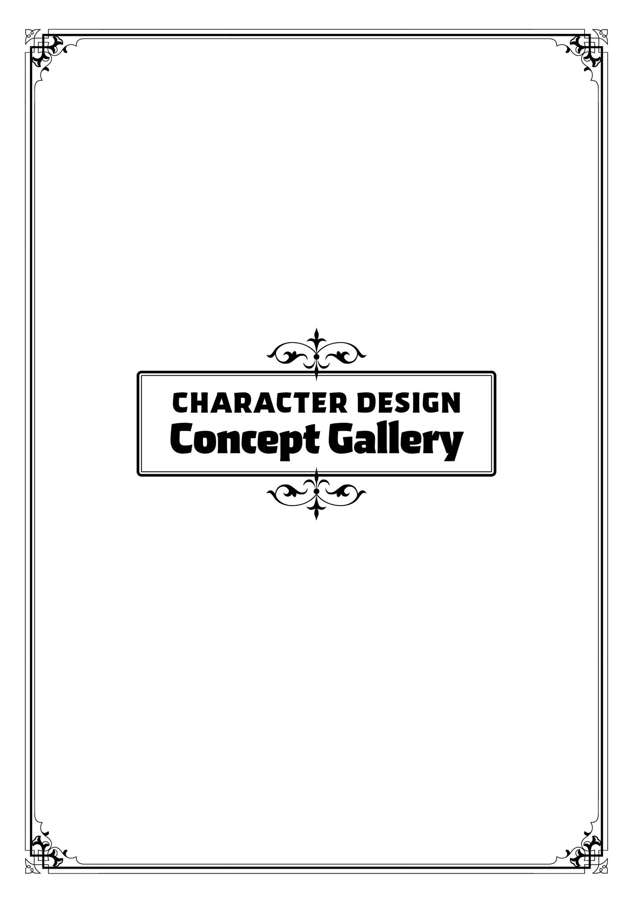
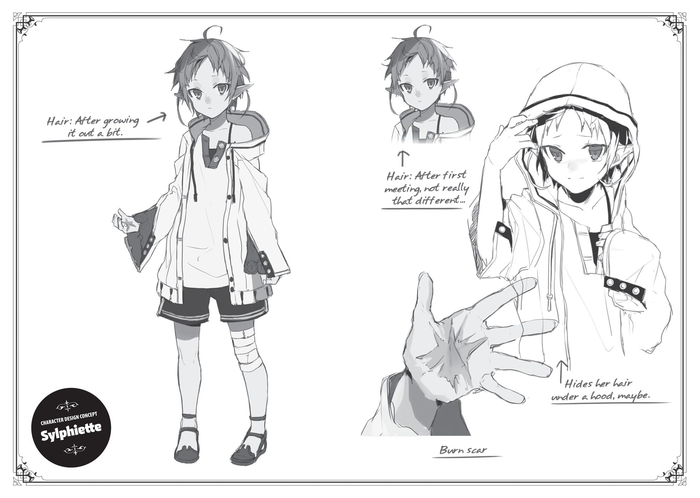
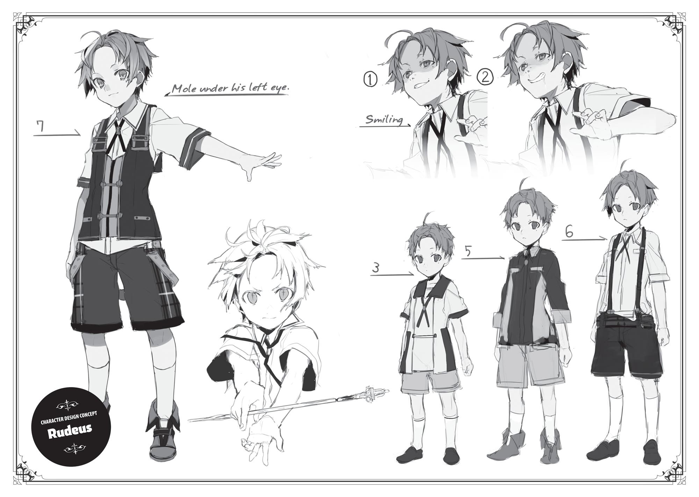
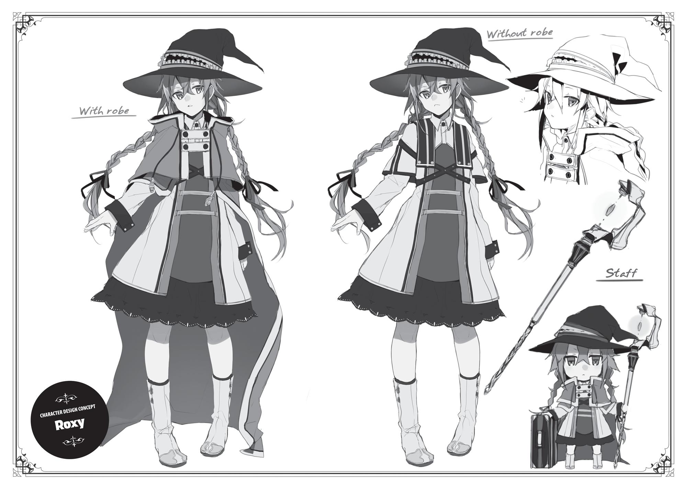
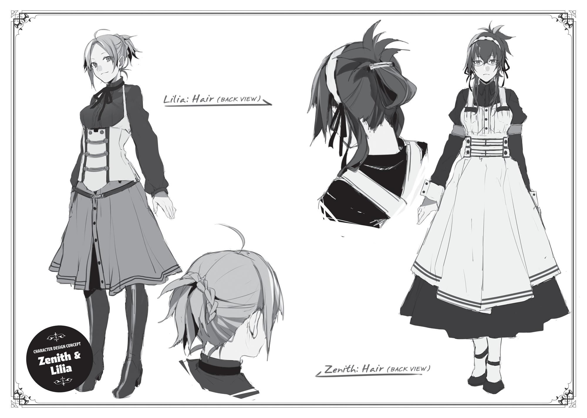
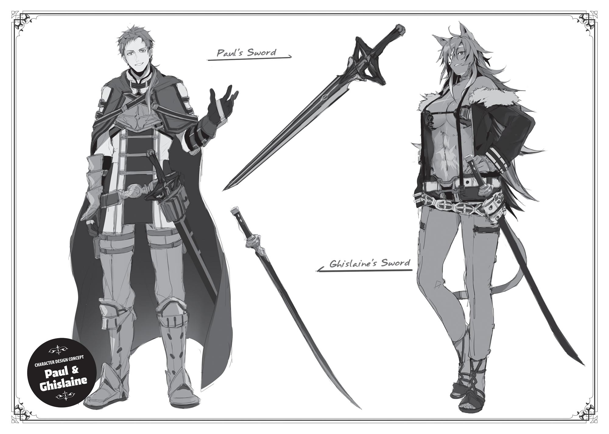

+++
title = "Extra Chapter The Mother Of The Greyrat Family"
date = 2026-07-20
weight = 12
[extra]
volume = 1
chapter = 13
+++
My name is Zenith Greyrat.
I was born in the Holy Country of Millis, a land noted for its long
history, great beauty, and rigid moral code. By birth, I was a member
of the nobility—the second daughter of a count.
Like most young ladies raised in “good families,” I was a
sheltered child. I thought the little world I knew was all there was. I
was clueless and naïve. But I was also a good child, if I do say so
myself. I never disobeyed my parents. My grades in school were
excellent. I obeyed the tenets of the Millis Church, and I learned to
play the role expected of me in society gatherings. Some people even
called me the perfect picture of a Millis lady. My parents were rather
proud of me, I’m sure.
Had things continued as they were, I suppose I would have been
introduced at some party to a man my parents chose for me.
Probably the first son of some marquess, well-mannered but proud,
with absolute respect for the dictates of the Millis Church. I would
have married this moral paragon, given birth to his children, and
seen my name go down in the register of Millis nobility as a perfectly
respectable marchioness.
As a woman of the aristocracy, that was the road in front of me.
But of course, I didn’t end up following it.
My life changed forever on my fifteenth birthday—the day I
came of age. I had a terrible fight with my parents. For the first time
in my life, I refused to do what they told me. And I ran away from
home.
I’d gotten thoroughly sick of letting them control every moment
of my life. My little sister Therese had always been a free spirit, and I

think I was a little jealous of her as well. These factors, along with
many smaller ones, combined to push me off the path I had been
following.
It’s not easy for a fallen aristocrat to find a new road through
life. But fortunately, I’d learned Healing magic in an academy for
noble girls, and had even gotten proficient at Intermediate spells.
Millis was a country where Healing and Protection magic flourished,
but it was still unusual to progress beyond the rank of Beginner in
either. Reaching the Intermediate tier opened up the possibility of
working in the Millis Church’s hospitals; it was an achievement that
earned me much admiration in our school.
As a result, I was convinced I could make it on my own
anywhere I went.
I really was hopelessly naïve.
A dishonest group of people spotted me almost immediately, as
I awkwardly tried to navigate the unfamiliar process of taking a room
at an inn. Claiming they’d been looking for a healer, they pulled me
into their party, taking advantage of my total ignorance. The pay
they offered was lower than what Beginner-tier magicians earned,
but they insisted it was higher than the going rate.
Being a complete fool, I took their superficial kindness at face
value. I actually remember thinking, I suppose the world does have
some decent people in it.
I’m sure they would have mistreated me further if I had stayed
with them. They were probably planning to use me as a human
shield in battle or force me to cast magic until I fainted. Maybe even
to demand sexual favors.
But they didn’t get the chance, thanks to a young swordsman
named Paul Greyrat.
After beating down my new “friends,” he rather forcefully
dragged me into his own travelling party. Until Elinalise—one of his

companions—explained, I was convinced I’d been kidnapped by a
violent thug.
In any case, that was how I met my future husband.
At first, I hated Paul. He was an Asuran noble by birth, but his
language was coarse. He broke his promises left and right, acted
impulsively, wasted money, and mocked me constantly. Not to
mention that he routinely groped my butt and sometimes made
highly inappropriate advances.
Still, I could tell he wasn’t exactly a bad person. He was always
coming to my rescue, after all. He made fun of my cluelessness, but
in the end, he always sighed and stepped in to help.
We were total opposites, but he was dependable, free-spirited,
and handsome. I suppose it isn’t that surprising that I grew attracted
to him.
Of course, there were always pretty women around him. And I
was a follower of the Millis Church, which preached the virtues of
monogamy. I might have run away from home, but the teachings of
my faith had been drilled into me daily since I was a child, and
everyone I knew in school had been a believer. Its commandments
were deeply rooted in my mind.
So, one day, I blurted out these words: “You can sleep with me,
but only if you never touch any other women again.”
Paul immediately agreed with an easy smile.
I knew he was lying to me, of course. But on some level, I didn’t
mind. Once he broke his promise, I thought I might be able to get
over him.
But once again, I’d been naïve, careless, and foolish. I never
even considered that I might get pregnant after a single night with
him.

I was so hopeless, anxious, and afraid. I certainly didn’t expect
that Paul would actually do the honorable thing and marry me the
way he did.
The child I bore him was a son, as it turned out.
Rudeus Greyrat. My little Rudy.
At the moment, Rudy was crouched next to his little sisters’
cribs with a very serious expression on his face— so much like his
father’s. Frowning intently, he peered into one crib for a moment,
then looked over into the other.
“Aah. Aah!”
Norn began to fuss, and Rudy’s expression stiffened even
further.
But an instant later…
“Blablabwah!”
He stuck out his tongue at her and made a silly face.
“Ha haa! Baa, baa!”
Nodding in satisfaction as Norn gurgled happily, Rudeus
resumed his previous serious expression.
“Aah! Aaah!”
This time, it was Aisha who piped up out of nowhere. Rudeus
immediately turned to face her, pressed his palms against his cheeks,
and mumbled, “Ajojobloblo.”
Clearly amused, Aisha let out a happy little, “Nhah, ahah!”
Once again, Rudy nodded to himself with a grin of pure
pleasure. He’d been keeping up this little routine for quite a while
now.

“Heheh…”
At the sight of Rudy’s smile, I couldn’t help but let out a little
laugh of my own.
It wasn’t something you saw every day, after all. Rudy always
had the most serious expression on; no matter how well things went
with his sword practice or his magic, he never looked particularly
satisfied. He almost never let me or Paul see him smile. And when he
did, it was usually a forced, awkward grin.
But now, he was making silly faces to amuse his little sisters and
smiling with genuine pleasure when it worked. Just watching him put
me in a pretty good mood myself.
We’d come a long way from the way things used to be.
I sighed quietly to myself, recalling Rudy’s early years. At first,
I’d been overjoyed when we discovered his talent for magic. But
after a while, I’d started to feel like he was so talented that he
secretly looked down on the rest of us. I wondered if he even loved
his family at all. He’d never really gotten that attached to me, for one
thing.
But I had it all wrong, of course. I realized this in the midst of our
greatest family crisis—the day Lilia announced her pregnancy, and
Paul confessed that he was responsible.
I felt so terribly betrayed by the both of them. So angry and so
sad.
In particular, I was so furious at Paul for breaking his vows to me
that I felt about ready to explode. I was on the verge of either
screaming, “Get out!” to Lilia or announcing that I was leaving
myself; it took an effort of will to keep myself calm.
Before our marriage, I’d expected Paul to prove himself a liar,
and planned to dump him once he did. I’d almost forgotten about
that, but apparently my feelings hadn’t changed. I was so upset that I
was ready to break apart our family for good.

But in the end, Rudy changed my mind. Playing the part of a
guileless child, he stepped in to guide things to a neat conclusion. His
methods weren’t exactly admirable, of course. And even if I believed
his little story, it certainly wouldn’t have convinced me to forgive my
wayward husband.
Still…from Rudy’s words and the expression on his face, I could
see what he was really feeling, deep down inside.
He was afraid. Terrified his family was going to break apart.
The moment I realized that, I finally understood that he did love
us in his own way. And I wanted nothing more than to reassure him.
My anger softened. I managed to bring myself to forgive both Paul
and Lilia on the spot.
If not for Rudy, things wouldn’t have worked out that way.
“Ooh, you’re such a cutie pie, Norn. You’re gonna be real pretty,
just like Mommy, yeah?”
And now, here he was playing with Norn’s little hands and
smiling happily. My ever-serious little son was soothing his sister
with silly baby talk.
He’s so…reliable.
I’d been a bit in awe of Rudy’s talents for quite some time, but
lately I was starting to appreciate his dependability as well. Things
had been truly hectic after Aisha and Norn were born. Our two new
daughters cried at all hours of the night, puked up half the milk we
fed them, and routinely pooped when we were bathing them. Lilia
told me all of this was perfectly natural, that it was only to be
expected, but in no time, I was utterly exhausted. For days and days,
I barely got a wink of sleep.
But then Rudy stepped in and started to handle all sorts of
things for us…without even being asked.

He was oddly skillful with the babies. It almost seemed as if he’d
cared for one before, although that couldn’t possibly be the case. I
suppose he must have picked up a few things from watching Lilia.
That’s our Rudy for you.
I wasn’t particularly happy that my son was better at soothing
my own child than I was, but it was still an enormous help. I’d never
seen a boy his age so helpful and reliable, or even capable of looking
after newborn babies the way he did.
Watching him work sometimes reminded me of my brother,
who presumably still lived back in the Holy Country. Like Rudy, he
was serious, diligent, and talented; my father always told us to learn
from his example. But he was also cold to his family, and ignored his
little sisters almost completely. As nobles went, he was a good and
honest man, but I didn’t think much of him as a brother. Rudy was
obviously going to be different. He was going to be a good big
brother. The kind who earned his sisters’ admiration.
That certainly seemed to be his intention, at least. He’d actually
announced “I’m going to try to be the coolest, most perfect big
brother ever,” to Paul while they looked down at Norn and Aisha. I
was already eager to see what the three of them would be like in a
few years’ time.
“Aah. Agyaaah!”
At this point, I was startled out of my reverie by Norn, who’d
begun crying loudly. Rudy’s body jerked in surprise, but he quickly
turned to her crib to make more silly faces.
“Gyaa! Waaaah!”
This time, Norn didn’t stop bawling. Rudy touched her diaper to
see if it was wet, then picked her up and checked her back for rashes,
but the waterworks just kept flowing.
If I’d been on my own, I probably would have gotten flustered
and called for Lilia, only to fall into an outright panic once I

remembered she was out shopping at the moment. But Rudy stayed
admirably calm. Working by process of elimination, he checked
carefully for potential problems. After a while, he clapped his hands
and turned to me.
“Mother, I think it’s time for her milk.”
Come to think of it, it was about that time of day, wasn’t it? The
hours really did fly when I watched Rudy playing with his sisters.
“Right. Of course.”
“Here, have a seat.”
I lowered myself into the chair Rudy pulled up for me, opened
up my blouse, and took my bawling baby into my arms.
Norn had clearly been quite hungry, just as Rudy thought. She
immediately pressed her little mouth to my nipple and began to
suckle greedily. The sensation always made me intensely conscious
of my own motherhood.
“Hm?”
After a moment, I realized that Rudy was watching.
Whenever I breastfed Norn, he… tended to stare. It wasn’t just a
curious, innocent gaze, either. There was an element of interest you
wouldn’t expect from a seven-year-old.
It was cute to see him doing something so much like what Paul
did…but if Rudy was already like this at his age, there was probably
going to be some trouble down the line. The last thing I wanted was
for him to go around breaking women’s hearts right and left, the way
his father had.
“What’s the matter, Rudy? Do you want some too?”
“Huh?!”
Startled by my little joke, Rudy jerked his head away and
blushed a brilliant shade of red.

“No, that’s not it. I was just impressed by how much she’s
drinking…”
“Heheh.”
It was a bit cute seeing him flustered. I couldn’t help laughing a
little.
“Sorry, but I need my milk for Norn now. You had plenty when
you were a baby, so don’t be greedy now, all right?”
“Of course, Mother.”
Rudy agreed easily enough, but I saw a slight hint of regret on
his face. Definitely an unusual reaction, coming from him. And
extremely adorable.
Maybe I’d tease him a little more.
“Hmm. Well, if you’re desperate…once you get yourself a wife,
why don’t you ask her if she’ll give you some?”
“Good idea. I’ll have to try that out someday.”
I was expecting him to get all surly and defensive at this point,
but he parried my remark with a calm expression. I suppose he’d
figured out I was just messing with him.
No fun. But that’s Rudy for you, I suppose.
“Don’t go forcing her, mind you.”
“Yes, I know.”
It always made me feel a bit melancholy to see him acting all
grown-up like this.
I turned my attention back to Norn, who’d had her fill. After
patting her on the back until she let out a little burp, I gently placed
her back in her crib.
As I wiped off my breast with a cloth, I realized Rudy was staring
at me again.

Whoever does marry him might have a tough time of it. Sylphie
seems like the leading candidate at the moment… and that girl tends
to do anything Rudy tells her to. She might not be able to say no,
even when she wants to…
All right, then. If worst comes to worst, I’ll just have to set him
straight.
I was Rudy’s mother, after all. Paul might teach him how to
seduce women, but I’d teach him how to treat them right.
“Goo…”
Norn looked quite satisfied now she that had something in her
stomach. It didn’t take long for her to start nodding off in her crib.
“That’s the way,” I murmured softly, stroking her little head.
“Drink lots of milk, get lots of sleep, and grow up nice and healthy.”
Unfortunately, Aisha picked this moment to start fussing a little
herself.
“Aaah… Waah!”
Tearing his eyes away from my breasts, Rudy peered down into
the other crib.
“Whatsamatter, Aisha? Is your back a widdle itchy?”
Just as he’d done for Norn a bit before, he picked
Aisha up, checked her diaper, and looked for rashes and insect
bites.
But after a moment, still holding the baby in his arms, he turned
to me with an uncharacteristically anxious expression. I did like
seeing different emotions on Rudy’s face, but I didn’t want him
looking that troubled very often.
“What’s the matter, Rudy?”
“Uhm, Mother… Miss Lilia’s a little late today, isn’t she?”
“Come to think of it, you’re right.”

Normally, she would have returned from her shopping trip by
now. Could something have happened?
No, no. A group of merchants from the Citadel of Roa were in
town. She’d mentioned she was planning to buy a bit more than
usual; it was probably just taking a little longer than expected.
“Well, you see… about Aisha…”
“Yes?”
“I think she’s hungry, too.”
“Oh, I see.”
We tended to feed our babies at the same time, so it made
sense they’d both get hungry at the same time as well. Normally, I
breastfed Norn while Lilia took care of Aisha, but…
At this point, I finally understood that awkward expression on
Rudy’s face.
Slowly, cautiously, he continued, clearly choosing every word
with care.
“Mother…there’s no telling when Miss Lilia will get back. I’m
sure Aisha could wait a while, but if she keeps crying, Norn might
wake up too, so… uhm…”
As a faithful member of the Millis Church, I was still unhappy
with both Paul and Lilia for breaking our marriage vows. I knew they
didn’t subscribe to my faith, but it was never pleasant to have
someone disregard your values. And Rudy had obviously picked up
on all of this.
He was afraid his suggestion might upset me. He was worried I
might even take out my displeasure on his little sister. The boy was
clearly anxious.
From his perspective, Norn, Aisha, and I were all equally family.
And…given where things now stood, I ought to feel the same.

Still, was this really a good idea? What if breastfeeding Aisha
made me feel anger or revulsion?
What if Rudy saw hatred on my face and despised me for it?
“Oh, really now. What are you going on about, Rudy? Come on,
give me Aisha.” I answered in the kindest voice I could, trying to
shake off my own uncertainty.
“Of course,” Rudy said.
Slowly, hesitantly, he deposited Aisha into my arms.
After exposing the opposite breast from the one Norn had just
been using, I lifted her up to it.
I probably would have felt a bit upset if Aisha had kicked up a
fuss at this point, but she latched right on to me and started gulping
down milk immediately. Too quietly for Rudy to hear, I breathed a
little sigh of relief.
I felt the exact same way I did when I was feeding Norn. My
heart was full of a warm, pleasant awareness of my own
motherhood, and nothing else.
How odd. Why had I hesitated, even slightly, to bring Aisha to
my breast? Why had I thought this would make me feel unhappy?
Why did I think of this as some trial I had to endure?
It was all so much simpler than I’d thought. I was a mother.
Nothing else really mattered.
Whether you’re a member of the Millis Church or not…it doesn’t
really make a difference when it comes to things like this.
“She’s certainly guzzling it down, isn’t she?”
“Uhm. Well, your milk is delicious, Mother.”
“That’s…an odd attempt at flattery, Rudy.”
Seeing Aisha happily suckling at my breast, and the contented
expression on my own face, Rudy smiled with obvious relief. He

clearly regarded protecting his little sisters to be his duty. Very
admirable. His desire to become a good big brother, worthy of their
adoration, seemed to be quite genuine.
“It’s not flattery. I still remember how it tasted.”
“Do you really now?”
Chuckling softly, I reached down to stroke Aisha’s little head.
After a while, she finished up and took her mouth from my breast;
only moments later, she was nodding off in my arms, so I lowered
her back into her crib.
Rudy watched from a distance, his gaze warmer than usual.
“Hey, Rudy.”
“Yes, what is it?”
“Mind if I stroke your head a bit?”
“You don’t need to ask my permission. Feel free to pet me
anytime.”
After slowly sitting at my side, Rudy leaned his head toward me
invitingly. I reached down and began to stroke it gently.
Rudy was our first child, and he never needed much from us.
Most of the time, I didn’t feel like I was much of a parent to him. But
recently, that had begun to change.
I truly was this boy’s mother. And he truly was my son.
Sensing a bit of warmth, I turned in its direction. Spring sunshine
was streaming in through the window. Outside, golden fields of
wheat stretched out as far as the eye could see. It was the picture of
a peaceful spring afternoon. As I gazed quietly out at it, a sense of
happiness washed over me.
For some reason, I felt utterly content. “I wish this moment
could last forever.”
“Me too,” Rudy murmured with a nod.

I suppose he also found this little domestic scene pleasantly
tranquil. But it was only thanks to him that I could feel the same.
If he hadn’t intervened… as a pious member of the Millis Church
reduced to one wife of two, I would probably have stormed out of
this house with Norn, cursing my misfortune. Or stayed behind,
perhaps to take out my resentment on Lilia and Aisha.
Thank goodness for Rudy.
If he wasn’t such a wise and clever little boy, I never would have
experienced this blissful moment.
“Rudy…”
“Yes, Mother?”
“Thank you for being born.”
Startled, Rudy looked up at me. After an awkward pause, he
scratched his head and answered in an adorably bashful tone of
voice.
“Well…thank you for having me.”
My only reply was another chuckle of amusement.

Thank you for reading!
Get the latest news about your favorite Seven Seas books and brandnew licenses delivered to your inbox every week:
Sign up for our newsletter!
Or visit us online:
gomanga.com/newsletter

Just Light Novels
