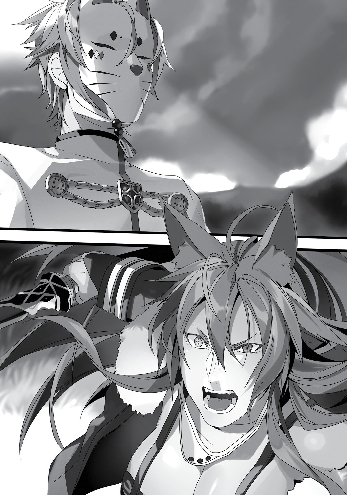
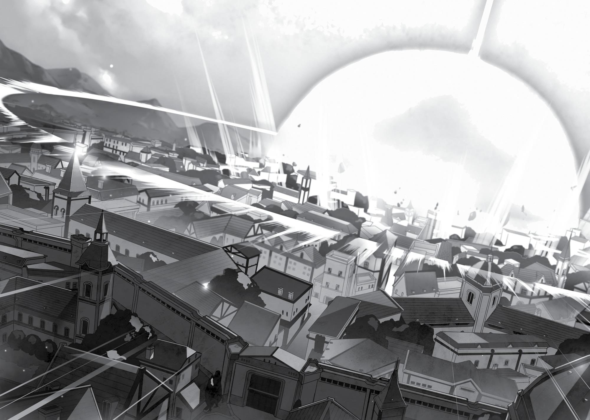
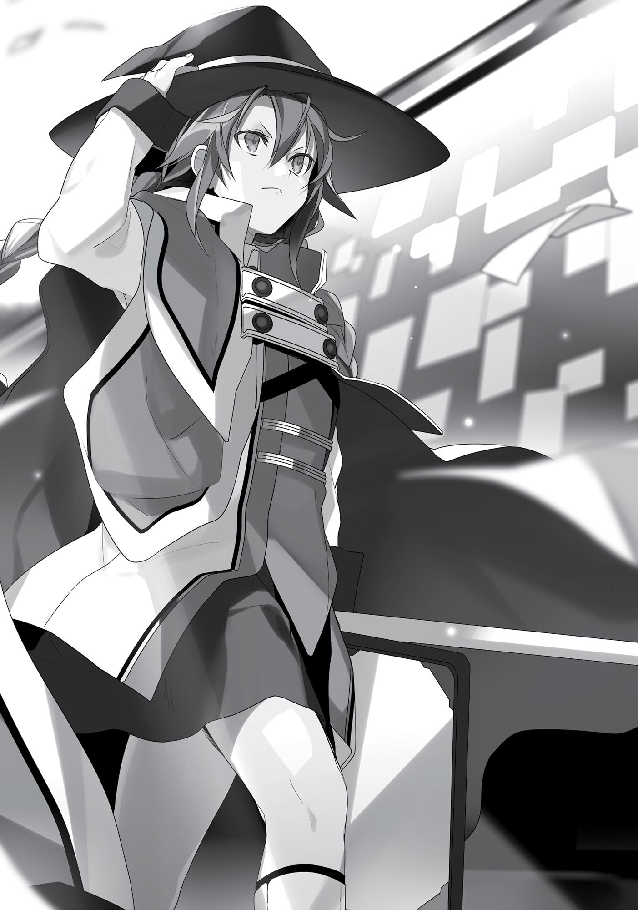

+++
title = "Chapter 8 The Turning Point"
date = 2026-07-20
weight = 8
[extra]
volume = 2
chapter = 9
+++
Shirone Kingdom.
Roxy Migurdia looked out the window with her brows knitted.
The color of the sky was strange. Brown, black, purple, and yellow; a
change of colors one didn’t usually see. And yet, she had seen these
colors somewhere before.
“What is it, I wonder?”
The hues were familiar to her, but she had never seen the sky
like this before. The only thing clear was that this wasn’t a natural
phenomenon.
The most likely explanation was magic that, for whatever
reason, had gone out of control. The scale of it was such that she
could see it whirling even from a distance.
Then she remembered. The way it shone—she had seen this
before at the University of Magic. The light looked like summoning
magic.
“That direction… In the east. Asura Kingdom? Don’t tell me it’s
Rudeus?” She remembered the boy she had once taken as a pupil.
That boy who, at the tender age of five, produced a storm while
utterly composed. Now he would be ten. At half his age he had
complete control of his bottomless pool of mana, so it was possible
he might do something like this.
In his most recent letter, he wrote of his difficulties studying
summoning magic. Maybe he had somehow obtained a book on it, or
perhaps found a teacher.
“You’re wide open!”

As she was deep in thought someone threw their arms around
her from behind. As her breasts were grabbed, she felt something
hard press against her thighs.
“Hnnngh…”
Roxy was fed up. No matter how he groped her, the thickness of
her robes masked everything. Besides, even if he got pleasure out of
doing this, the only thing she felt was displeasure.
“Raging flames consume my body—Burn in Place!”
“Gyaah!”
The force of the flames that covered her body sent the person
behind her flying. She still couldn’t cast spells without chanting them
at all, but she had shortened the length of her spells greatly in these
past five years. When she learned that Rudeus was teaching his own
pupils to cast spells without chanting, she decided to practice
shortening her own incantations. It hadn’t been easy. Just how much
was that boy genius expecting from his pupils? Not everyone was as
blessed with talent as he was.
Roxy turned and gazed at the boy collapsed on the floor. “Your
Highness, you can’t come up behind a woman and just start groping
her chest.”
“Roxy! Were you trying to kill me?! I’ll have you thrown in
prison!”
Shirone Kingdom’s seventh prince, Pax Shirone, was a kid with a
bad attitude who had just turned fifteen. His bad behavior was
endearing at first, but lately he had developed a real interest in sex
and would make sexual advances toward Roxy every afternoon.
“My apologies. I didn’t realize such a weak attack would be fatal.
You must have the constitution of an insect.”
“Grrr! Criminal disrespect! I won’t forgive this! If you want my
forgiveness, then roll up your robes and let me see your panties!”

“I’ll pass.”
He had already put his hands on multiple maids, leaving the king
troubled over how to handle the situation. Now it seemed he had
turned his attention to his curt household tutor.
Just what about a rude girl like her did he find appealing? Roxy
didn’t understand. Still, no matter how much he came at her, she
had no reason to obey his commands. According to the contract she
made with the country’s governing party, no matter what selfish
demands the prince made, it was up to her discretion on how to
handle him.
There weren’t many living in this castle that would obey his
orders directly. Besides, he was the seventh prince. He was low in
the line of succession, so he had next to no authority. In fact, if you
looked at the privileges afforded to them, Roxy was in a much higher
position as an imperial court magician.
The prince tried a different approach. “Roxy, I already know. I
know that you have a lover!”
“I see, and just when did I manage to do something as incredible
as finding a lover?” she replied to his sudden gibberish, tilting her
head. A lover? She did want one at some point, but she had yet to
meet her ideal match. Even if she did, with the way she looked as a
member of the Migurd race, he surely wouldn’t reciprocate. She had
already given up.
The prince was odd himself, which was probably why he wanted
a taste of her body, even if just once. But Roxy had no intention of
being so easily seduced.
“Eheheh, I slipped into your room and found all those letters
you had piled up in the back of your shelf! I don’t know what kind of
backwoods peasant he is, but with my power I could have him
crushed! If you don’t want to see him face a cruel execution, you
better become my woman!”

So this was his other method. He would take hostage the lover
of the person he was interested in, then demand the object of his
affection submit to him to keep their lover safe. After that he would
take her in front of her lover just so he could feel empowered by
dominating another person.
He had no such authority. Yet he was still the prince of a
country. He had some troops of his own that he could do what he
wanted with, and there was a rumor that he had taken one maid’s
lover hostage before.
Such poor taste. All he does is creep me out, Roxy thought. I’m
glad I don’t have a lover. All those letters were from Rudeus. Rudeus,
who was a respected pupil and not her lover.
“Feel free to do so,” she told him.
“What?! I really will do it, you know?! If you want to apologize,
you better do it now! If you do it now, all you’ll have to give me is
your body!”
The prince clearly wasn’t thinking. He didn’t even know
Rudeus’s location in the first place. Based on his attitude, he hadn’t
read the contents of any of those letters either.
“If you can actually succeed in doing something to Rudeus, then
you can have your way with my body.”
“What are you acting so confident for? You should know what
kind of power I have!”
Of course she knew. She knew that the little bit of power
afforded to him as a prince of the royal family was barely worth
snorting at.
“Rudeus is under the protection of the Boreas family, an elite
noble family in Asura Kingdom.”
“Boreas…? As if nobles could stand up to the authority of a
member of the royal family!”

He didn’t even know the names of the elite royal families in
Asura Kingdom. That realization prompted a sigh from Roxy. Had the
other tutors even taught him anything?
As the four great regional liege lords, the Notos, Euros, Zepiroth,
and Boreas families were of great renown. When the Asura Kingdom
entered battle, they were the ones standing on the front lines. They
had been military men for generations upon generations. Besides,
members of those elite noble families might occasionally travel to
Shirone on diplomatic engagements. Those names were definitely
worth remembering.
“The country of Asura is ten times the size of Shirone. To take
the child of an elite noble family on some baseless suspicion and
escort them to the gallows, you would have to possess a tremendous
amount of political power and strategic skills. That’s impossible for
you, Your Highness.”
“I-I’ll have him assassinated! I’ll send my imperial guards!”
Imperial guards? Roxy sighed inwardly. He really wasn’t thinking
this through at all. “There’s no way your guards could cross the
country’s border. Even if they could, and the chance would be one in
a million, the Boreas family has invited Sword King Ghislaine to their
house as a guest. You truly think they could sneak into the Citadel of
Roa, into the Boreas manor, slip past Ghislaine’s watchful eye, and
assassinate a master magician?”
“G-grrr!” The prince ground his teeth together and stomped his
feet.
Roxy let yet another sigh slip past her lips. Ah, I can’t believe
this. He’s already fifteen and he doesn’t even know the first thing
about distinguishing between what’s possible and what’s not.
Roxy heard that Rudeus’s pupil, Eris, had been an uncontainable
wild animal three years ago, but had recently become more refined.
Meanwhile, her student was in this sorry state.

Years ago, she had found him endearing and even recognized his
talent for magic. Unfortunately, as soon as he realized what kind of
power he had, his will to improve vanished and he spent the better
part of his lessons sleeping. Now she saw no potential in him.
“Anyway, I’ll be quitting my position as your tutor soon, so you
wouldn’t make it in time even if you sent assassins out right this very
minute.”
As soon as she said that, he raised his voice in shock. “Whwhaaat?! I haven’t heard a word about this!”
“You must not remember then.”
The agreement from the beginning was that she would work as
his tutor until he reached maturity. At the time she had considered
requesting to stay beyond her contract. However, there were many
in the royal palace who resented her presence. Leaving was the
wisest course of action.
“It’s a good opportunity as well,” she added.
“A good opportunity for what?”
“There’s something strange about the western sky. Now I can go
see it for myself.”
“Wh-what the heck…”
She didn’t say it was because she wanted to see Rudeus’s face
after all this time. It would only enrage the prince if she did.
“I-I still need you! We’re still in the middle of our lessons, right!”
“Irrelevant. You sleep through them anyway.”
“That’s your fault for not waking me up then!”
“Oh really? Then as a bad teacher, I should take my leave
quickly. Please be sure to hire someone who will wake you next time.
I’m not interested.”

This prince is impossible for me, Roxy thought. I can’t stop
comparing him to Rudeus. All I had to do was teach Rudeus one thing
and he would take that, study it, and learn ten or twenty new things.
Maybe I can’t be a teacher again after meeting a student like that.
And thus, Roxy left Shirone and set out on her journey. She was
accosted by the seventh prince and his personal guards on her way
out but swiftly repelled them.
Afterward, the seventh prince obstinately insisted that she
should be apprehended and brought before him to answer for the
unforgivable act of violence she committed against him. However,
the king refused to pay his claims any heed. Instead, the prince was
rebuked and severely punished for being unable to convince the
Water King-tier magician Roxy Migurdia to stay.
Roxy was not the only one to notice the change in the sky. Every
person in every part of the world took notice both of its abnormality
and the abruptness of its appearance. Even those of wide renown
took note.
The Red Wyrm Mountains

The Dragon God Orsted gazed up at the western sky.
“Mana is pooling there? What is it, what’s caused this
madness?” he scowled with suspicion. “No matter. I’ll know once I
see it for myself.”
He headed straight west, passing over the corpse of the red
wyrm he had just slain with a single attack. Other red wyrms were

swarming the area like a drove of insects, but not a single one tried
to involve themselves. They knew what manner of being walked the
ground below them. They knew that even if they banded together to
attack, they would only be killed. They also knew that if they stayed
clear, they would be safe.
That being was the Dragon God, a being that existed outside the
rules of this world. A being they could not touch.
Full of pride, another young wyrm that didn’t understand its
place in the world descended upon Orsted. In a split second it was
rendered into nothing more than a lump of meat.
Red wyrms were dreadfully strong creatures that resided on the
Central Continent. It was not just their battle prowess that made
them fearsome, but also their intelligence. That was why they knew
he was the man rumored to be the strongest in the world, and an
opponent they could not hope to defeat no matter how much their
numbers favored them.
Orsted moved slowly down the mountain as the red wyrms
watched, his intentions a secret that only he was privy to.
The Floating Fortress

The Armored Dragon Perugius, one of the three legendary
heroes, looked down at the northern sky.
“What is that? It looks like the light emitted when the Great
Emperor of the Demon World revives.”
Standing nearby was a woman with a white crow’s mask over
her face, a member of the skyfolk who possessed black wings. She
whispered, “The mana level is different.”
“Indeed. If anything, it resembles the color of a summoning.”

“Yes, but that said, I’ve never seen that much light from a
summoning before.”
“It’s similar to when we created Chaos Breaker.”
Perugius had to act.
He had spent today just like any other, seated atop his throne in
Chaos Breaker, attended by his twelve followers, continuing to
monitor the surface. He had only one objective, to vanquish his
loathsome enemy, the Demon God Laplace, as soon as they revived.
He waited in the sky for that moment when the seal would come
undone.
“Could it be that the Great Emperor of the Demon World is
trying to unseal Laplace?”
“It’s possible. The Emperor has been unsettlingly quiet in the
300 years since their revival,” she responded.
“All right. Arumanfi!”
“I am here.” A man swathed in white and wearing a yellow mask
appeared and kneeled before Perugius.
“Search immediately and—hmm, I’m certain whoever is behind
this must be up to something. If you see anyone suspicious that
seems to be involved with this, kill them.”
“Understood.”
The Armored Dragon Perugius made his move, his twelve
retainers behind him. All to avenge the four friends that he had lost.
This time, for certain, he would deal the Demon God Laplace a
finishing blow.
The Sword Sanctum

The Sword God Gall Falion gazed up at the southern sky.

“What’s wrong with the sky? Also…” The moment his focus
shifted to something else, two of his beloved pupils launched an
attack on him at the same time. “Don’t come at me while I’ve got my
attention on other things.”
His composure was relaxed. In comparison, both of his beloved
pupils were short of breath.
As usual the two had no sense, he thought. They were
overconfident from having earned the title of Sword Emperor, yet
this was all it amounted to. What a load of crap. Fame had no place
in swordplay. All you needed to do was get stronger. The only thing
fame brought you was money and political power. There was no
value in that. Anyone could obtain those things. Being as great as he
was, he could cut right through that garbage in a single stroke. If you
were strong, you could have things your way. Having things your way
was how you stayed alive.
Ghislaine understood that best, but she had grown soft. That
was why she was stuck at the level of Sword King. Those with a
powerful lust for life were innately strong, no matter how physically
weak or incapable of wielding a sword they might be. But those who
had become strong could lose that driving force. That was why
Ghislaine lost her way. She wasn’t selfish enough.
It wasn’t as though the pupils before him were especially gifted.
It was their obscene greed that made them strong. The insatiable
appetite of a pair that lived on a life-or-death battlefield.
“Hey, hey, come at me already. Defeat me then battle each
other to the death so one of you can call yourself the Sword God!
You’ll have enough money to play around for a hundred lifetimes!
You’ll be able to line up women, from slave girls to princesses, and
have your way with them! Your name alone will bring people to their
knees in fear! One step forward and crowds of people will part to
make way for you!”

“I didn’t start learning the sword for something like that!”
“Master! Please don’t insult us like that!”
This was it. They were going to learn to be more honest with
themselves. For if they did, they would easily be able to crush
someone like him and call themselves Sword Gods.
The Sword God Gall Falion had already forgotten about the
southern sky.
Somewhere in the Demon Continent

The Great Emperor of the Demon World, Kishirika Kishirisu,
gazed up at the eastern sky. “Hmph, when you become as great as I
am, you can see things even if you face the opposite direction! How’s
that?! Amazing, isn’t it?”
There was no one there to answer her. Not a single person was
present.
“So you’re ignoring me! Mwahaha! Very well, very well! I’ll
forgive you, humans! Or rather, no one will come near me because
of the peace treaty, so I have no choice but to forgive you!
Mwahahaha, mwahahaha, mwaha—gurgh…”
Kishirika was lonely.
The moment she had revived from death, she had cried out, “I,
the Demon World’s Great Emperor Kishirika, have revived! I must
have kept you all waiting! Mwahahaha!” But no one was there. She
decided she would go to the city and repeat her declaration, only for
people to look at her as if she were a pitiful child. Since then, no one
paid her any attention.
She tried visiting one of her old friends, but they simply told her,
“Things are peaceful right now, so behave yourself.”

“What are those human diviners even doing? When I revived in
the past, they would start trembling in sudden fear, babble weird
things, then leap from their windows. Without that opening act, it
feels like there’s no value to my revival. Hah, honestly, youngsters
these days…”
She kicked at a stone and looked up at the magic pooling in the
western sky. Another name of the Great Emperor of the Demon
World was the Demon Emperor of Demon Eyes. She possessed more
than ten, and in a single glance she could tell what was happening,
no matter how far away. With those eyes she saw powerful mana,
the familiar light of summoning magic, and the person controlling it.
Or at least, she should have been able to.
“What’s this? I can’t see the one doing this? I wonder if there’s a
barrier. You must be a shy one, hiding your face after causing such
mayhem.”
Kishirika’s eyes were not all-powerful. That was why she was
merely the Great Emperor of the Demon World, and would never be
called a Demon God, no matter how much time passed. Not that she
was particularly bothered by that.
“It’d be nice if they could at least summon a hero. But lately
everyone is all Laplace this and Laplace that. ‘Kishirika? Who’s that?’
So it’s not like it matters. I guess even heroes would rather go for
young men with good looks like Laplace. I want some time in the
spotlight too. I want to be showered with attention and put on
parade!”
She sighed as she set out on her journey. A journey with no
particular destination in mind.
At the Same Time - Rudeus’s Perspective

We went to a hill on the outskirts of the Citadel of Roa. As
I had promised on my birthday, I was going to show Ghislaine what
Saint-tier water magic looked like. Eris, of course, tagged along.
I took out Aqua Heartia and removed the cloth I had wrapped
around the crystal just in case. As awkward as it looked, it was better
than showing off to potential thieves what an expensive item I had. I
had wrapped it to look like a mana-filled cloth for amplifying the
magic of the staff. It was at least better than people thinking I was
hiding an enormous gem.
I decided to test the staff with a practice shot before trying out
Saint-tier water magic. I focused the same amount of mana I always
did to create a Waterball, but the result was immense, bigger than
I’d ever seen it before.
“Whoa, this is huge!”
When I tried compressing the ball, it instead became so small
that you couldn’t even see it. I slowly made adjustments. After thirty
minutes of testing things out, I figured out that this staff increased
the effects of my water magic fivefold. This meant my offensive
magic was more potent, and I could produce the same power level
with a reduced mana cost.
To represent this with numbers:
Without the Staff: Mana Cost 10, Power 5
With the Staff: Mana Cost 10, Power 25
With the Staff: Mana Cost 2, Power 5
Something like that. In other words, it worked like a magnifying
glass or a microscope. Elaborate adjustments were difficult right
now, but I would probably be fine once I got accustomed to using the
staff.
“H-how is it?” Eris had a nervous look on her face.

Don’t worry, I’m officially obsessed with my new toy, I thought.
“It’s difficult to make adjustments, but it’s really amazing.”
“R-really! I’m glad!”
I continued testing and discovered that fire magic was amplified
twofold while earth and wind were each amplified thrice. Using the
staff to combine different types of magic, however, seemed difficult.
Or was that also a matter of getting used to it?
“All right then, what you have all been waiting for. I, Rudeus
Greyrat, will show you my great, all powerful hidden technique!”
“Yay!” Eris clapped in joy. Ghislaine also seemed deeply
interested. I was also feeling excited. Time to show them how cool I
was!
“Bwahaha!” I raised my staff toward the sky as I chanted my
Saint-tier water magic spell. “Mana, gather to me! Magnificent Spirit
of Water, lift to the heavens… Huh?” That was when I noticed it.
“Hm?”
“What’s that?”
The other two followed my gaze and looked up as well.
“I don’t know, but it’s an incredible amount of mana!”
So she could see mana with that eye. After three years I finally
knew her true power…a demon eye.
Ghislaine quickly replaced her eyepatch.
“Shall we go back to the city for now?” I didn’t know what this
abnormal sky heralded, but if something happened, I wanted to have
a roof to take refuge under. We’d be in trouble if spears began
raining upon us.
“No, the closer you get to the city the more concentrated the
mana. It might be better to distance ourselves instead.”

“But we have to go back to the manor and warn everyone at
least!” Surely it would be better to inform Philip and the others and
get the townspeople to safety.
“In that case, I’ll go—Rudeus! Duck!”
I crouched reflexively. Something whooshed by, slicing through
the air at top speed right where my head had been. A chill ran down
my spine.
What…was that? What just happened?
“You!”
Beside me, Ghislaine put her hand on her sword and her
silhouette blurred. The next moment she was in a pose as if she had
just struck with her sword. She’d demonstrated this to me many
times before. The Sword God Style’s Saint-tier technique, the
Longsword of Light. A secret technique of the Sword God Style, it
was said that if you performed it perfectly, the tip of your sword
reached the speed of light. Ghislaine told me it was this technique
that made Sword God Style the strongest of the three styles.
“Hm.” Ghislaine’s brows knitted. She must have missed her
target. Her opponent dodged that deathblow of an attack that was
too fast to be seen with the naked eye. Ghislaine’s face went hard
with caution as she glared at something behind me.
“…”
I slowly turned around to see who had tried to attack me and
dodged Ghislaine’s counter slash.
“Who…?”
A man stood there. He had blond hair and was wearing
something that looked like a pure white school uniform, fastened in
the front. He probably had a handsome face, but it was hidden
behind a yellow mask that looked like a fox. In his right hand was a
dagger.

That must have been it. That was what came for my head.
“Who are you? Tell us your name!”
“…”
The moment after Ghislaine shouted, his face gleamed. It was a
brilliant light so bright it blinded us all for a moment. I immediately
shut my eyes. “Gaah!”
I heard Ghislaine howl. Then a clang as metal clashed against
metal. Then the sound of rapid movement.
Their blades met, twice, then a third time. By the time my vision
recovered, Ghislaine was in front of me with her eyepatch pulled
back.
So that was how she did it. The moment that light took our
vision, she pulled her eyepatch aside so she could see with her other
eye.
“Bastard, who are you? Are you an enemy of the Greyrat
family?!”
“Arumanfi the Bright. That is my name.”
“Arumanfi?”
“I came to put a stop to this strange phenomenon, on Lord
Perugius’ orders.”
Perugius. Now that was a name I had heard before. One of the
three legendary heroes who slew the Demon God, and one of the
survivors of that battle. A summoner with twelve familiars. Then, like
a chain reaction, I remembered the name Arumanfi. He was one of
those twelve familiars. Arumanfi the Bright.
“Be careful, Ghislaine. According to the literature I read, this guy
can move at the speed of light.”
“Rudeus, take the Young Mistress and fall back.”

Just as Ghislaine asked, I used my back as a shield and escorted Eris a
safe distance away so we wouldn’t be embroiled in the battle. I was
careful not to go too far, staying within Ghislaine’s protective reach.
If that really were Arumanfi the Bright, a sword couldn’t touch
him. I was sure I’d read something like that in the Legend of
Perugius.
That said, where had he come from? No wait, Arumanfi the
Bright was said to be the governing spirit of light. It was said that he
could travel any distance instantaneously if it were within line of
sight. Back when I read that, I thought it was a load of rubbish, but
he had appeared behind me in the blink of an eye. Ghislaine would
never let her guard down, and he had no reason to be lurking in this
area beforehand. He must have flown here, at the literal speed of
light. That was one of his abilities after all.
“Woman, move. This strange occurrence might cease if I slay
that boy.”
Wait, what was he talking about? Strange occurrence; did he
mean that thing in the sky? What kind of misunderstanding was he
under?
“I am the Sword King Ghislaine Dedoldia. That thing in the sky
has nothing to do with us. Withdraw!”
“Sword King? How can I believe that? Show me proof.”
“Look! This is one of the famous blades of the Seven Original
Sword Gods, Hiramune—Flat Core. Will you still not believe after
seeing it?” She thrust her sword toward Arumanfi while still gripping
it firmly by the hilt.
I didn’t know her sword had that kind of inscription on it. Flat
core… Core as in chest? Certainly not a word I’d associate with
Ghislaine’s chest.
“Swear on the names of your master and your household.”

“I swear on the name of my master, Sword God Gall Falion and
the honor of the Dedoldia people!”
“Dedoldia, was it? Very well. If we later discover you’re not as
innocent as you claim, Lord Perugius will decide your fate.”
“Fine with me.
Arumanfi stowed his dagger. I wasn’t really sure what was going
on, but the issue was apparently settled. To me, it seemed obvious
that swearing something was true didn’t mean someone was being
honest, but apparently that was how things worked in this world.
That said, did swearing on the names of those people really lend
her words that much credibility? The same level as, say, the RomanCatholic Pope swearing on the name of God?
“It’s fine, as long as you aren’t the ones responsible.”
“And you won’t even apologize for attacking us out of
nowhere?”
“It was your fault for doing something suspicious here,” he said,
turning on his heel.
Let’s just calm down and think about this rationally, I thought.
First, something strange was happening in the sky. Then this guy
showed up, the familiar of a legendary and storied hero. This person
of legend attacked me. He thought I was the one who caused the
phenomenon in the sky. That wasn’t true, of course, but maybe he
knew something about what was going on up there? No, he couldn’t
have, or he wouldn’t have attacked me in the first place.
“Um…” I started to say.
“Hm?”
“Ah!”
Right as I called out to Arumanfi, the sky turned white and a
finger of light sped toward the ground. The instant it reached the
earth the light ballooned at incredible speed, violently swallowing

everything in its path like a tidal wave. The manor, the city, the
citadel, the flowers and the trees. Everything was devoured as it
expanded.

As soon as Arumanfi saw what was happening, he disappeared in a
burst of gold light. Ghislaine ran toward us but was swallowed before
she could reach us. Eris froze in confusion, and I wrapped my body
around hers to shield her.
That was the day the Fittoa Region vanished.

It was six months after the Fittoa Region vanished. Roxy
had finally reached the area, only to be greeted by nothing but grasscovered plains. She took in the sight wide-eyed and dumbfounded.
She was standing on the main highway, a stone-paved road. No
other country had a road so magnificent that far from its capital.
Asura Kingdom had developed it and laid it out, stretching from one
end of the kingdom to the other.
But that was how the road had been when she last traversed it.
Now it was gone, abruptly cut off in front of her. There was nothing
else as far as the eye could see. Nothing but grass, spread far and
wide.
“…”
Something had happened. She knew that. But she wasn’t sure
what. All she knew was that the Fittoa Region had disappeared,
Buena Village was gone, and Rudeus, his kind family who had
accepted her despite her race, and everyone else, had disappeared.
Roxy caught wind of the story several times during her journey
here. She was sure it couldn’t be true, sure that people were just
trying to deceive her. At any rate, she chose not to believe what she
heard. She believed that Rudeus and his family were definitely alive.
They were just fine and nothing had happened to them. She staked
everything on that one sliver of hope.
At least until now, when she finally saw the reality spread out
before her.
Roxy’s knees gave out from under her.
“So, you lost someone too, eh?” the driver of the coach she took
said from behind her.
“An exceptional apprentice,” she answered.

“An apprentice, huh? Being a magician’s apprentice, he must’ve
been prepared for the possibility of losing his life anyway, yeah?”
“He was only ten.”
“Well…that is too soon.” He patted her on the shoulder as if to
soothe her.
For a while, Roxy could do nothing but stare at the earth at her
feet. She didn’t want to think about anything; she couldn’t. She
wasn’t even sure what she should do from here.
The driver watched her silently before he spoke again, his words
measured. “Actually, there’s a Fittoa Region refugee camp. Want to
go see? Well, it’d be difficult for a ten-year old kid to survive what
happened, but you never know.”
Roxy’s head jerked up. “I’ll go!” This was Rudeus after all. Surely
he was all right. No doubt he’d used his quick wits to survive. He was
surely in perfect health, living in that settlement.
Once again, she clutched firmly at a sliver of hope.
The refugee camp comprised numerous wooden buildings and
was roughly the size of a village. A great number of people bustled
about. They were anything but carefree; a dark, heavy mood hung
over them.
I never thought I would see something like this in Asura
Kingdom, Roxy thought.
The Asura Kingdom Roxy knew was the wealthiest country in the
world. The people there had faces full of optimism, and there were
smiles everywhere you looked. Food was plentiful and monsters
were few. It was the easiest place to live.
There were no smiles to be found here.

The settlement didn’t seem to lack for food. This was a fairly
bountiful area. They wouldn’t starve, not so long as they could pull
up the grass and eat it. As long as they weren’t in danger of starving,
they should have been smiling. Even if a disaster had taken place,
things weren’t nearly as dire as they were on the Demon Continent.
Or so she thought, but she couldn’t help frowning at the sight before
her.
The refugee camp had a temporary adventurer’s guild. It was
there, in front of the bulletin board that normally had various
requests pinned to it, that the melancholy dwelled the thickest.
A man who had lost his house and family stood there wailing.
“What the hell, what the hell is this! Six whole months, it took six
whole months for me to get back here, dammit! Laura, Francis, why
are all of you dead?!” He lost his family, and not just them, but his
house, his land, the tools of his trade, everything he had. His heartwrenching screams were difficult to hear, but no one could stop him
from lamenting.
“God! Is this all your fault?!” A priest threw the tools of his
trade, the symbol of a Millis religious organization, onto the ground.
“I won’t believe anymore! You’re not gods—you just ridicule and kill
us! You’re cruel demons!” Face full of hatred, he looked up at the
heavens and cursed. There were other Millis believers present, but
none of them were praying to the gods.
A merchant was trying to slit his own throat, only to be stopped
by the people around him. “Don’t stop me!”
“Hey, knock it off! What good does dying do? Good things can
still happen to you if you’re alive!”
“I-If I live?! Do you seriously believe that? Dammit, I-I lost
something more important than…than my own life! Please, just…let
me die! Dammit, dammit, dammit!” The man squatted and began
crying, his face contorted in despair. His entire body trembled.

This was a horrible place. Everyone’s faces were grief-stricken.
Roxy had never known a place so dominated by sadness before.
She had watched many people die, had even escaped scenes of
carnage herself numerous times. This was the first time she had ever
seen a place of such pure anguish.
This might be a pointless endeavor, she thought.
Pulled in by the heavy atmosphere, she felt close to tears, but
she pressed on and began her hunt for information.
An hour passed.
Roxy learned the gist of what happened. After the sky turned
strange, a large-scale mana calamity occurred over the Fittoa Region.
It was not an explosion exactly, but it did spread far and wide.
Everything in the Fittoa Region was enveloped by it and teleported
randomly to locations all over the world. The buildings and trees
disappeared entirely, scattering only the people that had been there.
Some of them had managed to return to the region, but realized
nothing was left of their hometowns and lost all hope.
“Truly terrible,” Roxy muttered as she looked at the bulletin
board. There were rows of names listed as either deceased or
missing. Posted beside them were messages to family members and
requests such as, If you see this person in your travels, please bring
them here.
The most eye-catching part of the notice board was a request
that was pinned under the name of Fittoa’s liege lord, asking for
information on the missing and deceased, an unprecedented number
of people.

As an adventurer, Roxy had done her fair share of work. Never
in her life had she seen a bulletin board this full of requests, nor one
that was so desperate and so heart-wrenching. It was clear just how
widespread the damage of this calamity really was.
Perhaps she had run across someone on the list of the deceased
and the missing on the way here. She heard rumors about people
suddenly reappearing. Of course she hadn’t paid it any mind at the
time; there was always idle gossip like that. If only she could
remember something, she might be of some help to the people here.
“No…” She shook her head, stopping her train of thought right
there. She’d taken the biggest highway across the Central Continent
to get here. Any information she had, someone else had probably
already reported by now.
“…”
Roxy instead turned her gaze to the list of the deceased and
began going through the names in order. Despite the scale of the
disaster, the list of deceased was relatively short, and she didn’t
recognize any of the names.
By comparison, the list of missing people was so long it was
painful to look at. It made sense given they had all been transported
elsewhere. Surely some of them had been attacked and killed by
monsters, leaving behind no remains by which to identify them.
There were many places that could kill one instantly: mountaintops,
mid-air, or in the sea. It was incredible that some of the deaths were
even confirmed.
“There it is.”
Roxy furrowed her brows. She found the names of Rudeus and
the others in the missing persons column.
Rudeus Greyrat. Zenith Greyrat. Lilia Greyrat. Aisha Greyrat.
She knew that Lilia had become one of Paul’s wives; Rudeus had
written as much in one of his letters. Paul and Norn’s names had a

line drawn through them. She took another look at the list of
deceased just in case. They weren’t there; that meant they had to be
alive. Then again, it could have also meant there was no information
on them. A short-lived moment of relief. “At least I can rejoice in the
fact that they’re not dead for now.”
Absentmindedly she looked over the message board again. The
desperation of the writers was so clear.
Roxy wondered if her own parents were doing well back home.
Quite some time had passed since she fought with them and left her
village. Until recently, she hadn’t paid much attention to the flow of
time, in part because she was a member of the Migurd race. The
months passed quickly. Perhaps she should at least send a letter.
“That’s…”
She found a message on the board. The writer was Paul Greyrat.
To Rudeus,
Zenith, Lilia and Aisha are missing. Norn is safe in my custody. I
don’t know where you are right now, but I’m sure that even if you’re
alone, you’ll make it back here. So I’ll search for you last.
For now, I’m headed to Millis Continent. That’s where Zenith
was born and raised. I’ve sent a message to Lilia’s hometown and
house as well. I want you to search the northern part of the Central
Continent. If you find any of them, contact me with the info below.
Zenith, Lilia, if either of you see this, please contact me as well.
For anyone that might know me or my family, or former
members of the Fang of the Black Wolf, please help me search. I’m
sure the members of the Fang of the Black Wolf may have mixed
feelings about me. I won’t ask you to sweep it under the rug. You can
scream at me all you want. If you ask me to lick your boots, I’ll do it.
All my assets are gone, so I can’t pay you, but please. Help me search
for my family.

Contact information:
Millis Continent, Holy Country of Millis’s Capital Millishion,
Adventurer’s Guild. Party Name: Search Squadron for Buena Village
Residents. Clan Name: Roa Region’s Search for Missing Persons
Association.
—From Paul Greyrat
Paul was alive. Knowing that brought her relief. Rudeus had
griped about Paul in his letters, but it seemed Paul was especially
reliable in situations like this.
Roxy stopped to think. The best course of action would be to
help with the search. She was indebted to their family after all. Even
now she thought fondly of the two years she spent with them, for
many reasons. She was more than willing to help.
All right, let’s do this, she decided. The moment she made up
her mind, her thoughts started churning. But who should I search for,
and how?
Fang of the Black Wolf was likely the name of Paul’s adventuring
party. Those people probably weren’t acquainted with Rudeus, or
Lilia, for that matter. But since Paul had left Rudeus for last, she
decided to search for him instead. It seemed Paul thought Rudeus
would return to Fittoa, but that boy was highly adaptable. It was just
as likely that he would settle in whatever place he had been
teleported off to. If that were the case, she needed to tell him what
had happened and bring him back.
I’ll search for Rudeus then. Now, where to start?
Paul had gone to the capital of the Holy Millis Country. That
meant he probably left similar messages along the way, specifically in
three places: the Asura Kingdom’s borders, the Dragon King
Kingdom’s eastern port, and the Holy Country of Millis’s western
port.

In that case, she should search beyond those places. That would
be the northern part of the Central Continent, the Begaritt
Continent, and the Demon Continent. One of those three. She had
never been to Begaritt before, but she heard it was full of labyrinths
and monsters. And while she had some familiarity with the
geography of the Demon Continent, it was dangerous to journey
there alone.
If she wanted a safe route, then the northern region would be
the best. But that was exactly why she had to go to one of the other
two. She could find a party and journey to one of those two regions
instead.
Good. Now that she had made up her mind, there was no point
in lingering here. She would head for the Dragon King’s eastern port.
From there, she would look for a party heading for either the
Begaritt Continent or the Demon Continent.
Once that was settled Roxy moved swiftly. She finished the
preparations for her journey and set out from the refugee camp.
Strangely, just getting a move on was enough to lift the veil of
sadness. Not just that, but her belief that Rudeus was still alive
strengthened with each step.
I want to sit at the table with all of them again, even just once
more, she thought as her feet took her south.
That was the beginning of Roxy Migurdia’s long journey.

