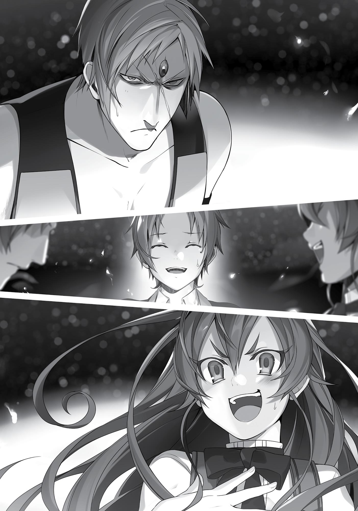

+++
title = "Chapter 2 The Superd"
date = 2026-07-20
weight = 1
[extra]
volume = 3
chapter = 2
+++
When I woke up, it was already night.
A black sky full of stars stretched above me. Shadows cast by a
flame danced across the ground. I could hear the crackling of burning
wood. It seemed I was sleeping next to a bonfire, although I didn’t
remember making one, or even setting off on a camping trip.
The last thing I did remember…was the sky abruptly changing
colors, and a wave of white light sweeping over us.
Oh, and then there was that dream. Not a very pleasant one…
“Gah!” A jolt of fear ran through me and I looked down at my
body. Fortunately, it wasn’t the slow, useless lump of flesh I used to
inhabit. I was back in the young but strong form of Rudeus. Seeing
that, my memories of the past began fading slightly, and a wave of
pure relief washed over me.
To hell with that Man-God. For a minute there, I’d felt like I was
back in the bad old days. Seemed like I was going to get a bit more
time in this world after all. Thank goodness. I had a ton of things I still
wanted to do here. Like cast aside my “Wizard” status, for one thing.
When I sat up, my back hurt; I’d been laid on the bare ground.
My immediate surroundings were a stretch of dry, cracked earth.
From what I could see, there was barely any vegetation at all. Were
there even no insects? I heard nothing except the sound of the fire.
It really was quiet out here. I felt like any noise I made would be
swallowed up by the total silence of the night. I couldn’t remember
having been in a place anything like this before; the kingdom of
Asura was covered in grasslands and forests after all. Had that wave
of white light done this?

No, no. According to the Man-God, I’d been teleported. This was
the Demon Continent presumably. A completely new and unfamiliar
land. Somehow, that light had sent me… Wait.
What about Ghislaine and Eris?!
My first instinct was to jump to my feet and start looking for
them. But just as I began moving…I noticed a girl sleeping on the
ground behind me, one hand clutching at my shirt.
Her vivid red hair was unmistakable. It was Eris. Eris Boreas
Greyrat—the girl I’d been tutoring back in Fittoa. I’ll skip the
background story for now, but I’d been teaching her reading and
arithmetic for three solid years at this point. She’d been a force of
nature at first: spoiled, violent, and totally out of control. But I’d
managed to navigate through some tricky events, such as rescuing
her from would-be kidnappers and teaching her to dance before her
birthday party. Eventually, I’d earned her respect and trust.
Of course, she still punched and kicked me on a daily basis. That
was just the way she was.
“…Hm.” For some reason, Eris had some sort of cloak draped
over her. I’d just been laid out in my clothes, but…oh well. The
principle of “ladies first” probably applied here.
My staff, Aqua Heartia, was also lying on the ground behind her.
Eris had given it to me as a present on my tenth birthday only a few
days ago. In any case, she didn’t have any obvious external injuries.
That was a relief.
Where’s Ghislaine, though?
Ghislaine Dedoldia was both our swordplay instructor and Eris’s
personal bodyguard. She was a fearsomely skilled beastwoman
who’d been teaching me the basics of her style in exchange for a
rudimentary education. The woman’s brain was allegedly “made of
muscle,” and she was definitely lagging behind Eris in her
studies…but in an emergency like this, she’d be far more useful than

the likes of me. It was possible she’d made the fire and put that cloak
over Eris.
I turned away from my sleeping student, and started looking for
my master. Right away, I spotted someone sitting near the fire,
whom I hadn’t noticed before.
But it wasn’t Ghislaine. It was a man.
“…”
He was staring at me, still and silent, as if to size me up. I froze
like a rabbit under a predator’s glare.
Despite my shock, I tried my best to study the man calmly. He
didn’t seem to be wary of us. If anything, it was more like…hmm.
How could I put this? Something about his body language reminded
me of the way my sister used to slowly, timidly approach a cat she
wanted to pet.
Was he worried about frightening these children he’d stumbled
across? That seemed to indicate he wasn’t hostile.
But just as I was breathing a sigh of relief, my mind picked up on
a few alarming details. His hair was emerald green, his skin porcelain
white, and he had something like a red jewel embedded in his
forehead. There was also a long scar running across his face. His eyes
were sharp, his features stern; even at a glance, he looked like a
dangerous man.
Just to drive the point home, there was a three-pronged spear
lying by his side.
When I was very young, I’d been tutored in magic by a girl
named Roxy who taught me many valuable, life-changing things. One
of the things she’d taught me concerned a certain race of demons—
the Superd. I remembered her words perfectly, even now.
Don’t talk to the Superd. Don’t go anywhere near them.

I wanted to spring to my feet, grab Eris, and start running wildly.
But I managed to suppress that urge at the last moment.
The Man-God’s advice had popped into my head: Rely on him,
and do what you can to help him.
I had absolutely no reason to trust that self-styled deity, of
course. Everything he said to me set off alarm bells, and now he’d
left me here with this incredibly suspicious character. How could I
trust him? This guy was a Superd for crying out loud. Roxy had
explained in great detail just how terrifying and violent they were.
Maybe some sort of god wanted me to help him out. Okay, fine.
But who was I going to trust here? Some shady character I met in a
dream, or my beloved master, Roxy?
Roxy, obviously. The question wasn’t even worth thinking about.
Which meant I should be running away now.
Then again…maybe that was why the “advice” was necessary in
the first place. If it weren’t for that dream, I probably would’ve fled
immediately. But even if I did manage to get away somehow, what
would my next move be?
I glanced at our surroundings for a second time.
It was dark; everything was completely unfamiliar. And the
cracked earth around me was covered in jagged rocks. If I took the
Man-God at his word, this was the Demon Continent. That would
mean I was a long way away from home.
Come to think of it…I’d had another odd dream earlier, although
I’d almost forgotten it after that memorable chat with the Man-God.
I’d been flying across this world at a ferocious speed. I swept past tall
mountains, open seas, thick forests, and deep valleys…many places
where I could have actually died. Maybe that hadn’t been a dream;
maybe I really had been teleported. The Demon Continent thing
seemed increasingly plausible.

And of course, I didn’t know where on the continent I was. If I
ran off now, I’d be wandering aimlessly in the middle of a massive
and foreign land.
In the end, I didn’t have much of a choice. Even if Eris and I
could get away from this man, we’d just end up hopelessly stranded
in the middle of nowhere. Of course, there was always a chance that
we’d find a village nearby when the sun came up. But was it worth
gambling everything on that?
No. Of course not. I knew perfectly well how tough it was to find
your way in unfamiliar country.
Calm down, man. Deep breaths. You don’t trust the Man-God.
Fine. But what about this guy? Look at him carefully. Look at the
expression on his face. He’s anxious. Anxious, and a little resigned.
He’s not some inhuman monster incapable of emotion, okay?
Roxy had told me to steer clear of the Superd, but she’d never
actually met one herself. I’d learned all about prejudice and
discrimination in my old world, and I knew how witch hunts
happened. The Superds were feared, but maybe they were just
misunderstood. Roxy surely hadn’t meant to lie to me, but there was
a chance she had the wrong idea.
My intuition told me this guy wasn’t going to hurt us. He didn’t
look nearly as shady or malicious as the Man-God. Rather than
Roxy’s warning or the Man-God’s advice, I decided to trust my own
instincts. I didn’t hate or fear this guy at first glance; his appearance
was just a little…intimidating. In that case, it wouldn’t hurt to talk. I’d
make up my mind based on how that went.
“Hello there,” I called to him.
After a pause, he responded with a brief, “Hello.”
So far so good. Hmm. What’s next?
“Are you a servant of god or something?”

The man tilted his head in puzzlement. “I’m not sure what you
mean by that, but I found you two here after you fell from the sky. I
know human children are delicate, so I made this fire to keep you
warm.”
No mention of my faceless friend, huh? Was this guy not in on
the divine plan? Based on what the Man-God said about his motives,
maybe watching me was only half the fun. Seeing how other people
reacted to me was probably just as interesting. In that case, this man
really might be trustworthy.
“That was very kind of you. Thank you for helping us.“
“…Are you blind, boy?”
Now that was a peculiar question. “What? No, my vision’s
perfect, actually.”
“Did your parents not teach you about the Superd then?”
“My parents didn’t, but my master did warn me to stay away
from them at all costs.”
The man paused again, then spoke more slowly and carefully
than before. “You’re disregarding your master’s words, you know.”
The unspoken question, of course, was: I’m a Superd. Are you really
okay with that? The man seemed surprisingly insecure. “Aren’t you
afraid of me?”
Not afraid, no. But I am a little suspicious of you.
There was no need to say that aloud of course. “I think it would
be impolite to fear a man who just helped me.”
“Hm. You say the strangest things, child.” There was a look of
genuine bewilderment on his face now.
I didn’t think I’d said anything particularly odd, but maybe the
Superd took it for granted that everyone would run screaming at the
sight of them. I’d learned a bit about the Laplace War, the fourhundred-year conflict between humanity and demonkind that ended

only a century ago. I knew that the Superd had been shunned ever
since it came to an end. The world was slowly shedding its prejudices
against other types of demons, but the Superd were definitely a
special case. Every other race seemed to loathe them as passionately
as the Japanese people hated American soldiers during World War II.
They were portrayed as something close to the embodiment of pure
evil.
Without my knowledge of racism from my old life, I probably
would have shrieked in terror at the sight of one.
The man said nothing. He tossed a twig into the fire and it
popped loudly. Eris moaned at the sound and began stirring. She
seemed on the edge of consciousness.
Wait. That’s not good. She’s definitely going to make a scene. I
should at least introduce myself before things get totally chaotic.
“I’m Rudeus Greyrat. What’s your name, sir?”
“Ruijerd Superdia.”
Superdia was presumably the common last name used by all the
Superds. That was how things typically worked with the demonic
peoples. For the most part, only humans took family names,
although there were a few eccentric exceptions among the other
races. Likewise, Roxy’s last name was Migurdia, according to the
Dictionary of Demonkind she sent me during my stint as Eris’s tutor.
“Well, Ruijerd, I think this young lady is going to wake soon. She
can be very noisy at times, I’m afraid. Let me apologize in advance.”
“No need for that. I’m used to it.”
Given her aggressive approach to life, there was a real risk Eris
might take a swing at Ruijerd the instant she laid eyes on him. We
needed to have a quick conversation while we had the chance.
Hopefully that would keep things from getting too hostile later on.

“Pardon me. I’m going to move a little closer.” With a glance at
Eris to make sure she wasn’t waking up just yet, I scooted around the
fire and settled down next to Ruijerd. Up close, I could make out his
clothes in the faint, flickering light. His embroidered vest and
trousers seemed like some type of tribal garb—the sort of thing an
indigenous person might have worn.
Ruijerd seemed more uncomfortable than anything else. But
honestly, that was much less off-putting than the Man-God’s brand
of pushy friendliness. I said, “Not to change the subject, but where
are we at the moment?”
“The Biegoya region, in the Northeast of the Demon Continent.
We’re not far from the old Kishirisu Castle.”
“Oh. I see…” I’d seen Kishirisu Castle on a map once. It was a
long, long way away from Asura. “Why did we land all the way out
here, I wonder?”
“If you two don’t know, I certainly wouldn’t.”
“Yeah, I suppose not.”
I guess strange things can just happen when you’re in a world
with dragons and magic, but…
It didn’t seem like a coincidence that we’d run into a major
character like Perugius’s lieutenant right before this happened. For
that matter, it could be that the Man-God had played some part in
things as well. If we’d been caught up in this by sheer coincidence, it
was a miracle we were even alive.
“Well, in any case, I’m very grateful that you helped us.”
“There’s no need for gratitude. Just tell me where you hail
from.”
“We’re from the Kingdom of Asura on the Central Continent.
The city of Roa in the Fittoa region specifically.”
“Asura…? That’s certainly a far-off land.”

“It certainly is.”
“Not to worry though. I’ll see you back there safe and sound.”
The Northeast of the Demon Continent was on the opposite side
of the map from Asura. In sheer distance, it was comparable to a trip
from Paris to Las Vegas. And in this world, of course, you couldn’t
just hop on an airplane. Even sea travel was only possible on specific
routes, so any intercontinental journey required lengthy detours
over land.
“Do you have any idea what may have happened, boy?”
“Well, uhm…the sky started glowing all of a sudden, then
someone who called himself Almanfi the Radiant showed up and told
us he’d come to stop some sort of abnormality. We were still talking
to him when this wave of bright, white light hit us. Next thing I knew,
I was waking up here.”
“Almanfi…? So, Perugius got involved? The situation must have
been truly grave then. You’re lucky you were merely teleported.”
“True enough. If that had been some sort of explosion, we’d
both be dead.”
I noticed Ruijerd hadn’t seemed too surprised by the whole
Perugius thing. Maybe it wasn’t that unusual for our legendary hero
to show up every now and again. “By the way, Ruijerd…have you
ever heard of a Man-God?”
“Mangod? Doesn’t sound familiar. Is that someone’s name?”
“Never mind. It’s not really important.” It didn’t feel like he was
lying to me, and I couldn’t imagine why he’d feel the need to.
“In any case…the Kingdom of Asura is it?”
“It’s all right, I wouldn’t ask you to take us all that way. If you
could just escort us to the nearest town, I think we—”
“No. A Superd warrior never goes back on his word.” Ruijerd’s
words were firm, his voice full of stubborn pride. It was enough to

make me want to trust him, even putting aside the Man-God’s
advice.
Right now, however, I needed to stay skeptical. “But we’re
talking about a journey to the other side of the world.”
“Don’t worry yourself about that, child.” With that, the man
reached out and timidly patted me on the head. I saw relief on his
face when I didn’t jerk away from his hand.
Was this guy just fond of children maybe? Still, we weren’t
talking about a ten-minute stroll back home here. I couldn’t exactly
take his promises at face value right now…
“Think of it this way,” the man said. “Do you know the language
here? Do you have any money? Do you know the roads?”
Oh. Huh. Hadn’t even occurred to me until now, but…I’d been
speaking in the Human Tongue this whole time, and this demon man
was responding fluently. Interesting. “I can speak Demon-God
actually. And I’m a competent magician, so I can earn money for
myself. If you take us to a town, I’ll find out where we need to go.” I
wanted to steer this conversation toward a polite refusal if possible.
Ruijerd himself might be trustworthy, but I didn’t like the idea of
things playing out exactly as the Man-God wanted.
If my cautious words hurt him, the man didn’t let it show. “I see.
At least allow me to protect you then. Abandoning such young
children would blemish the honor of the Superd.”
“Well, I wouldn’t want to disgrace such a proud people.”
“Not to worry. We’ve already taken care of that ourselves.”
I chuckled a little, and Ruijerd’s lips curved upward slightly.
Unlike the Man-God’s hollow, disturbing grin, there was some
genuine warmth behind his smile.
“In any case, I’ll take you to the village where I’m staying
tomorrow morning.”

“All right.”
I didn’t trust that so-called god further than I could throw him,
but this man was different. It couldn’t hurt to give him a chance.
Until we reached that village at least.
A little while later, Eris’s eyes snapped open.
Sitting bolt upright, she looked around the area, her expression
increasingly anxious. After a moment her eyes met mine, and I saw
relief flash across her face.
An instant later, she noticed the man sitting next to me.
“Aaaaaaaaaaaaaaaaaaaah!!!” Shrieking like a banshee, Eris
tumbled backward, then tried to get up and run. But her legs gave
out under her and she collapsed to the ground. “Nooooooooooo!”
The girl was in a state of total, blind panic. But she wasn’t
thrashing around violently, or even trying to crawl away. She just lay
where she’d fallen, trembling in terror, wailing at the top of her
lungs. “No! No, no, no! Please, please, no! Ghislaine! Ghislaine, help
me! Ghislaine! Why aren’t you coming?! Noooo! I don’t want to die!
I don’t want to die! I’m sorry! I’m sorry! I’m sorry, Rudeus! I’m sorry I
pushed you away! I’m such a coward! Now I’ll never get to…k-keep
my promise! Aaah…ah… Waaaaaaah!”
After carrying on for quite a while, the girl finally curled up into
a ball and began bawling incoherently. Just watching her sent a cold
shiver down my spine. I can’t believe how terrified she is…
Whatever else you could say about her, Eris was a strong-willed,
confident girl. As far as she was concerned, the world was hers for
the taking. She always tried to bulldoze through every obstacle in her
path; as a general rule, the girl threw punches first and talked later.

Had I…gotten the wrong idea here maybe? Was running into a
Superd literally a matter of life and death?
A bit unsettled, I glanced over at Ruijerd. “That’s a more typical
reaction,” he said.
You can’t be serious.
“So I’m the one who’s behaving oddly here?”
“Yes, you’re acting rather strangely. However…”
“However?”
“I can’t say that I mind.”
The man’s face was a picture of loneliness. I felt a stab of
genuine sympathy.
I got to my feet and walked to my cowering pupil. Eris twitched
in fear as my footsteps drew closer; I squatted down next to her and
began gently rubbing her back. It brought back memories from a
different life, of a time when my grandma had comforted me in the
exact same way. “Come on, it’s okay. There’s nothing to be afraid
of.”
“Hic… Of course there is! Th-that man’s a Superd!”
I still didn’t entirely understand why she was so terrified,
honestly. I mean, this was Eris—the girl who’d fearlessly attacked
Ghislaine, an actual Sword King. I’d thought she wasn’t afraid of
anything.
“What’s so scary about him though?”
“H-he’s a Superd, stupid! They… They eat children! While
they’re still alive! Hic.”
“Hm. I don’t think that’s true.”
I turned back to Ruijerd for confirmation, and he nodded
gamely. “We don’t eat children, no.”
Yeah, didn’t really think so. “You hear that, Eris?”

“B-but… But they’re demons! Demons!”
“Yes, that’s true. But he speaks Human just fine fortunately.”
“Look, that’s not the point, okay?!” Jerking her head up off the
ground, Eris looked up at me with fire in her eyes.
Much better. Now that’s the Eris we know and love. “Hmm, you
sure you want to stick your head up like that? Maybe he won’t eat
you if you stay curled up on the ground.”
“Argh! S-stop making fun of me!” Clearly infuriated by my
teasing, Eris shot me another glare, then whipped her head around
to do to the same to Ruijerd…at which point, she started trembling
again.
Were those actual tears in her eyes? Good thing she wasn’t
standing up with her legs spread wide, the way she usually did. Her
knees would probably be shaking like crazy.
“N-nice…to meet you, s-sir. I’m…E-Eris B-Bo-Boreas…Greyrat!”
Despite it all, the girl still managed to stutter out a polite
greeting. It was a little comical, especially coming right after she’d
glared daggers at him. Come to think of it, though, taking the
initiative to introduce yourself was never a bad idea when you were
speaking to a stranger. Someone had taught me that a long time ago.
“Eris Boboboreas Greyrat, is it? You humans have taken to giving
yourselves some peculiar names of late, it seems.”
“No, no! It’s Eris Boreas Greyrat! I just stuttered a little, that’s
all! Look, how about you introduce yourself, huh?!”
An instant after she’d finished shouting at him, Eris’s face went a
little pale. Seemed like she’d forgotten who she was talking to for a
second there.
“Of course. My apologies. I’m Ruijerd Superdia.”

When Ruijerd responded calmly, an expression of relief flashed
across Eris’s face, then quickly gave way to a confident, cocky grin. It
seemed she’d retroactively decided she wasn’t scared of him one bit.
“See? He’s not so bad. You can make friends with anyone, so
long as you can communicate with them.”
“Yep! You’re right, Rudeus. Honestly, Mother’s such a silly liar!”
So she’d heard about the Superd from Hilda then? I was a bit
curious about the stories she’d been told. They must have been
pretty awful.
Eris’s reaction was relatively understandable. I probably
would’ve freaked out more than a little if I ran into a Teke or
Namahage in real life, after all.
“What did Miss Hilda tell you about the Superd?”
“She always said they’d come to eat me unless I went to bed on
time.”
Ah, so they were the classic bedtime boogeyman in this world,
huh? Kind of like the Putaway Man back in Japan. “Well, this Superd
doesn’t seem interested in eating us. We could brag about making
friends with him once we make it back it home, right?”
“Oh. D-do you think Grandfather and Ghislaine would be
impressed…?”
“Of course.”
I glanced over at Ruijerd. There was an expression of mild
surprise on his face. So far so good. “You know, I think Ruijerd’s
actually a bit of a loner. He’d probably agree to be your friend right
away if you asked him.”
“B-but…”
I did feel like I’d put the matter in pretty childish terms, but Eris
looked a bit hesitant. Come to think of it, she didn’t really have any

“friends” herself, did she? I was probably slightly outside that
category for her…
No wonder she’d feel bashful then. The girl just needed a little
push. “Isn’t that right, Ruijerd?”
“Huh? Er, of course. I would very much appreciate it, Eris.” It
took the man a moment, but he took his cue eventually.
“W-well, if you insist! I suppose I’ll be your friend!”

The sight of Ruijerd bowing his head to her was enough to break
through the last of Eris’s defenses. Everything was really was so
simple with her. It made me feel kind of ridiculous for overthinking
things so much. Then again, I guess someone needed to compensate
for her impulsiveness.
“Phew. Okay then. I think I’m going to get a little more rest, if
you don’t mind.”
“What the heck, Rudeus? You’re going to sleep already?”
“Yes. I’m tired, Eris. Very tired.”
“Really? Well, that’s a shame. Good night then.”
I curled up on the ground, and Eris gently draped the cape she’d
been lying under over me. Presumably it belonged to Ruijerd. For
some reason, I really was completely exhausted.
Just as I was drifting off to sleep, I caught a few snatches of
conversation from the direction of the fire.
“Are you not afraid of me anymore, girl?”
“I’m fine. I’ve got Rudeus with me.”
Right. I’m going to get Eris home safe at least. No matter what.
With that final thought, I let myself sink into unconsciousness.
