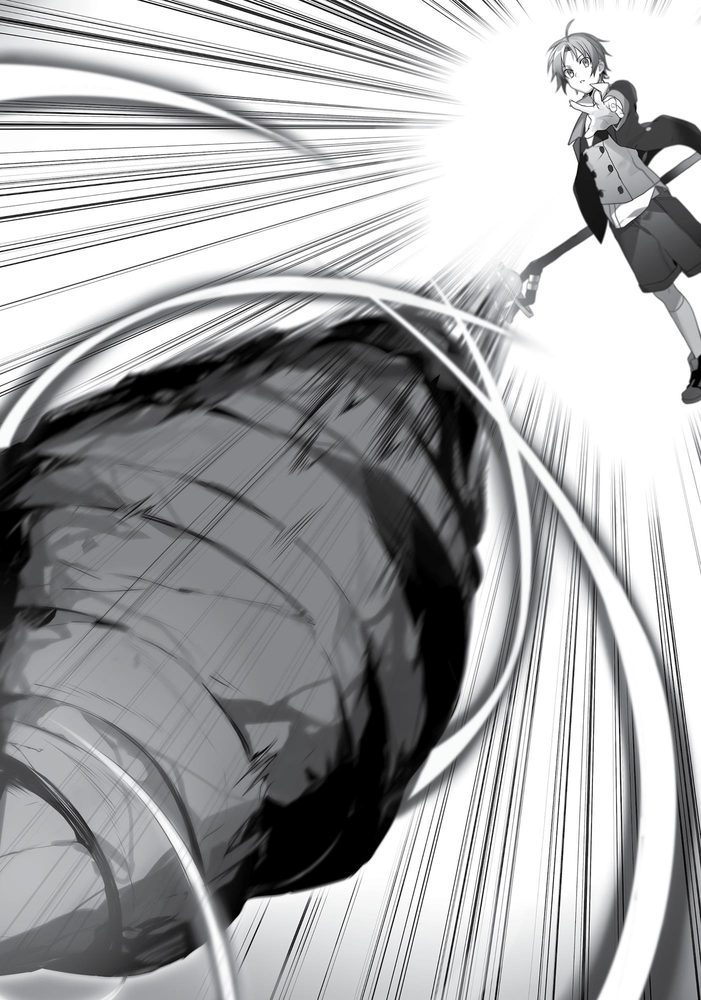

+++
title = "Chapter 5 Three Days To The Nearest Town"
date = 2026-07-20
weight = 4
[extra]
volume = 3
chapter = 5
+++
The next morning, as the three of us were leaving the
village, I spotted Rowin standing at his post by the gate.
“Good morning. Are you on guard duty again?”
“Yes. I’ll be out here until the hunting party returns.”
The other men of the village still hadn’t shown up since
yesterday. Had Rowin been out here all night, like some NPC guard
from an RPG? That always seemed like a pretty simple job…just
standing in the same place all day, never moving an inch. Still, was he
seriously going to be handling this all alone until the others got back?
Oh, I guess there’s Elder Rokkus. In a village this small, he
probably has to pitch in too.
“Are you leaving already?” Rowin asked.
“Yes. We managed to talk things through last night.”
“Ah. I was hoping to ask you more about my daughter, but…”
“Ordinarily I’d love to talk, but I’m afraid we need to get on the
road soon.”
“Right…”
The man was clearly disappointed. The feeling was mutual. I
would’ve loved to hear some embarrassing stories from Roxy’s
childhood.
“If I see her again, I’ll make sure to tell her to get in touch with
you.”
“Please do,” Rowin said, bowing his head in gratitude. I’d have
to make a mental note about this. “Oh, that reminds me! Wait just a
minute.”

He ran into the village and into one of the houses—presumably
Roxy’s childhood home. After several minutes, he emerged with a
girl who bore a striking resemblance to my master. At first I wasn’t
sure why he hadn’t just used telepathy to call her outside, but then I
noticed that he was also carrying some sort of sword. Were they
giving us a present?
“This is my wife.”
“Nice to meet you. My name is Rokari.”
Ah. So this was the mom of the family then? “I’m Rudeus
Greyrat, ma’am. I have to say, I didn’t expect Roxy’s mother to be so
young.” I found myself bowing slightly. I owed these two a great
deal, in a sense: they raised Roxy, and without her, I probably
wouldn’t have set out into the world the way I did.
“Oh my, what a flatterer. I’m 102 years old, you know?”
“Uhm, well…that’s still young in my book.” Apparently, the
Migurd reached physical maturity by age ten or so, and didn’t visibly
age until they hit 150. “I owe Master Roxy a great deal, ma’am.”
“Master…? Goodness, it’s hard to imagine that girl teaching
anyone much of anything. She must have changed a great deal….”
“She taught me all sorts of things. I’m very grateful to her.”
At this, Rokari blushed a bit and murmured, “Goodness.”
Seemed like she’d gotten the wrong idea somehow.
“In any case,” Rowin said, “I’m glad you showed up when I
happened to be on duty.”
“Yes. I’m very glad to have met you both as well. Roxy did so
much for me, really… Hmm. Maybe I should call you Dad?”
“Hahaha… No. Don’t.”
Ouch. The man didn’t even crack a smile. His poker face
reminded me a bit of Roxy’s. Made me a little nostalgic.

“All jokes aside, I do want you to have this,” Rowin said, holding
out the sword. “I know Ruijerd’s with you, but you’ll sleep better if
you have a weapon of your own.”
“I’m not exactly unarmed really,” I said, accepting the sword and
drawing it from its sheath.
The blade was wide, single-edged, and only about sixty
centimeters long. It was also slightly curved, like a machete or a
cutlass. A few dings suggested that it had been in use for many years,
but the cutting edge itself wasn’t chipped at all. It sure looked like
they’d taken good care of this thing; it was clean, beautiful even. But
there was also something oddly threatening about it. Maybe it was
the way the dull grey steel glowed faintly green when it caught the
light.
“We got this from a blacksmith who wandered into the village
quite some time ago. It’s a sturdy thing. Even after years of usage,
the blade’s still perfect. It’s yours if you want it.”
“Thank you very much,” I said. “We’ll gladly take it.” This was no
time to be modest. Right now, we needed all the help we could get. I
could fight just fine as I was, but Eris could certainly use a weapon.
She’d trained in the Sword God style after all; it’d probably make her
feel less anxious to have a sword, even if she didn’t need to use it.
“Here’s a bit of cash as well. It’s not much, but it should cover
two or three nights in a decent inn at least.”
Ooh, we got some pocket money!
I opened the pouch in excitement and found that it contained
some coins of rough stone and a few made of dull grey metal. From
what I recalled, currency on the Demon Continent consisted of green
ore coins, iron coins, scrap iron coins, and stone coins. Their value
was lower than the equivalent currencies elsewhere in the world;
even the green ore coins, which were the most valuable, were only

worth an Asuran large copper or slightly less. The iron coins were
pretty close to coppers.
If we said one stone coin was worth one Japanese yen, the
currencies would probably look something like this:
Asuran gold coins: 100,000yen.
Asuran silver coins: 10,000yen.
Asuran large coppers: 1,000yen.
Asuran coppers: 100yen.
Green ore coins: 1,000yen.
Iron coins: 100yen.
Scrap iron coins: 10 yen.
Stone coins: 1 yen.
At a glance, those numbers should make it clear just how
powerful and prosperous a kingdom Asura was, especially in
comparison to the poverty of the Demon Continent.
Of course, the Demon Continent had its own economy, so prices
weren’t always comparable. It wasn’t like everyone here was
starving.
“…Thank you very much.”
“I only wish we could have talked about Roxy a little longer,”
Rokari murmured, echoing Rowin’s earlier words.
They certainly seemed to be worried about their daughter. Even
if the girl was forty-four by now, in human years that was
basically…twenty or so. It was understandable enough.
“I guess we could stay another day, if you like…”

Rowin shook his head. “Don’t worry. We know she’s all right
now, and that’s what matters. Right, dear?”
“Yes. She always had a tough time here, I’m afraid. We were
rather worried.”
I could see how it’d be tough living in a little place like this
without that telepathic power everyone else seemed to have. In
general, you didn’t really hear the sounds of conversation in this
village. Everyone was probably communicating silently using their
minds. Roxy couldn’t participate in those conversations, or even
overhear what others were saying to each other. It was small wonder
that she ran away from home.
“Well, all right then. I hope we meet again someday.”
“Sure. But if we do, try not to call me Dad, all right?”
“Hahaha. R-right, sure.” I get the message, man…
It was hard to know when or if I’d see Roxy again, but at the
very least, I’d have to repay them for the money someday.
***
Evidently, the closest town was a three-day journey on foot.
Not long after we set out, it became clear how crucial an asset
Ruijerd really was. The man had been traveling the area on his own
for many years now; he knew all the roads, and he knew exactly how
to set up a proper camp. Not to mention his biological “radar,” which
alerted us to incoming threats well in advance.
It was ridiculously convenient to have him around.
“Ruijerd, would you mind teaching us about the things you’re
doing?”
“Why?”

“So we can make ourselves useful.” Given the long journey
ahead, Eris and I were both in need of a crash course in basic
camping skills.
Fortunately, Ruijerd proved a willing enough teacher. “Let’s start
with making a fire. Unfortunately, the Demon Continent doesn’t
have any wood suitable for the purpose.”
Hm. Our first meeting had been around a campfire, so there was
obviously some other way, but… “Is there something else you use
instead?” I asked.
“Yes. We burn parts of a certain monster.”
“Ah.” That should have been my first guess honestly. Out here,
almost everything you needed to survive seemed to come from
hunting monsters.
“Fortunately, there’s one close nearby. Wait here for a moment,
boy.”
“Wait, Ruijerd!” The man was already turning away, but I
managed grab his shoulder before he could run off.
“What is it?”
“Were you going to fight it by yourself?”
“Of course. Hunting is warriors’ work. The children stay behind.”
Okay. So he was apparently planning to keep doing things this
way forever. To be fair, the man had been alive for more than 500
years…we weren’t even old enough to be his great-greatgrandchildren. And he was probably more than strong enough to
handle all the fighting by himself.
Still, there was always a chance something could go wrong. If
Ruijerd died or somehow ended up unable to fight, Eris and I would
be forced to fend for ourselves. And right now, we had no real-world
combat experience to speak of. What was going to happen if we lost

him while our party was traveling through a deep, dangerous
forest…or in the middle of a battle with a fierce group of monsters?
I didn’t like our odds of surviving in a situation like that. We
needed to get some experience now, while we had the chance.
It’d be nice if I could convince Ruijerd to teach us how to fight,
but…
No. That wasn’t the right way to think about this. This was a
give-and-take relationship; we were partners on equal footing,
working together to achieve our goals. All three of us needed to
figure out how to fight as a party.
“Okay, but we’re not just children.”
“Yes you are.”
“Uh…look, Ruijerd.” I had to be firm and clear about this. The
man was still under the impression that he was our guardian; he
needed to understand that wasn’t the case. “We’re helping you, and
you’re helping us. Our goals are different, but we’re going to fight
together… So all three of us are warriors, right?”
With the sternest expression I could muster, I met Ruijerd’s gaze
directly and waited for a reply.
It only took ten or fifteen seconds for him to make a decision.
“…Very well. You’re warriors then.”
I can’t say the man sounded particularly convinced, but at least
he was going to let us tag along from now on. That was the
important thing. “Hear that, Eris? You’re going to fight, too, aren’t
you?”
Eris blinked with surprise, but managed to stammer out an “Oof course!” and vigorously nodded her head. Good girl.
“All right then, Ruijerd,” I said, returning to my usual demeanor.
“Can you lead us to this monster, please?” There was no point acting

all aggressive anymore. You had to be forceful when you were
negotiating, that was all.
***
The first enemy we faced as a group was a monster known as a
“Stone Treant.”
Treant, in general, was a term for tree-like monsters. These
were typically ordinary plants that had sucked up too much magical
energy and mutated into violent creatures.
There were a considerable variety of specific monsters that fell
into this broad category. First, you had the Lesser Treant, found all
over the world. These were mutated saplings that tended to imitate
ordinary trees until a target wandered into striking distance. They
were weak and slow enough that an average adult with no real
training could chop one apart without too much difficulty.
However, if a Lesser Treant happened to absorb enough
nutrients from one of the Fairy Fountains located throughout the
Great Forest, it would eventually mature into an Elder Treant. The
highly concentrated magical power of the Fountains granted these
monsters the ability to use various water spells.
There were also Old Treants, which were already massive before
they mutated, and Zombie Treants, trees that transformed after they
withered…among many others. Of course there were distinct
differences between all these varieties, but their basic patterns of
behavior were very similar. They pretended to be normal trees and
attacked anyone who came too close. After some time, they
produced seeds that grew into more of their kind.
The Stone Treant was something of a special case, though. It
actually disguised itself as a rock.

You might be wondering how a tree could pull off that bit of
camouflage. The answer was simple actually: Stone Treants had
mutated into monsters back when they were still seeds. They could
stay in their seed form even as they grew enormous, and were
capable of abruptly transforming into tree-monsters whenever
someone got too close.
In their normal form, they were completely inconspicuous. They
didn’t have a distinctive shape like a sunflower seed—at a glance,
they really did look like lumpy, vaguely potato-shaped boulders.
“Is there anything we should keep in mind while we’re fighting
this thing?”
“Hm. You’re a magician, yes?”
“That’s right.”
“Don’t use any fire spells then.”
“Oh. Would they not work on it?”
“We can’t use the thing for firewood if you burn it to a crisp.”
“Ah, right. Of course.”
“No water magic, either.”
“Because we don’t want the wood getting damp?”
“Exactly.”
Okay then. As far as Ruijerd was concerned, this thing was
clearly less of a threat and more of a living piece of lumber. That
meant it posed no real danger to us so long as we were with him. We
could fight it without much actual risk.
“All right then. Let’s try having Eris and me fight for now.
Ruijerd, you just step in to help out Eris if she’s in danger, okay?”
“Is there a point to keeping me in reserve?”

“I just want to see how well Eris and I can handle ourselves in a
real battle. After this one, we’ll watch you in action and see what we
can learn.”
“Very well.”
With that settled, I put us in a simple battle formation—Eris up
in front, and me all the way in the rear. It seemed like the best
choice, given her sword fighting skills.
I was a little hesitant to put my adorable little pupil on the
frontlines, of course, but she wasn’t going to be much use held back
in the middle of a formation. That sort of position was all about
supporting your frontliners, and Eris was terrible at that sort of
teamwork. Also, Ruijerd probably wouldn’t need much in the way of
backup anyway. We’d be best off letting Eris fight freely, with Ruijerd
and myself following up to support her.
“Okay, Eris. I’m going to soften it up with one good hard shot
from a distance. After that, you move in and finish it off. I’ll try to at
least call out the names of the spells I’m using, but if things get hectic
I might not have the time. Just keep that in mind, okay?”
Eris nodded energetically, giving her new sword a few
experimental swings. “No problem!” The girl was clearly raring to go.
I lifted my staff and paused to think things over. Fire and water
spells were out, and just looking at the thing, wind didn’t seem like it
would be too effective. That left me with earth. Earth was fine by
me. I’d gotten pretty good with it after all those figures I’d made.
Still, this was the first time I was fighting an actual monster.
Better give this my all.
Closing my eyes, I drew a single, deep breath, then channeled
my magical energy to and through my hands. It was something I’d
done tens of thousands of times by now; at this point, I could have
cast spells with both my legs cut off.
“All right…”

Projectile: Bullet-shaped rock.
Toughness: As hard as possible.
Shape: Snub-nosed, with multiple grooves.
Modifications: High-speed rotation.
Size: Slightly larger than a man’s fist.
Velocity: As fast as possible.
“Stone Cannon!”
As the words left my mouth, a rock shot from the end of my
staff with a ferocious bang. It zipped forward in a nearly perfect
horizontal line, and smashed into the camouflaged Stone Treant that
lay in wait ahead of us.
With an ear-splitting sound, the monster blew apart into tiny
pieces. I’d killed it extremely dead.

Eris had already started running forward, but after my attack
landed, she stopped in her tracks and turned to glare sulkily in my
direction.
“What happened to softening it up, Rudeus?! Am I supposed to
chop up the corpse?!”
“S-sorry. I’ve never done this before either, you know? I guess I
used too much force…”
“Ugh! Get it together!”
Eris wasn’t exactly pleased that I’d ruined her first real battle,
but I seriously hadn’t expected to kill the poor thing quite that easily.
All I’d really done was tweak the standard Stone Cannon spell by
making the projectile a bit more like a hollow-point bullet. People
back home on Earth sure came up with some nasty stuff…
At this point, I noticed that Ruijerd was gazing at me as well. Or
at my staff, to be more precise.
“Is that weapon some sort of magical implement?”
“No, it’s just a staff. A very high-quality one, though.”
“But you didn’t recite an incantation or use a magic circle…”
“Right. It isn’t possible to change the shape of the projectile if
you use the incantation, so I just skip that part.”
“…I see.” At this point, Ruijerd fell into a thoughtful silence. The
man may have been around for more than 500 years, but it seemed
like silent spellcasting wasn’t something he’d seen too many times
before.
“In any case…is that your magic at its most powerful?”
“Well, no. I could also make that projectile explode when it hit
the target.”
“Hmm. I think it might be best to refrain from using your spells
when the enemy’s close to your allies, Rudeus.”

“Uh, yeah. Good point.”
This was the first time I’d actually hit something with that spell,
but it was definitely…more destructive than I’d expected. Even
grazing someone with it might kill them instantly. Ideally I would’ve
switched over to some support-type spell, but nothing really came to
mind. Up till now, I’d only really thought about fighting on my own.
How did other magicians approach their role in combat anyway?
“Ruijerd, if I wanted to support you two with my magic, what
sort of things should I be doing?”
“I don’t know. I’ve never fought alongside a spellcaster before.”
Well, whatever. We had a seasoned Superd warrior on our side.
We didn’t need to imitate the way normal parties did things. I could
think about getting us coordinated later; for now it was more
important that Eris and I got some real combat experience.
“Okay… I hate to impose, but would you mind finding us another
enemy?”
“Very well. There’s something we need to do first, however.”
“Oh? What’s that?” Maybe this was the part where we said a
little prayer for the creature we’d slain?
“We have to gather the wood. You scattered it all over the
place.”
Using wind magic, I proceeded to gather up the shattered pieces
of the Treant.
***
Our party kept moving until the sun set, fighting a total of four
battles. We faced another Stone Treant, a Great Tortoise, an Acid
Wolf, and a group of Pax Coyotes.

Ruijerd brought down the Great Tortoise with a single attack. He
just ran right up to the thing and jabbed his trident up through its
skull. His movements were beautifully fluid and efficient. The man
had been in the solo monster-hunting business for 500years, and it
really showed. I felt a little stupid for having gotten smug over
blowing up a single Stone Treant.
Acid Wolves were large canines that could spit some kind of
caustic fluid from their mouths. We only ran into one, so Eris took it
down, stepping forward sharply to send its head flying with a single
slash. Compared to Ruijerd, it wasn’t exactly elegant, but it was still
an instant victory.
Unfortunately, the wolf’s blood sprayed all over Eris, so she
wasn’t in any mood to celebrate. I was concerned that its blood
might be dangerous as well, but apparently that wasn’t the case.
She’d done well enough, given that it was her first real battle.
According to Ruijerd at least.
On that note, I took out the second Stone Treant in one shot. I
was hoping to deal some moderate damage so Eris could get more
practice in, but it proved surprisingly tough to make my spell less
lethal. Until I got the hang of moderating its power, I’d have to avoid
using it on people. Even if I needed to kill someone, there was no
need to make it gruesome.
The Pax Coyotes were our final encounter of the day, and the
most challenging. These monsters tended to come by the dozens.
They weren’t exactly “pack animals,” though—a single coyote
formed its own group by reproducing through division, almost like an
amoeba. Thankfully, it wasn’t like new ones would constantly pop
out in the middle of battle. They could only reproduce once every
few months or so. Even so, any given group would steadily swell in
size over time, with all the new coyotes under the complete control
of their leader. If that leader happened to fall in battle, a different
coyote would instantly assume its position. Their strength was

mostly in their sheer numbers, but their perfect coordination and
discipline made them genuinely dangerous.
The group we fought numbered about twenty. They probably
could’ve killed any run-of-the-mill adventurer, but Eris faced the
challenge cheerfully, swinging her new sword to and fro as Ruijerd
offered a steady stream of advice. The girl had never put her life on
the line in battle before today, but she didn’t look particularly tense.
All that practicing with Ghislaine had clearly imbued her with quite a
bit of confidence, and it seemed like the act of killing didn’t bother
her much.
For my part, I just hung back and watched as Eris cut down one
coyote after another. I’d been planning to step in and help if
necessary, but Ruijerd was playing his supporting role so flawlessly
that it might have been counterproductive. Still, doing nothing was
pretty boring, and I started to feel a little left out after a while.
Coming up with some way for us to fight as a group definitely
needed to be my top priority.
In any case…Eris really was a remarkable fighter. She’d reached
the Advanced level in the Sword God style just before my birthday,
right? At this point, I probably didn’t stand a chance against her
unless I was using magic. Heck, even Paul was only an Advanced level
swordsman…although he’d reached that rank in all three styles, and
had much more real-life combat experience. Still, Ghislaine said Eris
had more raw talent than Paul ever did. She’d probably leave him in
the dust in no time.
Eat it, old man.
“Rudeus! Over here!”
At some point, they’d finished off the last of the monsters;
Ruijerd was taking out his knives as I approached. “Pax Coyote pelts
are valuable. We were fortunate to find such a large group. Help me
skin them.”

But I had something else to attend to first. “Hold on just a
second.”
Walking over to Eris, I found her panting for breath…and
wounded in three distinct places. Less than thirty minutes had
passed since the battle began, but with Ruijerd devoting himself to
his backup role, it had fallen to her to actually kill the vast majority of
the monsters. Of course she’d be exhausted.
Couldn’t hurt to get those injuries dealt with now at least…
“Let this divine power be as satisfying nourishment, giving one who
has lost their strength the strength to rise again—Healing.”
“Thanks.”
“Are you all right, Eris?”
“Hah! Of course! I barely even broke a—mgh.”
That smug grin of hers looked a little gruesome with monster
blood all over her face, so I wiped some of it off with my sleeve. The
experience hadn’t shaken her in the slightest. That was…pretty
impressive. Personally, I was about ready to puke just from the smell.
“Hmm. No sweat, huh? That was your first real battle ever, you
know.”
“So what? I know how to fight. Ghislaine taught me everything.”
Right, right. Practice like you play, and play like you practice. Eris
always absorbed every word of Ghislaine’s lessons. Maybe it
wouldn’t be that surprising if she could apply everything she’d
learned in actual battle.
I mean, if you focused on fighting just like you’d been taught,
what difference did it make if your enemies actually bled?
“Good grief…” With a wry smile, I turned away and headed back
over to Ruijerd, who’d been watching us the whole time.
“Why did you have Eris do all the fighting, Rudeus?”

“I won’t always be there to protect her. I want to make sure she
can fend for herself when things get ugly.”
“Ah, I see.”
“On that note…what do you think of her so far?”
Ruijerd nodded thoughtfully before he spoke. “If she applies
herself, she’ll be a master swordswoman some day.”
“Really?! All right!” Eris literally jumped into the air, her face
shining with joy.
It had to feel pretty good hearing something like that from a
legendary warrior. I didn’t mind hearing that either; if Ruijerd
recognized Eris’s talents as a warrior, we stood a much better chance
of finding some way to work as an actual team.
“Okay then, Ruijerd. From now on, let’s have Eris fight in the
front while I hang back in the rear.”
“And what should I be doing?”
“You don’t have a defined position, so move around freely and
cover our blind spots. Oh, and if either of us get ourselves in danger,
take charge and tell us what to do.”
“Understood.”
For the moment, we had our basic combat formation worked
out. Hopefully it would allow Eris and myself to get some more
combat experience under our belts over the next couple of days.
***
Next up came camping practice.
For dinner, we had Great Tortoise meat. There was far too much
of it to eat in one sitting, so we started off by drying most of it out
for later—under Ruijerd’s direction of course.

To be blunt, the stuff was somewhat vile. Its scent was
overpowering and it was painfully tough to boot. Apparently the
normal approach was to soften it up in a simmering stew for hours,
but Ruijerd opted for the quick and easy route of roasting it over a
roaring fire.
At least the fire itself wasn’t too hard to get going. Stone
Treants evidently dried out very quickly after they died, so we didn’t
need to leave our wood sitting in the sun or anything. No wonder
Ruijerd saw those things as walking lumps of lumber.
“…Guh.” Honestly, though, this meat is seriously vile. Who said
this stuff was “delicious” anyway?
Wait, that was totally you, Ruijerd. You’re so full of it! I
mean…maybe if you covered up the smell with ginger, it might be
sort of edible? Maybe? Man, do I ever want some beef right now.
And rice…
A memorable line from a certain manga floated through my
mind: “Grilled meat is glorious. And it’s glorious because it’s tasty.”
Truer words were never spoken. Meat that isn’t tasty isn’t glorious in
the slightest.
In retrospect, I’d eaten very well in the Kingdom of Asura. Bread
may have been the staple food back there, but they usually
complemented it with meat, fish, vegetables, and some sort of
dessert, with all the variety of some three-star restaurant. And I’d
spent most of my time there way out in the sticks; wasn’t a spoiled
little princess like Eris going to have an even harder time adjusting?
When I looked over, though, I found her gnawing away
contentedly at her own chunk of meat.
“Hey, this isn’t half bad.”
Wait, seriously?!

Well…maybe it made sense. When you give a kid who’s only
eaten healthy stuff their first taste of junk food, they always go crazy
for it, right?
“What?” Eris said as I stared at her.
“Uh, it’s nothing. You enjoying that?”
“Yeah! I always…mngh…wanted to try something like this!”
I knew Eris loved listening to Ghislaine’s stories of life as an
adventurer. Maybe that had translated into fantasizing about eating
tough, nasty meat around a campfire? Kind of a weird fantasy, but
okay.
“It’s even edible raw, you know,” Ruijerd commented.
Eris’s eyes sparkled with curiosity, and a little chill ran down my
spine. Fortunately, I managed to speak before she could open her
mouth. “The answer’s no. Don’t even think about it.”
For crying out loud. Do you want worms? Because that’s how
you get worms.
***
Ruijerd was giving Eris a lesson on basic weapon upkeep before
we turned in for the night. For lack of anything better to do, I
listened in.
Ruijerd’s spear wasn’t made of metal, and Eris’s sword was
forged from special materials in a very specific way. Apparently
neither of them needed to worry about ordinary rusting. But that
didn’t mean they could skip their daily maintenance. Leaving dried
blood on a sword or spear would gradually dull their edges and
attract other monsters. From Ruijerd’s perspective, it was also your
fundamental responsibility as a warrior to take good care of your
weapon.

“Come to think of it, what’s that spear made of anyway?” I
asked, suddenly curious. Judging from the one Ruijerd carried, the
Superd tridents were pure white, totally unornamented, and on the
short side for a spear. From the looks of it, the whole thing was made
of a single substance; I couldn’t see any seam between the shaft and
head.
“It’s made of me.”
“…Say what?”
“The spear of a Superd is made out of their soul.”
Damn. I hadn’t been expecting such a…philosophical answer.
Okay, sure. Right. So your spear is, uh, your soul. And your soul
is your way of life, right? Your way of life is whatever lies in your
heart…and your heart is just what you love. So basically, you love
your spear passionately…or something?
Luckily, Ruijerd elaborated before I could get myself too tied up
in knots. “Every one of us is born with their own spear, you see.”
The Superd were born with a three-pointed tail. It grew with
them until they reached a certain age, at which point it would stiffen
up and fall off. Yet even when separated, it was still somehow part of
their body; the more they used it, the sharper and more deadly it
would grow. With enough time and effort, these tridents could
become peerless weapons, virtually unbreakable and capable of
piercing through pretty much anything.
“…And that’s why we mustn’t cast aside our spears until the day
we die.” Ruijerd’s face was full of bitter regret at the mistake he’d
made four centuries ago.
By this point, his spear was probably harder and sharper than
any other Superd’s in the world. I was definitely glad we had him on
our side.
Still, his outlook on the world…worried me sometimes. The man
was as rigid as his weapon. If you can’t bend a little sometimes, you’ll

never learn to accept other people as they are. And that means
they’ll never accept you either. There’s such a thing as being too
principled, you know?
In any case…after three days of fighting monsters and camping
under the stars, our little party managed to reach the nearest town.
