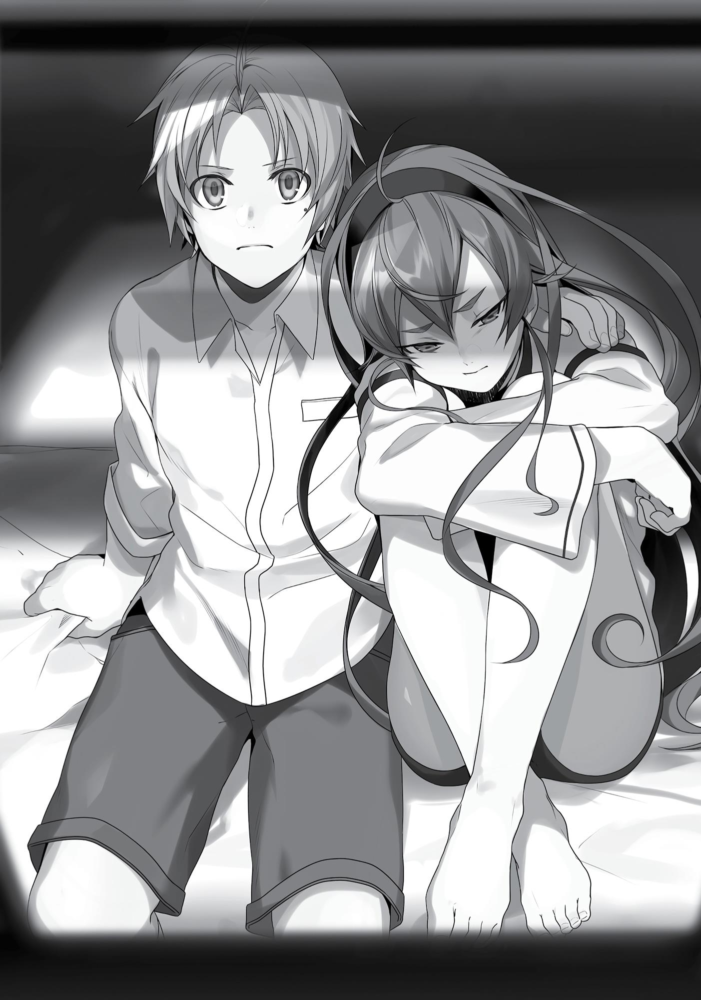

+++
title = "Chapter 8 The Adventurers Inn"
date = 2026-07-20
weight = 7
[extra]
volume = 3
chapter = 8
+++
By the time we left the guild, it was getting dark outside.
The sky was still bright, but the streets of Rikarisu seemed oddly
gloomy. After a second, I realized it was a side effect of its location;
the tall walls of the crater had cast the city into shadow well before
the sun actually set. It’d probably be pitch black in no time.
“I guess we should find an inn right away.”
Eris looked over me with a puzzled expression. “Can’t we just
camp outside the city or something?”
“Oh, come on. Might as well get a good night’s sleep in a real
bed when we’re staying in a town, right?”
“You think?”
Ruijerd didn’t seem to have an opinion one way or another.
When we were camping out in the field, he’d often handled the night
watch duties all by himself, since he could sense approaching
enemies even when he was half-asleep. I’d woken a couple times in
the middle of the night to the sound of something exploding, only to
realize that Ruijerd had just sliced apart some hapless monster. It
wasn’t exactly conducive to a relaxing rest.
Anyway, an inn was definitely in order. For one thing, I was
starving. We could probably buy something in the city, but we still
had a ton of dried meat left over from the other day. It was probably
smarter to finish that and keep our expenses down for now, but I
was hungry enough that I at least wanted someplace to sit down and
stuff my face in peace.
“Hey, Rudeus! Look at that!”
Eris’s voice was full of excitement. Curious as to what she’d
spotted, I looked up to find that the inner walls of the crater had

begun shining faintly; the light seemed to be growing brighter by the
second.
“This is amazing! I’ve never seen anything like it before!”
By the time the sun set completely, the crater’s walls were
brilliantly illuminating the stone and clay buildings of the city. It felt
like we’d stumbled into a lit-up amusement park.
“Wow. That’s really something, isn’t it?”
Of course, I’d spent my previous life in a place that never got
completely dark at any time, so I wasn’t quite as awestruck as Eris.
Still, this was definitely a magical spectacle. Why were the walls
shining like that anyway?
“Ah. Those are the illuminators.”
“Hm? You know something about this, Raiden?”
“Raiden? Who’s that? Hm. Was there a Sword God a few
generations ago with that name…?”
Naturally, the reference was completely lost on Ruijerd. There
probably wasn’t a single person in this entire world who would have
understood it. Kind of depressing.
“Sorry. I used to know someone by that name, and he knew all
sorts of weird things, so… It was just a slip of the tongue.”
“I see.”
Ruijerd reached down and patted me gently on the head, like a
man comforting a child who’d reminisced about a deceased parent.
Uh, just for the record, Raiden isn’t my dad’s name or anything.
My old man’s named Pat or Pablo or something like that. Pretty
decent father, pretty crappy human being.
“Anyway, what are these illuminator things?”
“They’re a variety of magic stone.”
“How do they work?”

“They absorb light during the day, then release it like this once
it’s dark. They shine for less than half as long as the daylight hours,
though.”
So they were basically solar-powered lights? I didn’t see
anything like these back in Asura. It was surprising they weren’t in
broader usage, considering how convenient they sounded.
“So why don’t people use these all over the place?”
“Mainly, it’s because the stones themselves are rather rare.”
“Huh? Looks like they’ve got a ton of them here, though…” It
had to take a huge number of those things to light up an entire city
like this, right?
“The Great Demon Empress apparently had them brought here
at the height of her power. You see that over there?” Ruijerd pointed
to the broken fortress at the center of the city, shining faintly in the
light of the stones. “It was all so her castle would glow beautifully in
the night.”
“Wow. That seems a little…excessive.” An image of the Demon
Empress popped unbidden into my mind. It was Eris in a dominatrix
outfit, shrieking, “More light! I need more light, so that the world
may know my beauty!”
“Doesn’t anybody try to steal them or anything?”
“I’ve heard it’s forbidden, but I don’t know the details.”
Right. This was Ruijerd’s first time in Rikarisu, too, after all. The
stones seemed to be positioned fairly high up the crater’s walls, so
maybe it was tricky to get to them unless you could fly.
“At the time, the project was widely condemned as a selfish
waste, but I suppose it’s proven useful in the end.”
“Hmm. Maybe the Empress actually did it for the good of her
citizens.”

“That I highly doubt. The woman was infamous for her
decadence and self-indulgence.”
Ooh. I like the sound of those words. If this lady’s still alive
somewhere, I’d love to meet her. We’re definitely talking about a
sexy succubus type here.
“Hey, sometimes truth’s stranger than fiction, right?”
“Is that some sort of human proverb?”
“Yep. Think about it though. The Superd don’t have a great
reputation either, but they’re actually kind-hearted people, aren’t
they?”
Ruijerd patted my head affectionately. I wasn’t sure how I felt
about being petted like this at my age, but…let’s think this over, shall
we? Yes, I was basically in my mid-forties, mentally speaking. But this
guy was in his 560s. Just chop off a digit if it’s too hard to wrap your
head around that. Now we’ve got the equivalent of a four-year-old
being patted by a fifty-six-year-old. That’s nice and heartwarming,
right?
“Hey, Rudeus! Why don’t we go check that place out?!” Eris
said, pointing at the ruined, jet-black castle looming ominously
against the night sky.
“Not tonight, Eris,” I said. “Let’s find an inn.”
“Oh, come on! We can just take a little look around!”
Well, now I’d got her pouting. It was charming enough that I was
tempted to indulge her, but based on what Ruijerd said earlier, this
light wasn’t going to last forever. The last thing we needed was to
find ourselves plunged into total darkness just as we reached the
castle.
“I’ve been feeling kind of worn out lately, Eris. I’d rather head to
an inn.”
“Huh? Are you all right?”

I wasn’t lying. It probably had something to do with the fact that
I wasn’t used to traveling, but I’d been feeling kind of sluggish for the
last few days. I could still move just fine in battle, so it hadn’t been a
major issue yet. Still, I did seem to be getting tired more quickly than
usual. Maybe the stress was getting to me. “I’m fine, Eris. It’s nothing
too serious.”
“Really? Well, all right then… I guess I’ll have to be patient.”
Now that was a phrase I never would’ve expected to hear from
Miss Eris Boreas Greyrat. The girl really had come a long way in the
last few years, hadn’t she?
***
We settled on a place called the Wolfclaw Inn. It had a total of
twelve rooms, and the rate was five stone coins per night. The
building itself had seen better days, but they openly welcomed
beginner adventurers, and the price was definitely fair. For an extra
stone coin, they provided morning and evening meals, and if you
were an adventuring party with more than two people staying in a
single room, they waived that fee altogether. As part of that newbiefriendly strategy, the rate stayed the same no matter how many beds
you used.
Their front lobby also doubled as a little tavern, with a handful
of tables and a few counter seats as well. When we walked in, one of
the tables was occupied by a group of three young adventurers,
which didn’t strike me as surprising.
The word “young” was relative here, of course. They were
probably older than I was, maybe about Eris’s age. All of them were
boys, and all of them were staring at us without making any attempt
to hide it.

“What should we do?” said Ruijerd, shooting me a glance. He
was presumably asking if we were going to put on another show.
“Let’s not,” I replied after a moment’s thought. “This is where
we’re sleeping, right? I’d rather be able to relax here.” There was no
telling how many nights we’d actually be spending in this particular
inn, but these boys were still children by Ruijerd’s standards. If we
stayed under the same roof for long, they’d naturally come to learn
that he was a good-hearted guy.
“We’re a party of three. We’ll be here three days at least.”
“Yeah, fine. You want the meals or no?”
The innkeeper here didn’t seem to be the friendliest. “Yeah.
Meals, too, please.” I handed over enough coins to cover our first
three days upfront. The free food thing was definitely a nice bonus.
This left us with one iron coin, three scrap iron coins, and two stone
coins…the equivalent of 132 stone coins, in total.
“H-hey, are you a rookie adventurer too?”
As I was listening to the innkeeper explain the rules and such,
one of the newbies wandered over and spoke to Eris. It was a kid
with white hair and a horn sticking out of his forehead; you could
probably have classified him as a “pretty boy,” if you were feeling
generous.
The other two…weren’t bad either, I guess. One of them was a
sturdy-looking, muscular guy with four arms, and the other had a
beak for a mouth and feathers where his hair should be. They were
all relatively handsome, although in different ways. If Horn-head was
a normal-type Prettymon, Four-arms was a fighting-type, and Beakboy was a flying-type.
“W-we’re pretty new to this ourselves actually. Want to come
eat with us maybe?”

Oh wow. He’s actually hitting on her. This little punk was pretty
damn precocious, huh? Too bad his voice was trembling. It was kind
of adorable, in a way.
“We can probably give you some advice on picking jobs and
stuff, you know?”
“…Hmph.” Eris’s only response to the boy’s offer was to turn her
face away. Way to go, girl! Give that little flirt the cold shoulder!
Well, not like she can even understand what he’s saying.
“C’mon, just for a bit? Your little brother over there can come
too.”
“…”
Just as I felt like I should intervene, Eris abruptly glanced across
the room and began walking away from the boy. I recognized the
technique of course. It was something she’d learned in Edna’s
etiquette lessons…a basic move from the Art of Avoiding Annoying
Aristocrats! Now then, how was the kid going to play this? At this
point, a gentleman would get the message and back down
gracefully…
“Hey, don’t ignore me.”
Horn-head was evidently not a gentleman. Clearly irritated, he
reached out and grabbed the bottom of Eris’s hood. The kid yanked
Eris backward, but she had enough lower-body strength to keep her
balance. As you might expect from an adventurer, he seemed to be
relatively strong himself.
Unfortunately, there was a cheap piece of cloth caught up in the
middle of this power struggle. With an ugly ripping sound, Eris’s
hood gave way.
“…Huh?”
Eris looked down at the damage. There were tiny tears all along
the hood’s bottom edge, where the seams had pulled apart.

I think I actually heard her snap.
“What the hell d’you think you’re doing?!”
A shrill cry, loud enough to shake the inn to its rafters, served as
the starting bell. Twirling around, Eris fired off a Boreas Punch. This
was a turning blow she’d learned from Sauros and perfected in the
course of her training with Ghislaine; the poor kid never saw it
coming. Her fist caught him square in the face, and his head jerked
back so far that it almost looked like she’d broken his neck.
The kid fell spinning backward, hit the back of his head against
the floor, and was instantly unconscious.
I was a total amateur, but even I could tell that blow had some
serious power behind it. You could almost hear the world’s strongest
death row convict muttering, “What a punch.” Kinda serves you
right for being so pushy, man. Hopefully the kid had learned his
lesson and would never again do anything so foolhardy as speaking
to Eris. Sometimes education can be a painful process.
Anyway, his two friends were presumably going to come
charging in at this point. I probably needed to step in…
“Who do you think you are anyway?! You’ve got some nerve
touching me!”
But to my surprise, Eris wasn’t done yet. This time, she
unleashed the Boreas Kick…another highly sophisticated technique
she’d learned from Sauros and perfected under Ghislaine. Her foot
smacked into the solar plexus of her second victim.
“Gah!”
Four-arms moaned in agony and sank to his knees. Eris promptly
drove her knee into his chin, sending him flying backward.
“Huh? Wha— Huh?!”
It didn’t seem like Beak-boy had fully processed what was
happening yet, but as Eris rushed toward him, he reached reflexively

for the sword at his hip. That seemed a little overboard, so I quickly
tried intervening with magic.
As it turned out, though, Eris was the only one really going
overboard here. Before Beak-boy could even draw his weapon, she
smacked her fist viciously into his chin. I’d never seen a bird’s eyes
roll back in its head before, but apparently there was a first time for
everything.
In mere seconds, Eris had totally immobilized all three of her
opponents.
She stalked back to where Horn-head lay unconscious and
kicked his head like a soccer ball. The first blow jolted the boy awake,
but he couldn’t do anything except curl up in the fetal position. Eris
proceeded to kick him over and over again.
“That…was…the…first…piece…of…clothing…Rudeus…ever…bought…
me!”
Oh my! Miss Eris! Do I really mean that much to you?! It was
just a cheap little thing to cover up that hair of yours, you know…
Goodness, you’re going to make this old man blush!
Eris kicked the boy over onto his back and reached down to grab
one of his legs. Her face was twisted with rage. “You’ll regret this
until the day you die! I’m going to stomp that thing into mush!”
What thing was she referring to, you might wonder? I was too
afraid to ask.
Horn-head didn’t know what she was saying, of course, but he
seemed to understand what she intended to do. He started yelping
apologies, begging for help, and trying desperately to squirm away.
But his words were meaningless to Eris, and they wouldn’t have
made a difference either way. Eris always finished what she started.
The girl was nothing if not thorough. This kid was about to meet with
the same fate I might have suffered three years earlier, had I failed
to escape her wrath.

“Stop it, Eris!”
At this point, I finally managed to step in and intervene.
Everything had happened so quickly that I’d been too startled to
react immediately. “Down, girl! Down! Calm yourself!”
“What’s your problem, Rudeus?! Why are you stopping me?!”
I’d grabbed Eris from behind, but she was still thrashing around
in my arms, trying to bring her foot down on the boy. What part of
the boy specifically, one might ask? The answer was too horrible to
contemplate.
“We can just repair the hood! I’ll sew it up for you, okay? So cut
the guy a break! You’re going way too far here!”
“Oh, whatever! Hmph!”
Fortunately, my desperate pleas got through to Eris in the end.
She stopped fighting and stomped back over to Ruijerd with her face
still full of fury.
Ruijerd, incidentally, had been sitting in a chair at the counter
and watching all of this unfold with a small smile on his face.
“Ruijerd, come on! Don’t just sit there next time this happens!”
“Hm? It was only a children’s fight, wasn’t it?”
“Yeah, but the grown-ups are supposed to stop those!”
Especially when it’s such a total mismatch…
***
“Are you all right?”
“Yeah, I’m f-fine…”
Feeling a bit sympathetic despite myself, I cast Healing on the
battered boy and helped him to his feet. “Sorry about that. She can’t
speak Demon-God.”

“Th-that scared the heck out of me… Wh-Why’d she get so mad
anyway?”
“Well, she doesn’t like being pestered, and I think that hood is
pretty important to her.”
“R-right… Uh, would you mind telling her I’m sorry?”
I glanced over at Eris. She’d taken off her hood, and was staring
at the huge tear in it while grinding her teeth furiously. She was
definitely in her “never forgive, never forget” mode right now. I
hadn’t seen her like this since the very first day we met. I halfexpected to see little cartoon clouds of smoke coming out her ears.
“Sorry, but if I spoke to her right now, I think she’d punch me
too.”
“Uh, wow. She’s cute, but kinda scary, huh…”
Honestly, I’d thought the girl had grown more civilized recently,
but maybe it was only an act. Kinda depressing, since I’d just been
patting myself on the back about how far she’d come. “Well, yeah,
she’s definitely cute. And that’s why you probably shouldn’t talk to
her unless you have a good reason, okay?”
“R-right. Sure…”
“Also, if you ever feel the urge to try and get revenge for this, I’d
advise against it. I stepped in today since the whole thing was just an
accident, but next time you might actually die.” Not exactly subtle,
but I wanted to make sure he knew where we stood.
The boy’s eyes widened, and he rubbed at his nose, then
checked the back of his head for lumps. After a few moments, he
seemed to calm down. “My name’s Kurt. What’s yours?”
“I’m Rudeus Greyrat. Oh, and she’s Eris.”
At this point, the two others, who Eris had punished for their
friend’s misdeeds, came up to introduce themselves as well. The

four-armed muscleman was Bachiro, and Beak-boy’s real name was
Gablin.
Once we’d finished exchanging our names, these two took up
positions on either side of Kurt, and the little group struck up a
dramatic pose.
“Together, we are…the Tokurabu Village Toughs!”
“…”
Were these kids trying to pull off an Athena Exclamation or
what? Talk about lame. And you’re calling yourself “toughs”?
Seriously? What are you, a biker gang from fifty years ago or
something? In fact, is this Tokurabu place even on any maps?
“We’re on track to hit rank D soon! We were thinking it was
about time we found a girl magician to round out the party, you
know? That’s why I came over.”
“A girl magician…?” That didn’t make much sense. I was the only
magician in our party. It’s not like Eris is wearing a wizard robe or
anything…oh. Wait a second…
“Did you assume Eris was a magician because of the hood she
had on?”
“Well, yeah. Only spellcasters wear stuff like that, yeah?”
“She’s carrying a sword, you know…”
“Huh? Oh, wow. You’re right.” Apparently Kurt hadn’t even
noticed. He seemed like the type who only saw the things he wanted
to see. “But you’re a magician, right? I mean, you can use healing
spells and everything. That’s pretty awesome.”
“Yeah, spells are basically what I do.”
“Hey, why don’t you both join up with us then?”
Wait, you think we’re going to join your gang? Seriously?
Didn’t you learn anything from that little episode earlier?

“Just so you know…if I joined up, that guy over there would be
coming too.” I pointed over at Ruijerd, who was busy lecturing Eris
about something or other; she looked a bit sulky, but was nodding at
his words.
“Huh? That guy’s in your party too?”
“Oh, absolutely. His name’s Ruijerd.”
“Ruijerd…? What’s your party called anyway?”
“Dead End.”
The boys stared at me with undisguised bewilderment. They
were obviously wondering what the hell we were thinking.
“Uh, is it really a good idea to use a name like that?”
“Well, we got approval from the man himself.”
“Suuure…”
Yeah, I know it sounds like a joke, but I’m actually telling the
literal truth here…
“It’s just a name, right? Point is, Eris and I are already taken, so
we can’t join up with you guys.” It was hard to imagine we’d get
anything out of teaming up with these kids anyway. We weren’t here
to run around playing make-believe.
“Oh yeah? Guess that’s your loss then. We’re gonna make a big
splash in this town, you know? Don’t come beggin’ us to let you in
the party once we’re famous.”
Is he for real? Well…nothing wrong with a bunch of fresh-faced
youngsters heading to the big city with their heads full of dreams,
right? Those grizzled veterans back at the Adventurers’ Guild
probably welcomed kids like these with warm, indulgent smiles.
“You talk awful big for someone who just got his butt handed to
him by a kid…”
“Hey! She, uh, just caught me off guard, man.”

“You gonna trot out that excuse when some monster ambushes
you in the wilderness too?”
“Gah…”
Yeah, I think I won that one. Feels good, man. Hard to argue
with the mental image of a Pax Coyote ripping out your throat, right?
I left the “Tokurabu Village Toughs” to nurse their bruised egos.
***
After dinner, we headed up to our room, where three fur beds
awaited us.
“Phew…” Sighing softly, I took a seat on mine. Today really had
been exhausting. I wasn’t in the best condition to start with, and
we’d met so many people, heard a ton of laughter, and endured so
much mockery. Even when you’re consciously playing a part, that
stuff takes a toll on you.
Eris was gazing out our window at the city, which was growing
darker by the minute. That ruined castle was pretty captivating, sure,
but you’d think the girl was a tourist or something. We had all sorts
of things to worry about right now, didn’t we? Did she expect me
deal with everything all by myself or what?
Okay, no. I needed to stop being so negative. Eris trusted me;
that’s why she wasn’t overthinking things right now. It wasn’t as if
she was being a spoiled brat or anything. Now if only she’d stop
getting into pointless fights…
I fell back onto my bed, looked up at the ceiling and thought
about what came next.
First and foremost, we needed money. This room was costing us
fifteen stone coins a night for the three of us. We needed to earn at
least that much per day at a bare minimum. But based on what I’d

seen earlier, F-rank jobs paid out about five stone coins, and even Erank jobs were only worth one scrap iron coin or so. As a solo
adventurer, you could probably just tackle one F-rank job per day to
cover the cost of your lodgings, then start saving some cash once you
ranked up into more lucrative work. F- and E-rank tasks were mainly
odd jobs around the city, but at D rank you started getting more
requests to gather materials and such. Basically, the system was set
up so that you could save up some money doing easy work, then buy
some equipment to tackle more dangerous jobs.
It was well thought-out, but…there were three of us.
Including the cost of lunch and everyday goods, we’re probably
looking at twenty stone coins a day on average. If we handle one task
a day, we’re probably looking at a net loss of ten to fifteen stone
coins. And we’ve got 132 left at this point…
We’d be flat broke in under two weeks. That wasn’t much of a
cushion at all. We needed to be completing three or more jobs per
day to stay out of the red.
If we could split up, it’d probably be possible to pull in more
than twenty stone coins doing simple jobs. But if we left Ruijerd by
himself, there was a risk his real identity would be exposed. And Eris
couldn’t even speak the local language, so she’d have a hard time on
her own. She had a short temper too… She might end up getting into
fights with her clients.
More importantly, we couldn’t spread the word about Ruijerd
unless we worked as a group.
Once we ranked up, money would be much less of an issue.
Monster-slaying tasks were right up Ruijerd and Eris’s alley. Once we
could take those, we’d be sitting pretty in no time.
That said, jobs of that sort were all rank C or higher. Basically, if
we managed to hit rank D within the next two weeks or so,
everything would probably be okay. That wasn’t going to be possible

if we only took on one task a day though. I’d forgotten to ask how
many completed jobs it took before you could rank up, but…at the
very least, the guild clearly didn’t let you hop up the ladder just
because you were a powerful fighter. They expected everyone to
work their way forward step by plodding step.
It didn’t help that I wasn’t in the best condition right now. This
probably wasn’t anything serious, but there was a chance Eris or I
might come down with some illness I couldn’t cure with basic
Detoxification spells.
Also, it was hard to know how much we’d need to spend on
irregular purchases. We’d have to keep buying hair dye for Ruijerd
periodically for one thing.
And then there were our clothes. We couldn’t keep wearing the
same ones forever. Our outfits were made of durable, high-quality
materials, and they didn’t take too long to clean when I used magic
to dry them. But doing it that way was bad for the fabric, and they’d
eventually get ripped and torn. The earlier we could get some extra
sets, the better. Soap would be really nice too. Eris and I had just
been wiping ourselves off with a rag soaked in hot water for a while.
There were probably all sorts of other basic supplies we’d
realize we needed too. Money was going to be an issue.
Oh, right. Maybe we could take out a loan or something? There
had to be at least a couple moneylenders somewhere in this city,
right?
No. We probably didn’t want to get into debt if we could help it.
Not until we had a clear way to pay it off at least. I guess I could
always sell Aqua Heartia, but…that was going to be my last resort. I
didn’t want to lose the first birthday present Eris had ever given me.
Wow, look at me anguishing over the family budget. Never
thought the day would come…

As I recalled…in my previous incarnation, I’d been known to
ward off my parents’ attempts at discussing money matters by
pounding my fists on the floor like an overgrown toddler. Talk about
a nauseating memory. I’d have to make an effort to forget about that
one.
I also found myself remembering the look on Paul’s face when I
asked him to pay for both Sylphie and me to attend school together.
Also somewhat embarrassing in retrospect. I really had been a bit
too casual about money in the past.
All right. This isn’t the time to be learning valuable life lessons.
Let’s focus, please.
What was the most efficient way for us to earn money? Should
we try to complete as many jobs per day as possible? It might be
easier to just head out into the plains and hunt monsters for their
raw materials, honestly. I didn’t have to get too fixated on the
adventurer thing.
But if we went that route, we wouldn’t have many chances to
build up Dead End’s reputation around the city. Moving up the
ladder as adventurers would be the better way to do that. Hitting a
high rank would make things easier going forward…and we’d
probably get a better price for raw materials going through the Guild
too.
Could we get ourselves established before our money ran out
though? Maybe it’d be smarter to put helping Ruijerd out on hold
until our situation was relatively stable?
Damn. I’m just going in circles at this point…
I couldn’t find a clear-cut answer here. Making money and
improving Ruijerd’s reputation at the same time wasn’t going to be
easy.
Hopefully I can figure something out…
Nothing came to mind before I fell asleep, though.

***
I was dreaming. In my dream, I found myself in a pure-white
void. I could sense I’d reverted into a duller and more pathetic
version of myself.
Not this again. Sigh…
A vaguely obscene-looking little jerk appeared before my eyes.
What is it this time? I asked. Can we wrap this up as quickly as
possible, please?
“You’re as hostile as ever, I see. My advice about relying on
Ruijerd worked out for you, didn’t it? He got you to the nearest city
safe and sound.”
Yeah, I guess. But knowing Ruijerd, he probably would have
tagged along and protected us from a distance even if we ran away
from him.
“Goodness. It certainly sounds like you trust him. Why are you
still so suspicious of me then?”
You seriously don’t know the answer to that question? Did you
forget the part where you called yourself a god?
“Oh well, I suppose it doesn’t really matter. I’ve got some more
advice for you, Rudeus.”
Fine, fine. Would you please just get it over with? I hate the
sound of your voice, and I hate being here too. I hate feeling like the
time I spent as Rudeus was just a dream. I hate feeling like I’ve gone
right back to being some useless, pathetic loser. If you’re going to
make me hear you out, I wish you’d just say your piece upfront.
“Somebody’s awfully submissive today.”
I’m just going to end up in the palm of your hand no matter
what, right?

“Don’t be silly, Rudeus. All your choices are entirely your own.”
Can you stop prattling on and get to the point?
“Oh, all right… Listen carefully, young Rudeus. Take on that task
to find the lost pet, and you’ll soon find yourself with much less to
worry about…”
With the Man-God’s final words echoing in my ears, I felt myself
slipping back into unconsciousness.
***
When I woke up, it was still the middle of the night. Talk about a
bad dream.
I’d had about enough of these divine messages, to be honest.
The timing here was incredibly suspicious. Pixel-face had picked the
perfect moment to take advantage of my uncertainty. Classic evil god
stuff really. We totally had a MOCCOS on our hands here.
Sighing softly, I looked over to my left.
Ruijerd was asleep. For some reason, he’d opted to lean against
the far wall with his arms around his spear, rather than occupying his
bed.
I looked to my right…and realized Eris was awake as well. She
was sitting on her bed, hugging her knees, staring out at the
darkness.
I rose quietly, walked over, sat down at her side, and looked out
the window with her. The moon was out. This world only had one
too.
“Can’t sleep, huh?”
“Yeah,” Eris replied after a momentary pause. She hadn’t taken
her eyes off the window.

“Hey, Rudeus?”
“Yes?”
“Do you think we’ll make it home…?”
All of a sudden, her voice was painfully anxious. “Oh…”
I was ashamed of my own cluelessness. I’d thought Eris was her
usual self. I’d thought she wasn’t even nervous. I’d thought she was
simply enjoying this situation…our “adventure.”
But that wasn’t true at all. She was afraid too. She’d just been
hiding it from me. The stress must’ve been building up inside her for
days. No wonder she’d gotten into that stupid fight earlier. That
should have tipped me off right away, if I weren’t a total moron.
“Yes. Absolutely.” I gently wrapped an arm around Eris’s
shoulders, and she promptly put her head against my shoulder.

She hadn’t taken a proper bath in days, so the faint scent
wafting from her hair was new to me. It wasn’t unpleasant though.
Not at all. Which was kind of a problem, since my rambunctious little
buddy began threatening to act up again.
Control yourself, Rudeus… Until we make it home, you’re an
oblivious protagonist.
This wasn’t like the Sylphie thing. There was a reason, however
flimsy, that I needed to hold myself back. And in any case, only a
scumbag would take advantage of a girl who was feeling this anxious
and vulnerable.
“Rudeus…you really will figure something out, right…?”
“Don’t worry. I’ll get us back home, no matter what it takes.”
Oh man, this little lady’s too cute when she gets all meek. No
wonder Sauros spoiled her rotten. I wonder what happened to the old
man anyway? That flash of light covered the entire Fittoa region, so I
guess…
Nah, let’s not think about it right now. I’ve got my hands full
with my own problems.
“Let’s just focus on doing what we can for now, okay? You
should get some sleep, too, Eris. Tomorrow’s going to be another
busy day.”
I patted Eris on the head, got up, and headed back to my own
bed. Just as I reached it, my eyes met Ruijerd’s. He’d heard our
conversation apparently. That was…somewhat embarrassing.
After a moment, though, he just closed his eyes without a word.
Man, what a good guy! Paul probably would’ve started
mercilessly teasing me on the spot. Ruijerd really was a sweetheart.
It’d just be plain wrong to put his problems on the backburner.
Speaking of Paul though…I wonder if he’s worried about me or
anything? I really ought to send a letter telling him that I was alive

and well. Although it was hard to know if it’d actually reach him from
way out here.
Anyway. Tomorrow we’re hunting someone’s pet, I guess…
The Man-God’s motives were still unclear to me. But for this one
time, I was willing to follow his advice without giving it too much
thought.
Our first night as adventurers came to a quiet end—with the air
in our little room still thick with anxiety.
