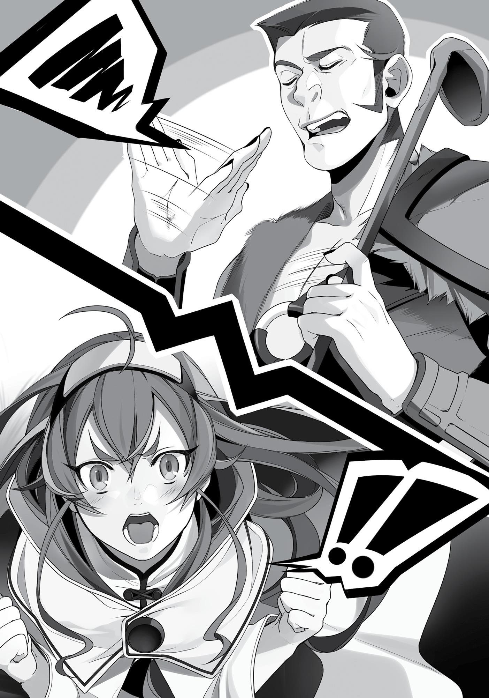
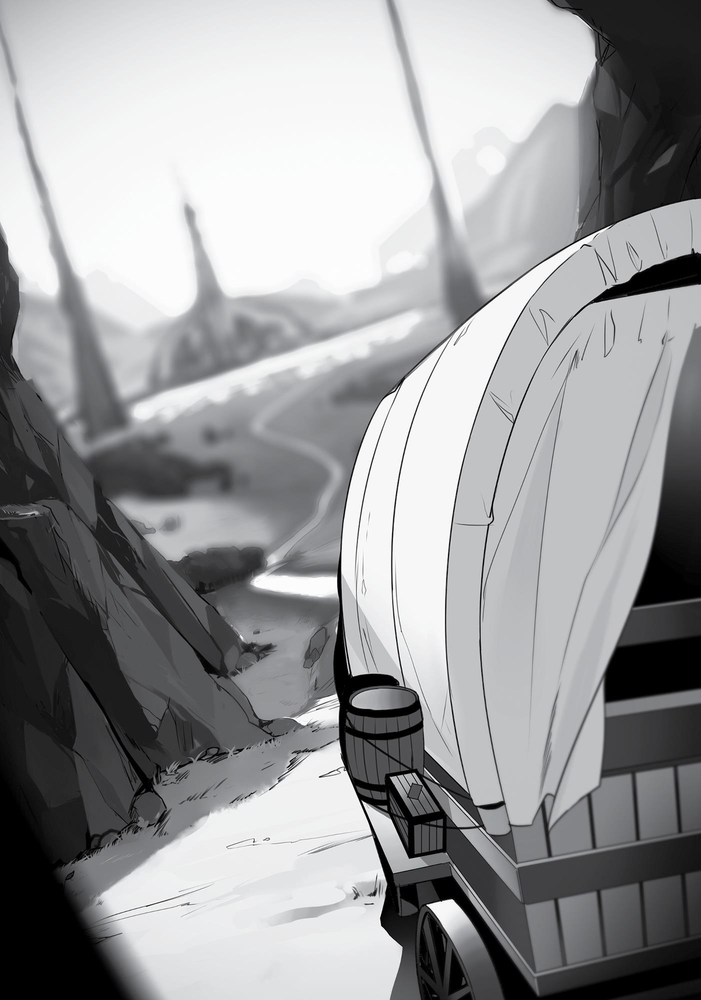

+++
title = "Chapter 10 The Holy Sword Highway"
date = 2026-07-20
weight = 9
[extra]
volume = 4
chapter = 10
+++
The eve before we left the Doldia Village, Eris and Minitona
had a fight. It went without saying, I’m sure, but Eris won easily. Of
course she did. She was able to keep up with Ruijerd’s training, after
all. When the other person was younger and had no training, they
were hardly even an opponent. It was more like the strong bullying
the weak.
I thought I should at least warn Eris about this. I knew she was
that type of person, but she would soon be fourteen. While
technically still a child, fourteen was old enough that she couldn’t
just indiscriminately punch another person. But just how was I going
to word it?
I had never stopped one of Eris’ fights before. Normally I left
Ruijerd to deal with her and her quarrels in the Adventurers’ Guild.
So what could I even say at this point? Should I tell her that
adventurers and village girls were different matters?
“N-no, it’s Tona’s fault,” Tersena said in protest.
According to her, now that the rainy season was over, Eris had
said she was going to leave the village and Minitona tried to stop her.
Eris was happy that Minitona wanted her to stay, but she explained
why she had to continue her journey, pointing out that Minitona’s
request was a selfish one. It was usually the other way around
with Eris.
They continued talking for a while after that. At first the two of
them were calm, but their dispute soon grew heated. Minitona
began hurling insults. Among them were things about Ghislaine and
myself. Eris looked annoyed, but endured it all and replied calmly.
In the end, Minitona threw the first punch. She was the one who
tried to pick a fight with Eris. That took a lot of courage. I gave her

props for that. It was definitely something I couldn’t do. Eris didn’t
back down. As expected, she mercilessly beat Minitona to a pulp.
“Eris.”
“What?!”
I stopped to reconsider the situation. Firstly, Minitona should
have known she would lose the fight, yet she still got heated and
started throwing insults. Even after she got pulverized by Eris, she
still wouldn’t back down. The best of adults broke easily when facing
Eris. Minitona had to be quite strong-willed.
“You did hold back, didn’t you?” I asked Eris.
“Of course I did,” she said, turning from me. In the past, Eris
would never have shown mercy to someone who bared their teeth at
her, not even if they were a child. I knew that especially well.
“Normally you’d be meaner about things, wouldn’t you?”
“Yeah, well, she’s my friend.”
When I looked at her, Eris looked ashamed, her lips pushed in a
pout.
Hm. It seemed she did regret punching Minitona at least a little.
That was something I’d never seen before. In three months, maybe
she’d become a little bit more of an adult. She was maturing without
me even noticing. In that case there was only one thing to say.
“You’d better make up with her before we leave tomorrow.”
“…Don’t want to.”
Still a child, huh?
***

We were busy preparing for our departure on the last day, so I
didn’t meet with the Sacred Beast. Instead I got two visitors in the
middle of the night.
“Ah!” came a small cry accompanied by a loud crash.
Those two sounds were enough to wake me. I got up, aware of
how much I’d lowered my guard lately, and reached for the staff at
my side. Our intruder’s aura was too pathetic to be a burglar. Ruijerd
would have noticed one long before they got this far, anyway. That
made the intruder’s silence all the more bizarre.
“Tersena, try to be a little more quiet, mew!”
I put down my staff. So that was why Ruijerd said nothing.
“Sorry, Tona, but it’s dark.”
“If you squint your eyes enough you can see, mew… Ah!”
Another sharp banging sound.
“Tona, are you okay?”
“Owie, mew…”
Perhaps the two of them were trying to whisper, but their
voices were loud enough I could hear them clearly. Just what was
their objective? Money? Fame? Or were they aiming for my body?
Kidding, of course. I knew it was Eris.
“Ah, here, mew?”
“Sniff, sniff… Nope, this doesn’t seem to be her.”
“Don’t worry about it, mew. They’re probably sleeping, mew.”
The girls stopped in front of my door and I heard a click as they
entered. Cautiously they peeked in and looked around, only to lock
eyes with me as I sat up in my bed.
“Mew…!”
“What’s wrong, Tona? Ah…!”

It was Minitona and Tersena. They were each wearing a thin
leather dress with a gap over the rear where their wiggling tails
peeked out. This sleepwear was peculiar to the beastfolk, and it was
truly adorable.
I spoke as quietly as I could. “What are you doing here so late at
night? Eris’ room is next door.”
“S-sorry, mew…” Tona apologized and started to shut the door
before pausing suddenly. “That’s right, I haven’t thanked you yet,
mew.”
Huh, T-Tona?
Minitona spoke as if she’d just remembered and slipped inside
the room. Tersena timidly followed her.
“Thank you for saving us, mew. I was told I might’ve died if you
hadn’t cast your healing on me, mew.”
That was probably true. Her wounds were quite serious. At least
severe enough that I would’ve been pretty traumatized in her place. I
thought her undaunted attitude was impressive.
“Not a problem,” I said.
“Thanks to you, I don’t have any scars either, mew.” She rolled
up the hem of her dress, revealing her bare, gorgeous legs. It was
just dark enough I couldn’t see what was between them. Lady
Kishirika, why didn’t you have any demon eyes that could see in the
dark?
“Tona, that’s improper…!”
“It’s not like he hasn’t seen it before, so it’s fine, mew.”
“But Uncle Gyes said that human men have a long mating
season, so if you don’t approach them with caution you might get
assaulted.”
A long mating season? That was a rude thing to say. Not that it
was wrong.

“Besides, if he gets that turned on from looking at my body,
then it’s a good way for me to say thanks… mew?! It’s cold!”
“That’s because you keep holding your dress up!”
At that point, I wasn’t even focused on Minitona’s legs. A cold
sweat ran down my back as I curled my fingers around the staff that
should have been lying at my side. A vicious, murderous intent oozed
from the neighboring room.
“A-ahem. I’ll accept your gratitude. Eris is in the room beside
mine, so go on.”
That’s right, it didn’t matter if she was a child. She shouldn’t
have been carelessly showing off her body like that. It would cause
real problems if she were assaulted by some sick old man trying to
play doctor, after all.
“Okay. But really, thank you, mew.”
“Thank you,” Tersena chimed. The two of them bowed and left
the room.
After a few moments I tiptoed across the room and put my ear
to the wall. I could hear Eris’ sullen voice in the neighboring room as
she said, “What do you want?”
I pictured her in her usual pose, arms folded over her chest.
Minitona’s and Tersena’s voices were a bit difficult to hear. Or
maybe Eris’ voice was just too loud. I listened anxiously, but Eris’
voice gradually grew calmer. It seemed like things would be okay.
Relieved, I returned to my bed.
The three girls spent the entire night talking. As for what they
talked about, I had no idea. Minitona and Tersena were far from
being masters of the human tongue. Eris had learned a little of the
Beast tongue, but not enough to hold a conversation. I worried
whether they’d really sorted things out or not, but when it was time
to part the next day, Eris held Minitona’s hand and had tears in their

eyes when they hugged. It seemed they were able to make up after
all. I was glad.
***
The Holy Sword Highway was a road that went straight through
the Great Forest. Built long ago by the Holy Country of Millis, it was
bursting with mana. Even as the area around it flooded, the highway
remained dry and untouched. Apparently no monster would set foot
on it. The three of us would be using the horse-drawn carriage we’d
gotten from the Doldia tribe to travel down that road, heading south.
The beastfolk prepared everything we could possibly need for
our trip. The carriage, the horse, travel money, and supplies. We
could head straight to the capital of Millis without once returning to
Zant Port.
It was time to head out! Or at least it was supposed to be, when
for some reason a monkey-faced man approached us.
“Oh man, this is perfect timing. I was just thinking about going
back to Millis. Let me ride with you guys,” Geese said, shamelessly
hauling himself inside.
“Oh, it’s you, Geese.”
“You’re coming along, too?”
The other two didn’t sound as annoyed by his appearance as I
did. When I asked if they knew him, their answer showed he’d been
gradually warming up to them without me noticing. This included
cozying up to Eris, Minitona, and Tersena, and sharing amusing
anecdotes. He’d also joined Gustav and Ruijerd during their chats,
where Geese adjusted his manner to fit the tone of the conversation.
He truly was a smooth talker and skilled at manipulation. He
managed to successfully ingratiate himself with both of them

without me noticing a thing. And the two of them had just welcomed
him so easily. What, were they cheating on me with Geese?!
“All right then, let’s get going!” Ruijerd declared as the carriage
lurched into motion.
We waved farewell to the beastfolk who gathered to see us off.
It was a bit moving to see Eris with tears in her eyes as she watched
Minitona and the others.
Still, something heavy weighed on my heart, and it was entirely
Geese’s fault. If he wanted to tag along, he should have said so in the
first place. There was no need for him to act so shady and sneak
around behind my back. I wouldn’t have refused him if he’d flat-out
asked me. After we’d eaten the same food and picked off each
other’s fleas, it felt distancing.
“Hey, hey, boss. Don’t glare at me like that. We’re friends,
right?”
Geese must have noticed the disgruntled look I no doubt had as
we sat in the coach, blazing down the road at an impressive speed.
He grinned at me and leaned close to my ear.
“Might not look it, but I have confidence in my skills as a cook,
just you watch!”
He had a charming face, and he wasn’t a bad guy, either. Still,
ever since the incident with Gallus, I had a lingering sense that there
was something darker behind all of that.
“Rudeus.”
“Yes, Mister Ruijerd?”
“Who cares if he tags along?” he said.
“Master Ruijerd!” Geese exclaimed. “I knew you would
understand! Ahh, it just confirms what I already thought about you.
You truly are a man among men!”

“Are you sure about this, Mister Ruijerd?” I asked. “This man is
one of those criminals that you loathe so much.”
“He doesn’t look that bad to me.”
I had no idea what Ruijerd’s metric for measuring that was.
Geese coming along was fine, but Ruijerd’s double standards were
bad. No, perhaps this was all a result of Geese’s smooth talk with
him. The monkey bastard sure had done a good job.
“Heh heh. I do gamble, but I don’t think I’ve ever done anything
truly contemptible to another person. Master Ruijerd, you have a
good eye for people.”
Frankly, I did owe this man a debt. He gave me his vest when I
was cold, and he helped me out during the fight with Gallus, too. I
wasn’t sure what he was planning, but I had no reason to turn him
away. I was just a bit irritated at his roundabout methods, that was
all.
“I don’t mind if you come with us, newbie. But are you sure
you’re not scared of a Superd?” I spoke loud enough that Ruijerd
could hear. I wasn’t sure yet if he knew the fact that Ruijerd was a
Superd, but if he partook in their drinking festivities, he may very
well have heard. I just didn’t want him to find out later and complain
about how terrifying it was being with a Superd.
“Of course. Did you think I wouldn’t be? I am a demon, after all.
I’ve been hearing about how scary the Superd are ever since I was a
kid.”
“Oh really? You know, Ruijerd may not look it right now, but
he’s a Superd.”
When Geese heard that, he narrowed his eyes. “That’s different.
He saved my life.”
Curious as to what that meant, I turned my gaze to Ruijerd, but
he only shook his head as if he had no idea what Geese was talking

about. At the very least, it wasn’t something that had occurred
within these last three months.
“Guess you don’t remember, huh? Well, it was thirty years ago,
after all.”
Geese then launched into an explanation. It was an epic story
that included an initial meeting, a parting, a climax, and a love scene.
When an incredibly handsome hard-boiled hero said he was going to
set out on a journey, hundreds of women pleaded with him to not
go. He set out from his hometown despite his lingering attachments
to it and encountered a mysterious beauty when he arrived at his
destination.
To summarize what would otherwise be a long tale, when Geese
was still a novice adventurer, Ruijerd stepped in to save him when he
was attacked and nearly killed by a monster.
“Well, it was thirty years ago. I don’t particularly feel like I owe
him for it or anything,” Geese said. The Superd tribe was scary, but
Ruijerd was different, the monkey-faced newbie said with a laugh.
Ruijerd relaxed when he heard that. I felt like I understood the
meaning of the word karma after hearing that story. Good for you,
Ruijerd, I thought.
“Well, I hope you’ll let me stay with you for a while, Senpai~☆”
And that was how Dead End gained a new member in the form
of a monkey-faced— Hang on now, he wasn’t a new member. He
was only staying with us until we reached the next city, I reminded
myself. Geese claimed that he was jinxed—whenever he was in a
party of four, something terrible happened. I had no words for how
he managed to get thrown into a cell with me despite purposefully
avoiding that jinx. In any case, it was fine if he wasn’t going to join
our party.
That was how we set off on our journey with an extra traveler
accompanying us.

***
The carriage carried us along on a nonstop path that cut through
the Great Forest. It really was a straight road, one that stretched
unbroken into the horizon, continuing all the way to the Holy
Country’s capital. There wasn’t a single monster, and water drained
right off the road.
I was suspicious about how such a path came to be, but Geese
explained for me. This highway was created by Saint Millis, the
founder of the Millis faith, the biggest religious denomination in the
world. With a single swipe of their sword, Saint Millis cut the
mountains and the forests in half, splitting a demon king on the
Demon Continent into two. The road was named the Holy Sword
Highway with that story in mind.
As much as I wanted to skeptically dismiss the story, Saint Millis’
mana still remained. The fact that we had encountered no monsters
thus far was proof of that. The carriage hadn’t gotten stuck in any
mud, either. We were sailing along smoothly. It was nothing short of
a miracle.
I could understand now why their religion held so much power.
At the same time, I feared the possible negative impact that much
mana could have on the body. Mana was a useful thing, but an
abundance of it could be terrifying. It could also do terrible things,
like twist animals into monsters and transport children from the
Central Continent to the Demon Continent. Although in this case, not
being attacked by monsters did make our journey easier.
There were fixed intervals along the highway where you could
make camp. It was there that we spent our nights. Ruijerd would
hunt down something in the forest for dinner, so we had no shortage
of food. Occasionally beastfolk from a nearby settlement would

come to sell their goods, but we had no need for additional food
supplies.
There was also a great abundance of plants, as expected of a
forest. Flowers that could be used as spices grew aplenty on the
roadside. I used what I learned from the Plant Encyclopedia I read
when I was a kid, and gathered some ingredients to season our food.
I wasn’t a very skilled cook, but I’d improved somewhat in the past
year, albeit only going as far from terrible to less awful.
The Great Forest provided much higher quality ingredients than
the Demon Continent did. Not just in terms of beasts, but normal
animals as well. The rabbits and boars tasted delicious enough
roasted without seasonings, but that wasn’t good enough for me.
Since we had the ingredients readily available, I wanted to eat more
scrumptious dishes. I was greedy as ever in my quest for good food.
That was where Geese came in. Just as he’d professed, he was a
master at cooking outdoors. It was like sorcery the way he took the
nuts and wild grass I collected and turned them into seasoning,
injecting the most delectable flavors into our food.
“I told ya. I can do anything!”
It wasn’t empty boasting, either. The meat really was delicious.
“Amazing; hold me!” I threw my arms around him without
thinking it through. Geese was disgusted by it. I was disgusted by it.
Our feelings were mutual.
***
“I’m bored,” Eris muttered as we were preparing our daily meal
as usual.
Ingredient Collector: Ruijerd
Fire and Water Producer: Me

Cook: Geese
Our job assignment was so on point that there was nothing for
Eris to do except collect firewood, but she finished that quickly
enough. As such, she was bored.
At first Eris would just silently train with her sword. After being
forced into repetitive drills by Ghislaine and myself, she could go on
swinging her sword for hours. That didn’t mean she found it fun,
though.
Currently Ruijerd was out hunting, Geese was boiling soup, and
I’d settled down to continue working on my figurine. This 1/10thsized Ruijerd figure was taking quite a bit of time to complete, but I
was sure I could sell it. I’d add options to it to increase its value as
well. Using this figure, I would show people that the Superd were not
to be attacked and instead could be befriended.
That aside, Eris was finding her boredom unmanageable.
“Hey, Geese!”
“What’s wrong, Miss? Food’s not ready yet.” He took a test sip
of the soup before glancing back at her.
Eris was standing in her usual pose, arms crossed and legs
spread apart. “Teach me how to cook!”
“I’ll pass.” His reply was instant. Geese returned to cooking as if
their conversation had never happened.
Eris looked dumbfounded for a moment, but she recovered
quickly and yelled, “Why not?!”

“’Cause I don’t want to.”
“So, why not?!”
Geese let out a big sigh. “Okay, Miss. All a swordsperson needs
to think about is fighting. Cooking is a waste of time. All you gotta do
is eat.”
This was a man whose culinary skills went beyond his “just eat”
mentality. He could open his own restaurant. He wasn’t so good that
it would make a certain gourmet king’s jaw drop and have a beam of
light shooting out of his mouth, but he was at least good enough that
his restaurant would be moderately popular in its neighborhood.
“But, if I could cook…um…well, you know, right?” She hesitated
to explain, stealing glances in my direction.
What is it, Eris? What do you want to say? Heh heh, go ahead
and say it, I inwardly goaded her.
“Nope, no clue.” Geese was being cold to her. I wasn’t sure why,
but he was being unusually harsh. He wasn’t that way toward Ruijerd
or myself, but he always sounded detached when he interacted with
Eris. “You’re skilled at the sword, aren’t you? You don’t need to know
how to cook.”
“But—”
“Being able to fight is a wonderful thing, you know? If you want
to live in this world, there’s nothing more essential than that. Don’t
waste your talent.”
Eris’ face turned sullen, but she didn’t try to punch Geese. There
was something strangely persuasive about what he said.
“That’s my official reason.” Geese nodded to himself and
stopped stirring the pot. He then began filling the stone bowls I’d
made. “See, I decided I’d never teach someone to cook ever again.”
Geese had been in a dungeon diving party before. It was a party
of six, an unskilled bunch who, unlike Geese, had only one role they

could fulfill. At the time Geese had a habit of complaining, “You guys
seriously can’t do anything else?” Their party was unconventional,
but effective at getting things done.
However, one day, a woman in the party approached Geese and
said she wanted to learn how to cook. She wanted to go after one of
the men in the party. Clearly the saying “the way to a man’s heart is
through his stomach” existed in this world, too. Geese responded
with “Sure, I guess, why not?” and began teaching her.
It was unclear if the cooking had anything to do with what
happened after, but the woman did get with the man and the two
later married. Then they left the party and went off somewhere. That
was fine, said Geese. There was a quarrel when the two left, but
them leaving wasn’t a problem.
It was what happened afterward that was horrible. When the
two most important people left, the party fell to pieces. It became a
maelstrom of squabbles and apathy, so much so that they couldn’t
undertake missions anymore and soon disbanded entirely.
Geese, however, was a man who could do anything. He had no
talent for the sword or magic, but he could do everything else. That’s
why he thought he’d find a new party immediately. But that
endeavor turned out to be an overwhelming failure. At the time, he
was a somewhat well-known adventurer, yet no party would pick
him up.
Geese could do anything. Anything any other adventurer could
do. That was the problem, in other words. Other people could also
do the things he could. If a party was highly ranked, they would split
those menial tasks among their own members.
That’s when Geese realized that the party he was in before was
the only place he belonged. He was only who he was because they
were all so unskilled. After that, Geese prematurely ended his career
as an adventurer. Now he lived by gambling.

“And that’s why I refuse to teach women how to cook.”
Yet another jinx to add to his name. Although if you asked me,
Geese’s “jinxes” were a load of garbage. I saw no problem with him
teaching her how to cook. This soup was delicious. One sip and jazz
music started playing in your mouth. It was good enough that I
wanted him to teach me too, so I jumped in to help.
“I understand you had something terrible happen to you,
newbie, but that woman you helped found her happiness, didn’t
she?” I asked, with the added nuance of So why don’t you go ahead
and teach Eris?
Geese shook his head. “I don’t know if she did or not. Never saw
her after that.” Then he let out a self-deprecating laugh. “But the
man did not turn out happy.”
Perhaps that was the reason for the jinx, then. I couldn’t say
anything after that, not after seeing the depressed look on Geese’s
face. The soup, which should have been delicious, suddenly didn’t
taste so great anymore.
I wondered just how much longer it would be before Ruijerd got
back.
***
One day I found a curious stone monument on the roadside
where we stopped to rest. It came up to my knees and had a strange
pattern on its face. A single character was inscribed there, with seven
motifs surrounding it. I was pretty sure the character was the word
“seven” in Fighting God tongue. As for the other patterns, I felt like I
might have seen them before.
I decided to ask Geese. “Hey, newbie, what’s this monument
here?”

He looked and nodded in recognition. “That’s the Seven Great
Powers.”
“The Seven Great Powers?” I echoed.
“It refers to the strongest people in this world—seven warriors.”
The story went that when the second Great Human-Demon War
ended, a person known as the Technique God came up with that
name. At the time, the Technique God was considered to be one of
the strongest people in the world. They selected seven people
(themself included) and declared those people to be the strongest in
the world. This monument was a way to immortalize who those
people were.
“I believe Master Ruijerd knows more about it. Master Ruijerd!”
Geese called out and Ruijerd, who had been training nearby
with Eris, came over. Eris fell back onto the ground with her legs and
arms spread wide, trying to steady her breathing.
“‘The Seven Great Powers’, huh? Brings back memories.” His
eyes narrowed as he examined the monument.
“So you know about this?” I asked.
“I trained hard when I was young so one day one of the ‘Seven
Great Powers’ would take me as a student.” Ruijerd looked off into
the distance as he spoke. Very, very far off… Wait, just how far back
into the past was he looking, anyway?
“What’s that pattern?”
“These are the motifs for each individual. They’re pointing out
the current seven names.” Ruijerd motioned to each one and told
me their names.
The current seven were (in order of hierarchy):
Number One - Technique God
Number Two - Dragon God

Number Three - Fighting God
Number Four - Demon God
Number Five - Death God
Number Six - Sword God
Number Seven - North God
“Hmm. But I’ve never even heard of the Seven Great Powers
before.” I said.
“The title was well known until Laplace’s War.”
“Why has it fallen out of use?”
Ruijerd explained. “Laplace’s War brought about great change.
Half of those listed went missing.”
Apparently, with the exception of the Technique God, the Seven
Great Powers had all participated in Laplace’s War. Among them,
three were killed, one went missing, and another was sealed away.
The only one who made it out in one piece at that time was the
Dragon God. After several hundred years, with those at the bottom
swapping spots for the strongest, the phrase fell out of use.
Currently, the whereabouts of the four at the top were unknown.
TECHNIQUE GOD: Missing
DRAGON GOD: Missing
FIGHTING GOD: Missing
DEMON GOD: Sealed Away
It wasn’t much of a ranking system when those confirmed to be
the strongest were absent. That was why the title ‘Seven Great
Powers’ fell out of use and faded from people’s memories…or so it
seemed. Incidentally, the reason the Demon God hadn’t been

removed from this ranking because he wasn’t dead; he’d merely
been sealed away.
“I wonder how many people from that time period are still
alive?”
“Who knows,” Ruijerd said. “Even four hundred years ago,
people doubted whether the Technique God even really existed at
all.”
“Why did the Technique God create this list in the first place?” I
asked.
“Hard to say. It was said they created it so they could find
people capable of defeating them, but I don’t know.”
Almost like the Fukamichi Rankings.
“Well, this monument is pretty old, so maybe the actual
rankings have changed anyway,” I muttered.
Geese shook his head. “I heard that monument changes by itself
through magic.”
“Huh? Really, it does? What kind of magic?”
“As if I’d know.”
So apparently the monument updated the ranking display on its
own. I wondered how it did it. There was still so much magic in this
world that I was unfamiliar with. I wondered if I would learn more
about those types of magic by going to the University.
That aside, the Seven Great Powers, huh? Here I thought the
world already had enough ridiculously strong people. It looked like I
really couldn’t keep up with the best of them. Not that I was aiming
to be one of the strongest in the world, in particular. In fact, I
decided it was best I didn’t preoccupy myself with thoughts of that.
It took us a month to make our way out of the Great Forest. But
that was it—just one month and we were out. It was a completely

straight road without a single monster. That’s why we were able to
devote our time entirely to travel.
That was one reason, at least. The other was because our horses
were highly efficient. The horses of this world had an insane amount
of stamina. They could run for ten hours in one day without rest,
then nonchalantly do it again the next day. Perhaps they were using
some kind of magic, but either way we made it smoothly out of the
forest.
As for accidents, the only one we had during our journey was
me getting hemorrhoids. Of course I didn’t tell anyone, and secretly
cured them with healing magic.
Eris spent her time standing on top of the carriage, claiming that
it was part of her training. I told her to stop because it was
dangerous, but she only huffed back that it wasn’t, it was for balance
training. I tried to do the same, but my legs and hips were trembling
in agony the next day. It gave me a new respect for Eris.
Just past the Blue Wyrm Mountains, there was a rest station
nestled in a small city at the entrance to a valley. It was run by
dwarves. There was no Adventurers’ Guild. It was famously known as
a smithing city with weaponsmiths and armorers lined up side-byside.
Geese told me the swords sold here were cheap and of good
quality. Eris looked wistful, but we didn’t have the extra money to
spend on anything. Besides, it would no doubt cost a pretty penny to
take a Superd with us from Millis to the Central Continent. I
persuaded Eris against buying something on the grounds that we
couldn’t afford unnecessary spending. The sword she was using right
now wasn’t bad, anyway.
Still, I was a man. It didn’t matter how old I was internally,
seeing sturdy swords and armor lined up like that still made my heart

race, though my age (and appearance) did seem to matter to a
salesclerk who laughed me off, saying, “I don’t think these would suit
you, kid.” He was surprised to learn afterward that I was actually
intermediate rank in the Sword God Style. Well, we didn’t have the
money anyway, so I was really just browsing.
According to Geese, this was where the road diverged. If you
took the mountain path to the east, you would find a large dwarf
town. To the northeast were the elves, and to the northwest was the
vast land the halflings inhabited. Perhaps the lack of an Adventurers’
Guild in this town was an issue of location.
Also, apparently if you entered the mountains there was a hot
spring. A hot spring! Now that was something that caught my
interest.
“What the heck is a ‘hot spring’?” Eris demanded.
“Hot water comes rising out of the mountain,” I explained. “It
feels really good to bathe in.”
“Yeah? That sounds interesting. But Rudeus, isn’t it your first
time coming here? Why do you know that?”
“I-I read it in a book.”
Was that written in the Wandering the World guidebook? I
somehow felt like it wasn’t. Still, a hot spring. That sounded nice.
Though surely this world didn’t have yukata. Still, imagining Eris with
her wet hair and her peachy skin, spacing out as she submerged
herself in the warm water…
No, it probably wasn’t a mixed facility anyway. I mean, right?
But on the off chance it was a mixed facility, then how amazing
would that be? Now I really did want to check it out.
As I was busy debating the issue in my head, Geese made his
opposition known. “The rainy season just ended, so it’s a mess right
now in the mountains.” It would take too much time for us to make
our way up there since we were unused to traversing the mountains.

And so, I gave up going to the hot spring. What a bummer.
***
The Holy Sword Highway was stretched across the Blue Wyrm
mountains. Its path cleaved the mountain range in two, creating a
space just wide enough for two horse-pulled carriages to make their
way past one another. It was a ravine, but thanks to the divine
protection of Saint Millis, rocks rarely came falling from above. If this
path didn’t exist, we would’ve had to take a more indirect path by
traveling north.
Although blue dragons were a rare encounter in the mountains,
there were still many monsters. Trying to pass through the range
presented a considerable danger. Instead, Millis had created a
shortcut straight through where monsters wouldn’t appear. I could
see why this saint had been so highly praised.
We made it through the valley in three days, completing our
long, arduous journey out of the Great Forest. Straight from there
was the Holy Country of Millis. We had finally returned to the
domain of men, a fact which made my heart leap as I continued my
journey.

