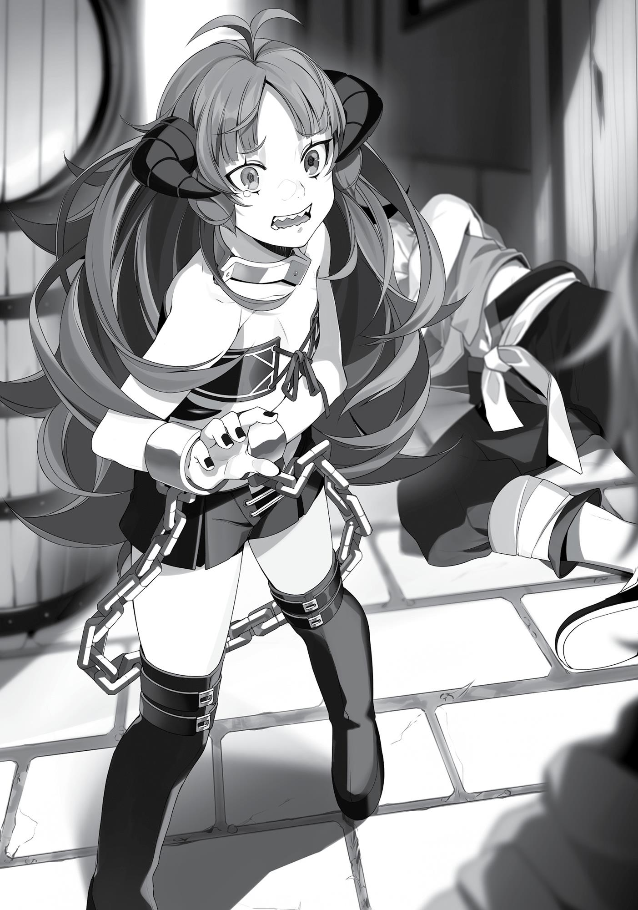
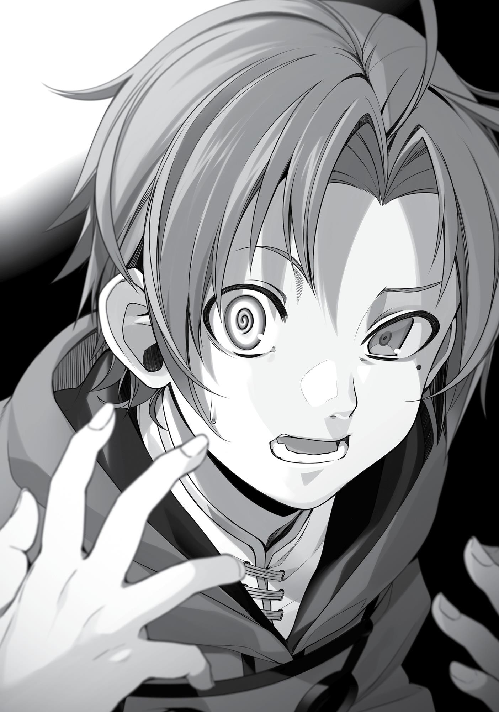

+++
title = "Chapter 2 Missed Connections The Prequel"
date = 2026-07-20
weight = 1
[extra]
volume = 4
chapter = 2
+++
The next day, I went out and loaded my arms with food
from one of the stalls before wandering the back alleys for a bit. The
food was all roasted and skewered. There were some scallops similar
to the ones we had in Japan, a fish similar to horse mackerel, and a
few other sea creatures I couldn’t identify. The stall owner didn’t
clarify what his wares were, and the street stalls had a variety of
them. So I decided to buy whatever was easiest to carry.
I overthought things the last time the Man-God gave me advice.
Just as an amateur cook adds too many ingredients to a dish,
overthinking had landed me in a figurative shit pile. This time I was
going to follow his advice exactly. I would brainlessly heed his
instructions, buy the food he told me to, then just as brainlessly
navigate my way through whatever event was going to happen in the
back alley. This was roleplaying. Whatever occurred from here on
would be completely unplanned. I wouldn’t overthink anything; I
would act as simple-mindedly as possible. That jerk liked
entertainment. He was counting on me to overthink things again. As
long as I didn’t do that, he wouldn’t be entertained.
Those thoughts preoccupied me as I wandered aimlessly for
several minutes before suddenly realizing something. “Wait, this is
exactly what he’s expecting, isn’t it?”
I’d been deceived! He led me on with his impressive smooth talk
and now I was about to do exactly what he wanted me to do. When I
realized that, it pissed me off. I was dancing right in the palm of his
hand.
Remember his original intention, I told myself. Remember how
you felt the first time you met. The Man-God wasn’t someone I could
trust.

All right then, this would be the last time I did as he told me. I
would follow his advice and see how things turned out this time, but
there was no way I would obey him next time. There was no way I
was going to become his puppet and let him string me along! Period!
***
I marched down the alleyway. By myself, of course.
Why did I have to be alone, anyway? That was the key part of
his advice this time. It must be something that Ruijerd and Eris
wouldn’t approve of. No, don’t overthink it, I told myself. If you want
to think about something, then just think about how happy you’ll be
if it turns out to be something sexy.
I had told Ruijerd and Eris that I would be off on my own for the
day. It was dangerous to leave Eris to her own devices, so I entrusted
Ruijerd with her protection. Maybe the two of them were off to see
the beach right now.
“Wait…isn’t that a date?” In my mind I saw the two of them
together on the beach just before their silhouettes disappeared
behind the shade of a large rock.
No, no, no! There’s no freakin’ way! J-just, just calm down,
okay? This is Eris and Ruijerd we’re talking about, right? This isn’t
some kind of sexual fantasy. It’s nothing more than babysitting.
Baby. Sitting!
Ah! But Ruijerd was really strong after all, and Eris seemed to
respect him a lot! Lately she had been treating me like nothing more
than a Kennel Master.
No, no, what the hell are you panicking over? I berated myself.
Deep breaths, everything is okay. Mister Ruijerd, you wouldn’t steal
her away from me, right? I have nothing to worry about, right? When

I go back the two of you won’t have mysteriously gotten closer to one
another right? I-I trust you guys, okay?!
In my head I simulated a fight between Ruijerd and myself.
There was no way I could win in close-range combat. If I wanted to
deal with him, I needed to start somewhere outside of his range of
detection. Then I would have to use water to finish him off. He got in
the way of our seaside fun, after all. I would attack him with water as
retribution for that. If I produced a massive amount of water, I could
sweep him all the way into the ocean. The end! He could drift at sea
until he drowned. Mwahaha!
Wait, don’t misunderstand me. I did trust Ruijerd. It was just
that, well, you know that saying. Love is a battlefield, right?
***
It was quiet in the back alleys. Even the words “back alley”
conjured the negative image of a bunch of unscrupulous characters
gathering in one place. In reality, tender and innocent boys like me
were liable to get kidnapped for walking around a place like this. In
this world, kidnapping was one of the most common forms of crime
for earning money. Of course, if anyone was stupid enough to kidnap
me, I would crush their arms and legs to torture their address out of
them, then I would take everything of value in their homes before
finally turning them in to the authorities.
“Heh heh heh. Little girl, if you come with me I’ll give you
enough food to fill you up.”
As in on cue, a voice came filtering through one of the
alleyways. I quickly peeked in its direction and spotted a shadylooking man pulling at the hand of a girl who was slumped against
the side of a building.

It was easy to deduce what was going on. The one who moves
first wins, however, so I readied my staff. Then I created a modified
stone cannon with the speed and power of a boxer’s jab and aimed it
at the man’s back. I had gotten good at limiting the power of my
spells this past year.
“Yowch!!”
When he looked over his shoulder, I fired off another round.
This time I strengthened it a bit.
“Gah!”
The spell rammed into his face with a violent thud, where it
fragmented and crumbled to the ground. The man staggered and
stumbled before collapsing. I was sure he wasn’t dead. I had done a
good job of restricting my power.
“Are you okay, young lady?” I tried to look as cool and collected
as possible as I reached out to the girl who had almost been
kidnapped.
“Y-yeah…” She was young and clad in a revealing black leather
outfit: knee-high boots, hot pants, and a tube top. The pale skin of
her clavicle, slender waist, belly button and thighs were all exposed.
On top of all that, she had horns like a goat and voluminous, wavy
purple hair.
With just one look I knew: She was a succubus. A young one at
that. There was no question that she was younger than me. Perhaps
this was the Man-God’s way of rewarding me for my hard work.
Maybe he had some sense in him after all.
No, wait, this wasn’t a succubus. As far as I knew, there were no
succubi among the demon races. If I remembered correctly, succubi
inhabited the Begaritt Continent. Paul had had an unusually tense
look on his face when he told me, “Our race has no chance against
them.” Even I would surely be powerless in the face of a succubus if I

actually met one. Succubi were the natural enemy of the
Greyrat family.
That aside, there were no monsters within the city. In other
words, she was no succubus. She was just some demon kid in skimpy
clothing.

“Y-you…you there, what have you…?” She was trembling like a
fawn. “Th-this man is… He’s…!” She had a look of utter disbelief on
her face. A look of oh gosh golly mister, what have you done?!
“Ah, sorry. Did you know him?” I asked, tilting my head. The
look on that middle-aged man’s face didn’t give me the impression
that he was acquainted with this kid. If I were to describe it, it was
more like the look of a man past his prime getting aroused by a little
girl. Look at him, ruddy face contorted into a smile even though he
was unconscious. I had no doubt he’d take her home and provide a
lavish meal and put her in bed, but in return he’d expect a long, hot
night.
“My belly aches from the hunger…and this man was going to
provide me with a meal.” A noisy, gurgling rumble punctuated her
sentence, loud enough that it could have been the foreshadowing of
an earthquake. When the noise stopped, the girl’s knees gave out
from beneath her and she crumpled.
“A-are you okay?” I knelt down and lifted her into my arms. I
wasn’t about to overlook a perfect opportunity to touch her. She
wasn’t getting away. Don’t get me wrong, though, the only reason I
was there was to follow the Man-God’s advice and save her. I wasn’t
of the same ilk as that pervert from a moment ago.
“Guh…urgh…it’s been three hundred years since I revived.
Passing out in a place like this is inconceivable. Laplace can never
know about this.”
It felt like I’d stumbled onto the set of some mini-drama. Was
this getup actually a cosplay or something?
“A-anyway, eat this and get some of your strength back.” I
crammed three of the fried skewers I’d bought into her mouth.
Munch, munch. The moment they entered her mouth, her eyes
snapped open and stayed that way as she devoured the meat in
seconds. Then she snatched the other skewers from me. I had a total

of twelve, but in a snap of the fingers she had already eaten ten of
them.
“Wh-whoa! Delicious! The first thing I’ve had in a year and it’s so
tasty!” The girl seemed to have recovered. She leaped into the air
from her prone position, making a single rotation before landing on
her feet. She was unexpectedly fit.
“A year? I don’t know what your circumstances are, but that’s a
bit extreme.” It wasn’t as if she were a giant isopod that could live
years without eating and not starve to death.
“Hm? Well, it’s not like I counted the rise and fall of the sun, but
with how empty my stomach was, it should be a close estimate.”
Uh-huh. So she probably hadn’t eaten in two days, then.
“Regardless, you saved me! You! I can surely last another year
on this!” The young girl finally met my gaze. She had mismatched
eyes, one purple and one green. This had to be another aspect of her
cosplay. No, colored contacts didn’t exist in this world, so maybe that
was her natural eye color.
“Oh?” Her right eye spun around and turned blue. G-gross!
“Whoa! Whoa! What’s wrong with you, you’re horrifically disgusting!
What is this, what is it?! Ahahaha! I’ve never seen this before!” she
shouted with far too much excitement as she looked at my face.
Uh yeah, needless to say that was a shock. It had been a long
time since I last had someone look me in the face and call me
disgusting. Then again, I’d just thought the same thing when I looked
at her. So at least we were even.
“Could that be it? Were you a twin in the womb, but the other
one died when you were born, is that it?”
…Huh? What the heck was she talking about? “No, I don’t think
anything like that happened.”
“You’re sure?”

“Yeah.”
“But your mana pool… It’s larger than Laplace’s.”
My what was bigger than who? I had no idea what she was
talking about. From her weird way of speaking, to her freaky eyes,
this kid was quite the disappointment.
“That aside, state your name!”
“Rudeus Greyrat.”
“Very good! I am Kishirika Kishirisu! People call me the Great
Emperor of the Demon World!” She proudly thrust her hips forward
with her hands perched on her waist.
Her thighs appeared in front of me so suddenly that I stuck my
tongue out without thinking.
“Aaaaah! What are you doing?! That’s filthy!” She turned her
toes inward and vigorously scrubbed her thighs together where I’d
licked her, before glaring at me.
Still, now I understood. The Demon World’s Great Emperor
Kishirika Kishirisu was a name I’d heard before: the immortal Demon
Emperor who led the demons in the Great Human-Demon War, only
to meet a crushing defeat.
Was she the real thing? I had come here on the Man-God’s
advice, after all. There was a possibility that she really was who she
claimed. Still, how could the real thing be here in a back alley of a city
on the edge of the Demon Continent, on the brink of death from
starvation? It just didn’t seem likely, no matter how you spun it.
Ah, that’s probably it, I realized. Children on this continent loved
to pretend they were one of the great heroes of the past. The most
popular of these figures was the Demon God Laplace. That was
nauseating for me since I knew the truth about him, but he was
popular. Even though he lost the war, he successfully subjugated all
the tribes on the continent and gave the people a fixed place to call

home, thereby bringing them peace. He was regarded as one of the
greatest demons in history. Children often played out his stories,
particularly the episode where he fought with an immortal Demon
King. That was the one I had seen numerous times on the way to
Wind Port.
I supposed that the Great Emperor of the Demon World,
Kishirika, was another one of the great people in history, but I’d
never seen any children pretending to be her before. This girl had to
be one passionate fan of the Great Emperor. And she had no friends
to play with, which was why she was here by herself in a back
alleyway like this. That was the most logical way to interpret the
situation.
Hm. It was lonely, being all by yourself. I had no other choice,
then. I had to play along. “A-ah, yes! How rude of me, Your Majesty!”
I responded to her introduction with great exaggeration and took a
knee as if I were one of her retainers.
“Oh? Ooh, yes! Very good, very good! This is the reaction I have
been waiting for! Young people these days don’t have any manners
anymore, you see!” She nodded her head in satisfaction.
Yeah, knew it. She really wanted someone to play this out with.
“What a fool I was for not realizing you had revived. Please
forgive me for my poor manners!”
“Very well. You saved my life. I will grant whatever wish you
have, just one.”
Her life? All I did was give her some food because she was
hungry. “Um…how about an abundance of wealth!”
“Fool! You can see I’m penniless!”
But she said I could ask for anything! No, wait, maybe that was
part of the act. Maybe there was some episode where someone
asked the Great Emperor for money only for her to respond that she
had none. “All right then, please give me half of the world.”

“What?! Half of the world, you say?! That’s enormous! Still,
that’s half-hearted. Why only half?”
“Oh, that’s because I don’t need the men.” Oh crap, accidentally
let my real feelings slip there. That wasn’t something she was
supposed to hear.
“I see, so that’s it. You may be young, but you’re a lecherous
one. Still, my apologies. Even I haven’t managed to take the world for
myself.”
True enough, Kishirika had lost every battle for the demons that
she led. “All right, then I’m fine with your body. Please pay me with
your body.”
“Ohh? My body? For you to be that full of lust at your age gives
me concern for your future.”
“Ha ha, of course I’m just jok—”
As I tried to tell her that I was joking, she reached for her hot
pants. “Oh well, I guess there’s no help for it. This is my first time
since I revived, so be gentle with me, all right?” Kishirika’s cheeks
burned bright as she slowly started to pull her pants down.
Huh? Seriously? I was just saying that as a joke. No, wait! Now it
was too late to tell her that I’d only been joking. I would have to just
observe as she revealed herself, and then afterward refuse by
claiming that I was unworthy of Her Majesty.
“Ah, no, I mustn’t do this.” Before I could do that, Kishirika
stopped herself. “I already have a fiancé. So sorry, but I can’t do
this.” The skin she had exposed vanished as she pulled her pants up.
It felt like she’d been toying with my poor, pure heart.
Anyway, so it was a no to money, no to the world, and no to her
body.
“All right, then what can you do?” I asked.

“Fool! I am Kishirika, Great Emperor of the Demon World! It’s
obvious what I can bestow upon you! Demon eyes!”
So that was it. Well, I wasn’t well-versed in the heroic mythology
of this world. Come to think of it though, didn’t Ghislaine also have a
demon eye?
“By ‘demon eyes,’ do you mean eyes that can see a person’s
lifeline? A line that, if cut, will kill the person with absolute
certainty?”
“How horrific! What in the world is that power?! I don’t have
anything as terrifying as that!”
So that wasn’t it. The only other sort of demon eye I knew of
was the kind that turned the person you looked at to stone. I figured
eyes which shot beams or lasers couldn’t be considered demon eyes.
“For you to covet such a dangerous power… Tell me, do you
hold that deep a grudge against someone?” she asked.
“No, not really.”
“Nothing good comes of revenge. I’ve been killed twice, but I
don’t begrudge those who killed me now. A grudge is a chain that
weighs you down. That’s what started the Great Human-Demon
War.”
I was getting lectured by a little girl! Oh well, it’s not like I had
plans to target some vampire somewhere and slice them up. “To be
honest, I don’t really know much about demon eyes,” I said. “What
types are there?”
“Hm, as I’ve only recently revived myself, I don’t possess any
that significant, but there are Eyes of Magical Power, Eyes of
Identification, Eyes of X-ray Vision, Eyes of Distant Sight, Eyes of
Foresight and Eyes of Absorption… Things like that.”
Those were just names. “Can you explain to me what each of
them do?”

“Hm? You mean you don’t know? Honestly, young people these
days don’t spend enough time on their studies…” Despite these
complaints, she proceeded to explain. “First, you have Eyes of
Magical Power. With these you can see mana directly. These are the
most common. One in ten thousand people possess one of these.”
“Ah, the most popular then, huh.”
“Eyes of Identification. You can use these to identify objects and
their details. However, they can only give you information that I
know. Anything I don’t know will come up as unknown.”
“I get it. Kind of like a dictionary, then.”
She continued. “Eyes of X-ray Vision. These eyes can see straight
through objects like walls. You can’t see through living creatures or
places with high mana concentration. But you could have your fill of
seeing every girl naked. Perfect for a pervert like you, no?”
“As long as I’m not just seeing bones,” I deadpanned.
“Eyes of Distant Sight. These can see things a great distance
away. It’s difficult to focus on things, though. While you can see
things far away, you can’t actually do anything to influence what’s
happening, so I wouldn’t recommend these for you.”
“No point in looking if you can’t touch,” I agreed.
“Eyes of Foresight. These can see things that will happen
moments in advance. These are also difficult to focus, but these I
would recommend.”
“Businesses that like to stay one step ahead would love
something like that.”
“Eyes of Absorption. These eyes can consume mana. This
includes mana that you use, so I don’t really recommend them.”
“Rinse and repeat, eh?”

Kishirika was very knowledgeable. She must have learned all of
this somewhere. Perhaps her parents were well-educated. Or maybe
there was a book about all the types of demon eyes out there.
“All right, then I’ll take two so both my eyes can be demon
eyes.”
“You want two right from the start?” she asked. “You’re
greedier than you look.”
“Come on, I’ll give you another meat skewer.”
I held out my last two skewers and she took them with a wide
grin. “Yaay! Nom, nom…. You know, I don’t mind giving you two
demon eyes, but I don’t recommend it.”
“Why not?” I asked.
“You won’t want to use them constantly. Most people generally
cover their demon eye with an eyepatch. If you have two demon
eyes, you won’t be able to see at all.”
“Ahh, now that you mention it, I know someone who uses an
eyepatch.” My sword master Ghislaine wore one. I later found out it
wasn’t because she had lost an eye, but because she had a demon
eye.
“Also, a person who lives several hundred years might be able to
control two demon eyes at once, but a child like you would lose your
mind trying.”
Lose my mind? So using them did have an impact on your brain.
Scary. “All right, then let’s not do two after all.”
“That’s for the best. Well, which will it be? I do recommend the
foresight eye.”
Demon eyes, huh? If I really were to obtain one, which would I
rather have? I thought hard about each one of them, but they all had
their uses. An eye for magical power seemed like a bit of a waste. It
might come in handy, but then again, quite a few people seemed to

have them. If I was going to get one, I wanted one that felt more
unique.
I didn’t really need an eye of identification. Not knowing what
things are wasn’t such a great inconvenience. Besides, anything the
Great Demon Emperor didn’t know would be listed as unknown,
anyway. I could imagine it being useless just when I really needed it.
I didn’t really need an Eye of X-ray Vision, either. It would take a
while until I could properly control it, and I imagined having to see
Ruijerd naked all that time.
The Eye of Distant Sight might be beneficial, but at the moment I
had no desire for one. I could already guess what Ruijerd and Eris
were up to without an Eye of Distant Sight, but if I had one I would
probably see Eris threatening someone while Ruijerd tried to stop
her.
As for the Eye of Foresight, I could certainly see why she
recommended it. It was true that I couldn’t beat Eris or Ruijerd in
close combat right now. The creatures (and people) of this world
were quick, after all. Being able to see into the future even for a few
seconds would be a huge advantage to me.
The Eye of Absorption was completely out of the question. That
would just kill the advantages I had as a magician. Still, it was good to
know that such a demon eye existed. Otherwise I would have
panicked if I came up against someone who could render my magic
completely ineffective.
Oh well, it didn’t matter which one I picked. We were just
playing around, anyway. “All right, give me the one you
recommended, the Eye of Foresight.”
“Are you sure? Most people ignore my recommendations and
choose something else for themselves, saying ‘what’s so great about
being able to see a few moments into the future?’”

“If you can see even one second into the future, you can control
the world.” Even so, the swordsmen in this world were quick. I might
not be able to beat them even with the power of foresight. There
was the Longsword of Light, after all.
“Not the Eye of X-ray Vision, hm? No to seeing all the naked girls
you want?”
This little girl sure didn’t get it, did she? Sure, I could see the
naked body of any beautiful girl or woman who walked by on the
street and it would probably turn me on. But that was it. I would get
fed up with that quickly. The process of imagining them undressing
was what I enjoyed, anyway. You couldn’t enjoy the way a shirt
outlined those stiff protrusions on a girl’s breasts if she wasn’t
wearing any clothes to begin with, right?
“I see, I see. All right, bring your face over here.”
“All right.”
“Here goes!” Squelch. She jammed her finger into my right eye.
A sharp jolt of pain shot through me. “Gyaaah!”
Instinctively I tried to retreat, but Kishirika caught hold of me. I
couldn’t move. She was stronger than I expected.
It hurts, it hurts, it hurts, my brain screamed. “Gaaaah! Wh-what
the hell are you doing, you brat?!”
“Oh shut up. You’re a man, aren’t you? Bear with the pain a
little!” She ground her fingers around in my eye socket as if she were
tinkering with it, then pulled them out with a pop! I was left
completely blind in that eye.
“The iris of the Eye of Foresight is a bit different than your
normal color, but people won’t be able to tell the difference from
afar.”
“You absolute moron! There’s a difference between what is and
what is not okay to do when you’re playing around!”

“I’m the Demon World’s Great Emperor. I wouldn’t ‘play
around’ about giving you a demon eye.”
Dammit, my eye… My eye is… Aaaaaaah—wait, what? I paused
in confusion. I could see. Everything looked like it was doubled,
though…? What the heck was going on? It was nauseating.

“Depending on how you supply mana to it, you should be able
to make it as thin as possible. Well, do your best to learn how to use
it.”
“Huh? What? What are you talking about?”
“I’m saying it all depends on you.” Kishirika seemed pleased
with herself, no matter how confused her words left me. I saw an
afterimage of her nodding, and within that afterimage was a thick
shadow. What was it?
“Very good—so you can see it after all. Well then, I’ll be on my
way. I need to search out Badigadi. Much appreciation for the food.”
Once she finished talking, she leaped through the air and landed
on the roof above with a thud. “Fare thee well, Rudeus! Bwahahaha!
Bwahahahah—gah!”
There was a doppler effect as she left, the sound of her high
laughter gradually fading. I listened to it in blank amazement.
“Wait… She was the real thing?”
And that was how I obtained the Eye of Foresight.
