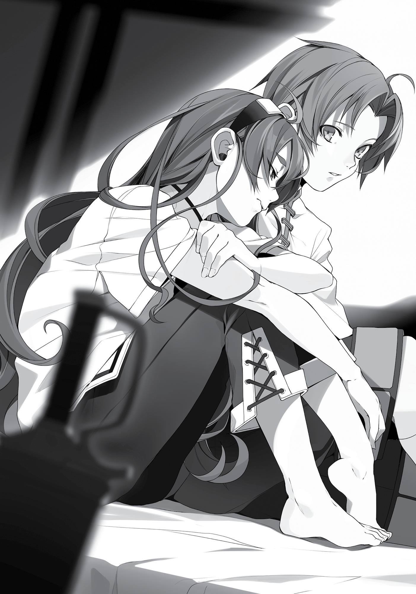
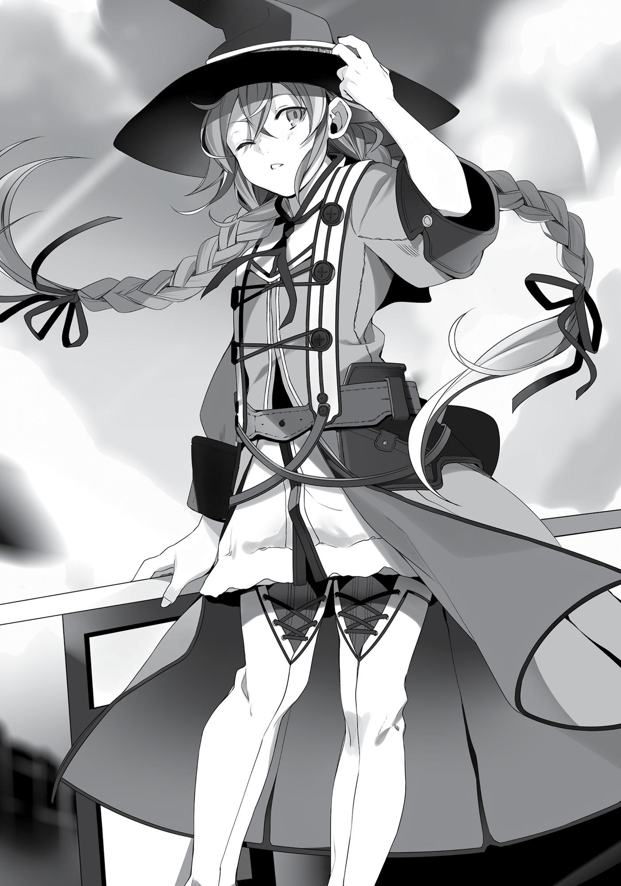

+++
title = "Chapter 3 Missed Connections The Sequel"
date = 2026-07-20
weight = 2
[extra]
volume = 4
chapter = 3
+++
A demon eye. Most people would be shocked at receiving
such a thing so suddenly. By chance, she happened to be in that
alley, and by chance, she happened to give it to me. It was such a
twist of fate, and my mind had not caught up with what was
happening.
That aside, I had done just as the Man-God instructed me. So
that meant things went exactly the way he wanted them to. The
thought made me want to tear the eye out and crush it underfoot. I
didn’t, though, because that seemed too painful and scary.
At any rate, I started back to the inn and cursed my own naivety.
The people walking around town were all doubled. Which was the
future, and which was the past? Even if I could tell, people’s
movements were unpredictable. I kept misjudging them with my
eyes and bumping into people.
“Tsk! Watch where you’re walking!”
From the man’s appearance, I guessed he was a small-time thug.
He had a voluminous beard on his chin and a scar on his face. I didn’t
get the impression he was an adventurer, but rather one of the many
pests that infested the city.
“Yes, I apologize. My eyes aren’t very good.”
“Your eyes aren’t good, eh? Then walk on the side of the road!
You know most of the folks around this area that can’t see or hear
well look apologetic when they’re walking around!”
He was just trying to pick a fight. His threats were intimidating,
but I could tell he wasn’t that angry, just a bit irritated. “I’ll be careful
from now on,” I said.
“That’s right, watch it!”

I didn’t want things to escalate further, so I just held my tongue
and looked the other way.
The thug hocked and spat at the ground before walking off.
Then he paused. “Tch…ah, that’s right,” he said. “I just have one
question for you. You seen a drunk moron walking around here? He
never came back yesterday.”
I saw it just as he looked back at me: a flowerpot shattering right
on top of his head. What happened next was instantaneous. I
channeled mana with my right hand and released wind magic that
blew him out of the way.
“Gah!” He somersaulted across the ground, then leaped to his
feet in a defensive stance. He whipped out his sword and aimed its
tip at me. “Bastard, what the hell are—”
That was when the flowerpot crashed against the ground,
shattering. Both of us followed its trajectory upward. A middle-aged
woman gazed down at us with a dumbfounded look upon her face.
“I-I’m so sorry! Are you all right down there?”
“Ah, yes, we’re fine!”
She ducked back into the house after I answered. The thug’s
gaze flitted between me, the spot where the pot had fallen, and his
current position. He gulped.
“Umm…about that drunk guy, he’s passed out in one of the
alleyways. Probably had a fight with someone. Anyway, I’ll be off.” I
spoke as quickly as possible before turning my back on the scene. I
didn’t want to be further involved with that thug.
This eye seemed to have its uses after all, though it would be a
nuisance if it caused problems like this constantly. I decided to work
on mastering it quickly.

I returned to the inn. When I told Eris and Ruijerd that I had met
the Demon World’s Great Emperor, they were both flabbergasted.
“The Demon World’s Great Emperor? I didn’t think she would
revive.” Ruijerd had a rare look of surprise on his face.
“And I never dreamed I would get something like a demon eye
so suddenly.”
“Bestowing demon eyes is a power only the Great Emperor
possesses,” he explained.
The Great Emperor of the Demon World, Kishirika Kishirisu, was
also known as the Demon Emperor of Resurrection. Another name
for her was the Demon Emperor of Demon Eyes. Apparently, she
wasn’t that skilled in combat, but with twelve demon eyes in her
possession, there were many things she could see that most could
not. Her most fearsome power was her ability to turn another
person’s eye into a demon eye. It was through that power that she
bestowed demon eyes on all of her followers, giving her the power
to rule over all of the demon tribes. There were even those who
became her followers just so they could obtain more power.
“I wonder what she was doing in this city?” I said.
“Who knows? I have no idea what goes through the minds of
Demon Kings or Demon Emperors,” Ruijerd said with a shrug.
True, I thought. You didn’t even know the true intentions of the
Demon God you served for so many years, after all. Not that I would
say as much to him, knowing it would only depress him.
Eris, on the other hand, was starry-eyed over the title “Demon
World’s Great Emperor.” “That’s incredible. I want to meet her, too!”
“You do?”

Eris and Kishirika. Just what kind of conversation would the two
of them have if they were to meet? Even I was a little curious. As
unlikely as it seemed, they might find common ground.
“I wonder if she’s still in the city.”
“I’m not sure,” I said.
Who knows? Maybe if I went back through the alleys tomorrow,
I’d find her passed out from hunger again. It felt like a highly
plausible running gag, given her character. But still, quite unlikely. It
seemed she was searching for someone, so she’d probably moved on
already. It was as if she were a magical girl being led on by the Law of
Cycles, or something. “I’m sure she’s probably left the city by now.”
“Really? That’s too bad,” Eris said. She would probably go check
out the back alleys tomorrow anyway, despite what I said.
“Anyway, with that said, I’m going to hole up in the inn. You two
are free to go off on your own.”
They each gave a nod.
It took a week to learn how to use the demon eye. Put simply, it
wasn’t that difficult. You could control the eye through mana. It was
very similar to the way I used magic without chanting, which I had
done many times before. Through mana, you could control what you
saw. I was confused until I realized there were two types of focus.
Then things came together quickly.
One of the focus types controlled opacity, like changing the
shade of dialogue windows in an erotic game. At first, it was turned
to max, so everything appeared fully doubled. I made the opacity as
low as possible. By channeling mana into the inner part of my eye, I
could weaken my foresight ability enough to see the present.

Glimpses of the future were beneficial, though, so I adjusted the
opacity to the exact point where it wasn’t distracting, but still visible.
Then I tried to maintain it like that. If I lost focus for even a second,
the opacity would change. It took three days before I could keep it
consistent.
The next one was duration—or rather, the latency. I could
change how far into the future I could see by channeling mana into
the forefront of my eye. The furthest forward I could normally see
was only one second, but with the use of mana I could see two or
more seconds into the future. Things blurred into twos or threes, like
the branch of a tree splitting off and representing different
possibilities.
I could see up to three or four seconds with more mana, but if I
tried to see up to five seconds in advance, the image split and
blurred so much that it gave me a headache. That was representative
of just how many ways the future could change. Also, the further you
tried to see into the future, the more it taxed your brain, apparently.
Kishirika even said that having two demon eyes would cripple you.
Perhaps it was the influence of all her demon eyes that made her
seem like such an airhead.
Regardless, I knew that I could safely see one second into the
future. It took me three days to master this, then an extra day to
learn how to control both factors at once. In total, it took seven days
to learn the basics of using my Eye of Foresight.
While I was busy channeling mana into my eye and commanding
it, Do my bidding, Eye of Foresight! Eris and Ruijerd went somewhere
together every day. When they returned, Eris was always bathed in
sweat while Ruijerd looked as composed as ever, only perspiring

slightly more than usual. The two of them were doing something to
work up that sweat. And every single day, at that!
“Just for the sake of reference, I’d like to ask. What are you two
doing?”
Eris was wringing out a rag drenched in sweat when I asked. She
answered, “Heh heh, that’s a secret!” She looked to be truly enjoying
herself.
So she was doing something in secret that she couldn’t tell me?
Oh, I get it. A little afternoon delight, eh? Guess my only hope for
action was to drown myself in the scent of that sweat-soaked rag she
was holding.
Don’t get the wrong idea—I wasn’t particularly worried about it.
They were probably just going out and training. While her attitude
might have suggested otherwise, Eris actually was the type to work
hard in secret. Back when we were in the Fittoa Region, she did the
same thing, frequently training with Ghislaine on her days off. Back
then, whenever I asked her what she was doing, she would get that
same overconfident smirk on her face and say, “It’s a secret!” So I
was sure it had to be training this time, too.
That night I had a dream about a thirty-four-year-old shut-in
prodding me in the cheek as he whispered in my ear, “From now on
your nickname will be ‘pathetic loser’.” I figured it had to be the
Man-God’s handiwork. That bastard was really good for absolutely
nothing.
A week later I informed Eris and Ruijerd about my ability to
control the Eye of Foresight. When I did, Ruijerd suggested, “Then
why don’t you and Eris have a bout?” Was it to test how usable this

thing was in battle? Or was it to show me the results of her special
training? Accomplishing both at once would be a sweet deal, so
I accepted.
We relocated to the beach. Ruijerd stood on the sidelines to
observe while we took up positions opposite one another, swords in
hand.
“Do you really think you can beat me now just because you got
that demon eye?!” Eris was feeling particularly confident today. She
must’ve learned some new technique or something this past week.
I wanted to keep that cheeky grin on her face. “Nope, it’s fine if I
lose. I just want to know how much I can see in the midst of battle
with this eye, that’s all.” That was why I wasn’t going to use magic
today. I wanted to see the fruits of my own labor, as well. I adjusted
my eye to be able to see one second into the future and the fight
began.
“Hmph, that sounds just like something you would say, but…”
I could see what she was going to do even as she was still
talking. She’s going to suddenly swing her left fist at me. If I didn’t
have this eye, I wouldn’t have been able to react in time. Eris was a
natural when it came to launching preemptive strikes.
“Hah!”
“Oho!” I was able to dodge her attack. I countered by clapping
the side of her face.
Then the next vision came. Eris won’t even flinch—she’ll start an
onslaught of attacks instead, with the sword in her right hand. That
was Eris’ strong point. She could shrug off any number of attacks and
launch right into an offensive. Her lower body was so strong that
most attacks wouldn’t send her reeling. In fact, the more damage she
took, the more it charged her rage and the more aggressive her
attacks became.
“Tah!”

“Okay!” I struck her forearm hard. Eris dropped the sword.
Previously, I would have considered the battle over at that point.
Dropping your sword meant you lost, or at least it did when I was
training under Ghislaine. However, I could see with my eye that this
wasn’t over yet.
Eris is already falling back into her second line of attack.
In other words, this was just one of her feints. She dropped the
sword to get me to lower my guard.
She’ll punch me right in the chin with her left fist.
In other words, she purposefully dropped the sword to lure me
into a false sense of security, so she could launch into her usual style
of hand-to-hand combat: Eris’ special Boreas Punch.
“Wha…!”
“Your legs are open.” I hooked my foot around hers, knocking
her off balance. Her fist swiped at empty air and she fell to the
ground.
Still, it seemed the battle wasn’t over.
She’s going to catch herself with her hands, use the rebound
and torque to turn, and latch onto my right leg.
“Uh-uh.” I stepped back and at the same time brought my knees
down, pinning her so she couldn’t move.
Thanks to the way she’d contorted her body in a desperate
attempt to bite me, Eris’ body was all twisted. One arm was
squashed beneath her, while one of her legs was bent toward her
bottom. I wondered what she would do next, but all I could foresee
was more struggling.
“That’s enough,” our referee called out.
Eris drooped as if the energy had been drained out of her.
Did I win? Did I actually win? This was the first time I had ever
beaten Eris in close combat and without magic.

“I failed, huh…” Eris had a surprisingly tranquil look on her face
when she gazed up at me.
I got off her. She stood up slowly and dusted the dirt off of her
outfit.
She’s going to punch me.
Eris’ expression soured when I stopped her fist with my hand.
“I’m going home!” she declared loudly. Her shoulders trembled as
she left for the inn.
Did I really piss her off? I wondered. No, that wasn’t it. I
probably just made her lose some confidence. She’d always had an
easy time beating me so far. Now I had suddenly gotten stronger. If I
were in her place, I would have probably felt jealous, too.
“Eris is still a child,” Ruijerd said as he watched her go.
“That’s normal for her age,” I responded before looking back at
him.
He looked me in the eye and nodded. “Smooth work.”
“Anyone who had a demon eye could do that.”
I had gotten somewhat fitter, but there were dozens of other
people in this world with similar physical ability. Anyone who had a
demon eye should be able to do the same.
“A demon eye isn’t something a person can immediately master
when they get it.”
“Oh, really?”
“There was a Superd in my battle troupe who had a demon eye.
He kept an eyepatch over it constantly and never managed to control
it, not even till the day he died. You’re an odd one for being able to
control it after just one week.”
Oh, okay. Okay, yeah. Yeah, I got what he meant.

Well, I did work really hard on controlling my mana flow, and I
did master using it in just a week. So I was the only one able to
control it this quickly, huh? I see, I see. Mwahaha! “Perhaps I could
even beat you, Mister Ruijerd.”
“If you use magic,” he agreed.
“In close-combat?”
“Want to give it a try?”
I decided to take him up on that offer. To be frank, I was getting
ahead of myself. “Yes, please.”
Ruijerd put his lance aside and took a stance empty-handed. In
other words, he didn’t need his signature weapon against a runt like
me. “You can use magic if you’d like,” he said.
“No, if we’re going to do this, we’ll do it with our bare hands.”
Before I had even finished, a vision appeared before me.
Ruijerd’s palm is going to come straight at me.
I could see it. I could see what he was going to do, and I could
react to it.
“Oho!” I reached my hand out to stop him.
He’s going to grab my hand.
The moment I saw the vision, I instinctively pulled my hand
back. The next moment, the vision blurred.
He’s going to catch me in the face with his fist.
Now there were two visions; in other words, two separate
potential futures. One in which he grabbed my arm, and another in
which he slammed his fist into my face. What was going on? Doubt
stirred within me. My vision wasn’t supposed to blur within a onesecond window.
“Whoa!” I bent my body back, narrowly evading his attack.
Ruijerd’s fist is going to come at my face.

I could see it. I could see it clearly. But my body was already
contorted from dodging his last attack. Even if I could see what he
would do next, I wasn’t able to move in time to avoid it.
“Bwah!”
His fist caught me right in the middle of my face. My head struck
the sandy beach as I tumbled to the ground. I was left lying there
facedown.
I reached a hand up to check for injuries. I was okay, right? I
hoped he didn’t completely mangle my beautiful face. I didn’t have a
pushed-in pug face now, did I?
“Yield?”
I could sense it was over the moment he asked that. “Yes, I
admit defeat.” I thought I could win when I saw the first vision, but it
seemed things weren’t quite so simple.
“But now you understand, right?”
I took the hand he held out to me and stood up. “No, I don’t.
The future I saw just blurred. How did you do that?”
“I have no idea what you saw, but I decided that if you tried to
defend with your hand I would grab it, and if you didn’t then I would
punch. That was all that went through my head.”
In other words, as long as he could guess what I was going to do
next, he could react to it. There was such a gap in our skill levels that
my ability to see one second into the future ultimately meant
nothing. Similar to shogi, you could say. Even if a novice could see
one move ahead, there was still no way they could beat a master.
The inhabitants of this world were, to an unusual degree, highly
skilled. There were probably many others out there who could fight
like Ruijerd.
“More importantly, I’ve fought someone with the same demon
eye before. Ever since then, I’ve fought with the assumption that

everyone has the same ability. You and I have different levels of
experience.”
“That’s true.”
So he used his experience to combat the Eye of Foresight.
Perhaps the sword styles of this world also had ways to counter the
power of a demon eye—for instance, the Sword God Style’s
Longsword of Light. I got the feeling that even if you could see it, you
wouldn’t be able to dodge it.
“It looks like I got a little ahead of myself.”
It seemed the weaknesses of the demon eye were already longestablished, such as finding a way to block the possessor’s vision,
using a shield, attacking from behind, or even fighting in the dark.
All that aside, this eye still had its appeal. I beat Eris, after all.
Just thinking about the ways in which I could use it from now on
made my heart pound. I had predicted everything Eris would do. A
complete 180 from how things were before. In other words, with
practice, I might even be able to predict Ruijerd’s movements.
That was when the Wise Old Sage appeared with a poof inside
my head, with his bald head and sunglasses. “Now you don’t have to
get smacked around all the time to see how far you’ve come!” he
said.
All right, then. Thank you, breast-loving Wise Old Sage. Hmm.
Thinking about all the ways I could use this eye really did make my
heart soar!
When I returned to the inn, wearing a dreamy look on my face, I
found Eris perched on the bed with her knees hugged to her chest.
Oh, right, I had forgotten about her. She was depressed. Meanwhile,

my inner Wise Old Sage had hopped on his turtle and disappeared
somewhere else.
“Um, Eris?”
“What do you want?”
After our battle, Ruijerd told me what the two of them had been
doing this past week. Apparently it was special training, after all. Not
the perverted kind, of course. To strengthen herself, Eris had
dedicated every single day to sword practice. As a result, she had
successfully managed to beat him one time.
She’d beaten Ruijerd once. That was extraordinary. I’d probably
never manage that in my entire life. Apparently, Eris got pretty cocky
because of it. That’s why Ruijerd used me to deflate her ego.
Seriously, what the hell? It was his own mistake and yet that
lolicon-loving wannabe warrior made me clean up his mess. Still, it
was effective. Her ego had swelled so much after claiming victory
against an opponent she’d never beaten before (Ruijerd), only to be
punctured by losing to an opponent who had never defeated her
before (me).
That said, I didn’t think this was the right way of handling it. I
knew what it was like to finally start thinking, Hey, maybe I’ve got the
hang of this? only to be proven otherwise. It left you feeling
completely miserable, as if everything you’d done up until now had
been pointless.
Sure, perhaps it helped cool her head. Maybe she wouldn’t
make big mistakes now. But Eris was probably in a period of rapid
growth. I didn’t think checking her ego was the right answer. Instead,
it was better to let her ride that high so she could develop even
faster. Then you could point out her shortcomings and correct them
afterward.
“You really have gotten very strong, Eris.”

“It’s fine, you don’t need to comfort me. I knew I couldn’t beat
you, anyway.” Still irritable, she stuck out her bottom lip in a pout.
Hmm, what could I say to her? I didn’t have any good stock
phrases for times like this.
Ruijerd hadn’t come back to the room with me. It was his fault
her ego got out of hand in the first place, so I wished he would do
something about this, even though it was true that I was the one
who had actually burst her bubble.
Then again, if I could comfort her properly, her affection meter
would undoubtedly go up. She would fall head over heels for me,
and the two of us would hold each other cheek-to-cheek in a love
dance. Ruijerd must have assumed that was what would happen, and
that’s why he’d left us alone.
“Don’t lose all of your confidence over this. I heard you
managed to beat Ruijerd once. That’s amazing, right?” I took a seat
beside her as I spoke. When I did, Eris leaned her body against mine.
The sweet scent of sweat filled my nostrils. It was a good smell, but I
had to rein myself in. I needed to be a gentleman in this situation.

“It’s cheating, Rudeus. You got a demon eye for yourself while I
had to work my butt off…”
I froze. My head instantly went numb. My inner wolf receded
with its tail tucked firmly between its legs. There was nothing I could
say in response.
She was right. What was I getting so happy over? It was
cheating. What I’d done was dishonest. The demon eye’s power
wasn’t something I’d worked hard to obtain. It just fell into my lap.
All I did was buy food from some stand and wander the back alleys.
True, it had taken me a week to master its powers. But that was it. I
hadn’t struggled at all. What the hell was I doing using that power
and acting all happy that I’d beaten Eris when she spent an entire
week working hard, drenched in sweat?
“I’m sorry.”
“Don’t apologize.”
Eris went completely silent after that. She didn’t move away
from me, though. My heart would normally be pounding at her scent
or the warmth of her body, but this time it didn’t. Instead I just felt
ashamed, as if her heat and the smell of her sweat were criticizing
me. The air felt heavy.
Maybe it was better for me to not use the demon eye unless
absolutely necessary. Its convenience might hamper my growth. I
understood as much after fighting Ruijerd.
Right now, the most important thing wasn’t thinking about how
to utilize this demon eye. Instead, I needed to hone my combat
ability. True, I was a better fighter when I used the eye. But my skills
would eventually plateau if I relied on that. Relying on a crutch
would only come back to haunt me later. It was dangerous. I almost
let myself play right into the schemes of that treacherous devil, the
Man-God.
I decided I would only use my demon eye as a final trump card.

That night I spent time thinking by myself.
Ultimately, we hadn’t found a way to cross the ocean yet. Had I
messed up somewhere? I followed the Man-God’s advice well
enough, but all I had gained was the demon eye.
Was this supposed to help somehow? Like with gambling? But
pleasures like gambling didn’t exist here on the Demon Continent. If
they did, they were probably in the form of betting on brawls
between two people. That wouldn’t earn me much money. We could
use Ruijerd as a gladiator and charge a participation fee of one crude
iron with a prize pool of five green ore coins, but eventually he’d run
out of opponents.
Hmm. No matter how much I thought about it, I couldn’t come
up with any solutions. We were still in the same situation as we were
before I was given the Man-God’s advice. In a way, we had wasted a
week. Wasted an entire week.
“Okay…guess I should sell it.” Saying the words out loud helped
strengthen my resolve.
Fortunately Ruijerd wasn’t around tonight, and Eris was already
on the edge of her bed with her belly hanging out. It would be
troublesome if she caught a cold, so I pulled a blanket over her.
There was no one to stop me. Surely the back alley pawnshop
was still open, right? After all, shops that dealt with suspicious items
were always open at night. With my staff in one hand, I left the inn.
I only made it three steps outside.
“Where are you going this late at night?”
Ruijerd was standing in my way. He hadn’t been in the room, so
I thought he was off somewhere else. Clearly, I was wrong. Dammit,

what was he trying to do, peep on people? I had to fool him
somehow.
“Um, I was just going to go have some sexy and dangerous latenight fun at one of the brothels.”
“And you need your staff to have sex with a woman?”
“Uh…it’s a prop for sex play.”
Silence. I knew that wasn’t going to cut it.
“You intend to sell it?”
“…Yes.” His aim was so precise I had to confess.
“I’m going to ask you again. Are you going to sell that staff?”
“Yes. This staff is made out of really good quality materials, so it
should sell for quite a sum.”
“I’m not talking about that. Isn’t that staff important to you?
Just like this pendant.” He held up Roxy’s pendant, hanging around
his neck.
“Yes, it’s just as important.”
“If similar problems happened in the future, would you sell this
pendant, too?”
I paused. “If it were necessary.”
He took in a deep breath. I thought he was going to scream,
even though he wasn’t the type to raise his voice unless it had
something to do with children. He didn’t yell. Instead, he breathed
out a sigh as he spoke. “I would never give up my spear, not even if I
were driven against a wall.”
“That’s because it’s a memento from your son, right?”
“No, because it’s the embodiment of a warrior’s spirit.”
A warrior’s spirit, huh? Those were elegant words, but they
wouldn’t get us across the ocean.

There was a sadness in Ruijerd’s eyes. “You said we had three
options before.”
“I did,” I agreed.
“I don’t remember selling your staff being part of any of those
options.”
“It wasn’t.”
It seemed he was going to reproach me for lying to him. No, I
never intended to lie. Selling my staff was a part of the frontal attack
option.
“Have I still not earned your trust?”
“Trust? I trust you,” I said.
“Then why won’t you discuss it with me?”
I averted my eyes at the question. I knew he wouldn’t approve
of my plan. That’s why I didn’t talk to him about it. Perhaps you
could say that was proof that I didn’t really trust him after all.
“I believe I’ve come to understand the current state of the world
in the past year. Even if we completed missions from the guild or
went dungeon diving, we would never be able to save up two
hundred iron ore coins. It’s too much money.”
Ruijerd was being unusually realistic in his speech tonight. Did
he eat something weird?
“You knew that. That’s why you came up with the option of
using a smuggler. I wouldn’t have thought of that. But that’s the only
way for me to get to the Millis Continent. You’re correct about that.
So why are you trying to sell your staff?”
The only thing I came up with was a better option, not the best
option. The best option, the one where everything worked out
perfectly, was too difficult and would likely end in failure. So I didn’t
know the correct solution, just as I hadn’t any other time before.

That was also why I wasn’t convinced that using a smuggler really
was the right option.
“Even if it is the right option, there’s no point if it creates a rift
within our party,” I said.
“So you think that if we rely on a smuggler, it will create a rift?”
“Yes. Because according to your values, a smuggler is nothing
more than a criminal.”
Smuggling… Slaves were included in the list of goods they
carried. Plus, one of the more popular crimes in this world was
kidnapping. Children were easy to kidnap. Put simply, smugglers
were accomplices to kidnapping and selling children.
“Rudeus.”
“Yes?”
“It’s my fault that things have come to this. If it were just the
two of you, you wouldn’t have to worry about getting two hundred
green ore coins.”
On the other hand, if he hadn’t been with us, we might have
met with disaster on the way here. Ruijerd had helped us a countless
number of times.
“Even if you solve the problem by selling your staff, my pride
can’t accept that.”
His pride didn’t change what needed to be done.
“If I sell the staff, I’ll get the money. Then we can play by the
rules, pay, and cross the sea. No one has to have any regrets. No one
has to compromise anything. That’s the smartest way to go about
this, right?”
“But the shame I will feel because you sold it will still remain.
Eris will be bothered by it, too. Isn’t that the rift that you were
talking about avoiding?”
I went silent as Ruijerd looked straight at me.

“Look for a smuggler. I’ll turn a blind eye to their crimes.” He
had a serious look on his face. He’d probably resolved not to
interfere even if he encountered an abducted child, just so I wouldn’t
have to sell my staff. It was all for my sake. He was bending his own
principles and beliefs for my sake. If his resolve was that strong, I
couldn’t argue the point with him.
“If, during the trip, you see a real sleazebag and you can’t hold
back, please tell me. We should at least be able to help a child.”
If Ruijerd was that serious about it, then I would drop this plan,
however smart I thought it was. We would rely on a smuggler to
cross the sea. But this time I wasn’t going to cater to other people. If
Ruijerd couldn’t hold himself back, we would betray them without
hesitation and help whoever needed it. We would use the criminals
as needed and then toss them aside.
“All right, then let’s start looking for a smuggler,” I said.
“Yeah. Let’s do that.”
“I’m afraid you’ll see a lot of unpleasant things along the way,
but let’s get through it together.”
“Same to you.”
The two of us exchanged a firm handshake.
We released our hands and were about to head back in to sleep
when Ruijerd’s face went rigid. He suddenly readied the spear in his
hands. “Who is it?! What business do you have here!”
I trembled with surprise at how sudden and intimidating his
actions were, then followed his gaze. There, in the darkness of an
alleyway, was the figure of a lone man with a half-smile on his
bearded face. He had his arms raised as if to demonstrate that he
had no ill intent. A sword hung at his side. He looked like he’d walked
right out of a combat scene in a movie.

“Ooh, scary. Here I thought everything I’d heard about the
Superd race was a load of crap, but here you are, the real thing.” He
wore a faint smile as he approached. I had seen this guy somewhere
before. “First off, could you put away that dangerous-looking
weapon? Not like I came here looking for a fight. I was searching for
you so I could give you my thanks.”
“This late at night?”
“Little early for you to be off in dreamland, no?”
Ah, I remembered now. This was the man I tangled with
previously, the guy whose shoulder I bumped into after receiving my
Eye of Foresight. I never dreamed he would come to thank me in the
middle of the night. He really was a thug.
“Took me a little while to find you. No one knew about any
magicians with bad eyesight. But when I heard the rumors about
Dead End, I knew it was you. Your gray robe and ability to cast spells
without chanting anything, as well as your height—short as a
halfling—and that condescendingly polite way of talking.”
I wasn’t actually a halfling, though.
“Kennel Master Ruijerd. You helped me seven days ago. And
thanks to you I also found that moron, as well. When I found him, he
had his chin smashed in and was collapsed in an alleyway. Poor fool.
In the state he’s in, he won’t be able to drink anything but alcohol for
a while. Not that he ever drank anything else, anyway.”
Seriously?
“Nah, I was just joking. I do at least have one healing magician
among my friends.”
Good. The man I bumped into might have been a pervy old
lolicon, but at least he didn’t have his jaw split open too.
“So is that what you came here to thank me for?”

“That, and for using your magic to push me out of the way. You
saved my noggin from getting busted.”
“So that’s all. Well, glad to hear it.”
The man spoke with extreme gravity. “In my line of work,
there’s nothing worse than a debt of gratitude. No matter how small
it is, if you don’t pay it back it’ll eventually catch up with you, and
you may get stuck in a situation where you have to betray your
comrades. That’s why it’s best to pay it back and pay it back quickly.”
He shook his head dramatically and pointed at me. “I was listening in,
Kennel Master, and you’re in luck. It just so happens you bumped
into someone who’s a member of a smuggling organization.”
Ruijerd and I turned to look at one another. This guy was a
member of a smuggling organization? What a convenient
development. I would’ve suspected him of lying, but there was also
the Man-God’s advice. Perhaps the whole point was so I would meet
this man.
As I struggled to make a decision, the man seemed to
misinterpret our silence and extended his palm toward us. “That
said, don’t get the wrong idea. I’m returning a favor, but smuggling a
Superd is on a completely different level. I don’t think my life is
worth two hundred green ore.”
Unsure of what he meant, I turned my eyes to him and
encouraged him to continue.
The man just grinned. “I expect Dead End to be pretty strong, so
I got a favor. Feel like listening?”
He was going to return a favor, but also wanted one of his own?
That seemed a bit off. Then again, he did see me using magic without
chanting. His talk of repaying a debt was probably just a cover; he
was actually looking for someone competent to do a job for him.
That was why he made his appearance when he heard our
conversation.

Ruijerd cast a glance at me. Negotiating was my job, after all.
“It depends on the details of your request.”
“Nothing too difficult.” Yet the conditions he listed were a bit
unexpected. “You see, we have to store smuggled goods before we
deliver them, and then we have to keep them safe until the claimant
comes to retrieve them. In a month from now, we’re going to store
some, ahem, goods before shipping them. I want you to release
those people. If possible, I’d like you to make arrangements so they
get back to their homes.”
“Isn’t that the exact definition of betraying your friends?”
“Nah, it’s for their own good. There’s one mixed among those
goods…well, slaves, as you’d call them…who will cause trouble for us
in the future. Selling them would net us a huge fortune, but it would
also come back to haunt us a year from now.” He shrugged and
continued. “I tried to tell them no, but it’s not like we’re a single,
organized group. I was looking for someone both capable and tightlipped who could squash their plans. So how about it?”
Once again Ruijerd and I traded glances. We weren’t kidnapping,
but rather saving people. If that were the case, I didn’t see the
problem with it, but…
“Why can’t you do it? With your sword and your abilities, you
should be able to, right?”
“That’s right. I may not look it, but I’m the strongest among my
buddies. Still, Mister Superd, it’s not like I wanna betray my
comrades. I have to consider what would happen afterward, you
understand. Even if I saved them, I’d have nowhere to go anymore,
so there’d be no point. Just because you’re the strongest doesn’t
mean you get to be on top.”
“…”

From the look on Ruijerd’s face, it was difficult to tell whether or
not he understood where the man was coming from. He looked like
he understood it on a logical level, but not an emotional one.
“Rudeus, I don’t mind. You decide.”
Ruijerd had just said he would close one eye to any wrongdoing.
No matter how seedy the man in front of us was, he would obey if I
decided to do it.
I considered it. A lot of this was suspicious. Still, this was
something that transpired as a result of the Man-God’s advice. While
it was true that I couldn’t trust the god himself, I was probably best
off not overthinking things and going with the flow, just like I did last
time.
Based on what we’d heard, we wouldn’t be committing any
crimes. There was a good chance the person we were helping was a
horrible monster, but saving someone was still saving someone,
regardless of their character.
Besides, we could really use a smuggler to lead us across the
ocean. This wasn’t a bad deal if we could cross without any charges
or fees in return. With all that, it was easy to come to a decision.
“All right, we’ll do it.”
Ruijerd nodded and the man laughed. “All right then, I’ll trust
you to do a good job. Name’s Gallus Cleaner.”
“Rudeus Greyrat.”
And so it came to pass that we exchanged names and decided to
take on a mission from a smuggling organization.

Roxy Migurdia, the woman who was Rudeus’ master,
ended her sea voyage in the city of Wind Port on the Demon
Continent.
She stopped short as soon as she disembarked. Wind Port’s
townscape was much like that of Millis’ northern city, Zant Port. Even
those laying their eyes on it for the first time would be beset with a
sense of déjà vu.
However, déjà vu wasn’t the reason why Roxy paused. It was
because there was a clear difference in the air here compared to
Millis Continent.
It’s been so long, she thought. Nostalgia rose from the depths of
her chest. When was the last time she was here? It must have been
about fifteen years ago. Now that she thought about it, she realized
how much time had passed since she started envying the humans
and fled from her village.

When she landed in Millis Continent’s Millishion back then, and
ate the sweets made by humans, she was shocked at how such
delicious food could exist in the world. She decided then that she
would never eat food from the Demon Continent again, and that she
would never return, either.
A bit simple-minded, if I do say so myself, she thought.
In truth, she hadn’t returned since she left Millis Continent for
the Central Continent, and she’d never even considered going back.
There was so much on the Central Continent. Everything she saw
there was fresh and exciting, and before she knew it she’d already
lived on the Central Continent for as long as she’d lived on the
Demon Continent.
In all that time, the Demon Continent never crossed her mind.
Not even when she went burrowing into labyrinths and faced death
did she stop to think of the parents she’d left behind on the Demon
Continent.
Despite that, now she had returned.
You never know where life will take you, she thought.
“Roxy! We’re going!”
As she stood there, a woman called out to her. The woman’s
ears peeked out from a mane of luxurious golden hair the color of
freshly baked bread. She was an elf, tall and slender with a small
waist and a nice, round behind. Roxy’s heart filled with envy every
time she saw the woman from a distance. There was nothing she
could do about it; it was how the elves were, but she still wished she
could have a body like that. And while their busts were similar, the
elf woman was well-balanced and beautiful, whereas Roxy looked
plain and childlike.
“Yeah, I’m coming.” A sigh escaped her lips.
The name of that magnificent woman was Elinalise Dragonroad.
She was an elf warrior, a vanguard on the front line. She was

equipped with a shield and an estoc, which she used primarily for
thrust attacks. Her skills were just as magnificent as her appearance.
An estoc wasn’t a common weapon amongst adventurers. In the
Asura Kingdom, it was used by the nobles during duels, and in the
northern region it was used by warriors when they were fully decked
out in armor. The one in Elinalise’s possession was a magic item
found in the depths of a labyrinth. It was sturdier than most swords
and a single wave could create a wind vacuum that could cut down
trees meters away. The buckler was also a magic item with the ability
to mitigate any attack it received.
“O-ooh…solid land, it’s solid land…” An elderly dwarf came
tottering out of the ship from behind Roxy. His heavy armor clanked
and his grim beard swayed as he clung to his cane, his face ghostly
pale.
His name was Talhand. Formally, he was known as Talhand of
the Harsh, Large Mountain Summit. He was about Roxy’s height, with
more than twice the girth. This man, with his grim beard and heavy
armor wrapped around his entire body, was a magician.
Why was a magician wearing so much armor? Even Roxy
questioned it at first. But Talhand’s feet were slow, and his agility
nonexistent. If a beast attacked him, he had no way of evading it.
However, with such bulky armor protecting him, he could use magic
right on the front lines.
“Are you all right, Mister Talhand? Should I cast healing on
you?”
“No, it’s not necessary.” He rocked his head back and forth and
scooted his sluggish body forward. He was normally a bit more
nimble than this, but he’d gotten seasick and it had weakened him.
Elinalise put her hand on her hip and harrumphed. “Seriously?
How pathetic. It’s just a boat.”

Talhand’s face went red with anger. “You… what did you just
say…?!”
These two were quick to start fights with one another, so it fell
to Roxy to intervene. “Let’s fight about this later, please. Miss
Elinalise, you don’t have to comment on everything. Some people
are predisposed to getting seasick.”
Roxy had met them at the city of East Port in Dragon King’s
Realm. The two of them were fighting in the Adventurers’ Guild, and
at first, Roxy ignored them. However, she intervened when she
heard amidst their bickering that they were searching for people
who had gone missing from the Fittoa Region, and they planned to
travel to the Demon Continent. Neither one of them was good with
the geography of the Demon Continent, and had conflicting opinions
as a result. Talhand argued that they should go to Begaritt Continent
since they knew the lay of the land, or the northern part of the
Central Continent. Elinalise, on the other hand, said they could still
search for people even if they didn’t know the way, and they could
always hire someone once they arrived. And there was Roxy, dealing
with her anxiety alone, a native of the Demon Continent. It was
almost as if she were fated to meet them.
As their conversation continued, she found out they were
former members of Paul and Zenith’s party. Fangs of the Black Wolf,
they were called. Roxy had heard of them. They were one of the
most famous parties in all of the Central Continent: a mismatched
party full of members with one or two odd quirks which was once
talk of the town. They rose to S-rank in a few short years and
disbanded shortly after, but Roxy remembered them well.
Still, she’d never realized that Paul and Zenith were members of
the Fangs of the Black Wolf. She couldn’t hide her surprise. And the
two of them were just as surprised by her. After all, she was Roxy
Migurdia, well-known by the people as a Water King-tier magician, a
young blue-haired girl who hailed from the Demon Continent. She’d

entered the University of Magic and within a few years obtained the
title of Water Saint-tier Magician, then traversed a maze on Shirone
Kingdom’s outskirts that was twenty-five levels deep. After that, she
took her seat as one of the Shirone Kingdom’s court magicians.
A troubadour sang stories of her early adventures, turning them
to verse that spread her name further. It was a story about how a
young female magician left her hometown, encountered three
novice adventurers, and traveled around the Demon Continent
before setting off for the Millis Continent. Her name didn’t appear in
the rhyme. However, adventurers who knew the song recognized
that it was Roxy from her description.
Calling the three of them (Roxy, Elinalise and Talhand) a group
of kindred spirits would have been an overstatement, but it was true
that their objectives coincided. Roxy was headed to the Demon
Continent to search for Rudeus, while the other two were honoring
Paul’s request to search for his family members. And so they formed
a party together and headed off to the Demon Continent.
The boarded a ship with Millis Continent as their first
destination. There, in the city of West Port, they used an enormous
amount of money to purchase Sleipnir horses and a carriage. A big
expense, but little problem given the size of their purses.
They avoided the holy capital of Millishion, since the other two
didn’t get along with Paul terribly well. Both also had a bad
reputation among their respective kin, so they kept away from the
Blue Wyrm Mountain settlement where the dwarves resided, as well
as the elf settlement in the Great Forest. Instead, they headed
straight for Zant Port.
According to the pair, the rainy season would soon be upon the
Great Forest, so they should move fast while they could. But with the
way they forced the horses to move constantly, even at night, it
seemed like they just didn’t want to be on the Millis Continent for a

second longer than was necessary. Roxy assumed the real reason
was that they simply didn’t want to go back home.
Whatever their reasons, they arrived on the Demon Continent in
record time, so Roxy had no complaints.
“Let’s head to the Adventurers’ Guild first,” Roxy proposed, and
the three of them started in that direction. The guild was always a
first stop for adventurers.
“I hope it’s a nice place!”
Roxy pulled a face at Elinalise’s words. The elf may have
appeared chaste, but she loved men. It was hard to imagine with that
figure, but she’d probably had numerous children. According to her,
this was all a part of the curse that had been set upon her, but she
didn’t act the least bit aggrieved about it. In fact, she rather seemed
to enjoy it. Roxy couldn’t believe it.
“Miss Elinalise, we’re not searching for men.”
“I know that.”
No, you don’t, Roxy scowled. Elinalise might not have had any
problem with her so-called curse, but Roxy wished she would think
of the party she was traveling with. It was fine for Elinalise to do
whatever she liked in her own time, but this was an emergency.
Besides, if she got pregnant, it would only delay their trip even
further.
I wish you’d take it easy a little, Roxy thought.
“Maybe you should get a man or two yourself and—”
“I can’t do that.”
Maybe if I looked as gorgeous as you, Roxy thought bitterly.
Unfortunately, none of the men that Roxy had ever taken an interest
in saw her as a woman. She was popular with children, but she had
no luck when it came to men.

The Demon Continent’s Adventurers’ Guild had a unique feel to
it compared to its counterpart on the Central Continent. Many
different races were paired together in parties.
When Roxy entered, she chanced upon a group who were very
clearly newbies. Three young boys, all dressed in warriors’ gear. They
approached her timidly.
“U-um, would you maybe…form a party with us?!”
Roxy smiled wryly in the face of their plea. “No, as you can see,
I’m already in a party.”
The three of them smiled bitterly at her refusal before making
their retreat. It wasn’t the first time she’d been invited to a party like
this; she’d been asked numerous times by groups of three young
boys. The troubadour had told her he would write songs of her, but
she never expected to become this famous.
“Will you look at that, Roxy? You’re getting invited by some fine
boys after all!” Elinalise patted her on the head.
This happened often. Roxy wasn’t going to bother responding to
it. She wasn’t a child. “Our ranks are too far apart. We couldn’t form
a party, anyway.” Roxy was currently A-ranked. Boys beguiled by the
troubadour’s song were, on average, only D-ranked. She’d never
been approached by any who were above Rank B.
The first time she got one of those party invitations, she bragged
about how she was the main character in those songs, only to
discover she wasn’t actually named in them, thus embarrassing
herself. It was a memory she’d prefer to forget.
She never imagined the troubadour would fail to recognize her
race. Instead he wrongly assumed that she was only twelve and had
become A-ranked in a mere two years. Not only that, but the current

version of the song was so overdramatized that it said she traveled
the Demon Continent and became A-ranked in only a year.
Don’t kid yourself, Roxy thought. In reality, it took her about five
years to rise to Rank A. With the Demon Continent as her base of
operations, she rose to Rank B in three years. From there, she spent
two years hopping from party to party. That was still a quick rise,
though. If she were to start over from Rank F, she might be able to
obtain an A-ranking in just a year, but a party of kids with no
experience could never swing that.
“You could have shaped them into men who would suit my
tastes. What a shame.”
Elinalise’s words triggered a flashback to the three novice
adventurers who had first approached her back then. They called
themselves the Rikarisu Gang, three young boys who helped her out
after she left the Migurd village, when she was nothing more than a
countryside bumpkin who couldn’t tell left from right.
One of them was very sarcastic, always making up lies on the
spot, but really good at looking out for people. Another loved to
curse people out and had a foul mouth, but was also very
determined. The third was incredibly clever, and the one who held
the group together. He died during their journey.
Their party had disbanded when they reached Wind Port, but
she wondered. Were the other two still alive and well? After
adventuring on the Central Continent, she understood just how
severe the conditions were here on the Demon Continent. There was
a high chance they were already dead.
Nokopara and Blaze… I hope they’re still doing well. She found
herself laughing when she thought that. It had been twenty years.
The two of them didn’t have particularly long life spans, so they
might have retired from adventuring long ago. The only one who’d
stayed the same was her.

Let’s leave the nostalgia for some other time, she decided,
cutting her reminiscing short. She was here to find Rudeus or his
family.
“All right, let’s start gathering information,” she proposed to the
other two, and started scanning the inside of the guild.
From the information they gathered, they found out that Dead
End was in this town—part of a new, up-and-coming group of
adventurers who had quickly made a name for themselves.
Dead End. There was no person on the Demon Continent who
didn’t know that name. Even among the Superd, they were
considered particularly dangerous, beasts that targeted mainly
children. When Roxy was just a child, her mother often threatened
her with that name. “If you don’t behave, Dead End will come and
steal you away,” she would always say.
They returned to the inn. Roxy’s face soured once they pooled
all the information they had about this “Dead End”.
“It’s a bit difficult to believe.”
“What part?”
“Hard to believe anyone in their right mind would pretend to be
Dead End.”
What was it about Dead End that was so terrifying? The fact that
the actual group existed. Those on the Central Continent didn’t know
of it, but the name definitely referred to someone out there. Of
course, Roxy had never seen them herself, but all the rumors she
heard were terrifying. They were the most terrifying creatures on the
Demon Continent.

The Adventurers’ Guild had never listed their name exactly, out
of fear of retaliation, but if there was an extermination request for
those demons, it would most definitely be S-ranked. It was the type
of job that would net an adventurer an instant S-ranking if they
completed it.
“I haven’t a clue, either,” Elinalise said.
According to the information she’d gathered, the man claiming
to be with Dead End was fair-skinned, bald, and carried a spear with
him. He was also said to be very handsome.
“Since they said he’s a good-looking guy, why don’t I invite him
to my bed to get some more answers?”
Talhand hocked and spat in disdain. “That info’s useless.”
According to what Talhand had gathered, Dead End was a group
of three people. They referred to themselves respectively as Mad
Dog Eris, Guard Dog Ruijerd, and Kennel Master Ruijerd. The latter
two were brothers. The Mad Dog had red hair, the Guard Dog was a
beanpole, and the Kennel Master was a midget. The Mad Dog used a
sword, the Guard Dog used a spear, and the Kennel Master used a
staff that was apparently a magic item. They didn’t have a
particularly good reputation.
“The Mad Dog is quick to lose her temper, and the Kennel
Master’s done nothing but awful things. Apparently, the Guard Dog
isn’t a bad guy, though. Loves kids, has a strong sense of justice and
refuses to turn a blind eye to evil.”
That’s a very strange assessment for people to make, Roxy
thought. Perhaps the group had started those rumors themselves. If
a party of miscreants did something good, it would spread like
wildfire. Apparently, they weren’t just violent, but canny about it as
well.
“A dangerous bunch. Let’s be sure to avoid them.”

“Aye,” the dwarf agreed. “We don’t need to be drawing the
attention of the wrong sort when we’re supposed to be looking for
people.”
“All right, then let’s move on to the main agenda,” Roxy said,
redirecting the conversation. Their purpose in heading to the
Adventurers’ Guild hadn’t been to glean information about Dead
End. “Were there any rumors about people from the Fittoa Region?”
“Not one,” said Talhand.
“No, I didn’t hear anything,” said Elinalise.
We must be too late, Roxy thought.
The Demon Continent was not the kind of soft place that one
could survive being teleported to without the proper equipment. It
was a land where simply surviving a year could prove difficult for
locals. Also, it had already been a year since the Fittoa Region
displacement. Those who were teleported might have all perished
already.
“The ones we’re really searching for are Paul’s family.”
“So Zenith, Lilia, Aisha, and Rudeus.”
Roxy had taught Talhand and Elinalise how they might identify
each one of them. Aisha was the only one she was vague about,
because she only knew about her through Rudeus’ letters.
“Well, Zenith should be just fine,” Elinalise said.
“No doubt about that.”
The two of them knew Zenith, so they expressed no concern.
Roxy, on the other hand, didn’t know how capable Zenith was, but
she trusted in these former members of the Fangs of the Black Wolf
who vouched for her. If Elinalise and Talhand thought Zenith would
be fine, then she would be fine.
“Rudeus also stands out, so we should be able to find him
immediately.” Roxy remembered the overwhelming talent that her

five-year-old pupil had demonstrated. He would surely be the talk of
the town no matter where he went.
Zenith and Rudeus would be the easiest to find if they dug for
information. They also had the strength to survive on the Demon
Continent as long as they landed somewhere close to civilization.
That was why they prioritized finding information on Lilia and Aisha
from the start.
“Let’s set a deadline. Two days to gather as much information
on Lilia and Aisha as we can, then on the third day we make
preparations to hit up other settlements in the area. Does that sound
like a plan?”
“Isn’t that a bit too soon?”
Roxy shook her head at Elinalise’s words. “There’s a high
likelihood they’re already dead, and the Demon Continent is big.
We’ll make a single pass through the major cities and submit missing
persons requests at each guild along the way.”
The Asura Kingdom would cover costs incurred while searching
for residents of the Fittoa Region. As long as their group submitted
requests at each guild, the reward for successful completion would
be provided by the Asura Kingdom, so they could leave that for
adventurers to pursue. It wasn’t an automated process, because the
guild required someone to sign a request form before they could
post it. On the other hand, if the guild didn’t post those requests,
then Asura Kingdom had no reason to pay the guild.
Roxy felt genuinely irritated by how atrociously the Asura
Kingdom was handling such a widespread disaster. It was a major
power, so she thought they should be taking more proactive actions.
In truth, the only people actually participating in the search
endeavors were Paul and those connected to him. In other words,
only those affected by the disaster.

Looks like all that talk about the Asura Kingdom’s inner circle
being corrupt was more than rumor, she thought. It was the country
with the longest history in the world, so it was still hanging on even
as its traditions and power deteriorated.
“All right, tomorrow let’s busy ourselves with gathering
information.”
“Okay, will do!”
“Roger.”
Roxy wasn’t the type to linger over things. No matter where she
stayed, she never wasted any time. She always finished things
quickly and then set off. That part of her personality showed up
when she initiated Rudeus, teaching him her special technique and
then immediately setting off again. Making swift decisions was her
forte, but also part of why Rudeus saw her as an airhead. Others had
pointed it out to her, but Roxy still considered it a strength.
That was why she settled on a schedule of submitting a request
to the guild on the first day, searching around on the second, and
setting off by the third. A prompt, concise schedule to be sure. If they
had stayed for a week, the results may have been a little different.
On the second, Roxy’s curiosity got the best of her and she went
to go see what Dead End was up to. Their group stood out, so it was
easy to find them.
A pair were training diligently on the beach. Just as her
information said, one was a bald beanpole while the other was a
young red-headed girl. She wielded her sword in both hands with
such purpose, swinging it at a frightening speed while the bald man
parried the attacks easily.
Her information said Dead End was a three-person group with
one tall person and two small people. Looks like the tiny Kennel
Master isn’t with them, she thought.

The Guard Dog and Mad Dog continued their high-speed clash
of offense versus defense. Perhaps clash wasn’t the right word, given
that the Guard Dog simply deflected the Mad Dog’s attacks, but the
techniques he used were beyond Roxy’s level.
Roxy watched them from afar, peeking from behind the shadow
of a boulder. It was almost as if this were pro baseball and she was
the older sister of a pitcher who used balls of magic as their weapon
in battle.
The two of them were strong, even to Roxy, who had traveled
across the world as an adventurer. That wasn’t strength which could
be achieved through technique alone.
It might be good to make contact with them after all.
As soon as she thought that, the Guard Dog looked over his
shoulder.
Ah…!
It felt like their eyes met. His gaze was so intense that it gave
Roxy an unspeakable sense of terror. Enough to give her the illusion
that she was prey being hunted.
She slipped away hastily.
Ruijerd sensed her from the very beginning. He wasn’t sure
what she wanted, or if she was just watching. When he casually
looked in her direction, he saw a girl’s face peeking out from behind
a rock.
No, not a young girl, he realized. An adult Migurd female. He
couldn’t tell from a glance, but there was no fooling Ruijerd’s third
eye. He didn’t recognize her presence, and there was also more than
one Migurd settlement.

He figured she was probably just watching out of curiosity, but
when he looked back, she turned away and ran off somewhere. Hm.
Did I scare her away? he wondered.
He’d let his guard down momentarily, and Eris dove in. It was an
attack with power behind it.
“Guh!”
After exchanging three blows, Eris struck Ruijerd on the back of
his hand and made him drop his sword.
“Yay! Did I do it?! I did it, right?! Yeaaah!” Eris pumped both
hands in joy.
Lately, her skills were beginning to take shape. In the future she
would surely be a fine swordswoman, but right now she was still
young. If she thought too much of herself now, it might spell disaster
in her future. He hadn’t planned to let her win a fight for a while, but
that Migurd girl had caught his attention and he let his guard down
for a moment.
Ruijerd let out a sigh, quietly enough so that Eris wouldn’t hear
it.
Roxy looked over her shoulder countless times as she hurried
back toward the inn. The whole time, she worried that she was being
followed and that an attack might be coming. If she was going to
fight someone of that caliber, she needed to prepare a magic crystal.
She might even need a magic circle drawn in a scroll.
It didn’t seem like they would attack just because she’d been
watching them, but if they were crazy enough to call themselves
Dead End, Roxy wanted to be prepared.
“Aah! Yes! Right there! Harder, harder!”

Roxy felt exasperated when she heard the moans from behind
Elinalise’s door. The elf hadn’t even bothered with gathering
information; she simply found a man to bring to the inn so she could
enjoy herself.
“Seriously…?”
Roxy had heard about Elinalise’s habit of bringing men to her
room from Talhand. No matter their circumstances, Elinalise would
always fall for some man she met and spend the night with him. That
included their time in Zant Port. According to Talhand, she even did
this when they were in the depths of a labyrinth. The woman had no
principles.
At the same time, Roxy felt somewhat relieved. She would have
felt helpless if she’d been left alone. As long as Elinalise was in the
neighboring room, she could prepare herself for battle and wait for
her. Once the elf was done, Roxy would seize her by the ear and
head out to resume gathering information together. That way she
could also keep her eye on the elf, effectively killing two birds with
one stone.
Although I doubt they would come all the way to the inn, Roxy
thought, as she entered her room to conduct battle preparations.
The walls weren’t particularly thin, yet she could still hear
Elinalise’s moans filtering through. Listening to them put Roxy in a
weird mood herself.
No you don’t, she thought, and grabbed her right hand with her
left just as it was reflexively reaching south. She didn’t have the
luxury of time for that right now.
They’ve been at it for a long time, she thought when three hours
had passed. Roxy had continued to wait quietly. There seemed to be
no end in sight for Elinalise’s tryst. Granted, there was also no
indication that Dead End was going to launch any attacks on them,
either.

Roxy felt like an idiot. Not only could she not do what she
needed, but she also couldn’t express her frustration at Elinalise for
being so selfish. It was especially infuriating since, unlike the elf, Roxy
was showing self-restraint and telling herself that now wasn’t the
time to get busy.
When her anger hit its peak, Roxy finally busted down Elinalise’s
door. “Just how long are you going to keep this up! We’re supposed
to be gathering—”
“Oh, my! Roxy? When did you get back?”
“Ah…oh?”
There were five men in the middle of the room.
“Would you like to join in?”
There was a strong male odor. The men all had vulgar smiles,
and Elinalise was mounted atop one of them, looking as if she were
in the throes of ecstasy. The fact that there were multiple people,
and that they were all consenting to this, was beyond Roxy’s
comprehension.
“Uh, wha…”
The scene before her was so reprehensible that Roxy couldn’t
process it.
“Aaaaaaaaaaaaah!”
Roxy let out a futile scream as she scuttled out of the room. She
flew into the adjacent one, completely out of breath and took hold of
her staff.
“O spirits of the magnificent waters, I beseech the Prince of
Thunder! With your majestic blade of ice, slay my enemy! Icicle
Blast!”
The inn was left partially destroyed.

They set out from the town on the third day. They’d barely
managed to gather any information after everything that happened,
and they forgot to submit a request to the guild. They also destroyed
an inn, which cost them a considerable amount.
“This is all Miss Elinalise’s fault.”
“You can’t blame me. I was in a back alley gathering information
when they came to me with their passionate appeal.”
“Still, there were five…five people, you know?!” Roxy objected.
“You’ll understand someday. A strong, beautiful adventurer like
me being subdued and treated like a sex toy by five of those thugs?
Ah, just thinking about it is enough to get me pregnant.”
“I don’t want to understand.”
When Roxy was at the University of Magic, she was still a child
and didn’t understand the appeal of having a lover or being married.
The first time she ever thought about wanting something like that
was when she saw how intimate Paul and Zenith were with each
other. That was when she finally decided she wanted the same for
herself.
Still, how? She’d wondered at the time. Then she remembered
what an acquaintance at the university told her. That acquaintance
had met her husband in the depths of a maze. Their shared struggle
and the way they overcame it led to their marriage.
This is it, Roxy thought. If I dive into a labyrinth, I should be
able to find a partner, too.
That fantasy grew larger and larger inside her head. She would
somehow bump into someone who was tall, manly, and fashionably
dressed—a young human man with a youthful appeal—in the depths
of a labyrinth, and he would save her. Then the two of them would

combine their strengths to make their escape, and in so doing, their
love would bud and blossom. The youth would discover one of his
friends had died, and Roxy would comfort him. That would be their
first night together.
When she actually did journey into a labyrinth, those fantasies
were quickly shattered. A labyrinth was a harsh place, and the
adventurers who entered them were a stern lot. The only youthfullooking person among them was Roxy herself.
By the fifth floor there were no other solo adventurers. By the
tenth floor she decided things were tough enough that she needed
to gather a party, but people mocked her for her childlike
appearance and laughed her off countless times. She got stubborn
after that and continued further downwards on foot. Ah, the
stupidity of youth. She came close to death numerous times, but was
lucky enough to escape its clutches. She never wanted to repeat that
again.
“Well, you have to start by finding your first man, anyway. How
about it? Next time, we can both—”
“Absolutely not.”
The dream was shattered. Still, she held on to one hope.
Perhaps it was impossible for her to find some hunk at the bottom of
a labyrinth, but she could still fall in love the ordinary way and have
an ordinary wedding. In the meantime, she had absolutely no
intention of giving her body over to a man whose name she didn’t
know just because Elinalise managed to reel him in.
“Besides, I don’t have the time for all of that.” At least, Roxy
decided she was best off alone while she was wandering the Demon
Continent.
That was how Roxy made her first misstep and began her
adventure across the Demon Continent.
