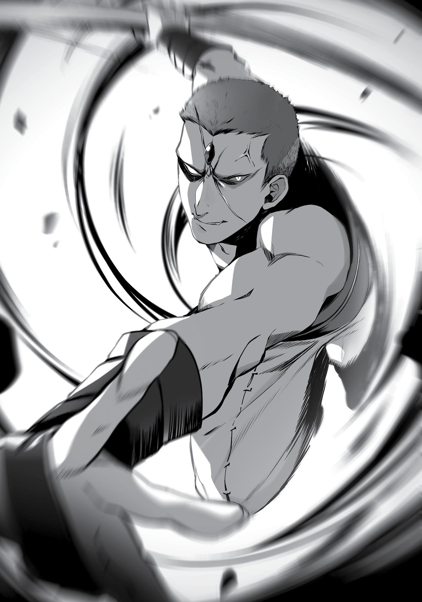

+++
title = "Chapter 5 The Demon In The Warehouse"
date = 2026-07-20
weight = 4
[extra]
volume = 4
chapter = 5
+++
The layout of the city of Zant Port was similar to that of
Wind Port. There were a number of rolling hills at its edge, and a
harbor that was livelier than the city itself. The Adventurers’ Guild
was similarly closer to the harbor than it was to the city’s center.
That said, there were some contrasts. There were noticeably far
more wooden buildings here than there had been in Wind Port. They
were also painted in riots of color, perhaps to protect the material
from the salty sea air. Trees lined the road, and one could see a
forest beyond the city’s edge.
Green was everywhere. It was a sharp contrast to the Demon
Continent, which had been all whites, grays and browns. An ocean
was all that separated the two continents and yet they were like
different worlds.
I should have expected as much since this was the Millis
Continent, but the people roaming the streets were not the
outlandish mix of different demon tribes I had seen before. Instead
there were beastfolk, elves, dwarves, and halflings—races of people
that all closely resembled humans.
Before we went to find ourselves an inn, I had to check the state
of our finances. In the Demon Continent’s currency, we had two
green ore coins, eighteen steel iron coins, five scrap iron coins, and
three stone coins. That was it. When we exchanged it, we received
three Millis gold coins, seven Millis large copper coins, and two Millis
copper coins. Less than I assumed we would have, but I suspected
that was because of transaction fees. If we’d used an exchange
business that hadn’t been licensed with the guild, they would have
surely taken more. This was still within an acceptable range.
“We should stay in an inn close to the guild, right?”
“Yeah, we need to take on some missions,” Eris agreed.

That depended on how things went down tonight. Assuming it
went smoothly, we would be working on jobs from the guild while
simultaneously spreading the good name of Dead End. So far, it
seemed the name wasn’t widely known here in Millis Continent. The
day that name lost all its dire associations might soon be upon us.
With that in mind, we began searching for an inn close to the
guild. Mysteriously enough, all of the conveniently priced ones had
no rooms left. This was the first time I’d experienced this. Sure, we
had been turned away before because an inn was full, but I never
dreamed that almost all of them would be that way.
Was there some kind of festival or something going on? When I
asked, one of the inn proprietors replied, “The rainy season is almost
upon us. Almost all the good inns are going to be fully booked.”
The rainy season was a weather phenomenon peculiar to the
Great Forest, a continuous rainfall that lasted three whole months.
The deluge made the Great Forest, as well as the highway,
impassable. There were many guests who booked long stays at the
inns as a result.
Most people would usually avoid getting stuck in a place like this
during the rainy season, but apparently certain monsters only
appeared during this time, thanks to the rains that washed them
toward the city. The materials harvested from those monsters sold
for a lot of coin, so many adventurers came to town and stayed
during this season.
When I heard that, I decided to change my plans. If we spent the
next three months diligently raking in cash here, we could earn all
our expenses for the rest of the journey. We could also spread good
word of Ruijerd’s name at the same time. Deciding on a plan of
action would make the rest of our trip on the Millis Continent
smooth and relaxing.

That said, don’t count your chickens before they something-orother, right? We didn’t have much cash, and we couldn’t find an inn
to stay at, either. The only places with open rooms were either far
above our budget, or exceedingly shitty.
You couldn’t pay with money you didn’t have, so we were left
with only one option: to take residence in an unsavory lot and stay at
what was, frankly, a slum lodge. One night was three large copper
coins and there were no other services offered, including meals. At
least it was cheap, and decent if we were only using it for sleeping.
We had stayed in far worse places in the Demon Continent. Though
it might be worth moving somewhere else once we managed to save
up some coin.
“Hmm, I guess it’s not too bad!” Eris was a daughter of a noble
family, but she had no qualms about the dilapidated state of the
building or its lack of services.
In fact, I was the one who had complaints. “I personally would
like more pleasant accommodations.”
“You’re acting like a big baby.”
As much as I wanted to reply with, “Oh yeah? Well you’re one to
talk”, I couldn’t. With careful recollection, I remembered that this
young, “noble” girl used to sleep soundly on a bale of hay in a roachinfested stable that reeked of horse dung. She hadn't woken up even
when I groped her chest. She wasn’t like me. I still longed for the
warmth of a nice bed even after being reincarnated.
I decided not to “act like a big baby”. All I could do was use
magic to create a hot wind that would annihilate any dust mites,
then quickly clean the room. I wasn’t necessarily a clean freak.
Honestly, I actually liked things to be a little messy, but sometimes in
inns like these the people who stayed before us forgot some of their
things. There might be some coin left underneath the bed, or a small
ring that had fallen off a cabinet. We could pocket any money we

found, but sometimes if there was a ring or something similar left
behind, there might be a request for it at the guild. It might give us a
cash reward, regardless of the request’s rank. Typically this was small
change, but sometimes it could fetch you a hefty sum. That was why
I carefully cleaned the room.
In the meantime, Eris borrowed a buck to do some simple
laundry. Then she quickly performed routine care on her equipment.
By the time we were both finished, the sun was beginning to set.
“Eris, it’s about time for us to go pick up Ruijerd.” I immediately
remembered where our inn was located. The slums were close,
which meant public safety wasn’t a guarantee.
We’d once stayed in an inn close to the slums. A burglar broke
into our room while we were out on a job. Ruijerd had followed the
crook’s tracks and punished them severely, but the goods they stole
from us had already been passed off to someone else and we never
got them back. The articles weren’t particularly important to us at
the time.
Thus, I had no plans to leave anything precious in this hotel
room while we were out. Still, it seemed prudent to put in some
crime prevention measures. It also gave me a good pretext not to
bring Eris along with me.
“Eris, you stay here and keep an eye on our luggage.”
“You’re leaving me here? I can’t go with you?”
“It’s not like that, it’s just that this isn’t really a safe area around
here.”
“That’s fine; it’s not like any of this stuff is particularly
important.”
I was shocked. Eris didn’t realize the importance of crime
prevention. We would be in trouble if we had our daily commodities
stolen, since we didn’t have the money to replace them. I had to use

this opportunity to instill in her the importance of guarding herself
against would-be thieves.
“Don’t you understand? Someone might steal the underwear
you just washed.”
“The only person who would steal something like that is you!”
I groaned inwardly at that burn.
…But you know, Eris, I never tried to steal your underwear after
you’d washed them. Not even once.
***
I walked through the city at night, alone. Eris took quite some
time to persuade. Crime prevention really was important, though.
We were instructed to carry out our job at night, but our
employer never specified the hour. Any time after the sun set was
fine as long as we rescued the captives. We were free to operate on
our own time. However, with the rainy season almost upon us, the
smugglers would be eager to move their ship as quickly as possible,
so we couldn’t dawdle.
At presently, Ruijerd was being treated as a slave. They would
do the bare minimum to keep him alive, but he might have endured
harsh treatment this past week. They surely hadn’t fed him anything
decent. He was probably hungry. And when people got hungry, they
got angry. That was why I had to hurry.
With Ruijerd’s spear in one hand, I made my way to the wharf,
and then to the pier on the edge. There stood four large wooden
warehouses. I slipped inside the one labelled “Warehouse Three”.
Inside was a single man, quietly cleaning. He had one of the
most common hairstyles at the turn of the century, a mohawk. I

went up to him and asked, “Yo, Steve. How’s Jane, you know, the
one that lives by the beach?” That was our password.
Mohawk gave me a quizzical look. “Hey kid, what are you doing
here?”
Oh crap, had I gotten it wrong? No, that wasn’t it—maybe he
just didn’t believe me because I was a kid.
“I’m on an errand for my master. I’m here to pick up some
cargo.”
The man seemed to understand once I said that. He nodded
quietly and said, “Follow me.” Then he headed deeper into the
warehouse.
I followed him in silence. Deep within the warehouse was a
wooden box large enough to fit maybe five people inside. Mohawk
drew a torch from within and the box moved. A set of stairs
appeared below it, and Mohawk motioned his chin toward them as if
telling me to descend.
When I did so, I realized we were in a damp cave. Mohawk came
behind me with his lit torch and proceeded ahead. I followed after
him, careful of where I placed my feet so that I wouldn’t slip.
We continued walking for almost an hour. Finally, we left the
cave and found ourselves in the middle of the forest. Apparently we
were outside the city now. We continued to walk until we came
across a large building hidden among rows of trees. It didn’t look at
all like a warehouse, but rather a rich man’s villa.
So this was their holding area.
“I’m sure you already know this, but you better keep this place a
secret. If you don’t…”
“Yes, I know.” I gave a firm nod. If I told anyone, they would
hunt me down and kill me, right? Gallus had already told me that
back in Wind Port. They would have been better off making me sign

in blood rather than with a promise made of empty words. So why
didn’t they? Because there were races that didn’t have fingerprints.
Also, it was likely no one wanted to commit something like that to
writing. It would only leave evidence of their wrongdoing.
“…”
Mohawk knocked on the front door. Bang, bang. Bang, bang.
There must have been a rule for how to knock as well.
After a while a white-haired man in a butler’s uniform appeared
from within. He checked both of our faces before curtly saying,
“Enter.”
Enter we did. In front of us, a set of stairs led to the second
floor. On either side was another set that led to the basement. There
were doors both to our right and left. Frankly speaking, it looked like
a mansion’s lobby area. In one corner, some shady-looking men had
their elbows crooked on a round table.
I started feeling nervous.
That’s when the white-haired butler looked at me, suspicion in
his eyes as he asked, “And who referred you?”
“Ditz.” That was the name Gallus told us to say.
“Him, huh? Still, I wouldn’t have expected him to use a child for
this. He sure is a cautious one.”
“Such is the nature of the goods we’re handling.”
“Hm, indeed. Take it quickly then. It’s terrifying and beyond our
power.” The butler produced a ring of keys from his breast pocket
and passed one over to Mohawk. “Room 202.”
Mohawk nodded quietly and we started walking.
I could hear the squeak of the floor beneath his feet, as well as
the sound of someone moaning somewhere within the building. The
smell of an animal occasionally wafted by. That’s when I noticed
there was a room adjacent to the main area with iron bars across it. I

peeked inside. In the faint light that filtered in, I could see a magical
circle on the floor. Contained within its bounds was a large beast that
was chained down and sprawled out. It was too dark to be certain,
but I had never seen that kind of creature on the Demon Continent
before. It must have been something native to the Millis Continent.
Where were these slaves who had been taken captive? We were
told to free them, but we weren’t told where they were located.
Perhaps Ruijerd would know.
Mohawk descended stairs located deeper within the mansion.
The butler had said Room 202, so I assumed that would be upstairs,
but it seemed it was in the basement instead.
“So it’s located underground, huh?”
“The second floor is a dummy to fake people out.”
So that meant the items on the second floor were of no concern
should someone find them. Goods that were highly taxed or would
otherwise earn a harsh sentence if smuggled were kept downstairs.
“This is it.” Mohawk stopped in front of a door with a plate that
read “202”. When I peeked inside, I saw Ruijerd with his hands
cuffed behind his back, emerald sprigs of hair beginning to crop up
on his head. It was no surprise that after leaving him like this for a
week, he now looked like he had moss growing on the top of his
head.
“Thank you for your help.”
Mohawk nodded and took his post outside the front door. A
lookout, I assumed. “Don’t remove his shackles here. There’s nothing
we can do to stop a Superd if it goes out of control here.” Mohawk
looked a little pale as he said that.
It seemed the emerald-colored hair, as little as there was on
Ruijerd’s head, was effective. Mohawk would be even more terrified
if I removed Ruijerd’s binds and started commanding him. Nah, there

was no need to put on an act like that—pretending to be the weak
evil genius who controlled the monster.
Now where did I put that key for his shackles? I searched my
breast pocket, but it was nowhere to be found. Perhaps I left it back
at the inn. It was too much of a bother to worry about, so I decided
to just use my magic. As I stepped closer to Ruijerd, I noticed a grim
look on his face.
Yep, I knew it. People get pissed off when they’re hungry, I
thought. Just wait a little longer and we’ll get you some food to—
“Rudeus, bring your ear close,” Ruijerd whispered.
“What is it?”
When I pressed my face in closer, Mohawk seemed to panic and
said, “H-hey! Stop that! He’ll bite it off!”
Nah, don’t worry. It’s Ruijerd we’re talking about, he’ll let me
off with a play bite, I thought as I leaned closer.
“They’ve kidnapped children. Seven of them.”
Oh? More than I would have expected.
“Beastfolk children. Taken against their will. I can hear them
crying even from here.”
“Hm, maybe they’re the ones we’re supposed to rescue?”
“Don’t know. But there doesn’t seem to be anyone else here.”
Children. Slaves, I assumed. Amongst whom was the person
Gallus said would cause them trouble in the future. Or perhaps it was
someone else, someone important.
“We’re going to save them, of course. Right?”
“Well, that is the job we took on, after all,” I replied.
Either way, we could check each room to be sure. There was just
one problem remaining.
“There’s quite a few bodyguards throughout this building.”

“I know that,” he said.
“So what are we going to do about them?”
Even though it was Ruijerd we were talking about, it would still
be difficult for him to go undetected and release all of those slaves.
“Kill them all.”
Scary!
“Kill them all, huh…?”
“They kidnapped children.” He had a look of disbelief on his
face. As if I had betrayed him.
It wasn’t as if I’d expressed opposition. Gallus never specified
what methods we could and couldn’t use. Judging by the way he
talked, he probably assumed I would let Ruijerd massacre them all.
But I’d originally planned to release him and leave, then stealthily
infiltrate and free the captives. It seemed my plans had been too
naive. Killing them all might not reflect honorably on the name of
Ruijerd’s tribe, at least in my opinion, but we had no choice this time.
“Just don’t leave a single one alive.”
I didn’t say that to be ruthless or cruel. A smuggling organization
would repay a customer who had betrayed them by sending
assassins they’d reared since birth. The only thing that awaited
traitors was a merciless death.
I wasn’t sure what Gallus would do after this. He might send
assassins after us to keep our mouths shut. As long as Ruijerd was
with us, we had no fear of assassins, but we wouldn’t be able to
sleep in peace. There was also no guarantee that Ruijerd would be
with us all the time.
“Yeah, leave it to me.”
Woot woot, just the response I would have expected, Ruijerd!
Those were comforting words.
“I won’t leave anyone alive. Not a single one.”

Scary. A blue vein bulged in his forehead. Lately I thought he’d
mellowed out a bit, but today he was bloodthirsty. Just what had
these smugglers done to piss him off this much?
“Can I ask what they did to those kids?”
“You’ll know when you see them.”
That didn’t really tell me anything.
“Don’t worry. You don’t have to get your hands dirty,” Ruijerd
said, misunderstanding my demeanor.
My body froze and I said, “No.” His words were like a thorn that
pricked at my heart. “I’ll…do it too.”
It was true that in this past year, I had avoided taking anyone’s
life. I killed beasts without question, even those that were humanoid.
I did not, however, commit murder. Partly because I had no need to,
but there were also many reasons for me not to. I had never felt the
impulse to kill anyone before, either.
This world was unforgiving. It was a world where people fought
life-or-death battles daily. Eventually, I would have to kill someone.
That was a situation I would one day face. I thought I had mentally
prepared myself for that, but what I had done wasn’t mental
preparation. All I’d done was reduce the strength of my stone
cannon to a level where it wasn’t capable of killing anyone.
In the end, I did have qualms about taking someone’s life. I
could claim otherwise if I wanted, but the truth was that I didn’t
want to commit the taboo of murder. I hadn’t prepared myself,
couldn’t prepare myself. Ruijerd sensed that. That’s why he
specifically said what he’d said. He was looking out for me.
“Don’t make that face. Those hands of yours are for protecting
Eris.”
Oh well. I supposed he was right. There was no point in forcing
myself to kill. I decided to leave the job to Ruijerd today. If he could

do it by himself, then it was better to entrust it to him. If that made
me a wuss, then fine. It was better to focus on what I was capable of
doing than what I wasn’t.
“All right then. I’ll free the children. Do you know where they’re
at?”
“The next door over.”
“All right then. Try to gather the dead bodies. Let’s burn them all
afterward.”
“Understood.”
Without further speaking, I removed his shackles. The door
creaked as Ruijerd stood up slowly.
“Hey, you! How the heck did get your shackles off?!” Mohawk
panicked.
“Don’t worry. He’ll listen to what I say.”
“R-really?” Mohawk seemed a bit relieved to hear me say that.
I passed Ruijerd’s spear over to him. “Although he’ll still go
berserk, anyway.”
“Huh…?”
Mohawk was the first victim. Ruijerd slew him without making a
noise. Then, just as silently, he ran toward the stairs. I moved in the
opposite direction to the room where the children were being held.
“Gaaaaah!”
“A S-Superd! He’s got his shackles off!”
“Shit! He’s holding a spear!”
“It’s a demon! Aaaah, it’s a demon, aaah!”
The screams from downstairs started just as I reached the door.

