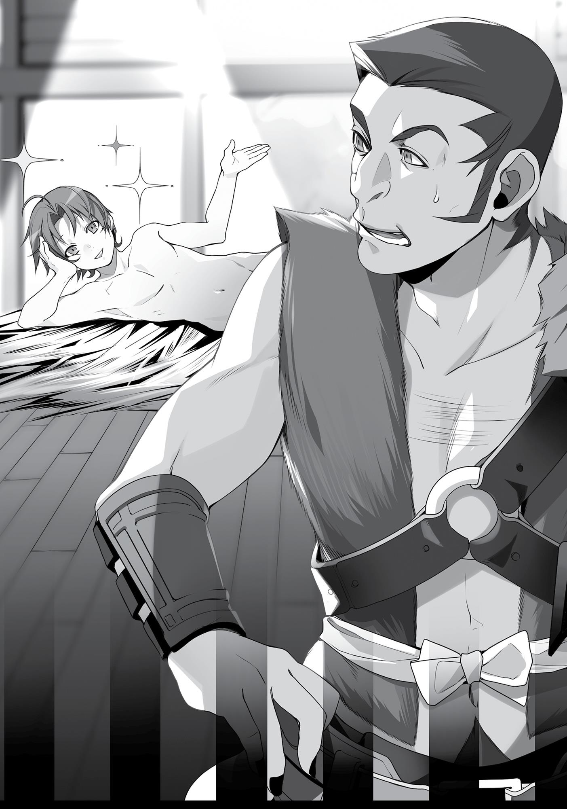

+++
title = "Chapter 7 Free Apartment"
date = 2026-07-20
weight = 6
[extra]
volume = 4
chapter = 7
+++
Hello there. My name’s Rudeus and I used to be a shut-in.
Currently I am checking out a new, free apartment that is the
talk of the town. No security deposit, no key payment, no rent. A oneroom space complete with two meals and spare time for a nap. The
bed is made of bug-infested straw, which is a downside, but the price
is cheap. After all, rent is free!
The toilet is a large jar set in the corner of the room. Once
you’ve done your business and the jar is filled with excrement, you’ll
have to dump it in a hole on the opposite side of the room. There’s no
running water, so it is a little unhygienic, but you can get by with
magic. If you are a magician like me, who can make warm water,
your problems are completely solved!
There are only two meals. For modern-day folk, that might be
too little. Still, this food is quite incredible, a lush land’s regional
specialty of fruits and vegetables. Meat as well. The seasoning is
light, bringing out the natural flavor of the ingredients, which is
enough to make anyone used to life on the Demon Continent smack
their chops in delight.
Now for the apartment’s primary feature: its security. Please,
have a look at these durable iron bars. You can bang on them as
much you like, pull at them as much you like, but they won’t budge
an inch. Their only weakness is that they can be pried open with
magic.
There surely isn’t a thief alive who would look at these bars
and think, hey! I think I want to go in there! Yet inside they will go,
because this free apartment is a jail cell.

Hung over Gyes’ back, I continued my ride through the forest.
Unable to move, I had no choice but to allow myself to be carried
along. As we traveled through the shadows of the woods at
breakneck speed, I saw something in the corner of my eye. There,
between the blur of trees that flew by, was a blob of silver hair
following us.
Still a pup, and yet the dog had quite the stamina. We’d been on
the move for probably two or three hours by then. The beastfolk
warrior known as Gyes had been running for quite a long time. He
only stopped when we finally arrived wherever it was.
“Sacred Beast, please return to the house.”
“Woof!” The ball of silver fur barked once before toddling off
into the darkness.
I surveyed the surroundings by just using my eyes. The trees
were closely clustered and I sensed no other person in the vicinity.
However, I saw lights here and there above us in the trees. Gyes
continued walking for a bit, approaching one of the trees.
With me still slung over his shoulder, he hooked his hands on a
ladder I couldn’t see and swiftly climbed. It seemed I was being taken
into the treetops.
From there we entered a building. No one else was present. It
was a deserted cabin made of wood. That’s where Gyes stripped me
of all my clothes.
What the hell was he doing to me? I couldn’t even move my
body!
He was lifted me up by the scruff of my neck and tossed me
inside…something. A moment later, I heard the creak of iron and a
clang as something fell. Then Gyes was gone, without any
explanation. He didn’t even interrogate me.
After a while, I could move my body again. I produced a small
flame on the tip of my finger and used it to check my surroundings. I

saw the durable bars and realized that this was a cell. I’d been
thrown into a cell.
That was fine. Judging by the conversation they’d had, I knew
this was going to happen. They’d mistaken me for a smuggler. That’s
why I didn’t panic. This misunderstanding would soon be solved. Still,
why the need to strip me? Come to think of it, those children had
been stripped of all their clothes, too.
Maybe that was their custom here. Maybe beastfolk felt
humiliated at being fully exposed. Although feeling embarrassed at
being exposed wasn’t a quality unique to their race. Stripping a
captive to break them down mentally was a practice from time
immemorial. This may have been a fantasy world, but even in my
favorite book here, the female knight was relieved of her clothes
when she was taken prisoner. It seemed all worlds had that in
common.
“Now then…” Wrapped in darkness, I began to think.
For now, I would save speaking with them for tomorrow. Even if
they didn’t believe me, I would still be okay. The older man had
apparently set off after Ruijerd, in which case he should have met up
with the children by now. Ruijerd was an easy person to
misunderstand, but the children would not forsake the warrior that
had come to their aid, surely. The children would return safely, and I
would no longer be mistaken for a smuggler.
The fact that I wasn’t a smuggler, but had a complicated working
relationship with them, was probably better left unsaid. Ruijerd
never wanted to work with the smugglers either, so he wouldn’t say
anything that would get us in trouble. For now, the primary concern
was my own safety. The older warrior said not to lay a hand on me
until his return. That meant I was safe. They probably wouldn’t set
any tentacle monsters on me…right?

Either way, I felt like I finally understood the meaning behind
Gallus’ words. If this was what was going to happen to them, they
surely would have been in a lot of trouble.
An entire day passed as I was busy thinking those things. Time
was fleeting. The morning of the day after I was thrown into this cell,
a guard appeared. It was a woman. She had the build of a warrior,
and yet she was more slender than Ghislaine. Although her chest was
just as huge.
I told her, “I’ve been falsely charged, I didn’t do anything.” I
went on to explain that I wasn’t associated with that smuggling
organization, that I just happened to find out those children were
being held in that building and that, fueled by righteous indignation, I
set about freeing them.
The woman did not hear a word I said. Instead she carried a
bucket of water to my cell and dumped it over my head as I
protested. It was freezing cold, and now I looked like a drowned rat.
The woman then glared at me as if I were nothing more than
garbage.
“Pervert…!”
A shiver ran through me. There I was, naked, with this beautiful
animal-eared older woman ravaging me with her eyes. Not only had
she poured freezing water over me, but she’d also verbally abused
me. This was what it meant to break someone down psychologically.
It seemed they had no intention of following the older warrior’s
command. Just what would happen to me now…? Ahh, God (Roxy),
give unto me your protection! And no, Man-God, I don’t mean you!
“Achoo!”

All joking aside, I really did want some clothes. For now, I would
use the fire spell Burn In Place to keep myself warm so I didn’t catch
a cold.
Day two.
Ruijerd still hadn’t come to rescue me. After being left naked for
two whole days, my anxiety was beginning to rear its ugly head. I
wondered if something happened to Ruijerd. Did he end up fighting
that older warrior? Or did things with Gallus go sour? Or perhaps
something had happened to Eris and he was seeing to that?
I was anxious. Incredibly anxious. That was why I was
constructing an escape plan. Early in the afternoon, once I was done
eating, I started to quietly use my magic. I mixed fire and wind,
creating a warm air current that buffeted the room and made the
entire area nice and toasty. The amply endowed guard grew sleepy
and began to drift off. How easy.
I unlocked the cell door and checked to see that no one else was
around as I slipped out of the building.
“Ooh…”
The sight that spread out before me was like something straight
out of a dream. There was a settlement built above the trees. The
buildings were all set among the treetops, scaffolding around each
tree to give space for walking. There were also bridges that
connected the trees together so you could come and go without
having to climb up and down ladders.
There was really nothing on the ground below. I could see what
looked to be a simple shack and the traces of a field, but they didn’t
seem to be in use. Apparently no one lived there.
There weren’t that many people. I could see a few beastfolk
here and there, bustling about on the scaffolding. If a person walked
across a bridge, then they would be fully exposed to anyone below,

and anyone who moved below would be fully exposed to those
above.
Right now I was, in every sense of the word, fully exposed. It
would be difficult to escape without being seen. Although if I were
caught, I could still run away. If I didn’t think about the
consequences, I could just set fire to a nearby tree and escape into
the forest in the ensuing chaos.
Ah, the forest. I didn’t know my way out there. Gyes had run at
top speed for a long time, so we had to be quite a distance from the
town. Even if I ran with all my might, heading straight as the crow
flies, it would probably take me about six hours. And I was sure I
would get lost on the way.
I could use earth magic to build a tower, giving me a high
vantage point to look out from. That was an option. Of course, if I did
something that attention-catching, Gyes would be on my tail
immediately.
I still didn’t know what was behind that magic he used. If I
couldn’t come up with a way to counter it in a fight, I might lose.
Plus, next time he might cut my legs off so I wouldn’t be able to run.
Perhaps it was better that I wait a little longer for my circumstances
to change.
It had just been a couple of days. That older warrior hadn’t
returned yet. Ruijerd might still be searching for those children’s
parents. There was no need to be impatient, I decided, and headed
back into my cell.
Day three.
The food that guard brought was delicious. It was as expected—
the land here was so rich with nature. It was a remarkable difference
from the Demon Continent. The meals consisted of either a wild
grass soup or scraps of grilled meat that were tough to tear into, but

both were delicious. Perhaps it was because I had grown used to the
Demon Continent’s food. If this was the grub they offered someone
in a cell, then no doubt the rest of the settlement was having a feast.
When I complimented the food, the guard flicked her tail and
brought me seconds. Based on her reaction, she was probably the
one who made it. Although she still wouldn’t say a word to me as
usual.
Day four.
I was bored. There was nothing to do. Maybe I could create
something with my magic, but if I did they might gag me or bind my
wrists. Then there really would be nothing I could do. There was no
reason to risk robbing myself of what little freedom I had.
Day five.
I got a roommate today. He was carried in by two beastfolk on
either side. They promptly tossed him inside, sending him tumbling
with a swift kick to the rear.
“Dammit! You should treat me better than that!”
The beastfolk ignored his cries and left.
The man gingerly rubbed at his behind, hissing in pain as he
slowly turned his around. I greeted him in a reclining Buddha pose,
stretched out on my side with my head propped up against my hand.
“Welcome to life’s final destination.” Of course, I was completely
naked.
The man stared at me, gobsmacked. He looked like an
adventurer. His clothes were all black, with leather protectors
fastened at the joints. He was unarmed, of course. He had long
sideburns and a monkey face like Lupin the Third. Calling it a
monkey’s face wasn’t a metaphor, though. He was a demon.

“What’s wrong, newbie? See something amiss?” I asked.
“N-no, not exactly how I’d describe it.” He looked at me in
confusion.
Come on, I’ll get embarrassed if you stare like that, I thought.

“You’re naked, but you act awfully full of yourself.”
“Hey, newbie, better watch your mouth. I’ve been here longer
than you. That means I’m the master of this cell, your elder. Show
some respect,” I commanded.
“Y-yeah.”
“Your answer should be ‘yes, sir’!”
“Yes, sir.”
Why, you ask, was I acting so full of myself in front of someone I
had just met for the first time? Because I was bored, of course.
“Unfortunately there’s no mat for you to sit on, so just sit over
here somewhere.”
“Y-yes, sir.”
“Now then, newbie. Why were you thrown in here?” I tried to
sound tough as I asked.
I expected that my impertinence despite being younger might
infuriate him, but he just answered back with a dumbfounded look
on his face, “They caught me trying to swindle them.”
“Oho, gambling, is it? Restricted Rock-Paper-Scissors? Steel
Frame Crossing?”
“What the hell is that? No, dice.”
“Dice, huh?” He probably used rigged dice that would only land
on four, five or six. “A boring crime to be taken in for.”
“What about you?” he asked.
“You can tell just by looking, can’t you? Public indecency.”
“What the hell is that?”
“While naked, I put my arms around a silver-colored pup, and
then they threw me in here,” I explained.
“Ah! I heard the rumors. Some sex fiend assaulted the Doldia’s
Sacred Beast!”

Someone out there was sure being cheeky with their words. To
begin with, that was a false accusation. Not that I would gain
anything by claiming as much here.
“Newbie, if you’re a man then you understand, right? The lust
one feels for an adorable creature.”
“No clue.” His eyes changed, and now he looked at me with
suspicion. Well, they hadn’t really changed. His eyes had been like
that from the start.
“So, newbie, what’s your name?”
“Geese,” he answered.
“You a military man? Eaten more meals as a soldier than there
are stars in the sky?”
“Military man? No, I’m just an adventurer, I guess. Been one for
a while.”
Geese. Let’s see, I felt like I’d heard that name before. But
where? I couldn’t remember. It seemed like there were a lot of
people with that name, so he probably wasn’t the Geese I knew.
“I’m Rudeus. I’m younger than you, but here, I’m your boss.”
“Yeah, yeah.” Geese shrugged his shoulders, flopped over where
he stood and propped his head up. “Hm? Rudeus… I’ve heard that
name before.”
“I’m sure lots of people have that name.”
“Eh, probably right.”
Now we were both doing the reclining Buddha pose as we faced
each other, although one of us was naked. Wasn’t that a bit strange,
though? Why was I, the greatest person occupying this cell, naked
while the newbie still had his clothes on? Strange. Very strange
indeed.
“Hey, newbie.”

“What is it, boss?” he asked.
“That vest of yours looks warm. Hand it over.”
“Wha…?” Geese looked displeased as he said, “Fine, here,” and
peeled the vest off before tossing it at me. Maybe he was actually
good at looking out for people, contrary to my initial impression.
“Ah, thank you so very much,” I said, sounding ever so polite.
“So you can show gratitude,” he observed.
“Of course. I’ve been rocking it freestyle for days now. For the
first time in a while I feel like a person again.”
“Boss, you don’t have to talk so fancy.”
Thus I achieved the appearance of a snot-nosed brat straight out
of the Edo period.
Our guard watched us with a sullen look on her face, but she
didn’t say anything.
“Now I can feel your warmth radiating from this vest.”
“Hey, don’t tell me you’re into men, too?” Geese asked.
“Of course not,” I replied. “Women from twelve to forty years of
age have caught my eye, but I’ve got no interest in men unless they
look like women, too.”
“So you’re fine with it if they look like a woman…” Geese stared
at me with disbelief. But if he met a woman who was his type, one
who extracted his Excalibur like Arthur, then he’d become a Merlin
too. In the sexual sense, of course.
“By the way, newbie, there’s something I want to ask you.”
“What is it?”
“Where is this place?” I asked.
“A cell in the Doldia’s village in the Great Forest.”
“And who am I?”

“Rudeus. The naked pervert who put his hands on a pup,” he
answered.
Aha! But I wasn’t naked anymore! Also, that was a false charge. I
wasn’t a pervert.
“And what is a demon like you doing in the Doldia’s village,
gambling your life away?”
Geese explained. “Ahh, well, one of my acquaintances from a
long time ago was a Doldia, so I came on the off chance I might meet
her.”
“Did you?”
“I did not,” he said.
“So even though they weren’t here, you gambled? Swindled?” I
pressed on.
“Didn’t think I’d get caught.”
This guy was hopeless. But maybe he wasn’t useless.
“Newbie. What else can you do besides swindle?”
“I can do anything,” he said.
“Oho, like you can make a dragon with your bare hand and
knock someone down with it?”
“No, that’s impossible,” he replied. “I suck at fighting.”
“Could you take on like one hundred women at once then?” I
asked.
“One is plenty, two at the most.”
For my last question, I lowered my voice enough so that the
guard wouldn’t be able to hear us and said, “Could you make it to
the city if you got out of here?”
He lifted himself upright, glanced quickly at the guard, and then
scratched his head. He brought his face closer to mine and spoke in a
hushed whisper. “Are you trying to run away?”

“My companion isn’t coming, so yes.”
“Ahh, yeah, that’s… Well, that sucks.”
Hey you, knock it off, I thought. If you put it like that, you make
it sound like my friends have abandoned me.
Ruijerd would never leave me behind like that. I was sure that
he was looking everywhere for those kids’ parents right now. That, or
something had occurred and he was in trouble. Maybe he was
waiting for my help.
“Run off on your own then. It’s got nothin’ to do with me,”
Geese said.
I explained, “I don’t know the way to the nearest town from
here.”
“Then how did you get here?”
“I saved some kids who were kidnapped by smugglers,” I told
him.
“Saved them?”
“And while we were there I took off this collar that had been put
on that pup, and when I did this beastperson suddenly appeared and
shouted at me. Then I couldn’t move anymore and they brought me
here.”
Bewildered, Geese scratched at his head again. Perhaps I hadn’t
explained it well enough. “Ahh, so that’s what happened. You were
falsely accused?”
“Exactly.”
“I see. Yeah, then of course you’d wanna run.”
“So that’s why I’d like you to lend me a hand,” I said.
“Don’t wanna,” he replied. “Run off by yourself if you want to so
bad.”

He could say that all he liked, but it still didn’t help me find the
way. It would be no laughing matter if I got myself lost in the woods
on my way to go help Ruijerd.
“But if it’s really a false charge you should be fine. They’ll
understand.”
“I hope you’re right,” I said.
From my point of view, Gyes wasn’t the kind who listened to
people. Although it was the truth that I had helped those kids
escape. If they came back, then the false charge against me would be
dropped.
“Then I guess I better wait a little longer.”
“Yeah, you should,” he agreed. “Running away doesn’t solve
anything.” Geese flopped back onto his side.
I decided to wait like he suggested. Fortunately, I still had
options left. If it came to it, I could engulf this whole area in a sea of
flames and escape. I felt bad for the Doldia tribe, but they were the
ones who had arrested me on false charges after all, so we were
even.
Even so, Ruijerd sure was taking his sweet time. I assumed it
was just taking that long for him to find the children’s parents, but
still, this was too much.
Day six.
This apartment was truly comfortable to live in. Food was
provided for us. It was equipped with good air conditioning (albeit
man-made), and while at first I thought it was boring because there
was nothing to do, now I had a conversation partner.
The bed had been infested with bugs, but thanks to the warm
air I created with my magic, they’d all been eradicated. The toilet

was in its usual sad state, but it was kind of titillating to think of that
pretty, older animal-eared woman cleaning up after me.
Still, I felt anxious about the fact that I was getting no news. It
had been nearly a week since I was brought here. Wasn’t Ruijerd
really overdue? Wasn’t it normal to assume that something must
have happened? Some kind of trouble that Ruijerd couldn’t handle
on his own?
I had no idea what help I would be if I went. Perhaps it would
already be too late. Even so, I needed to go. Tomorrow. No, the day
after tomorrow. I would wait until the day after tomorrow.
Once that day came, I would reduce this village to a flaming
field. Or not, because I would feel bad about doing that. Instead, I
would take the guard as my captive and run.
Day seven.
This was my last day living in this cell. In the depths of my mind I
was carefully crafting a plan, while outwardly I just sluggishly ate and
slept. I couldn’t keep this up—the shut-in mentality from my
previous life would make its reappearance. Tomorrow, I would need
to psyche myself up.
“Yo, newbie…” I called out to Geese in my usual thug style as I
settled down on the ground.
“What?”
“Is this the only cell in the village?”
“Why are you asking that?” he replied.
“Well, it’s just that they don’t normally throw two people in the
same cell for no reason, right?” I reasoned.
“They don’t normally use this cell. Criminals are usually shipped
off to Zant Port.”

Shipped off to Zant Port, huh? So the Doldia Tribe only threw
special criminals into this cell, then? I was mistaken for a smuggler
and also falsely accused of attempted bestiality on their Sacred
Beast. It must have been really important to the village to have such
a special title. That made me an even more extraordinary criminal.
But wait.
“Then why were you put in here? You were arrested for
swindling, right?”
“Don’t ask me. Probably because it happened in the village and
it was no big deal, right?”
“So that’s the reason why?”
“That’s the reason why,” he answered.
Something felt a little off to me. I scratched at my side, then
scratched at my stomach. While I was at it, I scratched at my back.
For some reason, I was itchy. As soon as I realized that, I looked
down and saw something hopping. A single flea, leaping.
“Gaaah! This vest, it’s got bugs coming out of it!”
“Hm? Oh yeah, I haven’t washed it in a while,” Geese said.
“Then wash it!” I peeled it off and flung it away. It flapped as it
flew, sending bugs scattering onto the floor. I immediately
exterminated them all with the heat of my air magic. Darn pests…!
“Hey, I’ve been watching you do that for a bit now. Sure is
amazing. Just how do you do it, though?”
“Voiceless casting, using magic without an incantation,” I
explained.
“…Huh. Without an incantation. That really is incredible.”
Yeah, and now that I was thinking about how those insects had
been swarming inside that vest, my entire body suddenly felt
extremely itchy. I would have to heal each bite one by one. Perhaps
it was because I wore nothing under the vest, but my back seemed to

have a ridiculous amount of bites. That’s right, my back. Right where
my hand couldn’t reach. Gaah!
“Yo, newbie.”
“What?”
“Come over here and scratch my back,” I commanded. “It itches
like hell.”
“Yeah, yeah.”
I sat with my legs crossed and Geese came up from behind me.
He began scratching away.
“Yeah, there, right there. Oh yeah, you’re really good at this.”
“I told you, right?” he said. “I can do anything. If you want, I can
massage your shoulders for you, too.” As Geese said that, he moved
his hands to my shoulders. Dang. He really was good at this.
I instinctively straightened my back. “Ooh, you’re really good.
That feels great. Ahh, next time go a little lower. Mm, yeah, right
there…hm?”
Just then I realized something was very off. But what?
Something was different from the usual. “Hey, newbie…”
“What now? Want me to go lower? You want me to scratch your
ass, too?”
“No, don’t you feel like something’s weird?”
“Yeah, boss, you’re weird in the head,” he answered.
“Aside from that!” I snapped. How rude.
“Well, yeah…that guard lady hasn’t come in.”
Yes, exactly. Normally this would be time for our noon meal. A
time when we would eat our delicious, delicious food before putting
our hands together in thanks. But we had no clock, so it was possible
that I was just getting the time wrong. But my aching belly seemed to
think it was lunchtime.

“Also, it sounds like it’s pretty noisy outside.”
“Really?” I listened carefully and sure enough, I heard fighting in
the distance. But it also felt like it could just be my imagination.
“Also it’s a little hot.”
“Now that you mention it, it’s true, today is awfully hot,” I
realized.
“Also, isn’t it a bit smoky in here?”
“Now that you mention it…”
He was right. A thin veil of gray smoke had filtered in. The
smoke was spilling in from the skylight and the front entrance.
“Newbie, lend me your shoulder.”
“Guess I got no choice. Here you go.”
Geese lifted me up onto his shoulders, and from the slightly
higher vantage of the skylight window, I peered outside.
The forest was burning.
