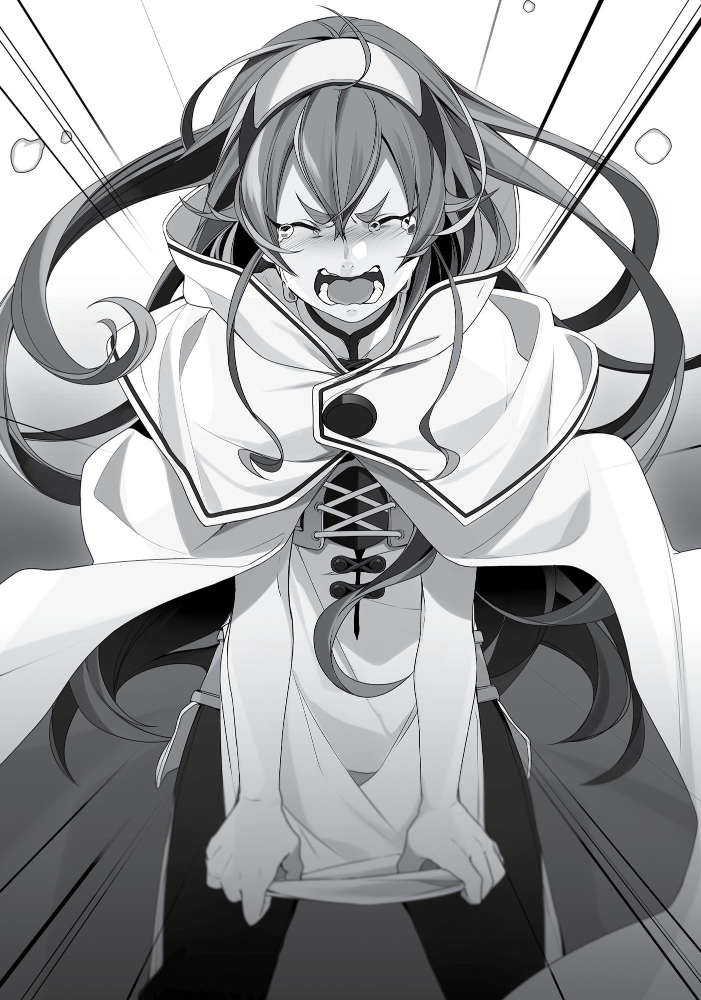

+++
title = "Chapter 9 Slow Life In The Doldia Village"
date = 2026-07-20
weight = 8
[extra]
volume = 4
chapter = 9
+++
We were welcomed into the Doldia village as heroes for
saving the children and protecting the village against Gallus’ attack.
They wanted us to spend the rainy season living with them.
Gyes also officially apologized to me for ignoring orders,
stripping me naked, and throwing me into a cell. And also for the
freezing cold water that was thrown on me. It turned out that the
beastfolk’s unique way of kowtowing was lying face up with your
stomach exposed. At first I thought he was making fun of me, but
everyone present was dead serious about it. The only thing in my
mind was jealousy as I stared at his hairy, muscular six-pack, so I just
hurriedly accepted the apology.
Eris, however, did not. She was pissed when she learned what I
had gone through and delivered a Boreas Punch to Gyes’ exposed
belly before pouring water over his head. Once he looked like a
drowned rat, she glared down at him and said, “Now we’re even.”
Eris never failed to impress me.
***
At the moment, we were in Gustav’s house. It was the largest in
the village, sitting well above the ground amongst the trees. Three
stories tall and constructed of wood, it looked like it would collapse
instantly in an earthquake, yet it was sturdy enough that an adult
running around inside would cause not a single tremor.
There were eight of us here: Eris, Ruijerd and myself, as well as
the Doldia tribal leader Gustav and his son Gyes, the leader of the
warriors. One of the girls I’d rescued from the smugglers, Gyes’
middle daughter, Minitona, was also present. His oldest daughter,

Linia, was apparently off studying in a different country. And then
there was another girl we had rescued who was of the Adoldia tribe:
the Adoldia tribal leader’s middle daughter, Tersena. She was a dogeared girl who was quite well-developed for her age. She had been
planning to return home, but that was disrupted when the rainy
season began, and she would be spending the next three months
here.
The girls were talking animatedly, with woofs and mews, about
how they had almost been kidnapped. “I’m so glad I didn’t get
abducted. I heard there’s a sick, twisted noble family in Asura that’s
only sexually interested in beastfolk. Who knows what would have
happened to me.”
Gallus also talked about how a certain noble family paid
especially well for beastfolk with Doldia blood. Those who were easy
to train, it seemed, sold for the highest prices.
“There’s no place among Asuran nobles for that kind of scum!”
And there was Eris, talking as if this conversation had nothing to do
with her or her family, even though it was really likely that said noble
family had a certain rodent-ish name. One that started with the
letter G.
I never asked where the maids in Eris’ household came from,
but perhaps some of them had been kidnapped. Eris’ grandfather,
Sauros, was a good man, but his worldview had odd aspects to it.
Well, I would keep my mouth shut. Some things were better left
unsaid.
Eris seemed to remember something because she suddenly
showed them the ring on her finger. “By the way, do you know
Ghislaine? This ring here belongs to her.” Eris didn’t know the Beast
God tongue, so she spoke to them in them in the human tongue. Of
those present, the only ones who could understand the language
other than Ruijerd and myself were Gustav and Gyes.

“Ghislaine…?” Gyes’ face puckered. “She’s…still alive?”
“Huh?”
His voice filled with disgust. He spat out the words as if they left
a bitter taste on his tongue. “She’s a stain on our tribe.”
That was only the beginning of Gyes bashing on Ghislaine. He
spoke in the tongue of men so Eris could understand. His voice was
full of emotion unfit for an older brother speaking of his younger
sister, as he went on and on about what a mistake Ghislaine was as a
person.
It was difficult for me to listen to it all, given that Ghislaine had
once saved my life. It seemed she had done some truly despicable
things in the village, but still, this all happened when she was a child.
The Ghislaine I knew was clumsy, but hardworking. She’d changed,
readjusted herself as a person. She didn’t deserve to be spoken of
like this. She was a highly respectable sword instructor as well as an
accomplished apprentice of magic.
So, I thought, how should I put this nicely…? Knock it off.
“That ring too, that was something our mother gave her so
she’d stop going berserk without reason. Not that it ever did any
good. She was just a destructive good-for-nothing.”
“You—” I started to say.
“Oh, shut up! What do you even know about Ghislaine?!” Eris
cut me off, bellowing in a voice loud enough to split the house in
two. The others were left dumbfounded by her outburst. After all,
only Gyes and Gustav could understand the language.
I was afraid Eris might turn violent. But instead she looked
frustrated, tears welling in her eyes. She balled her hands into
trembling fists, but she didn’t swing them.
“Ghislaine is amazing! Amazingly amazing! If you call for help,
she’ll come immediately! She’s super fast! And super strong!” Words

that Eris probably wasn’t even thinking about spilled from her
mouth. Even though the others didn’t understand what she was
saying, the sorrow in her voice conveyed the meaning well enough.
And she was also expressing my emotions.
“Ghislaine is…hic…guh…not someone you can just…hic…” Eris
tried her best to not punch anyone, even through her tears.

That’s right, she couldn’t punch Gyes here. Ghislaine had been
violent during her time in this village. If Eris swung a fist here, Gyes
could just say, “See? They’re two peas in a pod.”
When I looked over at Gyes, he seemed confused. “No, I can’t…
This is unbelievable. Ghislaine…is respected? This can’t…”
Seeing that, I tamped my anger down. “Let’s stop this
conversation here,” I suggested, putting my arms around Eris’
shoulders.
Eris looked at me in disbelief. “Why… Rudeus, do you…hate
Ghislaine?”
“No, I like Ghislaine too. The person we know and the person
they know may share the same name, but she’s a different person.” I
looked at Gyes. Even he would reconsider his stance if he met
Ghislaine now. Time changed people. I knew that first-hand.
“…Fine.” Eris didn’t seem satisfied, but at least she seemed
relieved by what I said.
“Wait, is she—is Ghislaine really such an incredible person
now?”
“I respect her, at the very least.”
My words drove Gyes into deep contemplation. Considering
what we’d heard him say, there must have been a lot that happened
between him and Ghislaine. He boiled with anger at the mere
mention of her. Being related by blood made it worse.
“So, could you apologize to us?”
“…My apologies.”
The atmosphere became a bit uneasy after that. Perhaps
because it was the second time we’d forced Gyes to apologize to us
that day.
As for Ghislaine, I’d completely forgotten about her this past
year, but she’d probably been displaced during the incident as well. I

wondered where she was and what she was doing. Knowing her, I
figured she was probably searching for Eris and me. It was frustrating
that we were unable to gather any information during our time in
Zant Port.
***
One week passed. Rain continued falling the entire time. We
were given an empty house in the village and spent our time there.
We were given food regardless of whether or not we contributed
anything since we were considered heroes of the Great Forest, even
though the village was in dire straits after the damage from the fire.
The land was flooded, and chaos erupted when a child fell into
the water. People were quite shocked but grateful when I used my
magic to save them. I thought perhaps I should use my magic to blow
away the rainclouds, but I gave up on that thought quickly. Roxy said
it herself: Manipulating the weather wasn’t a good idea. If I forced
the rain to stop, something awful might happen to the woods.
To be honest, I just wanted it to hurry up and stop so we could
move on. But then again, it was supposed to stop after three
months. I just had to bear with it until then.
It was raining when I decided to take a stroll through the village.
Given that it was just a village, there was no weaponsmith, armorer
or inn of any type. For the most part it was private housing and
storehouses, or guardhouses for their warriors. All of this was built
above the trees.
This village was the real thing, in 3-D! Truly fascinating. My heart
thrummed in excitement just walking around. There was one spot
where you weren’t allowed to proceed any further. Apparently there
was a special place beyond that point. I had no intentions of
intruding upon it.

During my walk, I came upon a pathway that intersected on two
levels. I waited on the lower one hoping that a girl might pass by
above me, but it was Geese who crossed it.
“Yo, newbie! So you got out too, eh?”
He looked happy and waved at me. He’d also received amnesty
for his contributions when the village was in trouble. “Yup. ‘Never do
it again,’ they said. Morons, all of them. Of course I’m going to do it
again.”
“Hey everyone! Did you hear that? This guy hasn’t learned his
lesson!”
“Hey now! Come on, knock it off. I can’t run off right now, not
until the rainy season is over.”
In other words, he was planning to repeat his mistake. Honestly,
what a hopeless case. “Also, allow me to return your vest.”
“I told you to knock off that polite crap. Just take the vest,” he
said.
“Are you sure?”
“It’s still cold out during this season.”
Still, he didn’t seem like a totally bad guy at least. The way he
was kind and yet noncommittal reminded me of Paul. Paul… I
wondered if he was doing well.
***
Two weeks passed, and the rain wasn’t stopping.
I learned that the Doldia had their own secret magic. It allowed
them to find enemies by using a far-reaching howl, and with their
special voices, they could make opponents lose their sense of
balance. The way Gyes paralyzed me with his voice was one of those

types of magic. From what I heard, it seemed to be a magic that
manipulated sound.
When I told Gustav “I’d love for you to teach me,” he heartily
agreed. Unfortunately, no matter how many times he demonstrated
it for me, I couldn’t imitate it perfectly. It seemed the magic
depended on the unique vocal cords of the Doldia.
Of course it does, I thought bitterly to myself. In all likelihood I
couldn’t use most of the unique magic that individual tribes
possessed. It seemed unfair that beastfolk and other races could use
human magic so easily. I knew the key element was to channel mana
into my voice, but no matter how I did it, the result was always
subpar. The best I could do was make my opponent flinch for a
moment. It seemed I would be no Wagan, after all.
On that note, Gustav was quite shocked at how I used magic
without chanting. “Do the magic schools these days teach that, too?”
“It’s because my master taught me so well,” I explained, praising
Roxy for no apparent reason.
“Oh? And where’s your master from?”
“The Migurd tribe, from the Demon Continent’s Biegoya Region.
Her magic… I think she learned from the Academy of Magic?”
When I told Gustav that I also planned to go to the Academy of
Magic, he seemed impressed and said, “Wow, you’re already at that
level and yet you’re still motivated to improve?” That made me feel
good.
***
Three weeks passed.
Monsters appeared in this village as well. One was a water
strider, surfing swiftly across the water below only to leap up

suddenly and attack. Another was like a water snake which slid its
way up along the trees. The village was guarded by its band of
warrior beastfolk, but their impressive noses and sonar-like voices
were no use in the rain, so often monsters would slip by their
watchful gaze and infest the village.
As Eris and I were walking around, one of the beastfolk children
nearly got snatched up by a chameleon-like reptile right before us. I
promptly shot it down with my stone cannon, and the child adorably
wagged their tail and thanked me.
I was strangely popular among the children in this village, no
doubt because I was the hero who saved them in their time of need.
Occasionally they would come up to me and lick me on the cheek or
show me the collection of acorns they’d gathered before the rainy
season hit. I was practically a celebrity.
Eris, in a true display of her family’s infamy, couldn’t contain her
excitement when she saw such a huge gathering of so many adorable
children with ears and tails. She annoyed the children by breathing
erratically as she patted their heads and touched their tails.
We couldn’t just stand by while such adorable creatures were
attacked by monsters. That was why I proposed that Ruijerd help
with the village’s defenses, but he opposed the idea.
“The warriors here take pride in their role in the village,” he
said. Protecting this village was their duty. As long as they didn’t
request the aid of an outsider, it wasn’t our business to intrude. That
was Ruijerd’s belief, anyway. I didn’t understand it at all.
“But isn’t the children’s safety more important than that?”
Ruijerd paused and thought for a few seconds before turning to
Gyes for his input.
Gyes welcomed the idea. “Oh, Master Ruijerd, you’re going to
lend us your assistance? That would be a big help!” The kidnapping
incident had dramatically decreased the number of their warriors. So

Gyes offered to compensate Ruijerd for his assistance on behalf of
the warrior band.
That was how all the monsters in the village were exterminated.
Ruijerd would find them and I would use my magic to defeat them.
We would retrieve their bodies, strip them of useful materials and
sell them to Gyes. It was a beneficial cycle.
Ruijerd was right about one thing. The village’s warriors
disapproved of us at first. It wasn’t until we mercilessly annihilated
any monster that entered the village and they realized the rainy
season would pass without any casualties that they finally broke into
smiles.
“I thought their tribe had more pride than this. It’s disgraceful,
entrusting the protection of their village to another race.” Ruijerd
was the only one bothered by this. It seemed the beastfolk of several
hundred years ago were quite different from their modern
counterparts.
***
One month passed.
The strength of the downpour seemed to be waning, but that
was probably just my imagination. Eris, Minitona, and Tersena were
becoming fast friends. They seemed to enjoy traveling around
together despite the rain. I wondered what they were doing.
It turns out Eris was teaching them the Human tongue. Yes, you
heard me. Eris was teaching other people a language! This wasn’t the
time or place for me to barge in and try to help her; I’d only destroy
her image. I was a man who could read the room, after all.
This was the first time Eris had friends her own age. It made me
proud seeing her getting along so well with the girls. The red hair,

the cat ears, and the dog ears… Seeing them all happily romping
around was more than enough for me.
Although Eris should be careful about thoughtlessly wrapping
her arms around them like that. They might misunderstand her
intentions, just like they did with me. In fact, Mister Gyes was
watching. How would he feel as a parent, seeing Eris with her nostrils
flared, throwing her arms around his daughter?
“Ah, Lady Eris, I appreciate you getting along so well with my
daughter.”
What the—? This was a totally different reaction from the one
he gave me! He should’ve been able to smell the arousal radiating off
of Eris right now, so why didn’t he? That was just the difference
between men and women, I guessed. Yeah, that had to be it. Of
course it was.
“By the way, I am very sorry about the matter with Ghislaine.
We haven’t seen one another in a very long time, so perhaps I’ve
misunderstood her. It seems my younger sister has grown a bit
during her time in the world.” He bowed his head. It seemed he’d
come to terms with that in the past month. That was good.
“Of course she has. She’s Sword King Ghislaine! And you know
what else? Ghislaine can use magic now, too,” Eris boasted.
“Hahaha, Ghislaine using magic? Lady Eris, your jokes are very
clever.”
“Seriously,” Eris insisted. “Rudeus taught her reading,
arithmetic, and magic.”
“Lord Rudeus did…?”
After that, Eris began fiercely boasting about Ghislaine and me.
She talked about my lessons back in the Fittoa Region. She started
with how poorly she and Ghislaine had been at learning, and how
much she respected me for sticking with both of them and teaching
them all the way till the end. I felt embarrassed listening to it.

Gyes said how impressed he was again and again, and when the
three finally parted, he came over to the wooden box I had hidden in
to eavesdrop. “So tell me, what’s a respectable teacher doing in a
place like this?”
“O-observing people is a hobby of mine,” I stammered.
“Ah, yes, that seems like a very noble hobby to have. By the
way, how did you teach Ghislaine how to read?”
“Nothing special, really. I just did it the normal way.”
“The normal way…? I can’t picture it,” Gyes said.
“When she was an adventurer, she went through a lot of
hardship because she wasn’t educated. It makes sense that you
wouldn’t be able to picture it.”
“So that’s the story. When she was little, my sister was never
happy unless she could hit someone when something happened that
she didn’t like.”
Judging from what he was saying, Ghislaine sounded like she
was just like Eris when she was a young girl. Specifically, the parts
where she would pick fights with people and that, because she was
strong, few could stop her. Gyes must have gotten himself burned by
that fire numerous times. He wasn’t a very good older brother if he
was that much weaker than his little sister.
Speaking of older brothers, I was one too. I wondered if Norn
and Aisha were doing well. I’d been wanting to write a letter to
them, but I kept forgetting. Once the rain stopped, we would head
for the capital of the Holy Country of Millis, and there I would send a
letter to Buena Village. If I had sent one from the Demon Continent it
probably wouldn’t have made it, but surely it would have no trouble
if I sent it from Millis.
“By the way, Master Rudeus.”
“Yes?”

“Just how long do you plan to stay inside that wooden box?”
Until they came in here to get changed, of course. It was almost
nighttime, after all. Right now they were going to go play in the
water, but then they would have to change into their nightclothes
afterward.
“Sniff, sniff… I can smell the sexual arousal on you.”
“Whaat?! No way; that’s absurd. Perhaps somewhere there’s a
certain beastfolk-loving girl looking ecstatic now that she’s relieved
herself?”
As I tried to play dumb, Gyes’ eyebrow twitched. “Master
Rudeus. I am grateful for what you did before. I am also apologetic,
even now, for having misunderstood you.” His tone took a sudden
shift. “But if you put your hand on my daughter, it’ll be a completely
different story. If you don’t get out of that box right now, I’m going
to throw it into the floodwaters.”
He was serious. I didn’t hesitate. I leaped out of that box in a
flash, at the same speed of one of those Tomy Pop-up Pirates.
“I’m a protector of this village. I don’t want to have to say this to
you but…restrain yourself a little.”
“Yes, sir.”
Yeah, well, I did get a little too carried away. That I would admit.
***
A month and a half passed.
Ruijerd and Gustav got along like a house on fire. Ruijerd paid
frequent visits to the Dedoldia house, and the two drank together
and swapped tales of their pasts. The stories were packed with gore,
but they were actually pretty interesting to listen to. Almost like

listening to an ex-biker gang member exaggerate about what a
badass he was in his younger days. Except the things Ruijerd and
Gustav said probably did actually happen.
Thanks to those conversations, I got a better understanding of
the beastfolk. “Beastfolk” was a generic term for the tribes that lived
in the Great Forest. There were many that originated here but
crossed over to the Demon Continent and came to be referred to as
demons. An outward characteristic of these tribes was that one part
of their body retained an animal-like appearance. Each tribe also had
one of five senses enhanced. In a broad sense, Nokopara and Blaze
were also once a part of the beastfolk.
The Doldia were particularly special among the tribes of
beastfolk. Only one tribe maintained the peace of the forest while
also protecting the Sacred Beast. That was the Doldia.
Then there were the cat-like Dedoldia and the dog-like Adoldia.
Those were the two primary families that were divided into a dozen
branch families. In other words, the royalty of the Great Forest.
Although they weren’t doing much to deserve the title, they were
the ones who would lead when the necessity arose.
There were also elves and halflings living in the Great Forest.
They were concentrated in the northern part of the forest, so they
didn’t have much contact with the beastfolk. However, all the tribes
would gather for a meeting once a year, and they would participate
in a festival near the Great Sacred Tree. According to Gustav, while
their tribes had differences, they all lived as friends in the Great
Forest.
As for the dwarves, they lived not in the Great Forest but farther
south, at the foot of the Blue Wyrm Mountains. The blue dragons
flew across the world and only returned to the mountain range to
nest when they were laying eggs or raising their young, like

migratory birds. Unlike migratory birds, however, they only returned
once every ten years.
Since time immemorial, men and beastfolk had cycled through
war and friendship with one another. One war, which was really
more of a small competition, took place just fifty years ago. Gustav
regaled us with stories of his involvement, and how the beastfolk’s
strongest band of warriors mowed down a group of human soldiers
that had wandered into the forest. It was quite overdramatized, but
hearing the way things played out from the beastfolk’s point of view
was quite fresh and entertaining.
To counter this, Ruijerd whipped out his trump card, the story
about the Superd Clan during Laplace’s War. The two traded banter
as if they were competing, but given that they were both old men, it
more or less turned into a sermon about the good old days.
“Warriors these days are a complete disgrace.”
“I understand what you mean completely, Master Ruijerd. Many
of them are feeble and weak.”
“Exactly,” Ruijerd said. “Men in my youth were tough and
strong.”
Literally kindred spirits. This might have been a different world
from my first, but the camaraderie of old men sure was the same.
“You’re precisely right. Gyes may lead the warriors now, but he
lacks judgment. He’s good at leading people, but if he could assess
situations better, then Master Rudeus wouldn’t have gone through
all of that,” Gustav said.
Ruijerd disagreed. “No, Rudeus is a warrior. He should have
understood that if he let his guard down in enemy territory, he ran
the risk of being caught and held as a captive. Yet he still let his guard
down. If he’d taken things seriously, he would have been able to best
someone like Gyes. That was his own failure.”

Ouch. As true as it was, that hurt. Ruijerd had faith in me, which
was why he allowed me to go alone. Yet I was caught so easily. In a
way, I’d betrayed his trust.
“But Master Ruijerd, isn’t that a bit heartless? Your comrade
had something terrible happen to him.”
“As a warrior, you must take responsibility for your own battles.
Besides, Rudeus could have escaped on his own at any point. I
appreciate that he trusts me as his companion, but he’s not a child. A
warrior doesn’t force their comrades into a difficult position by
allowing themselves to get caught!”
Boy, Ruijerd, you sure are hammered, I thought. Maybe you
could escape on your own if you got caught, but try not to expect too
much out of me. My powers aren’t limitless, okay?
***
Two months passed.
Whenever I was in my room, the Sacred Beast would come
plodding in. The beast lived deeper in the village alongside the
flowers and the butterflies, but once a day during its walk time it
would roam about the village freely. Its favorite (and current) route
was wherever I was.
“Well, if it isn’t the Sacred Beast. What business do you have
here with a sex fiend like me?”
“Ruff!”
“Life’s ruff, huh?”
“Ruff!”
That wasn’t much of an answer.

I wasn’t sure whether the Sacred Beast was male or female, but
either way it settled down beside me. At the moment I was holding
the beginnings of a figurine in my hands. It looked like it would be
some time before the rain stopped, so I decided to try making one.
It was modeled after Ruijerd. You might be wondering why I
picked him, but just think about it. The Superd were faceless
boogeymen. People trembled with fear when they saw green hair,
but there was no color on the figure I made. It was just a completely
ash-gray stone figure. Perhaps if it was impressive enough, people
might become more accepting of him.
First was the silhouette. The hair would come last.
“Woof.” The Sacred Beast pressed its body against my thigh and
rested its head atop my knee. I was puzzled, given that I’d never had
an animal come up to me like this before.
“Arf?” It looked at my hands as if to ask what I was doing. The
pup was quite calm despite its young age.
I finally settled on stroking its neck. “I don’t have anything else
to do, so I’m creating something.”
“Woof.” The beast licked my hand and wagged its tail. Clearly it
didn’t hate me. It was still raining outside, so it probably didn’t have
anything else to do, either. It was probably yearning for some
excitement.
“Want to play?”
“Woof!”
So the two of us grappled and roughhoused. I got to enjoy its
soft fluffy fur, and the Sacred Beast received a moderate amount of
exercise. Truly a win-win situation.
Knock, knock. Someone was rapping on the door as we were in
the midst of playing.
“Hm? Come on in.”

“Pardon me.” A woman in warrior’s dress came in. It was
Laklana. She was one of those in charge of the Sacred Beast, and she
would come retrieve it when its walk time was near an end.
“Nice to see you again.”
“You as well, Master Rudeus. Also, about that time before…”
Every time she saw me, Laklana would apologize for the time when
she threw freezing cold water on me. The first apology had been
more than enough. “That aside, could you please stop being so
attached to the Sacred Beast?”
“What are you talking about? I’m just having fun playing with
it.”
What, was this another false accusation? She really didn’t feel
sorry about anything, did she? If she wasn’t careful with her words,
next time she would be the one naked in a jail cell and I would be the
one pouring the water.
“But I can smell your arousal.”
“…It’s not for the reason you’re thinking.”
The real reason was because every time she came and bowed
her head, my inner pervert began to whisper, “Hey lady, if you could
solve this with a simple sorry, we wouldn’t need to call the cops, now
would we? If you really want to solve this, you know what you gotta
do, right? Let’s take it to the bedroom together.”
“The Sacred Beast is extremely precious to the Doldia. I’m aware
that you saved it from harm, but developing feelings for it is—”
“Except I don’t have any feelings for it.”
The Sacred Beast was a type of magical beast born once every
few hundred years. It didn’t have a proper name. Since ages long
past, it only appeared when the world faced a crisis, and when it
became an adult it would set out alongside a hero, using its great
power to save the world.

That was how the legend went, anyway. That was why the
Sacred Beast was raised with such immense care, deep within the
Doldia Village, in a restricted area where there stood a great tree
they called the Sacred Tree. So of course it had lived a sheltered life.
They were careful not to expose the pup to the outside world, which
it knew little about. It was still a dog, though, so they allowed it time
for a walk once daily.
It would apparently take another hundred years before the
Sacred Beast reached adulthood. If the stories were true, the world
would meet with calamity then. In the meantime, Laklana was
overseeing the protection of the Sacred Beast. As for the Sacred
Tree, it was located beyond that blocked-off path I had visited
earlier.
“Could it be that…Lord Rudeus is the hero?”
“Woof!” The pup gave a bark.
Laklana’s expression turned to shock. “What?! What are you
saying?”
Hm? What was she talking about?
“Arf!”
“I see then, but—”
“Woof!”
“…I understand.”
Why the heck are you talking to this dog as if you’re having a
normal conversation? I thought. I could hear it barking. That was
definitely not the Beast God tongue. Just how was she understanding
it? Was she using a Bow-Lingual translator?
“The Sacred Beast said that you’re not the one.”
“I figured as much.” Although I wished she’d elaborate.
“But the Sacred Beast is very grateful to you, it seems.”

“Oh? I was left in that cell the whole time, so I figured it forgot
about me.”
“Woof!”
“Regrettable, the Sacred Beast said, but it did ask us to feed you
delicious food. Master Rudeus, you did enjoy the meals we provided
you, yes?”
Indeed. The food at least was very good. I also received seconds
when I asked for them. I did think that was strange for a jail. So the
Sacred Beast had arranged that for me? Using food as a form of
gratitude sounded exactly like something a dog would do.
“Although if you were going to do that, I would have preferred
you release me from my cell, at least.”
“Woof!” (Or apparently, “What’s a cell?”)
“A place where you lock up bad people,” I explained.
“Arf! (‘But I’m also locked up.’)”
We continued for a bit after that, having a conversation with
Laklana as our interpreter. It seemed the Sacred Beast didn’t know
all the details about what happened. That included not being aware
of the smell of arousal that Gyes claimed was coming off me, or why
Gyes had then taken me into custody. It didn’t seem to know much
about the meaning of its kidnapping either, beyond that it was a
terrifying experience. In other words, it was still just a child. It wasn’t
right to demand reparations from a child, so I gave up on that.
“I did get to live more comfortably because of you, so thank
you.” At my gratitude, it wagged its tail and licked my face.
Heh heh, you sure are a cute one, I thought as I stroked its
neck, only to be pushed to the ground. Aah, you can’t! Not where
people can see us…!
“Master Rudeus, this is the Sacred Beast’s way of showing
respect. Could you please try to restrain your affections?”

“You’re misunderstanding, what you’re smelling is my arousal
because of you.”
“Huh?!”
“That was rude of me; disregard that.” Crap, crap. I let my true
feelings slip out.
“Ahem…Sacred Beast, it’s time we returned to the Sacred Tree.”
“Woof!”
The beast obediently turned to leave, just as it was told, and
went without a single complaint.
This became a daily occurrence. But let’s just keep it a secret
between us that a few days later, Laklana got incredibly pissed at me
when I tried to teach the Sacred Beast how to shake.
Just like that, with nothing terribly eventful occurring, three
months passed and the rain stopped.
