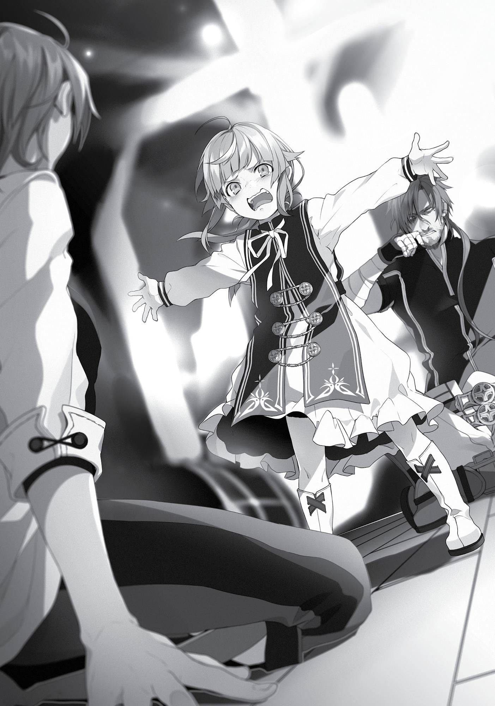

+++
title = "Chapter 3: Family Squabble"
date = 2026-07-20
weight = 2
[extra]
volume = 5
chapter = 3
+++

Paul was staying at a place called The Dawn-Door Inn, but
he led me to the bar next door. There were ten or so round wooden
tables inside, and at the moment, I was seated at one across from my
father.
It was still daytime, but we weren’t the only ones in the bar. In
fact, every seat was taken. The guys I’d knocked out in the
warehouse earlier were sitting around having their injuries tended to
by the group’s healers. It went without saying that the looks they
shot me weren’t too friendly.
Everyone here was apparently a member of Paul’s gang. And the
most attention-grabbing of them all was definitely the woman
warrior sitting diagonally behind Paul.
She had short chestnut hair that curled outward at the ends, a
pouty mouth, and a fairly charming face. But it was her figure and
her outfit that really made her stand out. Her chest was huge, her
waist was thin, and her butt was plump. For some reason, she was
still wearing that bikini armor. I guessed she was in her late teens.
It was the same girl who’d given me so much trouble earlier.
Paul had called her “Vierra.” She definitely had the kind of body I
could see my old man drooling over. I myself found it difficult to look
away when I glanced in her direction…and that absurdly skimpy
clothing certainly didn’t help matters.
“Bikini armor” itself wasn’t so rare in this world. After all, most
injuries could be instantly healed with magic, so there were some
swordswomen who opted for lighter protective equipment,
accepting the fact that they’d get cut up sometimes. I’d met a few
people like that on the Demon Continent, and I had to assume it was
the same for her. But I’d never seen anyone in an outfit this minimal
before. Normally, armor like that was worn over lightweight clothing,

not bare skin. And you’d wear protectors to cover at least some of
your joints. I guess we were just sitting around in a bar right now, so
it would make sense to not bother wearing those. By the same
token, you’d normally wear a coat over that sort of armor when you
weren’t fighting. That was what the ladies on the Demon Continent
did, at least. Although some of the more elderly swordswomen
sometimes didn’t bother…
Wait. Hadn’t she put on an overcoat back at the warehouse
after I cast that spell? Why the heck would she take it off again?
Well, whatever. Might as well enjoy the eye candy while I could.
Mm, yes indeed. Splendid, splendid… Whoops.
I’d accidentally met the girl’s gaze while ogling her. She gave me
a quick wink, so I returned one of my own.
“Hey, Rudy… Rudy?”
At this point, I noticed that Paul was speaking to me, and
regretfully tore my eyes away from the woman warrior. “Hello,
Father. It’s been a while.”
“Yeah. Uh…it’s good to see you’re still alive, kid.”
Paul’s voice was full of exhaustion. The man really had changed
quite a lot. And not for the better, that’s for sure. I’d never seen him
so haggard or disheveled before.
“Well…thanks…”
To be honest, I was having a very hard time making sense of this
situation. What on earth was Paul doing here? This was the Holy
Country of Millis. It was about as far from the Kingdom of Asura as
Mongolia was from Africa. Had he come out here to look for me?
No, that couldn’t be right. He didn’t even know I’d been
teleported to the Demon Continent. There had to be some other
reason. What happened to his job protecting Buena Village?
“So…what are you doing here, Father?”

The question seemed like a reasonable starting point to me, but
Paul reacted with obvious surprise. “What? You did see my message,
right?”
“Your message…?” What was he talking about? I didn’t
remember getting any messages from him.
For some reason, Paul frowned sullenly at my confusion. Had I
managed to upset him somehow? “You mind telling me what you’ve
been doing up until now, Rudy?”
“Uh, mostly trying to survive. It’s kind of a long story…”
I was really hoping Paul would explain the situation first, but
since he’d asked, I decided to tell him the story of my road to
Millishion. I began with my teleportation to the Demon Continent
with Eris, describing how we’d been rescued by a demon, became
adventurers, and spent a solid year traveling all the way to Wind
Port.
In retrospect, it had been a pretty fun journey. We got off to a
rough start, true, but by the sixth month or so we’d gotten used to
the adventurer life. I gradually started to enjoy telling my own story.
My descriptions of events grew more eloquent, and I began to
describe various episodes in increasingly dramatic ways. It was all
non-fiction, but I found ways to weave everything into one big,
spectacular tale.
For starters, I split our adventure on the Demon Continent into
three clear parts:
Chapter One: I meet my dear friend Ruijerd, and we make a
name for ourselves in the city of Rikarisu.
Chapter Two: Vowing to help Ruijerd in his quest and right
various wrongs, the great magician Rudeus sets out on a great
journey.
Chapter Three: I fall into a cowardly beastfolk trap, and find
myself a helpless captive in their village.

There might been a few slight exaggerations thrown in here and
there, but I kept the narrative rolling smoothly. After a while I was
enjoying myself so much that I started waving my hands around and
adding dramatic sound effects to the action scenes.
Also, I opted to leave out the whole affair with the Man-God.
“And then, as we finally arrived at Wind Port, the first thing that
met our eyes…” Just as I was wrapping up Chapter Two of my
“Chronicles of a Rambling Journey Across the Demon Continent,” I
abruptly fell silent. For some reason, Paul’s mood had taken a turn
for the worse. There was something very much like a scowl on his
face, and he was drumming his fingers on the table in irritation.
Was it something I said? I didn’t really understand why he was
upset, so I decided to try and continue. “Uh, so anyway… After that,
we headed for the Great Forest—”
“Enough,” Paul said, his tone distinctly irritated. “I get the
picture, okay? You spent the last year and a half playing around.”
The way he put that kind of ticked me off. “Excuse me? I had a
lot of a trouble out there, actually.”
“Oh yeah? When?”
“Huh?”
He’d caught me off guard with that one. My voice came out a
little strange.
“The way you just described it, the whole thing sounded like a
damn walk in the park.”
Well, yeah. That’s because I deliberately told the story that
way. Maybe I’d gotten a little too carried away, in retrospect.
“Look, Rudy…let me ask you one thing.”
“What is it?”
“Why didn’t you bother trying to find out if anyone else had
been teleported to the Demon Continent?”

I fell silent. It was the only thing I could do. I didn’t have a good
answer to his question, after all. There was only one possible reply.
One simple reason.
It had slipped my mind.
At first, I did have my hands completely full with our party’s
problems. But even after we started to get a handle on things, it
never occurred to me that anyone other than us might have been
sent to the Demon Continent as well.
“I guess…I forgot about that. Um…I sort of had my hands full…”
“Did you, though? You found the time to help out some random
demon you’d never met before, but couldn’t spare a thought for the
other people who’d probably been sent out there, too?”
I fell silent again.
Maybe I had gotten my priorities wrong. Fine. But I couldn’t see
the point of raking me over the coals about it after the fact.
The thought just hadn’t occurred to me at the time. What was I
supposed to say?
“Hah! So, what? You didn’t look for anyone. You didn’t even
bother to write a single letter. You just wandered around enjoying
the adventurer life with some cute little lady and an invincible
bodyguard! And then, once you get to Millishion…hah! The first thing
you do is stumble on a kidnapping, put some panties on your head,
and pretend you’re some kind of hero?”
With a mocking snort, Paul reached out to grab a bottle of
alcohol from the next table over. He drained half of it in a single long
swig, then spat loudly on the floor.
His attitude was really starting to piss me off. I wasn’t going to
tell him not to drink booze, but we were kind of in the middle of an
important discussion here.

“Look, I did the best I could, okay? I was stranded in a totally
unfamiliar place with no money, and I felt like I had to focus on
keeping Eris safe. Can you really blame me if I missed a few things?”
“I’m not blaming you or anything, kid.” Paul’s tone was as
mocking as ever.
I couldn’t help raising my voice this time. “Why do you keep
taking jabs at me like this, then?!” My patience had its limits. I didn’t
understand why the man was acting like this.
“Why?” Once again, Paul spat on the floor in disgust. “That’s
what I want to know. Why?”
“Excuse me?” This conversation was getting more confusing by
the second. What was he even trying to say here?
“This Eris kid is Philip’s daughter, right?”
“Huh? Uh, yeah, of course.”
“I’ve never laid eyes on her myself, but I’m sure she’s one cute
little lady. Was that why you didn’t send any letters? Might have
made it tougher to make a move on her if she picked up too many
bodyguards, I guess.”
“Oh, come on! I already told you, I just forgot!”
Nothing like that thought had even crossed my mind.
True, Eris was the daughter of a powerful family. The Greyrats
had a lot of influence. If I’d spoken to the local lord in Zant Port, they
might have given us a bodyguard or two. Of course, I’d ended up in a
prison cell in a beastfolk village before I had the chance to try
anything like that. Hadn’t I explained this to him already?
Oh, wait. No. I never got to that part, actually…
Still, I really did feel like I’d done the best job I could under the
circumstances. I wasn’t saying that I’d made the best possible
decisions at all times, but I didn’t think Paul had any right to criticize
me after the fact.

When we fell silent for a moment, the bikini-armor lady put a
hand on Paul’s shoulder from behind. “Captain, why don’t you just
leave it at that? He’s still a young boy, you know. There’s no reason
to be so harsh on him.”
I couldn’t help snorting. Typical Paul, really. For all his big talk,
he couldn’t even control himself around women. Where did a guy
like that get off talking down to me like this, anyway?
I hadn’t laid a finger on Eris, just for the record. To be sure, I had
my moments of temptation. Sometimes my sinful urges almost got
the better of me. But at the end of the day, I’d never touched her.
“I’m not sure you have any right to lecture me about women,
Father.”
“…What?”
Paul’s eyes narrowed ominously at this point. But at the time, I
didn’t notice.
“Who’s that girl behind you, anyway?”
“Vierra? What about her?”
“Tell me, do Mother and Lilia know you’re working so closely
with such a pretty woman?”
“No, they don’t. How the hell would they?” Paul’s face twisted
bitterly, but I wasn’t even looking at it. I was too busy enjoying the
fact that I’d finally gotten the upper hand.
“So you get to cheat on them to your heart’s content, then?
That’s quite an outfit you’ve got her wearing, by the way. I guess I’ll
be getting a new brother or sister sometime soon.”
All of a sudden, I found myself lying on the ground with my face
throbbing painfully. Paul was looking down on me with hatred in his
eyes.
“I’ve had about enough of this shit, Rudy.”
He punched me. Why? What the hell?

“Look. If you made it here, you passed through Zant Port at
some point, right?”
“Yeah. So what?”
“So you know already, don’t you?!”
What was he on about?! This seriously didn’t make any damn
sense anymore. All I could tell was that Paul was hiding something
from me…and that he was pissed off I didn’t know what that
“something” was. What a joke. I wasn’t all-knowing, damn it. The
world was full of things I didn’t know.
“I have no idea what you’re even talking about!” I sprang to my
feet and I took a swing at Paul.
Even as he dodged the punch, I was activating my Eye of
Foresight.
He catches my leg and trips me.
I stepped down hard on Paul’s foot, and pivoted to throw
another punch toward his chin.
He dodges my punch and hits me with a counter.
The man moved well for someone so obviously drunk. I
channeled magic into my right hand. If I was no match for Paul in a
close-range brawl, I’d just have to use my spells.
The whirlwind I called forth hit my father head-on. With a
wordless shout of surprise, he spun backward through the air,
soaring all the way behind the bar’s counter. The crash of breaking
bottles filled the room as he hit the floor.
“God damn it! That’s the last straw!” Paul rose to his feet at
once, but staggered unsteadily when he tried to move.
You’ve been drinking too much, moron. He’d been so much
stronger before. The old Paul would have warded off my whirlwind
somehow, even from that awkward position.
“Rudy, you little—”

“Captain!”
As Paul faltered, another woman rushed to his side. This time, it
was the robed magician. The man was just surrounded by girls,
wasn’t he? Pretty amazing that he had the nerve to lecture me.
“Get off me!” Pushing the magician aside, Paul strode back
across the room to me.
“How many women did you cheat with while I was gone, Paul?”
“Shut the hell up!”
He throws a haymaker with his right hand.
Talk about a telegraphed punch. Was this really the Paul I knew?
Even without the Eye of Foresight, I probably could have dodged this
one.
“Hah!” I grabbed his outstretched arm and pulled him forward
into something like a one-armed shoulder throw. Of course, I
couldn’t actually do real judo. I used a burst of wind magic to propel
him along, then just smacked him down into the ground as hard as I
could.
“Gah…!”
Paul didn’t even manage to break his fall properly. As he lay
spread out awkwardly on the floor, I dropped down and mounted
him, pinning his arms under my knees the way Eris always did. “I
did…the best…I could, okay?!”
I hit him.
And hit him.
And hit him some more.
Gritting his teeth, Paul glared up at me with eyes full of bitter
fury.
What was wrong with him, damn it?! What had I done to
deserve that look?! “What do you want from me?! I was stranded in

a totally unfamiliar place! I didn’t have anyone to turn to! And I still
managed to make it all this way! Isn’t that good enough?!”
“You could have done better, and you know it!”
“That’s not true!”
I punched him again. And again.
We’d both run out of things to say, apparently. Paul just looked
up at me, blood trickling from the corner of his mouth.
He looked so irritated. Like he was dealing with someone totally
unreasonable. Why? I’d never seen an expression like that on his
face before. This wasn’t like him at all. Damn it all to—
“Stop iiiiit!” All of a sudden, something smacked into me from
the side. I swayed a little from the impact, and in the next instant,
Paul shoved me off of him and sat up.
Assuming another attack would follow, I quickly braced myself.
But Paul didn’t move toward me…because there was now a little girl
standing right in between us.
“Stop it! Just stop it!”
The kid had Paul’s nose and Zenith’s golden hair. I recognized
her immediately. It was Norn. Norn Greyrat—my little sister. She’d
gotten a lot bigger since the last time I saw her. She’d be five years
old by now, right? Maybe even six. Why was she standing in front of
me with her arms spread wide?
“Stop picking on Daddy!”

I blinked in confusion. “Huh?” Picking on Daddy? What? No.
Come on…
Norn was glaring at me, looking like she might burst into tears at
any moment. When I looked around the room…for some reason,
everyone was looking at me like I was the bad guy.
“…Are you serious?”
I felt my blood go cold. Memories from decades earlier flashed
through my mind. Memories of all the times I’d been bullied in my
past life. Whenever I’d tried to stand up for myself back then,
everyone in the classroom used to look at me just like this.
Right, right, sure. Guess I was in the wrong again, huh?
Whatever. I give up.
Enough of this. It was time for me to leave. I hadn’t seen
anything worthwhile here, and I hadn’t done anything, either. Might
as well just head back to the inn to wait for Eris and Ruijerd. We
could leave this city right away…maybe even tomorrow or the next
day. It wasn’t the end of the world, really. The capital was hardly the
only place we could earn some money. I mean, West Port had to
have a Guild branch of its own, right?
“Listen, Rudy. You weren’t the only ones who got teleported by
the Calamity. Everyone in Buena Village was, too.”
Paul was saying something or other, although it didn’t really
register.
Hm? What?
What was that just now?
“I left a message for you with the Guilds in Zant Port and West
Port. Didn’t you become an adventurer? Why the hell didn’t you read
it?”
Huh? I hadn’t seen anything like that in Zant Port…

No, wait. Right. We’d never had the chance to visit the
Adventurers’ Guild there, had we? I went straight to pick up Ruijerd
after we arrived, and that outing ended with me locked in a prison
cell in the Doldia Village.
“While you were off enjoying your little vacation, a whole bunch
of people died.”
I’d seen “The Displacement Incident” with my own two eyes. I’d
seen the scale of that magical calamity. Why hadn’t I figured any of
this out on my own? Even the Man-God referred to it as a “huge”
disaster. I had no reason to assume it never reached Buena Village.
So…everyone back home had disappeared…
“Does that mean…Sylphie’s missing, too?”
“You more worried about some girl than your own mother,
Rudy?” Paul said, scowling irritably.
My breath caught in my throat. “What?! Y-you haven’t even
found Mother?!”
“That’s right. I can’t find her anywhere! Or Lilia, either!”
The words hit me like a punch to the gut. My legs trembled and
gave out under me; I stumbled backward, barely managing to catch
myself on a chair before I fell.
“We’ve been looking, though. We’ve been looking for everyone
who vanished. That’s the whole point of the Search and Rescue
Squad.”
The Search and Rescue Squad? Everyone here was part of an
organized search party, then? “B-but…why would a search and
rescue team snatch people off the street?”
“Because some of the displaced were sold into slavery.”
According to my father, it was a common scenario: You’re
teleported to a totally unfamiliar place. You have no idea where you

even are. And then somebody takes advantage of that to deceive you
and enslave you.
Paul and the other squad members had compared countless
records against their lists of missing people, gone to see every
enslaved Fittoan they located, and then tried to convince their
owners to release them. But apparently, many of these people firmly
refused to give up their “property.” Under the slave laws of Millis, it
didn’t matter how you ended up a slave—once you were one, you
were nothing more than your owner’s private possession. So Paul
had resorted to forcibly liberating slaves.
Stealing a slave was a crime, naturally, but there were certain
loopholes in the law. The squad had taken full advantage of them to
liberate many people.
Of course, they were willing to respect the wishes of anyone
who chose to remain in their current situation. But virtually every
slave they found begged tearfully to be taken back to their
homeland. The boy they’d saved today had been one such case. No
wonder the kid had looked so familiar. It was Somal, one of the
children who used to pick on Sylphie back in the day. For the last
year, he’d been forced to work as a kind of male prostitute here.
Paul and his companions had heard the bitter cries of countless
enslaved Fittoans, some of whom they still hadn’t managed to
rescue. They’d made a lot of enemies among the local nobility, and
members of the squad had begun to drop away as a result of their
increasingly forceful methods. Paul was under a mountain of
pressure from all sides. Every day was a nerve-wracking ordeal. But
nonetheless, he persevered. The only thing that mattered was
finding and rescuing the victims of the Calamity, and everything he
did, he did for them.
“I thought you’d figured out the situation a long time ago, Rudy.
I assumed you were already out there doing your part.”

All I could do at this point was hang my head. He wasn’t being
fair. How was I supposed to know about all this?
But then again…when I really thought about it…
It was entirely possible that I could have found displaced
Fittoans in some of the towns we’d passed through on the Demon
Continent. If I’d spoken to them, I probably would have gotten a
sense of just how large-scale the disaster really was. I hadn’t put
enough effort into understanding the situation. I’d prioritized helping
Ruijerd over learning more about the Calamity.
I screwed up. Plain and simple.
“And now I find out you were messing around on some
adventure…”
Messing around, huh…?
Yeah. Couldn’t really argue with that.
The whole time I was out there stealing Eris’ panties, leering at
the ladies in the Adventurers’ Guild, sucking up to the Great Demon
Empress, and ogling a girl with cat ears, Paul was desperately
searching for our missing family.
No wonder he’d gotten so pissed off at me.
Still, I couldn’t find it in me to apologize. At the end of the day, I
had done my best. I’d thought things through, and made the
decisions that felt most reasonable to me.
What was I supposed to do about any of it now?
Paul didn’t say another word. Norn was silent, too. But I could
see the hostility in their eyes, and it hurt me deeply. It felt like they’d
taken a big piece out of my heart.
I glanced around the room and saw that Paul’s comrades were
also looking at me with reproachful eyes.
More painful memories came flooding back. I remembered the
day after a bunch of delinquents stripped me naked and tied me up

outside for everyone to see. I remembered the way everyone looked
at me when I walked into the classroom that morning.
My mind went blank.
At some point, I’d made my way back to our room in the inn.
I collapsed onto the bed. I wasn’t sure what had happened to
me, or why. I wasn’t sure of anything. My brain wasn’t really working
at the moment.
“Huh…?”
Something inside my clothes crinkled audibly. Rooting around in
them, I found the writing paper I’d bought that afternoon. I crushed
in my hands and tossed it away.
“Hah…” With a long sigh, I lowered myself back onto the bed
and hugged my knees to my chest.
I didn’t want to do anything at all.
I’d never been treated this coldly by a parent before, not even in
my previous life. When all was said and done, Mom and Dad had
always been pretty soft on me.
But now, Paul had totally rejected me. He’d looked at me the
same way my brother in my former life had on the day he kicked me
out of the house.
Where had I gone wrong?
I thought I’d done a decent job, all things considered. Even now,
none of my major decisions stood out as fatally flawed. The closest
thing that came to mind was the way I’d turned to Ruijerd for help at
the very beginning. I’d taken the Man-God’s advice on that one, even
though I deeply mistrusted him.

It hadn’t helped that I’d described my travels as cheerfully as
possible. That was partly because I’d gotten carried away, but I also
hadn’t wanted to get Paul worried…and I had my pride, too. I wanted
to convince him that I could handle myself just fine.
Paul was in no mood for a light-hearted tale of adventure,
though. And neither were the other members of his team. I’d
definitely chosen my words poorly. For one thing, I never wanted to
imply that Sylphie was more important than my mother. But Paul
and Norn were both there…wasn’t it only natural for me to assume
that Zenith was okay as well?
No. That’s just an excuse. In that moment, the thought of Zenith
hadn’t even popped into my head.
What about the whole womanizing thing, though? Paul was the
one who brought that up, and I never laid a finger on Eris. Surely a
cheating scumbag like him didn’t have any right to lecture me…
Oh. Wait. Now it made sense. Maybe he hadn’t touched those
girls, either. Yeah…that would explain why he’d flipped out on me.
Okay. I’d pieced the whole thing together now.
I’d just have to go back tomorrow and talk to Paul again. We
both just got a little emotional today, that’s all. I’d dealt with this
sort of thing before. Once we talked it out, he’d understand.
Yeah. Everything should go fine next time. I was worried about
our family too, of course. If I’d known they were missing earlier, I
would have looked for them too.
It really sucked that I’d spent over a year on the Demon
Continent without gathering any information. But at the end of the
day, I was still alive. I still had a chance to make things right. All we
had to do was plan out a slow, thorough search. Finding a couple of
stranded people in a world this big was going to take a while no
matter what; Paul understood that, surely. Once I got him calmed
down, we could figure out our next move. We’d want to focus on the

places nobody had searched yet. I’d help out too, of course. Once I
dropped Eris off back in Asura, I could either just keep traveling up to
the north, or head off somewhere else entirely.
Yeah. All right then. First of all, I’ll…go see Paul again. I’ll go
back…to that bar, and…
“…Urp!”
Suddenly overwhelmed by nausea, I scrambled out of bed and
ran to the toilet. Before long, I’d puked up the contents of my
stomach.
I’d worked things out on a rational level, but I still didn’t feel any
better. It had been a long time since I faced this kind of hostility from
a family member, and it hurt too much for me to bear.
It was early afternoon by the time Ruijerd returned to the room.
Looking a bit happier than usual, he took out a small envelope and
started to show it to me. But when I looked up at him from my seat
on the bed, he stopped and frowned. “Did something happen,
Rudeus?”
“I ran into my father. He’s here in the city.”
Ruijerd’s expression grew even sterner. “Did he say something
unpleasant to you?”
“Yes.”
“You haven’t seen each other in some time, correct?”
“Well, yeah.”
“But you had a fight?”
“Yes.”
“Tell me the details.”

I described the entire incident from start to finish as honestly as
I could. Once I’d finished, Ruijerd said “I see,” then fell silent.
That was the end of our conversation. After some time, he
quietly left the room.
Eris came back in the evening.
Something had obviously happened, judging by how excited she
was. There were leaves stuck to her clothes and streaks of dust on
her face…but she looked happy. It seemed like the Goblin-slaying job
had gone off well. That was good, at least.
“Hey there, Eris.”
“Hey, Rudeus! I’m back! You’ll never guess what… Huh?”
When I smiled up at her, Eris’ eyes went wide with shock. An
instant later, she ran across the room to me.
“Who was it?!” she shouted frantically, shaking me by the
shoulders. “Who did this to you?!”
“I’m fine. It’s no big deal.”
“Oh, come on! You can’t be serious!”
We went back and forth like that a while, but Eris was really
persistent. I ended up giving in and telling her about what happened
with Paul. In a flat, emotionless voice, I recounted the whole story
for a second time—what I said, how he reacted, and how it all
ended.
Eris’ response was an explosion of fury. “I can’t believe this! How
could he say those things?! You worked your butt off getting us here!
And he calls that playing around?! He’s a total failure as a father! I’ll
kill that stupid jerk!”
With that somewhat alarming declaration, she stormed out of
the room with her sword in her hand. I didn’t even have the energy
to try and stop her.

A few minutes later, Ruijerd carried Eris back into the room by
the scruff of her neck like an unruly kitten.
“Let me go, Ruijerd!”
“You shouldn’t interfere in a family squabble,” Ruijerd said,
depositing his prisoner onto the floor.
Eris immediately spun around and glared up at him. “There are
some things you should never say to your child! Even if you’re
fighting!”
“This is true. But I can understand how Rudeus’ father felt.”
“Oh yeah? Well, what about how Rudeus feels, then?! You know
him! He’s the most carefree, confident person on the planet. You can
punch or kick him, and he just shrugs it off! But look at him now…
He’s devastated!”
“Perhaps you ought to console him, then. I’m sure a young
woman like yourself could manage that.”
“Wha—?!”
As Eris flapped her mouth wordlessly, Ruijerd turned and quietly
exited the room.
Left behind with me, Eris began to fidget, then started drifting
restlessly around the room doing nothing in particular. She shot
frequent glances over in my direction. Sometimes she’d pause,
assume her usual arms-akimbo pose, and open her mouth to say
something, only to snap it shut and resume her wandering. The girl
was seriously antsy. It was like watching a bear at the zoo or
something.
In the end, Eris quietly sat down next to me on my bed. She
didn’t say a word. And she left a little distance between us.
What sort of an expression was on her face right now? I hadn’t
been looking too carefully. I didn’t have the energy.
A little more time passed in silence.

Eventually, I noticed Eris wasn’t sitting next to me anymore. Just
as I was wondering where she’d gone, she wrapped her arms around
me from behind.
“It’s okay. I’m here for you…” As she spoke those words, Eris
hugged my head tightly. I was enveloped in softness, warmth, and
the faintly sweaty scent of her body.
After the year and a half we’d spent on the road together, that
smell was a very familiar one. And right now, it was oddly
comforting. My family’s rejection had filled me with anxiety and fear,
but now those feelings seemed to melt away.
Maybe Eris was “family” too, at this point. If she’d been around
in my previous life, I might have escaped my misery much, much
earlier. Judging from how much that one embrace did for me, it sure
seemed plausible.
“Thanks, Eris.”
“I’m sorry, Rudeus. I’m not too good at this sort of thing…”
I reached up to squeeze one of Eris’ hands as she hugged me. It
was a swordfighter’s hand—strong and calloused. A testament to her
hard work. Not exactly what you’d expect from the little lady of a
noble house.
“Don’t apologize. It meant a lot to me.”
“…Okay.”
Something inside me was piecing itself back together. I felt
myself growing slightly calmer.
With a quiet sigh of relief, I let myself slump back against Eris. I
needed to lean on her a little…at least for now.
