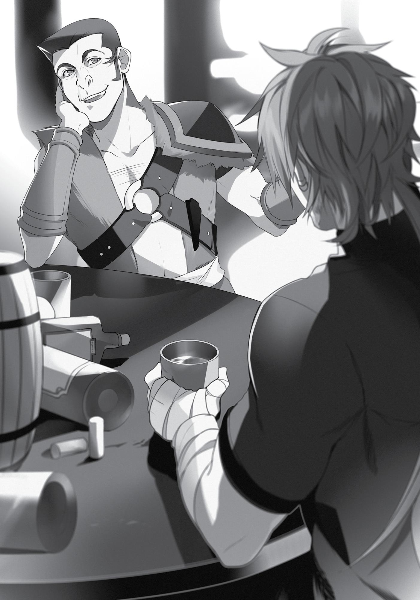
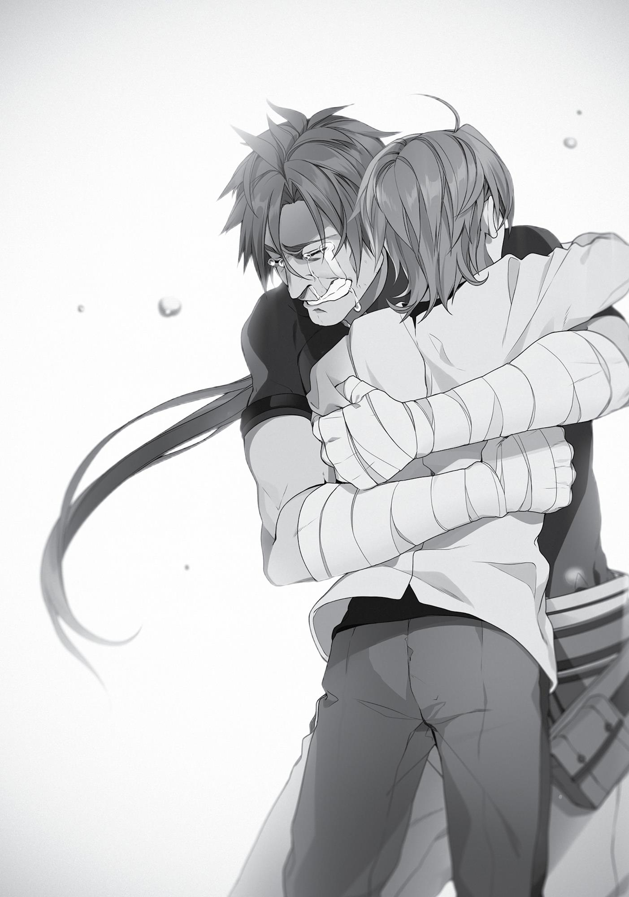

+++
title = "Chapter 4: Reunited"
date = 2026-07-20
weight = 3
[extra]
volume = 5
chapter = 4
+++

Paul

I still hadn’t left the bar.
The sun was on the verge of setting, so the place was starting to
get more customers who weren’t members of my squad. On the
other hand, many of my people had already left. Not that I really
cared. I was planted at a table all by myself, drinking like a fish.
Apparently, it was obvious that I wasn’t in the best of moods.
Everyone in the place was giving me a wide berth.
“Hey there! I’ve been lookin’ for you, buddy.”
Everyone except the most recent arrival, at least.
I looked up and found myself face-to-face with a grinning
monkey of a man. It was the first time I’d seen his ugly mug in a year.
“Geese…? Where the hell have you been, huh?”
“Ooh, hostile! You seem even crankier than usual, my friend.”
“What do you expect?”
Clicking my tongue in irritation, I reached up and touched my
cheek. It was still throbbing where Rudeus had punched me earlier.
Maybe I should have swallowed my pride and let one of our healers
fix me up.
That damn kid. I swear. “The Demon Continent might be tough,
but my magic was more than a match for it,” huh? Well, good for
you. If it was such a cakewalk, why didn’t you take a little time to
look around for your mother?
Oh, but at least I got to hear your lecture on the best ways to
cook Great Tortoise meat. “If I hadn’t hit on the idea of creating a pot

using Earth magic, we would’ve been stuck eating charred, smelly
chunks of that stuff for a whole year!” Wasn’t there anything else
you could have done with the time you spent hunting down
ingredients for some monster stew?
Ugh. God damn it.
And then, just to top it all off, you’ve got the nerve to accuse
me of cheating! I haven’t even thought about touching a woman in
the last year and a half, you smug little moron! You didn’t do a thing
to help, and you think you have the right to get on my case?
Oh, you didn’t know, huh? Great excuse. If you’d actually
bothered looking at the world around you, Zenith or Lilia might be
back here with us right now!
Seriously. What a joke…
“Hee hee hee. From the look of things, I’m guess you haven’t
bumped into each other yet.” Grinning to himself for some unclear
reason, Geese ordered something or other. Presumably booze. The
man was a heavier drinker even than Talhand, and Talhand was a
dwarf.
“Hey, Paul. Make sure to stop by the Adventurers’ Guild
tomorrow, all right?”
“Why?”
“Because I think you’ll run into someone interesting.”
Someone interesting? Geese apparently thought this meeting
would improve my mood. Given the timing of his arrival, and who I’d
“run into” today…it wasn’t hard to guess who he meant. “You talking
about Rudy?”
Pouting a little, the old monkey scratched at his head. “Huh?
How’d you know that?”
“I already bumped into him today.”

“You don’t look particularly happy, considering. Did you have a
fight or something?”
A fight…? Well, I guess we did. Although it barely even
qualified as one.
Damn it. Just thinking about it’s got my face aching again…
“What happened, Paul? Tell me all about it.” Geese got up and
pulled his chair over next to me. With that friendly face of his, the
man had always had a talent for listening to people’s problems. This
wasn’t the first time he’d stuck his nose into my business and
encouraged me to gripe.
“All right, get a load of this…”
I went ahead and told Geese what happened earlier.
I’d been happy to see Rudeus, of course. But it felt like we
weren’t really on the same page about the situation, so I asked him
what he’d been doing up until now. At which point he started talking
all cheerfully about his journey through the Demon Continent.
Every other word out of his mouth was some pointless boast, so
I pointed out that he could have used his time more productively.
Then he got all pissed off at me. He made a crack about me sleeping
around. I lost my temper completely. And then we fought, and he
kicked my ass. The end.
“Ahh…yeah. I gotcha…”
Geese had listened patiently to the whole story, nodding and
tossing in a few brief comments here and there. I felt like he’d been
sympathizing with me. But then, once I’d wrapped things up, he
looked me in the eye and said, “Well, sounds like your expectations
might have been a bit unfair there, chief.”
“Huh?” I replied, sounding like a complete moron.
Unfair? How I was I being unfair? And to whom? “You think I
expected too much? Of Rudy?”

“I mean, think about it, man,” continued Geese as I blinked in
confusion. “Sure, the kid’s amazing. I’ve never seen anyone who
could cast spells without a word like that. And when I saw him going
blow for blow with North Saint Gallus, it sent chills down my spine.
Rudeus is the kind of prodigy you see once a century.”
Right. Rudeus was a prodigy. He was a genius. He could always
do anything he set his mind to, even as a little kid. For a while, I’d
been under the impression that he had some relatively serious flaws
as well, but…I mean, by the end of his stay in Roa, Philip was willing
to marry off his own daughter to him. Philip! The same guy who
talked trash about me behind my back! “Yeah, that’s right. He’s
unbelievable. When he was only five years old, he—”
“But at the end of the day, he’s still just a kid.”
Startled by Geese’s firm interruption, I fell silent.
“Rudeus is still an eleven-year-old kid,” he repeated slowly, just
to drive the point home. “Even you didn’t run away from home until
you were twelve, right?”
“Yeah…”
“Anyone younger than that’s still just a snot-nosed brat. Isn’t
that what you always used to say?”
“Yeah, okay, sure. So what if I did?” Come on. Rudy’s already
stronger than me.
I did have some alcohol in my system this morning. Even with
that factored in, though, it was clear the kid had improved
dramatically. I might have been drunk, but I was also going all-out; I
lowered myself to using the North God Style’s “Four-Legged Stance,”
and even busted out the Sword God Style’s “Silent Sword.” But my
sword only sliced those panties he was wearing off his face. Rudy
wasn’t even taking the fight seriously, either. The fact that none of
my people suffered anything worse than a few minor injuries was
proof enough of that.

It was hard to say just how he’d grown as a fighter since the last
time I saw him. But even at the age of seven, he was cleverer than
me. Now he was both smarter and stronger than I was. What was so
unreasonable about expecting him to accomplish more than I could,
then? His age had nothing to do with his capabilities.
“Paul, what were you doing when you were eleven years old?”
“Hm…?”
As I recalled, I spent most of that year at home training with the
sword and getting chewed out by my old man. He found reasons to
complain about every little thing I did, and took every chance he
could to smack me around.
“You think you could have survived alone on the Demon
Continent back then?”
“Heh. You’re forgetting one little detail here, Geese. Rudy found
himself a demon bodyguard, remember? This guy speaks Human,
Demon-God, and Beast-God, and he’s strong enough to take down
an A-ranked monster single-handed. Anyone could have made it back
with a chaperone like that.”
“Nope,” Geese declared confidently. “You wouldn’t have made
it. No chance. Even if you went out there now, you still wouldn’t
survive on your own.”
I can’t say hearing that put me in the best of moods. It didn’t
help that Geese was still smirking at me from across the table. The
man had a seriously irritating smile. “Hah! Fine! Doesn’t that just
prove my point, then? Rudy pulled off something I couldn’t. My son’s
a prodigy! He’s already standing on his own two feet! I’ve got
nothing left to teach him. Was it wrong of me to expect him to put
those talents to use, huh?! Am I really in the wrong here?!”
“Yeah, you are. But that’s nothing new, hey?” Still smirking,
Geese paused for a moment to chug down the beer he’d just been

handed. “Ahhhh! That’s the stuff. You can’t get booze like this in the
Great Forest, you know?”
“Geese!”
“Okay, okay. No need to shout.” Geese smacked his wooden
mug down onto the table and looked me in the eye, his expression
suddenly much more serious. “Listen, Paul. You’ve never been to the
Demon Continent, have you?”
“So what?”
It was true. I’d never had the pleasure of visiting. I mean, I’d
heard the rumors, of course. Everyone made it out to be a dangerous
place where you’d run into monsters every time you took a walk, and
had to eat them to survive. But “lots of monsters” sounded like
something I could deal with, honestly.
“Well, it’s where I was born and raised, remember? And in my
considered opinion, the whole continent is bad news.”
“You know, you never really talked about the place, now that I
think about it. What’s so awful about it?”
“First of all, there’s no proper highways. They have roads
between the towns, of course, but you won’t find anything like those
safe, smooth, monster-free ones they’ve got on Millis and the
Central Continent. If you’re traveling anywhere, you’d better expect
to be attacked by C-ranked monsters. Or worse.”
Okay, I knew the place had a lot of monsters, but C-ranked or
worse? On the Central Continent, you’d have to go deep into a forest
to find anything that dangerous. Many monsters at that rank
traveled in large packs, or had some lethal special ability. “I feel like
you’re exaggerating just a little there, Geese.”
“Nope. I’m not telling you any tall tales right now, man. That’s
just how the Demon Continent is. The place is crawling with nasty
monsters.”

Geese looked perfectly serious, but that was how he usually
looked when he was lying to you. I wasn’t going to fall for his crap
this time.
“Now, let’s say we dump a kid out in the middle of a place like
that. This is a real talented kid, mind you, but he’s got no real-world
combat experience.”
“…Right.”
No real-world experience, huh? Seemed like we were talking
about Rudy again. Come to think of it, I’d never heard of him getting
into any actual battles before. But he’d apparently managed to fight
off some would-be kidnappers in Roa, and Ghislaine thought he
might be able to beat her if he had enough distance at the start.
I didn’t know a single swordfighter better than Ghislaine. If she
couldn’t close in on him safely, then there probably weren’t a
thousand people on the planet capable of beating him at his ideal
range.
All in all, his lack of hard experience didn’t seem like such a big
deal to me. Didn’t Alex R. Kalman, the second North God, cut down a
Sword Emperor in the first battle he ever fought?
“At this point, a grown-up appears and offers to help the kid
out. This guy’s a demon, and a really strong one, too. In fact, he’s a
Superd. You’ve heard of them, I’m sure?”
“Of course.” To be frank, I wasn’t sure I bought that part of the
story. From what I’d heard, there were only a handful of Superd left,
even on the Demon Continent.
“So, the kid has someone offering him aid when he’s in
desperate straits. This guy’s willing to help him navigate a place he
knows nothing about. And the Superd are terrifying, of course! He
has no idea how this guy might react if he refuses. You’d basically
have to accept that offer, right?”
“Yeah, probably.”

“But as the days roll on by, clever little Rudeus starts to ask
himself a question: ‘Why exactly is this guy helping me out,
anyway?’”
Sure. That did sound like Rudeus. The question might never
have occurred to me, but the kid was always sharp about that sort of
thing. I’d known just how weirdly perceptive he was ever since that
day he stepped in to save Lilia from Zenith’s wrath.
“Problem is, he can’t figure it out. He doesn’t know what this
guy’s really after.”
Well, how would he? You can never know what a stranger’s
really thinking. That’s the whole reason guys like Geese manage to
make a living.
“This Superd’s helping out for now, but he could easily abandon
or betray them someday…or so Rudeus thinks. And that’s why he
decides to try and get on the guy’s good side.”
“I don’t know about that plan, Geese. Does a Superd even have
a good side?”
“Okay, don’t get all clever. You know what I mean, right?
Rudeus decides to appeal to this guy’s emotions. He wants to make
him feel like they’re all buddies.”
Hmm. That would explain why Rudy had spent so much time
helping out this demon guy. And it did make sense, actually. Not only
was he scoring brownie points with his protector, he also had a
chance to develop his own skills as an adventurer in case he needed
to rely on them later. I had to admit, that sounded rational. It was
probably the safest path he could have chosen.
Hmph…the boy did have a good head on his shoulders, didn’t
he? “Tch. You’d think a kid that smart could have found some time to
look around a little, too.”
Geese held up one hand and spread out his fingers. “He’s in an
unfamiliar land,” he said, folding one down. “He’s on his first

adventure ever. No matter how smart he is, this is all brand new to
him. He needs to learn the basics fast, before someone takes
advantage of him. He’s trying to keep a demon who might betray
him at any moment happy. Oh, and he’s got a little pal tagging along
behind him who he needs to protect.”
By the time he’d finished with this recitation, Geese had run out
of fingers. With a little shrug, he moved on to his closing argument.
“If he’d also managed to comb the continent for other people
who’d been teleported, well, that would just make him superhuman.
Seriously, I’d be ready to give the kid a spot in the Seven Great
Powers.”
The Seven Great Powers, huh? Now that brought back some
memories. Back in the day, I used to dream about earning myself
that kind of fame. Still, I felt like Rudy really did have the raw talent
to make it on that list someday. And I didn’t think that was just my
parental pride talking.
“The kid would have worked himself to death just trying. I know
Rudeus is a prodigy, but human beings have their limits, man.
Especially when they’re still children.”
“Okay, look,” I interjected. “If it was that much of a struggle,
then why’d he make the whole thing sound like it was some big, fun
adventure? He sounded like one of those spoiled rich brats who poke
around on the first floor of a labyrinth just to have something they
can brag about.” If the journey had been that rough for Rudy, he
wouldn’t have described it that cheerfully. He would have told me
about the hard and painful parts instead. But he hadn’t even
mentioned any bumps in the road.
“Why? Because he didn’t want to worry you, obviously.”
“Huh?” I grunted, somehow sounding even stupider than
before. “Why the hell would he be worrying about me? Am I that
much of a failure as a father?”

“Yeah, pretty much.”
“Tch. Sure, I guess you’re right. I’m a weak little man who
drowns himself in booze for idiotic reasons. I suppose our little
prodigy would feel great pity at the sight of me.”
“Hate to break this to you, Paul, but it doesn’t take a prodigy to
pity you right now,” Geese said, letting out a sigh. “I know you can’t
see your own face, so let me tell you something. You look terrible,
man.”
“Oh yeah? Terrible enough to earn some sympathy from my
own son?”
“Yep. If he walked in right now, I don’t think you guys would end
up fighting. He’d probably feel too bad for you to say anything at all.”
I reached up and touched my face. The stubble I hadn’t
bothered shaving for several days rasped audibly against my fingers.
“Look, Paul. Let me just repeat myself here,” said Geese, his
tone suddenly firm. “You expected too much from your son.”
Was it really that unreasonable of me to expect more? Rudy
could do anything he set his mind to, ever since he was little. All I
ever did was get in his way with my clumsy attempts at parenting. He
never really needed me.
“Tell me something. Why can’t you just be happy that he made
it here? Does it really even matter what kind of a trip the kid had?
Let’s say it really was a carefree cruise, and he spent every minute of
it making out with his little girlfriend. So what? He’s here now, and
he’s safe. Ain’t that something worth celebrating?”
Of course it was. And I was happy at first.
“Would you have preferred your son to come back hollow-eyed
and down a limb or two? Hell, there was a damn good chance of you
‘reuniting’ with a corpse. Oh wait, my mistake… If he’d died on the

Demon Continent, there wouldn’t even be a body left for you to
find.”
Rudy? A corpse? I’d seen him healthy and full of life this
afternoon, so it was impossible to even imagine right now. But just a
few days ago…hadn’t I pictured that exact scenario as I wallowed in
despair?
“God, that poooor kid! After that long, hard trip, he finally found
his dear old dad again, but the guy turned out to be a drunken
scumbag! If I was him, I’d have cut ties on the spot.”
Oh good. Now he was getting all theatrical. “I get the message,
Geese. You’re not wrong, all right? But there’s one thing I still don’t
understand.”
“Yeah? What’s that?”
“Why didn’t Rudy know about what happened to Buena Village?
I’m positive I had a message waiting for him at Zant Port.”

Geese opened his mouth as if to explain, then grimaced slightly
and let it fall shut. I recognized that expression. It meant he was
hiding something.
“Uh, I dunno. He probably just got unlucky and didn’t notice it.”
“Wait…where exactly did you find Rudy, anyway? I was
assuming you ran into him in Zant Port.”
I didn’t know where Geese had been for the last year, but
Rudeus had come to Millis from the north. And Zant Port was the
only city up in that direction big enough for Geese to really thrive in.
I definitely left a message for Rudy in that city. And on top of
that, we had members of our squad stationed there. Their job was to
gather information from any travelers crossing over from the Demon
Continent. If the kid was an adventurer now, he obviously would
have stopped by the Guild, right?
“I met Rudeus in the Doldia Clan village, actually. That was a real
shocker, let me tell you. He’d managed to get himself locked up
naked in a jail cell on charges of assaulting their Sacred Beast.”
“Naked? In a beastfolk jail? Are you serious…?”
I’d heard about this from Ghislaine. For members of the Doldia
tribe, to be stripped naked, chained up in a jail cell, and doused with
ice-cold water was the greatest of all humiliations. They almost never
subjected outsiders to such treatment, but when they did, it usually
ended in the prisoner’s death. I tossed some water on Ghislaine as a
joke once, and she glared at me like I’d killed her parents.
“So, uh…what happened there?”
“What? Didn’t Rudeus tell you about all that?”
“All I heard was the part where he traveled over the Demon
Continent.” Why hadn’t he told me why he never saw the message I
left him at Zant Port, anyway? That was really damn important.
Oh, right. I’d never actually asked him.

Damn it. Why did I have to be so short-tempered?
I needed to calm down and think this through carefully. Rudy
was a smart kid, but he’d somehow failed to see my message, or
even hear about the situation. If he’d spent any time in Zant Port, he
would have stumbled across that kind of information without even
trying.
In other words, he must have gotten mixed up in something the
moment he arrived there—something that got him carted off by the
Doldia tribe. Whatever it was, it must have been a major incident.
Some of our Zant Port people should be coming back in two or three
days to make their regular report, but maybe something big had
gone down up north.
“Well, I don’t know all the details myself,” said Geese. “But I was
hanging around with the Mildett in the Great Forest when I got wind
of a rumor that the Doldia had locked up some human kid.”
“Hm? Wait a second. You were where?” The Mildett? Wasn’t
that a beastfolk tribe? They were the ones with rabbit ears, right?
“At a Mildett village. It’s the one where their chief lives, so it’s
actually pretty big, but—”
Geese’s explanation was painfully long-winded and annoying.
Honestly, I was tempted to cut him off partway through. But I’d
missed out on important information by getting impatient with Rudy
earlier. And although I rarely learned from my mistakes, I wasn’t
stupid enough to screw up the exact same way twice in a single day.
Eventually, Geese’s rambling tale did come to an end. I tried to
summarize what he’d told me. “So basically, you were going around
to all the tribes in the Great Forest…and convincing them to send any
lost humans they found over to Millishion?”
“That’s right. Heh heh. Feel free to shower me with gratitude!”

“Yeah, I owe you big time…” That probably explained the
constant trickle of refugees from the Great Forest area who’d been
coming to me for help.
“Well, anyway! When I heard about this human kid, something
sorta clicked, so I ran right over. Not to brag or anything, but I’m a
man with many connections, yeah? Just so happens I even know a
couple people in the Doldia village. I got one of their warriors, good
pal of mine, to have me tossed in the same jail cell as the kid.”
“Hold on a second. Why would you need to go in there with
him?”
“So I could help him escape, if worse came to worst. It’s way
easier breaking out of a beastfolk prison than breaking into one.”
I was familiar with Geese’s talent for escaping prisons.
Whenever he got himself locked up for running some kind of scam,
he’d pop back up soon enough as if nothing had ever happened.
“Anyway, I was assuming I’d find the kid curled up in a ball
sobbing, you know? But instead…ha ha!”
“What happened? Was he all right?”
“He was lounging around casually in the nude, man! And the
first words out of his mouth were ‘Welcome to life’s final
destination!’ How was I even supposed to respond to that?!” Geese
had to stop for a moment to cackle with laughter at his own story.
“This doesn’t sound like a laughing matter, man…”
“It was hilarious, though! I could tell right away that he had to
be your kid, Paul!”
I didn’t understand what was so funny about that. Or how he’d
even figured it out so quickly.
“He was exactly like the old you, man,” Geese went on.
“Ridiculously cocky! Ready to boss around a total stranger! One time,
he was trying to flirt with this beastfolk girl, right? She glared at him

and said ‘I can smell your arousal,’ but he kept on ogling her anyway!
That boy’s your son, all right!”
At this point, the man broke off for another cackling fit. I shifted
uncomfortably in my seat, reminded of some youthful indiscretions
of my own.
“It did take a little longer for me to be completely sure, though,”
said Geese, pausing to drain a second mug of beer. “But yeah, that’s
the shape of it. You can hardly blame the kid for missing your
message. From the sound of things, he didn’t spend any time in Zant
Port.”
“Hm? Hold on, Geese. You were locked up in the same cell,
weren’t you? Then—”
Couldn’t he have just explained everything?
“Anyway!” Geese said quickly, rising from his seat. “I’m sure
there’ll be a bit of lingerin’ family awkwardness here, but do your old
pal Geese a favor and go make up with the boy, all right?”
“Hey, wait. I’ve still got more to—”
“Oh right. Slipped my mind before, but it looks like Elinalise and
company headed to the Demon Continent for you. People were
sayin’ some elf lady had milked half the men in Zant Port dry, and we
both know what that means.”
“What? Seriously?” I thought Elinalise hated me even more than
the others did, frankly.
“Heh heh. When all’s said and done, they don’t hate you as
much as they let on.”
With that, Geese sauntered right out of the bar. He hadn’t paid
for his drinks, of course. He never did. But this time, I didn’t mind
picking up his tab.
In any case, I’d done more than enough drinking for one day. It
was about time I turned in for the night.

I’d have to go talk things out with Rudy soon. Maybe even
tomorrow…
“No more booze tonight, buddy,” called Geese, who’d popped
his head back in the door. “You’re gonna head over to the Dawn’s
Light Inn tomorrow sober, got it?”
“Yeah, yeah! I know!” With a sigh of irritation, I put my mug of
beer down.
Now that I thought about it, though, I had been overdoing it
lately. Why did I keep drowning myself in this crap? I still had plenty
of other things I needed to be doing.
“Um…Captain Paul? Are you finished talking with your friend?”
As I was turning things over in my head, a woman hesitantly
approached my table. There was an apologetic expression on her
face. My head wasn’t clear enough to recognize her at first, but after
studying her face for a few seconds, I realized it was Vierra—one of
my squad’s members.
“Heh. What’s with you, girl? Felt like wearing something modest
for once?”
“Well, yes…” With an ambiguous nod, Vierra lowered herself
into the seat Geese had just vacated a minute earlier. For some
reason, she wasn’t wearing her usual provocative getup tonight.
She’d changed into some perfectly unremarkable outfit that made
her look more like an ordinary city girl.
“I was worried that what happened with your son earlier might
have been my fault, sir.”
“What? Why would you think that?”
“Er, well, it seemed like…the way I dress might have caused him
to misunderstand the nature of our relationship…”
“That’s got nothing to do with it. The little punk took one look at
the size of your chest and jumped to his own conclusions.”

There was a reason Vierra dressed like she did. The woman had
been an ordinary adventurer back in Fittoa, but the Displacement
Incident had left her stranded on the Millis Continent without any
equipment to speak of. She was quickly captured by a gang of
bandits who treated her as their plaything. It was the kind of
nightmare that would leave most people broken, but she’d managed
to put it behind her through sheer willpower.
However, we’d also taken in a girl who hadn’t bounced back so
quickly: her sister Shierra. Even now, Shierra trembled uncontrollably
every time a man so much as looked at her. And we had a number of
similar cases in our squad.
In order to protect them from unwanted attention, Vierra had
started wearing a deliberately skimpy suit of armor to draw male
eyes in her direction. She was also the member of our squad most
adept at comforting and caring for women who’d been subjected to
that sort of trauma. As a man with no way of understanding that
specific kind of pain, I considered her an indispensable part of the
team.
We didn’t have a sexual relationship, of course. The idea was
ridiculous.
“It wasn’t your fault. We clear?”
“…Yes, sir.”
Still looking a bit dejected, Vierra got up and shuffled back over
to the table where the other girls were sitting. Looking around the
room a bit more carefully than before, I noticed that more than a
few people were watching me with obvious concern in their eyes.
“Oh, for crying out loud… Don’t look at me like that, you
morons! I’ll make up with him tomorrow, all right?!”
I pushed back my chair, stood up, and stomped out of the bar.

When I’d returned to my room at the inn, I found Norn already
asleep.
I poured myself a cup of water from the pitcher on our table and
quickly drank the whole thing. The lukewarm fluid coursed its way
down into my churning stomach.
I could feel myself gradually sobering up. I’d always had a high
tolerance for alcohol; I did get plastered when I drank a lot, but the
effects never seemed to last too long. As the fog in my head slowly
began to clear, I looked down at my daughter, who was curled up in
bed clutching her blanket, and stroked her gently on the head.
I felt sorry for Norn. I really did. With a father like me, she had to
have plenty of complaints, but she always kept them to herself and
tried her very best to smile. If I ever lost her, I wouldn’t have the
strength to go on living.
“Mm… Daddy…”
Norn shifted around in bed just a little. It didn’t seem like I’d
woken her; she was probably just sleep-talking.
Norn wasn’t like Rudy. She was an ordinary child. I had to keep
her safe.
Suddenly, an odd thought occurred to me: If Rudy had been an
“ordinary” kid as well, wouldn’t he be sleeping in this room with
Norn right now? He would have stayed home with us instead of
going off to be a tutor. And at the moment of the disaster, he might
have been tugging at my sleeve, asking if he could hug Norn, too.
If Rudy had been ordinary—a normal eleven-year-old—wouldn’t
I look at him the same way I looked at Norn? As someone I needed to
protect?
My legs trembled underneath me. I finally understood why
Geese had told me “He’s still a kid.”

What difference did it make if Rudy was ordinary or not? How
did that even matter? What if Norn had been the genius? Would I
have spoken to her like that? If Norn had come back to me after
going on an adventure, knowing nothing of what had taken
place…would I have told her I expected more?
Once I started thinking about that, I couldn’t fall asleep. I didn’t
even want to lie down in bed. I left our inn, found a fire bucket full of
water outside, and dumped a whole jug’s worth over my head.
And then, remembering the look on Rudy’s face as he left the
bar, I bent over and vomited.
Refresh my memory, Paul. Who was it who hurt the kid that
badly?
Looking down into that fire bucket, I saw the face of a total idiot.
Whoever this dumbass was, he was obviously the last man in the
world who had any business calling himself a father.
“Ah, shit. This might be tough…”
If I was in his kid’s shoes, I’d cut ties without a second thought.
Rudeus

The next morning, I sat down to breakfast in a relatively
decent mood.
We’d just walked over to the bar next to the inn. The food in
Millishion was definitely tasty. Our meals had been getting better
and better as we traveled toward it from the Great Forest. This
morning, we had freshly baked bread, some sort of lightly flavored
clear soup, a simple vegetable salad, and thick slices of bacon. Not
bad at all.

While I hadn’t had any last night, apparently dinner here came
with an actual dessert. It was a specific kind of sweet jelly that was
very popular with young adventurers lately, having earned a mention
in a recent popular ballad about a youthful magician’s adventures.
That was something to look forward to, at least. It’s always nice
to get some decent food in your belly. Getting hungry makes you
irritated. Getting irritated ruins your appetite. And a ruined appetite
just gets you hungrier. That’s a classic vicious circle right there. It’s
enough to make an android cranky.
“…C’mon in.”
As I reflected on these matters while sipping a coffee-like aftermeal drink, the barkeep turned his attention to the entrance. A
weary, pale-faced man stood in the doorway. When I saw his face, I
flinched reflexively.
He looked around the place for a moment, then spotted me.
In that moment, all the emotions I’d experienced yesterday
came surging back to the surface. Even though he hadn’t said a word
to me, I found myself averting my eyes to the floor.
From my reaction alone, the two people I was sitting with
seemed to realize who the man in the entrance had to be. Ruijerd
furrowed his brow; Eris kicked her chair back and rose to her feet.
“Who are you supposed to be?”
The man started walking over toward us, but Eris had planted
herself squarely in his path. With her arms folded, her feet wide
apart, and her chin up in the air, she glared at the man sternly—
despite the fact that he was two heads taller than her.
“I’m Paul Greyrat…his father.”
“I know that!”

As I stared at Eris’ back, Paul spoke over her head in a wryly
amused voice. “What’s going on, Rudy? You hiding behind girls now?
What a little playboy.”
Something about those words—or maybe his tone—relieved me
just a little. It reminded me of the way he used to tease me back in
the day. Those were nice memories.
I decided that Paul was trying to bridge the gap that had opened
up between us. He’d gone out of his way to find me here first thing in
the morning, after all. I was calm enough to at least try and have a
conversation.
“Rudeus isn’t hiding behind me! I’m hiding him! From his failure
of a father!” Balling her hands into fists, Eris quivered with fury. It
looked like she was about ready to take a swing at Paul’s chin.
I shot a glance over at Ruijerd. Apparently sensing what I
wanted, he grabbed Eris by the scruff of her neck and lifted her up
off the floor.
“Hey! Let me go, Ruijerd!”
“We should leave the two of them alone.”
“You saw Rudeus last night, didn’t you?! That man has no right
to call himself a father!”
“Don’t be so harsh on him. Most fathers are far from perfect.”
Ruijerd headed for the exit, carrying a struggling Eris with him.
But as he passed by Paul, he paused for just a moment. “You have
every right to say your piece. But the only reason that you can is that
your son is still alive.”
“Uh…yeah…”
Ruijerd’s words carried some real weight. He did seem to
consider himself the world’s single greatest failure as a father.
Maybe he felt some sympathy for a fellow screw-up.

“You really shouldn’t order people around with a jerk of your
chin, Rudy.”
“You’ve got it all wrong, Father,” I protested. “That was pure eye
contact. My chin wasn’t even involved.”
“Not sure that really makes a difference,” said Paul, seating
himself across the table from me. “So, was that the demon guy you
were telling me about yesterday…?”
“Yes. That’s Ruijerd of the Superd tribe.”
“The Superd, huh? Seems like a friendly enough guy. I guess the
rumors must have been a bit exaggerated.”
“You’re not afraid of him or anything?”
“Don’t be stupid. He’s the man who saved my son.”
He didn’t seem to think so yesterday, but…it probably wouldn’t
be too helpful to point that out.
Now then…
“So anyway. Can I ask why you’re here?”
My voice came out stiffer than I’d intended, and Paul flinched in
his seat. “Uh…well, I wanted to say I’m sorry.”
“For what?”
“Everything that happened yesterday.”
“There’s no need to apologize.” It was useful that he was willing
to do so, but after a good night’s sleep on Eris’ chest, I was ready to
own up to the mistakes I’d made. “To be honest, I really was playing
around up until now.”
Things had been a little dicey at the start, true. But for the most
part our journey had gone smoothly, and I’d found plenty of time to
indulge in various perversions. The fact that I never got around to
gathering information on the Fittoa Region was, without a doubt, a
failure on my part. I never had a chance to poke around in Zant Port,

but we’d spent a decent amount of time in Wind Port. I could have
found some sort of information broker there and learned more
about the Calamity.
I didn’t look into something that I really should have. That was
sloppy and thoughtless of me.
“It’s understandable that you were angry with me, Father. I’m
sorry as well… I can’t imagine how hectic things must have been for
you.”
The entire Fittoa Region had been “displaced,” and our family
scattered to the winds. When I thought about how Paul must have
felt in the days and weeks that followed, I couldn’t bring myself to
blame him for his harsh attitude. I’d been traveling in a bubble of
cluelessness, happily ignorant of the ongoing tragedy all around me.
“Don’t talk like that, Rudy. I know you must have had a hard
time out there, too.”
“No, that isn’t true at all. It was honestly a piece of cake.”
Ruijerd had been there for me, after all. After our bumpy start in
Rikarisu, things had gone comparatively smoothly. Our bodyguard
ensured that monsters never ambushed us. He’d hunted down our
dinner without being asked to, and even stepped in when Eris and I
got into fights. For me, at least, the journey had been virtually stressfree. The word “cakewalk” sounded about right.
“Oh yeah? A piece of cake, huh…?” I didn’t know what Paul was
thinking at the moment, of course. But for some reason, his voice
was trembling slightly.
“I do feel bad that I never saw your message, by the way. What
was it about?”
“I just said that I was fine, and asked you to search the northern
part of the Central Continent.”
“I see. Well, I can head there to look around once I drop Eris off
back in the Fittoa Region.”

Why was I talking like a robot? Everything I said right now came
out sounding weirdly tense. It almost felt like I was anxious. But why
would I be? I’d forgiven Paul, and he’d forgiven me. Things definitely
weren’t the same as before, but this was an emergency situation,
right? And everyone gets tense in an emergency. Sure. That
made sense.
“Putting that aside for now, could you go into a little more detail
about the current situation in the Fittoa Region?”
“Yeah, sure thing.” Paul’s voice was just as stiff as mine and
quavered slightly every time he spoke. Was he on edge as well?
No, no. I should try to figure out my own behavior first. There
really was something odd about this… I couldn’t seem to act the way
I usually did.
How had I spoken with Paul before this? We used to be pretty
casual with each other, didn’t we?
“Let’s see. Where do I even start…?”
His voice still tense, Paul gave me a thorough summary of what
had happened back in Fittoa while I was gone. Every building in the
region had disappeared, and every resident had been teleported to
some random corner of the planet. Many deaths had already been
confirmed, and many more people were still unaccounted for.
Paul described how he had recruited volunteers for the Search
and Rescue Squad and molded them into a functional organization.
He’d chosen to base their operations in Millishion because it was
home to the Adventurers’ Guild headquarters and a good central
spot from which to gather information.
The squad had another base of operations in the capital of the
Kingdom of Asura, and the former butler Alphonse ran things there.
Alphonse was also the overall leader of the organization, and was
actively providing aid to the refugees who’d made it back to the
Fittoa Region.

Paul also explained that he’d left messages for me in cities all
around the world. He’d been hoping that we could split up and
search for the missing members of our family separately.
As the oldest and most independent of his children, it probably
had been my responsibility to help. I was still a child, yes, but I had
the mind of an adult. If I’d actually seen Paul’s message, it would
have stirred me to action.
Zenith, Lilia, and Aisha were all missing. And it was entirely
possible I’d passed by one of them somewhere on the Demon
Continent. That was just a fact, and it was enough to make me regret
everything I’d done there. I’d been in such a hurry that we rarely
stayed in a single town for more than a few days.
“Norn was all right, though?”
“Yeah, we got lucky there. She was touching me when it
happened.”
According to Paul, that was just how teleportation magic
worked in general—if you were in physical contact with someone
when it hit you, you’d be sent to your destination together.
“Is she doing well?”
“Yeah. She seemed a little uneasy about moving to such an
unfamiliar place at first, but now she’s basically the squad mascot.”
“Really? That’s good to hear.”
At least Norn was safe and happy. That was definitely the one
silver lining in this whole ugly mess. It was something worth
celebrating, for sure.
But for whatever reason, I was still feeling kind of gloomy.
“…”
“…”
Our conversation ground to a halt. This felt weirdly…awkward.
Paul and I weren’t like this before, were we? What happened to the

way we used to crack jokes and banter with each other? Very
peculiar.
After a while, Paul said something or other, but I couldn’t
manage much of a response.
My replies grew increasingly brief and listless.
At some point, all the other customers had filtered out of the
bar. Before too long, we’d probably be asked to leave so they could
get ready for the lunch rush.
I guess Paul picked up on that as well. He moved on to our final
major topic.
“What are you planning to do next, Rudy?”
“First of all, I’m going to take Eris back to the Fittoa Region.”
“There’s not much of anything left in Fittoa, you know?”
“I know. But we’re still going.”
Even though Philip, Sauros, and Ghislaine were still missing, and
we probably wouldn’t find any familiar faces waiting for us, we had
to go. Getting back there had always been our objective, after all.
We’d follow through on our initial goal. And once we arrived in
Fittoa, we could witness its state with our own eyes.
After that, I could head up to search the northern part of the
Central Continent…or maybe even ask Ruijerd to help me get all the
way back to the Demon Continent. Hell, I could even try heading to
the Begaritt Continent. I did know the language, more or less. “After
that, I’ll start searching other parts of the world.”
“…All right.”
With that, the conversation petered out again. I had no idea
what else there was to say.
“Here.” At this point, the barkeep abruptly thumped two
wooden cups down in front of us. Tendrils of steam rose gently from
the liquid inside them. “That’s on the house.”

“Oh. Thank you.” Now that I thought about it, my throat was
painfully dry.
Once I realized that, I also noticed a few other things. I’d been
clenching my hands tightly; my palms were damp with sweat. My
back and my armpits also felt oddly chilly. And my forelocks were
plastered to my forehead.
“Hey, kid. I won’t pretend I know what’s goin’ on here, but…”
“Hm…?”
“At least look the guy in the face.”
It was only when I heard those words that it hit me. I’d been
avoiding Paul’s gaze this entire time. After averting my eyes when he
walked in, I hadn’t looked him in the face again. Not even once.
Swallowing anxiously, I looked up at my father. His face was full
of uncertainty and angst. He looked like a man on the verge of
breaking down in tears.
“Why are you making that face?”
“What face?” said Paul, smiling weakly.
With his listless expression and hollow cheeks, he looked like a
completely different person from the man I’d known before. But for
some reason, I felt like I’d seen a very similar face somewhere
before. Where was that? I had the feeling it was a long time ago…
…Now I remembered.
I’d seen it in the bathroom mirror, back in my old house.
This would have been a year or two after I’d become a total
shut-in. At that point, I still thought I had time to turn things around.
But I was also aware that there was a growing gap between me and
everyone I knew—one that I might never be able to bridge.
Still, I was simply too afraid to go outside again. And so, feelings
of anxiety and frustration steadily built up inside me. It was probably
the single most emotionally volatile period of my life.

I see. So that’s how it is…
Paul had searched desperately for his family with no success.
For all his efforts, he hadn’t found a single scrap of news for ages. He
worried about us constantly. And eventually, he started to ask
himself: What if they’re hurt? What if they fell ill? What if they’re
already dead? The more he thought about it, the more worried he
grew.
And then, at long last, I showed up…with a cheerful smile on my
face. It was so very different from what Paul had imagined that he
grew irritated despite himself.
I’d once experienced something similar. Not long after I began
my life as a loser, somebody I knew from junior high stopped by to
visit and started to tell me about what was going on at school. I was
deeply depressed and in so much pain, but he talked about his life
like he didn’t have a single care in the world. It made my stomach
hurt. I ended up snapping and hurling harsh insults at him.
The day after that, I told myself that I’d apologize to him the
next time he dropped by. But he never came over again. And I didn’t
reach out to him, either. I let some sort of stubborn pride hold me
back.
I remembered now. That was exactly when I’d seen that face in
the mirror.
“I’ve got a proposal, Father.”
“What…?”
“Under these circumstances, I think we need to try and act like
grownups.”
“Uh, yeah, I guess I wasn’t too mature yesterday… I’m not sure
what you’re getting at, though.”

The gloom inside my heart was melting rapidly away. I finally
understood how Paul felt now. Once I had that piece of the puzzle,
the rest was simple enough, really.
I thought back to the past again—to the day Paul had chewed
me out for fighting, and I’d fired back sharp words of my own. At the
time, I’d been less than impressed with his parenting skills. But he
was only twenty-four then, very young for a father, so I decided not
to judge him too harshly.
It had been six years since then. Paul was now thirty years old.
He was still a good bit younger than I had been in my previous life,
and he’d already accomplished more than I ever had. When I’d
fought with my friend, I didn’t even try to patch things up. I just
found ways to convince myself that it was all his fault. By
comparison, Paul was making a much better effort.
I wasn’t the same person I was back then. I’d sworn to myself
that I was going to change, hadn’t I? I’d forgotten about that lately,
but I couldn’t let myself repeat the same stupid mistakes over and
over again.
This was a much bigger fight than our last one, yes. But I was
behaving the exact same way I did on that day six years ago. We
were both making the same stupid mistakes all over again. I thought
I’d come a long way since then, but instead, it seemed that I’d been
treading water. I had to acknowledge that.
And more importantly, I had to take a real step forward.
“Let’s pretend yesterday never happened.”
It was a simple enough proposal. I was deeply hurt by what Paul
said to me in that bar. The pain had been almost unendurable. My
friend, who’d stopped by out of concern for me, must have felt
something similar when I pushed him away. And that was how things
ended. We never saw each other again.

It wasn’t going to turn out that way this time. I wouldn’t let my
bond with Paul be broken.
“The two of us didn’t have a fight yesterday. Right now, in this
moment, we’re seeing each other again for the first time in years.
Got it?”
“What are you talking about, Rudy?”
“Don’t overthink this, please. Just spread your arms open wide.
Go on!”
“Uh…okay…” Paul spread his arms, looking a little dubious.
I promptly threw myself into them. “Father! I’ve missed you so
much!”
His body smelled faintly of alcohol. He seemed to be sober right
now, but I wouldn’t have been surprised if he was still nursing a
hangover. When had he started drinking so heavily, anyway? I felt
like he’d barely touched the stuff back in the day.
“R-Rudy?” Paul didn’t seem to know how to react.
Resting my chin on his shoulder, I slowly murmured a little
advice. “C’mon. You’ve just been reunited with your son. Isn’t there
anything you want to say?”
This was all a bit ridiculous, yes. But even so, I hugged Paul’s
solidly built body with all my might. It wasn’t just his face that had
gotten thinner. His body felt like it was a size or two smaller than it
was before. Of course, I’d done some growing in the last few years,
so that probably had something to do with it; but it was obvious that
my father had been through some very hard times.
After a moment’s hesitation, Paul managed to mumble “I…I
missed you too.”
And once he got those first words out, it was as if the floodgates
opened. “I missed you too, Rudy… I missed you so damn much! I

searched and searched, but I couldn’t find anybody… I started
thinking you might be dead… I started…picturing you…”
When I looked up at Paul again, tears were streaming down his
cheeks. It wasn’t exactly a pretty picture. The man was sobbing like a
baby. “I’m sorry… I’m so sorry, Rudy…”
Well, great. Now he’s got me going too.
I patted the back of Paul’s head a few times. For a while, the
two of us just cried together.
And so, for the first time in five years, I was finally reunited with
my father.

