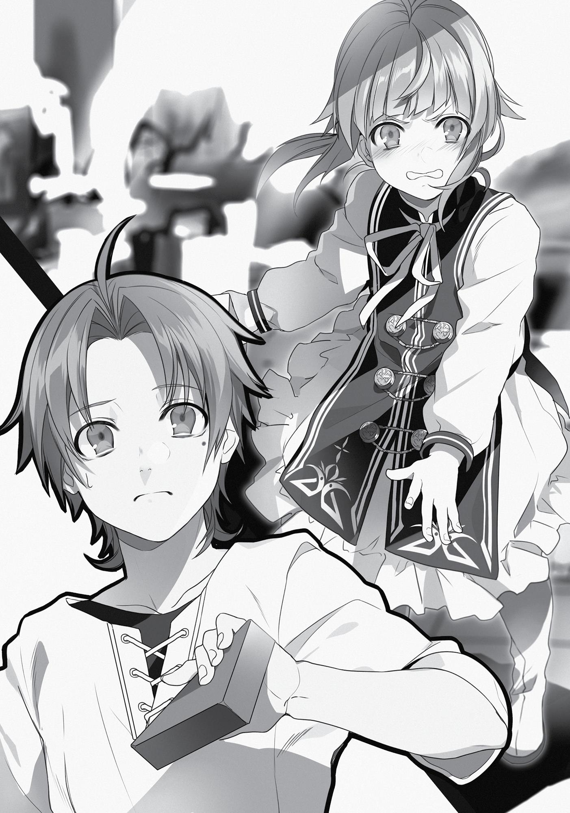

+++
title = "Chapter 6: One Week in Millishion"
date = 2026-07-20
weight = 5
[extra]
volume = 5
chapter = 6
+++

The next morning, I headed over to the headquarters of
the Search and Rescue Squad to let Paul know about our plans.
The HQ itself was a perfectly ordinary two-story building. It
didn’t take long for me to find my father. He was hard at work in
what seemed to be a conference room, discussing something or
other with roughly a dozen other men. I could make out snatches of
the conversation from outside; it seemed they were preparing for a
large operation of some kind.
From the way Paul looked the other day, I’d assumed he spent
every day in Millishion either getting drunk or nursing a hangover,
but maybe my timing had just been bad. Right now, he was the
picture of a focused, competent leader. I was impressed despite
myself…at least, until someone alluded to the fact that he’d skipped
a month’s worth of meetings while on a massive bender. From the
sound of things, it was only yesterday that he’d abruptly gotten
motivated again.
It was most likely because Paul wanted to show me his better
side. In other words, he’d gotten back to work because of me.
Goodness gracious. The boys do love showing off for me…
With a theatrical sigh, I decided to wait for Paul to find a little
free time.
Sitting around in the room outside might get boring, so I opted
to wander around the building for a while. After a few minutes of
exploration, I came across my little sister Norn at play. She was in a
room that seemed to be serving as a nursery, playing blocks with a
bunch of other kids around her age.
“Hey there,” I said, raising a hand in greeting as her eyes met
mine.

Norn started in surprise, then scowled and hurled the wooden
block in her hand, which I managed to catch. “Go away!”
This didn’t strike me as the friendliest way to say hello. Hmm.
Had I done anything to make her upset with me? The only thing that
came to mind was that time I beat the crap out of Paul before her
eyes.
Yeah, that probably had something to do with it.

“Um…Father and I made up with each other, Norn,” I protested
gently.
In response, she shouted “You liar!” and scampered off as fast
as her little legs would carry her.
Apparently, my baby sister hated my guts now. That was a bit of
a downer.
I didn’t want to upset her with my presence, so I headed back
over to the closest thing the building had to a waiting room. As I sat
down in the corner, a number of heads turned in my direction. I
recognized at least a couple of the guys I spotted “kidnapping” Somal
the other day.
I was starting to get the feeling I might not be too popular in this
place.
But before I really had time to bathe in the awkwardness, a
familiar woman walked into the room, and all eyes were suddenly on
her. It was the bikini-armor lady, back to her old half-naked ways.
She spotted me immediately and walked right over.
“Good morning,” I said.
“Good morning,” she replied with a smile and a small tilt of her
head. “Did you need something from us today?”
“Yes. I’m here to see my father, um…” What was this lady’s
name again? I felt like Paul hadn’t told me. “Ah, pardon me. I haven’t
introduced myself, have I? My name is Rudeus Greyrat, miss.” Rising
to my feet, I put one hand to my chest and offered an aristocratic
bow.
“Uh, oh…m-my name’s Vierra,” replied the bikini-armor lady,
her hands fluttering anxiously in the air. “I’m a member of Captain
Paul’s squad.” She proceeded to return my bow, offering me a truly
irresistible view of her cleavage.

The girl really was a sight for sore eyes. Or even non-sore eyes,
honestly. I’d only just resolved to cut back on my perverted behavior,
so I didn’t want to stare. But I couldn’t seem to look away. All my
good intentions were meaningless in the face of her chest’s
gravitational pull.
That outfit was just unfair.
“I’m very sorry I was so rude the other day. My father’s
something of a womanizer, so I’m afraid I got the wrong idea.”
“No, no! It’s all right. I can understand why you’d think that,
given how I was dressed.” Vierra emphasized her words by shaking
her head vigorously. Certain other parts of her body also moved as a
result. That bikini armor did seem to be fixed in place to some
degree, but it wasn’t enough to keep her from jiggling when she
made sudden movements. Those things were big, after all.
Whoops. I was doing it again.
With an effort of will, I managed to tear my eyes away. “I’m not
sure it’s a great idea to hang around a bunch of men in that armor if
you can help it, miss. I’d imagine some people might find it a bit
distracting. Maybe you could put on a cloak over it, at least?”
Vierra smiled awkwardly. “I’m sorry, but there’s a reason that I
wear this.”
Maybe I was imagining things, but it felt like a lot of people were
looking over at me all of a sudden. Had I said something I shouldn’t
have? Well, whatever. I’d have to ask Paul about this later. “Do you
know when Father’s meetings will be over?”
Vierra cocked her head thoughtfully to one side. “Well, he has a
whole month’s worth of work to catch up on at the moment. I expect
he might be very busy for a while.”
“All right then. When you get a chance, could you let him know
that I’m planning to leave Millishion seven days from now?”

“Really? That seems awfully soon.”
“Well, it’s what we’re used to at this point.”
“I see… In that case, let me go get Shierra for you. Just a
moment, please.”
With that, Vierra pattered off somewhere or other. A few
minutes later, she returned with a familiar robed healer.
When the girl saw I was looking at her, she let out a little gasp
and stepped behind Vierra before saying anything. “The captain’s
schedule is jam-packed at the moment, but he has some free time in
the evening four days from now. Would you care to have dinner with
him then?”
“Um, it’s all right if he’s too busy, you know.”
“When he talks to you, the captain’s full of life and energy. He is
very busy, but I hope you’ll come anyway.”
Shierra’s voice sounded composed enough, considering she was
still hiding behind Vierra. This girl really seemed to hate me. Or
maybe even fear me. That was kind of regrettable, but…oh well.
“Four days from now, right? Okay then. Should I meet him at his
inn?”
“I’ll make you a reservation at a restaurant our squad frequently
visits. Please head directly over there instead.”
Shierra proceeded to calmly provide me with an exact time and
location. We’d be eating at a place in the Commercial District by the
name of “Lazy Millis.” Just to be on the safe side, I asked about the
dress code, but apparently there wasn’t one.
This felt kind of odd, though. Like I was scheduling a business
meeting with the CEO of some major corporation. Paul had a
secretary planning out his days now, huh? The guy had certainly
come up in the world.
“Will you be bringing a companion?”

Eris’ face popped into my mind, but in the same instant, I
recalled her shouting “I’ll kill that stupid jerk!” as she stormed off to
murder Paul.
“No, I think I’ll come alone.”
With that, we’d ironed out all the details, so I took my leave.
Now then. A week wasn’t much time to work with, so we’d have
to use it productively. With that in mind, I headed over to the
Millishion Adventurers’ Guild.
The building was on the large side, as one might expect from the
headquarters of the whole organization. It was two stories tall and
occupied much more space than any other Guild branch I’d ever
seen. Of course, I’d seen a few skyscrapers in my time, so the sight
didn’t exactly take my breath away.
Once inside, I got to work gathering information.
Initially I asked around about the Fittoa Region, but nobody
seemed to know anything that Paul hadn’t already told me. In this
city, at least, the Search and Rescue Squad was probably better
informed about Fittoa than anyone else.
Next, I looked for information on the monsters native to the
Millishion area.
From the sound of things, they weren’t comparable to the
creatures of the Demon Continent on the threat level. Mostly, you
had stuff like the Giant Locust, which was just a big grasshopper; the
Meat-cutter Rabbit, a carnivorous bunny; and the Rockworm,
essentially an overgrown earthworm. The majority of them posed
very little danger to anyone.

They also tended to be very small, at least in comparison to the
beasts of the Demon Continent. In that harsh land, monsters several
times larger than humans were commonplace. Even the Pax Coyotes,
which we’d hunted to the brink of extinction (slight exaggeration),
were over two meters in size; Acid Wolves were more than three. As
for the Great Tortoises, an ordinary specimen might be eight meters
long, and at their largest they could grow to over twenty. The
monsters that emerged during rainy season in the Great Forest were
mostly about the size of a grown man as well.
Size didn’t always correspond to strength, but sheer mass was a
weapon in its own right. All in all, the monsters around Millishion
were puny weaklings.
That was fine with me. One less thing to worry about.
Once I’d heard enough about the monsters, I took some time to
consider how we could improve the locals’ opinion of the Superd
people.
Unfortunately, it seemed like we had our work cut out for us.
For one thing, there was a prominent political faction in
Millishion that advocated the “expulsion” of demonkind. The leaders
of this group were associated with the Temple Knights, one of the
Millis Church’s holy military orders. They loudly declared that all
demons should be banished from the Millis Continent entirely.
At present, this party wasn’t in control of Millis. The current
pope belonged to a more powerful faction that called for coexistence
with demonkind; as a result, the Temple Knights couldn’t take active
steps to expel them. However, if a demon happened to cause trouble
in the city, they’d eagerly come running to harass everyone involved.
Despite their political weakness, they often got away with taking
aggressive action in the name of “justice” or “public order.”
If Ruijerd were to publicly announce he was a Superd and start
doing jobs around Millishion, the Temple Knights would be making

our lives miserable in no time. They had eyes and ears all over this
city, from the sound of things.
In that case, maybe we could try working outside of it.
With that thought in mind, I snatched up a B-ranked task the
Guild had only just put up on the board. Apparently, a rampaging
monster in a local village needed killing. The location was near
enough that we could easily make a day trip of it.
Our target this time was a Leaf Tiger. This was a monster native
to the southern regions of the Great Forest, but for whatever reason
this one had wandered south to take up residence in this area.
Leaf Tigers had coats of spotted green overlaid with a brown
pattern. This allowed them to blend into the forest perfectly.
Because they were hard to see and often moved in small packs, they
were considered to be B-ranked monsters. However, the one we
were after was on its own, and its camouflage was useless in these
open grasslands. It was probably less of a threat than your average
Acid Wolf. I’d have placed it at Rank D, at most. Back when we were
on the Demon Continent, I would have jumped for joy to find a job
this easy on the board.
The three of us headed over right away. And just as we arrived,
a big green cat happened to be sauntering out of the village with a
chicken in its mouth.
It noticed us and dropped its prize to growl in our direction, but
Eris just said, “I’ll take this one,” ran up to it, and cut the thing clean
in half.
Mission complete! Huh, that was quick.

The people of the village offered us their heartfelt thanks. This
tiger had killed a lot of livestock and attacked several farmers in the
area recently.
Normally, one of the holy military orders would have been
dispatched to protect them. But just a few days ago, there had
apparently been a serious incident where a Blessed Child was
attacked in this vicinity. Her escort, a unit of Temple Knights, was
almost entirely wiped out; only their captain had survived.
The knight captain just barely managed to protect the Blessed
Child, fortunately. But she was still relieved of her post in
punishment for the grave losses suffered.
The holy military orders were already on edge after a recent
string of suspicious slave kidnappings, even before this disaster. The
news of it threw both the Millis Church and their knights into an
uproar. As a result, they’d totally failed to do anything about a
certain dangerous B-ranked monster. For lack of any better options,
the villagers had turned to the Adventurers’ Guild.
It was an interesting story. Not that it had much to do with us.
Now that I’d gathered what information I could, I moved on to a
little experiment.
To be specific, I told the villagers about the Superd. I explained
that our friend Ruijerd belonged to that tribe, and that his people
were traveling all over the world doing good deeds in an attempt to
gain the friendship of the other races.
“At a glance, the Superd might seem cold or even hostile, but
it’s easy enough to break through that stony exterior. You see this
little statue right here, folks? All you have to do is show a Superd one
of these and mention Ruijerd’s name. That fearsome scowl will melt
into a happy smile, and you’ll be best friends for life in minutes!”

It was a perfect sales pitch, if I do say so myself. Still, the village
chief looked less than enthusiastic. They were grateful to Ruijerd, but
that wasn’t enough to change their views on demonkind as a whole.
And as followers of the Millis Church, they weren’t interested in
owning a statue of a demon. With that said, he pushed the little
figure back into my hands.
It seemed the experiment was a failure. This probably wasn’t a
problem we could hope to solve immediately.
Maybe a figurine of a sexy girl would have been more effective.
Ooh, what if I made a gender-swapped version of Ruijerd?
Wait, no. That would defeat the whole purpose.
“I had no idea you’d made such a thing,” said Ruijerd, studying
the figurine admiringly as the three of us trudged back toward
Millishion.
“Isn’t it amazing? Rudeus is really good at making those things!”
For some reason, Eris seemed very proud that I’d earned his
approval.
While this one had been rejected, my figures did actually fetch a
good price on the market. They had quality enough to earn the
admiration of a certain beastfolk Sword King and a prince in some
foreign country, after all.
Yes indeed. I was practically a royal artisan at this point!
“This position is no good at all, though.”
“Yeah, the stance is all wrong. You’d have to crouch much
lower…”
Sad trombone noise.
Those two really knew how to burst a guy’s bubble.

Three days later—the day before my dinner appointment with
Paul—I realized that I didn’t have anything to wear to the restaurant.
There wasn’t a dress code, and this was just a family gettogether. Still, the clothes I’d bought back in the Demon Continent
looked a bit shabby on the streets of Millishion, so I headed out with
Eris to do a little shopping.
This probably qualified as a date, although it wasn’t a
particularly exciting one. Eris was never too motivated about buying
clothes and tended to think everything looked “fine.” I figured I
should take this chance to get her a few new outfits as well. From
this point on, we’d be traveling in humankind’s territory, and they
say first impressions are all about how you present yourself. At the
very least, I wanted us dressed well enough that people wouldn’t
treat us rudely.
I kind of wished I could turn to a friend who knew something
about fashion for advice. But the only people I could even call
“acquaintances” in this city were that monkey-faced newbie and
Vierra. I had no idea where Geese was, and I wasn’t friendly enough
with Vierra to ask her for a personal favor.
Ultimately, I decided to study people going by until I had a feel
for things. Eris and I sat by a street and engaged in a bit of idle
crowd-watching.
After a while, I noticed that blue clothing seemed somewhat
popular at the moment. Also, some people had cloaks or jackets on,
but many others didn’t bother. The climate here was nice enough
that most outerwear was on the lighter side.
“Looks like blue’s in style right now, doesn’t it?”
“Blue doesn’t work at all for you, Rudeus.”

Wow, blunt. Fortunately, I really didn’t care that much about the
trends of the hour. “What does work for me, then?”
“You’ve got that thing Geese gave you, right? Just go with that.”
She was talking about that fur vest, right? That thing was a little
big on me, though. It was long enough to look more like a coat. That
said, it wasn’t uncomfortable at all, so I did wear it sometimes.
Mostly on colder days.
“That one’s not bad, but I feel like it’s a bit too long for me.”
“Yeah, I guess so. Why don’t you just cut it down to size, then?”
“That would just be a waste. I’m still a growing boy,
remember?”
Chatting casually, the two of us picked out a few purchases. It
didn’t take long at all, which I chalked up to our mutual lack of
interest. So, it came as something of a surprise when, at the very
end, Eris chose a rather fashionable black dress embroidered with
small white roses.
“Do you really want this one, Eris?”
“…What? Do you have a problem with that?”
“No, no. I bet it would look great on you.”
“Hmph. You don’t have to flatter me, you know.”
After paying for our purchases, we headed back to the inn.
Finally, the big day arrived.
In the afternoon, I let Ruijerd and Eris know that I’d be having
dinner with my father that evening.
Ruijerd said “I’m glad to hear that” with a slightly relieved
expression on his face. I could actually see the happiness in his eyes.
From the looks of things, he very much wanted me to leave this city
on good terms with my father. Not that he had any cause to worry,

of course. I was going to take full advantage of this family-bonding
opportunity.
“I’m coming, too!” announced Eris.
Turning, I found her staring me down in her usual arms-akimbo
pose.
“Uhhh…”
“What? Is that a problem?”
If it wasn’t for the other day, I would have given in immediately,
but Eris clearly still felt some hostility toward my father. That was
probably an understatement, in fact. It seemed like she hated his
guts. I could understand how she felt to some degree, but I’d already
decided to make nice with Paul.
If that was the only issue, I might have brought her with me and
tried to get the two of them on better terms. But this dinner was
going to be our first meal as a family in many years, you know? And I
hadn’t patched things up with Norn yet, either. Also, I did say that I’d
be coming to the restaurant alone.
“Would you mind staying here instead, Eris?”
All things considered, I wanted Eris to show a little self-restraint
here. Carrying a bomb into the middle of a raging forest fire didn’t
strike me as the best of ideas. Formally introducing her to the family
could wait until the two of us got a little more intimate than we were
right now.
“Yes, I would mind! I’m coming too, got it?!”
Silly me. The word “self-restraint” wasn’t part of Eris’
vocabulary.
“Ruijerd, could you say something here?”
When I turned back to Ruijerd in search of help, I found him
holding a hand to his chin in thought. His intense gaze moved from
my face to Eris’, and then back again. “You’ve made up with your

father, haven’t you? It shouldn’t be a problem, then. Let her come
along.”
Wow! Stabbed in the back! Was this the same guy who’d
punched Eris to stop her from intervening last time?
Oh well. I guess I’d have to let the majority rule on this one.
“Well, if you say so, Ruijerd…”
“Hmph! What did you expect?”
“Just one thing, Eris. I want to stay on good terms with my
father, so please be polite to him, okay?”
“…Fine!”
Judging from her tone of voice, she had no intention of actually
keeping that promise. Not exactly reassuring.
Afterwards, I went upstairs to put on my brand-new clothes,
then headed over to the restaurant as a brand-new me (a.k.a.
Newdeus). Eris tagged along in the black dress we’d bought the other
day.
I did my best to avoid the narrower side streets. There were lots
of kidnappers lurking in those dark alleys, and they could get a little
violent in some places. No reason to risk our new clothes getting
messed up.
The main avenues had their dangers too, of course. Since it was
around dinner time, quite a few people were buying something like
yakitori from the outdoor stalls. If I bumped into one of those guys,
the result would no doubt be tragic. And if one of them walked into
Eris, her Boreas Punch would probably leave both of us drenched in
their blood.
As a precautionary measure, I kept my Eye of Foresight active.
By constantly looking one second into the future, I was able to
navigate us safely through the crowds. I felt a bit bad for using such a

powerful ability for something this mundane, but at least we reached
our destination without incident.
That whole thing with the “reservations” had gotten me a little
nervous. As it turned out, though, Lazy Millis was a perfectly ordinary
place. It was a stand-alone bar and restaurant, not part of an inn;
most of the clientele seemed to be relatively respectable locals.
When I gave my name to the waiter up front, he brought me and Eris
over to our table immediately. The fact that there were two of us
went unremarked on. Paul was already sitting at the table with an
awkward smile on his face, along with a very grumpy-looking Norn.
“Sorry, am I a bit late?”
“Uh, nah… Sorry about this, kiddo. Shierra got kind of carried
away for some reason. I told her the usual place would be fine,
but…”
“Nothing wrong with a change of pace every once in a while,
right?”
I started to pull out a chair, then stopped as I noticed that Eris
was looking rather grumpy herself. This technically wasn’t the first
time she’d met Paul, but maybe introducing them would be a good
idea. “Um, Father, this is Eris. As I told you the other day, she’s
Philip’s daughter, and a member of the Boreas—”
“Oh. Right, right.” Cutting me off mid-sentence, Paul rose to his
feet and turned to Eris. He straightened up and put one hand to his
chest, then lowered his head slightly. It was a practiced bow—no less
smooth than Philip’s. “It’s a pleasure to make your acquaintance,
miss. I’m Paul Greyrat, Rudeus’ father.”
Taken aback, Eris tried to glance at me, but couldn’t manage to
totally break eye contact with my father.
“Uh, I’m…E-Eris Greyrat…sir.” The expression on her face was
still grumpy. Nonetheless, she grabbed the ends of her dress and

gave an awkward little curtsy. It felt like she’d missed her chance to
start screaming or throwing punches.
I had to admit, I was impressed with Paul. Apparently, he’d
learned a thing or two about handling girls from his years as a
womanizer.
…Since when could he pull off a bow like that, though?
“All right then. Why don’t we all sit down?”
In any case, our family dinner got underway without any
bloodshed.
Eris and I settled into our seats. For the moment, Eris was
keeping quiet, but it was obvious she’d bare her fangs in an instant if
things took a wrong turn. Paul still looked a bit uncomfortable. And
as for Norn… Well, she hadn’t even glanced at me yet.
Long story short, the mood wasn’t so great. Maybe it really had
been a mistake to bring Eris with me.
It seemed I wasn’t the only one who found the situation a bit
awkward. After a few moments of silence, Paul turned to Norn with a
troubled expression on his face. “C’mon, kiddo. Your big brother’s
here, see? Why don’t you say hi to him?”
“No! I don’t wanna have dinner with some jerk who punched my
daddy!”
Eris scowled and started to open her mouth, but Paul was
quicker. “Don’t say that, kiddo. Sometimes Daddy deserves a punch
or two.”
“But you didn’t do anything wrong!” said Norn, puffing out her
little cheeks in an adorable show of indignation.
“Your big brother and I already made up, okay? Isn’t that right,
Rudy?”

Oh boy. He was throwing this over to me, huh? Well, maybe this
was an opportunity of sorts. An opportunity to demonstrate my wit
and charm!
“Oh, absolutely,” I said with a smile. “Want us to kiss and prove
it?”
“Huh?!”
“Huh?”
For some reason, the line went over like a lead balloon. Was
Paul that opposed to the idea of swapping spit with his own son?
Actually, I couldn’t really blame the guy. I didn’t want to kiss him,
either. Maybe we could just forget I ever said that.
“Uh, anyway…the two of us are friends again now, Norn. Why
don’t you make up with your big brother too?”
“No way!”
Paul patted Norn on the head as she pouted. That golden hair of
hers really was pretty, though. It reminded me of Zenith. Come to
think of it, she used to sulk up a storm just like this whenever
something ticked her off. Maybe Norn had inherited that habit from
her mother?
After submitting to Paul’s petting for a little while, the kid
abruptly turned to glare at me. She had to tilt her head back just to
look me in the face, so the overall effect was more adorable than
intimidating. “Daddy’s trying really hard.”
Since this comment seemed to be directed at me, I responded
as gently as possible. “Yeah. I know he is.”
“He doesn’t kiss any girls or anything!”
“So I’ve heard. I’m sorry to have doubted him.”
“He’s always really nice to me, too!” Norn’s little eyes were
filling up with tears. Crap, did I say something mean? Please don’t
start bawling, kid… “Daddy always looks like he wants to cry!”

Flustered by Norn’s obvious distress, Paul and I looked at each
other uncertainly. “Wait, really?”
“Uh, well, I got a little—”
“I feel so sorry for him!”
Neither of us had anything to say to that.
“How could you beat him up like that? You’re so mean!”
Looking at Norn’s face, I had to fight the urge to heave a long,
heavy sigh. Paul and Norn had been teleported together. I knew all
about that now. She’d gotten very sick during their journey back to
Fittoa and was nearly attacked by monsters several times along the
way. And it was her father who’d protected her from all those
dangers.
With her mother, maid, and sister missing, and her heart
bursting with anxiety, Paul was the only person she could rely on. For
years, he was the only family she had left.
And then some stranger showed up out of nowhere, knocked
him down, and started punching him in the face. That would be
enough to traumatize most kids her age.
“Norn, look. That was all my—”
“It’s all right, Father.”
If she was a little older, the three of us might have found a way
to talk this through. At her age, though, that was probably
impossible. Both Paul and I had made mistakes and jumped to
conclusions; we’d reconciled by acknowledging our faults. But you
couldn’t expect a child to understand that. “Norn’s still very young.
And if I was in her shoes, I don’t think I’d forgive the jerk who
punched you, either.”
It was sad that Norn hated me, but there wasn’t much I could do
about it. We’d just have to talk things through a few years down the

road. Once she was older, I was sure she’d understand. Time’s not an
infinite resource, but it can heal at least some wounds.
“No, it’s not all right.” Evidently Paul wasn’t on board with my
plan, though. “You guys might be the only siblings you’ve got left,
okay? I want you to be good to each other.”
As the meaning of those words sunk in, I frowned at my father.
“That’s a little ominous, don’t you think?”
“…Yeah, you’re right. Sorry.”
Well, this was no good at all. The mood was getting heavier by
the minute. It seemed like it was time for a change of subject. “By
the way, Father, what’s good here? I skipped lunch today, so I’m
starving.”
Not the smoothest transition, no, but Paul seemed to pick up on
what I was doing. With a strained smile, he took his cue. “Hm, let’s
see. They’ve got a damn tasty seafood stew with fresh fish from the
sea down south. Oh, and the beef’s good too. They raise a lot of
cattle in the farms around here, you know? It actually tastes pretty
different from the Asuran kind, especially since they tend to boil it.
Gives it a real nice, rich flavor.”
“Oh, I’ve got to try that. All the meat on the Demon Continent
was seriously foul.”
“You said it was mostly cuts of Great Tortoise, right? Yeah, most
monsters do taste pretty nasty.”
The conversation was finally starting to pick up some steam, but
Norn still had her head turned away. She only responded when Paul
said something to her, refusing to even glance in my direction. I’d
more or less resigned myself at this point, but it still kind of stung,
you know?
Of course, this was the exact same thing I’d done to Paul just a
few days ago. I felt terrible about that, in retrospect.

Eris wasn’t too pleased by Norn’s attitude, judging from the way
she was staring at her. I really didn’t want this to turn into a fight,
but…it was best to leave things be for now.
“Oh, right. There was something I was meaning to ask you
about, Father.”
“Yeah? What’s that?”
“Do you know of anyone by the name of Gash Broche?”
“…Uh, nope. Where’d you hear that name?”
I took the chance to tell Paul about Ruijerd’s letter and the
mysterious friend who’d written it for us. I’d made a rough copy of
the emblem on the wax seal, so I took that out and showed it to him.
“A sheep, a hawk, and a sword, huh? Looks like the family crest
of a paladin. I don’t think I’ve heard the name Gash Broche before,
though. Not that I’m familiar with all the Millis nobles or anything.”
“I see… Do you think Shierra might know something about
him?”
“Hmm, dunno. I’ll ask her later.”
It wasn’t reassuring that he’d never heard of the guy, but we’d
just have to wait and see.
With that topic exhausted, Paul and I went back to chatting
about anything that came to mind. Eventually we landed on the
subject of my tenth birthday.
According to Paul, the monsters in the forest outside Buena
Village had grown much more active about a month beforehand.
Paul and Zenith had been so busy trying to get the situation under
control that they just didn’t have the time to worry about my
presents. They finally managed to clear the forest the day before my
birthday, but just as they were getting ready to send me a few
things, the Calamity took place.

As she listened to all this, Eris pouted with her lips pursed. Come
to think of it, she’d looked really sad when she found out Paul wasn’t
coming to that party.
“Just out of curiosity, what were you planning to send me?”
“I was going to give you a pair of gauntlets. I felt a little guilty,
since I’d just found them in the back of our storehouse, but these
were magic items from the bottom of a labyrinth. Those things were
light as feathers. They never fit me, but I thought they might look
good on you, Rudy.”
“No kidding? I didn’t know you had anything like that lying
around.”
“Yep. Zenith said hers was a secret, but sometimes I noticed Lilia
looking at this little locked box with a smile on her face. I’m guessing
that was for you, too.”
“A box?” Now he had me curious. What could have been inside
that thing? Not that there was much point thinking about it.
Whatever it was, it was long gone now.
After this, we somehow got onto the topic of Zenith’s family.
They were evidently well-known among the Millis nobility, and had a
history of producing many talented and righteous knights.
Unfortunately, my grandparents had basically disowned Zenith when
she left home, so they weren’t too enthusiastic about helping search
for her at first.
They’d changed their tune completely once they got a look at
Norn, though. This world was different from my old one in a lot of
ways, but the power of a cute grandkid was evidently universal.
“Hmm. I wonder if they’d give you more money if I stopped by?”
“Uh, I think that would probably backfire…”

“Yeah, you’re right.” I could try to act like a sweet little tyke for
them, but my true nature would most likely reveal itself in time. It
wasn’t worth the risk.
Not long after this exchange, the waiter finally brought our food
out to the table. “Okay, let’s dig in,” said Paul, his fork hovering
theatrically in the air. “Hmm, what first…?”
“This does look appetizing,” murmured Eris, studying the spread
with shining eyes. She seemed more like Paul’s child than I was,
honestly. Then again, Paul and Philip were cousins, so maybe that
wasn’t too bizarre.
In any case, this seemed like a golden opportunity to improve
Norn’s image of me slightly. “Father, your manners are—”
“Cut it out, Daddy! You’ve got to pray before you eat!”
The two of us had spoken almost simultaneously. Norn looked
over at me in surprise, but turned away sulkily a second later.
“Ha ha. Okay, kids.”
“…Fine, fine.”
Paul scratched his head ruefully, and Eris looked a bit reluctant,
but they both leaned back in their chairs for the moment. The four of
us proceeded to say a short Millis-style prayer. All this involved was
clasping your hands together and closing your eyes for a few
seconds.
Eris and I weren’t believers, and Paul probably wasn’t either, but
this was just good table manners in this world. When in Rome and all
that, you know? We went through the motions without complaint.
For some reason, it seemed like Eris and Norn were in a slightly
better mood after this.
We enjoyed our food while chatting about nothing of real
importance. Paul and I did most of the talking, of course. Norn never
looked in my direction, and for her part, Eris kept mostly silent. Paul

did start to speak to her now and then, but the waves of hostility she
emitted were strong enough that he always thought better of it. It
was probably wise of him not to poke the beehive.
As Eris and I left the restaurant together, I heard her mutter,
“Hmph, I guess he kept himself under control this time,” under her
breath.
I didn’t even want to think about how she might have reacted if
Paul had yelled at me, let alone taken a swing at me. But since there
hadn’t been any of that, her desire to murder him might have
faded—at least slightly.
In that sense, at least, it had been a productive use of our time.
Our week in Millishion came to an end in no time at all.
On the day of our departure, we headed for the Adventurers’
District gate. We’d finished loading our stuff into the carriage and
were just getting ready to head out when Paul showed up to see us
off. “Hey, Rudy. You sure you don’t want to stick around a little
longer?”
Much as I appreciated the sentiment, it was a bit late for that
now. “I’m sure that would be nice, but we might end up lazing
around here for the next year if we don’t get moving.”
“You and Norn haven’t even made up yet, though.”
“There’s time enough to work on that once we’ve found the
other three.”
Also, this wasn’t just about me. I glanced over at Eris. Ruijerd
had seized her by the scruff of her neck as a precautionary measure,
but she was still glaring daggers at Paul. I might have overestimated
that girl’s ability to quickly move on. “And I’m not the only who
wants to see their family, you know?”
“Right, of course. But the Boreas family’s probably—”

“Let’s not talk about it,” I said, cutting Paul off with a movement
of my hand. “It’s possible that Philip and Sauros will be waiting for us
when we get back to Fittoa, you know? The news might not have
made it here yet.”
“Right. Yeah, that’s true. But you know, Rudy…” Paul paused for
a moment, his face growing grim. “You really shouldn’t be too
optimistic about that. Even if the two of them do make it back alive,
there’s no telling what might happen to them after a disaster of that
scale.”
“What do you mean by that?”
Paul lowered his voice just a little. “Philip’s brother James is
busy trying to save his own neck. There’s a chance he’d push all the
blame for this mess onto one of them.”
Wow.
The idea hadn’t occurred to me before, but it sounded plausible.
Sauros was the lord of Fittoa, and Philip was the mayor of Roa;
they’d both held major positions of authority. Even if they made it
back home, they might be held responsible for the massive loss of
life and property caused by the Calamity.
I didn’t know exactly what that would mean. But at the very
least, it was hard to imagine they’d get to step back into their old
roles and rebuild their power. In fact, it wouldn’t be that surprising if
someone had them assassinated immediately. That would prevent
Philip’s brother from using them as scapegoats, making it far easier
to corner him politically.
“If things do look ugly, just make sure you keep the little lady
safe. Some people might trot out a bunch of crap about the ‘duties of
the nobility,’ but you don’t have to pay them any mind.”
“Of course,” I said, nodding with the most serious expression I
could muster. “I’ll be careful, Father.”

Paul smiled proudly and nodded back. “Oh, and I asked Shierra
about that letter, by the way. She’s never heard of the guy, either.”
“I see…”
“She did say he probably wasn’t anyone dangerous, though.”
“All right then. Would you mind thanking her for me?”
Paul nodded slightly. And then, finally, he turned around and
spoke to the little girl who’d been standing behind him. “Come on,
Norn. Say goodbye to your big brother.”
“…Don’t wanna.”
Norn didn’t move from her hiding spot behind her father. Half
her face was peeking out, though. Talk about adorable. I found
myself wondering if she’d grow up into a beauty like her mother. “I
don’t know how long it will take, Norn, but let’s meet again
someday.”
“Don’t wanna.”
Right until the very end, my little sister refused to look me in the
face. Smiling awkwardly, I headed back to our carriage.
And just like that, our party left the city of Millishion behind.
Paul

Just like that, Rudeus was back on the road again.
The kid was as impressive as ever. He figured out his plans in no
time, then put them into action immediately. Elinalise once told me I
was “rushing through my life,” didn’t she? You had to wonder what
she’d think if she got a look at him.

It might be fun to get the two of them to meet sometime,
but…maybe that wasn’t such a great idea. Yeah. The last thing I
wanted was to end up as that woman’s father-in-law.
Just as I’d reached this conclusion, someone slapped me on the
shoulder. I turned to find a monkey-faced man grinning at me. “Hey
there, Paul. You done sayin’ goodbye to your son?”
“Geese…” I was grateful to this jerk; more grateful than I could
express in words. If it wasn’t for him, I probably never would have
made up with Rudeus. “I seriously owe you one, man.”
“Hey, don’t sweat it!”
At this point, I noticed that Geese was dressed for the road.
“What’s with you, though? You going somewhere?”
“Yeah. Not sure where just yet, but there’s plenty of places you
folks ain’t poked around in yet, right?”
It took a moment for me to realize what he was saying. Geese
was going to keep searching for my family. That came as a shock,
frankly. Of all the members of my old party, Geese had struggled the
most after I disbanded it. He wasn’t a fighter, but a jack-of-all-trades
without any real specialties. No other party would take him in, and
he wasn’t strong enough to handle tough jobs on his own. He’d been
forced to leave the adventuring life behind. He had all the reason in
the world to resent me, even hate me.
“Why are you…doing this, Geese? Why are you trying so hard to
find them?”
The corners of Geese’s mouth twitched up into his usual ironic
smirk. “Just feels like my fortune.” And with that typically cryptic
“explanation,” he turned and walked away.
I put my hands on my hips and watched him go with a wry smile
on my face. The man had a lot of ideas about luck, and none of them
had ever made much sense to me. But this time, I wasn’t exactly
complaining. “All right then!”

Once Geese disappeared from view, I reached down and hoisted
Norn up onto my shoulders. All of a sudden, I was bursting with
energy and motivation.
First things first—we had to make sure that the refugee
relocation operation went off without a hitch. And once that was
done with, I’d find the rest of my family. No matter what it took.
With my resolve fixed firmly in my heart, I headed back into the
city.

Apologies for the abrupt digression, but let’s talk about a
young man named Cliff Grimoire.
Cliff was twelve years old at present—right between Eris and
Rudeus in age. As a young child, he’d resided in an orphanage in
Millishion. This facility was operated by the Millis Church, and served
as a symbol of its power and prestige. Naturally, it didn’t lack for
funding or support; its children were well taken care of in every way,
and many were eventually adopted.
After several years in this upscale institution, Cliff was adopted
at the age of five by his current foster father. This was Harry
Grimoire, an elderly man of high rank in the Millis Church.
Once Cliff joined Harry’s household, he underwent a rigorous
educational program designed to nurture his natural talents. In only
a few short years, he attained an Advanced rank in Healing,
Detoxification, and Divine Strike magic. He also learned to cast spells
of the Intermediate rank in all the disciplines of offensive magic, and
even Advanced-tier Fire spells.
In a word, Cliff was a prodigy.
Everyone around the boy showered him with praise; everyone
told him that he would one day make his mark on the world.
In these respects, his early years were similar to those of
Rudeus. But unlike Rudeus, who had the memories of his previous
life to keep him humble, Cliff grew arrogant. The kid was full of
himself, quite frankly. Very much so.
In a sense, it was hard to blame him. Even among his instructors,
there was no one who could use such a wide variety of magic as
proficiently as him. Some could cast Saint-tier Healing spells, true;
others had mastered Saint-tier Detoxification spells. However, only
Cliff was Advanced in four distinct disciplines. The sheer breadth of

his skills was such that some said he was a sage in the making. The
boy’s ego grew larger by the day. Gradually, he stopped listening to
his tutors entirely.
Some day in the future, Cliff would be expected to succeed his
foster father and take a position in the Millis Church. Cliff was aware
of this, of course. But at present, he longed to be an adventurer.
Why an adventurer, you might ask?
The cause lay in his early years back at the orphanage. Many of
those raised in this facility went on to become adventurers. Those
children who were not adopted by their tenth birthday were sent to
a school operated by the Millis Church, where they underwent five
years of training in the practical combat arts of swordplay and magic.
After graduating, they took on jobs suited to their particular talents.
Those who produced superb results in academics, swordplay, and
magic sometimes became knights, but the majority of these
graduates ended up as adventurers.
These young men and women would frequently stop by to visit
their old home. They relished the chance to catch up with their old
teachers—and to tell exciting stories of their adventures to the
children living there. Many of the orphans, captivated by these tales,
dreamed of following in their footsteps, and Cliff was no exception.
Of course, he didn’t believe his dream would ever come true.
Despite what his heart wanted, he understood his present
circumstances clearly. A child adopted from an orphanage couldn’t
hope to choose his own destiny.
He could accept that…at least at first. But the dull routine of his
daily life wore on Cliff, and the constant praise he received swelled
his head. And so, one day, he hit on the idea of fleeing his home to
register as an adventurer.
He just wanted to put his skills to the test, really. Even some of
his magic instructors had made a name for themselves as young

adventurers. Surely he ought to gain some similar experience while
he was young…at least, that was what he told himself. With the staff
his foster father had given him for his tenth birthday in his hands,
Cliff headed from the Divine District to the Adventurers’ District,
where he bought himself a blue magician’s robe.
Now that he was dressed the part, he headed over to the Guild.
Concerned that the church would quickly track him down if he
registered as a healer, he decided to list his profession as “magician”
instead. For some reason, he thought this would make a difference.
Soon enough, Cliff’s registration was complete. He was now
officially an adventurer. A whole new world of danger, excitement,
and glory had opened up before him.
His heart thrumming with elation, Cliff looked around the room.
Almost everyone he saw was a muscular man. It was clear that most
of them were swordsmen or warriors by trade.
Cliff had learned from the adventurers who visited the
orphanage that talented spell-casters were in great demand. He
assumed that by simply introducing himself as a magician, he’d
quickly find a spot in someone’s party. He hadn’t paid any attention
to the receptionist’s explanation of the Guild’s rank system, so he
thought he could jump right into any party, regardless of his rank.
“That’s not gonna work, kid.”
Inevitably, he was rejected. Everyone he approached bluntly
brushed him off. When this happened for the fourth time in a row,
the boy’s patience finally ran out. “Why?! Why won’t you let me in
your party?!”
“I told you already. Our ranks are different.”
“What does that matter?! I’m as powerful as any A-ranked
magician! You should be grateful that I’m even willing to work with
the likes of you!”

“What the hell? I’ve had enough of your crap, you stupid brat!
You really want to pick a fight with me at close range?!”
“All you fools know is how to swing a sword. I wouldn’t get too
cocky if I were you!”
“You little shit…”
The burly adventurer in front of Cliff stepped forward and
grabbed him by the front of his shirt. This wasn’t how he’d expected
things to go, but if he could manage to beat this man down, it would
serve to demonstrate his strength.
“Stop it. You’re being childish.”
Before he had the chance to try, however, a red-headed girl
about his age stepped in to intervene.
Let’s a take a slight step back in time.
That same morning, Eris Boreas Greyrat had parted from Rudeus
and Ruijerd to pay a visit to the Millishion Adventurer’s Guild. As she
hurried down the main street leading to the building, the grin on her
face was so big that anyone who saw it would probably have smiled
as well. She was wearing her usual adventuring outfit: a thick shirt,
leather chest protector, leather pants, and thin-soled but durable
boots. With her weapon at her hip, it was obvious at a glance that
she was a swordswoman by profession.
Today, she’d chosen not to wear her usual hood. Over the last
year, she’d learned that wearing it to a Guild was a good way to get
herself confused for a magician…which tended to encourage strange
men to approach her.
Before long, Eris had reached her destination. The Millishion
Adventurers’ Guild stood at the end of a major street. It was the

headquarters of the entire organization, and the single largest
building in the Adventurers’ District.
Its imposing front gate wasn’t enough to intimidate Eris. She
strode right on inside. The sheer size of the building’s lobby,
however, almost made her stop and fold her arms. Not only was the
room bigger than anything she’d seen in other Guild buildings, it was
larger than the banquet hall in her family’s mansion in Roa. Any
young man or woman setting foot in here to register with the Guild
would probably have hesitated at this impressive sight.
But of course, Eris was no timid newcomer. She was an A-ranked
adventurer—an established veteran. It only took a second for her to
make a beeline for the bulletin board.
The board here was far larger than any other she’d yet seen, but
it was nonetheless overflowing with sheets of paper. Folding her
arms, Eris began to look over them.
Today, instead of heading for the B-ranked tasks that were Dead
End’s bread and butter, she was studying the E-rank section of the
board, looking for tasks classified as Open Quests. These were special
missions, posted periodically by the country in which the Guild was
located. Their rewards were on the lower side, but as they were of
high priority, any adventurer could accept them regardless of their
rank.
There hadn’t been any of these on the Demon Continent, of
course. There were no “countries” to be found there.
From among a handful of Open Quests, Eris’ eyes settled on one
in particular.

Open

TASK: Exterminate Goblins
REWARD: 10 Millis copper coins per ear
DETAILS: Help cull the local Goblin population
LOCATION: East of Millishion
DURATION: None / Deadline: None
CLIENT: The Holy Knights of Millis
NOTES: New adventurers should be wary of Hobgoblins, which
are sometimes found among groups of Goblins. Do not remove this
request from the board; simply bring the ears you collect directly to
the front counter.
Goblins were a species of monster that mostly lived on the
boundaries between forests and open plains. They were humanoid in
shape and used crude weapons, but couldn’t comprehend human
speech. In small numbers, they were mostly harmless, but if left
alone for too long, they would rapidly reproduce and begin attacking
any nearby villages. They were considered a somewhat dangerous
pest. However, as they resided on the outskirts of wooded areas,
they also acted as a sort of natural buffer against the more
dangerous monsters that spawned inside forests.
They were weak creatures and could be slain without too much
difficulty by any young man or woman who knew how to use a
sword. The Adventurers’ Guild took advantage of this fact, offering
regular Goblin-extermination tasks with mildly generous rewards as a
sort of introduction to combat quests.
What was more—although Eris wasn’t aware of this—the
creatures were also sometimes used as a tool of torture against

captured foreign spies. For all of these reasons, the Holy Country of
Millis made no effort to exterminate the Goblins within its borders,
preferring to keep their population at a stable level.
Eris was an A-ranked adventurer whose skills had been
acknowledged by Ruijerd Superdia, and was perfectly capable of
beating an average C-ranked warrior with her bare fists alone. You
might be wondering why she would bother with such a basic job at
this point.
There were two reasons.
First: this was something she’d dreamed of doing for a very long
time.
During the brief period of her life when she attended school,
Eris had often listened in on a group of boys in her class. They were
constantly talking about what they’d do once they became
adventurers. Their plan was to start off by hunting Goblins. After
saving up some money and growing stronger, they’d eventually make
their way to the southern regions of the Central Continent, where
they could take on high-ranked jobs and dive into labyrinths.
Listening to their excited chatter, Eris started to indulge in these
same fantasies.
One day, she walked over to the little group and demanded they
let her join the conversation, which somehow led to a fight in which
she brutally beat all three of them. She was expelled from her school,
but soon met Ghislaine, whose stories only intensified her yearning
for a life of adventure.
After meeting Rudeus, she constantly daydreamed about
becoming an adventurer with him. In her imagination, they formed a
party of two: Eris the swordswoman and Rudeus the mage. Together,
they challenged unknown labyrinths in search of treasure.
When she actually found herself stranded on the Demon
Continent with him, however, things played out very differently from

her fantasies. In particular, Rudeus turned out to be very businesslike
about the whole thing. He kept the party far away from labyrinths
and their unknown dangers. If Eris had proposed they go slay some
Goblins, he would probably have raised an eyebrow and said “Why
would we bother doing that?”
To be sure, Eris wasn’t a rookie anymore. She’d fought her way
through the dangers of the Demon Continent, and she knew there
was no real point in taking this job now. But even if it was pointless,
slaying Goblins had always been at the very top of her “Things I want
to do once I become an adventurer” list. She wanted the experience,
if nothing else.
That was her first reason. The second one…was a secret.
“I wonder if I can make it back before the sun goes down…”
Studying the task she’d spotted on the board, Eris tried to figure
out how long the round-trip journey would take. She was going to be
traveling on foot for this one. It was still morning, but it was best to
have a comfortable margin for error.
“…Hm?”
But as she was thinking it over, she happened to notice a note
posted at the very edge of the board, out past the F-ranked tasks.
Displaced citizens of the Fittoa Region: Please contact the
following address:

After reading the first line, Eris looked away. She’d seen this
same note in the Zant Port Adventurer’s Guild as well.
Rudeus never spoke about the Fittoa Region. Eris assumed this
was just because he didn’t want to make her anxious. She suspected
that the whole reason he’d called this “off day” was so he could take
some action on that front.
Eris tried not to think too much about complicated problems.
She’d convinced herself she wasn’t smart enough to understand
them, and she had Rudeus to do the thinking for her. Once the time
came, she was sure he’d explain his plan to her in a way she could
follow. She never would have dreamed that Rudeus wasn’t even
aware of the existence of these notices.
“All right then!”
Having done what she’d come here to do, Eris walked away
from the board in high spirits and headed for the exit. Now it was
just a matter of heading out east and slaying some Goblins. Given
how enthusiastic she was feeling at the moment, she would likely
wipe out a whole nest or two before she was through. There was
nothing and no one that could stop her. A moment of silence for our
little green friends, please…
“Why?!”
It seems we’ve gotten a bit ahead of ourselves. Just as she was
about to leave the building, Eris stopped in her tracks at the sound of
a scream.
Turning toward it, she saw a young boy surrounded by a group
of men nearly twice his size. “Why won’t you let me into your
party?!”
The boy who’d shouted seemed to be a magician, considering
his blue robe. He was a bit shorter than Rudeus; his dark brown hair
was long in the front, hiding his eyes from view. The staff he carried
wasn’t as impressive as Rudeus’ Aqua Heartia, but you could tell

from the size of its magic crystal that it was made from quality
materials. His family was probably well-off, but not as wealthy as
Eris’ own.
“I’m as powerful as any A-ranked magician! You should be
grateful that I’m even willing to work with the likes of you!”
His arrogant attitude wasn’t going over too well with the men
surrounding him. Not exactly surprising. Eris would have punched
him in the face without a word if he’d said something like that to her.
“What the hell? I’ve had enough of your crap, you stupid brat!
You really want to pick a fight with me at point-blank range?!”
“All you fools know is how to swing a sword. I wouldn’t get too
cocky if I were you!”
“You little shit…”
One of the adventurers grabbed the boy by his shirt. His face
stayed calm, but Eris could see that his legs were trembling slightly.
Striding over to the little group, she stepped in to intervene.
“Stop it. You’re being childish.” If Rudeus had been there, his jaw
would likely have hit the floor at this point. This wasn’t the sort of
line you’d ever expect to hear from Eris, of all people.
Honestly, Eris found this whole thing kind of thrilling. As an Aranked adventurer, she was a cut above any of these people. She
was the calm veteran, stepping in to protect the newbie from a
bunch of bullies! Very cool, if she did say so herself.
Of course, Ruijerd frequently had to intervene like this to keep
her from punching some hapless idiot in the face, but this
inconvenient fact had slipped her mind entirely.
“…Tch. Yeah, I guess you’re right. I wasn’t actin’ too mature.”
To her surprise, the man backed down immediately. She’d been
expecting this to turn into a fight, so it felt kind of anti-climactic.

“Come on, guys. Let’s go.” The men walked off, leaving the boy
magician behind. Eris waited for him to thank her with a little smile
on her face. In her imagination, it would go something like this:
Boy: Thank you for helping me, miss. Who are you?
Eris: Oh, no one special.
Boy: Please! At least tell me your name!
Eris: Hmm. All right…you can call me Dead End Ruijerd, then.
Rudeus liked to use that last line sometimes. She’d been
meaning to try it out.
“Who asked for your help, huh?!”
Eris’ proud expression froze in place as the boy shouted at her.
“I could have handled those thugs just fine with my magic! Don’t
stick your ugly nose in where it doesn’t belong!”
The boy was fortunate, in a sense. After all, he was knocked
unconscious by her very first punch, and those men from earlier
were still in the vicinity. If they hadn’t run back over to pull Eris off of
him, he likely would have awoken missing a rather delicate part of
his anatomy.
In a somewhat lousy mood, Eris made her way to the front gate
of Millishion. She usually put unpleasant things behind her quickly,
but this time, she was still feeling testy. There was a reason for this,
of course.
“Wait! Please wait!”
