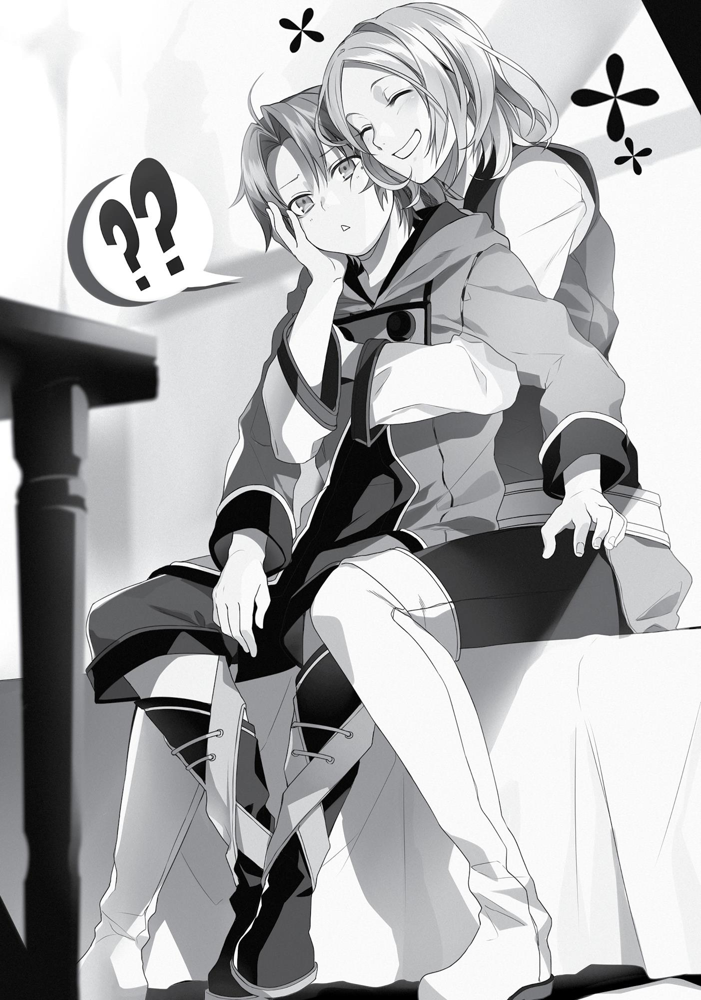

+++
title = "Chapter 7: To the Central Continent"
date = 2026-07-20
weight = 7
[extra]
volume = 5
chapter = 8
+++

After two months on the road, our party finally reached
the city of West Port. Its streets looked very similar to those of Zant
Port, the northern coastal city. It was, however, considerably larger.
The route between the capitals of the Holy Country of Millis and
the Kingdom of Asura was a crucial artery of commerce. Many towns
along its length served as bases of operation for merchants and
traders; West Port was one of the more prominent.
While it couldn’t compare to Millishion’s Commercial District, a
number of enterprises had their headquarters here, and the city’s
streets were packed with their subsidiary shops and businesses.
Now that we’d made it this far, it was time to say goodbye to
our horse and carriage.
In this world, there were no ferries that would carry land
vehicles across bodies of water for you. Just like when we left the
Demon Continent, we needed to sell off our means of transportation
here and then buy a new one on the other side.
Unlike that charming lizard, I hadn’t gotten too attached to our
horse, so I decided to give it a name at the very end. Farewell,
faithful Landbiscuit.
Once we’d sold off our friend, we headed straight over to the
checkpoint. This proved to be a very large building, unlike the one in
Wind Port. There were even soldiers in helmets and armor standing
outside the entrance.
Fully armored knights had been a pretty common sight in the
streets of Millishion as well. At a glance, their equipment appeared
to be very sturdy, but when I thought about what Eris or Ruijerd
could do, I wondered if it would serve much purpose. The people and
monsters of this world tended to pack some serious firepower. One
hit might be enough to smash off your fancy suit of armor and leave

you in your boxer shorts. Hell, the knockback might even send you
falling down a pit for an instant game over…
Okay, sorry. I’ll stop now.
Entering the customs building, we found it packed with people.
Many of them seemed to be adventurers, and many others were
dressed like merchants. A number of alert-looking clerks were briskly
processing their requests. It was a world of difference from Wind
Port, where the office had been mostly empty and the staff apathetic
at best.
I walked up to the nearest open counter. “Hello there.”
“Hello. How can I help you today?”
Once again, I found myself facing a receptionist with
impressively large breasts. In this world, there seemed to be some
sort of unwritten rule that clerks had to be stacked. Not that I made
any comments to that effect, of course.
“Uhm, I’m looking to secure my party passage across the sea.”
“All right. Please take this, then.” The woman handed me a
small wooden card with the number 34 engraved on it. This was
evidently quite the bureaucratic operation they had going here.
I headed back to the waiting area and took a seat. Eris dropped
down in the chair next to me, but Ruijerd stayed on his feet. When I
took a look around, there seemed to be plenty of other people
waiting for their number to be called as well. “Hmm. This seems like
it might take a while.”
“Aren’t you going to give them the letter?” asked Ruijerd.
I shook my head. “Not until they call our number.”
“Well, if you say so.”
Eris was already a little fidgety. Understandable, since waiting
patiently wasn’t exactly her specialty. After a moment, though, she
muttered “Rudeus, I think someone’s looking at me…”

I looked around the room more carefully this time, trying to spot
the person she was talking about. As it turned out, it was the guards.
Many of them were shooting brief glances over in Eris’ direction; and
she was glaring right back, of course.
“Please don’t start a fight with them, Eris.”
“I wasn’t planning on it.”
That was somewhat difficult to believe. In any case, you had to
wonder why they were looking her way. No plausible explanation
really came to mind. Were they just captivated by her beauty? Nah.
Eris was definitely growing prettier by the day, but she was still a kid.
Unless all of the knights working here were pedo scumbags, that
couldn’t be what was going on here.
“Number thirty-four, please come forward.”
Anyway, they’d finally called our number, so I stood up and
headed to the counter.
I explained to the receptionist that we wanted to book passage
to the Central Continent, and then handed over Ruijerd’s letter. She
took it from me with a polite smile, but when she looked at the name
written on the envelope, her expression grew somewhat dubious.
“Wait just a minute, please.” With that, she stood up and
walked off into the rear of the building.
After a little while, I heard a loud thump, and the sound of
someone shouting. An armored soldier soon hurried out from the
back, approached another guard, and whispered something in his
ear. That guard proceeded to run out of the office with a very serious
expression on his face.
All this struck me as somewhat ominous. I’d handed over that
letter because I trusted Ruijerd, but maybe it would have been
smarter to do a bit more digging on that Gash Broche character.
“Sorry to keep you waiting!”

The receptionist from before had returned. Her businesslike
smile couldn’t hide the tension on her face. “Duke Bakshiel says he’ll
see you now.”
I had an extremely bad feeling about this.
“I am Duke Bakshiel von Wieser, director of the Millis
Continental Customs Office.”
This hog bore a strong resemblance to a pig.
Whoops, my mistake. This man bore a strong resemblance to a
pig.
His neck was so enormously fat that his chin had disappeared
completely. His light blond hair was plastered to his forehead, and
there were huge bags underneath his eyes. He had the face of a
crafty, nasty old man.
He was also scowling at us with open hostility.
I’d seen a guy a lot like this way back in the day…every time I
looked into the mirror.
“Hmph. To think some filthy demon would be brazen enough to
bring me a letter like this…”
Duke Bakshiel was seated in a luxurious leather chair, which he
didn’t seem inclined to leave. It squeaked underneath him as he
tapped the piece of paper in his hand with a pen. There were
countless pieces of paper on his expensive-looking desk. Among
them, I spotted a familiar envelope, now torn open. Presumably, he
was holding its contents.
“You certainly chose an impressive name, I’ll give you that. And
that seal looked very real, as well. But I wasn’t born yesterday, my
friends! This is obviously a fake!”
Bakshiel tossed the letter carelessly over at us. I reached out on
reflex and caught it.

This man is of the Superd. Nonetheless, I owe him a great debt.
He is a man of few words, but noble in character.
Waive all customary fees and see him safely to the Central
Continent.
—Galgard Nash Vennik,
Commander of the Missionary Knights
One look at the name at the bottom left my head spinning.
What happened to Gash Broche? Who was this Galgard Nash Vennik
guy?
It took a few seconds for me to realize that you could shorten
“Galgard Nash” to “Gash.” Maybe he was the kind of guy who
introduced himself using a nickname? Ruijerd might have gotten the
impression that he really was just named Gash. Although that didn’t
explain the “Broche” part, of course.
More importantly, though… “Commander of the Missionary
Knights”?! Was he seriously the leader of one of the three holy
military orders?! This was giving me a serious headache. Why would
Ruijerd’s old acquaintance be such a major figure?
It did make sense, though, in some ways. The commander of the
Missionary Knights had to be pretty high-ranking in the Millis
hierarchy, right? It might not go over well if everyone knew a guy like
that was friends with a Superd. Maybe that was why he’d used a
false name.

Of course, there were simpler explanations for that too. It had
been forty years since Ruijerd first met the man. Maybe he’d married
into a powerful family and changed his name or something.
“In the first place, there’s not a chance that close-mouthed man
would write a letter like this. I know him well, and I know that he
detests putting pen to paper, even when it’s simply necessary. Do
you really expect me to believe he wrote this on behalf of some
lowly demon? What a farce.”
Ruijerd listened to all this silently with a conflicted expression on
his face. This man was asserting flat-out that his letter was a fake
simply because he was a Superd—or so it likely seemed to him. And
he might not be entirely wrong about that, to be honest. Paul had
warned me that this Duke Bakshiel was famous for his hatred of all
demonkind.
Surely this Gash, or Galgard, was aware of that as well, right? If
he knew what Bakshiel was like, he really should have written a
slightly more thorough explanation.
Was the man not really who he claimed to be, then?
No, no. Remember what Ruijerd told you.
He’d met Gash in a building big enough that he compared it to
Kishirisu Castle. That would be very large for a home or mansion, but
what if it was the headquarters of the Missionary Knights? That
would likely be a large building, with many knights inside it at all
times…and if Gash was the commander, all of those knights would be
his subordinates. That would explain why Ruijerd said he had “many
men.”
Of course, figuring all that out wasn’t particularly helpful at the
moment. Duke Bakshiel had already made up his mind that this letter
was a fake. Since things had come this far, saying “Yes, it’s a fake!
Sorry about that!” wasn’t going to end well for us.

I took a step forward. “In other words, you believe this letter to
be a forgery, sir?”
“Who are you supposed to be?” said Bakshiel, looking at me
suspiciously. “I don’t have time to prattle with children.”
Wow. This was kind of a new feeling, in a way. It had been a
long time since anyone was this condescending to me, you know?
When I wanted to be treated like a child, people treated me like a
grownup. But when I wanted to be treated like a grownup, people
treated me like a child. What a nuisance.
Keeping these thoughts to myself, I put my right hand to my
chest and bowed in the style of the Asuran nobility. “My apologies,
sir. Allow me to introduce myself. My name is Rudeus Greyrat.”
Bakshiel’s brow twitched slightly. “Rudeus…Greyrat, you say?”
“That’s correct. While I blush to admit it, I am a small, unworthy
part of the same Greyrat clan that is counted among Asura’s high
nobility.”
“Hrm. But the Greyrat families use the names of the ancient
wind gods to distinguish themselves, do they not?”
“That is true, sir. I belong to a branch family, and therefore have
no right to use one.” The instant the words “branch family” left my
mouth, I could see the caution in Bakshiel’s eyes give way to disdain.
But before he could say anything, I indicated Eris with the palm of my
hand. “However, Lady Eris here is a trueborn member of the Boreas
Greyrat family.”
When I clapped her lightly on the back, Eris took a step forward
as well. She looked at me in surprise for a moment, but didn’t panic.
At first, she folded her arms and spread her feet to shoulderwidth, but quickly realized that wasn’t right. Her second impulse was
to reach for the edges of her skirt so she could curtsy; unfortunately,
she wasn’t wearing a skirt. She finally settled on putting her hand to
her chest and bowing as I had.

“I am Eris Boreas Greyrat, daughter of Philip Boreas Greyrat. A
pleasure to acquaint you, sir.”
Her delivery was a little stiff. Also, I felt like she’d messed up
that last bit.
I glanced over at Bakshiel’s face. It was hard to tell how he was
taking this, but…whatever. We’d just have to lean hard on the
influence of Eris’ family here.
“Hmph. And what is the daughter of an Asuran noble doing
here, pray tell?”
That was certainly the obvious question at this point.
Fortunately, there was no need for us to answer it with anything but
the truth. “Sir, are you familiar with the calamity that befell the
Fittoa Region some two years ago?”
“Of course. Many Asurans were teleported all around the world,
as I understand.”
“That’s correct. The young lady and myself were two of those
affected.”
As I explained it to Bakshiel, I had escorted Eris all the way
across the Demon Continent with Ruijerd as our hired bodyguard.
When crossing over to the Millis Continent, we’d barely managed to
afford the voyage by selling all our assets, but we didn’t have enough
funds to pay for the journey from Millis to the Central Continent. In
particular, the cost for Ruijerd’s passage was simply too high.
Accordingly, we’d turned to Sir Galgard for help, as he both was
an old acquaintance of the Greyrat family and a personal friend of
Ruijerd’s. He had been kind enough to write us a letter.
This story wasn’t quite the truth, of course. But it felt close
enough.
“The young lady may be dressed as an adventurer at the
moment, but that’s solely because we didn’t want any ruffians

realizing that she’s of noble birth. I’m sure you can understand the
potential dangers, Duke Bakshiel.”
“I see,” said Bakshiel, the expression on his face still sour. “So
that’s how it is. You’re in league with that ‘Fittoa Search and Rescue
Squad’ that’s been causing no end of trouble in Millishion recently,
are you?”
“Uh…what? No, no. What are you talking about, sir?”
“I’ve never heard the name Eris Boreas Greyrat before,” said
Bakshiel with a distinctly swine-like snort. “However, I am familiar
with a certain Paul Greyrat—a thuggish little man who’s supposedly
taken to stealing slaves by force.”
Oh, lovely. Daddy’s got a real reputation.
“Let me make sure I understand you, Duke Bakshiel. You believe
that Sir Galgard’s letter is a forgery and Lady Eris is not truly a
member of the Asuran nobility, yes? And you take us for mere
lackeys of this worthless lecher Paul Greyrat, who drinks all day,
lashes out at his own son, has smelly feet, and causes his poor
daughter no end of worry?”
“Indeed.”
Honestly now, what a terrible thing to say. Paul was trying his
best out there. To be sure, he had his flaws, and some of his methods
might be less than perfect. But to dismiss him as “worthless”? Now
that was just offensive!
“May I ask why you concluded that the seal on our letter was
inauthentic?” I said, pointing to the envelope on Bakshiel’s desk.
The man frowned slightly and nodded. “It’s not uncommon for
forgeries of the Missionary Knight’s seal to circulate on the black
market.”
Really? That was the first I’d heard of it. “And why do you think
that my employer, Lady Eris, is not who she claims to be?”

“Pah. Did you really expect me to believe this rustic boor of a
swordswoman was the daughter of an Asuran noble?”
I glanced over at Eris, who’d assumed her usual cross-armed
pose. While her arms weren’t marked by any scars, they were tanned
and more tightly muscular than your average young adventurer’s.
Not exactly what you’d expect from a sheltered little princess, to be
sure.
“Ah,” I said with a small snort of laughter. “It appears you’re not
familiar with Sir Sauros, then.”
“Sauros? You mean the lord of the Fittoa Region?”
Apparently he recognized that name, at least. Good. “I do. He’s
also Eris’ grandfather, and the man who chose to nurture her talents
with the sword from a young age.”
“What? Why would he do such a thing?”
“This is something of a family secret, but…it was decided some
time ago that Lady Eris would marry into the Notos family. And Sir
Sauros detests the current head of that house.”
“I see.”
Just to be perfectly clear, I was implying that Eris had been
trained into a savage little warrior so that she might one day murder
the head of the Notos family in his bedroom. Fortunately, Eris
seemed puzzled by my words. If she’d understood what I was saying,
I would probably have lost a few teeth at this point.
“For that reason, among others, the young lady must return to
Asura. Should you insist that she’s an impostor, we’ll simply have to
turn back to Millishion and file an appeal with the appropriate
authorities.”
I had no idea who those appropriate authorities would even be
in this case, of course. It wasn’t something I’d bothered looking into.

“Hmph. If you want me to believe all this, then show me some
sort of proof.”
“Sir Galgard’s letter is surely proof enough.”
“This is absurd. You’re arguing in circles.”
“So what if I am? Look, Duke Bakshiel, do you really want to
make an enemy of the Asuran Greyrat family?” Crap. I don’t even
know what I’m saying anymore.
Fortunately, the threat I’d blurted out did seem to have some
sort of an effect, judging from how sharply Duke Bakshiel was glaring
at me.
“Very well then. I’ll permit you and the young lady to book
passage, then.”
“But our guard—”
“By my authority as a duke, I will assign a few knights to escort
you. Surely that would be preferable to the protection of
this…demon.”
Compared to granting a demon passage, Bakshiel preferred to
loan us a couple of his own men. He seemed stubbornly determined
not to let Ruijerd through, no matter what. I hadn’t seen this sort of
thing with my own eyes before, but the discrimination against
demonkind on this continent was evidently worse than I’d imagined.
What options did we even have at this point? Should we just try
to arrange passage for Ruijerd separately? I could easily see that
resulting in another bloody battle against a group of smugglers. It
really didn’t feel too appealing…
But just as I was considering my response, there was a sharp
knock at the door.
“What is it? I’m in the middle of something,” said Bakshiel,
looking a bit suspicious.

The person outside didn’t wait for permission to enter. The door
swung open, and a blond woman in blue armor stepped into the
room.
“Pardon me. I was told that a certain ‘Dead End Ruijerd’ was in
here.”
“…Mother?”
It was Zenith.
“Huh?!”
Everyone else in the room turned in unison to look at her.
The woman stared down at me, looking somewhat miffed. “I’m
a single woman. I don’t have any children, let alone one as old as
you.”
Say what? Come on now, Mom. Did you lose your memory
since the last time I saw you? Oh, maybe she just got sick of Paul’s
nonsense…
As I looked more closely at the woman, though, I began to
notice a few details in which she differed from my mother. After
years apart, I couldn’t remember Zenith perfectly…but the shape of
this woman’s face and the color of her hair were very subtly
different. It wasn’t her after all. “I’m sorry. My mother’s missing, and
you look a great deal like her.”
“…I see.”
Great. Now she was looking at me with pity in her eyes. Maybe
she’d pegged me as a lonely lost child or something. People didn’t
treat me like a kid too often these days, but I still looked like one, at
least.
With a snort, Duke Bakshiel glared at the armored woman.
“Well, if it isn’t our freshly-demoted Temple Knight. Did you need
something from me?”

“A Superd has appeared in Millis territory. Any diligent member
of my order would come running at that news.”
“You don’t assume your post here for another ten days. Don’t
stick your nose where it doesn’t belong.”
“Where it doesn’t belong? What a strange thing to say, Duke
Bakshiel. To be sure, I haven’t yet officially assumed my duties here,
but my predecessor has already departed for Millishion. When
problems arise at a checkpoint, it’s the Temple Knights’ responsibility
to address them, correct? And yet I seem to be the only Temple
Knight in this room. Would you care to explain that?”
This diatribe left the man at a loss for words. He stammered
slightly, his face a bit pale.
“A team of two leaders should oversee the defense of every
customs post. That is an ironclad rule established by the Millis
Church, Duke Bakshiel. Surely you don’t intend to defy it?”
“Of course not. I only thought… Well, you’ve only just arrived
here. Why not take a few days to relax and grow accustomed to the
city?”
“That won’t be necessary.”
From the look on Duke Piggy’s face, you might have thought he
was in line to be slaughtered. I was really going to enjoy the next
time I got to eat some pork.
“Now then. Could you explain what was being discussed here?”
All in all, it seemed like this lady knight was on equal footing
with Bakshiel here. Normally a duke would be at the very top of the
aristocratic pecking order, but in the Holy Country of Millis, the
Church was extremely powerful in its own right. That system
probably had something to do with this.
“Well, as it happens…”

Duke Bakshiel proceeded to summarize the situation. At times,
he threw in remarks based solely on his own assumptions, so I had to
interject with a few corrections.
The knight listened to the whole story in silence, then looked
over our party.
“Hm. That man certainly is a demon, isn’t he…?”
She narrowed her eyes while studying Ruijerd, but as she turned
to Eris, her expression instantly softened.
Finally, she met my gaze…and put a hand to her chin
thoughtfully.
“Young man, you thought I was your mother, yes? Might I ask
her name?”
“It’s Zenith. Zenith Greyrat.”
“And your father’s?”
I glanced over at Bakshiel. Man, this was going to be awkward…
“Paul Greyrat.”
Understandably enough, the duke’s eyes went wide. I’d just
have to insist that my father was a totally different person, not that
scumbag back in Millishion. My daddy was basically a saint. He’d
even give you money if you punched him a few times.
“I see,” murmured the knight. And then, for some reason, she
squatted down and wrapped her arms around me.
“Huh?!” This came as something of a surprise, to say the least.
“I can’t imagine what you’ve been through…” Not only was she
hugging me, now she was stroking my head as well.
This wasn’t the softest of embraces, thanks to that thick armor
she had on, but at least I was getting a nice whiff of feminine
fragrance. Naturally, my little buddy downstairs…didn’t even twitch.
Huh.

What’s the matter, my boy? I thought you loved the smell of a
slightly sweaty woman. Why, just the other day it only took one whiff
of Eris to get you going…
Glancing over at the young lady in question, I found her staring
at us with her eyes wide open and her hands clenched into fists. Talk
about terrifying.
“Um…miss?”
After patting me on the head a few times, the knight rose to her
feet once again. And instead of looking in my direction, she turned
back to face Duke Bakshiel. “I’ll take these three under my personal
protection.”
“What?!” sputtered Bakshiel. “One of them is a demon,
woman!”
Keeping him in the corner of her eye, the knight snatched
Ruijerd’s letter from my hands and quickly looked it over. “This letter
is authentic, incidentally. I recognize Sir Galgard’s handwriting when I
see it.”
“Would you ignore the teachings of the Millis Church
completely? What sort of Temple Knight are you?”
At this point, Eris let out a little “Oh!” The lady knight turned
toward her for a moment and winked.
…I was starting to feel completely lost.
“I’m a captain of the Shield Company. And I’m quite serious
about this.”
“Pah! A captain demoted for losing her entire unit!”
“Hmph. Aren’t your own circumstances somewhat similar? No,
my mistake. I at least completed my mission, whereas you simply
abandoned your duty.”
Duke Bakshiel ground his teeth together and growled. From the
sound of things, he’d been sent here as some sort of punishment as

well. Once you knew that little detail, his grand title actually seemed
more pathetic than intimidating. There was something like real
hatred in his eyes now.
“Look, woman. I don’t care how powerful your family is. This
sort of insolence will not—”
Bakshiel wasn’t able to finish his sentence. Halfway through it,
the knight had bowed her head to him.
“I apologize. My words were uncalled for. Since I’ve been
assigned here, I have no desire to put myself in conflict with you.
However, this particular matter was of personal significance for me. I
hope you’ll forgive my rudeness.”
It was seriously impressive timing. She’d fired off everything she
wanted to say, but then apologized at once. You could see the anger
on Bakshiel’s face fading. I’d have to try and imitate her next time I
really pissed someone off.
“Personal significance?”
“Yes,” said the knight, with a small nod to her dubious
colleague. She then dropped a hand onto my shoulder.
“This boy is my nephew, you see.”
Pardon?!
Therese Latria was the fourth-born daughter of the Latria family,
a cornerstone of the Millis nobility. She was also a highly promising
knight who’d won the rank of captain in the Temple Knights at a
remarkably young age.
Count Latria was her father. And Zenith Greyrat was her sister.

One he learned that I was a blood relative of Therese, Duke
Bakshiel’s face took on a resigned expression. With a reluctant sigh,
he agreed to waive the fare for my party’s passage to the Central
Continent.
At the moment, I was in an inn in West Port, wrapped in
Therese’s arms.
Only Eris, Therese, and myself were in the room at the moment.
Perhaps sensing it might make things awkward if he stayed, Ruijerd
had slipped away for the moment. “You know, Rudeus, my sister told
me all about you in her letters.”
“Did she really? What did she say about me?”
“That you’re adorable, mainly. I can’t say that was the first word
that came to mind when I saw you in that office, but now I get it.
You’re cute as a button, all right!” Even as she spoke, Therese was
nuzzling her face affectionately against the back of my neck.
This was a bit of an unusual experience for me. Over the last
thirteen years, quite a few people had described me as “creepy,”
“impudent,” or “suspicious,” but Zenith had to be the only one
who’d ever called me cute.
In any case…despite the fact that I was currently being
embraced by a beautiful woman with large breasts, for some strange
reason the railgun between my legs wasn’t ready to fire off any
coins.
Now that I thought about it, my Victory never did ‘Stand Up’ for
Zenith, either. And I’d never felt any interest in getting more friendly
than necessary with Norn. Was that just because they were my
relatives?
“Therese, can you let go of Rudeus already?”

Eris watched us with her chin propped on one hand, drumming
her fingers irritably against the table. Was this a bit of jealousy,
perhaps? It wasn’t easy being such a playboy…
“I can understand how you feel, Miss Eris, but there’s no telling
when I’ll see Rudeus again. And by the time we’re reunited, he’ll
most likely have lost all vestiges of the cuteness he now possesses.
My sincerest apologies, but I’d like to make some memories with him
while I can.” Therese proceeded to nuzzle me even more vigorously
than before, showing no signs of contrition whatsoever.
“Can I ask why you’re speaking so politely to Eris?”
“Because I owe her my life.”
Now that piqued my interest.
On the day Eris went out to hunt Goblins near Millishion, she’d
apparently rescued Therese from a group of assassins who’d
surrounded her. Therese had been on duty defending a certain
“important personage” at the time; if Eris hadn’t shown up when she
did, both Therese and her charge would have lost their lives.
This was all news to me. When I looked over at Eris, she had a
slightly embarrassed expression on her face. “Sorry. I forgot to tell
you about any of this…”
From what Eris told me, once she got back to the inn and saw
how depressed I was, she’d forgotten all about everything else that
had taken place that day. It was basically my fault, huh? In that case,
I couldn’t really complain.
Therese was still groping me like crazy, incidentally. Since she
was sitting behind me it was hard to say for sure, but I’d bet the
woman had a pretty blissful expression on her face. This didn’t
nauseate me or anything, but it was definitely kind of awkward. I
mean, I had a lady pressing her breasts against me and playing with
my body, and I wasn’t remotely excited. It was a very…unfamiliar
feeling.

“Seriously, though. You are just too cute, Rudeus. I could just eat
you up!”

“Sorry, does that mean you want to sleep with me?”
Therese’s response to this modest attempt at humor was to
cover my mouth with her hand. “You’re definitely cuter when you
stay quiet. Hearing you talk brings Paul Greyrat to mind.”
It seemed as if my aunt wasn’t a big fan of my dad. Petting me
like a puppy, she went ahead and changed the subject.
“Anyway…Commander Gash never changes, huh? He must have
known how Duke Bakshiel would react to a letter like that, but he
went ahead and wrote it anyway.”
Galgard Nash Vennik was, in fact, the man in command of the
Missionary Knights of Millis. This order was essentially a mercenary
force that dispatched young knights to turbulent regions of the
world, where they could gain real combat experience while also
spreading the teachings of the Millis Church. At present, they were in
between campaigns, and had returned to Millis to bolster their ranks
with new recruits.
Ruijerd’s buddy Gash, a.k.a. Galgard, had been their leader for
some time now. He’d survived a disastrous expedition to the Demon
Continent as a young knight, and in the decades since, he’d reshaped
his order into the strongest force it had ever been. He was a brusque
and quiet man who rarely so much as smiled, but he was also known
for his fairness and impartiality towards even the worst of villains.
In Millis, no one was considered to be a full-fledged knight until
they’d experienced at least one expedition with the Missionary
Knights. These campaigns were often highly dangerous. But with
Gash in charge, more than ninety percent of the young knights
dispatched now returned alive. This was the reason many hailed him
as the greatest commander the order had ever known. Every knight
in the three holy military orders respected Gash deeply. Many even
owed him their lives.
“Of course, he’s also famous for writing little and saying less.”

On the battlefield, he would snap off orders quickly and
precisely, but at most other times he was too apathetic to even
return an officer’s greeting. He almost never wrote letters of any
kind, and merely rubber-stamped reports that others wrote. So few
people had ever seen his handwriting that fake documents routinely
circulated in his name.
Ruijerd had described him as a talkative and passionate man.
But of course, Ruijerd was pretty close-mouthed himself. Maybe his
standards for “talkative” differed from ours…or maybe Gash just
acted differently around him.
“Okay, look,” interrupted Eris. “Are you ever going to let go of
him?”
I could see the girl was about five seconds from snapping at this
point, so I finally slipped out of Therese’s grasp.
“Aww…my nice warm Rudeus…” My aunt looked mildly
heartbroken, but I wasn’t her body pillow. And it’s not like I was
really enjoying the experience, anyway.
“Come here, Rudeus!”
Just as ordered, I sat down next to Eris. She promptly grabbed
hold of my hand.
“Um…”
Within seconds, the girl was blushing to the tips of her ears.
Staring at the side of her face as she glared forward, I couldn’t help
smiling.
Therese, on the other hand, was busy punching a pillow on the
bed. Understandable, but why not punch the wall instead? That’s
much more satisfying, in my experience.
“Hah…enjoy your youth while you have it, kids.” Therese shook
her head with a sigh, then looked at us with a more serious
expression. “Right. There’s one thing I wanted to warn you about,

Rudeus. It might not matter too much, since you’re about to leave
Millis, but I think you need to be aware of it.”
She paused for a moment after this long lead-in, and then
continued firmly: “You’d be smarter not to mention the word Superd
within this country’s borders.”
“Why’s that?”
“One of the Millis Church’s older teachings holds that
demonkind should be totally expelled.”
Specifically, this meant that all demons should be driven from
the Millis Continent. It was currently something of a dead doctrine
that few took seriously, but the Temple Knights were still striving to
put it into practice. And of course, the Superd were particularly
infamous, even among the demonic races. If word got around about
one moving through Millis, the Knights would come after him with
everything they had—even if he wasn’t really what he claimed to be.
“Given everything that he’s done for you and Eris, I have to
make an exception in his case. But ordinarily, I wouldn’t have
overlooked this.”
“Don’t be ridiculous,” said Eris coldly. “You’d never beat Ruijerd
in a million years, no matter how many people you threw at him.”
“I suppose you might be right about that, Miss Eris,” said
Therese, smiling wryly. “But the Temple Knights are a bunch of
fanatics, I’m afraid. Myself included. We’d fight that battle, even if
we knew we didn’t stand a chance.”
There were apparently quite a few people like this among the
Holy Knights of Millis. And so, she emphasized, we should be very
careful if we ever happened to return to this continent.
This whole incident really drove home just how deep-seated
humanity’s prejudices toward demonkind were. I felt like it might be
tough to work on the reputation of the Superd from here on out.

Also, should anyone learn that I venerated Roxy like a god, I
might end up getting tortured by some heavy-breathing inquisitor or
something. It was probably best to keep my personal religion to
myself.
Our trip across the sea went smoothly this time around.
My aunt made sure we were well-prepared for the voyage. Not
only did she provide all the provisions we’d need, she even got us
some sort of medicine for seasickness. I was under the impression
that medicine was kind of a neglected field in this world, but
evidently, they didn’t rely on Healing magic for everything. There
were remedies for this sort of illness, at least.
That said, such medicines didn’t come cheap. Good thing I had
relatives in high places.
Therese took particular care to accommodate Eris’ every need.
There was always some hostility in her eyes when she looked at
Ruijerd, but what can you do? People don’t change their whole
perspective on the world overnight.
Thanks to the medicine Therese had procured, Eris spent most
of our voyage mildly uncomfortable rather than completely
miserable. Which meant she wasn’t begging me to use Healing on
her all the time.
To be perfectly honest, that was a little disappointing. I’d been
hoping to see her all meek and mild again. But on the plus side, my
super meter didn’t charge up, I never unleashed my Buster Wolf, and
Eris didn’t need to hit me with a Sunny Punch. It was business as
usual.

Eris did seem to be a bit anxious after last time, though, since
she stuck to me like glue once we got on the boat. She definitely
wasn’t “meek” at any point, but at least I got to see her hopping
around in delight as we looked out at the sea. That was good enough
for me.
One of the sailors did take the opportunity to tease us, though.
“Hey there, lovebirds! You two getting hitched in the King Dragon
Realm or what?”
“You bet,” I said, putting an arm around Eris’ shoulders with a
grin. “It’s going to be one crazy wedding.”
At this point, Eris punched me in the face. “I-It’s way too early
for us to get married, stupid!”
Despite the violence, she didn’t seem too displeased by the idea
itself, judging from the way she fidgeted around afterward. The
“public teasing” part was probably the main issue.
If I wanted to bring up this subject, it should be in a nice, quiet
place, with just the two of us, and only once the right mood had
been established. Eris was a monster of a swordswoman by now, but
she was still an innocent maiden when it came to romance.
Still…marriage, huh?
Philip and the others had certainly tried to push the two of us
together. But now, nobody even knew where they were. Paul did say
not to be too optimistic…
It wasn’t just Philip, Sauros, and company, of course. Zenith,
Lilia, and little Aisha were still missing, too. There was no news of
Sylphie, either. Heck, we didn’t even know if Ghislaine was still alive.
There were so many reasons to be anxious.
Still, I couldn’t let myself sink into pessimism. By the time we got
back to Fittoa, maybe everyone would be waiting for us there, safe
and sound.
