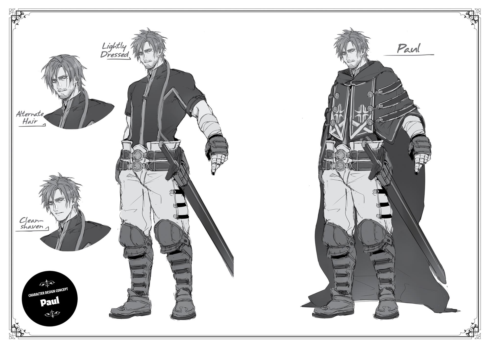
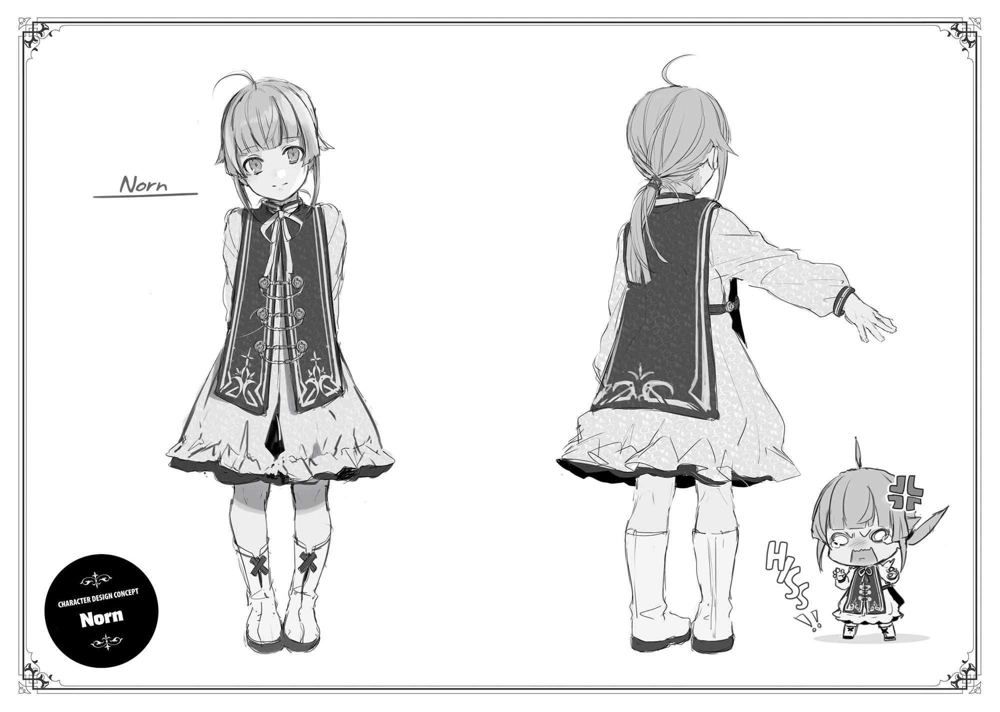
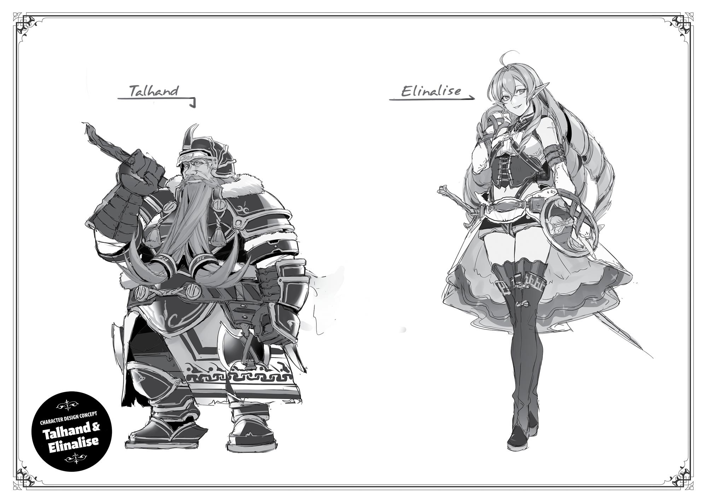

+++
title = "Extra Chapter II: The Death of Ariel"
date = 2026-07-20
weight = 10
[extra]
volume = 5
chapter = 11
+++

The name’s Gustaf. I’m a humble information broker living
in the city of Ars, capital of the Kingdom of Asura.
When I say “humble,” that doesn’t mean I’ve got a low opinion
of myself. It’s fair to say I’m damn good at what I do, in fact. For the
right price, I can find out anything you want to know about anything
that took place inside Asura’s borders.
One day not too long ago, I happened to catch wind of a certain
rumor.
It went something like this: The Second Princess Ariel Asura had
been murdered by unknown assailants while en route to enroll at the
Ranoa University of Magic.
Clever boy that I am, I quickly realized that this bit of “news”
was being deliberately spread around the city by Prince Grabel,
Ariel’s most bitter rival.
About a month earlier, Ariel had left Ars, ostensibly to go study
abroad. Her departure had been a quiet one. Given her popularity
with the citizens of the capital, any attempt at a grand farewell
parade might have gotten totally out of hand. This, supposedly, was
why she’d slipped out of the city in secret. Her retinue, including
both guards and attendants, numbered only seventeen. This was a
very small escort for a royal princess. But since it included both the
infamous playboy Luke Notos Greyrat and the highly conspicuous
bodyguard known as “Silent Fitz,” my information network quickly
brought me news of their departure.
By that point, of course, rumors were already proliferating that
Ariel had been sent into exile after losing a power struggle in the
royal court. And now, a few short weeks later, we had this new piece
of hearsay making the rounds.

If the princess truly had been assassinated, the word had gotten
around very quickly. It would be one thing if there was some witness
who could name the perpetrators, but instead, we had “unknown
assailants” and an anonymous source. The fact that such a flimsy
rumor was spreading around town so quickly seemed proof enough
that it was being spread deliberately.
As a professional purveyor of accurate information, I was
tempted to dig around and uncover the truth. However, the last
thing I wanted was to catch the attention of whichever scheming
noble was responsible for this situation, so I decided to keep myself
in the dark on this one.
However…a little while after the rumor of Ariel’s death had
begun to spread, a certain individual paid me a visit.
This man knew of me, and my reputation as a first-rate
information broker. And I recognized him as a retainer of Pilemon
Notos Greyrat, leader of Princess Ariel’s faction among the nobility.
His main role was to provide his lord with up-to-date intelligence. Of
course, he came to see me in disguise and gave a false name, but he
might as well not have bothered.
He seemed to regard me as a suspicious character at first, and
spoke to me in a pretty condescending way. When I finally told him I
knew exactly who he was, though, he bowed his head to me and
presented me with a job offer.
Specifically, he wanted me to find out if Princess Ariel was really
dead.
That came as one hell of a surprise, honestly. I never would have
guessed that Ariel’s own allies had lost all contact with her faction
and didn’t even know if she was safe. Even a clever boy like me can
get a bit bamboozled now and then. I’d initially chosen to steer clear
of this whole mess…but I decided to take the job anyway.
Why, you might ask?

Well, because the money was damn good, of course.
I started off by retracing Princess Ariel’s steps.
After leaving the capital, her party had traveled straight north,
in the direction of Ranoa. I’d considered the possibility that she’d
fled in a totally different direction after spreading lies about enrolling
at the University of Magic, but that didn’t seem to be the case.
As I followed Ariel’s trail and gathered information, it soon
became clear that a group of pursuers had been hounding her. Some
people reported seeing suspicious black-clad characters right around
the time the princess’ party was passing through their town, and
Ariel seemed to have lost an escort or two by the time she reached
the next town along her route.
This wasn’t unexpected, though. If the trip had gone smoothly,
her allies back home wouldn’t have been frantically looking to get
word of her safety.
Despite losing one guard after another, Ariel nonetheless
pushed steadily northward. With her retinue reduced to ten, she
finally reached the checkpoint at the northern border. This was a
solid, well-guarded facility that pressed up against a large forest just
south of the valley known as the Red Wyrm’s Upper Jaw.
Here, I was able to obtain a useful bit of eyewitness testimony
from a man who remembered Ariel’s arrival very clearly.
Border Control Officer
Smily Gatlin’s Statement

I was in a lousy mood that day. Not that it was any
different from any other day, in that respect. After all, at the time I
felt my job was totally beneath me.
Hmm? What’s my job exactly, you ask? Well, it’s mostly tedious
busywork. I check the passes of travelers seeking to leave Asuran
territory. Sometimes, I might search them or their belongings for
contraband. But, of course, the vast majority of those passing
through this checkpoint are either adventurers, mercenaries, or
merchants who want to do business up north for some strange
reason. Most of the merchants have valid passes, and the
adventurers are permitted to simply use their Guild cards instead.
Mercenary bands and first-time travelers need to go through a
formal inspection process before their passes can be issued, but
that’s not my job. I simply direct them to a different officer. And
unless you’re some sort of notorious criminal or something, you
usually get your documents soon enough. We’re not too strict about
these things on this side of the checkpoint. Far more people want to
enter Asura than to leave it, after all.
Technically, I’m also responsible for stopping criminals who try
to cross the border using falsified documents, but the rough stuff
isn’t my department, either. The soldiers deal with problems of that
nature.
As I said before, however, it typically isn’t very hard to get a pass
unless you’re a major criminal. People of that ilk are typically on the
wanted list. Rather than risk visiting a checkpoint, they usually turn
to smugglers to get them across the border. And of course, hunting
down and eradicating smuggling rings isn’t in my job description,
either.
I found my work painfully dull and completely unrewarding. No
matter how hard I tried, I knew I would never earn any recognition

here. The thought of growing old in this place made me utterly
miserable.
It didn’t help that I wasn’t on the friendliest of terms with the
soldiers who were essentially my coworkers. I regarded them as
imbeciles, and they thought of me as a pathetic pansy with an
oversized ego. The fact that our chains of command were completely
separate only made things worse.
I was a man who’d graduated from a prestigious aristocratic
academy in the capital. My talents were clearly being wasted in this
backwater…or so I sincerely believed, at the time.
Princess Ariel’s party arrived at about noon, as I recall.
At first, all I saw was a luxurious two-seater carriage
accompanied by seven guards on foot. Counting the driver up front
and the two potential passengers inside, it seemed to be a group of
ten in total.
My initial thought was that an aristocrat was engaging in some
sort of sightseeing expedition. However, this was the border of the
Kingdom. Beyond this checkpoint lay only the dangerous foreign
lands known as the Northern Territories, plagued by snow and
monsters. Nobles did sometimes pass through on their way to far-off
places, but they would always bring at least three carriages and
twenty guards or more. Perhaps you could make do with less if you
hired an elite band of adventurers, but this party didn’t strike me as
a group of battle-hardened warriors. All of them were dressed for
the road, but some were clearly not accustomed to long journeys,
and others looked rather scrawny for bodyguards.
Perhaps it wasn’t a sightseeing trip, then. Was it possible they
had some business at this checkpoint itself? You could never
discount the possibility of an incognito inspection from some highranked lord.

For the time being, I decided to proceed as usual. “May I see
your pass, please?”
“Here you are.”
The response to my inquiry came from a young man standing at
the very head of the group. He was remarkably handsome, even to
my eyes, but there were clear signs of exhaustion on his face. In
particular, the dark circles under his eyes stood out.
It was at this moment that I first sensed there might be
something odd going on here.
There were no issues with the pass itself. It was a genuine
document issued by the Kingdom of Asura, stamped with a valid
Notos family mark. Everything was perfectly in order. I would
normally have waved them through the gate without a second
thought.
But something about the handsome young man’s face made me
hesitate. I could have sworn I’d seen it somewhere before. In
hindsight, this was because he was Luke Notos Greyrat, the famous
guardian knight of Princess Ariel. I suppose I couldn’t place him
because I’d never seen him at such close range before.
In any case, I made it a professional habit to detain anyone who
seemed vaguely familiar to me. Most of the faces I’d recently
committed to memory came from depictions of wanted criminals,
after all. “My apologies, but may I take a look at the inside of your
carriage?”
At my words, a number of soldiers who’d been standing around
the checkpoint moved to block off the exits. We weren’t on the
friendliest of terms, true, but they always performed their duties at
times like these. Several of the guards around the carriage grew
visibly tense at this development. I stiffened slightly myself,
wondering if I really was dealing with some gang of bandits.

The handsome young man shook his head slowly. “Due to
certain extraordinary circumstances, the passenger within must have
complete privacy.”
There was no way that was going to fly, of course.
When I repeated my demand in somewhat harsher terms, the
young man’s face contorted into a bitter grimace. A number of his
companions—the ones who seemed more accustomed to travel,
specifically—also glared at me and put their hands on the swords
they carried. Their movements weren’t as quick as those of master
warriors, but I had the feeling they’d experienced their fair share of
combat.
In particular, the white-haired, short-statured boy who stood
right behind the handsome leader was actually quite intimidating.
The only weapon he carried was a small rod of the sort beginners
used to practice basic magic, but something about the way he held
himself suggested that he was a truly lethal fighter with the wariness
of a seasoned veteran. I suppose he must have been that “Silent Fitz”
character. I don’t think I’ve ever been so frightened of a boy less than
half my age.
My experience told me that a group like this could cause
significant harm to our garrison. Should I order the soldiers to seize
them now, or was there some other option?
As I hesitated, someone spoke from within the carriage. “Stop
this, Luke.”
It was a voice like gold. The sound of it turned my brain to mush.
There was something almost hypnotic about it, I believe. In that
moment, I truly wanted to listen to it forever.
It was a voice I’d heard once before—a voice I recognized.
I’d heard it ten years earlier, at my academy’s graduation
ceremony in the capital, as a certain personage offered a speech of
congratulations to our valedictorian. Brief as that address had been,

I’d never forgotten it. Never. Back then, I think nearly every single
graduate in that room had cursed themselves for not having studied
harder.
“These men are simply being diligent in their duties.”
When the door of that carriage opened, I felt a great shiver run
down my spine.
I couldn’t have forgotten her if I tried.
I remembered clearly, even now, the young princess who’d
attended our graduation ceremony as an honored guest. I
remembered the joy I’d felt at the prospect of serving her and
serving this kingdom. I remembered how privileged I’d felt to be
joining this proud country’s ranks.
I’ll remember her until the day I die.
“M-my apologies, Your Highness…”
Even as a child, that golden-haired princess had been dazzlingly
beautiful, and now she stood before me far lovelier than before. I
went down on one knee instantly, without conscious thought.
There was no doubt about it whatsoever. This was the Second
Princess of the Kingdom of Asura, Ariel Anemoi Asura—the most
beloved member of the royal family, who regularly appeared at
events around the capital and advocated for its citizens. Many of the
soldiers stationed here had likely at least caught a glimpse of her
from a distance at some point in the past. But this was surely the first
time any of us had seen her at such close range.
“There’s no need for that. As I recall, there’s a law that no one
serving at a border post ever has to kneel in the course of their
ordinary duties.”
With those words, the princess stepped out of her carriage.
Nearly all of the soldiers around us had followed my example
and gone down on one knee. But as Princess Ariel pointed out,

barring some sort of special circumstances, no one on duty here was
ever expected to kneel. I don’t know exactly why, but it’s been that
way for many, many years. Since starting at this place, I’ve never
kneeled to anyone, no matter what their rank. This was also the first
time I’d seen any of the soldiers do so. And no one had ever rebuked
or challenged us on that.
But of course, the fact that it wasn’t required didn’t mean it was
forbidden. We stayed as we were, and bowed our heads toward
Ariel. It simply felt like what we ought to do.
“P-Princess Ariel, I…feel it is my duty to ask…why you’ve come
to a border crossing such as this with such a small retinue.”
“You weren’t told anything in advance?”
I knew there had to be something strange going on here, of
course, and when I searched my memory based on what Ariel said,
an event from about a month before this flashed through my mind.
The individual in overall command of this checkpoint was not
myself, of course, nor was it my direct superior, the Senior Border
Control Officer. It was a noble who also served as the mayor of a
nearby town, the closest place where travelers could find lodgings.
The man could go months without showing his face here, but he’d
ride over to give us a few orders when he felt the need.
On his last visit, he’d told us: “Within the next few months, a
certain very noble personage may pay us a visit here.” Based on the
phrase “noble personage,” I’d imagined this would involve dozens of
carriages surrounded by swarms of attendants, so I hadn’t even
remembered the incident until I actually saw the princess.
“I was told that a very noble personage might be coming, yes…”
“And was that all you were told?”
Her question brought my memory of that moment into clearer
focus. The man had, in fact, continued: “This personage will most
likely be seeking to cross the border and flee to the north. However,

you mustn’t allow this. Find a reason to hold their party back, and
keep them waiting in town for several days.”
I’d been ordered not to let her through. To stop her here.
In other words, to ensure her death.
This wasn’t the first time we’d received an order of this sort. It
was relatively common for nobles who’d blundered badly in the
capital to try and flee north, and in such cases, the commander
would give us similar directions. Sometimes we were told to let them
through, and they’d make it safely to the north. But sometimes we
were told to delay them for a while, and they would inevitably “go
missing” in the forest just past the border.
I was born and raised in the capital, but I’m a commoner by
birth. I know precious little about the royal court and its factions. Of
course, I’m aware that the nobility as a whole is constantly
embroiled in vicious struggles for power. I could tell that my superior
wasn’t dooming certain fugitives in exchange for money, much less
at random. Those who lived no doubt belonged to his faction of the
aristocracy, while those who died were loyal to his enemies.
This lovely young princess had lost a fight against the allies of
my supervisor, and was now on the run. That seemed the most likely
possibility by far.
“What’s the matter? Answer me.”
For a moment, I was lost in thought.
It would be easy enough to smile brightly and reply “No. I was
simply told to treat you with the utmost courtesy. However, there
appear to be some slight irregularities with your pass. It might take a
little time to sort this out, so could you please come back
tomorrow?” That was how I’d always done this in the past. Finding
some minor detail to justify delaying her wouldn’t pose me any
difficulty.
But at the same time, I wondered if that was what I ought to do.

What was the purpose of the work I did here, at this dull border
posting?
I certainly wasn’t “serving my country” in any appreciable way.
The very idea was preposterous. Not once in all the time I’d spent on
the job had such a thought even crossed my mind.
And yet, for all my cynicism, there had been one solitary
moment in my life when I’d felt some genuine patriotic zeal. As I told
you earlier, that was at my graduation ceremony, when I first laid
eyes on Princess Ariel. On that day, I’d truly thought of myself as one
small part of a proud, great country. The thought of serving it, and
her, had brought me joy.
Now that I’d recalled those feelings, I had to ask myself: Was I
really willing to step back and leave this young princess to her fate?
The answer was immediate and decisive. I felt no need to
hesitate. “I was told to stop that noble personage here, and ensure
they spent several days waiting at the nearby town.”
All of the princess’ guards reacted visibly to these words, but
Ariel herself remained totally calm and unperturbed. “I see. What do
you intend to do, then?”
“Nothing in particular.”
“You’re not going to carry out your orders? No matter how
strange they may be, ignoring them could get your head chopped
off.”
I couldn’t help but chuckle softly at the bluntness of her words.
“My orders, miss? Not sure what you’re talking about. I’ve never
heard of any ‘very noble personage’ heading to a foreign country
with a single shabby horse-cart and fewer than ten guards.”
“Oh?”

“At the moment, I’m just dealing with a rather pompous young
lady whose name I don’t even know. Would you mind telling me who
you are, incidentally?”
Princess Ariel laughed in what sounded like genuine
amusement. Perhaps she was enjoying this farce nearly as much as I
was. “I am Ariel Canalusa. The only child of a low-rank noble, as it
happens.”
“Very well then, Miss Canalusa. What brings you to the north?”
“I’m traveling to Ranoa to enroll in the University of Magic.”
“Is that so? Well, I see no issues with your pass, so please move
on through. Safe travels to you.”
“Thank you.”
With a small, graceful, and unmistakably royal bow, Princess
Ariel stepped back into her carriage. The driver got the horses
moving immediately, and her guards hurried forward alongside,
looking somewhat nonplussed.
“Now then. Who’s next in line?”
As these words left my mouth, I realized that a number of eyes
were now fixed on me. In fact, virtually every soldier in the area was
looking my way.
I found myself wondering if I’d been too hasty about this.
All of these men were faithful to their duties. They weren’t like
me—they were dimwitted fighters who’d been trained in the capital
to obey orders absolutely, without so much as a second thought.
While they were technically under my command at this checkpoint,
at the end of the day I belonged to a completely different
department. It was perfectly possible that their own superiors had
directly ordered them not to let Ariel pass through. In that case, my
disobedience would have consequences for them as well. Since
Princess Ariel was such a high-priority target, it wouldn’t be at all

surprising if their officers had sent word to the rank-and-file that she
might be coming.
I steeled myself as best I could. It seemed plausible that these
men would beat me black and blue before exposing what I had done.
It had been my unilateral decision to let the girl through, after all.
As I bit my lip, one of the men slowly approached me.
This was the captain of all the soldiers in the courtyard. His
shoulders were, by the way, roughly three times broader than mine.
He lifted his hand, wide and heavy as a frying pan…and then
smacked it against my back.
I staggered forward, but much to my surprise, there was barely
any pain at all.
“Nice work, buddy.”
The moment their captain spoke those words, the other soldiers
lifted their fists into the air and roared with approval. A few of them
actually cheered for me.
While I only learned this later, practically all the soldiers working
at this checkpoint are loyal fans of Princess Ariel. It seems she made
a habit of showing up at military graduation ceremonies as well.
Most of them had only heard her say a few brief words before this,
but I’m hardly any different in that respect. I could understand
exactly how they felt.
“Permission to speak freely, Officer Gatlin? We’ve all been losin’
our damn minds from frustration since they dumped us out here, but
you just put us in a good mood for the first time in ages! Ain’t that
right, boys?”
“Hell yeah!”
“Come to the tavern in town tonight, all right? I’m buying!”
As the captain thumped me on the back again, I felt a very
peculiar feeling wash over me. Up till a few minutes ago, I’d been

thinking of these people as…different from me on some fundamental
level, you know? I’d convinced myself they were a pack of crude,
unschooled thugs, not loyal subjects of the royal family. But that
wasn’t the case at all. Just like me, they’d been dumped out here in
the middle of nowhere and directed to obey some miserable
bastard. Just like me, they’d been chafing at their reins.
And after I realized this…strangely enough, I actually started to
feel some pride in my work.
Ever since that day, I’ve been on good terms with the soldiers
here, and my job has brought me actual pleasure.
It’s all thanks to Princess Ariel, without a doubt. Simply by
gracing this checkpoint with her presence, she made it a far happier
place.
After this, Officer Gatlin went on a long monologue about the
depth of his adoration for Princess Ariel, which I’ve opted to omit.
Now then. As much as I enjoyed hearing Officer Gatlin praise
Princess Ariel to the high heavens, it wasn’t the exact reason I was
talking to him. “Did a group of black-clad men pass through this
checkpoint in pursuit of her?”
At this question, the man’s expression took a sudden turn for
the gloomy. “They weren’t…exactly in pursuit of her, I believe.”
“What do you mean?”
“A group of suspicious characters passed through the
checkpoint maybe three days before Princess Ariel arrived. I wasn’t
on duty at the time, and only learned about them later.”

This was interesting. If Ariel’s enemies had crossed the border
first, they were likely waiting to ambush her as she left the country.
“Had I known, I could at least have warned her…but at this
point, I can only pray for her safety.”
“I see. Thank you very much.”
Office Gatlin clearly hadn’t heard the rumor that the princess
was already dead. It did seem like that story had originated within
the capital.
However, this alone wasn’t sufficient to tell me if Ariel was alive
or dead.
I chose to keep gathering information. What I had at the
moment fell short of what I needed to complete this job.
I started with the other officers at the checkpoint, and tried a
few of the soldiers as well. Then I headed over to the nearby town
and tried to find people who looked like they crossed the border
regularly.
I needed to know what happened to Ariel on the other side of
that wall. Had she made it through the forest in one piece? Or had
she died there as the rumors claimed? I ran all around town looking
for someone who could give me the answer…and eventually found
myself a certain young merchant with a story to tell.
Bruno the Merchant’s Statement

That day, I was busy bringing my wares south to Asura, just
like always. I’d come down through the Red Wyrm’s Upper Jaw, and
was following the single road that runs through the Wyrm’s

Whiskers… Huh? Oh, right. Yeah, that’s what everyone around here
calls the forest up north. I dunno who came up with it, though.
So anyway, I was bringing down a load of…hmm. Can’t really
remember what it was. Probably some pelts you can only get up
there in the Northern Territories, I guess.
What? No, it was just me.
Guards? Do I look like I’ve got the money to hire guards? I’m
pretty decent in a fight myself, you know. Spent some time training
in the Sword Sanctum once upon a time, as it happens. Err, what
were we talking about again?
Right, right. I was coming down through the Wyrm’s Whiskers. It
was just me and my buddy Robinson.
Hm? You wanna know where he is? Heh. Out in the stables.
They don’t serve donkeys in here, I’m afraid. Anyway, the two of us
were making decent time. I was in a good mood, as I recall. Business
was going smoothly, and I’d almost saved up enough dosh to buy
myself a cart. Even those little ones for donkeys let you move a lot
more stuff at once, you know? That was a real exciting prospect.
But then I heard the sound of clashing metal coming from
somewhere up ahead, and my mood sank real fast.
It wasn’t just the sound. I could smell something fishy in the air.
I’ve been making my living as a solo merchant for a while, right? I’ve
got a damn good nose for danger by now.
It’s always best to steer well clear of trouble, of course. But like I
said, there’s only one path through the Whiskers, and I couldn’t just
turn back. I decided to head out into the woods with Robinson and
slip by along the side of the road. I knew it would be smarter to just
leave the donkey behind, but Robinson’s my beloved business
partner, right? Couldn’t risk him getting eaten by a monster or
something.

So anyway, me and him started moving along through the
forest, making sure we stayed hidden. The sound of clashing metal
got louder as we went, and I could make out people shouting, too.
Robinson was a little freaked out, but he had me with him, so he
stayed nice and quiet. The two of us have been through thick and
thin together, you know?
What’s that? “Enough about the donkey, just tell me what you
saw?” Man, you’re one impatient guy… But sure, whatever.
When I peeked out at the scene from behind the undergrowth,
the first thing I noticed was a carriage. It wasn’t that big, as carriages
go. Probably carried three people, if you counted the driver out
front. Most ones that size only take one horse, but there were two
hitched to this one, so it was probably a custom-built number.
Hmm? Oh, you wonderin’ why I’m so knowledgeable about this
stuff? Well, I’ve been trying to decide what cart to buy for my
donkey, right? The carriage dealer gave me the rundown on his
whole line, and… Okay, okay, all right. You don’t have to glare at me
like that, man! I’ll get back on topic.
Anyway, I realized immediately that this carriage had been
attacked. I mean, it was lying on its side in the dirt, and some guys
who looked like guards were fighting a bunch of other guys in black
clothes. By the time I got there, it was seven of the boys in black
facing off against four guards. Two guards, or maybe servants, were
already lying on the ground. Oh, and there were also four girls
huddled up together by the carriage, trembling somethin’ fierce.
They were probably the targets of the attack.
The black-clothes guys had the numbers, but it didn’t look like
they were at a huge advantage or anything. Way more of them were
lying in the dirt, after all. There must have been a dozen of them
down already. I was kinda flabbergasted, actually. Wondered what

kind of morons had sent a bunch of clumsy amateurs to do a job like
this.
I had the wrong idea, though. When I looked a little more
carefully, I realized the guys in black weren’t bad at all. If anything,
they were more skilled than the guards. In a clean one-on-one
swordfight, those guys would have won every single time.
Huh? You want to know how I could tell? Try paying more
attention. Like I said, I’m a better swordsman than y’might think.
When I see someone fighting, I can tell how strong they are.
Anyway, this all struck me as awful strange, so I ended up
stopping to watch the battle. And after a few seconds, I realized that
this one guy on the guards’ side was seriously slick. This was a kid
with white hair, right? Pretty scrawny, and his only weapon was a
beginner’s magic rod. But for some reason, he was on a totally
different level from the rest.
Back in the Sword Sanctum, I saw a few guys who were on their
way to becoming Sword Saints or Kings. And let me tell you, it felt
like time moved ten times slower for them. They weren’t just quick
on their feet; they could make snap judgments in the blink of an eye.
This kid wasn’t quite that good, but I could tell right away that his
battlefield awareness was absolutely top-class. Whenever one of his
buddies was in danger, he’d send a spell flying at the perfect
moment and save their butt.
The guy was mostly just using Beginner-tier spells, too. I think he
must have been carefully preserving his mana. He was putting in
some seriously godly work, man. Your average magician couldn’t
have pulled this off in a million years. You’d have to be very welltrained in a specific way to manage anything of the sort.
From where I was, I couldn’t hear him doing any chanting,
either. I think it’s possible he was silent spellcasting…you know, using

magic without the incantations. Never seen it before myself, but I
guess there are people out there who can pull it off.
Anyway, it was impressive stuff. But I think the guys in black had
adapted to his style after seein’ him mow down half their team. And
on top of that, it looked as if the guards were pretty damn bushed.
The fight was more even than it seemed at first glance, in other
words. I felt like it was close enough that if a single man on either
side went down, that would pretty much decide things.
Overall, though, I guess the guys in black were a bit more
coordinated. All of sudden, they changed up their whole strategy. I’m
guessing they must have signaled to each other beforehand, but I
sure didn’t notice.
Up till that point, they’d been going with a straightforward twoon-one approach against the three frontline guards, with their extra
man acting as a roaming wildcard. Now all seven of them peeled off
and made a beeline for the white-haired kid.
The three swordsmen couldn’t react in time. But the kid could.
Somehow keeping his focus, he instantly set off a wide-range spell
that took out two of them at once.
At that point, the guys in black scattered. Two of them kept
heading for the white-haired boy, and the other three rushed right at
the girls over by the carriage. They’d found the opportunity they
needed to break through the guards’ line.
The white-haired mage still managed to react. Without even
looking at the two assassins bearing down on him, he whipped his
wand over at the ones going for the women. Unbelievable, right?
Normally, you’d be more worried about the guys about to kill you.
In the next instant, a whole bunch of things happened at once.
First, the white-haired kid let off a nasty spell that killed two of
the assassins charging at the girls.

Second, two of the guards rushed in to intercept the two guys in
black who were coming for the kid. All four of ’em went down
together.
And finally, the last of the men in black pulled one of the frozen,
trembling girls from the group and cut her pretty little head off.
Just a moment too late, the last of the swordsmen stabbed him
from behind. Proudly holding up the severed head of his victim, the
man died with a look of satisfaction on his face.
I’m guessing that must have been the young lady who the
guards had been fighting so hard to protect.
The five survivors just stood there in silence, totally stunned.
Understandable, right? I mean, they’d lost most of their pals and the
girl they were trying to defend.
Now that the show was over, I quietly moved along through the
woods. There was a chance the smell of blood might draw some
monsters to the area, for one thing. And I didn’t really want to deal
with them asking me for help. Robinson and I made ourselves scarce
in no time.
That was all there was to Bruno’s story.
In combination with what I’d learned from Officer Gatlin, it
seemed Princess Ariel had passed safely through the checkpoint,
only to be ambushed in the woods just north of it, where the
assassins took her life during a vicious battle.
The rumors were true after all. Just as the nobles of her faction
had feared, Ariel was dead.
Still, there were a few mysteries remaining.

For example, what had become of the survivors? From what
Bruno told me, five members of the party had made it through that
fight. The status of Luke Notos Greyrat was unclear, but at the very
least, Silent Fitz was still alive. That guy really stood out in a crowd,
and I hadn’t heard a single word about him heading back home to
the capital.
There was a chance he’d taken some roundabout route instead
of the one I followed here, but that would still have entailed crossing
back over the border first. Nobody at the checkpoint had mentioned
him returning, so I had to think he’d kept on moving north instead.
That didn’t strike me as too strange, though. It would take some
guts to slink back home in disgrace after letting Princess Ariel get
killed. Maybe he’d decided it was smarter to flee to the Northern
Territories instead.
It wouldn’t have been too hard to find out if that was what
happened if I crossed the border and headed up there for a while, of
course…but sadly, my field of expertise is “anything that takes place
inside Asura’s borders.” I don’t deal with international affairs.
Besides, my job here was to determine the whereabouts of
Second Princess Ariel Anemoi Asura. Her guards were outside the
scope of that assignment, so I decided to head back to the royal
capital. I’m a city boy at heart, you know? I’m never too comfortable
out in the sticks.
Still, I did manage to buy some rare booze from the Northern
Territories off my new buddy Bruno. Once this job was all wrapped
up, I was going to have myself a little party.

You should’ve seen the look on the face of Pilemon’s man when
I reported my findings. It felt kind of good seeing a man who dealt in
information way above my paygrade go white as a ghost over a few
facts I’d scraped together.
Anyway, the case was officially closed, and I got my pay in full.
I decided to have myself a nice celebratory dinner to savor my
pile of cash, the booze I’d bought from Bruno, and the memory of my
client’s face.
I headed over to my favorite bar, ordered some light food, and
sat down to relax at my usual spot. You had a real good view of the
whole place from here; it was basically my personal table at this
point.
When I focused carefully, I could hear every conversation taking
place in here at once. This was one of the more useful of my many
skills. If you want to make it as a top-class information broker, you
can’t let any tidbit of news slip past you.
“So I hear there was a rumor going around that Princess Ariel
got killed up north, huh?”
“Yeah. It’s a real shame. I was a big fan…”
“Come on, don’t tell me you believe that crap.”
“I mean, it’s not like I want to, but…”
Someone was talking about the topic of the hour, so I glanced in
that direction. A sturdy-looking guy was drinking with a significantly
older man. Clearly, neither of them knew the truth. They were just
clueless puppets, dancing whichever way the latest rumors pulled
them.
The thought put me in an even better mood. Sometimes it feels
really good to be a man who’s in the know.
“Look, I’m stationed at the checkpoint up by the border, you
know?”

“Of course I know that, Uncle. You just hit twenty years on the
job, right? That’s why they gave you this extended leave.”
“What a know-it-all. D’you know what I do in that checkpoint
too? Hm?”
“Uh, no…”
The topic seemed to be drifting away from Ariel, so I found
myself losing interest. I could see the barkeep putting the finishing
touches on my order. The case was closed anyway, right? My next
job was to find the best way to enjoy this booze.
“I work up on the lookout tower.”
Well, now he’d gone and got me interested again.
“At the very top of that checkpoint, we’ve got this magic
implement that lets us see real far. We use it to keep an eye on the
far side of the forest to the north, right? I’m the man in charge up
there.”
“No kidding.”
“Anyway, word got around real quick after Princess Ariel went
through the gates down below. All of my boys in the lookout crew
were dying to at least get a glimpse of her, so we stared out there
until our eyes were bloodshot.”
“S-so what happened? Did you see her exiting the forest?”
“Sure did. It was Princess Ariel, no doubt about it.”
That can’t be right, I thought to myself. Was this old soldier
lying? Could Bruno have lied, for some reason?
It didn’t seem likely…but it was possible Bruno had gotten the
wrong idea. Maybe the girl that last assassin killed wasn’t really
Princess Ariel. From what I’d heard, the Asuran royal family owned
some fancy magic implements that could turn someone into a
perfect body double. She’d likely used one to survive the attack.

I’d jumped to the wrong conclusion. I’d delivered faulty
information. This was not good. I needed to get firm confirmation of
this story, then tell my client the truth…
“Enjoy, bud.” The barkeep dropped my food off at my table.
There was a plate of steaming hot grub in front of me, and next
to it, a bottle of rare booze you almost never saw in Ars.
“…Ah, to hell with it.” I’d half-risen from my seat, but chose to
plop back down into it. If the princess was actually alive and enrolled
at the Ranoa University of Magic, the truth would get around sooner
or later. The last thing I needed was some stuck-up noble asking me
for a refund, so I’d just have to leave the capital in a bit.
Seriously, though… Who would have thought the lookouts in
that tower could have seen her from that distance? Even a clever boy
like me overlooks a few things now and again, I guess.
In the end, the information broker known as Gustaf provided his
client with misleading information.
As a direct result, Pilemon Notos Greyrat, the foremost member
of the Ariel faction, was compelled to make a painful choice that left
him in something of a predicament…but that’s a story for a much
later time.

Thank you for reading!
Get the latest news about your favorite Seven Seas books and brandnew licenses delivered to your inbox every week:
Sign up for our newsletter!
Or visit us online:
gomanga.com/newsletter
