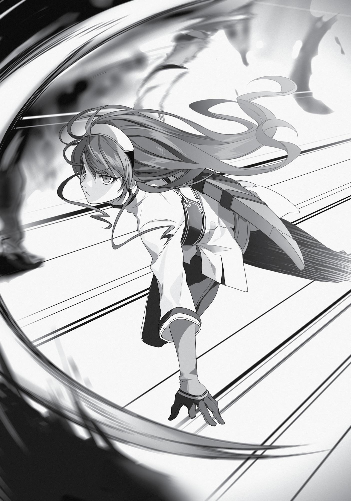

+++
title = "Interlude: Eris the Goblin Slayer"
date = 2026-07-20
weight = 6
[extra]
volume = 5
chapter = 7
+++

It was because the boy from the Guild, having regained
consciousness, had come running after her.
“I’m sorry about what I said earlier. It was just a heat of the
moment thing…”
Once he caught up to her, he immediately apologized and
bowed his head politely. Because of this, Eris’ mood stayed in the
only “somewhat” lousy range. The boy had escaped a gruesome fate
for now—but only barely.
Of course, had he remained conscious after that first punch to
bear witness to her rage, he wouldn’t have been foolish enough to
pursue her in this way.
“My name is Cliff. Cliff Grimoire!”
“…I’m Eris.” Eris briefly considered using the name Dead End but
decided against it. She wasn’t going to mention Ruijerd’s name to
someone she’d flipped out on.
“Eris! That’s a wonderful name! From your outfit, I’m guessing
you’re a swordswoman, yes? Would you like to form a party with
me?” Cliff had planted himself right in the middle of the road to
blather at her. Eris was sorely tempted to punch him in the face
again, but managed to control herself.
“No thanks.” She dismissively turned her face aside and started
walking again.
To be honest, she wasn’t especially accustomed to dealing with
this sort of thing. Rudeus was basically the only other person who’d
come back for more after his first beating.
“Oh. All right. In that case, at least let me support you from the
rear! Everyone says I’m a budding sage, you know. I’ll definitely be
useful!”
Had Rudeus been there to witness this desperate full-court
press, he likely would have made a comment along the lines of

“More like a budding priest, you creepy little virgin!” to himself, at
least.
Eris didn’t say anything so crude. She did, however, idly wonder
how “useful” the boy might prove if she chopped him up for
composting.
“I’m sure you’ve never seen a spellcaster as amazing as me
before, Eris,” said Cliff with a confident grin. “I’m even better than
your average A-ranked magician, as it happens!”
This remark ticked Eris off a little. As far as she was concerned,
the most amazing magician in the world was clearly Rudeus Greyrat.
Even Ruijerd acknowledged his skills. While he was an A-ranked
adventurer, there was nothing “average” about him.
“You really owe it to yourself to at least see what I can do!”
All right then, Eris found herself thinking. Let’s see if you’re all
talk. “Fine, all right. Follow me.”
“Of course!”
And so, Eris and the young magician Cliff set out to slay some
monsters.
In an instant, a great wave of flame consumed seven Goblins at
once.
“How do you like that? Pretty amazing, right?” said Cliff,
surveying the monsters’ corpses with a look of great satisfaction on
his face. “Your average magician could never pull that one off!”
Eris looked at the remains as well. All of the creatures had been
burnt to ashes, meaning there were no ears left to collect.

“You think? I can’t say I’m impressed.” That really was her
honest opinion. She couldn’t have been much less impressed, in fact.
Cliff had used an Advanced-rank Fire spell called “Exodus Flame.” Eris
had seen Rudeus cast that one as well. But unlike Cliff, he hadn’t
rattled off some lengthy incantation first, and his flames had also
been more powerful. Of course, Rudeus wouldn’t have used a spell
like that on that pack of Goblins in the first place. He would have
killed them without damaging their ears.
What’s more, Eris had kept the monsters occupied until Cliff
finished his incantation, giving him a chance to show what he could
do; but as he hadn’t warned her when he finished, she’d nearly been
caught in the radius of his spell. Rudeus never would have made such
a dangerous blunder.
“Ah, it seems you don’t know very much about magic, Eris. You
see, there are many different kinds of spells, and…”
Cliff proceeded to give her a lengthy lecture about the various
ranks of spells, explaining that the magic he’d just used was an
Advanced-tier spell, so complex that even most adults were
incapable of casting it.
Eris already knew all of this, of course. She’d learned about it in
her lessons with Rudeus. And compared to Cliff’s rambling
explanations, Rudeus’ classes had been ten times easier to
understand.
“So? Now do you understand just how amazing I am?”
Eris badly wanted to punch this little jerk in the face. He was
really putting a damper on her long-awaited day of Goblin-slaying.
With her arms still folded, she coldly delivered her verdict. “Okay,
I’ve seen enough. You’re not going to be much help, so you can leave
now.”
Had Rudeus been in Cliff’s shoes at this moment, he likely would
have chosen to beat a tactical retreat. But Cliff was oblivious to the

hostility in Eris’ eyes. “Are you serious?! I can’t leave you out here
alone! You were struggling to kill a handful of Goblins!”
As soon as the words left his mouth, Eris hit him. Hard.
Cliff staggered back and clapped a hand to his face. There was
blood gushing from his nose. He quickly cast a basic Healing spell on
himself to stop the flow. “Hey, what was that for?!”
Eris clicked her tongue in irritation. She’d gone a little easy on
him this time, since leaving him unconscious in the middle of an
open field wasn’t really an option. Apparently, he needed a little
more punishment before he learned his lesson.
Just as she clenched her fist for a follow-up attack, however,
Cliff finally seemed to figure out the situation. “Wait, no! I get it!
You’re obviously very strong, Eris. How about we head over to the
forest for a while, then? I can’t really demonstrate my real value as a
mage against a bunch of Goblins, after all.”
There were no sinister motives behind this proposal. Cliff just
wanted to show off in front of Eris. It wasn’t that he had a crush on
her, or even wanted to impress her; he was simply eager to revel in
his own power.
“Forests are dangerous,” said Eris curtly. This was something
Rudeus was always saying, and Ruijerd agreed with him. She trusted
their judgement completely.
“Surely you’re not scared, Eris?”
“Of course not!”
But of course, Eris was a simple girl. When you challenged her
pride, she’d take the bait every single time. No self-respecting
member of the Boreas family would let some novice adventurer talk
down to them, after all. “The forest, right? Fine! Let’s go!”
And so, the two of them took a detour to a dark and gloomy
wood nearby.

“I guess even the woods aren’t too bad in Millis, huh?”
Eris cut down a monkey-like creature called a Utan as she spoke.
This was a D-ranked monster, considerably more dangerous than a
Goblin, but it posed no real threat to her.
“I guess not. These things are no match for me!”
Cliff, for his part, was slaying Utans with Intermediate-level
Wind spells while steadily pushing further and further into the
woods.
“Oh…” Suddenly, Eris stopped dead in her tracks.
“What’s the matter, Eris?” Cliff said, turning back and
approaching her with a big smile on his face.
With a grimace, Eris folded her arms, planted her feet shoulderwidth apart, and stuck her chin into the air. “Tell me something.
Were you keeping track of our route out of here?”
“No, not really.” Cliff hadn’t even thought to pay any mind to
that. This whole trip had been an impulsive, spur-of-the-moment
thing, so he hadn’t done any planning or preparation beforehand.
“I see. That means we’re lost, then,” said Eris flatly.
Cliff fell silent. After a moment, his face went very pale.
“Uh…what should we do?”
Since Eris seemed unperturbed, Cliff assumed she must have
some sort of plan. That wasn’t the case, however.
This wasn’t good at all. What would Rudeus and Ruijerd say if
they found out she’d gotten herself lost in the woods? How could
she explain how she’d even ended up there, when she was supposed
to be out hunting Goblins?
Of course, Eris didn’t let her anxiety show. As a woman of the
Greyrat family, she was expected to stay calm and composed at all

times. “Cliff, shoot yourself up into the sky and see which way the
city is.”
“Are you joking? That’s absurd.”
“Rudeus can do it just fine.”
“Rudeus? Who the heck is Rudeus?”
“He’s my tutor.”
“What?!”
Eris let out a small sigh. There was no point getting into an
argument right now. What should she be doing in a situation like
this? Hadn’t Ghislaine taught her what to do if she got lost?
Yeah. You were supposed to gather lots of branches and start a
fire, right? The smoke would be visible from a long distance away.
But who would see the signal? Ruijerd and Rudeus both had other
business to take care of today. They weren’t out looking for her.
Eris folded her arms and begun to scowl. She closed her eyes
and tried to think carefully. Ghislaine always said that it was critical
to stay calm, especially when you felt anxious, and so Eris never
allowed herself to panic.
“Wh-what do we do, Eris?”
“There are probably a few other adventurers in this forest,
right?”
“Oh, of course! We can just ask for help… Let’s try to find
some!”
Cliff started to run off immediately, but Eris didn’t budge.
Ruijerd had told her that it was better not to move in this sort of
situation. He’d taught her to stay still and consciously sharpen her
senses. Eris didn’t have that convenient third eye of his, but she had
her ears and her nose. And she could feel the flow of magic energy in
the area. She was still inexperienced in many ways, but she trained
every single day.

“Uh, Eris…?”
“Be quiet!”
Her eyes still closed, Eris drew a deep breath and emptied her
mind. She listened to the forest. She could hear rustling branches,
monsters on the move, the buzz of flying insects…and somewhere in
the distance, the faint sounds of combat.
“All right. Follow me.” Without a moment’s hesitation, Eris
began to walk once again.
“What’s going on?!” said Cliff, hurrying after her. “Did you
notice something?!”
“There’re other people here, all right. They’re over this way.”
“How can you know that?!”
“I sharpened my senses for a while.”
“Did your teacher show you how to do that too?!”
Eris had to think about that one for a second. Was Ruijerd her
teacher? Probably so. He’d taught her many things, if not quite as
many as Ghislaine. She could probably even call him her current
master. “Yeah, that’s right.”
“This Rudeus must really be something…”
“Hm…? Yeah, Rudeus is incredible.”
A bit confused as to why the subject had changed so suddenly,
Eris forged on ahead.
Just as the two of them reached the edge of the forest, they
spotted a carriage lying on its side in the middle of the ruts its wheels
had made.
“Get down!”
“Ack!”
Eris seized Cliff by the head and pushed him to the ground, then
dropped low next to him to observe the situation.

Six people were still on their feet at this point. One was a fully
armored and helmeted knight, standing with their back against a tree
and their sword drawn. The other five were men clad all in black,
positioned in a semi-circle around this lone warrior.
Three corpses lay in the grass nearby. All of them wore the same
armor as the encircled knight. Slowly but steadily, the men in black
were moving closer to their prey.
This battle was already lost. But for some reason, the knight
made no move to flee. Looking more closely, Eris realized there was
a young girl cowering at the base of the tree behind the armored
warrior—a girl whose face was full of terror and shining with tears.
“That armor… That’s a Temple Knight, Eris!” Cliff whispered.
Eris’ heart was pounding now. She knew about the Temple
Knights. They were one of Millis’ three holy military orders. The elite
Cathedral Knights were entrusted with matters of national defense.
The Missionary Knights were dispatched abroad as mercenaries of
sorts, so that they might spread the teachings of the Millis Church
and demonstrate its power. And the much-feared Temple Knights,
with their infamous Inquisitors, were tasked with stamping out
heresy.
The Cathedral Knights wore white, the Missionary Knights silver,
and the Temple Knights cerulean. Even at a distance, the cornered
knight’s armor was very clearly blue. There was no room for doubt. It
was a group of Temple Knights that had been ambushed here.
“You fools! Don’t you know who this lady is?!”
It was only when the cornered knight shouted these words that
Cliff and Eris realized she was a woman.
The black-clad men glanced at each other and snorted with
laughter. “Of course we do.”
“Then why would you seek to harm her?!”

“Shouldn’t that be obvious?”
“Are you lackeys of the Pope, then?! Damnable brutes!”
Eris couldn’t make much sense of this conversation. But one
thing was very clear to her: Those menacing black-clad men were
going to kill that terrified little girl. She reached for the sword at her
hip.
“What do you think you’re doing?” Cliff hissed. “We can’t get
mixed up in this! That girl’s the Blessed Child who’s supposedly a
potential future Pope, all right? That means those men in black are
the current Pope’s personal assassins! They’re well-trained and
ruthless. Even I wouldn’t stand a chance against them!”
Eris didn’t even pause to wonder why Cliff knew so much about
all this. There was only one thing on her mind right now: Unless she
intervened, that girl was going to die before her eyes.
Eris was a member of Dead End in her own right. If she sat back
and watched a child be murdered, she’d never be able to look
Ruijerd in the eye again. And more than once, she’d seen Rudeus put
himself in danger for very similar reasons.
“Come on. Let’s just stay quiet and hope they don’t notice us…”
“Sorry, but that’s pointless. They already know we’re here.” One
of the black-clad men had noticed their presence the moment she
pushed Cliff to the ground. Eris hadn’t overlooked his slight reaction.
She didn’t know exactly what they would do once their mission
was accomplished, but it hardly really mattered. She intended to
take the initiative here and now. “You just hide back here, Cliff!”
“Eris! No!”
Drawing her sword, Eris leapt forward at the assassins.
The black-clad men immediately scattered, but… “Too slow!”
Eris moved far more quickly than they had anticipated. Her lead
attack was the Advanced-tier Sword God Style technique “Silent

Sword”—a move of less complexity than the “Sword of Light,” but
deadly in its own right. Her sword whipped through the air without
the slightest sound.
In the course of her training with Ghislaine and Ruijerd, her
swordplay skills had been polished to a remarkable degree. Her
blade took one of the men at the shoulder, sliced diagonally through
his ribcage, and cut him in two.
Although this was the first time Eris had killed anyone, she
didn’t falter even for an instant. Her focus had already shifted to her
next target. The black-clad men were moving quickly to surround
her, but Eris was a step faster than any of them. Ruijerd had lectured
her about the proper way to move when surrounded by multiple
enemies. Many monsters hunted in packs; your goal was to pick
them off rapidly before they could encircle you.
“Haaah!” In the blink of an eye, Eris cut down another of the
assassins.
The three remaining men were visibly unnerved. This girl’s
movements were erratic, and her attacks came from unexpected
angles with no warning. It was all but impossible to dodge them
while also trying to do anything else.
Still, these were professional killers. In the moment it took Eris
to kill their comrade, they had successfully encircled her. Two of the
assassins leapt toward Eris almost simultaneously, deliberately
staggering their attacks.
They were fast, but not as fast as Ruijerd. They weren’t as
perfectly coordinated as the Pax Coyotes of the Demon Continent,
either.
These men weren’t quite good enough.
“There’s poison on their daggers! Watch yourself!” Shouting
words of warning, the knight who’d been defending the little girl
rushed forward to take a swing at one of the assassins from behind.

Eris accurately anticipated how the black-clad men would react
to this, and found her chance to break free of their encirclement. In
the very instant she realized she was going to win this fight, her
sword cut through a third assassin.
“Damn! Retreat!”
The two remaining men spun around sharply and began to run.
But Eris was never one to leave a job half-finished. In a heartbeat,
she caught up with one and savagely slashed into him from behind,
disemboweling him. His entrails spilled across the ground as he fell.

The last assassin didn’t look back. By the time Eris turned to him,
he’d already vanished into the distance.
With a small snort of disdain, she vigorously flicked her sword to
throw the blood and gore off its blade. From all appearances, she
was as calm as ever. But her heart was still pounding rapidly in her
chest. She’d just experienced her first life-or-death battle against
other human beings. For the first time ever, she’d killed someone.
What’s more, her opponents had wielded poisoned daggers—
even a single scratch might have proven fatal. And Rudeus and
Ruijerd hadn’t been around to watch her back, either. She’d jumped
into the fray without too much thought, but if it wasn’t for that
woman knight, she might have died.
Naturally, Eris kept these thoughts completely to herself.
Sheathing her sword, she turned to face the armored Temple Knight.
“Sorry. One of them got away.”
These words left the knight somewhat dumbfounded. The girl
standing before her wasn’t even a full-grown adult, but she’d cut her
way through a deadly group of killers. And she seemed totally
unfazed, to boot.
Without even removing her helmet, the woman pressed her fist
to her stomach and bowed in the style of the Millis Holy Knights. “My
sincerest thanks for your assistance.”
Eris found herself remembering how Ruijerd answered words
like these, and decided to follow his example. Making no bow of her
own, she said “I’m glad the child’s unharmed” and nothing more.
“I am Therese Latria of the Temple Knights. I assume you’re an
adventurer, miss? Might I ask your name?”
“I’m Er—”
Eris began to give her real name, but then stopped short. That
wasn’t right. What did Rudeus always do in these situations?

“I’m Dead End Ruijerd. Believe it or not, I’m actually a Superd.”
Beneath her helmet, Therese’s face went taut. Although Eris
wasn’t aware of this, the Temple Knights as a whole advocated for
the expulsion of all demonkind from the Millis Continent.
Of course, Eris lacked all the distinctive features of a true
Superd. It only took a moment for Therese to relax once again. This
girl had given her a clearly false name and assumed the identity of a
demon that the Temple Knights would view with hostility. This
seemed to be a message that she had no interest in any further
involvement with them or this affair.
In other words, she expected no reward, despite having saved
the life of an important personage. Therese found this pleasantly
surprising. “I see. Very well, then…”
For a moment, she paused to study Eris as the girl glared at her
with folded arms. Once she’d memorized her face, she whistled
loudly.
Before long, a horse came running out of the forest.
This was the animal that had been pulling their carriage
previously. It fled when the carriage was overturned, but now
returned at Therese’s call just as it was trained to do. After lifting her
young charge onto its back, Therese jumped up behind her.
“Should you ever have need of assistance, ask for Therese of the
Temple Knights!”
With those final words, the lady knight set off at a gallop. Eris
watched her go without a word.
Back in the shadows, a certain young man—still unable even to
stand—was also watching. And to his eyes, the fleeing knight and the
fearless red-headed swordswoman who saw her off looked like
nothing less than characters from a fairy tale.

Some time ago, a prelate of the Millis Church fell in love with a
woman of the Halfling race. The woman bore him a son, and in time,
that boy grew up and took a wife of his own. Cliff was this couple’s
first and only child.
At the time of Cliff’s birth, various factions within the church
were engaged in a vicious power struggle. The violence cost both of
his parents their lives. In order to keep Cliff at a safe distance from
the conflict, his grandfather—the prelate—temporarily left him with
the orphanage in Millishion. He proceeded to triumph over his
enemies, take the papacy for his own, and bring Cliff back into his
household.
In other words, Cliff Grimoire was the true grandson of the
current Pope of Millis…although few, even within the Church, were
aware of that fact.
Because of this, Cliff knew perfectly well why that carriage had
been attacked. That Blessed Child, said to possess miraculous
powers, was the most powerful tool in the arsenal of a certain
archbishop. And that archbishop’s faction was currently in active
conflict with Cliff’s grandfather.
Cliff had met the girl before, in fact. He had no idea what she’d
been doing out by that forest; but he was familiar with the black-clad
assassins who’d attacked her. Those men were among his
instructors. He’d known for some time now that they carried out
these sorts of jobs for his grandfather. He also knew just how
powerful they were. He had sparred against them many times, but
never once come close to winning. And yet, they hadn’t stood a
chance against Eris.
In reality, the fight had been a very close call indeed. But the
way Cliff saw it, this girl had totally overpowered a group of men he
never could have bested in a million years. As they walked back to

down, he found himself staring at her weary face with deep and
genuine admiration.
This girl was going to be someone before too long.
With that thought firmly cemented in his mind, Cliff blurted out
an impulsive offer. “Eris, will you marry me?!”
“What?! Not a chance!” She shot him down instantly. With an
awful grimace on her face, no less.
It seemed bizarre to Cliff that any girl would turn down a
proposal from someone as profoundly talented as himself, so he
began to search for an explanation. He thought back over all their
conversations. After a moment, he recalled her mentioning a certain
“teacher” several times. What was he called again? Ru… Ru…
“Rudeus.”
Eris turned at the sound of that name.
“That’s your teacher’s name, right? What’s he like?”
Within minutes, Cliff would come to curse himself for ever
asking this question. He’d gotten the impression that Eris wasn’t very
talkative, but that clearly wasn’t the case. Once you got her started
on this Rudeus person, she would proudly babble on indefinitely. She
kept going all the way from the plains outside Millishion to the
Adventurers’ Guild. Everything she said was an effusive compliment,
and the expression on her face made the intensity of her feelings
very plain. It was more than enough to make Cliff deeply jealous.
“I’m going to head back home now,” he finally interrupted,
aware that his expression was probably rather sullen at the moment.
Eris had seemed ready to keep talking for another hour or two,
but now she just waved her hand in a vague, disinterested gesture.
“Oh, okay. Bye.” It was hard to believe she was the same girl who’d
been speaking so passionately about her tutor only seconds earlier.

Cliff silently watched her walk off until she disappeared from
view. Who was this “Rudeus” who’d so totally enchanted that
powerful, beautiful, and flawless girl?
With visions of a mysterious rival floating through his mind, the
young mage returned to the headquarters of the Millis Church,
where he received a harsh talking-to from the people who’d been
searching for him.
Incidentally, the power struggle inside the Church quickly
intensified in the aftermath of the incident with the Blessed Child.
The Pope soon decided it was too dangerous for his grandson to
remain in Millishion, so Cliff was sent off to live in a foreign land. But
of course, none of this had anything to do with Eris.
As for Eris herself, she basically forgot about the whole
encounter the moment she returned to the inn and saw Rudeus
sitting miserably on his bed. But that, too, would be an entirely
separate story.
