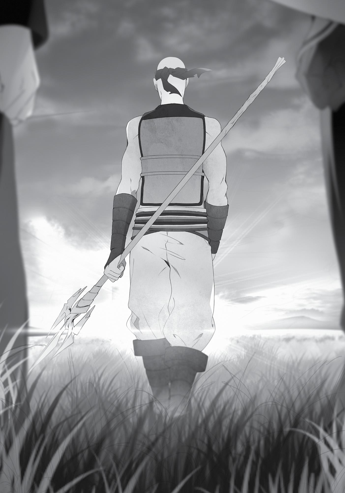

+++
title = "Chapter 11: Journey's End"
date = 2026-07-20
weight = 10
[extra]
volume = 6
chapter = 11
+++

The three of us finally arrived in the Asura Kingdom three
days later. It was right before us…or rather, we were right in it.
Despite that, the events of the previous day still weighed us down,
leaving glum looks on our faces.
We’d been utterly defeated. We’d been wiped out so abruptly,
and I’d even had my life taken from me. Orsted had resuscitated me
on some strange whim, but if not for that, I wouldn’t even be here.
That hadn’t quite sunk in yet.
It was true that I’d thought I didn’t want to die when he landed
his final blow. You’d expect me to be traumatized, and yet, when I
opened my eyes, I felt refreshed. Well, that was a bit of an
exaggeration. It was more like, oh, it was just a dream? It was the
same feeling I got when I woke up from a nightmare. Perhaps
because I’d seen the Man-God right as I was dying and so the whole
thing felt surreal.
Put like that, it seemed the Man-God must have guessed what
was going on and forced himself into my consciousness. To be
honest, on an instinctive level, I wanted nothing more than to turn
him away, but the Man-God did care about Ruijerd and his affairs, so
maybe the god wasn’t actually that bad.
That aside, ever since I nearly died, Eris has been sticking really
close to me while we were inside the carriage. Before, she’d just
stand diagonally across from me and say, “I’m doing balancing
training. Why don’t you give it a try?” But lately, she’d started sitting
down. Specifically, right beside me. Close enough for our thighs to
touch. Yesterday there was skin peeking out from the hem of her
pants. It’s only human instinct to want to touch something you can
see, so I reached out with my right hand, just a bit, and stroked it. In
return Eris just glared at me, her face bright red.

She didn’t punch me. Eris, the one who was always punching
people, had suddenly stopped. Even when I did something that I
totally deserved to be punched for, she didn’t. Her face would flush
and she’d just glower at me instead. And she’d just keep doing that,
staring me down. Not just that, but she’d keep sitting right next me.
In the past, she’d move away when I did things like that, but now,
she remained close.
To be completely honest, it was getting to the point where I
wanted to thrust my hand into her pants next, so I wished she would
put some distance between us. I knew there were some things you
could pass off with a laugh and some things you couldn’t. I was
holding myself back. But whether she knew of my internal conflict or
not, Eris stayed close to me all the same.
If I left my hands unoccupied, they would wander off in Eris’
direction, so currently I was creating magic with my left hand and
using my right to disturb the mana flowing out of it. This was the
magic that Orsted had used. I believe he’d called it “Disturb Magic.”
Just before the mana could take shape as it gathered in my hand, I
used different mana to disrupt and disperse it.
It was simple and didn’t cost much mana, yet it was an
incredible technique. In retrospect, this method of nullification was
similar to the King-tier barrier I’d gotten trapped in back in the
Shirone Kingdom. It was simple to explain, but actually performing it
was quite difficult. Perhaps because I was using my non-dominant
hand to conjure with, for the most part the magic still took shape,
albeit imperfectly. It was extremely difficult to completely nullify it
the way Orsted had done. But it could still be used as a restraint,
even in its imperfection. He’d actually taught me something pretty
useful.
“Hey, Rudeus, what have you been doing this whole time?”
“I’m trying to mimic the magic that Orsted used,” I said.

Eris stared intently at my hands. In my left, I’d crafted a small,
misshapen stone cannon that fell to the floor with a small thud.
Another failure. I almost felt like I was playing rock-paperscissors with my hands. No matter how I tried, I kept letting my left
hand win. Hm. This wasn’t going to work if I was being sloppy about
it. In other words, there were some rules involved in disrupting
magic. Did that mean that if I could unleash magic in accordance with
those rules, I could actually nullify his Disturb Magic? The possibilities
were growing.
“What kind of magic is it?”
“The kind that nullifies magic,” I answered.
“You can do that?”
“I’m practicing it right now.”
“Why are you doing something like that?” Eris asked.
“There’s been a number of times lately that I’ve had my magic
sealed and couldn’t do anything. I guess you could say I’m
researching. At the very least, if we ever meet Orsted again and it
turns into a fight, I want to be able to get away from him. Make
sense?”
Eris went quiet. For a short time, the only sound was of stone
cannons thudding against the floor.
“Hey, Rudeus, how come you’re so strong?”
Was I really strong? “I think you’re stronger than I am,” I told
her.
“That’s not true at all.”
“…”
“…”

The conversation died out. Eris looked like she had something
she wanted to ask, but said nothing. I wondered what was on her
mind, but I hadn’t the faintest idea. No, that wasn’t entirely true.
“Are you worried about the fact that you were so easily
defeated the other day?”
“…Yeah,” said Eris.
It wasn’t her fault. According to the Man-God, Orsted was the
Dragon God, the strongest being in this world. He’d even easily
dispensed with Ruijerd. It wasn’t a fair fight. He existed on a plane
you couldn’t reach through effort alone. In my previous life, I’d put in
a lot of effort in some areas and managed to scale some heights, but
I’d never once ranked among the very top in anything. Even with the
games I was engrossed in, where I thought there was no way I’d lose,
there were always people better than I was.
Orsted had curses restricting him, and despite that, his physical
fighting ability surpassed Ruijerd’s. He’d defeated Eris with one hand
and rendered me completely powerless. On top of that, he fought in
such a precise way that he exerted no more effort than necessary to
take you from full HP to zero, which meant he still had energy to
spare. I had no idea how strong he would really be if he went all-out.
“He’s an unfair opponent to have. It’s not your fault.”
“But…”
I could understand why Eris was troubled. She’d been done in by
one attack. He’d taken her sword attack straight-on and sent her
flying.
“You’re still young. As long as you work hard, you’ll get
stronger,” I assured her.
“You really think so…?”
“Yeah, even Ghislaine and Ruijerd said the same thing, didn’t
they?”

Eris suddenly lifted her head and looked straight at me. “You
know you almost died, right? Why are you… How can you say that so
easily?”
Well, because it felt surreal to me. I wasn’t thinking about trying
to fight him in the future, either. The next time I saw his face, I was
going to jet off like a rocket. Or maybe hide in the shadows like a rat.
If I couldn’t find a way to run, maybe I’d beg him to spare my life. I
prayed that wasn’t a sight that Eris had to see.
“Because I don’t want to die next time,” I said finally.
“True, you don’t want to die, do you…?”
“Please don’t worry. I’m going to work hard, so that if we ever
wind up in another dangerous situation like that, I’ll be able to pick
you up and make a run for it.”
Eris had a complicated look on her face as she leaned her head
against my shoulder. I might have gained more affection points with
her if I’d used the opportunity to reach over and stroke her head, but
I was in the middle of casting Disturb Magic with my right hand.
“Well, no matter what happens, we’ve got to get a little
stronger.”
Just a little bit more. There was no way we were going to
become the strongest in this world. The ceiling here was way too
high. But I wanted to at least get strong enough that we could get
away if we were attacked by some weirdo.
As I thought that, I pressed my face into Eris’ hair and inhaled
her scent.
Once night fell and Eris was asleep, I spoke to Ruijerd. We’d
spoken even less than usual since that incident. Ruijerd wasn’t much
of a chatterbox to begin with, but since then he’d become morosely
quiet. He probably blamed himself for what happened because,

despite his promise to deliver us safely home, he hadn’t been able to
protect us. But at least I was still alive, regardless of how much luck
played a part in that.
“That man, Orsted—he’s apparently the Dragon God,” I told
him. “Number two of the Seven Great Powers.” I opened the
conversation with that remark, starting on the idea that since our
opponent was too strong, it was only natural that we lost.
“So that’s who he was. No wonder he was so…”
“Strong, right? After you were knocked out, there was nothing I
could do to oppose him.”
“This is the first time since Laplace that I took just one glance at
someone and felt like I couldn’t defeat them.”
Ruijerd didn’t know about the curses restricting Orsted’s power.
He didn’t know he’d been beaten in physical combat by an opponent
that was holding back. If he knew the truth, it might shock him.
“Even I don’t think I can stand against the elite of the Seven
Great Powers. Those people are monsters beyond comprehension. It
was bad luck that we ran into someone like that on the road. It can
only be considered good luck that we managed to survive.” The
words made it sound like he was making excuses, but it also felt like
there was a tinge of self-reproach in Ruijerd’s tone. Perhaps he
acknowledged that there was nothing he could do, but saw that as a
separate matter from him being unable to fulfill his duty.
“Rudeus,” he continued. “If we ever meet someone like that
again, you absolutely must not pick a fight with them. Don’t even
meet their eyes. If you don’t want things to happen again like they
did this time, that is.”
“Y-yeah. Well, next time I’ll probably just avert my eyes and
move on.”
He was angry with me. Well, if I hadn’t called out to Orsted we
probably would’ve just passed each other by. I would admit to that

mistake. Although he didn’t look that dangerous at first. No…after
Ruijerd and Eris reacted the way they did toward him, I should have
been more cautious.
“So then, what’s bothering you?” I asked.
Ruijerd cast a sharp glare at me. “Who is the ‘Man-God’?”
Oh. So that’s what this was about.
“At first, it seemed he intended to let us go. Despite the
bloodthirsty aura radiating off of him, there was actually nothing
murderous in his eyes. But the moment he heard the name ‘ManGod’ he turned all of that animosity toward you.”
I closed my eyes. Should I tell him or not? It was a decision I
thought I’d already made before. But as unsavory as he looked, the
Man-God wasn’t that bad a person, and after what had happened to
us, I didn’t like keeping things hidden.
“Actually, the Man-God is…”
Despite how long I’d mulled over whether to tell Ruijerd or not,
once I made my decision the words came right out, slipping past my
lips. I told him how, since the time of the Displacement Incident, a
mysterious being who called himself the Man-God had occasionally
appeared in my dreams. That he’d advised me to help Ruijerd; that
he’d given me advice at other times as well. That my suspicious
behavior was because I was following that advice. Then I told him
how it seemed that the Man-God and Dragon God were enemies. I
told him that my conversations with the Man-God were vague and I
was probably forgetting a lot of details, but I narrated it all as broadly
as I could.
“The Man-God and the Dragon God…the Seven Gods of old… It’s
all so sudden, it’s hard to believe,” said Ruijerd.
“I bet.”

“But there are parts that make sense.” After he said that,
Ruijerd went silent. The air was dominated by the crackling sound of
the fire as it burned. The shadows it created danced around, etching
themselves upon the face of one old warrior. Thanks to his genetics,
Ruijerd looked quite young, but there was something in his
expression that hinted at a battle-torn history.
Suddenly I remembered that, in my last dream, the Man-God
and I had talked a bit about Ruijerd’s curse. “By the way, Mister
Ruijerd. About the bad reputation of the Superd tribe…apparently,
that’s a curse.”
“…What?”
“To be precise, it was a curse placed on Laplace, which he
transferred to your spears, which then rubbed off onto the entire
Superd tribe. Or so the Man-God said.”
“I see…so it’s a curse…” I’d shared that info with him thinking it
would be good news, but Ruijerd just scowled and fell into thought.
“I’ve never heard of transferring a curse before, but if it’s Laplace
we’re talking about, it’s possible. He was able to do anything.”
I didn’t know much about curses, so Ruijerd was probably more
knowledgeable about them than me. He seemed to consider it a
while longer, but in the end, he just let out a weak laugh. “If it’s a
curse, then there’s no way to fix it.”
“There isn’t?” I asked.
“No. They’re called curses because there’s no way to lift them.
I’ve never heard of a curse that affects an entire tribe before, but…if
that’s what a god said, then it’s probably true.”
He let out a laugh of self-derision, as if to say everything he’d
done up until now had been for naught. It might have been just the
lighting, but it seemed like there were tears at the edges of his eyes.
“But…” I started.

“What is it?”
“The Man-God said that unlike ordinary curses, this one is fading
as time passes.”
“What?”
“He also said that it still remains in you, Mister Ruijerd, but
you’ve severely reduced it by cutting your hair.”
“Are you serious?!”
He shouted it so suddenly that Eris rolled over in her sleep,
mumbling, “Mm…” This was probably a conversation I should have
had with her as well, but… Oh well, I could do it again when she
woke up.
“Yeah. He said that right now what remains is just traces of the
curse and the initial prejudices that it created. The Superd tribe’s
reputation can recover slowly but surely, depending on how hard
you work from here on out.”
“I see…that makes sense…”
“But that’s just what the Man-God said,” I added. “Even if you
trust what he says, it might be best to take it with a grain of salt. We
should continue to be as cautious we’ve been so far.”
“I know. Still, hearing that was enough for me.” Ruijerd went
silent again. It wasn’t just the lighting that was making it appear that
way anymore. He had tears streaming down his face.
“Well then, it’s about time I got to bed.”
“Yeah.”
I pretended not to see his tears. Our Ruijerd was a reliable
warrior and a strong man who didn’t cry.

A month passed after that. We didn’t visit the capital, but just
followed a narrow route farther and farther north. We passed
through many small farming villages, and saw wheat fields spread
out before us and watermills off to the side as we continued on our
way.
We didn’t gather information. We just headed north with as
much speed as we could muster. We figured we’d catch up on
everything once we reached the refugee camp, but even more
importantly, we were almost there already. We just wanted to reach
our destination as quickly as possible.
Finally, we arrived in the Fittoa Region, which was now empty.
Even in places where there had once been traces of civilization, there
was now nothing at all. There were no wheat fields, no fields of
Vatirus flowers, no watermills, no livestock buildings. Grass was all
that spread out before us—a field of it that stretched far and wide.
The scene created a sense of emptiness, one that we cradled deep
inside us as we arrived at the current (and only) city in the Fittoa
Region: the refugee camp. Our final destination.
It was just before we reached the entrance that Ruijerd stopped
the carriage.
“Hm? What’s wrong?”
Ruijerd descended from the driver’s seat. I looked around,
thinking perhaps some monster had appeared, but saw no enemies.
Ruijerd came to the back of the carriage and said, “This is where I
take my leave.”
“What?” I raised my voice in shock at his sudden declaration.
Eris’ eyes also went wide. “W-wait just a second!”
We nearly toppled out of the carriage as we stood to face
Ruijerd. This was too fast. We’d just arrived at the refugee camp. No,

we were just a step away. “Can’t you at least rest a day—no, just
walk into the town with us, at least?”
“Yeah, I mean—” Eris started.
“Unnecessary.” Ruijerd’s words were curt as he looked at us.
“The two of you are both warriors now. You don’t need my
protection.”
Eris went quiet when he said that. To be honest, I’d actually
forgotten that the only reason Ruijerd had stuck with us this long
was to see us back to our home, and that once we’d arrived there,
we’d be saying goodbye. I thought we’d always be together.
“Mister Ruijerd…” I started, then hesitated. If I tried to stop him,
would he stay with us? In retrospect, I’d caused him enormous
trouble. It was true that he’d brought his share of problems with
him, but I’d shown him far more of my pathetic weaknesses. Despite
that, here he was acknowledging me as a warrior. I couldn’t ask any
more of him.
“If you hadn’t been with us,” I said, “I’m sure we wouldn’t have
made it this far in three years.”
“No, I’m sure you could have done it.”
“That’s not true. I’m too careless about some things, so we
would have fallen afoul of something along the way, I think.”
“As long as you’re able to recognize that, you’re fine.”
There were numerous occasions on which I found myself at my
wits’ end, such as when I was taken captive in Shirone. If Ruijerd
hadn’t been with us, I would have probably panicked even further.
“…Rudeus, I told you this before.” Ruijerd’s face was even more
calm than usual. “As a magician, you’ve already attained a kind of
perfection. Despite all the talent you possess, you still don’t let it get
to your head. You should be aware of how much it means to be able
to do that at your age.”

I felt conflicted about the meaning of those words. Even if he
called me young, my actual age was over forty. The reason I hadn’t
let things go to my head was because I still retained those memories.
Although forty was probably still considered young as far as Ruijerd
was concerned.
“I…” I paused as I started to speak. I could’ve rattled off a list of
my weaknesses right there, but that seemed far too pathetic. I
wanted to stand before this man with my head held high. “No, I
understand. Mister Ruijerd, thank you for all you’ve done for us so
far,” I said. I started to bow, only for him to grab me and stop me.
“Rudeus, don’t bow to me.”
“Why not…?” I asked.
“You may think that I’ve done a lot for you, but I think you’ve
done a lot for me. Thanks to you, I see hope that my tribe can regain
its honor once more.”
“I didn’t do anything. I basically wasn’t able to do anything.”
I’d tried to turn the name “Dead End” into something positive
on the Demon Continent, but we were never anything more than a
group of adventurers while we were there. In the Millis Continent,
that name just didn’t carry the same weight. I’d meant to come up
with a new strategy, but it just kept getting pushed back, and then
we’d come to the Central Continent and I wasn’t able to do anything
else to help him. I liked to think everything we’d done had some
impact, but I couldn’t erase the sizeable history of oppression in the
world, and I couldn’t do anything about the prejudices people held
toward the Superd tribe.
“No, you did a lot. You taught me that my straightforward
method of saving children wasn’t the only one out there.”
“But none of my methods were very effective,” I countered.
“Still, I’ve changed. I remember all of it. The words of that old
woman in Rikarisu City who, thanks to your schemes, said she didn’t

find the Superd tribe scary. The looks on those adventurers’ faces
when they heard the name ‘Dead End’—how they weren’t
frightened, but rather laughed cheerfully. The closeness I felt to the
warriors of the Doldia tribe and how they accepted me even after I
told them I was a Superd. And the Shirone soldiers, and how they
cried as they thanked me when they were reunited with their
families.”
The first two aside, the rest happened through Ruijerd’s own
efforts. I hadn’t done anything. “Those were things you did by
yourself,” I told him.
“No. I couldn’t do anything by myself. In the four hundred years
since the war I worked alone, unable to take a single step forward.
The one who showed me that step was you, Rudeus.”
“But that really happened because of the Man-God’s advice.”
“I don’t care about some god I’ve never seen. The person who
really helped me was you. No matter what you think, I feel a debt of
gratitude toward you. That’s why I don’t want you to lower your
head to me. The two of us are equals. If you want to thank me, look
me in the eyes,” Ruijerd said as he stretched an arm out toward me.
I looked him in the eyes as I reached out and gripped his hand in
mine.
“I’ll say it again. Thank you, Rudeus, for all you did for me.”
“And the same to you. Thank you for everything you did for us.”
When I squeezed his hand, I felt the strength coming from him.
The corners of my eyes started to sting. Ruijerd had accepted
someone like me—someone who was pathetic, who’d failed the
entire way.
After a few moments, he pulled his hand away, and rested it on
top of Eris’ head. “Eris,” he said.
“…What?”

“Can I treat you as a child this one last time?”
“Fine, whatever,” she answered curtly.
There was a faint smile on Ruijerd’s face as he stroked her head.
“Eris, you have talent. Enough to become far, far stronger than me.”
“Liar. After all, I lost to…” Her mouth curled downward into a
pout.
Ruijerd chuckled and said the same words he’d always used
when they practiced. “You survived an attack in battle from a man
who bears the name of a god. You…” Understand what that means,
right?
She glared at him sharply. Then at last her eyes widened with
realization. “…I understand.”
“Good girl.” Ruijerd patted her on the head before dropping his
hand.
Eris kept the tight frown on her face and balled her hands into
fists. It looked like she was trying her best to hold in her tears. I
turned my gaze away from her and asked Ruijerd, “What are you
going to do after this?”
“I don’t know. For now, I intend to look for any remnants of the
Superd tribe on the Central Continent. Restoring honor to my tribe is
just a dream within a dream if I’m all by myself.”
“All right then. Good luck. If I have any free time, I’ll see if I can
do something to help out, too.”
“…Heh. And if I have any free time, I’ll see about looking for your
mother,” Ruijerd said as he turned away. He didn’t need to prepare
for his journey. He could make his way even if he set out with just
the clothes on his back.
Yet he suddenly stopped and turned back. “That reminds me, I
need to return this.” Ruijerd removed the pendant that was hanging
from around his neck. It was the Migurd tribe pendant I’d received

from Roxy. It was the only item that tied Roxy and me together…at
least, it had been.
“Please keep that with you,” I told him.
“Are you sure? Isn’t it important to you?”
“That’s exactly why I want you to keep it.”
When I said that, he nodded. It seemed he was willing to take it.
“All right then, Rudeus, Eris…let’s meet again,” Ruijerd said as he left
the two of us.
We’d spent so much time talking about things when he first said
he’d come with us in the beginning, and yet now, as he was leaving,
everything seemed to be happening in an instant. There was so much
I wanted to say to him. So many things had happened, from the time
we met on the Demon Continent until we reached the Asura
Kingdom. So many feelings that words couldn’t even describe. Like
not wanting to say goodbye to our companion.
“Let’s meet again.”
All those feelings were wrapped up in those few words as his
silhouette receded into the distance. That’s right—we just have to
meet again, I told myself. We surely would. As long as we were still
alive, we’d definitely meet again.
Eris and I watched Ruijerd go, in silence and with gratitude for
everything he’d done for us up until now, until he faded away
completely.
That was how our journey reached its conclusion.

