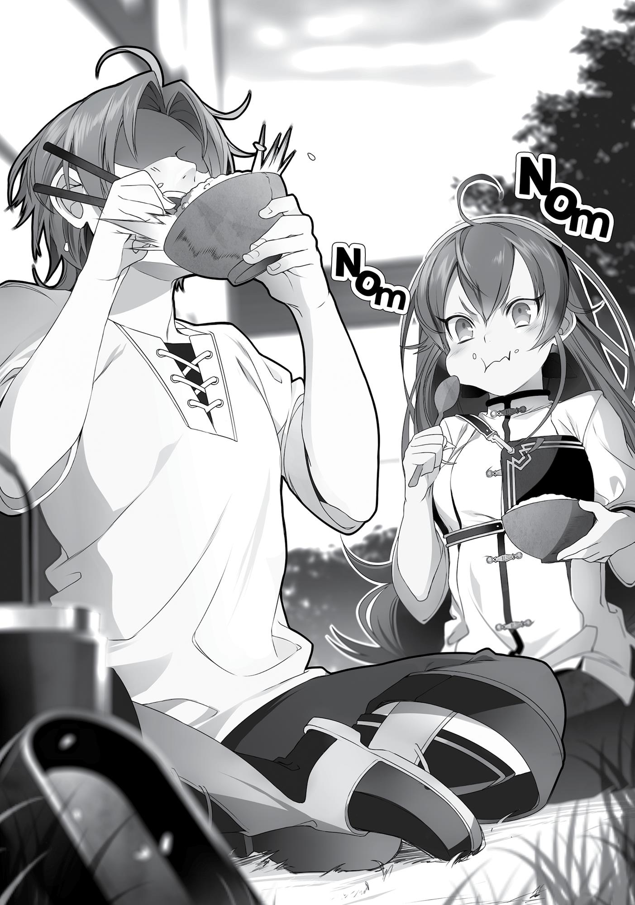

+++
title = "Chapter 2: Rice"
date = 2026-07-20
weight = 1
[extra]
volume = 6
chapter = 2
+++

The next day dawned.
As we grabbed breakfast at a pub, I announced, “We’re going to
stop by the Shirone Kingdom.”
Ruijerd and Eris both tilted their heads but still nodded. “Okay.
Fine.” “Understood.”
Neither one of them asked why or for what purpose. I actually
appreciated that. I had already decided that I would avoid talking
about the Man-God as much as possible, but still fretted over how to
explain my actions without bringing him up.
Ruijerd probably had his own theories after seeing me last night.
He’d probably already realized that I was hiding something—though
it was entirely possible he just thought I was hiding some kind of
illness. Not entirely incorrect, given that the Man-God was like a
plague bearer.
“Shirone—you mean that place where your master’s at, right?”
As Eris said it, the image of a certain young girl came to mind:
Roxy Migurdia. That was right. She was supposed to be in Shirone.
The Man-God had said to send a letter to my acquaintance. He must
have meant for me to plead with Roxy for her assistance.
“That’s right. Someone I really respect. My…teacher.” I’d almost
said the word “master,” but caught myself in time. Come to think of
it, Roxy forbade me from calling her my master. Though “master”
was exactly the term I’d used when telling everyone how wonderful
she was lately… Oh, well.
“We should stop by and meet them. They might be able to help
us somehow.” Eris nodded to herself in satisfaction.
Someone as incredible as Roxy would surely be of great help to
us. I was certain of it. She was also, however, a magician at the royal

palace, and had to be busy. I didn’t want to trouble her too much—
she’d already done so much for me.
Regardless of the Displacement Incident or the search for my
family, I still wanted to see her. I also wanted to thank her for her
Dictionary of Demonkind. If she hadn’t given me that book, I might
still be on the Demon Continent right now. I regretted losing it in the
incident—it deserved to be copied and sold worldwide.
“I want to see your teacher,” Eris said.
“Hm. I’m interested in meeting them, too.”
Both Eris and Ruijerd seemed intrigued, probably because I
invoked Roxy’s name with praise every now and then. I was so proud
to call her my teacher, and so I mentioned her everywhere I went.
That was a given.
“All right, then. When we get to Shirone Kingdom, I’ll introduce
you.”
As I made that promise, the three of us set off.
First, we proceeded along the highway which took us straight
through Wyvern, the capital of the King Dragon Realm. From there,
the route veered around the King Dragon Mountains and split off.
One path stretched straight up north, and another led out west. We
selected the northern route that led to Shirone.
We wound up unexpectedly spending seven whole days in the
capital city of Wyvern. Our initial plan was to leave after three days,
but there was an issue with our carriage and the repairs took some
time. I could’ve done the adjustments myself had the carriage been
made from stone or steel, but there was nothing magic could do to
fix something made of wood.

We paid extra to rush the repairs. It still took seven days for
them to be completed, but there was no reason to be hasty. In the
vision that the Man-God showed me, Aisha was surrounded by two
men. I was worried, but the god had said I would be there when it
happened. In that case, perhaps our carriage troubles were the work
of fate. If fate was involved, then no matter how quickly I rushed to
Shirone, I wouldn’t meet her before it was time.
I had to stay as calm as possible. With that in mind, I made my
way around Wyvern.
The King Dragon Realm was the third biggest country in this
world, and the largest in the southern part of the Central Continent,
with four vassal states under it. Once, this country had been just one
of many in the south. That changed after it attacked the King Dragon
Mountains in the northwest and slew their ruler, Kajakt the Monarch
of the King Dragons. This gave his conquerors access to a huge vein
of minerals, instantaneously boosting their country’s resources and
power. It was also the origin of forty-eight magical swords that were
now scattered about the world, as well as one of the places
mentioned in a line of the Epic of the North God.
Despite this storied past, the country didn’t seem like it put too
much emphasis on tradition. Instead it felt like America—like a mix
of different elements. There were many smithies and sword training
halls, and the styles were diverse, but most of the techniques I saw
belonged to the North God Style or Water God Style. I tried peeking
into one of the training halls, but most of the people being taught
were children. Even the masters of those halls were mostly only
Advanced-tier swordfighters, so Eris took one look at them and said,
with a snort of laughter, “They’re nothing special.” Even Ruijerd
expressed disapproval.
At any rate, I decided to gather information on missing persons.
I found one of Paul’s underlings in the Adventurers’ Guild who told
me there was no information to be found in this country. It wasn’t

going to be easy to find anyone who was still missing after all this
time.
Following that, I did my usual market research. Specialty goods
from both the Millis Continent and the Central Continent were sold
here. It was among the wide variety of food being sold in the
marketplace that I made a discovery: rice. Its color was a bit yellow,
but it was definitely rice.
Of course, I already knew there was rice in this country. I’d
eaten white rice when I was in East Port. I had really been looking
forward to eating this country’s cuisine, but unfortunately the only
things their pubs served were easy-made soups, paella, and rice
porridge. A bit different from what I was looking for. I wanted to eat
pure white rice.
The moment I saw the rice for sale, an electric shock ran
through me. If I couldn’t buy cooked white rice, then I just needed to
make it myself. I bought the rice instantly.
A few hours later, I was in the inn’s garden, preparing my food. I
had 4.5 grams of rice, cooking utensils I’d carefully prepared with
earth magic, an outdoor stove, a recipe that a pub owner taught me,
eggs, and salt. I held the recipe in one hand while I washed the rice
and started the fire in the stove. The heat of the fire was key to
cooking rice properly.
“What are you doing?”
I had my game face on as Eris came over. “An experiment,” I
said.
“Hmm?” She huffed in disinterest and started swinging her
arms. Judging by the way she kept stealing glances at me, she was
actually more curious than she let on.
I turned over the hourglass I’d borrowed from the pub owner
and powered up the fire. The pub owner said that the trick to

cooking rice was slowly turning up the heat, so I was following his
advice. After turning over the hourglass three times, I lowered the
heat. Then I turned it over two more times. Finally, I extinguished the
flames and turned it over another two times.
“It’s done,” I said.
“Really?” Eris stopped swinging her arms and stooped beside
me. Her scent wafted toward me, but my hunger was currently
stronger than my sex drive.
She looked at the pot in anticipation. I was also filled with
excitement as I lifted the lid. The wave of heat carried the smell of
freshly cooked rice right to my nose.
“It smells really good. Good job, Rudeus.”
“No, I need to taste it first,” I said, pinching a bit of rice between
my fingers and popping it into my mouth. “Hmm…I’d give it a fortyfive out of one hundred.”
It was nowhere near as good as the two types of Japanese rice
that stood out in my memory: Koshihikari and Sasanishiki. Even if I
compared it to all the modern types of Japanese rice, it wouldn’t
even be C-ranked. It was dry, had a kind of bitterness to it, and was
still faintly yellow in color. My poor cooking methods were partly to
blame, but the ingredients themselves were inferior too, perhaps
because rice wasn’t a staple in this country. You couldn’t even call
this white rice.
In truth I should have given it only thirty points, which would
have been a failing grade. But tasting rice at all evoked such nostalgia
that I couldn’t. With a bit of seasoning, it could earn fifteen more
points. Ah, I really am too kind, I mused inwardly.
“We ate this before, right? What kind of experiment was this?”
“This is just the beginning.”

I heaped the rice into an earthen bowl I’d made. Then I took a
scrambled raw egg, which I’d cast detoxification magic on just in
case, and created a hole in the middle of the rice before pouring in
the mixture. I sprinkled salt all over the top, took the chopsticks I’d
also made with my magic, and put both hands together.
“Here we go.”
“Huh? But, Rudeus, that egg is…raw…!”
I opened my mouth wide and took a huge bite of the now
brightly yellow-colored rice. Hmm…it smelled questionable. The salt
I’d added to it didn’t seem to do anything.
Now that I was trying it, I noticed the flavor of the egg was
different, too. It was a far cry from the fresh ones sold in Japan for
raw consumption. I should probably cast detoxification again on
myself afterward just to be safe. Also, it definitely needed soy sauce,
without which the raw taste was all too apparent.
I wondered if soy sauce existed in this world as well. If it didn’t,
then maybe I could find some kind of substitute?
“Does it taste good?”
Since Eris had asked, I used my earth magic to make another
bowl. I spooned in some rice, added some salt and offered it to her. I
also passed her a spoon I’d made—this would be beginner-friendly,
no chopsticks.
“Hey…is this really all there is to it?”
Gulp!
I nodded quietly. Though I wasn’t proud of it, there had been a
point in my former life when I subsisted solely on rice for meals and
rice balls for snacks.
“Hmm…” Eris chewed slowly, mixed emotions on her face. Her
tastes were still that of a child. Once I broke an egg over it, she did

say, “This is better than before,” and filled her cheeks with rice as
she ate it all.
Raw egg mixed with rice really was the best meal ever—and
perfectly balanced, too. As we said that, we finished our food,
gobbling down the last of the crunchy, burnt rice on the bottom.
Ruijerd was the only one who didn’t get to share the meal, but
he made no complaints. He’s the real adult, I thought. Still, I did feel
a little guilty. Next time, I’d make sure he got a share.

We departed from the King Dragon Realm and took the highway
up north. There were two more countries between us and the
Shirone Kingdom: the Sanakia Kingdom and the Kikka Kingdom. They
were both vassal states to the King Dragon Realm.
Rice cultivation was booming in the Sanakia Kingdom. Its climate
must have been perfect for it, because the highway was lined with
rice paddies. There were lots of rivers in the area, so the topography
was probably similar to Japan and East Asia. The rice was the same as
the kind I ate in the King Dragon Realm, meaning it was probably
exported from here. I decided to call it Sanakia rice.
At the inns we stopped at, our meals consisted mainly of
seafood and rice. I’d learned to eat in moderation since coming to
this world, but the appeal of rice was just too irresistible, and I ate
until my stomach was full to bursting.
Eris kept looking over at me, wide-eyed, during mealtimes.
Perhaps it piqued her interest that I, normally so fussy about food,
had lately been shoveling it in.
“What’s wrong?” I asked finally.
“I thought you were the type that didn’t really eat much,
Rudeus.”
I’d never been a light eater in my previous life, where I always
came back for another helping as long as there was still food on the
table. The only reason I’d been practicing moderation since being
reborn was because this world’s food didn’t suit my palate. Leaving
aside the tough meat that was a staple of most of our meals on the
Demon Continent, even the bread-heavy meals of the Asura
Kingdom felt a bit lacking to me. Zenith’s cooking wasn’t bad, but I
couldn’t help my longing for rice.

Ahh, yes. Rice is so wonderful, I thought.
Food wasn’t the only thing I spent my time on. I popped in at
the Adventurers’ Guild, too. Unsuprisingly, given that this was the
Central Continent, invoking the name “Dead End” didn’t elicit the
least bit of shock. Just because someone was famous in America, for
example, didn’t mean their popularity extended to Japan. Or how
there were a lot of children who knew about Superman, but didn’t
know who Captain America was.
They were adventurers, so they’d probably heard the name
Dead End before. But no one kicked up much of a fuss. Even if they
knew what the Superd were, the Superd’s most recognizable trait
was their hair color. Just like a track team girl wasn’t really a track
team girl to a modern-day Japanese otaku unless she had a black
ponytail, Ruijerd wasn’t really a Superd without the green hair.
That said, A-ranked adventurers seemed to be more observant
than the rest.
“Hey, you guys. Never seen you before. You’re A-ranked, right?
Did you just form a group recently?” The man who approached us
had an aura similar to Nokopara’s. Considering how that had gone, I
wasn’t too keen on getting friendly with him.
“We started two years ago,” I replied.
“Ooh, that’s not something you hear around here. Dead End,
huh? That’s the name of some fiend from the Demon Continent,
right?”
“Yes. And we’ve traveled all the way from the Demon Continent
to get here.”
“Heh heh, saw that one coming. And let me guess, that guy over
there is the fiend?”

“Yes,” I said, “but could you please refrain from calling him
that?”
“Why? That’s what you’re trying to pass yourselves off as,
right?” He laughed as if we were pulling his leg, but I kept a serious
expression on my face. Eris looked slightly perturbed, and Ruijerd
looked uncomfortable.
The man broke into a cold sweat when he saw our reactions.
“Wait, are you for real?”
“If you don’t believe me, would you like him to show you the
gem on his forehead?”
“No. No, that’s fine! I just didn’t think he was the real thing. I
guess the Superd really do exist, then…”
The fact that we’d reached the A-rank on the Demon Continent
lent more credibility to our claims of Ruijerd being a Superd. Despite
the harsh treatment demons faced on the Central Continent, people
didn’t seem as terrified of the Superd here, perhaps because the
threat of them was so foreign. After all, people who claimed brown
bears were harmless were generally people who had never
encountered one in the mountains before.
The name Dead End had lost most of its value, but it would be
easier to restore Ruijerd’s reputation when people weren’t terrified
of him. That said, I still hadn’t come up with a good plan for that. The
Ruijerd figure I’d made wouldn’t be any good as long as we were in
the domain of the Millis faith, either.
As I was preoccupied with those thoughts, Eris glared at the man
who had spoken to us. “Eris, please don’t start a fight,” I said.
“Yeah, I know that already.”
“Okay, good.”
Lately, she’d stopped scrapping with the other adventurers. Her
demeanor had grown tougher this past year. She no longer had the

look of a novice about her. Just one glance was enough to tell a
person she was dangerous, so why would they bother approaching?
For her own part, Eris had also come to understand the
adventurers’ style of humor. Even if someone said something
offensive to her, she was now calm enough to realize that she’d
heard it before. She’d answer their quip with an appropriate
response, the other person would laugh, and then’d she’d grin back
at them. She really had become just like an adventurer.
That said, she was always still game if someone wanted to pick a
fight with her. Some people, most of them C-ranked and young
themselves, would deliberately approach her after seeing that she
was A-ranked despite her youth. They’d come up and say something
like, “I bet you don’t have any skills yourself. You just had those guys
in your party carry you the whole way, right?”
This invariably resulted in a one-punch knockout. Somehow,
morons like this seemed to be in just about every Adventurers’ Guild
we went to.
As for me, I would just off-handedly respond, “That’s right! The
master of our party is so incredible, we’re living the high life!” I had
no pride. Besides, it was true that we’d relied on Ruijerd a lot to
advance to such a high rank. Eris didn’t seem to like my attitude, but
there was no way we could have gotten this far by ourselves. Let’s at
least show some modesty, I thought.
The cultivation of a flower that resembled field mustard was
widespread in the Kikka Kingdom. From the highway, we saw endless
fields of white flowers in bloom. Definitely a flourishing industry, but
also one the kingdom had been compelled to invest in by the King
Dragon Realm. The abundant rice paddies in the Sanakia Kingdom
had also been planted on the Realm’s command. Being a vassal state
was rough.

Rice was a staple in this country’s cuisine, too. Upon testing it, I
realized that the further north you went, the better the quality of the
rice. Perhaps the day when I would experience love at first bite with
rice this world wasn’t far. Unfortunately, the northern part of the
Central Continent was currently split into a bunch of tiny countries
engaged in continuous minor conflicts. There was no way they could
cultivate delicious rice under those circumstances. Truly a pity.
There was a dish called Nanahoshiyaki that was popular all the
way from the King Dragon Realm to the Kikka Kingdom. It was meat
covered in rice flour and wheat flour, and fried in oil at a high
temperature. In other words, karaage—Japanese fried chicken.
Apparently, the dish was developed in the Asura Kingdom and gained
huge popularity there before making it all the way here. It required
an abundance of cooking oil to make, but since a neighboring
country produced vast amounts of the dish, there were plenty of
opportunities to eat it in this region.
Unfortunately, this “fried chicken” didn’t taste so good, either.
The meat used was mostly sheep, pig, or horse. There was no set
temperature for the frying, so sometimes the dish came out hard
and other times it came out gooey. It also wasn’t properly seasoned,
even though you could use salt, dried herbs, or the sauce that was
unique to the area to change the flavor. The food we’d had in East
Port suddenly didn’t seem so bad by comparison. Quite the opposite,
in fact.
Being a bit of a gourmand, I understood that the cooks in this
country were trying their best. Still, what they delivered wasn’t what
I longed for. The lack of soy sauce was impossible to overlook. If I
only had soy sauce, garlic, and ginger for seasoning, then I could
make something salty and sweet.
“Lately, you get this troubled look on your face whenever we
eat, Rudeus.”

“He’s picky about flavor,” Ruijerd chimed in. “He’s probably got
some opinions about it.”
“I think it’s pretty good,” Eris responded.
We sat around a table, the two of them gulping down their
food. They weren’t picky at all. I hadn’t come all this way to be a food
critic and pass judgment on every meal, but I couldn’t help but think
how much better it would be with just a little bit of soy sauce.
“But the texture of the food is amazing. It’s crunchy, and then
when you bite into it the juice just fills your mouth.”
“Yeah, it’s good,” Ruijerd agreed.
They both asked for seconds and cleaned their bowls in no time
flat. How fortunate they were. They could find this kind of food
delicious because it was the first time they’d ever had it. I, knowing
there was better out there, couldn’t be content.
I couldn’t help my cravings for white rice and fried chicken with
soy sauce, or for tofu and miso soup with seaweed in it. My
insatiable quest for good food continued alongside my search for
missing persons, which, of course, yielded absolutely no information.
That was how things went for four months. Then, finally, we
reached the Shirone Kingdom.
