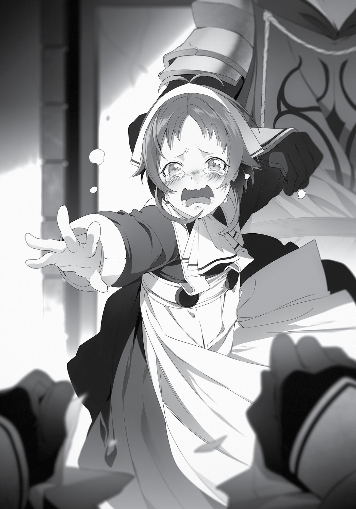

+++
title = "Chapter 3: The Shirone Kingdom"
date = 2026-07-20
weight = 2
[extra]
volume = 6
chapter = 3
+++

The Shirone Kingdom was a small but old country with a
two-hundred-year history. This was notable because all the human
countries except for the Asura Kingdom and the Holy Country of
Millis had been wiped out in the war four hundred years ago.
The southern part of the Central Continent had been ripe with
conflict until the King Dragon Realm took control of the whole region
some three hundred years ago. Even now, the land to the north of
here was a sprawling region of discord. The Shirone Kingdom was
close to the Conflict Zone. Given its precarious location, how had this
kingdom endured for two hundred years? The answer lay in the
alliance it formed with the King Dragon Realm right after it was
founded—an alliance in name only. Much like the other two
countries we’d had to cross through to get here, the Shirone
Kingdom was basically a vassal state to the King Dragon Realm.
That said, I had very little interest in national politics. The only
thing I cared about was the fact that Roxy was in this country. I
wondered if my young—wait, no. She wasn’t actually young, was
she? Anyway, I wondered if my adorable, clumsy master was still a
court magician here. She’d said the prince was giving her trouble, but
I was sure she could handle that.
It’d been so long. I wanted to see her. I wanted to see her and
tell her I was all right. I wanted to tell her about how I visited her
hometown. I wanted her to show me the King-tier magic that she’d
said she could use now. My heart thrummed with anticipation as we
made our way down the road toward the capital.
Along the side of the highway were disjointed rice fields and
grazing livestock. There were also inactive plots of land and pastures
full of plants that looked like clover. I wasn’t too well-versed in

agricultural practices, but the people of this world seemed to be
putting some thought into how they grew their crops.
Although supposedly a vassal state of the King Dragon Realm,
the Shirone Kingdom didn’t really have the vibe of a colony, unlike
the two countries we’d passed through before. Maybe it was
because it was so far away, or because it was being used as a buffer
between the Conflict Zone and other countries. At any rate, such was
the landscape that accompanied us as we arrived at the capital,
Latakia.
In this world, most major cities were surrounded by protective
ramparts, including Roa and Millishion. Even the larger cities in the
Kikka Kingdom and Sanakia Kingdom had walls around them. The
same was true of the Shirone Kingdom’s capital, which had a sturdy,
awe-inspiring wall lining its perimeter.
In hindsight, it was the same way on the Demon Continent. In
fact, because the continent had such a high concentration of
powerful monsters, their defenses were more thorough. There
wasn’t a city out there that could match the huge natural walls that
surrounded the city of Rikarisu. Each city on the continent utilized
the special abilities of the tribes living nearby to erect strong walls to
protect itself. Even small settlements conducted daily exterminations
of beasts around the village’s outskirts. In comparison, the ramparts
on the Central Continent looked as if they were merely for show.
We passed through those walls and made our way into the city,
where we parked our carriage at a stable. There were many
labyrinths in the vicinity of the city, so there were plenty of toughlooking adventurers around, many of whom engaged primarily in
dungeon diving. That had been Paul and Ghislaine’s life in the past,
and even Roxy had done it for a while. I was pretty sure it was Paul
who’d said dungeon divers were incredibly skilled.

There were many labyrinths scattered throughout Shirone, and
you could make a ridiculous amount of money just by exploring their
topmost levels. There were probably a handful of S-ranked
adventurers among the dungeon divers who were aiming for the
most lucrative loot, and we mingled with that crowd as we traveled
the main road and selected a random inn to stay at. As usual, it was
one tailored to D-ranked adventurers. Even the low-ranked inns in
this town were a bit pricey, perhaps because there were so many
high-ranking adventurers around.
Compared to the D-ranked accommodations on the Demon
Continent, the quality of the lodgings on the Central Continent
wasn’t bad at all. It was actually good enough that we would have
been fine with rooms aimed at lower-ranked adventurers, but we
had enough money not to worry about that. Quite the opposite. In
fact, we could have afforded even better accommodations if we
wanted.
I would like to stay in a better room, I thought to myself at one
point, but even though we had the extra coin, it felt like a waste.
Maybe I really was a penny pincher.
“All right! Now that we’ve arrived in the Shirone Kingdom, let’s
conduct our strategy meeting,” I announced to the two standing in
front of me. Their apathetic applause told me they’d gotten quite
used to this setup. “Now, what should we start with?”
“We’re going to meet your teacher, right?”
Eris’ question reminded me of what the Man-God had said.
“Her name is Aisha Greyrat. Currently, she is being detained in the
Shirone Kingdom. You’ll be there when the events from your vision
transpire, and you’ll meet her and save her. You absolutely must not
let your name be known. Call yourself the Kennel Master of Dead End
and ask her for details on her situation. Then send a letter to your
acquaintance in the Shirone Royal Palace. If you do that, both Lilia

and Aisha will be saved from that palace.” Something along those
lines.
If I trusted his advice in its entirety, then I just had to walk down
the alleyway I saw in the vision to trigger that event. I figured I
should probably take Eris and Ruijerd along as well. After all, the
Man-God said nothing about going alone this time.
I continued to think. If I believed the Man-God, then Lilia and
Aisha were being detained at the Shirone Royal Palace. But in my
vision, I’d met Aisha outside. That meant she’d somehow managed
to escape the palace. I remembered the look of the two men who
came after her in my dream. I’d seen their getup numerous times in
the city; it was a normal soldier’s attire.
In other words, Aisha would be pursued and then caught by
palace soldiers. That was when I would come in. If I took the most
obvious approach to save her, I’d risk making an enemy of the
palace, which had to be why the Man-God had said not to use my
name. It might be best if I hid my face, too.
While the knights were busy tracking my fake identity, I could
send a letter to my acquaintance in the palace (Roxy) and ask her for
help. If she was a court magician, then her words should hold some
power. I already owed her so much. I didn’t want to show up
barefoot and dirty-soled at her doorstep, like a stray child—though I
would happily wash her feet if our positions were reversed.
This was the Man-God we were talking about, though. It was
possible he was up to something. If I tell you too much, it’ll spoil my
fun, he’d said. In other words, he was hoping for something
interesting to happen, and there was probably nothing I could do to
avoid it.
However, he’d also said, I hope you’ll trust me next time.
Hopefully, even if there were unpleasant surprises lying in store for

me, they wouldn’t involve such things as serious injury or the death
of someone close to me.
But this was all assuming I trusted the jerk. He might just be
trying to deceive me this time, with no care for what happened after.
Even so, there was no point in putting up needless resistance that
might make everything catastrophically worse. I disliked feeling like I
was playing into his hands again, but it seemed I had no choice but to
listen.
My main goals were now to search for Aisha, to falsify my name,
and to send a letter to Roxy. That said, how was I going to convince
my companions? The letter wasn’t a problem, but I still needed a
good reason for searching the back alleys while using a fake name.
Ever since we’d set out from Millishion, they’d made sure one of
them was always by my side, even on our free days. Apparently, they
were still concerned by how depressed I’d gotten after my encounter
with Paul.
I felt bad about having worried them, but there was a high
probability we’d end up facing off with some soldiers in our quest to
find Aisha. Neither Eris nor Ruijerd was any good at acting. No matter
who I took, it seemed likely they’d do something that would come
back to bite us in the butt. Karma had a way of doing that.
Now then…what to do?
“Rudeus, what are you worrying about?”
Hm…well, it’s like they say, better to act now and worry later, I
reasoned with myself.
“Actually, I’d like for us to conceal our names while we’re here.”
“We’re going to be pretending again? Why?”
“Umm…” Even if I had to keep mum about the Man-God, there
was no reason I had to hide the rest of the story. “Actually, I heard
from a source that members of my family have been taken captive
somewhere in this country.”

“Really?” asked Eris.
“Oh,” grunted Ruijerd.
Neither asked from whom or where I got this information, even
though one or the other of them had always been with me whenever
I gathered information. But it was better for me if they didn’t press
the issue.
“Oh, I get it!” Eris exclaimed. “They’ll be on alert if they hear the
name Greyrat, then!”
“That’s right.”
“So, who’s the family?”
“Lilia and Aisha. Our former maid and my little sister.” Actually,
now that I thought about it, what was I supposed to call Lilia
anyway? She wasn’t really my stepmother.
“Your little sister? You mean the one who was so full of herself,
whom we met back in Millishion?”
“I have one more.”
“Uh-huh…” Eris looked unenthused as she pursed her lips.
So Norn seemed full of herself? I didn’t think that at all, but Eris
clearly had a different impression. I wondered whose side I would
take if Eris were to punch her…
Eris snorted triumphantly. “Well, if that’s what’s going on, no
complaints here! Impressive, Rudeus. You really thought this
through.” So she said, but I was really only being strung along by the
Man-God. “So we’ll hide our names. Should we be using fake ones?”
“Yes, and it’d be best to go with something common,” I
reasoned.
“How come?”
“It’s supposedly better if fake names aren’t memorable.”

“What were some of the famous names around these parts?”
Eris wondered out loud.
“While we were traveling, I heard names like Shyna and Reidar a
lot,” Rudeus offered.
Shyna, Knight of the Death God, was a female knight who
appeared frequently in the Epic of the North God. She was one of
three North God knights, and used to be one of the God’s
companions. No matter how brutal the battle, she would always
return home, almost as if she were unkillable. The story was
probably ficticious, but there were still many who named their child
Shyna in hopes that the name might keep them from being killed in
some freak accident.
Reidar was the name of a Water God. He was a genius at
countering attacks, could freeze the ocean and walk on top of it, and
was the hero who vanquished the Sea King Dragon. The name of that
legendary man was passed on through the generations. Each new
head of the Water God Style would inherit it: men would be called
Reidar while women would be called Reida. It was quite a common
name around here.
The two were putting a lot of thought into the fake names they
would use. I was grateful for that. Now I needed to give mine some
serious thought, too.
“Rudeus, what are you going to do?”
“Well, let’s see. In this case, it might better they know right off
the bat that it’s a fake name.”
“How come?”
“They don’t know our names or our faces. It might confuse them
if we give them a fake, flashy name to go off of,” I said, quoting a line
from some super old anime I’d seen a long time ago. To be totally
honest, it didn’t really matter as long as the names were fake.
“Then we should pick a cool name.”

A cool name, huh? “All right then. I’ll call myself the Knight of
the Shadow Moon.”
“Knight of the Shadow Moon?!” Eris’ cheeks flushed and her
eyes sparkled.
That was a character from Kamen Rider who loved haikus and
wore what looked like a tacky lunch lady uniform. If someone like
that appeared in front of Eris, she’d probably clobber them.
“I’ll do the same one! Wait, but we can’t be the same, um…”
Did she really like it that much? In that case, might as well stick
with the knight theme. “Okay then. Eris, you can be the Sword of the
Shadow Moon and Ruijerd can be the Lance of the Shadow Moon.
Then we all match.”
“Very nice, we match! Let’s use those!”
I thought Ruijerd might be embarrassed by such a name, but he
didn’t look too bothered. Paul had said that Aqua Heartia was a cool
name. Apparently, the concept of “nerds” didn’t exist in this world.
“But you don’t seem like a knight at all, Rudeus,” Eris muttered,
after I thought we’d settled it.
Not a knight, huh? Maybe I should name myself Evil Magician or
General Omega instead? Then again, I had no idea if I’d even end up
using the name. If it didn’t work, I could always use Kennel Master
instead.
“Okay. We’ve decided on our fake names, then.”
“What do we do next?”
“For now, I’ll send a letter to Roxy at the royal palace. We’ll
spend our time gathering information until I get a reply,” I declared.

I went to the market the next day, purchased some stationery
and an envelope, and started penning my letter to Roxy. I started off
with seasonal greetings, asked after her well-being, and then
informed her that, although I’d been teleported, I was safe. I told her
that I was now in Shirone’s capital and wanted to meet her. Hoping
to rouse her concern and anxiety, I casually mentioned how
everyone from Buena Village was missing, and how none of them
had been found despite the ongoing search. Then I broached the
topic of our maid, Lilia, and closed by emphasizing one final time
(because this was important) how worried I was about my family. I
also structured the letter so that the first letter of each line, if read
vertically, would read “HELP ME.” With all that I had included in my
letter, I was sure Roxy would understand what I was implying.
I sealed it with wax that I pressed an imprint of Roxy’s pendant
into. I briefly considered sending it under a fake name, but I’d be in
trouble if she threw it away thinking, “Who the hell is that?” So I
signed it, Your Beloved Pupil Rudeus Greyrat, Who Just Wants to
Watch Over You.
Honestly, Roxy would probably recognize my handwriting even
if I did use a fake name, but it was also just like her to get careless
when it came to something important. I wouldn’t know if the letter
would make it to her until she actually had it in her hands.
Schrödinger’s Roxy. I pictured Roxy sitting in a box that said “please
pick me up.” Aww. For God’s (Roxy’s) sake—you’re supposed to flip
the box over and hide inside of it.
Anyway. That aside, there was no harm in making sure she
would read the contents by leaving my real name on the envelope.
“All right, I’m going to go send this letter off.”
“Okay.”
“All right, be careful!”

The two of them waved at me, Eris with a radiant smile on her
face. What a letdown. I’d been so sure one of them would want to
follow me.
“Eh? What are the two of you going to do?”
“I plan to ask around town about your sister,” Eris said.
That was right—I had said we would be searching for
information. Information was power, after all, and it never hurt to try
to gather what we could. I actually felt a little abashed at how lax I’d
become, trying to move on to the next step without doing that first.
“All right, then. I’ll make sure to hunt down some information
too, once I’m done sending this letter off.” With that, I left the two of
them behind.
I went to the Adventurers’ Guild to post the letter. I intended to
start searching for information afterward, but mere minutes later, I
realized I was being tailed. At first I thought it was Ruijerd monitoring
me, probably thinking I might get in trouble if left to my own devices.
That didn’t make sense after what had happened in the last few
months, though. He would have joined me rather than tail me in
secret. Besides, his ability to tail people was second to none. If it
were truly him following me, there was no way I would have noticed.
I figured it wasn’t Eris, either. She was terrible at shadowing
people. I would have noticed her the second I stepped out of the inn,
and she’d prefer to silently stick right behind me rather than skulk in
the shadows, anyway.
So, who was it? Was there someone in this country who had a
grudge against me…? I couldn’t think of a soul. Besides, I’d only just
arrived yesterday. It was likely I would stir up trouble in the future,
but I hadn’t bothered anyone yet.
Was this connected to something I did on the Demon
Continent? Would someone really follow me all the way here for

revenge? Unlikely. But maybe they were a survivor from the Zant
Port smuggling group who’d spotted me by chance. Maybe they
were planning to seize the opportunity to finish me off.
No, the most likely explanation was that they had absolutely no
connection to me at all.
When I turned the corner, I caught a glimpse of a small figure
ducking into the shadows. It was a child. Maybe one of the
neighborhood children had decided to pretend I was a bad guy and
tail me. Or maybe it was an orphan who was planning to swipe my
wallet. If I hid somewhere, they might panic and pursue me, and I
could jump out and scare them.
No, wait. This world had races like haflings, who only looked
small. I couldn’t let my guard down.
I decided that I would give them the slip. With that in mind, I
took a right at two intersections and then entered a slightly narrow
alleyway.
“Hm…?”
I got the sudden feeling that something was wrong, a sensation
like something rising from the depths of my throat.
Brushing it aside, I used magic to create a wall of earth. A threemeter wall rose up, sealing the alley behind me. I heard hurried
footsteps on the other side as my stalker ran toward the wall,
followed by the sound of something slapping weakly against it.
I’d gone pretty deep into the winding alleyways to lose that kid.
Now, which way back to the main road? I felt a little like a lost child.
Unlike the grid-like layout in Millishion, even the major
thoroughfares in this town didn’t run straight. Even someone with a
good sense of direction, like me, was beginning to get lost.
I supposed that if it came to it, I could always use magic to boost
myself onto a roof. Wait. Hang on—this alley was just like the one in
the vision the Man-God gave me.

“Ah!”
I realized what the strange feeling from a moment ago had
been. It was déjà vu.
Turning on my heel, I ran back down the winding alley. I got
turned around at a T-junction, but managed to retrace my steps to
the wall of earth I’d created.
“No, stoopp!” I heard a girl scream. “Give it back!”
I put my hand against the solid structure and channeled my
mana into it. Using earth magic, I weakened the wall’s composition
while simultaneously using wind magic to trigger a shockwave. With
a booming crash, the whole thing crumbled and fell away.
Before me was the vision the Man-God had showed me. A
soldier roughly seized a lone girl’s hand, while another held up some
paper he’d taken from her, shredding it to pieces.
“That’s for my father! Don’t tear that up!” the girl screamed.
Amidst the echoing of her protests, the soldiers looked my way
in confusion. “Wh-who the hell are you…?”
The girl had a face that resembled Lilia’s, with Paul’s brown hair
pulled back into a ponytail. She was wearing a baggy maid’s outfit.
Her face, which would normally have been light-hearted and gleeful,
was contorted with tears and streaming snot.

The soldiers had been glaring at her with obscene looks on their
faces. Wait, no. That wasn’t right. They looked like they pitied her.
Were they doing this out of duty, rather than because they wanted
to?
“Who are you?! State your name!”
“I’m that girl’s…” I almost said “brother,” but stopped myself. I
wasn’t supposed to give away my real name. “Uh…I am the Knight of
the Shadow Moon!”
“What part of you is a knight? You’re obviously a magician.”
“Ugh…”
Dammit! Next time, I was definitely going with Evil Magician
instead!
“Listen up, kid. It’s nice that you want to play hero, but we’re
soldiers from the palace. This little girl just got lost, so we came to
escort her home.”
They clearly considered me nothing more than a mischievous
child. I was sure they were lying about their intentions, but there was
a troubled look on the other soldier’s face as he regarded Aisha, who
was still sobbing. Whatever was going on at the palace to result in
Lilia and Aisha being detained, it didn’t necessarily mean the soldiers
in the rank-and-file were bad guys, too. Maybe I should just try to
talk to them?
“But you guys tore up the letter she was holding.”
“Ahh…that’s, well, how to explain it? Adults have their reasons.”
Uh-huh. Adults had lots of reasons.
“Ah!”
Aisha found an opening and smacked the soldier’s hand away.
She hid herself behind me and clung to my waist, her face covered in
tears and snot. “P-please ’elp!”

Looking at her helpless expression and frantic demeanor, I
suddenly didn’t care if I made enemies of this kingdom or not.
“Doseguhs dook muhledder and dore iddub!”
I had absolutely no idea what she was saying through her
sobbing, but I could tell she was desperate. Okay. Let’s put an end to
this. I was an adult on the inside. I couldn’t keep up the charade of a
child playing at being a hero.
Without warning, I lifted my hand and silently sent a stone
cannon flying at the soliders.
“Mnh!” The man I’d aimed it at instantly whipped out his sword
and intercepted the cannon.
Whoa! That was some reaction speed! Water God Style, huh?
That was going to make things difficult. But Stone Cannon wasn’t the
only spell I knew. As long as I had some distance, this would be easy.
Even though you’re the first person to ever avoid my stone
cannon, I thought.
“A magician who can use magic without incantations?!”
“Then—could he be the one?!”
“Call for backup!”
“Oka—aaah!”
I created a pit beneath the feet of the soldier who was about to
try to run away. Whoosh! At the same time, I fired stone cannons in
rapid succession to divert the other soldier’s attention. As I did that, I
told Aisha, “We’re going to run. Can you do it?”
“Ngh, wah…yeah…!” She nodded, even through her sobbing.
Very good, very good. All I had to do was knock this one
unconscious, and we could make our escape.
Tweeeeee!

No sooner had I thought that than a high-pitched noise like a
bird’s cry echoed around me. It came from the hole I’d opened up. A
whistle! That other soldier was blowing an alarm whistle!
Moments later, from all around—both close by and far away—
other whistles joined the chorus. Tweee, tweeeeeet!!
Each one sounded slightly different, probably to let people
identify their exact locations. Once my opponent saw that I had
stopped launching stone cannons at him, he yelled, “We’ve created a
blockade around this area! More soldiers will be here in a moment.
Cease your futile struggle and hand over the girl! We won’t hurt
you!”
This area was about to be swarmed. However, I still had a card
up my sleeve. “Aisha! Hold on tight!”
“Huh?!”
“Don’t let go, no matter what!”
Despite her confusion, Aisha wrapped her arms around my waist
and squeezed. I grabbed her shirt with my left hand and channeled
mana into my right. Then, I conjured an earth lance with a flattened
tip at my feet and used it like a catapult to launch us into the sky.
“Wh-whaat?!”
“Aaaaaaah!”
Ah ha ha! See you later, losers!
Incidentally, I broke both my legs when we landed. I was
definitely never doing that again.
