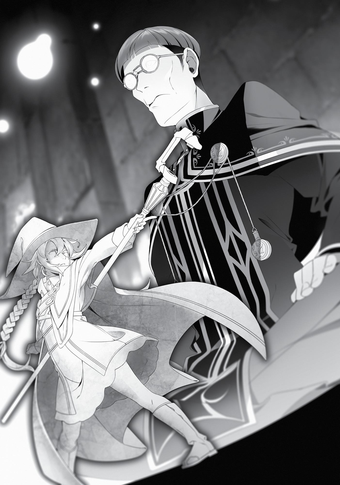

+++
title = "Chapter 5: The Third Prince"
date = 2026-07-20
weight = 4
[extra]
volume = 6
chapter = 5
+++

Hey there! My name is Rudeus and I used to be a shut-in.
Currently, I’m checking out a free apartment in the Shirone
Kingdom. There’s no security deposit and no rent. It’s a one-room
apartment that provides no meals and doesn’t have much in the way
of natural lighting. There’s no bed provided, and the lack of a toilet
means you have to resort to the old-fashioned way of pissing your
pants, so living here for an extended period will no doubt result in
serious illness. At least it’s free!
It’s also reassuringly secure in its construction. Please see for
yourself how durable the barrier is! As long as you stay inside it,
magic is nullified and you’ll never be able to get out! Even if an Aranked adventurer like me hits it as hard as they can, the barrier
won’t budge. It doesn’t matter if you’re a masterful escape artist—
there’s no easy way of getting out of this place.
Okay, that’s the second time I’ve used this joke, so enough of
that.
I can’t get out of here. Someone save me. Ruijerd, hurry up and
save me! Save meee, Rui!
I felt like Princess Peach waiting for Mario to come for me.
I spent an entire day after that trying to remove the barrier.
Since I couldn’t use magic while I was in it, there was basically
nothing I could do. Mostly my attempts consisted of pounding on a
wall I couldn’t see, trying to scrub at the circle on the floor, and
trying to leap up toward the ceiling that was nearly four meters
above me. I did everything I could, which basically amounted to
nothing.

If I’d at least had my staff, I might’ve been able to smack the
ceiling with it. Sadly, I’d given all my things to Ginger before I’d
entered the room.
As for magic, I tried numerous spells, but they all fizzled before
they could do anything. Like a shounen protagonist, I decided that if
this barrier absorbed mana then I would unleash as much as I could
and destroy it that way! But it didn’t seem to have any effect. I could
produce mana, but it didn’t take shape. I couldn’t use my mana to
trigger a change around me. It seemed like I could, but I couldn’t. It
was like using a lighter in such strong wind that it blew out every
time you clicked it. The gas was there, the spark was there, but there
was no fire. Or maybe it was more like the fire appeared but was
snuffed out immediately.
He said this was a King-tier magical barrier, right? It was
incredible.
My impatience grew as I realized that I couldn’t get out of here
on my own. If the worst came to pass and Roxy actually came to help
me, falling into Pax’s trap in the process, there was nothing I could
do to save her. All I would be able to do would be to scream for her
to leave me behind. If Eris was the one that got caught instead, I
could do nothing to help her, either. Once again, I’d be screaming for
them to leave me behind. And what if Pax changed his mind and
decided that he had me, so he didn’t need other hostages, and tried
to have Lilia killed?
I wanted to believe that everything would be okay, but I hadn’t
followed the Man-God’s advice perfectly. Maybe I was already way
off track. It was the Man-God we were talking about, though. Maybe
he foresaw this. But according to what he’d said, only Aisha and Lilia
would be saved. He hadn’t mentioned anyone else.
But no…he gave me that advice to earn my trust. It was difficult
to believe he’d purposefully worded it to be deceptive. Still, even

then… Negative thoughts kept cutting in and whirling around in my
head.
Dammit, I thought. I need to hurry up and get out of here.
I wondered how much time had passed. I felt exhausted. It was
the first time in a long while that I’d used so much mana.
“Phew…maybe I should rest for a bit.”
There was no clock and I couldn’t see the sun, so I had only a
vague sense of time. My stomach was also empty and had been
growling for a little while now. Don’t tell me that prince had
forgotten about my food, too? No, maybe that was the point. Maybe
he meant to reduce my food intake and whittle me down until I was
as dainty and brittle as a branch. That way, it would excite him more
when he showed Roxy what I’d become. Just one meal a day then,
huh? That would be terribly unpleasant, given that my body was still
growing.
I couldn’t break out of here through strength alone. Maybe I
needed to twist this around in my head some more. How did people
in my previous world escape from prison? They pretended to be sick
or dead, right? Maybe they would temporarily power down the
barrier to let a doctor or healer inside. No—it was also possible
they’d just leave me to die. They already had another hostage, after
all. If I were a Hollywood star, I could just strike out as the guard
came by my cell, knock them unconscious and steal their keys. Sadly,
that wasn’t possible here.
What other methods were left to me? Really, I just needed to
get out of here. Maybe I could pretend I was willing to pledge my
loyalty to Pax.
“Truth is, that Roxy’s been gettin’ on my nerves for a long time
now, boss. Heh heh heh! And actually, I know where her parents are!
Whatdya think about doin’ it in front of them, eh, boss?”

If I said it like that, he might actually fall for it, right? He did look
like a moron, after all.
Nah, let’s not. That wasn’t possible, even for me. Roxy. I could
abandon every last bit of my own pride, but the one thing I couldn’t
do was say something bad about Roxy.
Thump… Thump…
As I worried over what to do, I suddenly heard something.
Footsteps. They were growing closer. Probably Pax coming to see
how I was doing.
Thump…
The footsteps stopped directly above me. Then they cut across
the room and I could hear them at the top of the stairs.
“Aha, just as Ginger told me.”
The man who glided down the steps was someone I’d never
seen before. I could tell with one look that he was likely part of the
royal family, primarily because of how grandiose his clothing looked.
It was black with gold embroidery and you could tell at once that it
was expensive. He appeared to be about twenty. His face was similar
to Pax’s, but oval-shaped, with glasses resting above protruding
cheekbones, and he was taller and thinner. In other words, he looked
like your typical book nerd anime character with opaque glasses.
“I am the Shirone Kingdom’s Third Prince, Zanoba Shirone,” he
said with a rigid look.
Third Prince? So, that meant he was Pax’s older brother. “A
pleasure to make your acquaintance,” I replied. “I’m Rudeus
Greyrat.”
“Hm.”
“And what brings you here today?”
“Hm.” He nodded in an exaggerated way, and hoisted a bag in
his hands. A bag I’d seen before. No wait—that was my bag! He left it

on the ground and carefully extracted something from within. It was
a figurine of a man wielding a spear—a Ruijerd figurine.
“Where did you get this demon figurine?” he asked, as he
placed it just outside the barrier. “Tell me. I heard from Ginger that
you brought it here with you.” His tone was very demanding.
A demon figurine. I’d brought it with me without much thought,
but perhaps carrying a demon figurine was like carrying a false god’s
idol around these parts. Roxy’s figurine had no distinguishable
demonic characteristics, but Ruijerd’s was instantly identifiable
because of the jewel on his forehead.
How was I supposed to answer this one? At the very least, I was
sure I shouldn’t say I was the one who made it.
“I just happened to pick it up when I was traveling on the
Demon Continent.”
“Aha! I knew it must have been a demon that made this! All
right, where exactly did you acquire this? What did the person selling
it look like? Do you know who made this?!”
Boy, he was really invested in this. His eyes were gleaming.
“Wh-who knows?” I said. “I just saw it and liked it, so I decided
to buy it. I don’t know any specifics about—”
“Whaat?!” A dangerous glint of light reflected off his glasses.
There was something seriously intimidating about him. He had the
eyes of a person who had killed before.
“Oh yeah! The merchant told me something when he sold it to
me. He said that if you have that figurine in your possession, you’ll be
safe even if a Superd attacks you. Just show them that figurine and
chant at them ‘Ruijerd loves children,’ ‘Ruijerd loves children,’ and
suddenly the Superd will act like you’re old friends from ten years
ago. They’ll sling their arm around you and say, ‘Hey bro!’ And stuff
like that.”

“Oho, oho! Yes, that’s it! What else?! What else did they say?!”
“Uhh, you’ll be blessed with perfect health and children. A-also,
you’ll get really good at swordplay?”
“No, no, not that! What you’re telling me is that someone who
is deeply involved with the Superd tribe created this, yes?!”
I wasn’t sure those two things were related. The only Superd I
knew was Ruijerd. But as for being deeply involved, maybe? Many in
this world didn’t want anything to do with the Superd tribe, so in
comparison, yes, I was deeply involved.
“Hmm, it seems like there’s a strong possibility this was made by
the same person.” Zanoba hummed thoughtfully to himself as he
spun the figurine in his hand. Finally, he thumped it to the ground
and reached back into the bag. The only other thing left inside should
have been an emergency change of clothes.
“Then tell me, do you recognize this?”
What he produced from the bag this time was a Roxy figurine.
He put it on the floor, then plunked himself down behind it.

“This demon figurine was discovered five years ago in the
markets.” He put his hand on his chin and gazed affectionately at the
figurine.
When I’d tried to use the Ruijerd figure to proselytize, I found
out that demon figurines were forbidden due to the influence of the
Millis religious organization. I assumed Zanoba was looking to
condemn the person who’d created them, although he didn’t seem
very angry.
“It was my brother who discovered this one. When he saw it
looked like Roxy, our court magician at the time, he purchased it
directly from the merchant in the market.”
“Your court magician ‘at the time’?” I clarified, noting the past
tense.
“Hm? Yes. It seems you’re unaware, but Roxy Migurdia has
already left this country. She ran after being unable to tolerate my
brother’s unwanted sexual advances.”
No, actually, I had already heard about that from Pax. But it
made sense that she left after being sexually harassed.
“How exactly did your brother try getting friendly with her?”
“‘Getting friendly’…? He stole her underwear and peeked at her
while she was bathing.”
Seriously? How awful. People like that needed to be severely
punished. Such as having their computer smashed in with a bat. He
should be forced to live under the same roof as a young miss with a
killer punch that could knock your lights out in one blow. He should
be stripped naked, thrown in a cell, and have cold water tossed on
him. Shoot, I’d even be willing to conjure up an earth lance and slam
it right into his ass. One thick and shaped like a traffic cone.
Anyway, seriously. Did he honestly think it was okay to steal
Roxy’s panties and all that? No, it was unacceptable. It was

unforgivable. It didn’t matter that he was a prince—he should still
know right from wrong. It was no wonder she left.
Wait. By that logic, could it be…that Roxy had quit being my
tutor because of the things I did?
“More importantly, on the issue of these figurines…” Zanoba
said, patting the shoulder of the Roxy statuette.
That’s right—we were best leaving this depressing conversation
behind us. I nodded, my face solemn.
“I have a weakness for figurines. I collect them from all over the
world,” he started, as a sort of preamble. “This is the only one in my
possession whose maker and origins I don’t know. I know it was
made of rock and chiseled down, but it’s harder and heavier than the
stonework used by the dwarves. No one in the world has the
technique to chisel a sculpture this elaborate from such hard rock.
For example…look here, at the staff. Even for the most adept dwarf,
carving something so precisely in stone is incredibly difficult.” He
pointed to the weapon the figurine was holding as he spoke.
Complex pieces like the staff were easy to break. A lot of trial
and error went into trying to compensate for that flaw. As a reward
for my efforts, I managed to create something very tough and
durable. I used the same material to make the spear on Ruijerd’s
figurine. It required a fair amount of mana, concentration, and time
to achieve—more specifically, an entire day just for a centimeter of
work. I’d dedicated a lot to perfecting my technique, so I was happy
to hear it being praised.
“Something this incredible was being sold for a mere five Asura
gold coins. I would have paid one hundred coins for this. It bothers
me that those living on the streets are so unrefined and boorish they
can’t appreciate its value. Granted, the price could be cheap
specifically because it’s a figurine of a demon. If one of the Millis
faith’s temple knights knew you were in possession of this, you’d be

put on trial for heresy, even if you were a prince of Shirone. Then
they would execute you for being a Demon God worshipper. There
could be a number of reasons why this is being sold at such a low
price.” Zanoba put a hand to his forehead and shrugged as if
exasperated.
Executed? Well, the temple knights were full of fanatics,
apparently.
“I’ve searched for the creator of this figurine before. I don’t care
to get involved with a Demon God worshipper, but still, I want to
speak to the person who created this. It was then that Lilia suddenly
appeared at my door. Just one day after Roxy left.”
Hm. So they’d coincidentally just missed each other.
“Lilia was taken by the soldiers, and after things finally settled,
Pax took possession of her. This was one of the things she had,”
Zanoba said as he reached into the bag again and produced a small
box, one I had no recollection of seeing. It was fist-sized. “She carried
it with her like it was so precious. It struck me as odd. Look at it
closely.” He opened it so I could see inside.
There was something tucked into the folds of a soft-looking
fabric, which he gently pulled away. Inside was a pendant carved of
wood. I felt like I’d seen that sort of wood somewhere before. It was
hand-carved, though you could tell it wasn’t made by practiced
hands.
“The pendant?”
“Hm, the pendant is irrelevant.” He pinched it between his
fingers and placed it on top of the bag. His movements were so
graceful. Still, what did he mean by “irrelevant”?
That was when I recognized the cloth that had been wrapped
around the pendant.
“Now then, about these panties…” Zanoba pinched the fabric
between his fingers and stretched it out. It was white and shaped like

a home plate. I knew those belonged to God (Roxy) without a
shadow of a doubt.
Those panties were the object of my worship.
“Lilia said she tried to send these to you for your tenth
birthday.”
So the pendant was just camouflage. Zanoba had already
deduced that the real treasure was the cloth wrapped around them.
Perhaps Lilia had tried to send them as-is before, but realized it
would look bizarre to send me underwear for my birthday, so she
added the pendant.
Unfortunately, my object of worship (Roxy’s panties) had been
washed. Roxy’s extra virgin olive oil had been cleaned away, so
they’d already lost their divinity. God was no longer nestled in that
pair of underwear. In her place resided Lilia’s sincerity.
“S-so what about the panties?” I asked, hiding the tremor in my
voice.
Zanoba hummed and nodded, leaning forward onto all fours.
“Before we talk about the panties, let me explain this figurine to
you.” And so, he began to speak. The words came like a flood,
unending, and he had a look of ecstasy on his face the entire time.
“First, look at it from the front. A glance will tell you that it’s just
a normal magician wielding a staff. Look at the way the fabric
wrinkles. The way she steps out with one leg, her staff clutched
tightly in her hand and thrust out. The moment is captured so vividly.
Then look at the hem and sleeves of her robe, her wrists and ankles!
The slight exposure of her skin. It’s ever so slight, and yet it somehow
has a sense of eroticism to it. It’s from what little you can see that
you realize this girl is thin, that her lithe figure is hidden within the
depths of these robes. Her clothing is so loose around her, but you
can tell!”

“Next, let’s look at her from behind. Normally, you can’t see the
outline of the body in baggy clothing. But by putting the leg in front,
the clothing is pulled tight so you can see just the slightest outline of
her butt. A small butt. You probably wouldn’t find it sexy at all if you
saw it in real life. But the way it stands out in this baggy robe is
exactly what makes it sexy! It’s the way her butt is presented that
makes you want to see more. And actually, you can do just that. If
you unclasp the part that keeps the robe on here, you can see her
innocent form clad in underwear. Not only that, but this girl isn’t
wearing a bra, either. A good decision for someone like Roxy, since
she has such a small chest.
“Now if you turn the figurine back around, you see that her left
arm is covering her breasts. Strange, you’d think, because her left
hand was grasping her staff just a moment ago. But if you look at the
robe you just pulled off, you realize the left hand was attached to it.
That’s right. This figure has three arms. One extra for when the robe
is attached and another for when you reduce her to her underwear.
With this little gimmick, it’s like you have two figures in one. Truly
genius. Normally, constructing a figure with removable clothing
forces the pose to be static, but hiding an extra limb within her
clothes gives a sense of freedom to her pose.
“That’s not the only thing. Next, let’s look at her from the side.
When she wears her robe, the line of her back is curved and her leg
is stretched out front. But when you take it off, for some reason
she’s slumped forward, almost as if she’s trying to hide her chest, her
body. Now that you’ve seen that, look at her face. When she had her
robe on, she looked dignified. Now, she looks like she’s desperate to
hide how shy she is, right?
“The person who made this understood that the impression
given by the figurine would change with the clothes. That’s why they
knew they could leave the expression the same. This is an object of
the most exquisite quality. Certainly, there are aspects of it that

couldn’t hope to compare to the nuanced skill of the dwarves. You
might call it amateur at best. And yet, this figurine itself is in a realm
far beyond what those crude dwarves could hope to achieve!”
I didn’t miss a single word he said. Most people would’ve been
flabbergasted by his spiel, but I was the creator of that figurine. I
digested everything he said and was quite satisfied with his review in
the end. That was a given, of course; never before had I heard
someone talk so animatedly about something I’d made. Of course,
he was exactly right. I’d used every skill I had at the time to create
that figurine. Even though it was still the work of an amateur, anyone
who looked closely would realize its potential. I was happy that he’d
spotted even the minute details I’d labored to perfect. There was just
one thing missing. It was the reason why I’d had her hide her breasts
with her hand.
“Huh?” I voiced my realization. “The mole under her armpit is
gone.”
“Hm?” Zanoba responded, turning the Roxy figure over again.
“Aah, the dark spot under her arm? I thought it lowered the beauty
of the figure, so I shaved it off,” he said off-handedly.
I froze at his words. My eyes widened and my body stilled. “Yyou shaved it off?”
“Yes, and the fact that you know about that means that you do
know something about this figurine, don’t you?”
I ignored him. “Turn the figurine around a little.”
“Answer my question before I do.”
“I said turn it,” I barked coldly, surprising myself.
Zanoba let out a whine and shrank back, but he did as I said and
spun the statue around.

“Stop it there. Now look at it again.” I made him stop and look at
the point on the figurine where you could just barely see where the
mole had been. “Look where the hand is positioned.”
“What are you talking about?”
“Don’t ask, just look.”
I could tell Zanoba was annoyed with the harsh tones in which I
spoke. Still, he complied and looked at the figurine. He was quite the
serious type.
“Can you tell that she’s not quite covering it?”
“…Hm?”
I continued. “Can you tell that her hand doesn’t quite reach it?”
“Ah,” Zanoba said in a quiet voice. Finally, he understood why
she was hiding her chest with her hand. He understood why, in a
world where the concept of “eighteen or older” wasn’t a thing, I
chose not to reveal Roxy’s modest, adorable breasts.
“Do you understand now why she’s hiding her breasts but not
hiding that mole?”
“No way…it can’t be…!” Zanoba was trembling all over.
That was right. That was the exact reason I’d zeroed in on her
mole. Since you couldn’t see her nipples, the next thing that stood
out was her mole, and I had emphasized her embarrassment at not
being able to hide both. In other words, the sexiest aspect of that
figurine was the mole itself.
“I-I didn’t…understand at all…and I’ve defiled…this creation…!”
His eyes went blank and his body started to convulse. Foam was
spouting from his mouth. Wasn’t this a bit of an exaggerated
response?
“Well, it’s just a mole. You can add it back on pretty easily.
Anyway, what about the panties?”
“Th-the panties are… the same as the ones on the figurine…”

My gaze flitted between the fabric in his hands and the
statuette. The underwear on it was exactly the same as my former
object of worship. That made sense. I’d used the underwear I was
most familiar with as a reference when creating the figurine. On a
related note, Roxy had four other pairs of underwear at the time, the
details of which were all a bit different. She was quite fashionconscious.
“So that’s what this is about. All right, so what do you want me
to tell you about the figurine, then?” No use hiding it anymore. If he
was treating the figurine with this much care, then he probably
wasn’t going to hand me over to the temple knights.
“Aaaah!” Zanoba’s entire body suddenly fell to the floor,
slapping against the ground. It shocked me. “So you, my lord, are the
one who created this figurine!”
And now he was groveling before me? I had no idea what was
going on. The only thing I did know was how magnificent Roxy was.
“I would expect no less from a pupil of the Water King Magician
Roxy! You made this figurine using magic, didn’t you?!”
How dare he use her name without a proper title. That’s Miss
Roxy to you!
“My lord, I look at your creation every day. Every time I see it, I
discover something new, and my respect for you only grows
stronger. Please, allow me to call you ‘master’!” He scurried across
the floor like an insect as he spoke, trying to kiss my shoes, only be
repelled with a loud cry as he smacked against the barrier instead.
He looked like one of those obsessed fans vying for the newest
release on the third day of summer Comiket.
“Gaaaah! Why is this barrier here?! Who dared to put this
here?! Master! Please allow me to pay my respects to your godlike
hands! Pleeeeaaaaseeaaah!”
And that was how I obtained a slightly creepy disciple.

I’d met people like this in my previous life. Most of them were
people I’d met online—people I couldn’t quite call friends. Now I
understood—this was the face those people were making behind
their screens. This must have been what the Man-God foresaw
happening. I was to be taken inside the castle where I’d meet this
guy, we’d bond and he’d lend me his power to help me escape. All
right! The ending was now in sight!
I put on my best Buddha face and said, “My pupil. There should
be a magical crystal in this room maintaining this barrier. Find it and
destroy it!”
“Understood, Master! Once I’ve carried that out please, I beg of
you, impart upon me your knowledge of the figurine craft!”
“You’ll be excommunicated if you don’t carry it out. Never again
will I permit you to call me ‘master,’” I said.
“Yes, of course!” Zanoba replied energetically. He began to
search the inside of this room, then the room above, skittering
across the floor as if he were a cockroach.
An hour passed, and the only thing that Zanoba discovered was
a letter-sized hole in the ceiling with a removable lid. Apparently,
that was how Pax intended to toss food down to me. That was all
well and good, but how was the prince intending to deal with
excrement and me getting sick from it? Perhaps he intended to toss
a sleeping agent in here and lower the barrier while I was knocked
out to deal with it.
No, let’s be honest, he probably hadn’t given it any thought at
all. Pax was the kind of guy who thought taking care of a pet
consisted merely of giving it food and nothing else.
At any rate, I could find a way to escape if we removed the lid
covering the hole. The room had a high ceiling, but I could probably
climb out if someone threw a rope down. Unfortunately, the heavy

stone slab that acted as a lid was so firmly planted over the hole it
was almost like it’d been welded there. Removing it would prove
difficult. There was apparently another magic circle drawn on top of
it, too. They seemed to be a set.
“Your highness, is there no one under your command who’s
knowledgable about barriers?” I asked.
“I don’t have anyone under my command!”
“Really, you don’t? But even Pax had his own imperial guard.”
“I traded the last of them for this Roxy figurine! Ahh, and what a
wonderful deal it was!”
So this guy was a moron, too. Also, what the heck was wrong
with this country if you could trade your guards away like that?
“All right…now I understand.”
“Ooh, you do? Just what I’d expect from you, Master!”
“Yes. It looks like you’ll be excommunicated after all.”
“Whaaaat?!”
My creepy little disciple would be excommunicated with
unusual swiftness… Actually, no. I had no intention of losing a helper
I’d been lucky enough to obtain. I amended my statement. “Let’s
change my earlier requirement. As long as you help me get out of
here, I’ll make you my pupil once I’m free.”
“Yes! That’s completely fine with me! Just a bit, just wait for a
bit! I’ll break through the ceiling with my fist!”
“Don’t be irrational.” I hurried to stop Zanoba as he glared at
the ceiling, his hand curled into a fist. The look on his face seemed
genuine. His face said he’d keep punching away at the lid until the
bones in his hand were shattered to pieces.
Zanoba fidgeted for a while before suddenly looking up, as if
he’d realized something. “Master, just who was it that created this
barrier?”

“Uhh, judging by our conversation, pretty sure it was the
Seventh Prince, Pax.”
“Hm, now that you mention it, Ginger did say something along
those lines…”
“You mean you didn’t hear the specifics?” I asked, just to clarify.
“A bit. I was too busy thinking about figurines.”
“Oh,” I said, “okay then.”
At any rate, it seemed like this prince was in contact with
Ginger. Ginger must have been making her own moves in the
background—which meant she had her own issues with Pax. Zanoba
said he came here because Ginger told him about me. That meant
that Ginger wanted the two of us to meet. She must have seen the
Ruijerd figurine and thought we had similar interests. But what was
her aim in trying to win over an undependable person like Zanoba?
Zanoba spoke up. “So, Master, that means I just have to do
something about Pax, right?”
“Hm? Yeah, that would do the trick.”
Zanoba thought for a moment and then spoke in a voice so
quiet that the excitement he’d exhibited before almost seemed like a
lie. “Very well. Please be patient for a little while, then.”
“Uhh, before you do anything, please get someone’s input first.
Like Miss Ginger’s, for instance. Or mine.”
“Ha ha ha! Master, you really are a worrywart! Rest at ease, you
can leave everything to me.”
“Hey, wait a second! Where are you going? Listen to me! What
are you planning to do?!”
Zanoba just laughed as he climbed back up the stairs and left.
“Are you kidding me…?” I had the distinct feeling I’d really
screwed something up. Forcing this prince—who apparently had no
servants of his own—to make a move felt like the equivalent of

shoving a stick in a hornet’s nest. A keen sense of foreboding came
over me.
I should have just asked him to bring me some food instead.
However, as I would soon learn, I was completely mistaken. I
had totally misread the man known as Zanoba Shirone. Looking back
on what had transpired, I would come to realize that the course of
events was probably decided the moment Zanoba found out I was
the creator of that figurine.
