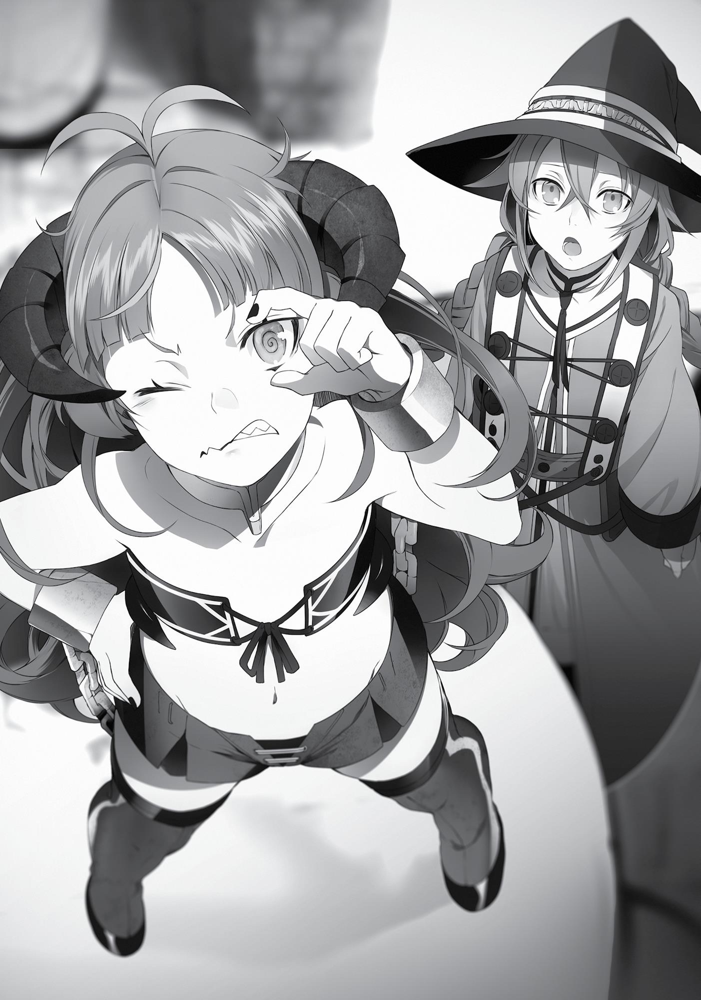

+++
title = "Interlude: The Two She Encountered"
date = 2026-07-20
weight = 13
[extra]
volume = 6
chapter = 14
+++

Roxy Migurdia arrived in the town of Krasma, located at
the tip of the northwestern part of the Demon Continent. It was a
thriving town, albeit not as robust as Rikarisu. Though it looked
unremarkable at first glance, this entire area was ruled by a Demon
King. One with intimate ties to the seafolk, allowing the town to
trade with them. With the seafolk came seafood, and with the
demons came strong, fragrant spices unique to the Demon
Continent, and it was in the town of Krasma that you could taste the
delicious food that resulted from the combination. The town boasted
such flavorful cuisine that it regularly tied with Wind Port for the title
of the place on the Demon Continent with the most delicious food.
“This food really goes great with some alcohol!”
Ever since they arrived in this town, Talhand had been in good
spirits. Krasma didn’t just have the bitter alcohol of the Demon
Continent, but the sweet alcohol of the seafolk as well. Talhand,
being a dwarf, loved alcohol, and as long as the drinking was fun, he
didn’t seem to mind how bad it tasted. When he went to the pub, he
invariably hit it off with the ruffians there and drank enough alcohol
to fill an entire bathtub. Pubs were everywhere in Krasma, so
between that and the good food, Talhand was in paradise.
As for Roxy, she still had the tastes of a child despite her age, so
the cuisine of this town didn’t agree with her. The food and
seasonings of the Demon Continent weren’t her thing, on the whole.
She liked sweet things.
The saving grace was the seafolk’s specialty, which was sweet
alcohol. It came as quite a shock to Roxy, who’d only ever associated
alcohol with bitterness. The liquor had an airy, seashore-like
fragrance to it, and if you took a drink, an indescribably sweet flavor

would spread in your mouth. The aftertaste left a bit of saltiness,
which only made you want to snack as you drank.
“Now that’s a rare sight! So you’re drinkin’ too, eh, Roxy?!”
“Yes, I am.”
“Yer in a good mood today, eh?” Talhand watched as Roxy drank
and cheerfully put in his next order. “Barkeep, bring us a cask! I’ll
teach ya how to drink like a dwarf!”
In times like these, Roxy thought they were sure fortunate that
things were so cheap on the Demon Continent. You could drink and
eat as much as you wanted and still cover the cost with one Asura
copper coin.
“Old man, you’re really chugging that down good!”
“Drink! Drink! Drink! Drink!”
“Just what you’d expect from a dwarf!”
“Mmkay, let’s have a competition! Barkeep, bring me a cask,
too!”
Incidentally, Elinalise had already disappeared into the night
with some man she’d hit it off with. This was normally the point
where Roxy would start to feel a bit alienated, but before she
realized it, she and the girl sitting next to her were both hooting at
the boisterous Talhand.
“Bwahaha! What a fine dwarf you are! No matter how the times
may change, the dwarves remain the same! You agree with me,
don’t ya?” the girl asked.
“Yes, certainly,” Roxy answered.
“Oh, here we go! Go on, chug! Chug! Chug!”
“Chug, chug!”
Talhand brazenly faced his drinking partner—a gigantic
demon—with his arms wrapped around his cask, quaffing away. His

body was certainly broad, but you still couldn’t help but wonder
where all that liquor was going. Once he emptied his enormous cask,
he let out a guttural sigh. Just as quickly, the next drink was brought
forth.
“Yer late with that alcohol!”
“Oh shut it! I’m out of stock!”
“In that case, go buy out the pub next door!”
“Ooh, there’s an idea! Okay then, you go buy it for us!”
“Just leave it to me! Put in yer coins, boys, put ’em in! We’re
gonna drink it up tonight!”
“Yeaaaaah!”
They passed around a bag for donations.
“Haha! Miss, you’re being awfully generous to pitiful drunkards
like us!”
“Yes, it’s my treat today!” Roxy dropped a green ore coin into
the bag as it made its rounds.
Seeing that, the man holding it grinned hugely and chuckled as
he bowed his head to her. “Impressive, miss! You must be rich!”
“Of course I am!” Roxy was in a pleasant mood, feeling light and
airy as she nodded at him in an exaggerated way. She was, in fact,
already drunk.
“Hahaha! I’m rich today too, so here you are, take it! And let’s
make some more noise! We’re all friends here today!” The girl sitting
beside her took a crude iron coin from her pocket and tossed it in the
bag as well.
The man holding the bag might have barked at her for only
donating such a pittance, but he was drunk himself. “Heh heh! Thank
ya kindly, princess! I’ll be usin’ this to make sure you guys drink until
you’re pukin’!”

“Yeah, let’s barf it all up!” The little girl gave a self-important
nod as the man kept doing on his rounds, gathering up people’s
money.
“Yeah, this is it, this is great! Makes me remember the old
days!”
Roxy had no idea when the young girl had taken up the seat
beside her. By the time she’d noticed, the girl was already there,
munching on the food that Elinalise had left behind. Roxy didn’t
mind. She was drunk.
“Well, here, have another.”
“Aah, thank you. Glad to see this is such a joyous atmosphere,
makes me glad I came. Here, you drink some too!” the girl said.
“I am drinking,” Roxy replied.
“Drink some more!”
“More? I suppose I have no choice.” Roxy did as she was told,
and gulped down the contents of the glass. “Pwah!”
“All right, one more for the young miss here!”
“Oh, thank you.”
She slammed her glass onto the table and some jovial
gentleman came along and filled it for her. She really could drink this
sweet liquor forever.
“You’re quite something, a real drinker! Quite amazing for
someone so young!”
“I don’t want to hear that from you,” Roxy quipped, scrutinizing
the girl. She wore boots that came up to her knees, leather hot
pants, and a leather tube top. The pale skin of her clavicle, waist,
belly button, and thighs were all in full view. She had voluminous
purple hair set in waves, and horns like a goat. It was obvious, no
matter how you looked at her, that she was younger than Roxy.
“Heh heh, no need for flattery. I know how old I am!”

Roxy should have suspected something was up by now, but she
didn’t have the wherewithal at the moment. Because she was drunk.
“I know my age as well,” she said. “Well, drink up.”
“Ohh, thank you. The alcohol here sure has gotten tastier in the
last few hundred years. In the old days, the Demon Content didn’t
have sweet alcohol like this.”
“This is the seafolk’s alcohol,” Roxy told her. “The Demon King
here struck a deal with them.”
“What’s that! Bagura Hagura, you bastard, you hid this from me!
I won’t forgive you for it!”
“Let it go,” Roxy cooed, “we’re all here as equals today, right?
Equals!”
“Ohh, that’s right, we’re all equals here!”
Demon King Bagura Hagura was the ruler of this region. He was
a burly, pig-faced demon, said to be the most knowledgable entity
on the Demon Continent when it came to food and alcohol.
Politically, he was a moderate, but still participated on the front lines
of Laplace’s War. When he was on human lands, he’d stolen food
and liquor from house after house, earning the title of the Plundering
King.
“Ooh, he’s out!”
“Gwaaahah, who’s up next? I’ll take on anyone! If ya want, I’ll
take on two of ya at once!”
At some point Talhand had stripped the clothes from his chest
and perched himself squarely atop a table. He had his elbow
balanced on top of a cask and was giving off an air of superiority.
“Anybody? Anybody at all?!”
The girl beside Roxy spoke up. “All right, leave it to me!”
“Whassat, girl, ya think ya can win against me? Maybe ya should
try again in another twenty years.”

“Ha ha ha! Foolish dwarf! I’ve already lived three hundred years!
A mere twenty would change nothing!”
“Ah, is that so? M’bad, then. Go ahead and come at me!”
“Ah, but…first, I would ask you to state your name! I will be sure
to remember you for being foolish enough to challenge me!”
“Talhand of the Harsh, Large Mountain Summit!”
“All right then! The one to defeat you will be I, the Demon
Emperor of Demon Eyes, Kishirika Kishirisu!”
And so, Kishirika and Talhand’s battle began. The additional
alcohol they bought was soon gone and funds had to be solicited a
second and then a third time. Roxy took it upon herself to donate
five whole green ore coins, sending the pub’s errand boy running to
get more. Brawny men came carrying in large amounts of liquor,
which those in the pub shared amongst themselves as Talhand and
Kishirika drank away. Roxy was to be the judge. She had no idea how
or what she was supposed to judge, but she took up a seat between
them and sipped away at her own drink as she accepted the role of
counting theirs.
“That’s number forty,” she announced.
Leaving aside Talhand, whose drinking habits matched his
dwarven heritage, just where was Kishirika, who looked like a little
girl and proclaimed herself a Demon Emperor, putting all that
alcohol? No one seemed to mind it because they were all drunk. And
then the deciding moment came.
“Mrgh… blegh…” Just seconds after Talhand squeaked out those
strange noises, alcohol came rocketing out of him like a water
fountain. Then he collapsed, clutching his stomach, which now
resembled the casks he’d been drinking from. He fell from the top of
the table to the ground with a noisy thud, alcohol spilling from his
mouth.
“I win!”

“Whooooa! Amazin’! You beat a dwarf in a drinking match!”
“My name is Kishirika, after all. The Demon World’s Great
Emperor Kishirika Kishirisu! Now, say my name!”
“Kishirika! Kishirika! Kishirika!”
“Who’s the greatest in the world?!”
“Kishirika! Kishirika! Kishirika!”
A chorus of chanting broke out when Kishirika was announced
the victor, brightening her mood.
“Ahahahahaha! Hahahaha!”
“That’s it, that’s it!”
“Take it off! Take it off!”
Roxy didn’t remember much after that. She knew she needed to
avenge her fallen comrade, but she was suddenly dizzy, and
unconsciousness was creeping up on her. The last thing she saw was
Kishirika climbing up on the counter and dancing around naked.
The next morning, Roxy opened her eyes.
“Urgh…”
Her head was pounding, and her face puckered when she
smelled the stench of alcohol on her own breath. She immediately
used a spell specifically tailored for hangovers to remove the toxins
from her body, then used a healing spell on her head. When she
looked around, she realized she was in a pub. It looked as if there
had been a brawl; the table was broken, and empty casks and
shattered bottles lay strewn about.
“Urgh, I really did drink too much.” Her memory was hazy, but
she did remember drinking too much.
She glanced to the side to see a half-naked Talhand lying there
with only the whites of his eyes showing. For a moment, Roxy

thought he might be dead, but a dwarf could never drink himself to
death. Besides, Talhand used to say that he’d once dreamed of
drowning to death in alcohol, so even if he had, it would have been
the death he’d aspired to.
Roxy cast her gaze about the room once again. There were
heaps of bodies everywhere, all spread about and moaning. Among
them was the man who’d solicited money for more drinks. Everyone
here had clearly drunk themselves into oblivion and was now
suffering in the throes of a hangover.
That’s what you get for drinking so much when you can’t even
use healing magic, Roxy thought.
Among the sea of unconscious forms, only two people were
standing—an angry barkeep and a disheartened Kishirika.
“Compensation, I’m asking for compensation. I can’t sell nothin’
with all the destruction you all caused.”
“Yeah, uh, but…”
“What, you can’t pay? Ain’t you the one who said you’d be
treatin’ everyone?”
“I did say that, but I thought what I paid already would be
enough…”
“So you don’t have any money, do ya?”
“No, uh, sorry, not a single crude iron.”
“Then I have no choice but to sell you in the slave market.”
“What? You would dare sell me…?! Wait, wait, I’ll contact
Hagura, just hold on!”
“I’m not gonna hold. You’re just sayin’ that so you can run
away.”
Roxy let out a sigh and dug into her pocket. She made a face
when she produced her coin bag and saw the state of it. She’d
donated a hefty portion of her funds when she was drunk last night.

No, the one who actually drank all of that was Talhand, she
thought. Roxy turned to the unconscious Talhand and swiped his
coin purse. She peered inside, found a decent amount within, and
took to her feet. There was a sour smell coming from her shoulder,
which she scrunched her face at as she approached the barkeep.
“Here’s your money.”
“Hm?”
Roxy took out six whole emerald ore coins and tucked them into
the barkeep’s hand.
“That ain’t quite enough.”
“We bought up all your booze before we started sending out for
more. You have the earnings from that, don’t you?”
“Ah…well, I guess,” he said as he turned on his heel and headed
back into the kitchen area.
Roxy let out another sigh as she tossed the coin purse onto
Talhand’s belly.
“Ooh…ooooh…I’m sorry, I’m so sorry!” Kishirika was trembling
as she looked up at Roxy.
Roxy looked down at her, remembering what she’d heard from
her old village chief about the Demon World’s Great Emperor. She
was a bit different from what Roxy had pictured, but her peculiarities
lined up. If she was from a demon tribe with a long lifespan, it made
sense that her physical appearance didn’t match her age. She
seemed to be on good terms with the Demon King of the area, too.
“Excuse me, just to confirm—I’m not mistaken in assuming that
you are the Great Emperor of the Demon World, Kishirika Kishirisu
herself, am I?”
“Hm? Oh, that’s right! No one seems to believe me lately,
though! And your name is?”

“Pardon the late introduction,” Roxy said. “I’m Roxy, of the
Biegoya Region’s Migurd tribe.”
Kishirika gave an, “Oooh,” when she heard Roxy’s name. “Roxy?
Ohh, I know you! You’re Rudeus’ master!”
“…You know Rudy?”
“I happened to run into him in Wind Port. That boy was quite
entertaining!”
“Y-you don’t say…” Roxy wondered suspiciously just what it was
that Rudeus had said about her, but she was too scared to ask.
“Hm, Rudeus helped me in a pinch, and you’ve shown yourself
to be a great teacher. You helped me as well, so let’s see…why don’t
I give you a reward?”
Roxy’s heart leaped when she heard the word reward. The Great
Emperor of the Demon World was famous for bestowing demon eyes
on people. It was precisely because of that power that she was called
Emperor rather than King, and it was that ability which had given her
the military strength to launch the Great Human-Demon War.
Which gave Roxy an idea. “Um, Your Greatness, are you able to
look for missing people with your demon eyes?”
“Yes, I can. There’s not a person in this world I can’t find,”
Kishirika boasted.
“All right…then I’d like you to look for Rudeus and his family.
They’re currently missing,” Roxy said without hesitation. It was a
shame to forego receiving a demon eye from Kishirika, but she’d
heard Kishirika’s Eye of All-Seeing could find anything and anyone,
anywhere in the world.
“Oho, how admirable of you, to use your one and only wish for
the sake of another! Were the world such that I was in the position
to do so, I’d bestow upon you the position of Demon King!”
“No, I don’t need that.”

“Oh, I see, too humble for that. Well, then…” Kishirika’s eye
rotated, changing color. She craned her neck this way and that,
humming to herself as she nodded. “Rudeus is in the northern part
of the Central Continent. He’s wearing light clothing and running.
Training, perhaps.”
Roxy bobbed her head. It seemed that, just as the message left
for him had requested, he was going to search the northern part of
the Central Continent. He could’ve headed straight for Begaritt from
Millishion, but he’d probably wanted to see the state of his home
before he set off.
“His father is in Millishion, along with a maid. Hmm, the maid is
apparently named Lilia…and they’re living in the same building, with
their two daughters.”
“Oh,” Roxy let her breath out. She’d heard that Lilia and Aisha
were still missing, but they’d apparently been found and were safe.
Perhaps Rudeus had found them on the Demon Continent and
escorted them home.
“His mother is…hold on a moment.” Kishirika hummed and
screwed up her face, squinting her eye. “She’s in Begaritt Continent,
in the Maze City of Rapan…it seems.”
Roxy’s face lit up. It was far from here, but at least she’d
confirmed that they were all alive. As you’d expect of the Greyrat
family—their luck was strong.
“However…something is a bit odd.” Kishirika’s face scrunched
and her eye slowly turned.
“Is there some kind of problem?”
“No…hmm, I can’t quite see.”
“You can’t see? Even with your eye, Your Greatness?”
“I’m not quite at my full strength yet,” Kishirika explained.
“Well, you’ll understand if you see for yourself.”

“That’s troubling. If something’s wrong, I need to know the
details.” Roxy pressed her for an explanation. In her ventures thus
far, she’d seen the tragedies that befell the refugees. It was
disconcerting that even the Great Emperor of the Demon World was
having trouble zeroing in on Zenith with her demon eyes.
“Well…complain if you like, but I can’t see what I can’t see. Ohh,
that’s right. This may come as a surprise, but she may be in the
middle of that labyrinth. It’s a labyrinth city, and I’ve never been
there myself, so I can’t say for sure.”
“You can’t see inside the labyrinth?” Roxy asked.
“No. Begaritt’s labyrinth is overflowing with a high
concentration of mana.”
Roxy fell into thought. Zenith had once gone dungeon delving
with Paul, Elinalise and Talhand. She understood their strength well
after journeying alongside them. However, why hadn’t she been in
contact yet? Three years had passed since the Displacement
Incident.
“At any rate, she is alive, yes?”
“Indeed, there’s no doubt about that,” Kishirika assured her.
Roxy decided to believe those words. Whatever the reason, they
would have to delve into that labyrinth.
She lowered her head. “I understand, then. Thank you.”
“Think nothing of it. It’s a show of gratitude for the help you
provided.” Kishirika gave an exaggerated nod and, still a little
unsteady on her feet, took her leave from the pub.

That afternoon, Talhand awoke and resumed his drinking as if
nothing had happened, and Elinalise returned with hickies peppered
across her neck. Roxy gathered the two of them for a meeting.
“It was good fortune to run into the Great Emperor of the
Demon World.” When she heard about Kishirika, Elinalise just
laughed quietly. Roxy didn’t think it was that significant an event,
perhaps because they’d met while they were drunk at a pub. Or
perhaps it was Kishirika’s lack of dignity.
“Leavin’ that aside, that means our journey’s over, right?”
Talhand responded, seeming a bit reluctant to see the end of their
quest.
It would take them a year to reach the Millis Continent from
here, but it was true that their objective had been fulfilled. They’d
confirmed that all of Paul’s family were alive, and even knew where
the last two were located. It was over.
“What are you going to do, Roxy?”
“I’m going to return to Millishion and talk to Paul about what I
found,” she said.
“Then we’ll part ways with you somewhere before then,”
Elinalise replied.
It seemed Elinalise and Talhand didn’t want to meet Paul. The
reason was apparently the huge fight they’d had when he left, but
they wouldn’t tell her exactly what had happened. Roxy wasn’t
particularly interested, either, so she hadn’t been all that persistent
in asking.
“Hmm, but Rudeus is pretty far off and all by himself,” Talhand
blurted out, pressing his hand to his chin.
That brought Roxy to a sudden realization. She would head to
Millishion from here, and then, most likely, travel alongside Paul to
the Begaritt Continent. If she did that, then Rudeus would be left

alone, unaware of the circumstances, searching the northern part of
the Central Continent by himself.
“We need to find some way to let him know,” Elinalise said,
concerned.
But how? The northern part of the Central Continent looked
nearby on a map, but it was much further in reality. Roxy fell back
into thought. Rudeus was exceptional, but he was still young. It was
cruel to leave him to struggle in vain in such a vulnerable period of
his life. Whether he reunited with his family or struck out on his own,
she at least wanted to tell him that he didn’t need to search
anymore.
“And that’s where I come in…du-du-du-dun!”
“And me! Dun-du-dun!”
Suddenly, two interlopers appeared out of nowhere.
“I listened in on your conversation!”
“By eavesdropping!”
The first to come bursting through the door was a well-built
man. A single glance at him was enough to know he was a demon,
for he had skin like obsidian and six arms. The ones on top were
folded in over his chest, the ones in the middle were making finger
guns at Roxy, and the bottom ones were resting on his waist. His
hair, which flowed down to his waist, was purple. Perched on his
shoulder, reclining at leisure, was the Demon World’s Great
Emperor.
“Here we go! I’m Kishirika Kishirika! People call me… the Great!
Emperor! Of! The! Demon! World!”
“And I’m her fiancé, the Demon King Badigadi!”
The other three stared, dumbfounded. The first to react was
Elinalise. “Um, I think we last saw each other this morning, sir.”

“Ahahaha, I had an amazing night with you, miss!” Badi
clenched one fist and inserted his thumb between his index and
middle finger as he responded.
Roxy felt a sudden cold sweat as she asked, “D-do you two know
each other?”
“Um, basically, I guess we do…?”
Apparently, Elinalise had left the pub Roxy was in and gone with
a man to a different one last night. There, the man had plied Elinalise
with alcohol, and she had happily returned the favor. Next thing she
knew, she was waking up in the pitch-black arms of the man before
them. After which, the two of them went at it again all afternoon.
“Huh? But just now, you said fiancé…what? Ah, I suppose we
should introduce ourselves first?” Flustered, Roxy’s eyes darted back
and forth, but she finally settled on bowing her head.
“Hm, Roxy, raise your head. Since Badi is so popular, this is a
near-daily occurrence.”
“Hm, more like it’s physically impossible for me to put it in
Kishirika yet, so I have no other choice.”
The words were spoken in such a carefree manner that Roxy’s
brain struggled to digest their meaning. Courtesy of Elinalise, she had
gained a smattering of knowledge on such matters, but the
adulterous relations between her companion and a man who called
himself a Demon King and the fiancé of the Great Emperor of the
Demon World went beyond her realm of understanding.
“However! Leaving all of that aside!”
“Indeed; it’s just a passing fling anyway!”
Roxy knew of the Demon King Badigadi, or the Immortal Demon
King Badigadi, as he was known. He was the Demon King who ruled
over the Biegoya Region, younger brother of the Immortal Demon
King Atofe. Atofe was aligned with the moderates during the war and

fought against the Demon God Laplace at Kishirika’s Castle, where he
was defeated. His current whereabouts were unknown, but he was a
venerated figure.
“Roxy, I owe a debt to Rudeus. If he has lost his way, then I will
lend him my strength!”
“Although she’ll be borrowing my strength to do it!”
Before Roxy, as confused as she was, could respond, Talhand
recovered. He stroked his thick beard, directing a quizzical look
toward Kishirika. “Yer sure about this?”
“Ooh, you’re the dwarf from yesterday! Yes, I’m sure, right,
Badi?” Kishirika smacked him on the head and the Demon King
nodded.
“Yeah, I’m curious about this brat named Rudeus whom
Kishirika keeps praising every chance she gets! I want to see with my
own eyes just how great he really is!”
“What’s this? Are you jealous, darling?” Kishirika cooed.
“Why of course I am, honey,” Badi replied in turn.
“Tsk, you’re still such a child. I love you and only you.”
“Heh, I’m not going to let that make me complacent. I’ll crush
any rivals who appear.”
And you crushing Rudeus would be bad, Roxy thought to herself,
but she had a feeling they wouldn’t listen to her.
“Heh heh heh.”
“Hahaha.”
“Ahahahaha! Hahahah! Haha-urk!”
“Hahahaha! Ahahaha! Ha… you okay?”
The conversation proceeded apace before Roxy could even
begin to make sense of it.

It was common knowledge in this world that the seas were ruled
by the seafolk, who in turn controlled the ability of those living on
land to cross them. This setup was a result of discord that broke out
in the process of Laplace’s War coming to an end, but we’ll leave that
aside for now.
The Demon King Bagura Hagura and the King of the Seafolk
were close personal friends, and the King of the Seafolk allowed his
friend passage in secret. Meanwhile, Demon King Badgadi and the
Demon King Bagura Hagura were also old acquaintances. By making
use of that connection, their group could bypass the route that
would take them through the Divine Continent, and head straight for
the Central Continent instead.
However, if Roxy went with them, the report to Millishion would
be delayed. Someone had to go to Millishion to update Paul, and
Roxy couldn’t do it alone. The Demon Continent was too dangerous,
even for an exceptional magician like her. Her judgment was sharp
and her spell incantation quick, but she still had to sleep at night.
“I absolutely refuse. I don’t want to see Paul’s face,” said
Elinalise.
“Yeah, me either,” Talhand chimed in.
“Very well, then. I will be the one to go.” Since the two of them
were being selfish, Roxy would first head to Millishion. Personally,
she would have preferred to see Rudeus, but she had no other
choice.
She just needed one more to go with her. The two exchanged
glances, and soon enough, Talhand folded. “Guess it’ll be me. To tell
the truth, not lookin’ forward to bein’ on one of those ships again.”
“My sympathies,” Elinalise said.

Talhand’s shoulders drooped. Roxy didn’t see why the two of
them couldn’t just head to Millishion and inform Paul via letter, but
they apparently had their reasons, so she didn’t think too deeply
about it.
And so, Roxy’s party split into two. Roxy and Talhand would
retrace their path back to Millishion. Elinalise would travel with the
Great Emperor of the Demon World Kishirika Kishirisu and the
Demon King Badigadi to the northern part of the Central Continent.
There was quite a bit of time before the latter’s ship set off, so Roxy
decided to depart ahead of them.
“Miss Elinalise, thank you for everything.”
“Same to you, Roxy.” The two exchanged a firm handshake. “If
you find a good man, you better not let him go. You have to use your
upper and lower lips to get a tight grip on him.”
“You’re bringing that up again?”
“None of that, just listen to me. If there’s someone you really
like, go hard for them. Love is something that can grow afterward.”
Talhand breathed a sigh at Elinalise’s words. “You said the same
thing to Zenith, didn’t ya?”
“I did. That’s how she got Paul. My teaching is flawless.”
So that’s it, Roxy thought as she listened in. Paul and Zenith
seemed like the ideal husband and wife to her. If it was Elinalise’s
advice that brought them together, then it was advice worth
listening to.
“Very well, Miss Elinalise. If I find such a person, I will ‘go hard
for them.’”
“Of course. I’ll be sure to tell Rudeus how miserable you were at
night, rustling in your bedsheets as you went at it alone.”
“Wait—why do you know about that? And please don’t say that.
I wasn’t thinking about Rudy when I did it.”

“Of course, of course.”
Roxy had a realization just then. If Elinalise began her search
now, she’d probably find Rudeus within about a year. Rudeus would
be thirteen or fourteen by now. At that age, it wasn’t unusual to
think Elinalise might be interested in him. That kind of bothered her.
“You went quiet all of a sudden. What’s wrong?”
“No, it’s just… If Rudy has become a fine man, will you go for
him?”
Roxy tried to sound as casual as she could when asking, and
when she did, Elinalise breathed out a disgusted, “Ha! I don’t have
the faintest desire to become Paul’s daughter-in-law.” She looked
genuinely disgusted.
Feeling reassured, Roxy just said, “Oh, all right.” Then, “Well,
we’d best be on our way.”
“Farewell, Roxy. Have a safe trip.”
“Yes, you too, Miss Elinalise.”
Elinalise took a glance at Talhand. She loomed over the short,
stubby dwarf, glaring down at him as if he were some kind of insect.
“Talhand, please go off and die in a ditch somewhere.”
Talhand looked equally displeased at seeing her and hocked
some spit onto the ground. “I’m returnin’ those words right back to
ya.”
Watching this, Roxy was reminded once again that the two of
them were, somehow, close.
Later, Elinalise boarded her own ship. It was a seafolk vessel,
back in ancient times. It was pulled along by sea creatures, making
the human-made ships look shabby in comparison, but human ships
were actually faster and safer.

Elinalise walked up the ramp alongside Badigadi. From behind
them came Kishirika’s echoing laughter.
“Hahahaha! Well then, let’s see each other again, Badi! When
you want to see me again, return to the Demon Continent!”
“Indeed, and stay in good health as well, my betrothed! We’ll
eventually meet again! Ahahaha!”
“Who knows how many years it will be until the next time,
though! Bwaahaha!”
The Great Emperor of the Demon World, Kishirika Kishirisu, did
not board the ship. When Elinalise saw that, she cocked her head.
“Hm? She’s not going to come along with us?”
“Mm. Kishirika can’t leave the Demon Continent.”
“Oh, a curse?”
“Something like that.”
If that was how things were, Elinalise would have preferred
Kishirika accompany Roxy and Talhand. Their safety would be
assured with the Great Emperor of the Demon World around. Then
again—she thought about what it would be like for Roxy to have
someone like Kishirika following her around, and changed her mind.
Meanwhile, Roxy Migurdia’s journey continued.
