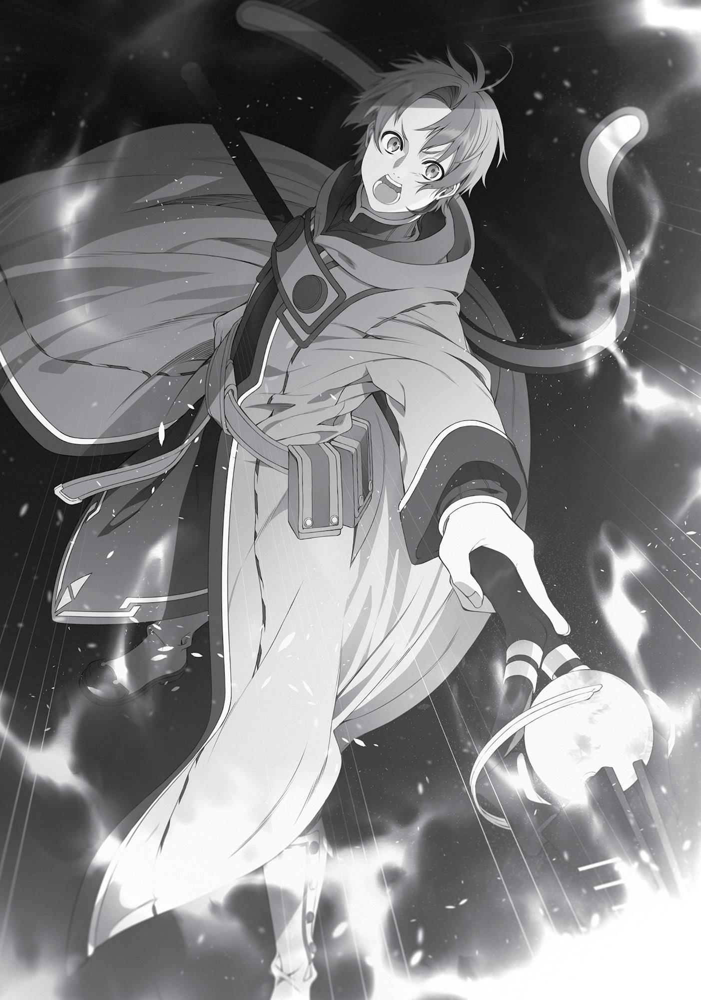

+++
title = "Chapter 2: The Luster Grizzlies"
date = 2026-07-20
weight = 2
[extra]
volume = 7
chapter = 3
+++

The next morning, I dutifully headed over to the northern
gate of the city. I wasn’t feeling too enthusiastic about this
expedition, but my body moved along on autopilot. I’d actually
gathered some information on the Luster Grizzlies and this Lake
Cucuru place before I went to bed. The habits I’d picked up on the
Demon Continent must have kicked in.
I looked around the dark, quiet streets. Suzanne hadn’t specified
an exact time to meet, so I’d showed up as early as I could. It didn’t
look like they were here yet. It was hard to say without any clocks
around, but it was probably around four in the morning. Maybe they
were still asleep.
Honestly, I hadn’t gotten that much rest last night. It was cold
here, for one thing. And I might have been a little nervous about
teaming up with a group of people I didn’t know too well. “They’re
taking their time…”
When adventurers set off on a job, the general rule was that you
met up first thing in the morning. Maybe I’d come too early this time,
but it beat showing up late. The last thing I needed was to get left
behind and end up moping around by myself all day.
It wasn’t like I was the only one out here, either. There was
another party hanging around near the gate as well. They seemed to
be waiting on one last straggler.
Still, it was possible that I’d gotten the wrong idea at some
point. Maybe they wouldn’t be coming until noon? It might make
sense to leave later if you decided to arrive at your destination at a
specific time. But then again, I told them which inn I was staying at. If
they’d worked out a different departure time, wouldn’t they have
gotten in touch with me?

“Oh.” Just as my thoughts were starting to spin in circles, I
spotted a small group of people walking toward me through the
morning mist.
“Hey there!” called Suzanne from the head of the column.
“You’re here early. You didn’t seem too enthusiastic yesterday, so I
sort of assumed you’d keep us waiting.”
“…I just woke up a little early today, that’s all.”
“Hmmm…” Suzanne seemed amused. Maybe she thought I’d
showed up early because I was secretly lonely and yearning for
human contact or something? That wasn’t really true, but…I didn’t
feel like bothering to deny it.
“Okay then,” I said, removing my hand from my pocket and
offering it to her. “Thanks for having me as a temporary member of
your party. My name’s Rudeus Greyrat. I’m a magician and an Aranked adventurer. Like I said yesterday, I’m good at support magic.”
Suzanne blinked in surprise. I wasn’t too friendly on the trip up
here, and she probably hadn’t expected me to get all polite at this
point. I hadn’t planned this in advance; it just felt like I ought to
formally introduce myself, at least.
“Well, my name’s Suzanne. I’m the sub-leader of Counter Arrow,
and a warrior by trade. I fight on the frontline.”
“Sub-leader? You’re not the one in charge?”
“I do boss people around sometimes, but we’ve got an actual
leader, too.” Suzanne jerked her chin at one of the men behind her,
who nodded and stepped forward. My first impression of the guy
was that he seemed a little…glum. Judging from his brownish-red
robe and the long staff he carried, he was probably a magician, too.
“It’s a pleasure to meet you. I’m Timothy, a magician. My
specialty’s offensive magic, and I fight on the backline. Technically,
I’m also the leader of this party.”

“Nice to meet you.”
I got the feeling that Suzanne probably held the real power
around here. It wasn’t necessarily a bad thing to have someone a
rung below the top calling the shots, though. I mean, aren’t you
supposed to put the lazy, stupid people in command or something?
Not that I was calling this guy a moron, of course…
Also, a strict chain of command can be kind of fragile. Once
someone disobeys a single order, the whole thing just falls apart. But
with a setup like this, Timothy could conceivably step in to override
Suzanne if things got dicey. Or maybe Timothy decided their general
strategy, and Suzanne just took care of all the details? While she put
their plans into action, he could keep an eye on the big picture and
course-correct if they got too far off track.
In any case, the two of them had clearly found some way to
work together smoothly. One hell of a difference from me and Eris…
Sniffle…
“Huh?! Wh-what’s the matter?!”
“Sorry. This just brought back some memories, that’s all.”
“I see… My condolences, Rudeus. The leader of your former
party must have been a wonderful person.”
“Uh, not really…” Dead End’s leader had been a useless idiot
from start to finish. The guy we named the party after was a much
better man by any measure. “Anyway, um, I’ll do my best not to
cause you any trouble.”
“Well, all right then… I’m looking forward to working with you.”
Timothy stepped back, and the other party members took their cue
to introduce themselves.
“Hey there. The name’s Mimir, and I’m the healer. I’m
intermediate rank in Healing magic and beginner rank in
Detoxification.” Mimir was a man of average height and weight who
wore a plain white robe.

“I’m the warrior mage, Patrice. Don’t expect too much on the
‘mage’ front, though. I only know the beginner-tier wind spells.” And
Patrice was a muscular frontliner who carried a sword at his hip and
a small beginner’s wand in one hand.
They both seemed to be in their mid-to-late twenties, about the
same age as Timothy. I didn’t know how long they’d been
adventuring, but if they’d hit the B-rank, they were presumably
seasoned veterans.
Finally, there was the last member of the party…
“I’m Sara. I’m an archer. I fight from the midline.”
…who, for some reason, was glaring at me again.
Sara was notably younger than the other four members of her
party. She was probably in her mid-teens—right on the verge of
adulthood, by the standards of this world. I don’t know if it was her
sharp expression, or the fact that her facial features were classically
Asuran…but I felt like she kind of resembled Eris. At least a little.
“What? You have something to say?”
“Sorry, no. It’s nothing…” Her glare was getting even fiercer, so I
averted my eyes.
“Just for your information, I’m not happy about this. I’m only
putting up with you because Suzanne insisted, okay? If you screw up
and get someone killed, I promise you’ll regret it.”
“…Right.”
I didn’t bother trying to placate her. It was always better to get
along with your teammates, of course. But it wasn’t like we’d be
working together for very long. If she was going to be this hostile, I
might as well just keep my distance.
“Cut it out, Sara.”
“But Suzanne—”

“Look. Someday we might go our separate ways, right? You
might end up having to join a new party full of strangers.”
“Wait, what? Are you going to disband the party or something?”
“It might happen eventually. And if one of us dies, we’ll have to
bring in someone new to replace them, you know?” Suzanne sighed
and shook her head. “Back in Asura, you could get away with
rejecting teammates who annoyed you. But from now on, that might
not be an option. It’s about time you learned to work with people
other than us.”
Ah. Now things made a bit more sense. Suzanne hadn’t just
invited me out of sympathy. She was using me a teaching tool. That
explained why she’d been so persistent. It made sense to choose a
younger guy like me if she was thinking five or ten years ahead. By
that point, Sara would be more seasoned, and might find herself
teaming up with younger and less experienced kids. Also, once she
managed to work with an unfriendly jerk like me, everyone else
would seem easier to put up with.
I wasn’t sure how I felt about this, honestly…but it didn’t matter.
Couldn’t hurt to play along, right? It wasn’t costing me anything.
“You got the message? Good. Now that we’ve all introduced
ourselves, let’s get going.”
With that said, the six of us set off on our Grizzly-slaying
expedition.
Three days later, having travelled a decent distance north of
Rosenburg, we set up camp near our destination. Lake Cucuru,
where this pack of monsters could supposedly be found, was only a
few hours away. Luster Grizzlies couldn’t see too well in the dark,

and moved sluggishly at night. Our plan was to wait until the sun set
before we launched our surprise attack.
In the meantime, we had a group meeting to discuss our
performance in the battles we’d fought on the way up here. Counter
Arrow wasn’t a bad party by any means. With two in the vanguard,
one ranged fighter, and two rear guard, they felt like a well-balanced
group.
They’d slotted me into a ranged support role, which meant
casting Quagmire the instant we spotted enemies in the distance.
After I slowed them down, Timothy used his fire magic to cut down
their numbers long-range. Once the survivors closed in, Suzanne and
Patrice stepped forward to fight, and Sara backed them up at
medium range. When one of the frontliners took a hit, Mimir
immediately healed them.
We took out plenty of monsters on the road north, and this plan
had always worked out smoothly enough. Suzanne, Timothy, Mimir,
and Patrice definitely knew what they were doing. They weren’t
exactly on Ruijerd’s level, of course, but when it came to teamwork,
they put Eris to shame.
That said… I couldn’t help feeling a little underutilized, since
casting Quagmire was literally my only job. I’d decided to put
forward a few proposals. “Um, maybe I could switch over to support
when the enemies reach our frontline?”
Unfortunately, Sara shot down all my ideas one by one. “You
don’t know how Suzanne and Patrice fight yet! We don’t need you
hitting them by accident! Just stay put!”
“Okay then. Why don’t I help Timothy thin down their numbers
after I slow them down?”
“Magicians are supposed to keep some mana in reserve during
longer battles, stupid! You just stop them in their tracks. That’s all we
need from you!”

“Uh…could I at least move forward once the enemy’s closed in
on us, then?”
“Do you want me to shoot you in the back, or what?”
To be honest, it felt like I was fighting with my hands tied behind
my back. If I joined the attack with Timothy, we could probably have
wiped out most groups of monsters at long range, instead of letting
them get in close enough to hurt the frontline fighters.
Still, efficiency wasn’t everything. Sara was getting more
practice this way, after all. I’d done something similar on the Demon
Continent myself. And at the end of the day, I was only a temporary
member of this party. I didn’t have much choice but to keep my
mouth shut and try to learn their way of doing things. As long as I
could think on my feet in an emergency, it did make sense to hold
back instead of trying to do everything myself. Teamwork was a skill
you had to build up through practice, after all.
I wasn’t sure I could act quickly under pressure, though…
“Look, you’re not really a member of this party, okay? Just do
what you’re told and try not to make a nuisance of yourself.”
“All right.”
Sara certainly didn’t seem very interested in learning to work
with me, either. It sure felt like she hated my guts—maybe because
I’d made such a lousy first impression. It wasn’t like I needed to make
friends with her, but this open hostility brought back some memories
that stung a little. When I first started as Eris’ tutor, she treated me
the same way for a while.
“Sara, I think you’ve made your point,” said Suzanne. “Why are
you being so hostile to him?”
“It’s just… I don’t know! He’s younger than me, but his attitude’s
kind of disrespectful…”

“That’s totally normal for an adventurer, kiddo. You’re pretty
casual with us yourself, aren’t you?”
“Yeah, I guess.”
“Well then, try to keep your irritation to yourself. We’re about
to start on the main part of the job, remember? This isn’t a great
time for you to make things awkward.”
“Uh, sorry…” Sara cringed a little when Suzanne scolded her.
Judging from the look she shot in my direction, though, she wasn’t
planning to apologize. Once we finished up with the group meeting,
she lay down for a nap and dozed off almost instantly.
That’s youth for you, I guess. I decided to get some sleep as well
once I’d relieved myself. Wandering a little way out of our camp, I
found a relatively private spot to piss in. Just as I was getting started,
though, I heard someone coming up from behind.
It was Timothy. He took a spot beside me, opened his robe,
revealed a surprisingly sizable…uh, wand…and started emptying his
bladder as well.
“Sorry about that, Rudeus,” he said after a moment.
“…About what?” I wasn’t entirely sure what he was even
apologizing for.
“Sara. She’s not a bad kid, but she’s gotten a little full of herself
lately, you know?”
“You can hardly blame her. That girl’s a prodigy with the bow.”
The four B-ranked members of Counter Arrow were seasoned
veterans, yes, but Sara stood out for her sheer talent. I’d seen her
shoot down monster after monster with perfectly placed arrows,
even at long range. Her battlefield awareness and agility were top
notch, and she never seemed to slip up. When it came to combat,
she was already on the level of an A-ranked adventurer.

Archers weren’t particularly common in this world. Mages could
strike from a greater range and do more damage with their attacks,
and while a magician could regain their mana after a good night’s
sleep, an archer was limited by their arrows. The more you carried,
the more weight you had to lug around. This wasn’t some RPG where
you could stash ten thousand of the things in your backpack. For the
most part, you were better off learning magic than the bow.
That said, a truly special talent could make all those
disadvantages seem irrelevant. When you could fire five arrows in
the time it took a magician to cast a single spell, or land a critical hit
every single time, you could get by just fine as an archer. In this line
of work, at least.
If you wanted to become the single strongest person in the
entire world, that was a different story.
At any, Sara was incredibly skilled for her age. Her raw talent
was probably comparable to that of Eris.
“Well, you’re no slouch yourself, aren’t you? That’s fairly
obvious. I mean, you’re the first silent spellcaster I’ve seen since my
teacher at the academy.”
“…It hasn’t done me much good. I still lost everyone I cared
about.”
“Ah. Right. My apologies.”
Silent spellcasting was a helpful skill, of course, but knowing a
few tricks like that didn’t make me special. What good was any of it if
I couldn’t even keep a single girl happy?
Well, I guess it might help me earn some name recognition, at
least… There was a chance I’d attract some unwanted attention. But
Zenith knew I could cast spells silently, so it was probably worth
advertising that fact.
“Anyway, I’m sorry about all this, Rudeus.”

“That’s all right…”
This was kind of interesting, though. Maybe the older members
of the party had realized I was more capable than I looked, after all. I
guess they’d learned how to size people up over the years. Those
four were very good at fully utilizing every tool and resource at their
disposal.
In terms of raw combat strength, they were probably
comparable to highly skilled C-ranked adventurers. But through
sheer efficiency and coordination, they got by just fine as a B-ranked
party. Counter Arrow was more than the sum of its parts. They knew
their own capabilities, and they divided tasks accordingly.
That didn’t leave much room for anyone to mess around or
experiment, though. When Sara told me to stick to my basic duties,
they scolded her for her attitude, but didn’t actually contradict what
she was saying. That was partially because they wanted her to get
more practice, but it was also a reflection of their methodical,
systematic approach.
There was a downside there. Since we never experimented with
anything other than their set strategies, they didn’t know exactly
what I could and couldn’t do. That might lead to some serious
problems, especially if they’d overestimated me. Timothy and the
others had been keeping an eye on me, of course, but they were also
trying to see how well they could deal with the monsters in this
unfamiliar country. I could just tell them my own strengths and
weaknesses, but they’d probably take my claims with a grain of salt.
You had to wonder why they’d even brought me along, under
the circumstances…but the “sympathy” thing was probably relevant
there. People don’t always act in purely rational ways.
“It doesn’t really bother me.” Right now, all I could really do was
stick to my role as a Quagmire-casting robot and try not to overthink
things.

“Thanks for being so understanding. We’ll be heading out once
the sun sets, so try to get some rest until then.”
“Sure.”
With a nod to Timothy, I headed back to the camp to catch a
few hours’ sleep.
The Luster Grizzly was a B-ranked monster, one of the more
common kinds found in the northern region of the Central Continent.
In appearance, it was basically a large bear with a white coat and a
single black stripe that ran vertically down its middle. But they
differed from most bears in a few important respects: they moved in
sizable packs, and when winter drew near, they worked together to
build up huge collective stockpiles of food. At that time of year, their
attacks on humans grew much more frequent.
That said, they were comparatively mellow in the summer
months, when they tended to hang around sources of water to mate.
Adventurers often took this opportunity to exterminate them. The
standard method of dealing with a large pack was to find them
during mating season and launch a surprise attack at night.
“All right then…”
After clambering up to the top of a slight hill near Lake Cucuru,
we spotted the Luster Grizzlies in the distance. We were downwind
from them and well-hidden by the brush. There wasn’t much risk of
them noticing our presence…especially since they were fast asleep
after copulating all afternoon and evening. Luster Grizzlies didn’t
bother digging holes to sleep in. When they got tired, they just
flopped on the ground like sea lions.

We were going to fire magic at them from a distance, hopefully
killing many of them and sending the others into a panic. Once they
did start running in our direction, there wouldn’t be enough of them
left to give our close-range fighters any trouble.
Assuming everything went according to plan, of course.
“What’ve we got, Sara?”
“Looks like there’s about twenty of them…”
As we lay flat on top of the hill, Sara peered out at the distant
group of monsters. Unsurprisingly, she had the best eyes in the
party. If she thought there were twenty of them, I was going to have
to take her word for it. In the darkness, all I could make out were a
few little white dots scattered around maybe three hundred meters
away.
From this range, Ruijerd could have given us a precise report on
their numbers in an instant…but he wasn’t here, so there wasn’t
much point in thinking about it.
“You think we can take them?” murmured Suzanne.
“We’ll be fine! Right, guys?” said Sara, turning back to us with a
face filled with confidence.
I wasn’t sure how quickly Luster Grizzlies could run, but we did
have a positional advantage. I could slow their charge down with a
well-placed Quagmire, and since we’d all gotten some rest
beforehand, Timothy, Patrice, and Mimir had plenty of mana to work
with.
“All right then,” said Timothy. “Let’s get started.”
Suddenly, everyone was laser-focused on the task at hand.
Twenty Grizzlies did seem like a manageable number, but that was
no reason to get overconfident. I clutched my staff tightly in my
hands and stared intently into the darkness, just like the others.

“Let the vast and blessed flame converge at thy command! O
raging fire, offer us a great and blazing gift! Great Fireball!”
“Quagmire!”
Just as Timothy finished the incantation for his intermediate-tier
Fire spell, I transformed a large patch of ground into a thick, muddy
bog. I tried to place it just inside Sara’s range of fire; if the Grizzlies
were stopped in their tracks here, she’d be able to pick them off with
ease.
“Let the vast and blessed flame converge at thy command! O
raging fire, offer us a great and blazing gift! Great Fireball!”
Timothy had already launched a second Great Fireball in quick
succession. The thing had to be two meters in diameter, but it
hurtled through the air with impressive speed. I watched as it struck
one of the Grizzlies. Even from this distance, I could tell the monster
had died instantly. I’d seen Timothy do this a number of times on our
way up here, but his Great Fireball really was remarkably powerful,
quick, and precise. You could tell he had a great deal of experience
casting it.
“They’ve spotted us!” One by one, the roaring, furious Luster
Grizzlies began to run in our direction.
Some of Timothy’s fireballs missed their targets now that the
monsters were in motion, but he still managed to pick off quite a few
of them as they drew closer. Everything was going smoothly so far.
By the time they reached the spot where I’d placed my Quagmire,
half the Grizzlies were dead. Since Sara would be taking more of
them down from this point on, it seemed possible that we’d wipe the
creatures out before they even got in close.
Pretty easy for an A-ranked job, really…
…Or so I thought for a fraction of a second.
“Huh?!”

Just before the pack of Luster Grizzlies hit my Quagmire, one of
Timothy’s fireballs briefly illuminated the area all around them.
There were other shapes moving through the darkness. Many other
shapes, off to the side of the bog that I’d created.
Whatever they were, they were jet-black…and the same size as
the Luster Grizzlies.
“What?! Are those black Grizzlies?!” shouted Sara.
When I heard those words, something clicked inside my mind.
Those shapes were Luster Grizzlies, all right. They were just
covered in mud. For all intents and purposes, they were wearing
camouflage.
Of course, it wasn’t mud from my Quagmire. There must have
been another pack at the lake, sleeping in a boggy area not far from
the group we’d spotted. When the pack next to them came under
attack, they’d woken up and spotted us.
“There’s way too many of them!”
“Retreat! Retreat!” Flustered, Timothy shouted the order to fall
back.
It was an understandable reaction. This second pack was huge;
there had to be more than sixty of them. And they were rushing right
at us, faintly visible thanks to the small fires left behind by Timothy’s
magic.
I guess he’d made a snap judgment that we couldn’t hope to win
this fight…but to be honest, it was a little late to be retreating now.
Ideally, we would have noticed this pack before we attacked the
other one, and decided not to risk this in the first place. It had been a
serious mistake not to scout out the area during the daylight hours.
“We can’t fight them here!” Suzanne shouted from somewhere
in the darkness. “Fall back to that place we found on the way!”

Earlier on, we’d found a natural chokepoint where we could
lead the Grizzlies in case their numbers proved too much to handle.
If we made it there and regrouped… But again, it was too late for
that. To reach that chokepoint, we’d need far more distance
between us and the monsters, and a huge Quagmire in their path to
slow them down. We couldn’t hope to get away from a pack of
Luster Grizzlies running at full tilt with no obstacles in their way.
There just weren’t any options left here.
“It’s no good! They’ll catch up to us!”
“Tch! I’ll keep them busy! The rest of you make a run for it!”
“Suzanne!”
Suzanne had stopped dead in her tracks. Sara spun around, her
face pale and fearful. “No! I’ll stay behind! This is my fault! I’m the
one who didn’t notice them!”
“You wouldn’t even slow them down, kid!”
“Don’t be an idiot, Suzanne!” said Patrice. “There’s too many of
them for anyone to hold off alone! If you’re not running, nobody is!”
“All right! Let’s show ’em what we’re made of!” called Mimir.
Abandoning the attempted retreat, everyone lifted their
weapons and prepared to fight. The pack of Luster Grizzlies bore
down on us with ferocious speed, loud and violent as an earthquake.
Even in the darkness, it was a terrifying sight.
Sara’s legs were trembling. She wasn’t the only one, either.
Suzanne, Mimir, Patrice, and Timothy all looked like they were
staring death straight in the face.
But not a single one of them tried to flee.
As I stared at the five of them, I felt my heart pounding in my
chest. Was it because the Luster Grizzlies were closing in on us? No.
Definitely not. That didn’t even feel important.
It was Suzanne. And Sara. And Timothy, Mimir, and Patrice.

For some reason, looking at them stirred something in me. My
breath grew rough. I didn’t know what this emotion was exactly, but
it was intense. Something about the way they were facing down that
horde of monsters…really struck a chord with me.
“Ah…”
At some point, I’d reached into my pocket to clutch at what I
had in there.
“What are you doing, Rudeus?!” shouted Patrice.
The others all glanced back in my direction. For an instant, I saw
their faces. There was no despair on any of them. Not even Sara’s.
They were all desperate and determined to find some way to survive.
Even now, none of them had given up. None of them had accepted
their own death.
I knew, in that instant, why they’d chosen to stand their ground
and fight. I read the answer on their faces. I felt it inside my pocket.
And I saw it in a memory that flashed briefly through my mind.
I’d known the answer for a long time now.
And now that I remembered it…
“It’s all right. I’ll handle this.” I spoke to them so calmly that I
surprised even myself.
Keeping my emotions hidden as best I could, I pointed my staff
directly at the onrushing group of mud-coated Luster Grizzlies.
“Exodus Flame.”
An enormous wave of magical fire cut through the pack like a
hot knife through butter.

An hour passed. The area around the lake had been reduced to
a charred wasteland. The corpses of Luster Grizzlies were
everywhere. Most had been burned to a crisp, but a few still had
their pelts reasonably intact. At the moment, we were skinning as
many of them as we could.
My fire magic had wiped out the majority of the Grizzlies. After
that, they split up and began to run in all directions. A handful did
keep charging at us, but Suzanne and the others dealt with those,
and I picked off the ones that tried to flee with Stone Cannon.
Once the last monster went down, everyone just stood around
in silence for a long moment, until I finally proposed that we get to
work on the bodies. We’d been at it for a while now.
We needed to bring back the Luster Grizzlies’ tails to prove that
we’d done our job, and their pelts to sell for cash. Naturally, their fur
fetched a pretty decent price. It was standard practice for
adventurers to lug back as much of it as they could carry. We’d split
into teams of two for the messy part. I’d been paired up with
Timothy, my fellow magician. He’d been silent for some time now. I
got the feeling he wasn’t exactly sure what to say to me.
It wasn’t just Timothy, though. Everyone else was quiet, too.
Still, it wasn’t the worst kind of silence in the world. I didn’t feel any
need to break it.
By the time we’d skinned the Grizzlies, collected their tails and
pelts, and began to burn their bodies in a pile, the sky was beginning
to lighten. The air filled with the smell of sizzling meat. It was a scent
I’d come to associate with the end of a successful monster-slaying
job.
As I watched the fire, Suzanne came to stand at my side. “I guess
we owe you one, huh?” she said, shrugging her shoulders. “If it

wasn’t for you, we’d all be dead. I had the feeling there was more to
you than meets the eye, but I sure as hell wasn’t expecting a
performance like that.”
“I don’t know. If it wasn’t for me, you guys wouldn’t have taken
on this job in the first place, right? You probably would have started
off with a B- or even C-ranked job to get a feel for the area.”
“Well, true enough…”
Suzanne scratched at her cheek with an awkward look on her
face, but I meant every word sincerely. If anything, I was grateful for
Counter Arrow. They helped me realize something in the middle of
that battle, and I felt a little better because of it. “I’m glad you
brought me out here, though. Thank you again.”
“…Any time, kid. You about ready to head back?”
“Sure.”
Suzanne looked me in the face and smiled, then turned to walk
back toward our pile of pelts. The next step was to make our
triumphant return to Rosenburg, lugging as many of those things as
we could. The monsters had been slain, but that didn’t mean our job
was done yet. It wasn’t over until you brought back the proof and
sold off your loot.
A few moments later, as I was hefting a bundle of pelts over my
shoulder, I noticed someone had come over to stand in front of me.
It wasn’t Suzanne this time; it was a girl about my own height.
“…Thanks for the save.”
With those brief words, Sara promptly turned around and ran
back over to Suzanne.

When the six of us returned to the Rosenburg Adventurers’
Guild carrying dozens of pelts, we were met with less-than-friendly
gazes from the locals. Many adventurers worked out of a single city
for many years, or even for their entire career. When outsiders
showed up out of nowhere and immediately pulled off a big,
lucrative job, it always inspired at least a little hostility of this kind. In
rougher towns, you’d actually get people coming up to harass you
and demand a cut of your earnings.
I glanced over at Timothy, wondering how he’d handle this. To
my surprise, I found him looking around the room with a bright smile
on his face, as if the other adventurers were old friends instead of
glowering, resentful strangers. “Tonight, we’re celebrating my
party’s arrival in Rosenburg!” he shouted to the crowd. “Let’s head
over to the bar, everyone. I’m buying!”
For a moment the other adventurers were too startled to react,
but they knew a good deal when they heard one. Cheers went up all
around the room.
“Hey, the new kids in town seem friendly for once!”
“Hahaha! I like you guys!”
“Hell yeah! Free booze!”
I was stunned, to be honest. Was Timothy really tossing away
the earnings from a seven-day job this casually?
Suzanne saw the look on my face and smiled, looking over at her
leader proudly. “This is how Timothy always does things. If you buy
everyone a couple drinks now and then, nobody’s gonna hate your
guts, right? It’s a small price to pay for keeping the less friendly guys
off your back.”
Huh. When she put it that way, it actually made sense. The more
money and success you had, the more envious people grew. That
was just a fact of life. Adventurers had to live off the money they
earned on quests, so this definitely wasn’t something you could do

that often…but if you showed a little generosity on major paydays, it
would reduce the hostility coming your way.
“All right, everyone! You just remember our names, okay?
We’re Counter Arrow, and he’s Rudeus Greyrat! We’re looking
forward to working with you!”
“Counter Arrow! Counter Arrow!”
“Rudeus! Rudeus!”
Based on the hearty chants around us, Timothy had definitely
earned us some temporary popularity. If his strategy was this
effective, I’d have to try and follow his example. It would be nice if I
could avoid pointless fights with people like Sara.
With that thought, I let the crowd carry me along as it surged
toward the nearest bar.
I finally made it back to my inn several hours later. The others
had talked me into having a couple drinks at the bar. Unfortunately, I
wasn’t used to alcohol, and the only kind they had in this city was
some whiskey-like stuff with a real kick to it. I quickly got sick to my
stomach and had to cast Detoxification magic on myself. That wasn’t
a mistake I’d be making again.
Using a basic Healing spell on my still-aching head, I walked
across my room to start a fire in the heating stove.
“Phew…”
Before long, small flames were dancing over the wood inside the
metal box. It would probably take some time for the room to warm
up significantly, but just gazing at the fire was oddly comforting.

As I stared at the flickering flames, I reached into my pocket and
retrieved a certain something. It was a white piece of cloth. No mere
handkerchief, of course; this was something Lilia had delivered to me
against all odds, despite everything we’d lost in the Displacement
Incident.
It was my holy relic. I’d kept it safe in my pocket the entire
length of my journey here. I grabbed it with both hands and pressed
it firmly to my forehead.
When I saw the members of Counter Arrow turn to fight that
horde of Luster Grizzlies, it was an image of Roxy that had flashed so
vividly through my mind.
Roxy was the strongest, most determined person I’d ever
known.
I’d never actually seen her in a life-and-death situation, but I
knew that she’d once been an adventurer herself. When her party
found itself in danger, she’d probably turned and faced it with them,
just as the members of Counter Arrow had. She’d protected her
friends bravely, and been protected in return. She’d survived.
And then…she became my tutor. She taught me all the things
she’d learned in her life as an adventurer. She taught me what it
meant to be alive.
But she wasn’t born knowing any of that. She figured it out for
herself, in the years she spent fighting alongside others.
“Of course it matters if you die, moron…” I tightly clutched the
white cloth to my chest for a moment. “You lost everything you
cared about? Says who?!”
I pressed the white cloth to my forehead so that my tears
wouldn’t stain it, curled into a ball and began to sob. Before long I
was blubbering, my body quivering with every painful hiccup.

I hadn’t lost everything. Not by a long shot. I’d lost something
that I cared about very much. That was true. But it didn’t mean that I
had nothing left to live for.
Remember when you first arrived in this world. Remember
Roxy. Remember the day she showed you the outside world. You
learned all sorts of things from her. She taught you so much. You
can’t betray her now.
Roxy wasn’t the only one who’d given me something, either. I
touched the wooden pendant I wore around my neck. It was a gift
from Lilia—a gift she’d probably made by hand. Lilia had always been
so kind and devoted to me. She was probably looking forward to the
day we’d see each other again. And somewhere up in Millis, Paul was
doing his best to reunite our family. We were very far away from
each other, yes. But still, I wasn’t alone in this world.
“Roxy…please show me the way…”
I couldn’t just lie down and die out here in the middle of
nowhere. Yes, I was still in pain. There was no point pretending
otherwise. But I’d been through worse than this a long time ago.
You can’t just fall to pieces now, damn it. Keep moving
forward. Do the things you need to do.
“…All right then.”
I opened my luggage and took out a different piece of fabric. It
was my memento of Eris—the one I’d been lugging around with me
all this time, no matter how miserable it made me feel.
Without a word, I tossed it into the heating stove.
Sara

To be honest, I underestimated him.

The first thing that came to mind when I heard the name
“Greyrat” was the noble who’d ruled over the town where I was
born. The Nostos Greyrat family controlled the entire Milbotts
Region. I’d seen the lord himself just once, when I was very young.
He’d come to our village with a group of soldiers to hunt down some
monsters nearby. My memories from back then were mostly pretty
fuzzy, but I remembered that crafty-looking face of his very clearly.
And Rudeus looked a lot like him.
“Greyrat” isn’t that rare a last name in the Kingdom of Asura, of
course. But most people who have it are either low- or mid-ranked
nobles. You won’t find many of them among the ordinary villagers or
townsfolk. In fact, the common people usually don’t have a last
name at all. I know I don’t. I was a born to a hunter and his wife, and
the name “Sara” was all that they could offer me. My mom and dad
only had single names as well.
Long story short, this “Rudeus Greyrat” was obviously a rich kid.
He’d put on a cheap robe and let his hair grow wild in an attempt to
disguise himself as an ordinary adventurer, but that expensivelooking staff he carried was a dead giveaway. You could practically
smell the cluelessness on him.
Why would the son of some Asuran noble leave his country
behind and head out to the Northern Territories, of all places?
The look on his face made that clear enough. The kid spoke
politely enough, but he always looked gloomy as hell, and his
attitude just screamed “leave me alone.” He’d probably had some
trouble at his rich-kid boarding school, or gotten into a fight with his
parents. In other words, he was running away from home.
It wasn’t that unusual, really. I couldn’t begin to understand it,
but apparently some young Asuran nobles can’t put up with having
everything they want handed to them on a silver platter. And after

fleeing from their schools or mansions, they usually try to become
adventurers.
The children of the nobility are educated from a very young age.
The main focus is normal stuff like reading, writing, and arithmetic,
but lots of families have their kids trained in swordplay, too. Some
noble houses consider magic less important, but many academies
also require their students to learn beginner spells.
So you have these kids who’ve picked up some basic combat
skills, and then they start to learn a bit about the outside world at
their academies. At that point, for whatever reason, a lot of them
decide to hop off their easy ride through life. It’s particularly
common in boys around Rudeus’ age. I’d been on guard duty for kids
like him a few times before, although none of them were brave
enough to try leaving Asura. The majority only lasted for a job or two
before they got scared and headed back to where they came from.
Of course, every once in a while, one of them turns out to have some
actual talent and becomes a real adventurer, but I’d never met one.
I figured Rudeus was just another of those rich kids. And I’ve
always hated those kids. They’re born into wealthy homes and
handed excellent educations. They can live in luxury and never have
to work. The thought of people like that trying to become
adventurers made me furious.
Maybe it wouldn’t bother me so much if they were actually
committed. But in my experience, they’re never ready to risk their
lives the way we have to every day. When some monster takes a
swipe at them, or another member of their party is in danger, the
rich kids always turn tail and run.
The reason for that’s simple enough: They’ve still got
somewhere to run back to. When things get too ugly or scary, they
can always just head back home. Even as they try to become
adventurers, they’ve always got that backup plan stashed in the

corner of their mind. It doesn’t even occur to them that some of us
don’t have that option. They don’t even realize that some people
have to spend the rest of their lives as adventurers. And they drag us
along on their pointless little games, never sparing a thought for
what might happen to us if we get injured badly enough to lose our
livelihood.
I’d assumed Rudeus was just another of those useless brats.
That story about his missing mother shocked me at first, but after a
little while, I started to think it was probably a lie. It seemed more
likely that he just wanted to prove how “different” and “special” he
was by playing at being an adventurer in the Northern Territories,
instead of Asura. I figured he’d run off if things ever got even slightly
dicey. So I tried to keep his role in our party to a minimum, hoping to
at least keep him from sabotaging us.
To be honest, I underestimated him.
Instead of running for his life, he’d wiped out that massive pack
of Luster Grizzlies almost single-handedly. He was clearly an
Advanced- or even Saint-tier magician; for some reason, he’d hidden
that from us.
That only annoyed me even more. There was no denying that
he’d saved our party, so I did say thanks. But I still wasn’t feeling
especially grateful.
“Come on, Sara. How long are you going to sulk?”
“Who says I’m sulking?!” My irritation hadn’t faded even after
we returned to our inn. I didn’t want to admit that this one rich kid
was any different from the others. He was still an aristocrat, and I
hated aristocrats. “What is with you lately, Suzanne? Why do you
keep looking out for that guy?”
“Come on, Sara, what was I supposed to do? A kid that young
shouldn’t be travelling all alone, right? It would’ve left a real bad

taste in my mouth if he got killed or something. I mean, it seems like
he can take care of himself, but still…”
“Who cares? If he gets himself killed, it’s his own stupid fault!
That story about his mom has to be bogus, anyway. He’s probably
just running away from home or something.”
“Sara, I know you don’t want to admit it, but he’s obviously
telling the truth. Don’t pretend you don’t know that.”
Suzanne wasn’t wrong. If Rudeus was lying, he wouldn’t have
stood his ground with us. He wouldn’t have broken down and cried
in the middle of the Adventurers’ Guild. I knew that much.
I knew what he said was true. He really was a victim of the
Fittoa Displacement Incident. He really had spent years learning
magic and making his way back home, only to find his home had
vanished. He really had set out to search for his missing mother. It
wasn’t just a sob story; it had actually happened. Now that I’d
worked a job with the kid, I was pretty sure of all that.
Still, a part of me wanted very badly to call him a fraud. I guess
there was something about Rudeus I just couldn’t tolerate. Or maybe
it was just too humiliating to face the fact that a rich kid had saved
my life.
“Hmph. It didn’t seem like that job was much of a challenge for
him, anyway. I’m sure he’ll turn tail and run the second he’s in any
real danger.” Pointedly ignoring Suzanne’s words, I burrowed into
bed and turned my back on her.
For some reason, I felt incredibly frustrated.
