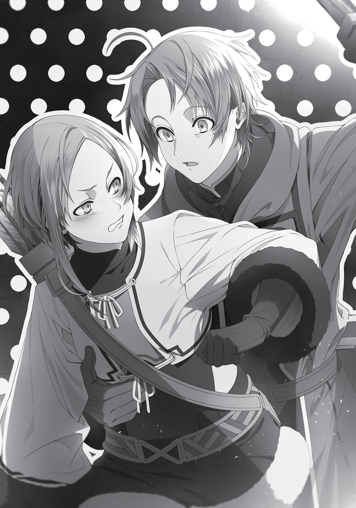
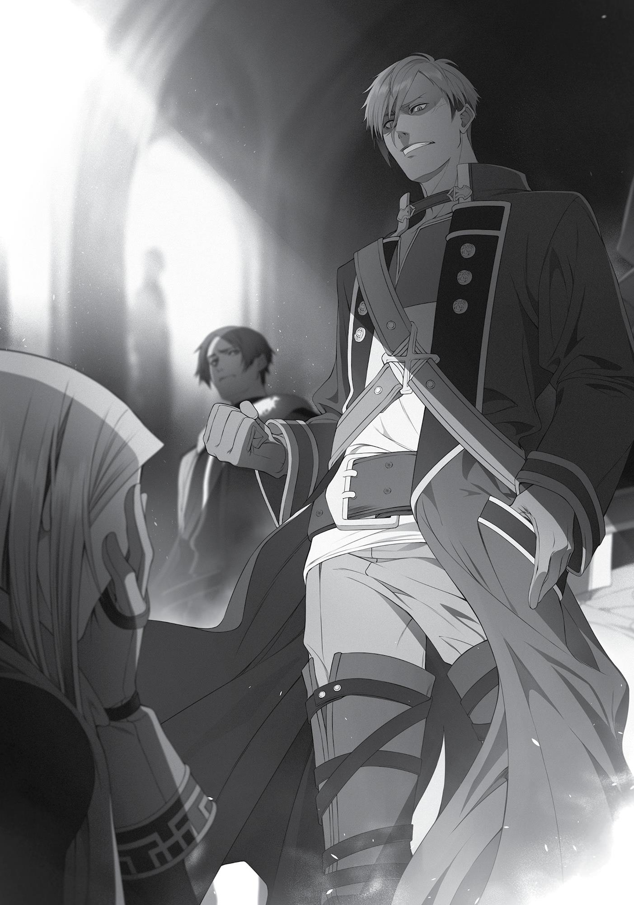

+++
title = "Chapter 3: Quagmire Rudeus"
date = 2026-07-20
weight = 3
[extra]
volume = 7
chapter = 4
+++

“Huff…huff…”
Panting softly, I jogged along the streets of Rosenburg in the
pre-dawn gloom. I could see my breath in the air, and the roads were
covered in a barely visible layer of frost. Every stride I took was
accompanied by a small “crunch” and a pleasant crackling under my
feet. As I lost myself in running, the city seemed to stream past me
all on its own.
“Phew…” I finally slowed to a stop when I arrived back at my
inn. Breathing heavily, I looked down and murmured “How did you
like the run today, boys?” to my trembling calves. Incidentally, I’d
recently named my right leg Tindalos and my left leg Baskerville. I
wanted to inspire them to grow as quick and nimble as a pair of
bloodhounds.
“Oh yeah? Heh. Good boys. Good boys!”
Both of my pups were cavorting happily at the moment, so I
paused to pet them a little. I always made sure to follow up our
walks with a nice, thorough massage. Healing magic was out of the
question; spells could numb the muscle pain, sure, but they couldn’t
convey my gratitude. “That was a great effort today, guys,” I
whispered, gently squeezing my aching calves between my fingers.
The more love I showed these two, the more love they’d offer
me in return. My muscles, at least, would never betray me. They
always repaid my affection in kind. Of course, our relationship would
fall apart quickly if I hurt them badly or stopped giving them
attention. I had to treat them both with the utmost care. But if I ever
landed myself in a real mess, our bonds would prove invaluable.
“Whoops. Don’t worry, I didn’t forget about you two.”
Now that I was done with my legs, I turned my attention to my
arms. My right was now “Hulk,” and my left one went by “Hercules.”

I was hoping this might encourage them to mature into a pair of
brawny monsters. I made a point of giving these boys some attention
after seeing to my legs. As a magician, I didn’t have to rely on the
strength of my arms that often, but it did come in handy every once
in a while. People use their arms for all sorts of things; if you don’t
work on them at all, you’ll come to regret it sooner or later.
Hulk and his brother were very jealous, and thanks to their
excellent connections, they’d know right away if I was planning to
neglect them. Last thing I needed was for the boys to start sulking.
“Okay, let’s try a hundred push-ups. Starting from the top…”
I stretched out face-down on the floor and began to raise and
lower my body at a leisurely pace. Hitting an arbitrary number wasn’t
really the important thing here, of course; the goal was to train my
muscles. Soon enough, Hulk and Hercules were quivering with joy. I
murmured words of encouragement and pushed them even harder.
This wasn’t easy for me, but it was tough on them as well. Still,
the memories of our common struggle would bring us closer
together—and make us stronger.
“Phew…okay, there we go. Nice work, guys…”
Once I finished up, I massaged and iced my aching muscles while
offering them a few words of gratitude. Hulk and Hercules both
seemed contented. I’d clearly earned myself a few more affection
points today. Another solid workout on the books. Excellent.
After cleaning myself off thoroughly in the bath, I offered my
usual prayer to the altar I’d set up in one corner of my room. “Well,
then… Please watch over me today, Master.”
I removed my holy relic from its shrine, folded it carefully and
slipped it into my pocket. Ordinarily, removing such an artifact from
its resting place would be an act of blasphemy, but I couldn’t risk it
being stolen. It was common sense not to leave any truly valuable
objects lying around in a rented room.

“Okay. Hopefully there’s a decent job or two on the board…”
Having changed into my robe, I left the inn behind and headed
for the guild.
Several months had passed since my arrival in this city. Apart
from restarting my physical training, I’d been working to establish
myself as an adventurer, following my initial plan.
“Hey, Quagmire! Thanks again for yer help the other day!”
“Always nice having you to lean on, kid.”
“Yeah, your timing with those support spells is really something.
I think I learned a thing or two.”
All things considered, it felt like I’d gotten off to a pretty decent
start. “I should be thanking you, everyone. I was just helping out a
little. Things only went so well because of your talents.”
“Heh. Yer too modest, kid! After all the work you put in, I was
expecting some trash talk.”
“Hell, we’d let you into our party for good, if you wanted.”
“Uh, well, I—”
“Hey! We ain’t supposed to recruit him, remember?”
“Whoops. My bad.”
“Ahaha…”
I was still essentially operating as a solo adventurer. Whenever I
saw a party debating whether they should take a challenging job, I
approached them and offered my services as a mercenary. Over the
last few months, I’d helped out many different groups. My asking
price was one-tenth of the monetary rewards, in addition to a fifty
percent cut on whatever loot I could carry back. The Adventurers’
Guild apparently frowned on these sorts of temporary arrangements,

but I wasn’t breaking any actual rules, and so far, they were letting it
slide.
The people staffing this branch had presumably heard that I’d
“lost” my party and was searching desperately for my mother. I had a
feeling they were taking it easy on me out of sympathy. If I moved to
a new city, I’d probably need to start joining the parties I worked for
on a temporary basis. At the moment, though, I still wasn’t
comfortable with the idea of adding a new party name to the bottom
of my card—even for a few days.
“Anyway, we made a good call bringing you along, kid. Lookin’
forward to workin’ with you again!”
My general strategy was to behave in a modest, friendly way,
while also making my presence felt in combat. It was working well
enough so far. My name was relatively well known around
Rosenburg at this point.
“Hey, Quagmire!” called a voice as I walked further into the
room.
“Oh, it’s Quagmire!” shouted another. “Come give us a hand,
man! We were just about to head out!”
“Thanks for the offer, guys, but I’m just looking around today.”
On second thought, maybe my actual name wasn’t that well
known. Most people seemed to know me by the nickname
“Quagmire.” It was understandable, since I tended to cast nothing
but that spell in battle. Sometimes I’d throw in other support magic
like Deep Mist when the situation called for it.
In any case, most of the adventurers in this Guild now smiled at
the sight of my face. Doing my best imitation of Timothy seemed to
be paying off, and it didn’t hurt that I presented myself as a naïve,
obliging young magician who didn’t know the value of his own
services. It’s easy to be well-liked when you make yourself that
useful.

Still, the regulars here recognized me and knew my name. At
this rate, it wouldn’t take too long for a few rumors about me to
spread through the city as a whole.
“Hey, Quagmire! We’re leaving town today. I’ll send word if I
hear anything about your mother out there, all right?”
“Oh. Thank you, I really appreciate that.”
I’d also managed to convince a few travelling parties like this
one to keep their eyes open for Zenith when they moved along and
left Rosenburg behind. All in all, things were going smoothly enough.
Assuming my mother was somewhere in this neighborhood, she’d
hear something about me sooner or later.
That was a big assumption, of course. But I didn’t feel like I was
wasting my time here either way. Once I figured out a good routine
in Rosenburg, I could easily do the exact same thing in other cities. If
I hopped from one town to the next, moving steadily eastward
through the Northern Territories, I could spread the word
throughout this entire region. I’d stumble over Zenith eventually.
It had taken me three months to get to this point, but I was
finally starting to feel like I was making some actual headway. If I
wanted to be thorough, I might need to spend a year or so in every
city that I stopped in. In other words, my plan might take a very long
time to carry out.
Still…I had to keep moving forward, one step at a time. Isn’t that
right, Roxy?
“Hey, look. He’s praying again!”
“Leave it alone. Quagmire’s just a pious kid. I saw him goin’ at it
in the middle of the street the other day…”
Whoops. That was careless of me.
At some point, I’d reached into my pocket and bowed my head
in a reflexive prayer. As long as I had my holy relic, I’d be all right. I

could endure anything the world threw at me. With Roxy watching
over me, nothing could harm me. I was invincible. I was MechaRudeus, the indestructible!
“Pfft.”
“Quagmire Rudeus? Gimme a damn break.”
“That kid’s so full of himself…”
Naturally, there were also a few people who didn’t think too
favorably of me. But I wasn’t about to let that bother me, since they
weren’t actively interfering with my activities. As long as I
maintained my docile, submissive attitude, I’d keep a solid majority
of the Guild on my side. In a perfect world, I would eventually win
over the minority who disliked me, too, but for now, I just avoided
them instead.
“Oh…” Just as I was about to leave the Guild, I found myself
face-to-face with an acquaintance of mine. It was Sara, to be specific.
She grimaced at the sight of me. Not the best feeling in the
world. “What are you looking at?”
“Uh, nothing.”
Our relationship hadn’t changed much over the last few months.
I’d clearly gotten on her bad side from the outset, and her tone of
voice never seemed to get any less aggressive.
“You heading back to the inn or something?”
“Uh, yes. I just finished up a job yesterday, so I was planning to
get some rest tonight.”
“Fine. We were just about to take a new job ourselves. You want
to tag along?”
“Oh. Hmm…”
Counter Arrow regularly invited me to join them on their jobs,
probably because of my performance on our first outing together. I
worked with them more than any other party. Given my overall goal,

repeatedly teaming up with a single group wasn’t particularly
efficient. Once I established a good relationship with a party and told
them about my objective, there was little new benefit to repeatedly
tagging along with them.
“Uh…will you be heading out tomorrow?”
And yet, for some reason, I found it hard to turn Counter Arrow
down. I wasn’t entirely sure why. Maybe I wanted to repay them for
helping me identify some of my weaknesses.
Sara frowned irritably. “You’re always so damn reluctant about
it. If you don’t want to come, you can just say so. It’s not like we’re
begging for your help or anything.”
As always, the girl’s tone was chilly. Still, I felt like her attitude
was slightly better than it had been at the very beginning. The open
hostility I’d sensed from her at first wasn’t in play as much anymore.
Not that we were buddies now or anything…
It didn’t matter, anyway. I didn’t need everyone in this city to
like me.
“Sorry about that. I’m just an indecisive person, I suppose. It
takes some time for me to make up my mind about anything.”
“…Could you stop apologizing for every little thing, too? It’s kind
of pathetic.”
Judging from the mildly exasperated look on Sara’s face, she was
expressing her actual thoughts rather than trying to hurt my feelings.
Still, I wasn’t going to change my behavior just because she found it
“pathetic.” I’d already decided to stick with a painfully polite attitude
for the immediate future.
“Cut it out, Sara,” called a voice from the entrance.
The other members of Counter Arrow had followed Sara into
the Guild. Suzanne was at the head of the group, followed closely by
Timothy in his red robe. Patrice and Mimir brought up the rear.

“Fine, whatever,” Sara muttered, pouting as she turned her face
to the side.
“What do you say, Rudeus?” asked Suzanne with a smile. “You
coming along?”
I paused for a moment. Although I called myself indecisive, I’d
actually already made up my mind on this one. For some reason, I
just wanted to act like I was unsure. “Yes. I’ll come with you, if you’ll
have me.”
“Sounds good! Let’s just pick out a job today, then.”
“Sure.”
If you ignored Sara’s bad attitude, Counter Arrow was easy to
work with. I liked being around them. Suzanne was a caring,
considerate person; Timothy was good-natured and sociable. The
other two guys kept to themselves, but they were nice enough. The
party was well-balanced and they’d learned how to work me into
their strategy, so combat usually went very smoothly. They did try to
let Sara and the frontline fighters get some experience in every fight,
so I had to carefully restrict my spellcasting, but it felt like I was
working with them, instead of just helping them out.
In other words, I sort of felt like part of the team.
“Okay then, let’s see. We’ve got Rudeus with us this time, so…”
“Hey, Suze! How about this one?”
“Whoa. An A-ranked collection job? Oh, they want a bunch of
Snow Drake scales… Hmm. I dunno, Patrice. It sounds a little risky.”
“Yeah, but we’ve got Rudeus, right? Might as well take one that
pays well.”
Watching the five of them talking things over in front of the
bulletin board put me in a slightly nostalgic mood. Not too long ago,
I’d watched Eris and Ruijerd have conversations just like this in guilds

half the world away. Back then, I was the one who made the actual
decisions…
“…What d’you think, Rudeus?”
“Hm? Oh. Sure. I think it sounds fine, personally.”
These days, all I had to do was give my opinion when it was
asked for. It was a very different role from the one I’d played in Dead
End. I didn’t have any authority in this group; I was an outsider,
really. I could just say what I thought, and then someone else would
make the call. No stress.
“Okay then, I think we’re agreed,” said Suzanne. “Let’s take that
job.”
Just like that, the decision was made. The quest wasn’t too
different from those we’d tackled in the past, but persistently getting
results is part of how you build a reputation. I’d have to give this one
my all, just like always.
The next day, I packed my things together and headed out of
Rosenburg with the members of Counter Arrow. We were headed to
an ancient ruin located about two days due south of the city. I’d
never been there before.
For what it was worth, I’d done a little research the previous
night. Since our objective was to collect Snow Drake scales, I started
off by asking around about them. It turned out that the Snow Drake
was a monster only found around these specific ruins, at least in this
area. As the name would suggest, it was a lesser kind of dragon with
pure white scales. They had no wings, and tended to be three or four
meters in size. Instead of soaring through the skies, they nested deep
inside caves and dungeons, typically in large groups.

Snow Drakes were powerful creatures, and you usually found
them in packs, so they were considered S-ranked threats in combat.
But they hated bright light, which meant they didn’t venture
aboveground very often. Plus, they were relatively docile, rarely
attacking anyone unless their nests were threatened. All in all, most
adventurers didn’t think of them as especially dangerous. They were
maybe an advanced A-ranked monster, at worst.
Our job this time was to make our way into their home, the
Galgau Ruins, and simply collect any scales we could find lying
around there. These scales were superb insulators and were often
used in construction—the inhabitants of this region of the world had
come up with all sorts of ways to keep out the cold, and for those
who could afford them, Snow Drake scales were one of the best.
Apart from their firmness and durability, they were a beautiful pure
white, with a lovely bluish sheen in the light. You’d often find them
tiling bedroom floors in the mansions of the local nobility.
The scales could also be used to make armor or shields. You
wouldn’t find many ordinary adventurers decked out in gear like
that, but an S-ranked veteran might have a piece or two, and the
knights of the Duchy of Basherant supposedly wore Snow Drake scale
mail. The strongest monsters in this region were tougher than
anything else alive on this continent. It was easy to understand why
people wanted to craft high-end equipment out of them.
Of course, securing these scales meant barging uninvited into
the territory of some very powerful creatures. We had no intention
of launching an attack on the Snow Drakes’ nest, but these ruins
were home to many other monsters…and while the Drakes were
usually docile, they could always decide to attack us out of nowhere.
Everyone seemed a little bit on edge as we made our way down
south.
Once we reached the ruins, we made camp outside and held our
usual group meeting to review the plan.

“I brought Wyrm-bone arrows along for this one, but I’m not
sure they’ll get through Snow Drake scales.”
“Hmm. I suppose we should try poison as well.”
“They don’t like bright light, yeah? Could we scare ’em off with
fire magic?”
“If that was enough to scare them, they wouldn’t be borderline
S-ranked monsters.”
As usual, the members of Counter Arrow took preparations
seriously. All of them had gathered information on their own, and
tried to figure out how to maximize their contributions. If they were
just a little bit more talented as individuals, or had a full party of
seven, they could probably have made it to Rank A without much
trouble.
To be honest, it was rare to find a party that was this diligent
about their work. Most people were kind of winging it out there.
“You haven’t said much of anything, Rudeus. Try not to screw us
up in there, okay?”
“Sure. I’ll do what I can.”
“Seriously, you better. I mean, my arrows might not even work
on those things… If one of them closes in on you, we might not be
able to help…”
Sara definitely seemed nervous about this one. She could fire off
arrows with incredible speed and accuracy, but that didn’t mean
much against enemies with such tough natural defenses. Although
she could find weak points to aim for, like the eyes or mouth, the
precision that required put her at a real disadvantage—especially
against larger groups of enemies.
And of course, there were quite a few A-ranked monsters that
could shrug off an arrow, or even dodge them in midair. The Snow
Drakes were definitely in that category. The other monsters that

inhabited these ruins mostly weren’t too threatening. But if we did
find ourselves facing an A-ranked monster, it was hard to tell if Sara
could deal much damage. That was clearly frustrating for her.
Still, that was kind of how things went in this line of business.
Few adventurers could accomplish much without a party. I wasn’t
much good on my own, either. When you started getting cocky, it
was only a matter of time until you got showed up by someone
better. And when you thought you’d figured out how the world
works, it wouldn’t be long until it flipped the tables on you. Staying
humble was the only way to go.
Sara was still young. She probably hadn’t experienced many real
setbacks yet, and consequently she seemed more worried about
what might happen to the other members of the party if she couldn’t
perform her role. The fact that she might be in danger herself didn’t
seem to register.
Of course, the rest of us could always step in to offer a little
inconspicuous assistance when she needed it. If that wasn’t enough,
well…we’d have to cross that bridge when we came to it.
“Don’t worry about it too much, Sara,” I said. “Our job’s to pick
up scales, not fight Snow Drakes. We’re cleaning up their shed hair
for them, basically.”
“He’s exactly right,” said Timothy, nodding gently. “Let’s try not
to fight them if at all possible.”
“If it comes to the worst, we can always make a run for it!”
added Patrice.
“You’re real good at running away, Patrice. I’ll give ya that
much,” said Mimir.
“Don’t be so modest, Mimir,” said Timothy. “You’re our best
sprinter by a long shot.”
Everyone burst out laughing, and the tension in the air seemed
to lessen just a little. Timothy was a soft-spoken man, but he knew

how to interject a joke or a suggestion when one was called for. That
was another thing I wanted to learn to imitate.
“Okay then,” said Suzanne, clapping her hands together. “Shall
we get going, folks?”
Everyone rose to their feet, their expressions serious once again.
The entrance to the ruins was located by the banks of a winding
mountain stream. It was nothing more than a hole in the cliff face,
really. The space inside was half-covered in ice, with thick icicles
hanging across the entrance. From above, you could easily overlook
it. To be honest, the place looked less like a ruin and more like a cave
where bears might hibernate for the winter. It almost felt like we’d
come to the wrong place.
However, this did match the general description of the entrance
to the Galgau Ruins, which some adventurer had apparently
stumbled across ten years ago. But nobody could give me a specific
description of the interior, so it was hard to say for sure.
“Is that really it?” said Suzanne dubiously.
“I think it must be,” said Sara, pointing down. “See? There’s
some foot traffic out there.”
When I squinted at the snow outside the entrance, I spotted the
faint remnants of human footprints. It was hard to tell exactly many
people had been here recently, but the place clearly attracted a
decent amount of visitors.
“Hmm. Are those fresh footprints? Hope we don’t have a double
booking on our hands here…”
“Nah. Those look five or six days old.”
“Still, there’s a chance another party’s still inside.”
“Some of these are headed out of the cave, see? I bet they went
home already.”

I half-listened to Sara and Suzanne’s conversation as I
rummaged through our gear for the equipment we’d need inside the
cave. Mainly, this meant the torches we’d prepared in advance. I
pulled them out and lit them one by one.
Torches were essential cave exploration tools. Lamps were an
option as well, but a blazing torch could act as a makeshift weapon,
and kept casting light even if you used it a little roughly. You could
toss it aside when a battle began without plunging yourself into
darkness. It could be dangerous if you wandered into a chamber full
of trapped gases, or lit so many fires that you consumed all the
oxygen in the area…but if those sorts of risks bothered you, it was
better to stay out of caves in the first place.
That said, it would’ve been nice to have a brighter, more reliable
alternative to these flaming sticks of wood. Maybe something like a
sturdy LED lantern?
“The ground’s frozen in places, guys. Watch your footing in
here.”
I handed out the torches to the entire party, starting with
Suzanne and working backward. Some parties preferred having only
a few designated people carry their torches, but Counter Arrow had
everyone take one. We didn’t have anyone who could see perfectly
in the dark, and since there was a dedicated archer in the group, we
wanted the best possible visibility.
Once we entered the cave, the idle chitchat came to an end.
Moving in single file, we went down the downward-sloping path in
silence, staying alert for any dangers.
There weren’t many monsters at the beginning. Sometimes
creatures that resembled giant centipedes would pop up and attack,
but our vanguard Suzanne took them out easily by herself. Those
encounters barely even qualified as combat, really.

Not that I was complaining. The path we were following was so
narrow that it would have been seriously awkward to fight an actual
swarm of enemies. If monsters started to come at us more
frequently, we might have to consider withdrawing…even if they
were only concentrated in a few sections of the cave.
The patches of ice on the ground didn’t help. We had to pay
careful attention to every step we took to avoid falling on our faces.
We were all wearing spiked boots, but sometimes that wasn’t
enough to keep your feet from slipping out under you.
“Ah!”
“Whoops…”
Sara, who was walking right in front of me, lurched abruptly to
the side, so I reached out quickly to catch her. My Eye of Foresight
did come in handy at times like this. Not that it wasn’t useful
basically all the time.
“…Are you groping me?”
“Uh, no.”

I deposited Sara on a clear patch of ground. Her response was to
cover her chest with one arm and glare at me. Her face was flushed,
and there was murder in her eyes.
Was she seriously upset that I’d touched her there? I honestly
hadn’t felt much of anything, except the rigid leather of her chest
protector. Maybe it would have gotten my pulse racing back in the
day, but I wasn’t an innocent little boy anymore, if you know what I
mean.
Still, I ultimately decided it was safest to apologize. “Sorry about
that.”
Putting that nonsense aside… We’d gotten so bunched up that
moving along was definitely starting to get a little awkward, but this
cave was so narrow that we didn’t have much choice. At present, we
were moving along in cramped rows of two, with Suzanne and
Patrice at the front, followed by Mimir and Sara, with Timothy and
me in the rear.
I could still peer over Sara’s head when she was in front of me,
but since she was a little shorter, it was probably impossible for her
to see anything when Patrice was directly in front of her. We’d
usually have the middle row staggered in alignment so she could
target enemies up ahead, but there just wasn’t enough space in this
passage. This formation seemed like our only option for the moment.
If things got messy, I might have to throw up a wall of earth directly
ahead of our front line…
“…Oh.”
Just then, the passage we’d been following suddenly came to an
end. We’d stepped out into a large, open space, so brightly lit that it
almost felt like we were back outside. “Wow…”
I looked up and realized the entire ceiling was covered in
patches of something that emitted a bluish-white glow. From this
distance, I couldn’t tell if it was moss or some sort of mineral, but

whatever the stuff was, it made our torches seem almost
unnecessary.
Our path was also much wider than it had been a minute ago.
There was suddenly enough space for five people to walk
comfortably abreast. Up ahead, a sheer rock face sloped into the
darkness on one side of the path. It was hard to make out what lay at
the bottom, but it seemed to be some sort of underground lake or
river. I had a bad feeling about what might be lurking down there.
Falling into it would probably not be the greatest idea.
Further along the path was the place we’d come here to visit: a
massive, fort-like structure, crumbling in places but structurally
intact.
These were the Galgau Ruins.
“The place served as a fortress during the First Human-Demon
War,” said Timothy quietly. “Apparently, it was constructed by one
of the five greatest Demon Kings of the era. They called him LargonHargon the Subterranean.”
Hargon, huh? Wonder if he summoned the God of Destruction
when they killed him.
“He was a God-tier Earth mage, by all accounts. He would
regularly raise fortresses like this one in places no human could
possibly find them, then create tunnels to the surface so his forces
could launch surprise attacks.”
“No kidding? You’re really knowledgeable, Timothy.”
“Well, the fighting between humanity and the Subterranean
Demon King was very fierce in this region, so we have a lot of stories
about the war that were passed down through the generations. I
remember quite a few of them from my childhood.”
Ah. This was all just folk history, then. Still, it seemed plausible. I
had no idea how else you could have built a massive fortress like that
this deep underground. If what Timothy said was true, this Largon

Hargon guy could have tunneled his forces upward to attack
anywhere at any time, with no warning whatsoever. Defensive walls
would have been totally useless. Every human soldier must have
been constantly on edge, never knowing when the next assault might
come… It was almost bizarre that humanity actually managed to win
that war.
“Didn’t you say you grew up in Ranoa, Timothy?” said Suzanne,
glancing back at us with a slightly curious expression on her face.
“That’s right. I was born in a nameless village there, and spent
my formative years in the city of Sharia. You might know it for its
University of Magic. Eventually, I headed down to Asura to pursue
my dream of becoming a great adventurer…which is how I ended up
where I am today, a much humbler man.”
The Kingdom of Ranoa, huh? I guess I’ll probably end up going
there myself eventually…
At this point, our conversation was rudely interrupted. “We’re
under attack!” shouted Sara, dropping her torch and grabbing for her
bow.
I looked ahead and spotted a group of flying black shapes
flapping toward us at considerable speed. Each of them looked to be
a meter or so in size.
“Giant Bats!”
“Get in formation!” shouted Suzanne immediately. “Leave this
to our backline!”
Patrice stepped protectively in front of me; Suzanne and Mimir
moved to form a human wall in front of Sara and Timothy.
We were up against flying monsters this time. While there was
some space to maneuver now, we had to be careful, given that we
weren’t too far from the edge of a cliff. It was safest for our vanguard
to simply absorb the bats’ attacks while the three of us shot them
down from behind.

“Yaaah!” Sara wasted no time in firing off her first shot. Her
arrow homed in on one of the swiftly moving bats, piercing it right
through the head; its body spun into the darkness at the bottom of
the cliff. It was always impressive to watch her work. The girl was an
artist with that bow.
“May this small, smoldering fire call forth a great and searing
blessing! Flamethrower!”
Timothy’s approach was a bit less subtle. He pointed both hands
at the sky and unleashed a wide-range fire spell that sent two Giant
Bats spiraling down to their doom.
“Blast Wind!”
I went for an even more basic method, lifting my hands and
setting off a powerful explosion in mid-air. Given the moderate size
of these bats, I’d figured the shockwave would be enough to disable
them. Just as I’d hoped, the explosive wind tore holes in their wings;
it was enough to keep them from flying properly. Watching the
surviving bats fluttering slowly down toward the lake, I breathed a
small sigh of relief…which caught in my throat a moment later.
“Whoa…”
“Ugh!”
An enormous frog had popped out of the water down below
and swallowed one of the bats in a single gulp. The men of the party
looked on with something like wonder; Sara, on the other hand,
grimaced in disgust.
The amphibian was a vivid blue-and-black thing that reminded
me of the poison dart frogs back in my world. I had to assume it
wasn’t safe to eat. From this distance it was hard to say exactly how
big it was, but given how easily it had eaten that Giant Bat, I had to
assume it was at least five meters tall. And it was energetic for its
size, too. I could see it glancing eagerly all around, wondering if any
more prey might tumble down into its lair. If the thing could be this

active in such intense cold, it had to be remarkably tough, even for a
monster.
“Let’s try not to fall down there, huh?” muttered Suzanne.
Sara just nodded vehemently. I could see goosebumps on her
skin.
Somehow, I got the sense our archer wasn’t a frog person. I
thought the big amphibian had a somewhat charming face, but to
each their own. That said, I’d run into more than a few frog-faced
people on the Demon Continent. It was something Sara would have
to get over one of these days.
“Let’s hurry forward, everyone,” called Timothy. “Watch your
footing carefully.”
The six of us set off toward the fortress once again, keeping a
careful eye on our surroundings.
Galgau was a truly massive structure. Looking up at it from the
vantage point of its entrance was fairly awe-inspiring. The ruined
fortress was maybe five stories in height, and as wide across as your
average middle school. It was impossible to say how far back it went,
since it seemed to be partially buried in the rock behind it. At a
guess, though, its depth was probably even more impressive. It
wasn’t the biggest building I’d seen in this world, but its impact was
definitely enhanced by the fact that it was somehow sitting
underground. Had a single person seriously created this thing with
earth magic?
Our entry point into the ruins wasn’t the front gate. The way in
took us through something that might have been a side door, or
possibly just a hole in the wall. From there, we had a genuinely
spectacular view of the cavern around us. To the left was the winding
cliff road we’d followed down here; to the right was an enormous
open space with a quiet, dark lake at its bottom.

The world I came from had its share of spectacles, of course, but
there weren’t many that could compare to this. The only place you’d
find anything comparable was in a video game or a piece of fantasy
art. And of course, actually being here was very different from
looking at an illustration. I could smell the cave, feel the stagnant air,
and hear the occasional splash of a giant frog hopping through the
water below. The tangible reality of it sent a little shiver down my
spine. Gazing out at the vast underground lake, I found myself
wondering what would happen to anyone who tried to take a swim
down there.
“You just gonna stand there looking around all day or what?”
asked Sara.
“Oh. Sorry, I’m coming,” I said, hurrying back to my spot in our
formation.
“Do you like big buildings or something?”
“Not really. I just haven’t seen many places like this before, you
know?”
“Hmm.”
We were on the job right now. I might have been tempted to
take a few shots if I had a camera, but there was no time for that sort
of thing. I needed to get these scales collected and get back to town
as soon as possible.
Yeah. Let’s hurry back…to my lonely, empty room in the inn…
I shook my head to clear it of unpleasant thoughts and turned
my attention to the ruined fortress itself. “This thing’s been here
ever since the First Human-Demon war, huh…?”
After all the time I’d spent travelling the Demon Continent, I’d
seen my fair share of buildings constructed by demonkind. That
included quite a few large, peculiar-looking castles and forts,
including Kishirisu Castle in the city of Rikarisu. This fortress did bear
some resemblance to them, but it was clearly older, and made a

slightly different impression from the ones I’d seen so far. Maybe
that made sense, though, since this was a functional outpost built to
be used in an actual war. Everything about it was large in scale; the
ceilings were nearly five meters overhead. But oddly enough, the
passages tended to be disproportionately narrow.
The height made sense, at least. Demons could be physically
very different from human beings, which included being taller on
average. As for the narrow hallways…maybe it was a deliberate
attempt to make the place easier to defend?
“Hmm…take a right at the next fork, Suze.”
“Got it.”
I was slightly surprised to realize that Timothy was carrying an
actual map of the ruins in one hand. Adventurers did seem to visit
this place on a regular basis, so I guess it wasn’t surprising someone
had put in the effort to map the layout.
“Good lord,” Timothy muttered, sighing softly. “What were the
demons thinking when they designed this place?”
A glance at the map was enough to see that these ruins were
something of a maze. It looked a little bit like the scribblings of a kid
who preferred his labyrinths to be tangled and nonsensical because
they “looked cooler” that way. Given what I knew about Demonkind,
that might have been part of the motivation here, but…
“Well, they’re not built like us, you know? This might have been
more convenient for them, somehow.”
“Hmm, I suppose you might be right…”
Even in an underground fortress like this, they’d presumably
balanced their forces with a variety of demons, including some who
could fly and others who could crawl on the walls. That might explain
the tall ceilings and narrow hallways, as well as the weirdly complex
layout. Like…what if the holes in the ceiling that looked like
ventilation shafts actually led to passages that only wall-crawling

demons could use? Having some passages that only demons could
possibly make use of would have given them a major advantage
against any humans who made their way inside.
In any case, it felt like a really long time since we’d seen a
monster. Everything I’d heard around town led me to believe that
these ruins were populated with plenty of bug and amphibian-type
creatures, but we hadn’t come under attack even once since
entering the fortress itself. There were bones lying around here and
there, sometimes still stained with blood, but the monsters
themselves were nowhere to be seen.
But of course, that didn’t mean we could let down our guard.
Suddenly, a long gust of wind blew past us with an eerie whistle.
And for some reason, the hairs on the back of my neck stood up.
“We’re under attack!” Mimir shouted instantly.
I looked ahead, behind, and to either side, but didn’t spot
anything that looked like a threat. “Where are they?!”
“At your feet!”
As it turned out, the enemy was below us.
Those bones I’d noticed scattered all around the path were
slowly rising up off the ground, rattling as they moved. We had some
boney boys on our hands. Or Skeletons, if you prefer.
As they began to piece themselves together, a partially
translucent…thing appeared further along the corridor, wafting
slowly toward us. It was a slender humanoid figure, but it didn’t have
a head or legs. Clad in a beat-up old robe, it floated toward us
weightlessly, as if swimming through the air itself. I wasn’t an expert
or anything, but that had to be some kind of ghost.
“We’ve got Skeletons and a Wraith, boss!”
“Draw them in close, Patrice!”
“Right!”

“Sara, Timothy, Rudeus, watch our back! Focus on the
Skeletons!”
“Okay!”
I spun and found that a number of Skeletons carrying rusty old
swords were already coming at us from behind. They could actually
move surprisingly fast.
“Out of the way!” shouted Sara, pushing her way past me and
Timothy to a forward position. She’d shouldered her bow and drawn
a large knife instead.
“Skeletons are weak to blunt-force attacks, Rudeus!” called
Timothy.
“That’s my specialty!” I pointed both my hands at the onrushing
skeletons. If blunt force was enough to take them down, this
wouldn’t be too bad at all.
“Stone Cannon!”
My favorite lethal projectile smacked into the first Skeleton in
line and pulverized it; the stone kept moving, destroying a second
Skeleton as well.
“Answer my call, God of Obscurities, and shatter my enemy!
Stone Cannon!”
A split-second later, Timothy fired off his own Stone Cannon,
which smashed through a single Skeleton before stopping.
Guess I win this round… Not that it’s a competition or anything.
“All right, we’re all done back here. Let’s—”
“Not yet!”
Just as I was spinning around to support Suzanne and the
others, Timothy’s urgent cry turned me back. A skeleton was taking
shape before my eyes. The same ones I’d shattered were somehow
slowly piecing themselves back together.

“As long as that Wraith is alive, the Skeletons are immortal!”
Oh. Right. Of course.
Skeletons were immortal creatures. You could smash them
apart and set them on fire, and they’d still come at you while they
burned. Char them to ashes, and they’d still piece themselves back
together. Blunt-force attacks were the simplest way to render them
incapable of movement, but that was only a temporary measure.
While you had them disabled, you had to take out the Wraith that
was animating them. Fire magic could burn away a Wraith, but that
didn’t do much except buy you a little time. Like the skeletons it
controlled, it would come back eventually.
Divine magic was by far the most effective answer to a Wraith. It
could erase their spectral forms much more quickly and thoroughly
than any fire spell; and a Wraith defeated in that way was gone for
good. Additionally, Skeletons hit by Divine spells turned into particles
of light and permanently disappeared. But as long as the Wraith itself
stayed intact, it could summon an endless supply of new ones.
“I call upon thee, God who blesses the land which nurtures us!
Deliver divine punishment to those foolish enough to defy the
natural ways! Exorcistrate!”
Evidently, Mimir had trained in this school of magic.
I glanced over my shoulder at the sound of an unfamiliar
incantation and saw the ball of light Mimir had summoned smack
into the Wraith’s spectral body.
“Gyyeeeeeaaaaa!”With an ear-splitting shriek, the ghost
disappeared. Its partially transparent body burst apart and was
reduced to small motes of light, which soon faded into oblivion.
Instantaneously, the Skeletons fell apart, their bones crumbling
lifelessly to the ground.
“Okay, we’re good!” called Suzanne. “Back in formation,
everyone!”

Sara turned and jogged past me to take up her normal position
in the middle; Mimir joined her, and we were back to our initial
arrangement. That fight had been a little unsettling, but at least I’d
gotten to see a new spell for the first time.
“That’s the first time I’ve ever seen Divine magic…or a ghost, for
that matter,” I said quietly, looking over at Timothy.
“It’s only the second time I’ve seen a Wraith myself,” he replied.
“The first time, my party was completely clueless, and it got one of
our friends killed. That was a very painful lesson.”
“Was Mimir not with you at that point?”
“No. This was well before we formed Counter Arrow. I made a
point of having us practice for this scenario, though. I’m very glad I
did.”
Sara looked over her shoulder at us and put a finger to her lips.
Our conversation was probably making it harder for her to listen for
threats.
“Sorry about that,” I whispered. This was definitely not the place
or time for casual chit-chat. In a place like this, carelessness could get
you killed in no time at all.
In any case, apparently this ruin was haunted on top of
everything else. That was more than a little disturbing. Judging from
its appearance, that ghost might have been a warrior in life… Could it
have been a soldier from the First Human-Demon War?
No, that seemed really unlikely. Surely a ghost from such a
distant past wouldn’t still be hanging around in a place that people
visited fairly regularly. It had probably been an adventurer who’d
died in here within the last few years. My condolences, buddy. Hope
you rest in peace.
“Ah, good. Here we are!”

Suzanne’s voice brought me back to reality. I realized we’d
finally emerged from that winding maze of corridors into a larger,
more open space. We seemed to be in a wide hallway maybe a
hundred meters long. A crumbled set of stairs in the middle led to
the second floor, and both sides of the passage were lined with giant
stone sculptures. It felt pretty obvious that some important part of
the fortress lay just ahead.
“Oh wow…”
And then there was the floor.
It was practically covered in a carpet of beautiful white scales,
almost like the petals of a cherry blossom tree in bloom. These had
to be the Snow Drake scales that we were here for. Considering their
value, there certainly were a lot of them just lying around.
Based on the research we’d done beforehand, this hall was part
of the route the Snow Drakes used to move from their nest to their
hunting grounds. They often stopped here to groom themselves
while moving through the area. It was well-known as the single best
place to find their scales in the entire complex.
“Beyond this hall, we’d be stepping into the Snow Drakes’
territory,” called Suzanne from up ahead. “Don’t go any further than
that last statue in the line back there. Is that clear, everyone?”
Mimir and Patrice shouted “Yeah!” in unison, then set to work
scooping up scales.
We’d carefully planned out this part of the operation in
advance. Along with Sara and Timothy, I was supposed to keep
watch for threats from every direction. The Snow Drakes were
known to emerge from the far end of this hallway, and sometimes
other monsters would pop out from the second floor or the corridor
we’d just passed through. We were on the lookout for Giant Bats,
Red-Eyed Moles, Myconids, and Wraiths, mainly.

If the Snow Drakes themselves appeared, we’d duck back into
the passage or hide behind cover. If the other monsters appeared,
we’d just alert the others and eliminate them. In the meantime, the
rest of the party would gather as many scales as humanly possible.
Once we filled up all six of the sacks we’d brought, we’d have more
than enough to turn in back at the Guild.
This could get very dangerous if we somehow ended up in
combat with the Snow Drakes…but aside from that possibility, this
job was honestly so simple that it barely felt worthy of its A-rank
rating. I had expected us to run into many more enemies on our way
in here. There seemed to be oddly few monsters around today. That
Wraith was the only real threat we’d run into.
For some reason, that actually made me a little uneasy. I had to
make sure not to let my guard down.
With that thought in mind, I focused my attention on the
direction of the Snow Drakes’ nest. The last statue in the hallway
depicted a voluptuous woman with her legs planted far apart—a
woman wearing nothing but hot pants, a breast protector, and a
cape. She held her hands at her hips…and for some reason, there
were chains on them. I felt a little sad that her head had fallen off at
some point over the centuries.
There was a door between that statue’s legs. A little further
down that passage was apparently where the Snow Drakes lived, so
it was presumably where they’d be coming from if they made an
appearance.
Not that it really mattered, but that statue’s clothing felt weirdly
familiar.
Oh! Hold on, is that supposed to be Kishirika Kishirisu?! The last
time I saw her, she looked more like a little kid than a buxom babe,
but…maybe? No, no, that can’t be right… Hmm.

Then again, statues like this tended to exaggerate how
impressive people were, right? It wouldn’t be surprising if the
sculptor had taken a little artistic license. Still, this seemed a bit too
exaggerated. Especially in the height department. And the bust
department.
Hmm…those things were just huge…
“Whoops. There I go again…”
Focus, Rudeus. Focus. I needed to be ready and waiting if
enemies popped up out of nowhere or something.
Still, the sight of a gigantic pair of breasts no longer got me quite
as excited as it once did. Maybe it was because I’d actually touched
some real ones. My innocence was gone forever…
“What’s that sound?!” Timothy shouted.
An instant later, piercing cries from somewhere in the distance
reached my ears.
“I’ve got a bad feelin’ about this one, boss…”
“Get ready for combat, everyone!” shouted Suzanne. “Push the
bags over to the side!”
Unfortunately, Mimir’s apprehension proved to be warranted.
The six of us bunched into a tight formation, looking around for the
enemy. The cries echoing through the hallway were coming from
somewhere deeper in the ruins, and they were gradually getting
louder. Tense and uncertain, we exchanged glances with each other.
From the sound of it, there were a lot of monsters shrieking. If
we were about to get hit by a giant horde of enemies, it would be
smartest to just grab the scales we’d managed to collect and beat a
hasty retreat. Mimir, Patrice, and Suzanne had filled an entire bag by
now; that was probably enough to meet the bare minimum
requirement for our task.

For a few long moments, Suzanne listened carefully to the cries,
and then considered the scales and our half-filled sacks. “It doesn’t
sound like they’re heading our way,” she finally said. “I think we
should probably keep gathering, but quickly.”
It didn’t seem like an unreasonable opinion. The cries were still
far off, and it didn’t feel like they were coming right at us. Maybe
someone else had gotten the Snow Drakes whipped up into a frenzy,
but that might be just the distraction we needed to finish collecting
their scales.
Still, that was just one possibility. There was also a very good
chance we might get mixed up in whatever this was. Was it smarter
to play this safe and cut our profits, or take the risk to pursue a
greater reward?
Either way, every second we spent standing around waiting was
only putting us in greater danger. There was a chance nothing at all
would happen, true; but no matter what course of action we wanted
to take, we needed to make up our minds quickly.
“I think we should finish up, too,” offered Sara.
“Yeah, I’m on board,” said Mimir.
“We’re almost done anyway, right?” said Patrice.
That put a solid majority of the party on Suzanne’s side. To be
honest, I preferred the idea of running away. But unlike the others, I
wouldn’t face any consequences for failing this mission. Since I
wasn’t a member of their party, I wouldn’t be responsible for paying
the fee from the Guild. Since I didn’t have any skin in the game, it
was hard for me to say anything.
“All right then,” said Timothy quietly. “We’ll gather the scales
for a little longer. But let’s be quick about it.”
With that, everyone hurriedly resumed their previous tasks. All
of us were much more alert than before, but I couldn’t shake the
feeling that those shrieking cries were only getting louder and more

violent. Clutching my staff tightly, I stared at the stone statue at the
far end of the hall.
The cries were still distant. If the pack was heading for us, they’d
probably be coming from that direction…but for some reason, I felt
like I could hear them from behind us as well. Maybe they were just
echoing around inside the ruins.
Could I just use earth magic to seal off all the entrances except
the one we’d taken? No. That was a bad idea. If the monsters came
flooding in through there, then we’d really be in trouble.
Calm down, Rudeus. You don’t even know what’s going on yet.
Anything you do right now might backfire.
Fortunately, none of us were worn out yet. Even if we got in
trouble, we had the energy to fight our way out of it, which was likely
the only reason Suzanne had chosen to take this risk in the first
place. The only thing I had to worry about was killing the monsters if
they did appear. Nice and simple.
I waited for the others to finish up. trying to keep my mind as
clear as possible, trying to ignore the fearsome shrieks that sent
shivers down my spine.
“…Hm?”
Just as we were filling up the last of our bags, the monsters’
shrieks began to grow fainter and fainter. Suzanne looked up and
peered suspiciously in the direction of the fading sound.
Maybe we’d all been worried about nothing. Maybe those were
just the Snow Drakes’ mating cries, or something? Some animals get
really noisy when they go into heat. Maybe we’d stopped by in the
middle of their courtship rituals.
Relaxing slightly, I started to loosen my grip on my staff…
“Oh crap! They’re on us!”

In that instant, a flood of sleek white shapes exploded past the
statue with ferocious speed. They rushed between its feet and
clambered down from the space where its head had been. At a
glance, they resembled enormous, pure-white geckos.
They were Snow Drakes. And within seconds, there were more
of them in the chamber than I could count.
As they rushed forward, their bloodshot eyes found our little
party, and the first few came to a sudden halt just before they
reached us. I counted six of them. There were many more, of course,
but my field of vision could only hold that many.
It had all happened so very suddenly. Timothy was frozen in
place, just like the rest of us. He couldn’t even shout the word
“Retreat.”
However, our scaly friends seemed to be reacting the exact
same way. I’d never seen a startled lizard before, but this was
probably what one looked like. Their eyes opened wide, they froze,
and opened their mouths halfway to threaten us with their fangs.
For one long instant, it felt like time had ground to a halt.
And then, I finally managed to shout the word “Run!”
Timothy and the others spun around and sprinted toward the
exit like they’d been shot out of a cannon. “Gaaaaah! Not
agaaaaain!”
Perhaps provoked by Patrice’s mournful shrieking, the Snow
Drakes began to move as well.
“Earth Fortress!”
I threw up a massive wall of earth in their path, blocking their
progress. It was a solid, thick barrier, reaching all the way to the
shoulder of the nearest stone statue. Figuring that I’d bought us all a
little time, I turned around and headed for the exit myself.

But when I glanced over my shoulder a moment later, I couldn’t
help but let out a shrill little yelp of terror. The Snow Drakes were
essentially lizards—a simple wall, even a tall one, was basically
meaningless to them. One by one, they were climbing over it and
slithering through the small gaps on either side.
This was not good at all. At this rate, they were going to catch
up and surround me. Thanks to my daily jogging, I wasn’t out of
breath yet, but that didn’t mean much. I wasn’t a fast runner by any
means.
“Gah!” I spun back around and pointed my hands at the Snow
Drakes. These things are lizards, right? How do you kill a lizard?
Would intense cold work? Maybe it’ll slow them down, at least!
“Blizzard Storm!”
Acting mostly on reflex, I tried an ice spell. Gusts of freezing
wind rushed through the air, sending scales flying off the ground. A
moment later, spears of ice thick as a man’s thigh sliced toward the
Snow Drakes that had made it past my wall.
The monsters weren’t far away, and they didn’t have much
room to maneuver. But somehow, they managed to avoid most of
the spears with quick, agile movements of their bodies. The few
projectiles that did strike home weren’t effective, either—they just
bounced off the Snow Drakes’ scales instead of penetrating them.
I’d chosen my magic poorly. Snow Drake scales were natural
insulators, and they lived in a frigid region of the world. Of course an
ice spell wouldn’t work on them.
My wall of earth broke apart. More slithering white bodies
pushed their way through the crumbling rubble. I saw at least a
dozen of them in that first wave alone. They were bearing down on
me as a group now, in large numbers. Earlier I’d only seen a few at
once, but they’d bunched up as my wall slowed the front ranks

down. Every single one of them moved as quickly and nimbly as a
tiny lizard, despite their massive size.
This was not good. I couldn’t hope to run anymore. I had to
fight. I had to fight them off, somehow, while I retreated. Could I
possibly pull that off? Probably not.
Had the others managed to escape, at least?
At least I’d left a letter in my room at the inn in case something
like this happened. When an adventurer died, someone from their
party usually dealt with the things they left behind. I wasn’t an
official member of Counter Arrow, of course, but maybe they’d at
least send that message off for me…
I reached my left hand into my pocket and tightly squeezed the
scrap of fabric inside it. As the Snow Drakes bore down on me, I tried
to brace myself for the inevitable.
“Yah!”
In that moment, I heard a voice from behind me…and an arrow
zipped past, lodging itself in the eye of the nearest Snow Drake.
“Gryaaaaaaah!” Shrieking at the top of its lungs, the lizard
stumbled off to the side and smashed into one of the stone statues
that lined the hallway. It rushed forward and past us, pressing its
body tightly against the side wall of the passage.
“May this small, smoldering fire call forth a great and searing
blessing! Flamethrower!”
A line of flame roared past me on the left; and an onrushing
Snow Drake came rearing to an abrupt halt, rather than running
through it.
“Let’s do this, Patrice!”
“Yeah!”

Suzanne pushed past me, flanked on either side by Patrice and
Mimir. Suddenly, there were three people in the vanguard, and three
in the rear. And I was in the very middle of the formation.
“These things aren’t after us! Just hit the ones charging this way
and knock them off course!”
“Gotcha!”
“More coming in from the left!”
Calling out instructions to each other, the vanguard squared off
against the horde of frenzied Snow Drakes. Sara unleashed a flurry of
arrows, and Timothy fired bursts of flame in all directions.
Had they actually come back for me? Why? I wasn’t even a
member of their party.
As I stood there dumbfounded, Timothy turned and slapped me
on the back.
They really did…come back to save me. The moment I realized
that, I felt something warm swelling up inside me.
“…Ugh!”
I forced that feeling back down just as quickly as it came. I
wasn’t sure exactly why. I just couldn’t handle it right now. I
just…wasn’t ready.
“Don’t just stand there, moron!” snapped Sara, bringing me
back to earth. “You’re fighting, too!”
“R-right!”
I aimed my staff at the Snow Drakes and began to channel mana
through it. Now that I had a steady frontline holding off the assault
for now, I’d managed to calm down slightly. Just as Suzanne said, the
Drakes weren’t actively trying to kill us. They did seem to recognize
us as dangerous obstacles, but the great majority were opting to
avoid us entirely by crawling along the walls or ceilings.

In other words, we didn’t have to fight this entire pack of
monsters. All we had to worry about were the two or three of them
that were charging straight at us in any given moment. And even
then, there wasn’t any need to kill them. If we dealt a bit of damage,
they’d change their course quickly enough. Some animals only got
more dangerous and aggressive when they were wounded, but
fortunately, these lizards preferred to run for their lives.
Sara’s arrows couldn’t pierce their scales, and Timothy’s magic
wasn’t strong enough to kill them. Suzanne and Patrice’s attacks
weren’t dealing them any real damage, either. But if all we needed
to do was nudge them away from us, we had a chance to survive this
onslaught.
“Stone Cannon!”
I fired off spell after spell at the Snow Drakes right in front of
me, trying to change their trajectories. A direct hit from my Stone
Cannon was powerful enough to shatter the Drakes’ scales and
pierce their flesh, but even that wasn’t enough to kill them. I wasn’t
sure if it was the distance, or if they were somehow managing to
twist their bodies around to limit the damage.
It didn’t really matter, though. All I cared about was scaring
them off. As long as I convinced them to veer off-course, we could
get through this in one piece.
“Okay!” shouted Suzanne. “Let’s inch our way over to the wall!”
Little by little, we began to edge our formation sideways. Once
we made it to the wall, the Drakes would be coming at us from fewer
directions. And if we backed up along it, we could make our way to
the exit.
It was impossible to know how long these waves of Snow Drakes
would keep coming, but eventually we could at least escape this
chamber.
“Graaah!”

All of a sudden, I saw great sprays of blood shooting through the
air from somewhere deep inside the waves of Snow Drakes.
Something—no, someone—was leaping fiercely across the
battlefield, killing Snow Drakes in rapid succession.
It wasn’t just the one attacker, either. Another small shape
appeared at the very back of the hall and began to attack from
behind with powerful fire magic. Frenzied with fear, the Snow Drakes
rushed to flee the fortress even more desperately than before.
“What, is that all you’ve got?!” The man at the front of this
group—the one who’d roared earlier—cut down one Drake after
another, and the people following in his wake rushed to support him.
Apparently, the cavalry had arrived.
I glanced over at Timothy. He nodded before I could say
anything. “All right, everyone! Let’s press the attack as well!”
“You got it, boss!”
Suzanne stepped forward with a smile, and our counterattack
began.
I was the one who brought down the very last of the Snow
Drakes.
My Stone Cannon struck home directly at the top of the
creature’s head, smashing through the skull and spraying its contents
in all directions.
“…It’s finally over, huh?”
Just to make sure, I looked cautiously around the area. Snow
Drake corpses lay in heaps all around the hall. The vast majority of
them had been killed by the party that joined in midway, but we’d

brought down a decent handful ourselves. More importantly, none
of the creatures seemed to be moving anymore. I made a point of
checking the ceiling, upper walls, and every potential hiding spot in
the hallway, but I couldn’t see anything that looked like a threat.
In the end, my eyes met those of the party who’d appeared
from the depths of the ruins. The whole group was looking in our
direction. Some carried swords, others shields or staves. They had to
be adventurers, of course. The man standing at the very center of
the group in a dark blue coat was definitely a swordsman. And
judging from his performance just now, he was a very good one.
As I looked on, the man in question left his party and strode
quickly toward us. He didn’t have a particularly friendly face, and the
glowering expression on it didn’t help matters. Maybe he was still
fired up after the battle.
In any case, he’d basically saved our lives. We’d have to express
our thanks.
I stepped back, though. At times like these, the party leader
usually handled the talking on behalf of the whole group. It was kind
of my fault that we’d run into each other, since I’d been too slow to
run away, but it just wasn’t my place to say anything.
“Hey there. I’m Timothy of Counter Arrow,” said Timothy,
approaching the man with a friendly smile. “Thanks so much for
your—gah!”
It all happened in the blink of an eye.
Still scowling fiercely, the man lashed out and punched Timothy
in the face, sending him sprawling on the ground. Crying out in
anger, Suzanne and Sara drew their weapons.
“Don’t give me that dopey smile, asshole!” shouted the man.
“You’ve got some guts, stealing our prey like that!” He glared at
Timothy for a moment, then shot an equally furious look at the rest
of us. The hostility in his eyes looked nearly murderous.

“Stealing your prey?!” shouted Suzanne. “Are you joking? These
things attacked us out of nowhere! You got us caught up in this!”
The man let out a harsh snort of laughter. “Oh, please! You
snuck in from behind and tried to grab those scales while we were
doing all the work!”
“We didn’t even know anyone else was working a job in here!”
“We told the whole damn town we’d be here!”
“Well, we didn’t hear anything about it!”
The man was clearly furious at us, and the people behind him
seemed upset as well. But it felt like we were kind of talking past
each other here.
Now that I saw them up close, though, I did at least recognize
them. They were Stepped Leader, an S-ranked adventurer party.
They were a highly competent bunch associated with the prominent
clan Thunderbolt. I’d heard them called the strongest single party in
the entire city of Rosenburg.
This extremely short-tempered man was their leader, naturally.
As I recalled, his name was Soldat Heckler. He was supposedly a
highly skilled swordsman of the Sword God Style.

“Oh…” Now that I’d remembered this much, something finally
clicked home.
Suzanne turned around at the sound of my voice. Everyone else
looked my way as well. I couldn’t help flinching slightly. “Rudeus, do
you know something about this?”
“Uh…well, come to think of it, I did hear something about
Stepped Leader taking on an S-ranked job in the Guild the other
day.”
Counter Arrow was out working another job at the time,
but…Soldat had been hanging around boasting about their next
mission, and promising to tell everyone about his heroic exploits
once he returned.
From what I could recall… “I think they were going out to
exterminate a large pack of Snow Drakes that appeared in Ilbron
Cave…”
“Ilbron Cave?! What?! That’s a full day away from here!”
shouted Suzanne.
Soldat scowled furiously. “What the hell? This is Ilbron Cave!”
“Are you drunk?! We’re in the Galgau Ruins!”
“Calm down, Suzanne,” said Timothy, rising slowly to his feet.
“Timothy…are you all right?”
“Yes. He was kind enough to take it easy on me. Sara, lower
your bow, please.”
Rubbing the area around his neck with one hand, Timothy
gestured at Sara with the other. She’d pulled her bow all the way
back and looked ready to let an arrow loose at any moment.
“I think I might have a rough idea of what happened here,” he
continued with a small sigh, smiling gently at the man who’d just
decked him. “I remember hearing that a large number of monsters
emerged from Ilbron Cave some time ago, and the party that was

sent to fight them was wiped out. The sole survivor reported that
they’d found a nest of Snow Drakes deep inside the cave.”
Right. I remembered that part as well.
Ilbron Cave was about a day’s travel from Rosenburg. The
monsters that inhabited it were mostly D- or E-ranked threats. You
could find huge lumps of rock salt deep inside it, so adventurers
sometimes ventured out there to retrieve some. Recently, though,
news had reached the city that masses of C-ranked monsters had
been pouring out of the cave. There was a small town nearby, and it
wasn’t far from Rosenburg, either. Given the dangers and urgency of
the situation, the matter was immediately referred to the Guild.
When the first party sent out to get control of the situation was
annihilated, the survivor’s account of a Snow Drake pack prompted
the Guild to hike the job from B to S-rank. While everyone else in
Rosenburg shrunk back, the S-ranked party Stepped Leader (which
usually focused on exploring labyrinths) boldly took on the task.
“I thought it was strange that we encountered so few monsters
on the way over here, but now it all makes sense. Some natural
event must have opened an underground passage between the
Galgau Ruins and Ilbron Cave recently, and all the creatures from
Galgau rushed over into the cave.”
The Galgau Ruins were once the fortress of a Demon King. The
castle had served as a base of operations for his army…which dug
tunnels from it in all directions, using them to attack humankind. If
Ilbron Cave had once been one of those tunnels, then all of this
made perfect sense. The path between the two might have been
sealed off during the war, or by some sort of cave-in in the centuries
since then.
In any case, once the path was reopened, the monsters followed
it and poured into Ilbron Cave to feast on weaker prey. That had to
be the reason we’d seen almost nothing on our side of the complex.

“So…what? You’re saying you came here on a separate job?”
“That’s right. You can confirm that with the Guild, if you want.”
Soldat grimaced, shook his head, and spat on the ground. “Well,
damn. My bad for punching you outta nowhere, then…”
“That’s all right. You were worked up after that battle, and we
both misunderstood the situation. I’m sorry as well.”
I felt like we really didn’t have anything to be sorry for here, but
Timothy apologized anyway. The man had his strategy for success,
and he stuck to it.
“Still, these things were our prey. You guys get one corpse;
that’s it. Got it?!”
“Of course.”
Timothy agreed to this immediately, but Sara and Suzanne
scowled. They didn’t actually complain, though. There was an
unwritten rule among adventurers when it came to this sort of thing.
When you got another party mixed up in a fight against a group
of monsters, that party only got to take a single one of the resulting
corpses afterward. This was intended as a way to discourage parties
from deliberately blundering into other people’s fights to secure a
share of the loot.
“Once you’ve collected your scales, leave the clean-up to us and
head on back to Rosenburg. Don’t worry, we’ll seal that hole in the
back of the ruins up good and tight.”
With that said, Soldat turned on his heel and stalked away. The
other members of Stepped Leader shrugged and followed him back
into the depths of the ruins. They’d probably deal with the corpses in
the Snow Drakes’ nest first, then work their way back here collecting
all the valuable materials. It wasn’t unfair, really, but it wasn’t a great
feeling knowing that they’d profit off the ones we’d managed to kill
as well. For one thing, we never would have been in danger in the

first place if they hadn’t been around. I felt like we deserved some
damages for emotional distress, or whatever.
At the end of the day, though, it definitely wasn’t worth arguing
about with those guys. So we got to take these mixed feelings home
with us instead. Great.
“Okay then. Let’s gather up our scales and get out of here.”
Timothy’s smile was a tired one, and his cheek was already starting
to swell.
All I could do was sigh and nod.
When we returned to the Adventurers’ Guild a few days later,
we found a huge pile of Snow Drake claws, scales, and fangs already
sitting outside the building. The members of Stepped Leader were
still inside, boasting of their recent exploits.
“…So you see, Ilbron Cave and Galgau Ruins had actually gotten
themselves connected! If it weren’t for us, this town mighta been
overrun by rampaging Snow Drakes by now!”
Soldat, in particular, seemed to be really getting into his story.
The other adventurers in the room listened with dubious smiles on
their faces.
Watching him reminded me of Paul, for some reason. They
didn’t look anything alike, but I had the feeling my father might have
been a bit like this at some point in his younger years.
“Let’s get this over with,” muttered Suzanne, looking a bit
disgruntled.
The other members of Counter Arrow didn’t seem inclined to
linger, either. We cut across the Guild directly to the counter, turned

in the requested materials to the receptionist, and then headed
straight back outside.
“Okay, Rudeus. Here’s your cut for the job. Make sure that looks
right.”
“Sure. Thank you very much.”
Timothy had handed me a small bag packed full of Snow Drake
scales. The job had left a bad taste in our mouths, but at the end of
the day, we’d come away with a very decent payday. Despite
everything that went wrong, we managed to bring home even more
scales than expected.
Given the number of Snow Drakes that had just been
slaughtered, it seemed likely that the market price for their scales
would eventually go up later. I was planning to hold onto these for
now instead of cashing them in immediately. Hopefully I’d come out
ahead in six months or so. I wasn’t using that much money at the
moment, but in never hurt to stash away a little more cash for a
rainy day.
“All right then, everyone. I’ll see you later.”
“…Rudeus!”
Just as I was turning to walk away, someone called out to me
from behind. It was Sara, oddly enough. She’d extended her hand a
little in my direction; from the look on her face, it seemed like she
had something to say.
To be honest, I was expecting it to be some sort of sarcastic
parting shot, but… “Why don’t you come to the afterparty for once?”
“Huh…?”
“You know, the afterparty. We’re just going to the bar.”
It wasn’t that I’d failed to understand the literal meaning of her
words, of course. I was just surprised that she’d asked. When a party
of adventurers finished a job that lasted several days or more, they

typically headed straight to a bar to drink themselves silly and praise
each other for their heroics. It was a way of celebrating the fact that
you made it back alive.
I always skipped out on those events. When I got back from a
job, my standard procedure was to head back to my inn, offer a few
prayers, and then go straight to bed.
The members of Counter Arrow knew that, of course. They
knew I always refused. I needed to head back and tell Roxy I’d tried
my hardest out there. That was the way I’d done things so far, and I
wasn’t planning to change up my routine now.
But for some reason, I found myself nodding. “Okay. I guess I’ll
come along.”
“…Seriously?” Sara looked taken aback, even though she’d been
the one to extend the invitation. Maybe she’d been planning to hit
me with some snappy insult when I shot her down.
“What, am I not welcome after all?”
“Don’t be stupid. Come on, let’s go.”
Instead of scowling at me, she just shook her head in mild
exasperation and set off past me down the street. Mimir and Patrice
followed, slapping me lightly on the shoulders as they passed, and
Suzanne and Timothy pushed me along from behind, looking
strangely happy about all of this.
In a bar a good distance from the Adventurers’ Guild, the six of
us smacked our mugs together.
“Cheers, everyone!”
“Cheers!”
Apparently, this wasn’t Counter Arrow’s usual bar. I was
assuming they’d gone out of their way to reduce their odds of

running into Stepped Leader. Those guys would presumably be
holding their own celebration soon enough.
“What? Aren’t you drinking, Rudeus?” said Sara, glancing at my
mug.
“…Well, I’m a minor.”
“Uh, okay. What’s that got to do with anything?”
Everyone around me was guzzling booze, but I’d opted for
diluted fruit juice instead. It was basically the only non-alcoholic
drink you could order in bars around here…unless you were a big fan
of goat milk.
“What does it matter if we’re drinking or not?” said Timothy,
the one other person who’d gone with the same beverage as me.
“What’s important is we’re having fun.”
“Psh. Whatever. You just can’t drink, right?”
“No, I don’t drink. There’s a significant difference there, you
know.”
“Hahaha!” Mimir burst out laughing as Timothy scratched
awkwardly at his neck.
“Oh, good grief…” It seemed Counter Arrow’s esteemed leader
was something of a lightweight, and his friends evidently never let
him forget it.
Still, it was pretty rare to find someone in this world who didn’t
drink. He was probably the first sober adventurer I’d ever met, come
to think of it.
“Well, anyway. Let’s just celebrate the fact that we made it out
of that mess without losing anyone, shall we? Normally, at least one
of us would have died back there.”
“True enough,” said Sara, sounding slightly grumpy. “You were
really lucky, Rudeus.”

“I’m not sure if lucky is the word. I mean, I feel like you guys
protected me…”
“Yeah, and you’re lucky that we did. Most parties would have
left you to die.”
Hmm. Was this her subtle way of telling me to show some
gratitude? Fair enough. I owed them for that one, didn’t I? Yeah, for
sure.
“Well, I’m very grateful to you,” I said, bowing my head slightly.
“Don’t thank me,” said Sara, pouting slightly and taking a swig of
her drink. “Thank Timothy and Suzanne.”
Suzanne smirked at this and gave Sara a little nudge with her
elbow. “Oh, I don’t know. You were the one who went running back
there first, weren’t you? Mimir said it was a lost cause, but you
insisted we could make it back for him…”
“Hey! Shut up, Suzanne!” Sara reached out and tried to shove
Suzanne away; cackling, Suzanne twisted around to avoid her hand.
“Look, you helped us out last time, right? I don’t like owing people,
that’s all.”
I nodded and uncertainly averted my eyes from Sara’s glare. By
sheer coincidence, I ended up meeting Mimir’s gaze instead.
“Uh, hey, I’m grateful too, for the record,” he said a little
awkwardly. “It’s not like I wanted to leave you behind or anything,
but…you know how it is, right?”
“Yeah. Of course.”
Mimir’s assessment of the situation had been reasonable. And
at the end of the day, he’d jumped in front of me to face down the
Snow Drakes, just like all the others. That was more than I could have
expected.
“Well, in any case, we all made it back in one piece, and we’ve
got plenty of cash in our wallets. That’s what matters, if you ask me!”

Suzanne’s words put a smile back on everyone’s face, at least for a
moment.
“Yeah…it’s just a shame we had to run into those jerks at the
end.”
“What is their problem, anyway? I know they’re the strongest
party in this Guild, but they are so full of themselves.”
“They spend all their time crawling around labyrinths! They’ve
got some nerve acting like a bunch of heroes now. If a bunch of Snow
Drakes actually came running at Rosenburg, the army would have
sent out a force to fight them!”
“Personally, I’m still pissed that he punched Timothy out of
nowhere like that. What kind of a party leader hits a magician before
he’s even got his facts straight?”
With the preliminaries over, everyone promptly moved on to
complaining bitterly about Stepped Leader. It was probably
important for them to vent like this. Timothy had managed to keep
things peaceful somehow; the last thing Counter Arrow needed was
to let their resentments fester and explode into another fight with
Soldat and company.
That said, I didn’t really feel like joining in the chorus of
complaints. I wasn’t a big fan of talking trash about people behind
their backs, especially since I’d been a shitty person myself in my
previous life. Soldat had his own problems, presumably. He was kind
of a jerk, but at least he was working hard and getting things done.
That was probably why the other members of his party just shook
their heads and went along with his nonsense. He’d definitely
bungled that specific situation, but I wasn’t ready to dismiss him as
an irredeemable piece of garbage just because we got off on the
wrong foot.

Of course, it wouldn’t be wise to say anything of the sort right
now. This wasn’t the time to be playing devil’s advocate. I had my
opinion, but I’d keep it to myself.
Instead of joining the conversation, I focused on my food in
silence. The main dish was an odd bean stew of some sort that I
couldn’t identify. Its slightly spicy flavor stimulated my appetite, and
before long, my stomach was comfortably full.
“…Well, anyway. Hope we can work together again soon,
Rudeus.”
“Yeah. You do come in handy, I guess.”
“Oh. Sure. I’m glad to come along again, if you’ll have me.”
The others had been drinking heavily for a while now. Their
faces were flushed, and they seemed to be enjoying themselves very
much. I was glad I’d come along. This sort of thing was kind of fun.
And I needed some fun in my life to help keep me going.
To be honest, I felt like I was stuck in a rut right now…but I was
alive, at least. That was something.
“Ah…” Just then, the door to the bar swung open and three men
stepped inside. I recognized them immediately. One of them was
particularly familiar.
“Oh.” They’d spotted me instantly as well.
The leader of the group headed over in my direction with an
irritated look on his face. His cheeks were flushed, and he wasn’t
walking too steadily. It looked as if he’d had a few drinks already.
“Hey there!” The drunken man stopped in front of our table and
slammed his hand down onto it.
It was our good friend Soldat Heckler.
“…You want something?” said Suzanne, her voice suddenly cold.

It seemed the others hadn’t noticed Soldat come in.
Understandably, none of them looked too happy about seeing the
man they’d just spent thirty minutes griping about.
“Look, I was…all worked up back in the cave, right? So I
thought…I’d come set things straight with you people.” Soldat’s eyes
weren’t entirely focused, and his voice came out a little harsh. “I
guess…I screwed that up back there. Sorry ’bout that. I didn’t
realize…what was goin’ on, y’know?”
To my surprise, though, his words were actually apologetic. The
members of Counter Arrow looked at each other in confusion.
At this point, Soldat frowned and jabbed a finger out at Timothy.
“That said…! I don’t like your face, man. You smile too much,
dammit! It’s pathetic! You just let a guy punch you instead of fighting
back, and then you don’t even complain? I hate that kind of shit.
Maybe you were trying to calm things down! Fine! But sometimes, a
man’s gotta fight!”
“Uh…yes, I suppose you’re probably right. Suzanne’s always
telling me the same thing, actually. I’ll have to keep that in mind.”
“Yeah! You do that! You keep that in mind!” Soldat smacked
Timothy on the shoulder a little harder than necessary; Timothy
smiled awkwardly and scratched at his head. Suzanne and the others
looked on, totally nonplussed. I don’t think anybody had been
expecting him to defuse the situation like this. I certainly hadn’t
been.
Nodding in satisfaction, Soldat abruptly turned in my direction.
“Quagmire!”
I jerked my head up, somewhat surprised to be mentioned. Had
I done something to piss this guy off? “Uh, yes?”
“Timothy’s one thing…but I can’t stand you, kid.” The man
proceeded to shower me with a barrage of insults. “What the hell is

wrong with you, huh? Why are you so obsessed with what other
people think of you?”
And so on.
“God, and your grin is so damn creepy! Like, is that seriously
supposed to be a smile? Try a little harder, kid! We can see the
contempt in your eyes!”
And so forth.
“Do you think you’re the saddest little boy in all the world or
something? Huh?!”
His voice only grew in volume as he continued, and before long,
it was overwhelming every other conversation in the bar.
“What’s up? You guys gonna fight?”
“Ha ha! Get ’em, kid!”
“Shut up, you idiots!” roared Soldat, cowing the crowd back into
silence. “Now listen up, Quagmire. You’re nothin’ but a—”
“C’mon, Sol. Give it a rest already.” As Soldat leaned forward to
continue his ranting, one of his friends who’d been watching from
behind grabbed him by the shoulders and pulled him back.
“Screw you! This kid thinks no one in the whole world has it
worse than him! I don’t know what the hell happened to you,
Quagmire, but you’re fuckin’ depressing! You don’t have the guts to
face your own problems! Where do you get off acting like some
hotshot lone wolf? You think the rules don’t apply to you or
something? Well, I’ve had it with your shit! You make me sick!”
His words felt like actual daggers stabbing into my chest. At
some point, my legs had begun to shake; I was clenching my hands
tightly in my lap. My body was trembling. My throat was quivering.
But when I spoke, my voice came out oddly calm. “Sorry about that. I
didn’t know I was bothering you with my presence. I’ll do my best to
not to be in the same room as you again.”

For some reason, this prompted Soldat to pound our table so
hard it actually broke in half. Shattered wood and half-eaten food
flew all over the place, and my bowl of red bean soup splattered
onto my lap.
“What the hell is that supposed to mean? Are you trying to piss
me off, kid? You’re always like this! All you ever do is advertise
yourself, and then you act like you’re too good for the money! You
having fun acting like a martyr, huh? We all need cash to survive,
damn it!”
I didn’t respond. Silence felt like my only option. There was no
point trying to have a conversation with someone like this.
“Shit. I’m sorry, he’s had a few too many… Let’s go, Sol!”
“Shaddup! Lemme go! Come on, Quagmire! Throw a damn
punch, why don’t you? You’re pissed off, right? Take a swing at me,
then! Stop sitting in your patch of mud oinking about how sad you
are! Act like a man for once!”
I looked down and waited for the storm to blow past. There was
no point getting into a fight here. Letting Soldat provoke me would
accomplish nothing. The only way to deal with a drunkard is to
ignore them completely. I just had to let this pass. It was that simple,
really.
“Sol, back off! You’re taking this way too far!”
“Let me go, dammit! Hey, Quagmire! You havin’ fun over there,
huh? If you hate your life that much, then go die in a ditch
somewhere! At least that way I won’t have to see your face again!”
Soldat’s friends dragged him out the door eventually, but I
didn’t look up. I just stared at the soup on my lap, gripped my holy
idol in my pocket, and kept my mind totally blank. I stayed that way
until he was gone and Sara had wiped the soup off me.
“That guy’s just the worst,” she muttered.

All I could do was slowly nod.
Sara

I was burning with anger as I headed back to my room. The
moment I was inside, I tossed my bow and arrows onto the table,
tore off my clothes, and threw myself onto the bed.
“That guy is the worst!”
I could feel my face flushing red at the thought of Soldat.
Sometimes a man’s gotta fight? What a load of crap! He had no idea
how hard Timothy fought for all of us every single day! That smile
was his weapon. Suzanne told me that a long time ago. That man
couldn’t begin to understand. What right did he have to insult
anyone?
Maybe there were times when you had to stand up and fight.
Fine. But wasn’t it the party leader’s job to prevent pointless fights
and keep his people safe? Soldat sure as hell wasn’t doing a very
good job of that. What had he planned to do if we’d gotten into a
fight back there in the ruins, anyway? Was he thinking he could kill
us all easily and get away with it? The man was seriously arrogant, if
so. That place was a maze-like fortress, and he hadn’t blocked off any
of the exits.
From everything I’d seen, that jerk was the one who needed to
work on his leadership skills, not Timothy.
And just to top things off…why the hell had he picked on
Rudeus, of all people? Rudeus fought bravely when he needed to. He
stood alone against all those enemies to buy time for us to get away.
Soldat didn’t know any of that. He hadn’t seen Rudeus in action.
What gave him the right to insult the kid like that?

Sure, Rudeus could get on your nerves sometimes. Unlike
Timothy, he never stood up for himself at all, and that fake smile he
always plastered on his face made me grimace every time I saw him.
But even so…
At this point, it occurred to me that I was actually taking Rudeus’
side for some reason. Why was I doing that? Didn’t I hate that kid?
Maybe I didn’t.
No, that didn’t make any sense. Maybe it was just that I hated
Soldat even more. Yeah. That was definitely it. Rudeus wasn’t as bad
as Soldat, so I had to take his side on this one. Simple enough.
If nothing else, Rudeus never put us down like that. He always
treated Timothy and the others with genuine respect. And he was an
incredibly talented magician, but he never acted like he was too
good for us. He always tagged along on our jobs, and bought time for
us to run when things got dangerous…
“…Okay, hold on. That’s not right.”
Rudeus was a noble by birth. He didn’t really act like one, but
that didn’t matter. He was born with a silver spoon in his mouth, and
that was bad enough in itself. I hated rich kids who wanted to
pretend they were adventurers. But I also hated the nobility in
general. My hometown was destroyed by their arrogance. They
didn’t lift a finger to help when the monsters came rushing out of
that forest back home. They never sent the knights to save us.
It was their fault my mom and dad were dead. The men who
had a duty to protect our village just…let us die.
I hadn’t forgotten the despair I’d felt back then. I never would.
Yeah. That’s right.
I had a good reason to hate the nobility. And Rudeus was a
noble, so that meant I hated him too.
“…But Rudeus fought for us, didn’t he?”

He fought against the Luster Grizzlies. He fought against the
Snow Drakes, too. He never ran away to save himself, even when he
could have. He didn’t have a duty to protect us. He wasn’t even a
member of Counter Arrow. Still, he tried to save us. He tried to buy
us time.
And when I saw him fighting for us…I went running back to save
him. Because I didn’t want to see him die.
It’s not like I ever wanted him to die or anything. Of course not.
But…I still surprised myself a little when I went back to save him.
If I hated him, wouldn’t I have left him behind in a situation like
that?
“…Ugh. This sucks.”
Lately, when I looked at Rudeus, it felt like the ground was
shifting underneath my feet. I loathed the nobility, but I couldn’t
bring myself to hate him too strongly. I didn’t know how to deal with
that. I wasn’t even sure what I really hated anymore. Nothing made
any sense.
But at the end of the day…
Yeah, all right. Fine. I guess I have to admit it. I don’t hate
Rudeus.
He was the child of some rich jerk, but there was more to him
than that. I didn’t hate him. That was it, though. That was as far as I
would go. I definitely didn’t like him or anything.
Not hating someone is a very different thing from liking them.
Obviously.
“I don’t like Rudeus one bit.”
With that fact safely established, I let myself drift off to sleep.
