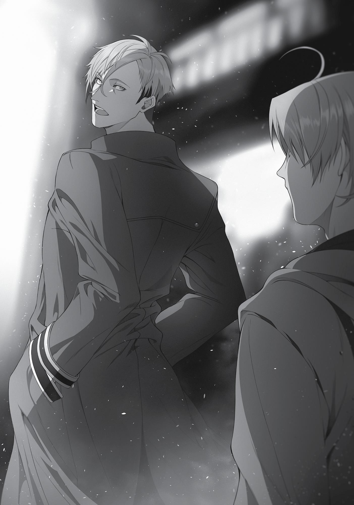

+++
title = "Chapter 6: The Impotent Magician"
date = 2026-07-20
weight = 6
[extra]
volume = 7
chapter = 7
+++

An hour later, I had emptied that flask. I made my
stumbling way outside and went into a random bar. I then
immediately sat myself down at the counter and ordered. “Master,
give me the strongest alcohol you have here.”
“For a kid? We don’t have—” He started to object, but his
expression turned to one of surprise when I plucked an Asuran gold
coin from my pocket and deposited it onto the counter. The surprise
was soon replaced by disgust as he immediately reached for a bottle
on the shelf behind him and set it down in front of me. Why keep me
waiting when you have what I asked for? I thought sourly.
“Ahh…” I drank straight from the bottle, hoisting it, throwing my
head back, and gulping it all down. I’d never drunk alcohol like this,
but it felt surprisingly good. My head was spinning round and round.
Acute alcohol poisoning? Who cared about that? It would be a
dream come true if I could die feeling this good.
“Hey, old man, one more! Give me somethin’ to munch on,
too.”
“Hey, you shouldn’t be drinking like that.”
“Lay off! Hurry up and bring me the booze!” I snapped back, so
the barkeep just shrugged and provided me the next bottle.
Ahh, this sure brought back memories. This was exactly how
things were in my previous life. I’d lash out in anger, and my mom
and dad, terrified, would do exactly as I asked. Hah, after living in this
world for so many years and coming this far, here I was repeating
history again.
Dammit, dammit…!
I took another swig. The alcohol here was fiery hot going down
and strong enough to make your tongue hurt. The taste didn’t

matter, though. The more I drank, the less I felt the biting cold that
had iced me over inside.
The snacks the barkeep supplied were just beans. Roasted
beans, specifically. What were they called again? I’d eaten them
several times, but I couldn’t remember. Whatever, I could just call
them beans. After all, this town had little else besides beans.
“Oho, what’s this?”
As I was greedily popping these beans into my mouth and
chasing them down with alcohol, I heard a voice behind me.
“Well, if it ain’t Quagmire. It’s unusual, ya know, for you to come
drink here at a bar we frequent all the time. But hey, you’ll ruin the
booze if you stay here. So get out. You listening to me? Hey! Look at
me, I’m talking to you.”
Soldat came and plopped himself down on the stool beside me. I
looked over. He wore the same maliciously mocking expression he
always did.
“What the hell is with you and that depressing look on your
face? Let me guess, something awful happened? Not surprising… Not
that it matters. You’re always like this, aren’t you? Whenever
something doesn’t go your way, you run and run, smile like a
complete moron and wait for those around you to comfort you.
Right? That’s exactly what—urgh?!”
His face had gotten too close, so I sent my fist into it. Soldat
went reeling off the chair from the impact and landed square on his
ass, though he immediately hopped back to his feet. “You little shit!”
I jumped off the stool and grabbed him by the collar. “What are
you getting pissed about?! You’re the one always picking fights with
me. This is exactly what you wanted, isn’t it?!”
“You—”

I punched him again. Soldat didn’t defend himself, nor did he try
to avoid it. He just took my fist right to his face and stumbled a few
steps.
“What’s wrong with smiling like a moron?” Another punch. “If I
could be like you—if I could disparage and belittle other people while
boasting about my own achievements, even as people resented me
and my heart filled with jealousy as they all began to hate me and
turn away—if I could go through all that and still have your kind of
attitude, I would!”
I continued, “I don’t want people to hate me. That’s why I smile
like that! What bothers you so much about that, huh?!” The words
just kept coming. “Why do they all leave?! Just stay with me! I don’t
care if it’s a lie, smile for me! It hurts when you’re cruel to me!”
I couldn’t restrain myself.
“Whatever, it’s all ruined. It’s all over for me. Besides, what the
hell is your problem? You don’t know a thing about me and yet
you’re always taking potshots at me. Who are you calling a ‘hotshot
lone wolf’ and ‘half-assed’ anyways? What’s wrong with running
away when things get tough?!” I just kept going. “Fuck! Go ahead
and come at me. Punch me, do whatever you like. Then, when I’m
sprawled out on the floor, you can look down at me and laugh!
You’re probably stronger than me, anyway.”
I rained punch after punch down on him as I bellowed that rant.
The others in the bar began to jeer at us, saying, “It’s a fight! Give it
to him!” Yet Soldat didn’t move. Surely, he could have reacted to my
attacks, but instead he continued to let my alcohol-addled body take
limp swings at him.
Gradually, the voices around us died down. The only thing left,
once I had exhausted myself and sunk to the floor, was the sound of
me choking out a sob.
“Hey, Soldat… Don’t pick on the kid too much.”

“R-right.”
Everyone in the bar, including the members of Stepped Leader
who were drinking in the back, and even Soldat himself were all
completely dumbfounded as they stared at me.
“Sorry. It was my bad. I screwed up. Maybe you really do have it
worse than everyone else. Don’t cry. I’m sure good things await you
in the future.”
“What the hell would you know?” I spat back.
“Hmm… Ah, uh, well, drink up. Then you can tell me about it.
Maybe then we can figure something out, or you can at least get it
off your chest. So…dry those tears,” he said, smacking me on the
shoulder.
And then somehow, before I even realized what was happening,
Soldat and I were drinking together.
“So, basically, you couldn’t get it up and the girl dumped you,
huh?”
“Sniff… What, you trying to make fun of me?” I asked accusingly.
“Nah, not at all. It’s just important when you’re feeling down to
figure out what exactly caused it.”
“I guess so.”
To my surprise, Soldat quietly listened to me as I sobbed and
recounted what happened. He even kept the other members of
Stepped Leader at a distance and led me to a corner of the counter
where it was just the two of us.
“So, Mister Soldat, what really had me so terribly upset was—”
“Just loosen up,” he interjected.
“Huh?”

“Just a moment ago, you were talking like a normal person. You
don’t gotta put up a mask by speaking all stiff and formal. You’re just
lying to yourself when you do that,” Soldat explained.
“All right…”
“You keep lying to yourself and it’s like a poison that builds. It’s
fine to be polite, but be yourself.”
Considering the last year, maybe he had a point.
“So what got me so down was actually something that
happened before this. There was this girl I liked.”
“Yeah?”
“A lot happened and, well, we did…I mean, you know. It was the
first time for both of us.”
“Well, everyone’s got a first.”
I continued, “When I woke up, she was gone and had already set
off on some trip.”
“So she cast you aside, huh?”
Cast me aside? The truth of those words was like a blade that
stabbed me in the throat. Fresh tears came bubbling to my eyes and
my hand trembled as I held my cup, another sob slipping out.
“I said quit the tears. Anyway, if you’re crying about it, that must
be the source of your problem. You’ve been holding on to that this
whole time, and it’s what got you where you are now. Okay. I get
what happened. Now come on, bottoms up. Drink back those tears,”
he said, pouring more of the expensive liquor into my cup.
I threw my head back and guzzled it. My stomach felt
completely numb. I had no sense of just how much I’d drunk, though
my tears were beginning to subside.
“Why did she… Why did Eris leave me? Why—”

“Ahh, so her name’s Eris, eh? She’s a cruel woman. But you can’t
waste time wondering what the reason is behind a woman’s every
move. Women are like cats. We’re more like dogs. There’s no way
dogs and cats can understand what the other’s thinking, right?”
“But still, why? For what reason…?”
“Hmm. Based on my experience, when a woman suddenly
disappears like that, it’s because you screwed up something
immediately before that. They suddenly get all pissy and go off on
their own, saying they don’t care anymore.”
“Something I did immediately before,” I echoed, thinking. There
was one thing that came to mind. “So I guess I really did suck in
bed…”
“Best not to come to your own conclusions about what got her
so riled up. Whatever you come up with is probably gonna be wrong,
so be careful with that. If you apologize thinking that’s it, they’ll get
pissed at you and yell, ‘I’m not even upset about that!’”
“I don’t even know where she is, so I can’t apologize,” I
confessed.
“Yeah, I get that. I do.” Soldat drained the rest of his cup. After
he set it back down, he drew his thumb over the edge, wiping away
the beads of liquid there. After looking contemplative for a few
moments, he mumbled, “It’s just gonna be depressing if you keep
going like this.”
Those words perfectly captured my feelings. Soldat’s expression
hadn’t changed. He still had that look of utter resentment at the
world—that sarcastic, mocking expression. Still, that was just his
face. His eyes were looking right at me and his words were sincere.
“Let’s fix it,” he said finally.
“But how?”

“Not a clue.” He shook his head and continued, “But if that is
the source of your problem, you just gotta override it with the same
thing.”
Override it with sex. Sex, however, meant that I would have to
use the very thing that wasn’t standing up for me right now though,
right? Fixing it would require the very thing that was broken to
temporarily return to working order. “Isn’t that impossible?”
“You’ve only done it once, yeah?”
“…Yeah.”
“Then who knows? Listen up, finding pleasure doesn’t
necessarily mean you gotta stick it in a hole.”
I kind of understood what he was getting at. Certainly, he was
right. Adult videos couldn’t be two hours long if not, and there
wouldn’t be so many kinds of them out there.
“What do you propose then?” I asked.
“Let’s leave it to a pro.”
At Soldat’s suggestion, we headed off to Rosenburg’s pleasure
district.
It was my first time here, and indeed, my first time stepping into
any red-light district at all. More precisely, I’d deliberately avoided
coming near this place.
The sun had already faded in the sky, the brothels were all lit up,
and a respectable number of people wandered the streets around
them. The majority of these people were men, but there were also a
sizeable number of women. Most of them were there to work, but
from what I overheard, some were also here as customers looking
for men. All of them wore such heavy makeup that it was difficult for
me to discern one from the other.

No, the women beneath the eaves, puffing on what resembled
cigarettes, were unmistakably employed here. They wore suggestive
clothing with their breasts exposed. I could tell by the way they were
glancing over at me—no, at Soldat—that they were trying to attract
customers.
“Th-this is my first time in a place like this,” I confided.
“I know.”
“Wh-what kind of girl should I pick?”
“Nah, you don’t have to pick someone from here. These girls, to
put it bluntly, are the kind that just lie there if you pay them. I’m fine
with that, but you’re not like me.”
“Oh, okay.” So even prostitutes had varying skill levels and
services, huh? And the low-ranked ones were, in every sense of the
word, selling only their bodies. That definitely wasn’t the kind of
partner I was looking for.
“We’re going somewhere a little more special,” declared Soldat.
“Oh, special, huh?”
“Well, I say ‘special,’ but there’s a lot of variety to be had. There
are places that’ll let you do things a run-of-the-mill brothel wouldn’t,
and the kind that’ll satisfy whatever secret fetishes you got. And
there’s even more crooked establishments out there—places people
refuse to talk about.”
More unscrupulous than the other ones he mentioned? I felt
like I only had a vaguest idea of what he was talking about.
“For now, we’re just going to your standard brothel. A place
with skilled professionals that’ll use techniques like you’ve never
seen before. It’ll really knock your socks off.”
Just hearing about it was enough to get me excited. I’d never
been to such a place before, not even in my previous life. I’d been
interested even back then, but had also been the type to haughtily

claim that only idiots went to such places. I was young—young and
foolish.
Right now, in contrast, all I felt was anticipation. But my buddy
between my legs didn’t seem to agree.
“Soldat… Sir, have you been to these kinds of places a lot?”
“Drop the ‘sir’. And, well, yeah. I’m a man, why not?”
“But don’t you have a woman in your party?”
“That’s against in the rules in our party, or rather, amongst our
clan. Parties are just a gathering of adventurers based on their skills.
The rule is, if a man and woman in a party are discovered to be in a
relationship, they’re driven out of the clan.”
“Oh, okay.”
In an online game I’d played in my previous life, we’d had
problems with romantic relationships. Players would meet offline,
start dating, and then things would get awkward for the entire guild
when the relationship turned sour. We also had trolls who were just
there to make trouble.
This, however, was a different world. No one had an avatar to
hide behind, and the fallout of relationship drama could endanger
adventurers’ lives. That was probably why there were such strict
rules against it, particularly in sizable clans.
“But still,” I protested, “being in life-or-death situations for days
on end just naturally creates those kinds of bonds between men and
women.”
“It does,” agreed Soldat. “That’s why we’re so strict about
replacing members. If a leader senses those kinds of feelings
between two people, they’re asked to leave immediately.”
“But you’ve been with them for so long. What happens to your
teamwork when you suddenly bring a new person in?”

“Well, we just rework the basic battle guidelines administered
by the clan, and a little practice does the rest. It still takes a bit of
time, but that’s why leaders like me are proactive about putting
forward recommendations for new members. Anyway, we’re here.”
Soldat stopped in his tracks. “Come on, follow me.”

Before us was a building, bewitching with its red paint and lit
bonfires. It looked too intimidating to enter; I would normally never
even approach such a place, let alone go inside.
Yet as I hurried after Soldat, I found myself crossing the
threshold with no problem. I used to wonder how someone as
unpleasant as Soldat could lead an adventurer’s party, but now I kind
of got it. He was strangely easy to follow, somewhat like Suzanne.
You could trust either of them to lead you places.
“Don’t act so nervous. Oh, you got money, right?”
“I…I think I have enough.” There was something at the entrance
resembling a list of available options, and I confirmed that the cash in
my wallet was more than enough to pay for the most expensive
option they offered.
“You’ve been saving all your money, right? Then you should be
fine—at least for a night. You’ll be screwed if you get hooked and
start coming back every night.”
When we entered, we were greeted by a rainbow of colors, with
elegant upholstery that stretched as far as the eye could see. To our
right was a counter, and to our left were about six women in dresses,
all seated. Instead of the gaudy makeup of their peers standing
outside, they wore only enough to accentuate their natural beauty,
making them look both seductive and sensuous. This was likely one
of their many skills.
At a glance, I could tell their dresses and the furnishings were
expensive stuff. Luxury prostitutes, as their name implied, gave off a
sense of grandeur.
“Those are some amazing dresses,” I commented.
“Yeah, apparently they’re imports from the Asura Kingdom.
They’re dresses made for real nobility, but merchants avoid taxes
and sell them at a decent price by transporting them in separate
pieces, and then people sew them together.”

“Y-you’re awfully knowledgeable about that.”
“Heard about it the last time I came here. The leader of the
Remate chain, Silent, came up with the idea. That’s how Remate got
so big recently.”
“Oh, wow.” This was definitely of interest to me, but I didn’t
have the time or money for it right now.
Soldat made a beeline for the counter and rested his elbow on
it. “Yo.”
“My, my, if it isn’t Lord Soldat. Welcome to our humble
establishment. Ah, but I regret to inform you that your preferred
companion is currently booked full.”
“I’m just here to drink today. But it’s my buddy’s first time here,
so could you explain how things work?” He backed away from the
counter and pushed me forward.
I stepped toward the receptionist as bidden. The person on the
other side of the counter was an elegant man with a pleasant smile,
and though I clearly looked like a child in his eyes, he still regarded
me with the utmost courtesy. “A pleasure to make your
acquaintance,” he said. “Allow me to extend my gratitude to you for
choosing to visit our establishment, the Blue Rose Palace, today. I am
the manager of this place, Profen.”
“Oh, nice to meet you. I’m Rudeus Greyrat.”
“Ah! You’re Quagmire Rudeus! I’ve heard rumors of you for
quite some time now.” What kind of rumors? Part of me wanted to
know and the other part didn’t. “Lord Soldat mentioned that it’s your
first time here. If I might ask, does that mean it will also be your very
first time ever?”
“Oh, no, it’s not.” I shook my head.
“Very well, then. I shall explain to you how our system works.”
And he laid it out.

First, you would pick from one of the girls waiting in the chairs.
Next, price was determined based on the itinerary you selected.
Itineraries had a bunch of different options, and anything that wasn’t
listed was simply off the table. You would be handed a list of what
was permissible and what wasn’t, of course, but typically a patron
didn’t have to fuss too much over the specifics. The escorts had
already memorized everything on the lists.
Once you’d chosen, you would enter one of the baths to clean
up, and then be guided to a room. There, the woman you had chosen
would join you, and the two of you would be alone together to do
whatever you wanted. As long as what you wanted was on the list,
she would oblige you. If you proposed something not on the list, she
would refuse, and that would be that.
That said, if you really had your heart set on something not on
the list, you might be able to negotiate for its inclusion at the cost of
an additional fee. Of course, the establishment had numerous
methods at their disposal to make sure you ponied up. You paid
seventy percent up front, and thirty percent plus any additional fees
after.
“So, who you gonna pick?”
On Soldat’s recommendation, I picked the most expensive
itinerary available and quickly settled the first half of the bill. This
would allow me to try a variety of different methods to resolve my
problem. After that, I sized up the women who were waiting. Since I
was a paying customer, I was allowed to take a closer look and even
feel them up if I wanted. There were a variety of escorts available,
both young and old ones alike. Each wore a dazzling smile as I
approached, smiles so seductive that I might have fallen for their
wearers if we’d encountered each other literally anywhere but here.

Four of the seats were empty, which probably meant those girls
were already seeing other customers. Even so, I felt a bit
uncomfortable feeling up someone who was smiling at me, so…
“I guess…I’ll go with her.”
The girl I picked was the second from the left. She looked just a
bit shy of twenty and was a tad shorter than me. She had sizeable
breasts, a tight waist, and a nice round ass. Her facial features looked
Asuran, with elongated eyes that slanted down slightly. She had a
confident air about her, and reddish, curly hair that was set in
waves.
In other words, her physical appearance resembled Eris’.
“I’m Elise. A pleasure to be in your company.”
Even her name sounded similar. No—it probably wasn’t her real
name, anyway.
“Might I request your name as well, my lord?”
“Oh, Rudeus. Rudeus Greyrat.”
She looked shocked for a moment, but then her lips creased.
“Well then, Lord Rudeus, I look forward to serving you.” Elise wore
an enchanting smile on her face as she quickly turned on her heel
and disappeared into another room.
“Well, good luck,” said Soldat. “I’ll come back for you when your
time is up.”
“O-okay.”
Once he said that, Soldat selected the furthest girl to the right
and disappeared somewhere else. I felt suddenly helpless now that I
was alone.
“This way to the bath. Please feel free to take your time cleaning
up, as it doesn’t count toward your allotted time with your
companion.”

I brushed away the feeling of loneliness and followed the guide,
wandering deeper into the building. The bathing area included a tub
overflowing with warm water and two girls wearing what amounted
to bathing suits. They were quite young, too, flat chested and lacking
the body of a mature woman's figure. The two of them silently set
about washing me. Perhaps these girls were apprentices, not yet old
enough to take customers, but merely learning the skills as potential
candidates to become escorts themselves. They scrubbed every inch
of my body. And when I said they cleaned every inch, I meant it. They
even brushed my teeth and polished me until I sparkled. Were my
lower half in its proper state, my comrade-in-arms would have surely
stood at attention and saluted the heavens. However, as always, he
was completely silent.
Once I had donned the underwear and shirt they provided,
putting my clothes and valuables in a basket they’d given me, I was
told to go to Room 5.
I left the bath through a different door than I had entered, then
took a narrow hallway to arrive at the designated room. With the
numbers clearly written on the door, it was easy to spot. Rooms after
door 6 were upstairs.
I timidly opened the door. Just the thought that there was a girl
waiting on the other side, willing to do anything within the rules of
this establishment, got me excited. And yet my precious partner
down below remained uninterested. “Pardon me,” I automatically
said as I stepped inside.
It was dark in the room. The only light came from a number of
candelabra and some candles on the table. In that dim light was a
canopy bed. Elise stood at its edge, dressed in sheer clothing.
“I’ve been waiting for you, Lord Rudeus. Please, come this way.”
She smiled softly as she approached me, taking my arm. Elise was
clearly different from Sara, with the way her prominent chest

pressed against my arm. My heart drummed furiously. “Shall we
begin immediately? Or would you prefer a bit of conversation first?”
“Uh, um…”
“It seems you’re nervous. In that case, why don’t we chat a bit?
Don’t worry, the night is still young. There’s no need to rush.”
Ahh, so this was a professional. It was easy to tell by the way she
conducted herself and spoke as she settled beside me on the bed.
With practiced hands, she took a bottle of alcohol from the table and
poured it into one of the provided cups. “Would you like to have a
drink?” she asked.
“Uh, yes, I would.”
Persuaded by her offer, I drained the glass dry. For a moment I
wondered if she wouldn’t join me, but then I remembered seeing it
written at the entrance that companions wouldn’t drink. There was
also a warning that if a patron insisted their companion join them,
her skills might be dulled and her words less filtered due to
inebriation. So I would drink alone for now. The walk here had
sobered me up from earlier. What happened after this would be
essential, so I needed the influence of alcohol to help me along.
“These sweets are from the Asura Kingdom. Would you like
some?”
“Y-yeah.”
When I did as Elise suggested and ate one, she giggled. “I’ve
heard of you before, Lord Rudeus.”
“Oh, yeah… Well, I have become pretty famous at the
Adventurers’ Guild. That’s true. I guess you must have heard of me
from another adventurer?”
“No, from my little sister. You once healed her wounds without
asking anything in return.”
“‘Once’?” I echoed questioningly.

“I heard it was last winter, as you were helping clear the snow.”
“Ohh.” Something like that had happened, come to think of it.
“Adventurers are kind to us when we dress up like this, put on
make-up and touch skin to skin, but many of them tend to be quite
violent, otherwise. Particularly toward the young understudies here,
who have no money, whose clothes are in tatters, and who are often
mistaken for orphans. Many adventurers don’t stop to consider that,
as those children get older, they will be taking patrons, and that
those very same adventurers may become their customers.”
A filthy orphan in the backstreets and a beautiful woman
accepting patrons at a brothel seemed worlds apart. If I had
bothered to look closer, I might have realized that the children who
bathed me earlier looked like the urchins I sometimes spotted in
back alleys during the day. “I think you must be right. I admit, I
thought they were orphans too.”
“But you were different than the rest,” she insisted. “You sought
nothing in return and helped what you thought was a penniless
orphan out of the kindness of your heart. You are an incredible
person. There’s been talk that some girls would go the extra distance
to please you if you happened to visit them in the future.”
This definitely had to be lip service, I was sure. Still, it was nice
to hear.
“I am sure the other girls will be jealous once they hear that I
was the one who got to sleep with you.”
“Uh, yeah, sure… Um, could I have another glass?”
“Yes, certainly. But you mustn’t drink yourself into a stupor, you
know? We have so much time left tonight. Rather than enjoying the
liquor, why don’t you try enjoying me instead?”
“Oh, of course. Yes.”

After eating and drinking, my brain felt sufficiently addled with
alcohol. As for Elise, she sat by my side the entire time, glued to my
arm, her hand caressing my thigh all the way up to the base of my leg
while saying, “Does it taste good?” and, “You can certainly hold your
liquor.”
“Um, can we start now?” I asked finally.
“Certainly.” Elise released my arm, which she’d been clinging to
the entire time, and stepped in front of me. “Would you like to
undress me yourself?”
“Uh, what? Oh, no, that’s fine.”
“Very well.”
The way she moved as she stripped off her sheer garments was
so seductive that it was bewitching.
“Now then, Lord Rudeus, to the bed.”
Her naked body kept me rooted in place as I fumbled at my own
clothes. Once they were off, I followed her invitation and joined her
on top of the mattress.
“I will do my utmost to please you.”
The whole situation was so sensual it felt like an illusion, as if I
were in a dream. It was enough to make me believe, Oh yeah, I can
definitely do this.
Simply put, it didn’t work.
“I am so sorry I wasn’t able to be of use to you.”
The moment I got in bed with her, Elise immediately realized my
problem. She then proceeded to apologize profusely, asking me if I
would prefer to choose someone else to be with. It wasn’t a bad

idea, but I would’ve felt guilty, so I explained my circumstances. That
made her determined to help me, using every technique she
possessed—including some not listed on my selected itinerary.
Honestly, she was wonderful. It felt great. I got a clear taste of
what a professional’s skills were like. However, the physical
sensations led nowhere. My buddy remained ever silent, almost as if
his two boys below had been cut off. In fact, the more we tried, the
emptier I felt, and the further we seemed from discovering the
source of the problem.
Then our time was up. “No, Miss Elise, you did your best,” I
assured her.
“Even so, I… Oh no, what should I do…”
“I’ll pay the fee. For the things that weren’t listed as well, if
you’ll tell me the cost.”
“No, you don’t have to worry about that. I did that because I
genuinely wanted to help you.”
True, I hadn’t asked her to do those things. But I got a clear
sense that she normally wouldn’t have done them without the
appropriate compensation, though. “Are you sure?” I asked,
uncomfortable.
“I meant what I said to you earlier. Some of us swore we would
put in more effort to please you if you were to come here.”
I couldn’t hide my disbelief. “Oh. Really?”
“I heard you were still quite young, however, so I didn’t think
you would be coming here for some time,” confessed Elise.
A mix of flattery and truth, then. “I’ll take your word for it,” I
decided.
“But since it’s true that I wasn’t able to satisfy you, would you at
least permit me to escort you outside the pleasure district?”
“Uh, sure.”

As prompted, I left the room with her and we walked together
down the narrow hallway. Halfway down it, I felt someone behind us
and glanced over my shoulder. I spotted some young girls slipping
into the bedroom we’d just left. They carried cleaning supplies, and I
guessed they were in charge of tidying the rooms once customers
were finished. I recognized one of them—pretty sure she was the girl
whose frostbite I had healed. “I guess what you said earlier really
was true,” I remarked with surprise.
“You didn’t believe me?”
“I thought it was lip service.”
When I answered her honestly, she just coiled her fingers
around my upper arm and stroked it. “To tell the truth, it partly was.”
“I figured.”
“But ten years from now, when that girl starts taking customers
of her own, I am sure what she will give you will be sincerity, not
flattery.”
Was she trying to convince me to become a repeat customer? I
decided to take her words with a grain of salt as we made our way
back to the lobby.
We couldn’t convince the clerk to waive my fees. However, on
Elise’s personal request, I was given additional time with her, though
anything she did during that span would be without compensation.
“I’m told Lord Soldat is drinking next door.”
I followed Elise’s directions and wandered to the neighboring
bar. Since it was operated by the same company, I could get there by
walking through this building rather than stepping back outside.
Perhaps those who weren’t here for sex came here instead, to drink
alongside fledgling escorts who were old enough to do the work, but
not yet ready to take customers of their own. Here, apprentices of

the art could practice and refine their conversational skills until they
could flatter as naturally as Elise. Of course, they were probably
given guidance elsewhere to develop their other skills.
“So that’s when I told ’em ‘Just one blow, that’s all I need to
wipe out these beasts in front of us. You guys just focus on the
enemies to our sides and flank.’”
“Aaah! Lord Soldat, you are so sexy!”
“Yeah! You do think I’m sexy, don’t ya?”
Soldat was in the back enjoying his drink while two girls
attended to him. When he saw me approach, he immediately stood.
“Oh, Quagmire! How’d it go?”
“She tried a number of different techniques on me, but…nothing
worked.”
“Ahh, so it was a dud.” Soldat scratched at his head and heaved
a sigh. “How the hell should we fix this?” He folded his arms,
apparently mulling it over, but I had already given up. In fact, it felt
as though my heart might shatter if I kept trying in vain.
“Hey you, what do you think?” Soldat turned the conversation
to Elise.
“Me?” she asked, surprised. “I’m afraid I don’t have an answer,
beyond regretting that I couldn’t be of more help.”
Soldat remained undeterred. “How did he compare to your
other customers? Was there anything that stuck out to you?”
Elise was stunned. “I couldn’t possibly compare him to other
customers, that would be—”
“Come on, just say it,” Soldat urged gruffly as her gaze quickly
flitted between the two of us.
“Lord Rudeus seems to be…well, frightened of women. He came
across as very timid whenever he talked to me, looked at me, or
touched me.”

“Go on.”
“Perhaps if his partner were someone he didn’t have to be
afraid of, someone he could be certain wouldn’t hate him no matter
how things turned out, he might be able to do it.”
“You got anyone like that?” He looked at me.
I shook my head. For a moment I pictured Roxy in my mind, but
that was hopeless. Roxy was the person I most respected in the
entire world, and therefore the number one person I didn’t want to
hate me. In other words, the exact opposite what Elise was
proposing.
“I don’t think that’s something he will find immediately. It’s
something that has to build gradually over time,” Elise added.
“Yeah, I figured.”
I drank as I listened in to their conversation. Soldat looked
serious as he discussed the situation with Elise and continued to
consider the matter. “Well, let’s just drink up for now. Drink enough
to knock you flat on your ass!”
At his encouragement, I took a seat.
“Pardon, sirs, but it’s about time for us to be closing.”
“Ahh, already that late, huh?”
“Mm…” I hummed back at Soldat.
As the two of us got to our feet, Elise wove her arm around
mine. “Allow me to see you off.”
We paid our bill and headed out the door. At some point the
darkness had started giving way to light as dawn began to break. It
had been dawn when I returned to the city after rescuing Sara, as
well. A bitter memory now.

“Urrgh… Ahh, we really chugged down that alcohol. A little too
much…” Soldat said.
“Yeah…” I agreed with him.
We’d drunk a ton—gulped it down until we were wasted. Now
my feet stumbled and the world spun around me. I didn’t know
which way was forward. Down may as well been up, and I couldn’t
tell right from left. Heh heh. I took advantage of my state to cop a
feel of Elise’s ass.
“Hey, Rudeus,” Soldat said.
“Whaat?”
“Y’know, I… Well, when I’m in a labyrinth, I try not to rush
things.”
“Mm.” I listened, even as I wondered what the heck he was
talking about all of a sudden.
“See, the further you go into a labyrinth, the stronger the
monsters you’re gonna find,” he explained. “Sometimes the bastards
even team up with each other. If you panic and run in there blind,
you’re just gonna get your ass handed to ya. So you take your time
fighting monsters on the first few floors so you can get settled into
your formation and get used to things. This is really effective,
mmkay? ’Cause lots of those monsters crop up again on other
floors.”
“…Yeah, effective! Got it!” So one should observe your
opponent’s movements on the previous floors, grow accustomed to
how they battled, and then move to the next, right? Yeah, that
would be effective!
“What’s her name again, Sara? Don’tcha think you two took
things way too fast?”

“Fast? Whaddya mean?” My words were slurring together.
“Yeah, I mean, I’m pretty quick in bed, but I dunno if you can really
say the same about Sara.”
“That’s not what I mean.” He waved a hand dismissively.
“Sounded like she was ready for this, but you needed to take more
time and mentally prepare yourself, ya know?”
“Nah,” I disagreed. “It was nothin’ to do with bein’ prepared. I
toldja, didn’t I? She didn’t mean it like that. ’Twas obligation, that’s
the only reason she’d sleep with me.”
“Nope. If ya ask me, that archer really did seem to have the hots
for ya.”
Neither one of us could articulate our thoughts properly, but we
were still somehow having this conversation. What was Soldat on
about, though? Sara had the hots for me? So what, she only said
what she said to hide her embarrassment? Hmm. In retrospect, it did
sound a bit tsundere…
Nah, that couldn’t be it. If she really did have those kind of
feelings for me, she wouldn’t have called me a disaster.
“Well, ya still got time, yeah? Meet her again, take it casually,
and try talkin’ to her as if nothin’ ever happened. If that works, then
bit by bit you can open up and let her in, yeah?”
“Yeah, I guess so…”
My mind, heavy with alcohol, began to churn in thought. He was
right. I wouldn’t know for sure if I didn’t try talking to her. That was a
lesson I’d learned from talking to him, in fact. Communication really
was key to us humans.
“Very well,” I finally said. “I will make an attempt to engage with
her, either this evening or dawn the next day.” I was pretty sure the
members of Counter Arrow had mentioned leaving early this
morning for a mission. Judging by how bright the sky was, they had
probably left quite a while ago. Yeah…

Wait. Uh, wasn’t I supposed to be going with them?
Oops. Looks like I was a no-show then.
“Well, I am afraid this is far as I am able to accompany you. Lord
Rudeus, will you be all right?” Elise disentangled herself as we
approached the exit to the pleasure district. The absence of her soft
breasts and warmth left my body feeling lonely.
“Mm, yeah, I’ll be just fine. I am…a magician! I can use
Detoxification!” I declared.
“Are you really sure you’ll be all right?”
“Mm, yup, fiiine. But, Elise, just one last time, can I touch your
chest?”
She was quiet for a moment. “Yes, be my guest.”
“Yeah, thanks!” I squished them in my hands just a wee bit. The
buddy between my legs remained his droopy self, though. Yep, he
was down there crouching. After all, you had to crouch in order to
leap up high. He was just preparing for that.
Yeah, really. That was all it was. Crouching.
“Though I wasn’t able to please you today, I hope you will come
see me again.” Elise planted a kiss on my cheek, retreated a few
steps, and bowed before she left.
“Got it!” I answered, even though I knew I likely wouldn’t be
returning. Maybe if I managed to fix my problem. Maybe then the
next time I got to feel those breasts, my buddy down below would
actually spring to life.
I turned to Soldat. “Well, time to go home!”
“Yeah! Make sure you talk to her!”
“Yeah, yeah, I know.”
My adventure in the pleasure district hadn’t fixed anything, but
it didn’t feel like it’d been a waste of money. My time with Elise had

brought me some comfort, at least. Even if I didn’t feel electricity
race down my spine, I still got to enjoy the softness of her breasts.
“Do you really get it, though?” Soldat asked, doubtful. “Actually,
today I’m gonna—” He stopped in his tracks partway through a
sentence.
“Yeah, I get it!” I barked. “Sheesh, you really won’t let it go. Even
if it doesn’t work, meh. I should be the one sayin’ no thanks to a flatchested chick like that. Women are only good if they’re like Elise and
have some bounce goin’ on in the chest area!”
No reply.
“C’mon, Soldat, you agree, don’t ya? I mean, us going shopping
and eating together… How stupid. Like, are we playin’ house here or
what?”
“Uh, Quagmire, think you better leave it at that.”
“Leave it at what? It’s just a simple fact. Sara is a kid and Elise is
a proper grown-up woman.”
I finally glanced over at Soldat, wondering what it was he was
trying to say. His eyes were fixed on something in front of him, and
he wore an ‘Oh shit’ look on his face.
I followed his gaze and I saw two women standing there. One
was Suzanne, clad in her steel breastplate and gauntlets, looking
ready to set off on an adventure. The other was Sara. She similarly
looked prepared to set off, but her eyes were swollen and ringed
with dark circles, almost as if she’d spent the night crying.
They were also looking at me, with shock and dismay on their
faces. Shit, I thought as Sara came at me. Her steps were short, swift.
“Sara, wait, that’s not what I meant to say just now—”
My voice caught in my throat at the expression on her face. I
swallowed back my words. Sara’s gaze was cold as ice, as if she were

wearing a noh mask. Elise had quickly stepped away as she
approached.
Slap!
A dry smack echoed through the quiet streets of the pleasure
district. My head swiveled with the impact and my cheek burned
where she struck me.
“You’re scum! Never show your face to me again!” I heard her
say, my head still turned away. By the time I looked back, she was
already racing over to Suzanne, who had an intense look on her face
as well.
“That was unacceptable,” Suzanne said quietly, though it was
loud enough for me to hear. She put a hand on Sara’s shoulder and
the two left together.
I had no idea what had just happened. In a split second, I’d
sobered completely. When I looked over at Soldat, he had his head
tilted back with his palm pressed over his face.
There was one thing I did understand: I had just been rejected
completely. There was no mistaking it. What I’d said was the alcohol
talking, but that didn’t matter to Sara. She’d heard what I said and
decided she never wanted to see me again.
As adventurers, we were bound to run into each other at the
Adventurers’ Guild. I was sure she would look at me with disgust
every time we did, now, and perhaps Suzanne would, too. Not just
her, but Timothy and Patrice as well. Now, they would be the ones to
regard me with the revulsion that Soldat once had.
I sank to my knees. I couldn’t stand. “Ah…aah…”
This was it. I couldn’t do it anymore. I’d spent a whole year with
them and finally, finally started to become friends, but this was how
it all ended. No more. “I should just die.”
I took a knife from my pocket and put it to the base of my neck.

Something instantly hit my wrist and I dropped the blade. Soldat
had struck me with the side of his hand.
“Idiot, don’t be hasty! This was just a misunderstanding. Here
you almost slept together, then she sees you coming out of the
pleasure district with an escort and you talking shit about her. Of
course she’s gonna get the wrong idea! Besides, the fact that they
were still here means they must’ve been looking for you. Hurry up
and run after them! Go explain things! You can still set it right. Well?
Stop dicking around—stand up and get going!”
“None of that…even matters anymore. That’s it… It’s the end… I
don’t want to do it anymore…!”
As I choked out a sob, Soldat slapped me on the shoulder. “Then
why don’t you go home for now, instead? You don’t gotta work it all
out with your mom and dad, but at least let them take care of you…
Ah, wait, you said your mom is missing. Where was your dad again?
The Asura Kingdom?”
“…Millis. The Holy Country of Millis, as part of the Fittoa Search
and Rescue Squad.”
“Ah, then I guess that won’t work. That’s pretty far away.”
Soldat scratched at the back of his head and hummed in thought.
Going home was certainly one option. After this bruising, I didn’t
have the willpower to go on by myself anymore. It might be good to
go back to where Paul was and spend my time looking after Norn
and Aisha, together with Lilia. I couldn’t do anything by myself. I was
mature enough, mentally speaking, but this was all I amounted to.
No matter how much time went by, this was all I was capable of.
Even so, home was too far away. It would take at least a year to
reach Millis from here. Paul and the others might move elsewhere by
then. We might even miss each other. There was no way I could drag
along this shattered heart of mine and keep living in the meantime.
It was hopeless.

“Well, how about coming with me?” Soldat blurted out, just as I
began to despair.
“…Huh?”
“An enormous labyrinth was discovered in the Neris Dukedom.
A couple parties within Thunderbolt got orders to go conquer it. That
includes us, so we’re thinking about leaving today. You wanna tag
along?”
I was confused. They were leaving today? So that meant he’d
spent the night before their departure looking out for me?
“But I don’t want to enter anyone’s—”
“You don’t gotta join our party. I’m just asking if you wanna
come with. If you’re that terrified of seeing those guys again, you can
go somewhere else and find new people, yeah? There’s as many
women out there as there are stars in the sky. Whaddya say?”
I slowly raised my head. Soldat was glancing down at me. As
usual, his expression bordered on the edge of derision. The look in
his eyes, however, was genuine.
“Why are you…willing to go this far for me?”
He shrugged. “No particular reason.”
“But I thought you hated me?”
“Yeah, that creepy smile of yours and that sickeningly polite
speech like some kinda saint… That crap really rubbed me the wrong
way. I wanted to get you to drop the mask. But now I know all about
what’s going on with you. I get that you have valid reasons for acting
the way you do. There’s no reason to hate you anymore.”
So that was it. Soldat really didn’t hate me anymore.
“I poked and prodded and just when I thought you’d blown up
at me, you started sobbing like a child. I feel like I messed up, too.
People have things they want to keep to themselves, y’know? I knew
that, but I kept pushing you anyway.”

I felt like I’d really misunderstood Soldat. There had been more
than one occasion when I found myself wondering how a functioning
party could possibly have a leader like him, but he’d turned out to be
a much better person than I’d imagined. Yeah, sure, he had his faults,
too. In fact, his flaws were mostly what I’d been exposed to so far.
But his party members could laugh those off because they were well
aware of his good points, too.
“So, what’ll it be?” Soldat asked as I mulled it over.
For now, I just wanted to get away from here. The thought of
running into Sara because I’d hung around dragging my feet terrified
me.
“I’ll go. Please take me with you.”
I knew this amounted to running away, but I wanted to be free
of this place. Even if I went to a new land, I had no intention of
looking for someone new. I’d had my fill of trying to get intimate
with another person. I wanted to fix my problem if I could, of course,
but I was dead sure that leaving Rosenburg wasn’t going to do it.
Whatever. It was fine. I’d gone without sex in my previous life. Giving
up on it now wasn’t going to kill me.
“Okay, well, let’s be off then.”
I gradually rose to my feet with Soldat’s encouragement, looked
at the rising sun, and swore to myself that never again would I rely
on a single party.
Sara

Meanwhile, Sara was left feeling shocked and resentful
after the encounter, harboring a fierce loathing for the one named
Rudeus Greyrat. “I can’t believe it. I just can’t, I can’t!” she shrieked.

It was just after noon. A substantial amount of time had passed
since she’d slapped the boy. Currently, she was on the bank of a river
about half a day’s distance from Rosenburg. The party was escorting
some fisherfolk, a C-ranked request that posed no danger. In other
words, Sara had nothing to do. As a result, she’d spent her free time
cursing Rudeus.
“I can’t believe I—with that lowlife…! What scum! A complete
and utter scumbag!”
She was frustrated. She had really liked him.
Of course, she couldn’t stand him at first. But even when they
did their first job together, she’d more or less understood that he
wasn’t a bad person. Her feelings for him went no further than that:
he was just a cowardly noble boy, despite the enormous power he
possessed.
That impression of him had only changed after what happened
in the Galgau Ruins. He took up the rear and faced the horde of snow
drakes without saying a word, just so the rest of them could escape.
Rudeus was certainly strong enough to have outrun the creatures
alone, but he’d prioritized getting Counter Arrow out alive. Back
then, she didn’t understand why he’d hidden his abilities, but she did
realize he was the kind of person who’d sacrifice himself to save
others.
From there, her feelings for him gradually began to change. Sara
started to take an interest in what he said and did. She tried to
dismiss her budding feelings, reminding herself that she hated
adventurers who were born into nobility, or really that she just hated
nobles as a whole. But the denial didn’t stick, and somewhere in her
heart she realized that Rudeus was different from the nobles she
hated.
The mess in Trier Forest was the last straw in getting her to
admit her true feelings. Or perhaps it was better to call it an

opportunity rather than a mess. At death’s door in that forest,
witnessing Rudeus coming to save her by himself, she finally
acknowledged it wasn’t hatred in her heart, but rather, affection.
She’d fallen for Rudeus.
With that realization, Sara took an assertive approach. She
started inviting him to their hangouts and actively engaging him in
conversation. The more they talked, the more her affection for him
grew. When she looked at him, she felt his blossoming affection for
her. That was why she proposed a date and moved forward with the
resolve to see it through to the end. Sara was too embarrassed to
confess her feelings directly, so she planned to use her life debt to
him as a pretext for bedding him. Then, she’d decided, she would
reveal her true feelings once they’d slept together.
Which was why what followed came as such a shock.
His body didn’t react to hers. Rudeus seemed like he cared
about her, and even seemed receptive to her feelings for him, but
apparently he felt no attraction to her body. It was a slap in the face.
If she’d had the wits to watch Rudeus’ reaction more closely,
she would have realized he was in shock, too—he hadn’t intended
this to happen, and he was just as anxious as her. Unfortunately, it
was Sara’s first time and she didn’t have enough composure for that.
It was all she could do to spit some words at him to save her pride
and get out of there. She’d sobbed as she fled back to her inn, and
continued to cry as she explained the situation to Suzanne. She spent
the entire night in tears, but somehow resolved to put on a cheery
front the next day.
But Rudeus wasn’t at their meeting spot the next day. At his inn,
the owner told them he’d left the previous night and not returned.
Asking around, they learned that Soldat had dragged him off
someplace.

Rudeus—and the whole of Counter Arrow, in fact—did not get
along with Soldat. Maybe he and Soldat had gotten into it, and
Soldat had dragged him off to hang him? As Sara fretted over the
possibilities, she and Suzanne followed Rudeus’ tracks. That was
when they spotted him—at the entrance to the red-light district,
kissing a red-haired escort.
Unbelievable. After Sara hadn’t been able to satisfy him, he’d
gone and had sex with a prostitute instead. Soldat stood nearby, and
the two of them were very clearly hammered.
Then she heard what he said.
Based on everything she’d seen and heard, Sara came to this
conclusion: Rudeus had spent the night with Soldat, bedding women
and downing the same alcohol he refused to drink with her and the
other members of Counter Arrow. He laughed as he recounted how
utterly undesirable and unattractive her body had been. Her shock
and devastation took over, keeping her from putting together the
tell-tale clues that suggested otherwise. Her affection for him
instantly turned inside-out into loathing.
If Sara had been a bit older, she might have been able to think
about this calmly. Unfortunately, she was just a sixteen-year-old girl.
Teenagers her age were certain that everything they saw and felt
was fact. Besides, she had lived her whole life as an adventurer, and
had no idea how to restrain the surge of emotion that resulted. She
certainly didn’t realize that she had a bad habit of lying to herself and
ignoring the truth.
“Hey, Sara.”
Suzanne was a bit more mature in that respect. She had seen
Rudeus and Soldat too, but her impression of the encounter was
slightly different. Now that her emotions had cooled, she realized
there was something off about what Rudeus had said. The boy she
saw that night was not the Rudeus she knew. Something had
