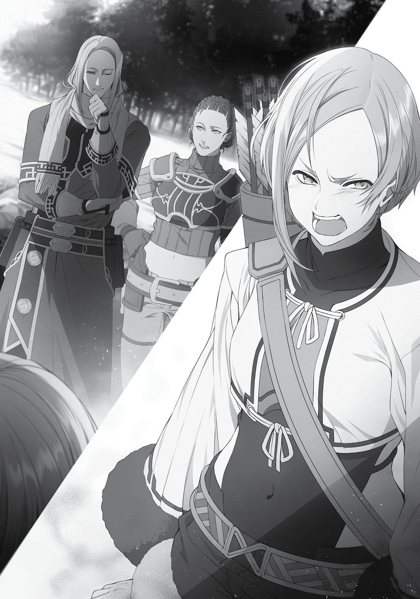
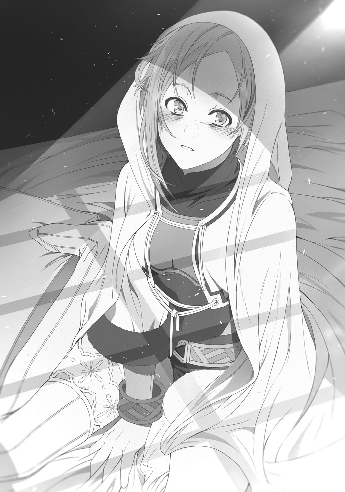

+++
title = "Epilogue"
date = 2026-07-20
weight = 7
[extra]
volume = 7
chapter = 8
+++

happened. Suzanne had been in this sort of situation before, and she
knew the danger in taking what you saw at face value.
On the other hand, it was possible Rudeus really had been
dishonest with them. Which was why she opted to first comfort Sara,
rather than act as a mediator.
“Do you think maybe we kind of misunderstood the situation?”
Suzanne asked.
“What part did we misunderstand?!” Sara barked back at her.
“After I—after we… And then he had the audacity to show up with
some prostitute and start belittling me…”
“Think about it,” Suzanne urged her. “Could Rudeus really be
such a despicable guy?”
“No duh, he just hid it from us this entire time! I was fooled—we
all were! Who knows, maybe he was even in league with Stepped
Leader back at the Galgau Ruins!”

“Oh boy…” Suzanne shrugged helplessly. She wasn’t well-versed
in affairs of romance herself, so she didn’t have any good advice to
offer. While she searched for words, Sara continued to brim with
unfiltered resentment.
Timothy interjected, “What’s wrong? Isn’t it about time you
guys tell me what happened too?”
“Sara, can I give him the non-specifics?”
Sara didn’t care that Timothy was the party leader—she had no
interest in sharing the details of her situation. But knowing how it
might impact the party’s mood, she weakly nodded at Suzanne.
“Okay, so what happened is…” Suzanne spoke in a whisper,
relaying the events to Timothy. She did her utmost to keep it vague
and remain as objective as possible.
After a few moments, Timothy suddenly looked up. “Soldat,
huh? Perhaps you should ask that escort for the exact details of what
happened, then.”
“But Soldat hates us,” Suzanne protested.
“The only one he hates is me. And Rudeus, but you saw them
together. Maybe he was trying to help? The man has a bad attitude
and talks trash, but I’ve heard rumors that he’s good at looking after
people. If he really was rotten to the core, he wouldn’t be the leader
of a veteran S-rank party like Stepped Leader. Besides, if Soldat really
wanted to get at Sara, he wouldn’t go about it in such a roundabout
manner. He’d have a man wait in her room or a back alleyway for
her, or—”
“Timothy, we get it,” Suzanne cut in. “Enough.”
Sara lifted her head. She had to admit that Timothy had a point.
She had been too caught up in self-pity to really observe her
surroundings that night, but it had seemed like Rudeus was
depressed, too. Maybe the way things played out had been beyond
even his control.

“Let me ask him about it when we get home,” Suzanne offered.
“No, I’ll ask him myself,” Sara resolved. And if it turns out I just
jumped to conclusions, then I’ll apologize.
However, by the time Sara returned to the town, Rudeus was
nowhere to be found. He was neither at the Adventurers’ Guild nor
at the inn.
“Quagmire? Dunno, haven’t seen him today.”
“Hmm.”
Unable to find him anywhere else, Sara ventured into the
pleasure district. The businesses there were already beginning to
open as night approached, but customers had yet to start arriving, so
numbers on the streets were still thin. Sara began asking after
Rudeus’ location. Perhaps she suspected, in the back of her mind,
that he might return here tonight.
She went through several brothels, which were still preparing to
open, before she spotted a certain woman.
“I-It’s you…” Sara gasped.
“Hm? Ohh.”
It was Elise. Sara didn’t know the woman’s name, just that she
was a prostitute and that she’d witnessed her kissing Rudeus on the
cheek that morning. “Hey, do you happen to know where Rudeus
is?”
“No, afraid not. Perhaps the Adventurers’ Guild?” Elise frowned
at the sudden visitor, not recognizing her.
“He wasn’t there. He came and saw you last night, didn’t he? Do
you know anything?”
“Ah, you must be Sara.” That was enough for Elise to guess the
identity of the girl before her. She glared unforgivingly at Sara,
remembering why Rudeus—who’d helped a girl she considered a

younger sister—had come to her yesterday. And the expression on
his face, and the emotions he’d struggled with as he went home.
“What do you plan to do when you find him? Back him into a corner
again?”
“Back him into a corner?” Sara echoed back, surprised. “I just
wanted to ask him about yesterday.”
“Very well. Then I will answer for you.” Elise began recounting
Rudeus’ story, with every intention of laying the blame on Sara.
Escorts were generally prohibited from disclosing details about their
customers, but she felt like she had to share this.
“Impotence?” After listening to the whole thing, Sara tilted her
head. She had never even heard of the concept before.
“It’s an illness where men aren’t able to get it up anymore. He’s
already greatly saddened and upset about the situation. What more
do you plan to say to him?”
“No, I—”
Elise ignored her and continued, “If you didn’t realize how hurt
he was, then you’re not ready to be his partner. Don’t you think you
should give him some space?”
“Yeah…I guess so.”
Sara had nothing to say in her defense, so she took her leave.
Once out of the pleasure district, she tottered down the road back to
her inn, where Suzanne waited for her.
“Oh, welcome back, Sara. I just heard that Rudeus apparently
left the town this morning. What do you want to do? Should we go
after him?”
“…No.”
Sara just continued to her room with a glum look on her face.
She flopped onto her bed and reflected on what had happened. Now
she was not only weighed down by her own pain, but by the

knowledge that Rudeus had been hurt as well. She continued to
digest that fact well into the late hours, finally mumbling, “I would
have at least liked to apologize.”
But she was too scared to pursue him. She feared he might not
listen, feared he would push her away. Additionally, she realized that
his leaving town without saying anything to them was also a sign of
rejection.
A sob escaped her throat. In the end, Sara curled up in her bed
like a turtle and didn’t move at all. When dawn broke and she finally
drew herself out of bed, she was keenly aware of two things: that
she had dark circles beneath her eyes, and that Rudeus had rejected
her. She knew her love had ended, and as she watched the rising
sun, she thought to herself: But if it comes to pass that we meet
again, I’d like to apologize. And be sincere about it.

Accompanying Soldat, I spent about a year bouncing from
town to town. We started at the third largest city of the Duchy of
Neris; went to the capital, Gyuranza, where Thunderbolt’s
headquarters were located; and then to the city of Caerleon at the
very edge of the Ranoa Kingdom.
As we moved throughout the Three Magic Nations, I began
working on my own, independent of Soldat. I was basically doing the
same stuff I did back in Rosenburg: joining adventurers on a
temporary basis to get my name out there. I didn’t think I’d have as
much leeway to bend the rules here as I’d had in Rosenburg, so I only
participated in B- to S-ranked missions. I would help Soldat and his
party with missions, too. We moved quickly from town to town,
switching locations every two to three months.
The members of Stepped Leader never treated me like a
nuisance. In fact, it was just the opposite: They welcomed me, albeit
with expressions that seemed to say Oh boy, what has Soldat
dragged in this time? Several of them had been brought into the fold
by Soldat under similar circumstances. They understood my objective
and maintained a respectable distance.
I had no idea what had happened to the members of Counter
Arrow. I hadn’t heard anything about them since that day. Maybe
they found some new members, or maybe the jobs got too tough
and they decided to return to the Asura Kingdom. Honestly, now that
things had calmed down, I wished I’d tried talking to Sara again.
Ultimately, though, this was probably for the best. My
relationship with Sara and the other members of Counter Arrow had
not been part of my original objective, and diddling around in
Rosenburg kept me from moving on. I had some lingering regrets

about not saying anything to them before I left the city, but it wasn’t
worth the stress of reconciliation, either.
I was searching for Zenith. That was the only thing I needed to
focus on. This wasn’t the time to be mulling over women like Eris or
Sara. I could worry about such things after I found Zenith.
That thought alone took a weight off my chest. A relationship
with a woman was completely unnecessary right now, and since it
was unnecessary, I had no need to cling to regrets.
These days, if a female adventurer or someone I was helping
during a mission made a pass at me, I would gracefully sidestep their
advances. Painful as it was, the incident with Sara had taught me
something. The past version of myself would have danced on air at
every woman’s approach and invited them to the bedroom, positive
that this time would be different, only for my hopes to be repeatedly
shattered as my little man hung limp. Granted, I would be thrilled if
my buddy suddenly sprang to life once more, but it was pretty far
down my list of priorities.
Still, I would occasionally recall my first time with Eris, or Sara’s
soft, supple body, or the way Elise had tried to please me. I resolved
to find a cure for my impotence as soon as Zenith was found.
Meanwhile, as I’d hoped, my name became known throughout
the Three Magic Nations. Not quite on the same scale as in
Rosenburg, where even the escorts knew of me, but I was famous
enough that people knew I was searching for someone.
East of the Three Magic Nations, in one of the many small
countries spread out over the Northern Territories, two men were
talking in an Adventurers’ Guild.

“This country will be done for soon.”
“How can you tell?”
“People’s faces. No one has any spirit left in them. Plus, there’s
a rumor that the Prime Minister’s eager to go to war. When a
country is backed into a corner and war is their only option, you can
tell how things are going to end.”
“Aah… Well, I don’t want to get dragged into that mess. Maybe I
should move on.”
“Gonna have to go to the west then.”
“Yeah, I left the Three Magic Nations to see what things were
like, but it’s just madness out here.”
Aside from the two adventurers, the only occupants of the
otherwise deserted guild were a group of gloomy-faced adventurers
and a woman who was asking the receptionist something. Even the
bulletin board was largely devoid of requests. The residents were
impoverished, and so entrenched in their problems that they
couldn’t even ask for assistance. Visiting adventurers were few and
far between, so even requests that did pop up went largely ignored.
This Adventurers’ Guild was in a real slump.
This country had been different long ago. Back when it was first
established, it was a prominent and powerful nation among the
Northern Territories. People were sure that it would conquer the
whole of the northern region.
Fate, it turned out, had different plans.
Making a living in the north proved to be an incredibly difficult
task. Cultivable crops were few, monsters were numerous, and
travelers rarely passed through. If this country had worked to
develop magic as the Three Magic Nations did, it might have done
better; but alas, it produced nothing. All it did was consume what
resources it had until there was nothing left to consume.

Now, the nation was well on the path to destruction. It was only
a matter of time until one of its neighbors declared war on it, or it
declared war on them. Either way, those in charge would be
replaced. That might breathe life back into the Adventurers’ Guild,
but before that could come to pass, any adventurers who remained
would be caught in the middle of war. Anyone with good sense
would flee before the borders were sealed, which was exactly what
the two aforementioned men were talking about.
“Speaking of the Three Magic Nations, I’ve heard a strange
rumor.”
“A strange rumor?”
“People were talking about this ridiculously strong magician
who’s been temporarily joining other adventuring parties.”
“There’s nothing strange about that. There’s a bunch of guys
who do that to make some coin.”
“Yeah, that’s just it, though. This guy isn’t even looking to make
money. I don’t know what he’s after, but they say he basically hasn’t
taken any cash.”
“So? That just means he’s too useless to get a cut of things,
right?”
“No, that’s not it, either. I heard he’s unbelievably strong.”
“Unbelievably?”
“Yeah. Just by having that one guy in their ranks, a group of
twenty took down a Red Wyrm Straggler.”
“…Seriously?”
“Yeah. Strange, isn’t it? Someone like that wandering around as
an adventurer… You’d have thought some country would have
welcomed him into their service by now.”
“That can’t be right. What’s this guy called?”
“Uhh, if I remember right… It was Quagmire Rudeus.”

“Quagmire, huh? What a stupid name.”
Just then, a shadow fell over their table. The man glanced up
and found the refined-looking woman—who moments ago had been
conversing with the receptionist at the counter—had wandered over
to their side. She was an elf. The men could immediately tell that she
was a first-rate warrior. She was slender but muscular, with a
demeanor that suggested she’d been through many a battle. They
gulped.
But something was off. There was a luster to her that seemed
unbefitting of a warrior.
“Could you share that story with me in a bit more detail?” The
woman put a finger to her lips, her expression almost flirtatious as
she asked the question.
“Th-the one we were just talking about?”
“Yes, the one about that adventurer, Quagmire Rudeus.”
“I don’t know all that much,” the man blurted incoherently.
Right now, he wasn’t sure if she was asking him a question or
soliciting him.
“Isn’t there anything you can remember? For instance, where he
might have last been spotted, or anything like that?”
“Ah, uh, I think…”
“Yes, come on, try your best. If you can remember, I’ll let you
have your way with me.”
A switch flipped in the man’s head. Men were simple creatures:
As soon as he realized she was not asking him a question, but rather
propositioning him, his mind started working overtime to get what
he desired. In a corner of his mind, he found himself thinking this had
to be too good to be true, but he could not resist the delicious
prospect dangled before him. “Oh, I remember! Basherant. It was
the third largest city in Basherant, Pipin.”

“My, my, is that so? Thank you.” The woman grinned at him.
Then, she muttered under her breath, “So I’ve finally found you.”
The man didn’t catch that last part. But she did grab him by the
hand, as if to say she was ready to offer him a reward for his efforts.
“Well then, let us be on our way,” she announced.
“T-to Pipin?” he asked in disbelief.
“Of course not. I have to pay you for your information. We’re off
to your room. Unless you prefer doing it outside?”
“Heh, heh… What kind of pervert are you?”
“You as well, sir. Come along.”
The two men took her to their inn. No—perhaps it would be
more accurate to say that she took them. After all, she was the one
most bent on having sex.
The men, for their part, would spend some time wondering if
the events of that day been a dream. Unable to forget the night they
spent with her, they would linger in that country, searching until war
was upon them.
That, however, is a tale for a different time.
“Just a bit further.”
Her skin looked lustrous the next morning as she set out for
Basherant’s third largest city, Pipin. The woman’s name was Elinalise
Dragonroad and she had only one objective: to tell Rudeus Greyrat
that his mother had been found.
