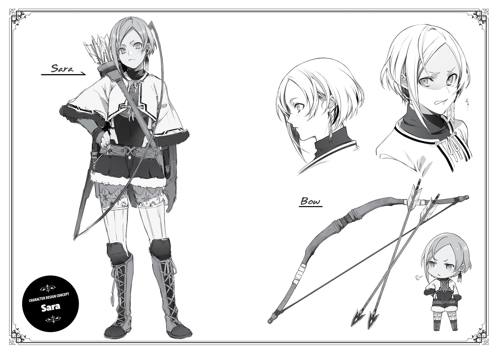
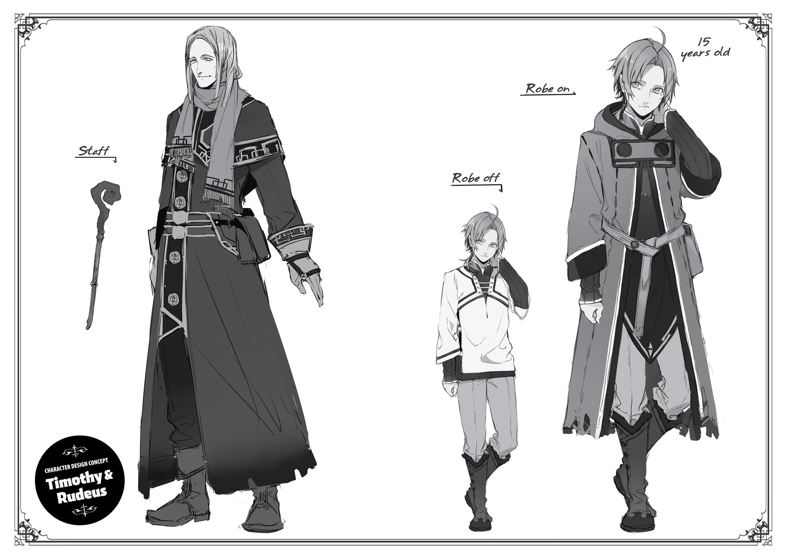
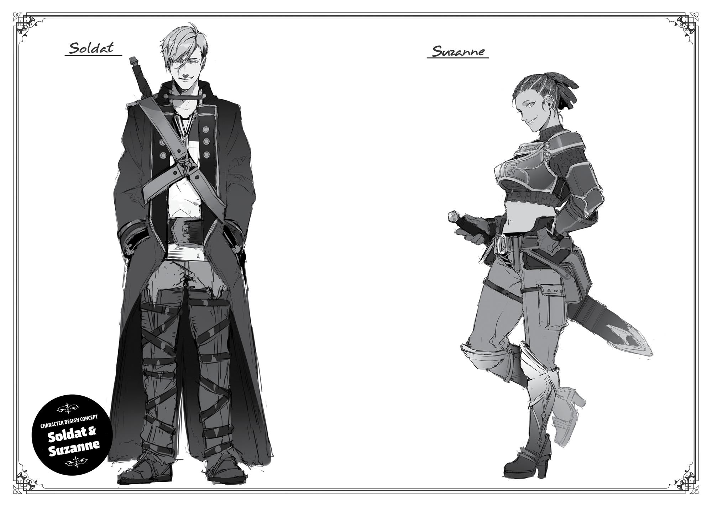
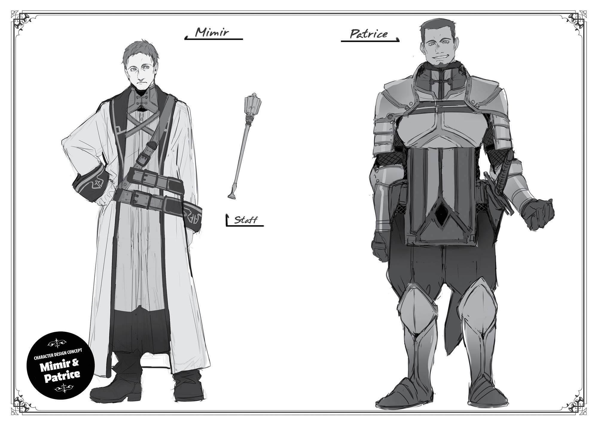

+++
title = "Extra Chapter: The Ruler of the Ranoa University of Magic"
date = 2026-07-20
weight = 8
[extra]
volume = 7
chapter = 9
+++

Among the Three Magic Nations, the Ranoa Kingdom in
particular was famous for its magical education, having produced a
number of exceptional magicians. A hundred years prior, as the
leader of the alliance between the Three Nations, Ranoa had
established the Magic City of Sharia.
Three prestigious organizations, one from each country, were
based in this city: the Duchy of Neris’ Magical Implements Workshop,
the Duchy of Basherant’s Magician’s Guild, and finally Ranoa’s
University of Magic.
The university was the most famous of the three. There were
tales told about its attendees, who included the court magicians of
the Three Nations, the faculty of magical academies in Asura
Kingdom, and some adventurers who had left their mark on the
world. There were even songs about adventurers like Roxy Migurdia,
an alumnus of the university. Currently, its student body numbered
over ten thousand, and this distinguished mammoth of a school
offered a varied curriculum that went beyond just magic.
A certain student had enrolled herself at this prestigious
institution—one named Ariel Anemoi Asura.
“Ah, President Ariel! Good morning!”
“Good morning!”

It was a bright spring morning. Voices echoed along the treelined paths that extended from the student dorms to the main
building.
“Miss Sarria, Miss Misha, good day to you.” The woman who
responded to the greetings was a charismatic beauty with silky
blonde hair, glowing bright enough to turn every head as she walked.
“Oh?” She suddenly turned with a smile and an outstretched hand.
“Miss Sarria, your collar needs straightening.”
“Huh? Oh…”
“There, it’s fixed. You’re beautiful, so you simply must pay
attention to your appearance.”
“O-oh, yes!” The younger girl’s cheeks reddened.
Ariel nodded in satisfaction. “Have a wonderful day, ladies,” she
said, and continued down the walkway.
The girl left in her wake spent a few moments dumbfounded
before turning to her friend, bouncing with excitement. “President
Ariel touched me!! She said I was beautiful! Beautiful!!”
“That’s so amazing! Seriously!”
Ariel listened to the pleasant sound of their boisterous squeals
as she continued on her way to the school. People erupted into
murmurs as they spotted her.
“Look, it’s President Ariel! She always looks so beautiful.”
“Maybe I should try talking to her…”
“Idiot, like she’d ever give you the time of day.”
Men and women alike exclaimed their admiration when they
saw her. Even though they all wore the same uniform, Ariel still
shone like a light in the dark.
“Look, it’s Master Luke and Master Fitz!”
“They’re so dreamy…”

“Looking at the three of them together, it’s almost like a
painting come to life!”
It wasn’t just Ariel who drew attention—the two protectors
shadowing her were targets of envy, as well. One was the handsome
Luke Greyrat, with his vibrant brown hair slicked back. The other was
the young boy Fitz, with his short-cropped white hair and thick
sunglasses. Both of them—the dreamy knight and pretty boy—
served the most beautiful woman in the school. The sight of them
was enough to excite the other students’ imaginations, fostering the
idea that these three individuals existed on some higher dimension
than the rest.
“Hey, have you heard? Lady Ariel is looking for exceptional
people.”
“What for?”
“To be her trusted retainers when she returns to her kingdom.
At least, that’s what I heard.”
“Seriously? Amazing. Can I volunteer myself?”
“With your grades? As if.”
“Yeah, better keeping working at it!”
Those three envied individuals were the center of the school’s
attention. Bathed in the warm spring sunlight, they looked even
more gorgeous than they had in winter. Everyone believed, beyond a
shadow of a doubt, that they had a dazzling future ahead of them.
Why were they so beloved by the students? Was it because of
their looks? Their impressive skills? Those were contributing factors,
of course, but not the real reason.
To understand how Ariel established herself in her current
position, we will have to go back several years.

Several years prior, Ariel Anemoi Asura had lost the political
battle in the Asura Kingdom and fled the country. Some theorized
she’d died in the process, but while it was true that she was pursued
by assassins, she somehow managed to escape to the Ranoa
Kingdom. Ariel received protection from the kingdom and then, as
she originally intended, successfully enrolled in the University of
Magic.
Of course, she hadn’t given up on regaining power in the Asura
Kingdom. Ariel knew she must return as soon as possible, for the
sake of Pilemon Notos Greyrat, who still supported her from within
the kingdom. But it was clear that history would just repeat itself if
she returned as she was now, and so the princess concocted the idea
of scouting for exceptional talent at Ranoa’s university in order to
send them back to Asura ahead of her. To accomplish this objective,
Ariel decided to strengthen her influence at the school.
The student council at the university possessed neither
complete autonomy nor strong authority, but it was seen as the
pinnacle of a school attended by ten thousand students, and highly
influential among those students. Ariel, who was looking to recruit
talent before it even began to bloom, found the organization
exceptionally useful. Intent on her objective and already supremely
talented, Ariel distinguished herself quickly, and her request to join
the student council was approved despite the fact that she was a
mere first-year.
After a few months had passed and Ariel was certain she had a
solid foundation to work from, she gathered all of her attendants in
her room for a strategy meeting. “We were able to enter the student
council, but we mustn’t grow complacent. This is merely the first
step.”
“Understood.”

Nearly twenty of her attendants had been killed on the road by
assassins, so their number had dwindled. Now she had just four:
Luke Notos Greyrat, Ellemoi Bluewolf, Cleane Elrond, and Fitz.
“All we have to do is utilize the student council’s reputation to
recruit good people,” said Fitz.
“That won’t be enough.” Ariel shook her head. “Before this is
over, I’d like to have the support of both the leaders of this country
and the Magician’s Guild.” Ranoa Kingdom’s leaders and the
Magician’s Guild were both hugely influential in Asura, whose own
teachings in magic came from Ranoa itself. “Granted, we’ll have to
impress them if we want their aid in this political power struggle.”
“Impress them… Like with money?”
“No, with power.” Ariel giggled as Fitz tilted his head. “I am
trying to become the ruler of the Asura Kingdom. Just being a
member of the student council won’t convince them to support my
cause. I must become someone who moves the council. In other
words, I have to become the president.”
She continued, “The vice president graduates next year, and the
president the year after that. Thus, I plan to aim first for the position
of vice president, and then for that of president.”
“Yes, I think that’s a good idea. Those of like mind and
exceptional ability will surely flock to someone of your caliber. And it
is those very people that we seek,” Luke said approvingly. The other
three nodded.
It had been six months since they’d first enrolled, and they still
had yet to recruit any allies. The only things Ariel had at her disposal
were her natural-born charisma, the fact that she’d been accepted
into the student council as a first-year, and the adoration of the
other students. There were exceptional individuals who had caught
her eye, but she had yet to reach a level where she could win their
favor, unveil the full truth of her situation, and convince them to

fight alongside her in the Asura Kingdom. The way she would prefer
it—indeed, the way things should really be—was for them to
approach her first.
“If the natural order of things is for you to become president,
then you should ideally win the vote by an overwhelming majority,”
Ellemoi said, her hand pressed to her chin.
The sitting president was in charge of selecting and appointing
appropriate candidates to the council. When a president retired, all
remaining members became candidates for the position, and the
president would be determined by a school-wide vote. Such was the
rule established by the first principal of the school, a tradition that
had continued ever since.
Even so, Ariel was a mere first-year student. Next year, the
current vice president would likely ascend to the presidency. Once
they graduated and an election was conducted, the other current
members—all in their sixth and seventh years by then, with
numerous accomplishments of their own—would doubtless stand in
her way. Even if she could beat them, it would likely be by a narrow
margin. Granted, becoming student council president as a third-year
student would still be an impressive feat. But it wouldn’t be
exceptional unless she also dominated the vote in a landslide victory.
Such was the path forward that Ariel envisioned. You might
even call it an essential prerequisite for her future. If she couldn’t
accomplish even this much, then returning to the Asura Kingdom
would remain nothing more than a dream within a dream.
In fact, she might need to aim even higher.
“It may be necessary for you to take the presidency next year,”
murmured Fitz. The white-haired boy had a grim look on his face and
his arms were folded over his chest.
“Oh my, you say some terrifying things, Fitz. Are you proposing
we outmaneuver the current vice president?”

Although Ariel was a first-year student, there was no doubt that
she had four exceptional subordinates; charisma that had earned her
great adoration among the first-years; and practical skills, to boot.
And so, she had a cut a deal with the current vice president: She
would endorse them for the position of president in the next
election, and in return, they would appoint her to their former
position. This meant giving up her chance at the presidency this year,
but if she were diligent in planting seeds during her second year,
then she could be fairly confident of reaping the results in her third.
“That plan is good, certainly, but shouldn’t we attempt
something even more impressive?”
Fitz was absolutely right. If you unraveled the threads of the
university’s long history, you wouldn’t find a single soul who had
risen to the rank of president in their second year. The only
exception was the first president of the student council, but that
didn’t count, since there were only first-years in attendance at the
time. Plus, if Ariel were to defeat the person who was a shoo-in for
the presidency in a landslide, they would be talking about it in the
city of Sharia. Word of her accomplishment might even reach the
leaders of the Three Magic Nations.
One might think of the university as a simple school, but there
were many alumni who went on to become leaders of the Three
Nations and the Magicians’ Guild. If something extraordinary
happened in the university for the first time since it was founded,
there was good chance it would come to their attention.
“True. But we won’t be able to defeat the vice president without
a plan.”
“Well, about that… I actually do have a really good plan.”
“Let’s hear it.” Though caught off guard by Fitz’s proposal, Ariel
shifted in her seat and listened closely.

“Um…well, Princess, you know how you’ve been the target of
some harassment lately?”
“Indeed.”
It had started just after she joined the student council. There
were several incidents in succession: people spitting in front of her as
she walked, people bumping shoulders with her, people purposefully
hitting her with a water ball during magic practice. They were passed
off as coincidences, but Ariel knew that they were intentional. After
all, they had gradually escalated in severity. The worst was when
some of her underwear, which she had hung out to dry at night, was
stolen and dumped in front of the boys’ dormitory. That had
indisputably been a step too far, and she’d asked Fitz and Ellemoi to
look into the matter. As a result of which…
“I discovered the masterminds,” Fitz announced. “Linia and
Pursena.”
“So it was those two after all.”
They were the descendants of the leaders of the Doldia Tribe,
which reigned sovereign among the beastfolk. The two girls had
travelled halfway across the world from the Great Forest. As
members of the Doldia Tribe, they’d had a pampered upbringing, and
let their magical talent go to their heads. The lenient environment at
the school only worsened their attitudes, and the two became
complete delinquents, feared by the entirety of the student body.
With their entourage of twenty-plus fierce-looking beastfolk in tow,
people cleared the way wherever they went. If you so much as made
eye contact, their whole gang would pile on you.
The school administrators were troubled by their inappropriate
conduct, but the girls were essentially princesses of the Doldia Tribe.
Reprimanding them ran the risk of making enemies of all beastfolk
attending the university—and the beastfolk were quite numerous
here, if still a minority compared to the humans. And so the school

had yet to step in, and many a student cried themselves to sleep at
night.
“What does that have to do with your plan?”
“We crush them.” Fitz closed his hand into a fist. “The students
are terrified of those bullies. If we put a stop to them, everyone will
be on your side, Princess.”
A fire burned in Fitz’s eyes. What they had done was
unforgivable. Fitz respected and adored Ariel, and they had taken her
underwear and dropped in front of the boys’ dorm, of all places, with
the nerve to add a note saying: This underwear belongs to the Asuran
Princess. Since then, many of the male beastfolk had watched Ariel
with hungry looks. Presumably the princess was unfazed by this, but
Fitz couldn’t stand it.
“If we start trouble with them in school, it will be our reputation
that plummets,” Ariel said.
“If we can provoke them into attacking us first, it will be
legitimate self-defense. The school would back us up in such a
scenario. Plus, if that’s what we’re up against, I’m pretty sure I can
handle it by myself.”
Ariel briefly considered his words, then glanced at the faces of
those present. Whenever she felt unsure, she sought the opinions of
her other attendants.
“I think it’s a good idea. What they did was unforgivable. If it
comes down to a fight, I’ll jump in.”
“I can’t offer much, but I will help where I can.”
“Agreed.”
Their words were reassuring, and Ariel offered them an
encouraging smile in return. “Very well, then. While I am sure what
we’re about to attempt is risky, since you all agree, let’s give it a go.”

And thus, the mission to crown Ariel as the student council
president was underway.
The plan was put into motion out about a week later.
It was noon, and all the students were moving to the school
cafeteria. Linia had her hands shoved in her pockets and Pursena had
something that resembled a cigarette protruding from her mouth.
Their uniforms looked sloppy, their postures terrible. They looked
the part of delinquent so well that if Rudeus had seen them, he
would have hugged the wall and kept his head down to avoid
meeting their eyes. Such bullies existed even in this world.
The beast girls strutted at the head of their pack as if they
owned the place. In comparison, Ariel’s group was only three people
strong: Ariel, Luke and Fitz. They made it look like they’d
encountered Linia and Pursena in front of the cafeteria by chance.
At first, Linia and Ariel exchanged looks that demanded that the
other person make way, but it was Ariel who finally feigned
indifference and stepped aside. The beastfolk let forth a snicker as
they watched.
“How pathetic.”
“Some ‘princess.’ Hmph.”
“Oh yeah, wasn’t that her underwear lying in front of the dorm
recently?”
“She’s trying to hook men that way, right? Humans mate for
their entire lives, after all.”
They cackled.
“Enough, mew,” said Linia.

“Yeah, you’re making me feel sorry for her,” agreed Pursena.
The two looked smug as they delivered those reprimands and
headed into the cafeteria. It felt good to ridicule the privileged. It felt
even better to put a stop to it, thereby gaining the moral high
ground. There was nothing Ariel could do about it, either. After all,
Linia and Pursena had twenty beastfolk in tow. Most of them were
half human, and they’d never been in a proper fight before. But
there was strength in numbers, which they used to mock the widely
popular princess of a large country.
“Parading around with twenty men in tow, like some kind of
herd. It seems the Doldia are really no better than animals,” Ariel
murmured. Her voice was barely above a whisper. Her lips had barely
even moved, so none of the other students could hear her.
“Hey, what did you just say?”
However, beastfolk had far better hearing than the humans and
could pick up even the quietest of sounds. Thus, Linia and Pursena
had caught that faint utterance. The rest of their band didn’t have
quite as advanced hearing, but several of them heard it, too.
“I don’t believe I said anything?” Ariel replied innocently.
“No, I’m sure I heard it, mew. You were trash-talking us, mew.
Weren’t they, Pursena?”
“Seriously. Fuck them.”
Linia’s fur was puffed up and Pursena had spit out whatever
she’d had in her mouth. A chicken bone, as it turned out. Pursena
was so gluttonous that she constantly snacked between meals. Once
they were certain that Ariel was picking a fight, they marched right
up to her and stared her down.
“Well? Go on, try saying that to us again, mew. This time, do it
to our faces.”

“Or you can prostrate yourself,” offered Pursena. “Get on your
back and show us your belly.”
“I already told you, I didn’t say anything.” Ariel spoke with
confidence, even as the two threatened her. To an outside observer,
it looked like Linia and Pursena were antagonizing Ariel without
cause.
Linia narrowed her eyes. “Don’t tell me you’re a chicken, mew?”
“Chicken? I eat chicken,” growled Pursena.
“What on earth is this about…?” Ariel, on the other hand,
seemed entirely unaffected. She looked every bit as bold as a king.
And then, barely audible, she said: “Once this year’s mating
season is over, you’ll be having the children of men whose names
you don’t even know. Just like mutts on the street.”
No one could see Ariel’s lips move. As Asuran nobility, she had
been trained to speak without detection. Therefore, her whisper was
only loud enough for Linia and Pursena, who were in close range, to
pick up.
“You bitch! You have some nerve. Fine, we’ll fight you, mew!”
“We’ll beat the crap outta you, strip you naked, and dump water
all over you!”
From the sidelines, it looked like Linia and Pursena had suddenly
lost their tempers because they didn’t like Ariel’s attitude. In fact, no
one doubted that was what it was. The beast girls often had exactly
this reaction when they thought someone was being too cocky with
them.
And as soon as they jumped into action, their twenty lackeys
followed.
“You’ll be seeing stars soon!”
“Say your prayers!”
“We’ll pound you into the ground!”

The swarm of them flew forward, arms reaching for Ariel. They
wouldn’t reach her.
“Gwah!”
“Gah!”
Before they realized what was happening, they’d been sent
flying back through the air. In a split second, they were scattered and
tumbling across the floor. Linia and Pursena instantly leaped back to
their feet, scanning their surroundings.
“W-what was that, mew?!”
“It’s Fitz! That little minion of Ariel’s did something…!”
Fitz—the white-haired boy that always stood behind Ariel with a
look of indifference—was in front of the princess. As soon as the
beastfolk moved, he’d stepped in front of her and used his silent
casting to create a shockwave that blasted them back.
The only one who’d moved forward was Fitz. Ariel maintained
her prim and proper posture, and although Luke’s hand rested on
the hilt of his blade, he didn’t move. Fitz stood completely alone. And
yet, he looked confident that he could handle them.
Fitz said nothing; he rarely ever spoke. Only a few students had
ever heard his voice.
Now that he stood in their way, Linia and Pursena made him
their target.
“Hyaah!”
“Grrrr!”
The twenty beastfolk fell on Fitz like a wave.
Fitz remained silent. His body didn’t even move—just his hands.
Each time they did, a fiery explosion happened, or an icy object shot
from the ground. These attacks relentlessly pummeled the beastfolk,
and in seconds, all twenty of them were sent tumbling through the
air. They squealed like puppies as they were blasted with Fitz’s

magic, either knocked unconscious or scrambling to retreat. Twenty
opponents were a lot, but they were all unaccustomed to fighting,
scarcely attended class, and primary relied on violence in numbers to
maintain their threatening appearance.
“I’m gonna tear you to pieces, mew!”
“Fuck yeah, we will!”
Only Linia and Pursena were different. Their fighting spirits
weren’t dampened, not even as they witnessed Fitz’s magic for
themselves. In fact, they dodged each spell with great agility. Linia
then charged forward while Pursena put her hand to her lips.
“Awoooo!”
They had unique vocal cords that could make sounds infused
with magic to instantly paralyze their opponent. This type of magic
was inherent to the beastfolk.
A tendril of blood trickled from Fitz’s nose, and his upper body
slumped forward. Once Linia was sure he’d been hit, she slashed her
claws toward his face. “Hyah!”
One of them would use vocal magic to seal the enemy’s
movement while the other went in for the kill. That was Linia and
Pursena’s strategy for victory.
However, in the next moment, Fitz made a baffling move. He
lifted his hands and slapped his ears. Blood burst forth.
At the same time, Linia charged in. “I got you, mew!” Her claws
slashed forward, but just as she was certain she’d hit her target, Fitz
sank downwards. Linia caught a few strands of his hair, but now he
had slipped right in past her defenses.
“Urgh…!”
His fist shot into the pit of her stomach, emitting a shockwave
that sent her flying through the air like shrapnel from an explosion.
“Wh-why?!” gasped Pursena.

Fitz didn’t miss a beat. He headed right for Pursena, who was
visibly shaken by the fact that her vocal magic hadn’t hit its mark.
She frantically tried to brace herself, but it was already too late.
“Ha!” He sent her airborne with an invisible wave from his
outstretched fist. She slammed against the wall of the cafeteria and
lost consciousness.
“Ack…cough…”
Fitz came and stood in front of Linia, who was gasping for air.
The boy had carried out his wrath in silence this entire time. Linia
was in shock as he towered over her. She glanced at her
surroundings, but not a single person from their group remained
standing. Even her reliable partner was sprawled helplessly on the
ground with her legs spread wide open, completely unconscious.
Linia realized that their group had been decimated and lost the
will to fight. “Y-you win, mew.”
Even as Linia conceded defeat, Fitz remained eerily quiet. His
eyes were hidden behind sunglasses, but the anger was still there, a
true killing intent that couldn’t be satisfied by this joke of a fight. Fitz
knew exactly what they had done—that they’d thrown water on
Ariel, stolen her underwear and discarded it.
Linia might have her pride, but she didn’t value it more than her
life. “W-we’re sorry, mew. We’ll apologize for the underwear
incident too. I’ll even do this, mew.” Linia had no choice but to take a
submissive posture, exposing her stomach in repentance. It was the
most humiliating move for beastfolk.
Fitz smashed a ball of water over both Linia, who was
prostrating herself, and Pursena, who was lying unconscious a short
distance away. There was little attack power behind it, but it was the
equivalent of having a bucket upended on them. Both beastgirls
were drenched, looking quite pitiful with their fur flattened against
their skin.

“If you’ve truly learned your lesson, never raise your hand
against Princess Ariel again.”
Fitz left them with those words. He rarely ever said anything. It
was the first time that Linia, Pursena, and the rest of the students in
the cafeteria—indeed, any of them, save for Ariel and Luke—had
heard him speak. His voice was high, almost feminine.
“Y-yes, understood.” Linia nodded, her face bright red with
shame.
“Fitz, well done. Let’s be on our way.” Ariel offered him a quick
smile when he returned, and their group departed as if nothing had
ever happened. Only Linia and Pursena were left in their wake,
looking like a couple of drowned rats. They soon retreated, unable to
withstand the attention that was now focused on them.
All the students who had witnessed this spontaneously broke
into applause. That was the moment when the delinquents who
acted like they ruled the school were defeated.
After that, courtesy of Ellemoi and Cleane’s work, rumor spread
that it was, in fact, Linia and Pursena who had sent their minions to
beat up Ariel. The majority of the beastfolk involved were expelled in
the incident’s aftermath.
And that was how Ariel secured her current position. By driving
the delinquents out of the school and bringing peace back to the
campus, she earned the gratitude of the students, who then voted
for her in the following election. She became the student council
president in her second year, and many regarded her with strong
admiration.

That situation, of course, didn’t sit well with the vice president.
They spent their remaining year making snide comments, but they
hadn’t the courage to face Fitz—the very man who had taken on the
indomitable Linia and Pursena all by himself—and graduated quietly.
As for the humiliated party of two…
“Urgh.”
“Fuck.”
Somehow, they’d managed to avoid expulsion. Their behavior
wasn’t entirely improved, and they were still hostile toward Ariel,
but they were attending classes more seriously. They would hiss and
bark like sore losers whenever they laid eyes on her, even as they
tucked their tails between their legs and made way for her to pass.
“Hmph! We won’t forget what you did to us, mew!”
“Pft! Better not go out at night!”
Ariel said nothing. She just giggled.
This only increased the admiration directed at Ariel and her two
bodyguards. There was no one left at the school who could stand up
to the princess.
That same princess was now a third-year student. Just as she’d
planned, becoming the student council president in her second year
allowed her to make contact with both the Magicians’ Guild and the
rulers of Ranoa Kingdom. Those of like mind flocked to the student
council, and Ariel picked the most exceptional and trustworthy to go
to the Asura Kingdom and proceed with her plans. What she
considered her vanguard would be leaving for the kingdom the
following year.

Everything had gone surprisingly well in this past year since she
became the president. Today they were conducting another one of
their strategy meetings, though they had transitioned from her
personal suite to the student council room. “Now then, Cleane, are
there any promising candidates among the first-years this year?” she
asked.
“There are. Zanoba Shirone and Cliff Grimor, in particular. The
former is a Blessed Child, while the latter was able to perform
Advanced-tier magic even before he enrolled.”
“Very well. Let’s look for opportunities to gradually engage
them. Are there any others who stand out?”
“Among the first-years? No, I don’t believe so.” Cleane shook
her head. “However, there may be some who will show promise in
the future.”
“I still require many more pieces for my chess board. Perhaps
we should look at reaching out to those outside of the school.”
As Ariel agonized over what to do, Ellemoi looked up. “Princess,
I suspected you would say as much. I have already located some
particularly impressive individuals beyond the walls of the
university.”
“I expected no less. Let me see what information you have on
them.”
“Yes, Princess.” Ellemoi pulled out a sheaf of papers from one of
the cabinets in the student council room and handed them over. “I
would propose selecting some of these, inviting them to the school,
and then assessing their character before approaching them to join
us. What do you think?”
“That sounds good. Please go ahead and begin the selection
process. As for inviting them… We can ask Vice Principal Jenius for
aid with that, I’m sure.”
“Yes, Princess.”

Fitz and Luke began to scan the list at Ariel’s bidding. There
were several different individuals on the list: from those already
living in the Magic City of Sharia; to active adventurers across the
Three Nations; and even the protector of the Sword Sanctum, the
Sword God Gal Farion himself.
It was as Fitz studied that list that he suddenly gasped. His hand
stopped when he spotted a name he recognized. His eyes went wide
and his lips pursed shut. His trembling hand tightened against the
paper, creasing it.
“Fitz, did someone on there catch your eye?”
The boy gave a sharp nod. His expression was a mix of surprise,
bewilderment, and delight.
“Princess Ariel… I know this person.”
The paper in his hand had the name Rudeus Greyrat written on
it.

Resides in Gifu Prefecture. Loves fighting games and cream
puffs. Inspired by other published works on the website Let’s Become
Novelists, they created the web novel Mushoku Tensei. They
instantly gained the support of readers, and became number one on
the site’s combined popularity rankings within the first year of
publishing. “Running can be an acceptable solution when life is truly
agonizing,” stated the author very seriously.

Thank you for reading!
Get the latest news about your favorite Seven Seas books and brandnew licenses delivered to your inbox every week:
Sign up for our newsletter!
Or visit us online:
gomanga.com/newsletter
