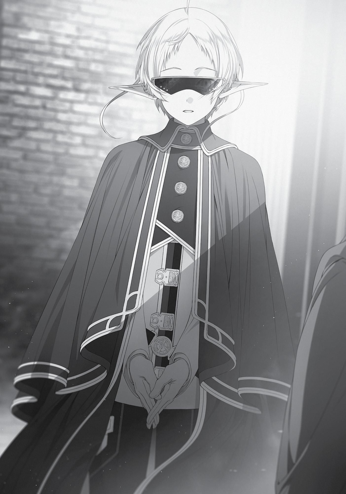

+++
title = "Chapter 2: Entrance Exam"
date = 2026-07-20
weight = 2
[extra]
volume = 8
chapter = 3
+++

Chapter 2:
Entrance Exam

R

ANOA KINGDOM

was the largest country in the Central

Continent’s northern region, wielding the same kind of influence and
power as the Shirone Kingdom in the south. However, it also had an
alliance with Basherant and Neris, as well as intimate ties to the
Magicians’ Guild. The three countries of Ranoa, Basherant, and Neris
were called the Three Magic Nations.
Why “magic,” you ask? Was it because the Magicians’ Guild’s
HQ was located there? That was part of it, but the real reason was
that these three countries poured a tremendous amount of
resources into magical research, gathering exceptional people from
around the world.
Created for that purpose, and acting as leader of the alliance,
was a grand city built on the edge of Ranoa Kingdom: the Magic City
of Sharia. The Ranoa University of Magic, the Magicians’ Guild HQ,
and Neris Magical Implements Workshop were all shoved into that
one flourishing city that was basically the center of the Magic
Nations.
If you viewed the city from above, you’d find the Magicians’
Guild at its center, built with the latest style of magic-resistant brick.
In the east, the Student District was centered around the University
of Magic, while in the west, the Magical Implements Workshop was
the heart of the Workshop District. Nestled in the middle of the
Commerce District was the Trader’s Guild, and in the south was the
Lodging District, which welcomed those entering the city, including
adventurers. Looking at the map, I realized that its layout was based
off Millishion’s. Not that there was anything useful about that
discovery.

Page | 48

Elinalise and I booked an inn in the Lodging District. This time,
we picked an A-ranked one equipped with a fireplace. Elinalise would
come diving into my bed whenever it got cold, and the temptation of
touching her defenseless form just made me feel depressed. Ergo, a
fireplace was a necessary amenity. Elinalise certainly wasn’t
complaining.
As I discovered on our journey here, she had a reason for
needing to sleep with men. While we were on the road, we took a
slight wrong turn and didn’t reach the next city for over a week.
During that time, her health deteriorated rapidly. Tremors ran
through her body without explanation, her face turned pale, but
there was something dangerous in her eyes as she looked at me.
There was nothing I could do for her in my current condition, so
I frantically cast detoxification magic on her and fondled her breasts.
When I asked for more details, she revealed to me that she was
afflicted by a curse: if she didn’t periodically sleep with men, she
would die. Hearing that, I felt some sympathy for her plight, but it
seemed Elinalise didn’t feel bitter about it at all. “I love sex, so even if
I wasn’t cursed, I’d be doing much the same,” she’d said. Unlike me,
she was managing her unique illness pretty well.
“Well then, I’m going to go see this Mister Jenius person now.
What will you do, Miss Elinalise?”
“I’ll come too.”
“…Why?” I figured she’d go somewhere like the Adventurers’
Guild to sniff out a man.
“Since we came all the way here, I’m going to try enrolling in
this Magic University as well.”
“Why? Are you interested in magic?”
“Nope, but I’m interested in young men.”
“Ah, so that’s it.”

Page | 49

In other words, her usual motivation. Still, though they called it
a university, there were a lot of children around. I had no idea what
Ranoa’s laws were like—her activities wouldn’t be considered
abducting a minor, right? Ah, well. I wouldn’t be the one getting
arrested, and it wasn’t like I could do anything to stop her.
“You’ll probably have to pay full tuition and fees.”
“Not a problem. This may come as a surprise to you, but I have
quite a bit of money, you know,” she said, giving her coin purse a
slap. It contained not just currency from this region but more than
five Asura Gold Coins as well. I also knew she had a number of magic
crystals in her backpack—beautiful crystals, orb-shaped, large
enough to fit in the palm of my hand. Each would net about ten
Asura Gold coins if sold.
I wondered where she’d gotten her hands on such things, but
she was an adventurer who usually went delving in labyrinths.
Maybe she’d had them for a while, carrying them around instead of
money. Magic crystals could be sold for cash without worrying about
currency exchange rates.
Enrolment would cost her, but she wasn’t short on cash. Her
motives might be impure, but who was I to judge?
“Alright. Then let’s get going.”
The two of us headed toward the University of Magic.
The Ranoa University of Magic occupied a vast tract of land, the
campus filled with massive brick buildings, including one in the
center that looked almost like a castle. To the untrained eye, it might
look like a fortress. It reminded me of Tsukuba University in Ibaraki
Prefecture, though I’d only ever seen pictures.
Page | 50

I passed my letter to the pair standing guard at the front gate.
“Excuse me, this is the letter I received.”
The guard took a look at it, grunted, and nodded. “Do you know
the Teachers’ Building?”
“I don’t.”
“Go straight from here, and turn right at the statue of the first
principal. It’s the building with the blue roof. Hand this to the
receptionist there and they’ll let the vice principal know you’re
here.”
“Thank you.”
Before Elinalise could give the man a suggestive look, I dragged
her onward by the ear. Her long ears provided lots of purchase.
It was a straight path all the way to the statue of the first
principal. The road was lined with bare-branched trees. I wondered if
cherry blossoms would be blooming once spring came—actually, I
had no idea if this world even had cherry blossoms. Rising from
behind the trees was a brick wall about three meters high. I almost
expected archers to spring out from behind it, saying, “You fell for
our trap!”
“These are all made from magic-resistant bricks.”
“Hm.” At Elinalise’s utterance, I turned my attention to the wall.
Magic-resistant bricks, as their name implied, were bricks that
repelled mana. Apparently, they could even withstand a large-scale
magical attack.
From what I heard, the Magicians’ Guild had a monopoly on the
sale and production of magic-resistant bricks. They were so
expensive that the only place they were used in the Asura Kingdom
was the capital. I hadn’t seen any in the Holy Country of Millis or the
King Dragon Realm, but you saw them a lot in the Magic Nations.
They were even used in the walls of the Adventurers’ Guilds here.

Page | 51

The process of their creation was a well-guarded secret, but maybe
the raw materials themselves weren’t that costly.
We came into a somewhat large plaza, in the center of which
was a statue of a girl wearing a robe. There was a plate attached to it
that read First Principal, Fifty Sixth Generational Leader of the
Magicians’ Guild, Frau Claudia. The wall of bricks ended here, and
before us loomed a mansion large enough to be a fortress,
surrounded by at least six other buildings. I caught a glimpse of
roaring flames on the grounds to the side of the building.
Considering no one was making a fuss, I assumed it was part of a
class.
To the left were several large buildings with red roofs, plenty of
windows, and verandas. From the laundry drying on said verandas, I
assumed these were the student dorms. To the right was a building
with a blue roof, and to my left, another a building with a red roof.
Since I wasn’t a part of the Sylvanian Family, I was going to head to
the right.
“I’m getting a bit excited,” Elinalise suddenly muttered.
“You are?”
“I mean look at all these huge buildings!”
What was this tart suddenly being all cutesy for? I supposed
adventurers didn’t encounter such large buildings often. At most,
they had the Adventurers’ Guild. “What’s the biggest building you’ve
been inside before?”
“Millishion’s Adventurers’ Guild HQ,” she said.
“Ahh, come to think of it, that place was pretty big.” I’d been to
the Millishion Adventurer’s Guild before, too. Granted, I’d seen even
larger buildings in my previous life so it didn’t really impress me.
“You’re such a party pooper,” she said. “When I saw the
Millishion Adventurers’ Guild for the first time, I was so excited that I

Page | 52

almost threw my arms around Paul without even thinking… tch.
Those are memories I’d rather forget.”
As Elinalise mumbled to herself, her expression contorted in
disgust. Exactly what had Paul done to get this woman—who’d
boasted about being fine with any man—hate him that much? Come
to think of it, how long ago had the two of them parted ways? I was
fifteen right now, so it had to be more than fifteen years ago…
“This is a bit out of the blue, but how old are you, Miss
Elinalise?”
“My, my, that’s not a question you should be asking a lady,” she
chided. “I’m fifty, by the way.”
“You liar.”
As we talked, we finally reached the building with the blue roof.
I handed my letter to the receptionist—an old woman— and we
were led to an inexpensively furnished room with a sofa and a table.
“Please wait here for a bit,” she said, and vanished.
“Phew,” I exhaled.
“If you sigh like that, you’ll let all your good fortune slip away.”
I sat on the sofa and Elinalise nuzzled against me. She always did
this when she sat next to a man, but it didn’t really bother me. It
made her happy to fondle a man’s body, and it made me happy to
have a beautiful older woman pressed up against me. There was no
reason for either of us to object—except for my little man, who
refused to respond even in this situation.
Preoccupied with those thoughts, I surveyed our surroundings.
If I had to rank this reception area, I’d give it a C. The room was
sparse and the couch was hard. Maybe that made it a suitable place
to welcome adventurers.
“Sorry to keep you waiting. I’m Vice Principal Jenius.”

Page | 53

The vice principal appeared after about twenty minutes,
responding quickly, despite our lack of an appointment. He was old
and fussy-looking, with a receding hairline. As he was wearing a deep
blue-colored robe, I assumed he was a water magic user.
“A pleasure to make your acquaintance, I’m Rudeus Greyrat.” I
promptly stood, offering a nobleman’s greeting and bowing before
him. When I glanced at Elinalise, I noticed her doing something
similar as she lowered her head.
“And you are?”
“My name is Elinalise Dragonroad. I’m Rudeus’s party member.”
“Uh-huh…”
He gave her a look that said, Who the heck are you and what are
you doing here?, but Elinalise seemed entirely unperturbed. Jenius
shrugged it off and motioned for us to take our seats. “I never
imagined you would make it to us this quickly,” he said.
“I came on someone’s recommendation.”
“Someone’s? Ahh, you must mean Roxy?”
That’s Miss Roxy to you, punk! I screamed inwardly, although I
kept quiet.
“That’s not who I meant, although she recommended this
school to me as well.”
“Aha… well then, may we go ahead and enroll you at the
university?”
“Yeah, sure.” Thrown off by the way Jenius suddenly leaned
forward in excitement, I hesitantly nodded.
“Ah, where are my manners? Most magicians who work solo
tend to be very prideful, particularly ones as young as yourself.”
“I see.”

Page | 54

“I heard that you downed a Red Wyrm straggler the other day. I
never expected someone like you would actually agree to enroll at
our university.”
While it differed slightly by country or race, for the most part,
people in this world were considered adults when they turned
fifteen. Of those who became adventurers before they reached the
age of adulthood, most never rose very far in the ranks. The few who
did, however, tended to develop oversized egos. I’d met two such
people myself. One was a fourteen-year-old B-ranked boy (what was
his name again?) who was incredibly self-assertive, and had
considered me a rival, for some reason. We were the same age back
then, and he probably didn’t like the fact that I was A-ranked.
Around the time I started thinking, huh, haven’t seen him around for
a while, it turned out he’d failed an extermination quest and died.
The other was a fifteen-year-old B-ranked girl. Her name was
Sara. I didn’t want to think too hard about her, but she had been real
proud, and we clashed a lot at first.
Jenius probably thought I was like them—someone who had a
big head. Unfortunately, the one big head I did have wasn’t feeling
very energetic lately.
“There’s a lot that I’d still like to learn. The university seems like
a good place for me to do that. And, of course, I’ll be sure to
advocate for the school after I graduate,” I said, recalling my
conversation with Conrad.
Jenius laughed bitterly. “I appreciate that you cut straight to the
point.”
“That said, I don’t know what a special student is, exactly. I was
hoping you could explain it for me.”
Jenius nodded, then stopped, as if he’d suddenly remembered
something, and gave me a strained smile. “Before that, would you be
willing to take a small test first?”
Page | 55

“A test?” Like an entrance exam? Crap. I hadn’t prepared
anything at all. It’d been ten years since Roxy first taught me about
magic, too. Uhh, if memory served me correctly, then combination
magic was… ah, crap. If I’d known this was going to happen, I
would’ve prepared ahead of time.
“Yes, a test to determine if the rumors we’ve heard of your
abilities are correct. A practical test.”
So, not a written test. That was a relief to hear.
I was hoping they didn’t want me to defeat another straggler,
because frankly, I wasn’t up to doing that. I was an absolute coward,
after all! When I said as much to Jenius, he just gave a strained laugh
and said, “Of course not.” His laugh often sounded like that, He must
have been through a lot.
Jenius guided me outside, where we headed toward a line of
buildings. According to him, our destination was the practice
building’s training hall, where magical experiments and tests were
conducted.
“You guys sure do have a lot of buildings here. Do you really
have that many students?”
Jenius nodded. “Ranoa University differs from your typical magic
school because it offers ordinary courses, too. There are courses
specifically tailored to noblemen, as well as arithmetic courses for
merchants and people going into business, and more. Of course, no
matter what course a person is in, they will still be learning magic.”
So they tailored their course offering to people’s social standing
and personal interests? It was just as Roxy had said: this school could
accommodate anyone. No wonder it was enormous.
Page | 56

“Of course, we don’t have anyone at this school who can teach
Emperor-tier magic, but we do boast a host of professors whose
magical skills surpass those of the Asura Royal Academy’s staff.”
“Impressive.”
“We also have a military strategy course, but very few students
are enrolled in it.”
“Would you happen to offer a medical course that, for instance,
teaches students how to handle mental illnesses?”
“A medical course on mental illnesses? No, there’s definitely no
such thing. We have an assortment of teachers skilled at healing and
detoxification magic, but the field you’re inquiring about isn’t related
to magic, is it?”
“True, it’s not.” I guess it was just a university after all, not a
university hospital. Could my condition really be cured here? Well,
the Man-God had said so, after all. There was no need for me to get
impatient.
“Is someone you know sick?” Jenius asked me.
“I wouldn’t go as far as to say they’re sick. More like…they’re
cursed or something.”
“I see, so you came here to research how to remove a curse?
That’s commendable.”
“My intentions aren’t quite that noble,” I said.
As we chatted, we entered one of the buildings constructed of
magic-resistant bricks. Inside was a large, open area almost like a
gym, and on the floor were four magic circles with a radius of about
five meters each. Crowded around their edges were some twenty
boys and girls all wearing similar robes. They stepped into the circles
in groups of two and began launching offensive magic at each other.
Weren’t they going to get hurt doing that?

Page | 57

“Those are the fourth-year students. I believe this class is mostly
of noble ancestry. Our school emphasizes combat experience, so we
conduct battle simulations such as these.”
One student’s fireball engulfed another—only to be
extinguished by the circle at their feet as it gave off a faint glow. The
student reappeared from beneath the vanishing flames without a
single burn on them.
“What’s that magic circle?” I asked.
“A Saint-tier healing circle. Even if you get hit by an attack you’ll
recover at once.”
“Whoa, that’s amazing.”
“It’s nested within an Advanced-tier barrier that can withstand a
fair bit of magic.”
I see. A magic circle. I hadn’t paid much attention when I first
happened upon them in a magic textbook years ago, but they’d
caused me trouble time several times during my journey home from
the Demon Continent. Maybe I should learn how to use them—that
said, if I was ever trapped in a circle like the one I’d encountered in
Shirone again, I was probably strong enough to bust out of it now.
We moved toward a circle across from the dueling students. “So
what should I do?” I asked.
“I’ve heard you are a user of voiceless magic, Mister Rudeus. I
would like you to show me.”
“That’s all? If I were really an imposter, I’d be prepared to fake
that much, wouldn’t I?”
“Hm? Well, that’s certainly true…but our school only had one
teacher of voiceless magic and he passed last year. Old age.” He
fretted over what to do for a moment, then, smacked his fist into his
palm. “Aha, this is perfect. There’s actually someone else who can
use voiceless magic in this class! They may not be any match for you,
Page | 58

but they’re our prized pupil. They’re also involved in this year’s
Student Council—but, well, that’s not really important.” Jenius ran
off to the other magic circle, calling out to the teacher there.
“Professor Gueta! Can I borrow Fitz?”
After a few moments, we were approached by a young boy with
short white hair and sunglasses. His ears were long too: an elf,
maybe? His frame was petite—no, he was just young. About
thirteen, maybe? More brains than brawn, for sure. Possibly younger
than me, and definitely less built, but he’d be my upperclassman. I
should at least pay my respects.
The moment his eyes met mine, I bowed my head and loudly
introduced myself. “It’s a pleasure to meet you. My name is Rudeus
Greyrat. Provided everything goes smoothly, I’ll be a first-year
starting next semester. If you find me lacking in any way, I hope
you’ll help guide and encourage me along.”
“Ah… hm? Oh, y-yes!” Fitz tried to say something, but I’d already
finished my introduction. After all, the first person to introduce
themselves was the victor! His mouth kept opening and closing but
finally, he managed, “I’m Fitz. A pleasure.”

Page | 59

Page | 60

His voice was a bit awkward and high; it seemed he hadn’t yet
hit puberty. Definitely younger than me, but an upperclassman was
still an upperclassman. Afraid of leaving a bad impression, so I
decided to show some deference. “I realize this is an inconvenience,
but thank you for participating in my trial.”
“Uh… yeah.”
Once we were both within the magic circle, Jenius mumbled
something and the circle began to emanate faint light. I tried testing
the outer barrier by knocking on it but my hand went right through.
“Huh? Vice Principal Jenius, this isn’t functioning properly.”
“Mister Rudeus, this barrier only repels magic.”
“So physical attacks go right through.”
Right—the barrier I’d encountered in Shirone had blocked both
physical and magical attacks, but it was King-tier. Ah, well. I could
look into barriers when I had the time. It might be worth having
someone teach me, since I’d come all the way to the university
“Well, then. Since you’re an adventurer, you won’t mind
conducting a mock battle with Fitz, would you? I’d like you to
primarily use voiceless magic.”
“Sure, that’s fine by me.” I nodded, facing Fitz.
Although—if I was defeated, would I have to pay tuition instead
of getting a full ride? I had a nice nest egg after eliminating that
straggler wyrm, but as someone who’d counted every penny for
years, now, I wanted to avoid paying if I could.
Time to get serious then.
Empty space yawned between us as Fitz took his stance. He held
in his hand a single small wand. That brought back memories: I’d
once used an instrument just like that. I readied my staff, the one I’d
been using for the past ten years—Aqua Heartia. I used it so much

Page | 61

that I was debating giving it a name, like Charlene. Though honestly,
giving it a girl’s name wouldn’t really make it more powerful.
“Now then…”
I’d decided to take this seriously, but it was also my first time
fighting another person who could use magic without incantations.
I’d worked out strategies for this scenario, but I wasn’t actually sure
if they would work.
“Alright, begin!”
In the instant that command was given, my demon eye showed
Fitz readying his wand. He probably planned to use the speed of his
voiceless magic to launch the first attack. In that case, I’d just have to
counter it, using my magic to disrupt his.
“Disturb Magic!”
“Huh? What? Why?!” Fitz stared at his wand in shock when it
didn’t work like it was supposed to.
“Good question. What could it be?” With my left hand, I
conjured one of my trademark stone cannons. Powerful, flexible, and
easily fired in rapid succession; this spell, coupled with Quagmire,
was part of my go-to strategy for elimination requests. Besides, if I
got careless with fire magic, I could end up burning myself.
I made my cannon the size of a fingertip, put a tight spin on it
and launched it at top speed. I initially meant to aim it right at Fitz’s
head…but changed my mind.
And fire!
The cannon whistled through the air, skimming the edge of Fitz’s
cheek and bursting through the barrier with a beautiful crash. It
stopped when it hit the wall of magic-resistant bricks, spraying debris
everywhere.
“…!”

Page | 62

A rivulet of blood trickled down Fitz’s cheek as he stood frozen
in place. The wound closed almost immediately, thanks to the
healing circle. Fitz wiped off the blood with a finger and looked back
to where the stone cannon had planted itself in the wall. Then, he
fell back onto his bottom with a thud.
It was a good thing I’d aimed to miss. Healing magic wasn’t allpowerful. Saint-tier healing magic could heal simple wounds in an
instant, but not bring back the dead, and a direct hit could have
killed Fitz.
Fitz’s gaze met mine. He was wearing sunglasses, but somehow,
I knew that our eyes had met.
Neither of us said anything to the other. Fitz’s gaze just steadily
grew stronger. I got the feeling, somehow, that I’d really screwed
this up. Those gathered around the other magic circle had all turned
to look my way, too. Jenius stared, wide-eyed. Elinalise yawned.
“H-how did you do that just now?” There was a tremor in Fitz’s
voice. Jenius, too, looked curious to know the answer.
“It’s called Disturb Magic. You don’t know of it?”
Fitz shook his head. Guess not. It must not be that well known,
though I found it particularly useful in battle against other mages…
Come to think of it, in the two years I’d been adventuring, I’d never
seen anyone else use it except for Orsted.
Fitz just stared straight at me. His gaze was so intense, even
through the sunglasses, that I quietly averted mine. Jenius had said
he was a prodigy, and I’d forced him onto his butt in front of
everyone. There was a good chance I’d ruined his reputation.
He was going to have it out for me, wasn’t he? He’d probably try
to trip me during mealtimes, spill his drinks on me and shower me
with derisive laughter. I would be miserable. I was sure of it.
I had to avoid that at all costs.

Page | 63

Okay, then!
“Thank you, sir! For purposefully losing so I could look good in
front of everyone else!” I beamed radiantly and said loud enough for
all the other students to hear as I approached him.
“Huh?”
I offered my hand to help him up. Fitz seemed a bit confused,
but he accepted it. His hand was soft. He’d probably never held a
sword before.
“I’ll be sure to thank you properly later,” I whispered into his ear
as I helped him up. He nodded quickly, and a shiver ran through his
body. Once I enrolled, I’d buy him a cake or something to pay my
respects.
As for the test, I’d passed with flying colors. Jenius lavished me
with praise. If I could shut down Fitz like that, they were ready to
admit me at once.
And so, a month later, I was living in the university dorms. I’d
also received more details about special students, who were exempt
from paying tuition and attending classes. If they wished, they could
mingle with the general admission students and take classes they
wanted. As long as they attended homeroom once a month, they
were basically free to do as they pleased within the school.
You could lay claim to a study in the research building and bury
yourself in work. You could occupy a room in the practice building
and spend all your time training. You could head to the library and
spend days with your nose in a book. You could sit in the cafeteria
and eat to your heart’s content. You could even go off-campus and
Page | 64

become an adventurer, or head to the pleasure district to cut loose
and have fun—though, of course, you would be held liable for any
actions you took off-campus. Still, I’d been given an extraordinary
amount of freedom, it seemed. The school called us special students,
but we were probably closer to research scholars.
Of course, this freedom had its limits—we were forbidden to do
anything considered a crime under the laws of Ranoa Kingdom, or
anything that was destructive to the school, or disrespectful to the
Magicians’ Guild. I was handed a thin booklet with the school rules
inside, and on skimming it, came to the conclusion that I was fine as
long as I didn’t do anything too extreme. The rules were basically the
same as the code of conduct for the Adventurers’ Guild. If anything,
this made the Adventurers’ Guild seem strict in comparison.
Elinalise also enrolled, by the way, as a general admissions
student. She told me that tuition from enrollment to graduation cost
a single payment of three Asura gold coins, which might sound pretty
cheap, but Asura gold coins were the highest unit of currency in this
world. A single coin would let you live comfortably in this area for a
while.
If a general admissions student got exceptional grades in their
exams, they’d receive some degree exemption from tuition and
enrollment fees. If they had no any money, they could hold off
paying until after they graduated. The university was clearly
prepared to make great financial accommodations in order to secure
remarkable talent. Not that any of that concerned me at all.
“Hm.” I was thumbing through the rules again. Specifically, the
section on penalties for sexual infractions, which was particularly
detailed. “Miss Elinalise, it seems that as long as you don’t force
yourself on anyone against their will, you’re given a certain level of
freedom to do what you want.”

Page | 65

“This is an incredible school. Did you know? Such acts are
completely forbidden at Millishion’s school.”
I hadn’t even mentioned the word ‘sex’, and she’d answered
without missing a beat. As someone who lived a life of carnal desire,
her mind really did work differently than a normal person’s.
The social norms of my previous life had led me to believe
people having sex at school would significantly and negatively impact
public morals. However, while the student body was largely
comprised of young people, their ages varied greatly, ranging from
ten to over a hundred. With people of so many different ages and
races represented, notions of what constituted “normal” varied
greatly. There were also people like Elinalise, who were cursed, and
would run into issues if their personal lives were curtailed by rules.
Especially since the desire to reproduce was instinctual.
Basically, this school had lax traditions for a good reason. That
meant I was free to work at restoring my manly raison d’être. Aww
yeah, let’s do it! Let’s get my little guy up and running!
Just kidding, of course. I had the Man-God’s word that my
condition would be cured someday. There was no need to get
impatient.

Page | 66
