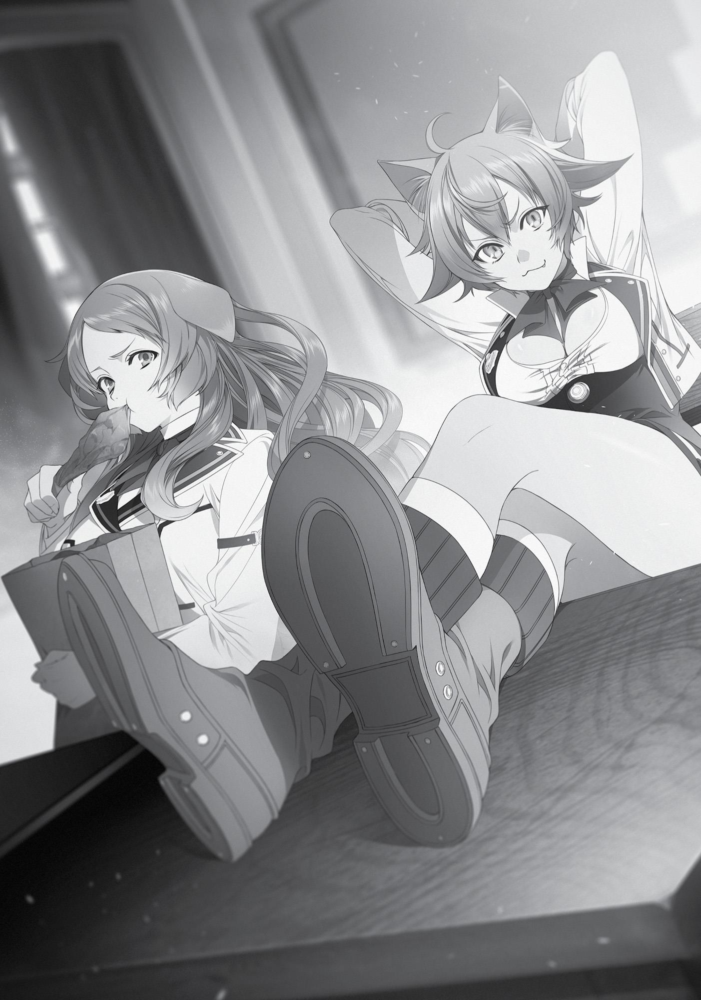
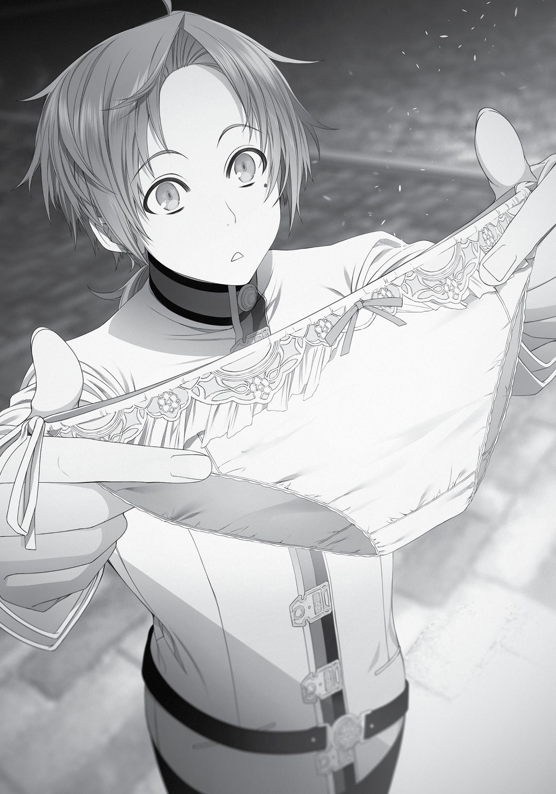

+++
title = "Chapter 3: First Day of School"
date = 2026-07-20
weight = 3
[extra]
volume = 8
chapter = 4
+++
The Ranoa University of Magic. The world’s greatest magic school,

occupying a vast plot of land and sponsored by three separate
countries as well as the Magicians’ Guild. The current principal was
one of the higher-ups at the Magicians’ Guild, the Wind King-tier
magician Georg. The student body was over ten thousand strong,
with numerous professors in the university’s employ. Despite the
name “Magic University,” you could actually learn a variety of
different things there.
Students were welcomed from all races, including demons, who
were still deeply ostracized by the Millis faith, or beastmen, who
tended to be isolationists. They even accepted human royalty who’d
been driven from their country due to power conflicts, or noble
children who were born cursed. There were no sky folk or sea folk
enrolled, but if you had mana and could cast magic, you were free to
apply, whatever your checkered history. This policy had invited some
opposition, from what I heard, but only the Asura Kingdom could
conceivably oppose the united might of the alliance and Magicians’
Guild, and it had invested no small amount of money into the
Magicians’ Guild itself.
Incidentally, a certain sect within the Holy Country of Millis—the
Temple Knights, as they were called—had positioned themselves as
standing in direct opposition to the university and everything it
represented. However, given they were on the other side of the
world, it seemed they didn’t care enough to start a war over it.
The enrollment period for students was seven years. You could
take a year abroad twice, for a maximum of nine years of study. If
you became a researcher affiliated with the Magicians’ Guild, you
could continue using the university’s equipment after graduation.
The school had a massive five-story dorm, but staying there was
optional. Those who had a house in the city commuted from home.
In general, however, most students lived in the dorm. A room was
prepared for me, a simple space about twenty-tatami-mats wide,
with a bunk bed. There was also a table and chair. Two students
typically shared a single room, but special students lived alone. I
could request a roommate if I wanted, but I decided against it. I
hadn’t come here to make friends.
Apparently, you could also pay to be moved to an exclusive
room for noblemen, which was more spacious and secure. Not
something I needed, I was sure. I wasn’t being targeted by assassins
for the moment.
The bathroom was in the hallway. Surprisingly, it was flushable.
Granted, it wasn’t like you could just pull a lever and whoosh! There
was a water jug next to it and you had to pour water out of it for a
manual flush, which would send the crap all the way down to the
sewers. Of course, those like me were encouraged to use water
magic to wash it down. On that note, the task of filling the water jug
fell to the person on duty, but as a special student, I was exempt.
Uniforms were also provided. Men were given a suit while the
women were given what resembled a blazer and skirt. Apparently,
the specific uniforms had only been introduced this year.
Honestly, I found the designs quite cute. There had to be gym
shorts for exercise wear, right? Or so you’d think, but unfortunately,
it was just robes. The school didn’t provide those, and didn’t specify
any restrictions or preferences. Students who didn’t already have
their own robes probably just bought whatever they wanted.
I had the robe I’d been wearing for a while now, so I didn’t need to
buy another.
“Well, does it look good on me?”
Elinalise, in her new school outfit, was currently modeling for
me. The way her hair was shaped in lustrous rolls made the robe she
was wearing look more like cosplay, but the uniform actually suited
her well. Although that, too, looked like cosplay to me because I
knew her true character.
“If you roll up the skirt and make it a little shorter, you might
have an easier time catching men. Make sure it’s just enough that
they can almost see your panties.”
Elinalise looked at me like I was a genius. “But isn’t that going to
be a little cold?” she asked.
“Put on thigh-high tights and you should be fine, right?”
“I see. I should’ve expected as much from you, Rudeus. You’re a
genius.” Elinalise followed my advice and folded up her skirt like a
high school girl. Then she rolled up the waist until you could almost
glimpse her fancy underwear.
Hmm… yeah, sexy panties like that just don’t suit a uniform, I
decided.
We headed to the opening ceremony, which was apparently a
thing at this school. The year’s new intake was assembled in the cold
courtyard. There was a girl looking bored by herself, while another
boy listened intently to the principal’s speech. Acquaintances were
loosely gathered and some were even chatting idly. No one was lined
up in an orderly fashion. If this were a Japanese school, the civic
guidance teacher would no doubt be screaming their head off. The
principal stood before our motley bunch, atop a podium constructed
of magic resistant brick, giving his speech.
“Ladies and gentlemen, many moons have passed since those
known as magicians were considered inferior to swordsmen. It is
true that the styles of swordplay created by the Sword Gods are
supreme. However! Magic is just as peerless! Swordsmanship, after
all, is nothing more than a tool with which to kill. Magic is different.
Magic has a future! We will retake what we have lost, and combine it
with current styles of incantation to bring forth a new—”
I stood quietly beside Elinalise. The principal’s sermon felt just
as long in this world as it had in my old one, but this one was more
tolerable. Perhaps because his speech was overflowing with a
passion for magic!
…Nope, that wasn’t it. It was because of how hilarious it was
watching him frantically try to restrain the wig on his head.
Elinalise was surveying the area, evaluating the men she saw.
She looked like she was struggling to decide who to start with first.
“That is all. Ladies and gentlemen, the path of magic extends
before you!”
Jenius ended with words that made him sound like some
protector of freedom and justice. There was no singing of the school
anthem. There wasn’t even a school anthem to begin with, despite
the fact that the country had its own song.
“And now, a few words for the new students from the Student
Council President.”
At the Vice Principal’s words, three people, a girl and two boys,
took to the stage. Standing at the forefront was a young girl with
beautiful golden hair in long, silky tresses with braids woven in. Her
clothes—a brand new school uniform—were the same as mine, but
even the way she walked brimmed with grace. Completely unlike the
joke of a young lady beside me. Granted, while Elinalise’s actions
lacked grace, they had their own charm.
“My, my, isn’t that the kid you made cry not so long ago?”
Elinalise mused.
At her words, I looked to the two boys walking behind the girl.
One of them had white hair and sunglasses—Fitz. He kept his guard
up, surveying their surroundings as they mounted the stage. And for
what it was worth, I didn’t think he’d cried when I beat him.
The other boy was someone I didn’t know. He seemed a bit
older than me. With his brown hair slicked back, he had a frivolous
look about him, a sword hanging from his side. He didn’t look like a
magician, and judging by the way he carried himself, he was probably
a swordsman. The only other noteworthy thing about him was his
good looks.
Incidentally, according to my research, sharply defined features,
which I considered handsome, were popular in the countries of the
Central Continent. That aside, this guy kind of looked like Paul. On a
similar note, I was often told I didn’t look half bad, except for when I
smiled. Elinalise was the only one who ever told me I had a stunning,
manly smile. Since no one complimented it, the only smiling I did
anymore was fake.
As the three of them took to the stage, the young crowd around
us erupted in murmurs.
“Isn’t that Princess Ariel…”
“Then that one over there must be Silent Fitz!”
“Aaah, it’s Lord Luke!”
They were famous, judging by the squeals. Luke was probably
the Paul-lookalike. He got shrill cheers from the girls and raised his
hand to wave back. Tch, and he’s got a name like some male adult
film star.
“My, my, that’s a nice man.” It seemed Elinalise wasn’t a good
judge of character, either.
“Silence! Princess Ariel has something to say!” At (presumably)
Luke’s order, the clamor fell into silence. Quite impressive given that
he hadn’t used a mic. “Go ahead, Princess Ariel.”
She waited for things to quiet before coming to the front of the
stage. “My name is Ariel Anemoi Asura. I am the Second Princess of
the Asura Kingdom, and the Student Council President of the
University of Magic!”
Her voice rang out amidst the silence. My heart trembled as I
heard the sound of her voice. This was probably what people called
charisma. It wasn’t just that her voice was loud, and clear—
something about it was pleasant to listen to.
“You have all gathered here from around the world. Many of
you have ideas unlike ours about what constitutes normalcy.
However, here at this University, we maintain a sense of order that
differs from your places of origin.”
The rest of her speech was primarily about school rules, and
boiled down to the fact that even if the rules here differed from
those of your homeland, you still needed to abide by them. But there
was something about her words that sunk deep into your soul and
remained there. We need to obey the rules, I thought, and not
because I’d been Japanese in my previous life. I felt compelled to do
so because she was the one saying so.
“Now then, I hope you all have an enjoyable time as students.”
Ariel wrapped up her speech with that final line and descended from
the stage.
It was at that moment that I suddenly caught Fitz’s gaze. I
shouldn’t have been able to tell he was staring at me through his
sunglasses, but I was certain because of how strong his gaze was.
This is bad. I better hurry up and buy that cake.
Once the ceremony was over, I parted ways with Elinalise and
headed for my designated classroom. There was homeroom once a
month and I had to participate. From what I’d heard, there were only
six special students, myself included. Apparently, they were an
assortment of eccentric, troubled individuals. Jenius, the vice
principal, had even said, “Please, please be careful not to get into any
fights.” Not that he needed to; I had no intention of causing a stir. No
matter what anyone said to me, I’d just bow my head and let it roll
off my back.
I headed to the tail end of three buildings, to the innermost
classroom on the third floor. Midway there, I found a line drawn
across the floor with the words, Beyond This Point is the Special
Students’ Classroom. Almost like they were segregating us, even
though the special students were supposed to be allowed to wander
the school grounds freely. No, perhaps it was the opposite. Special
students tended to be arrogant and cause problems, so this was a
measure to keep the general admission students from approaching
them.
As I mulled over this, I reached the classroom. There was a plate
above the door that read Special Students’ Room.
“Pardon the intrusion,” I called out quietly as I pried the door
open and crept inside. The classroom was a familiar sight. There was
a brand-new chalkboard, something like a lectern and a teacher’s
desk. Wooden desks lined the room. The windows were firmly shut,
but the room was bright. In contrast to the vastness of the room,
there were only four people sitting at the desks.
In the front row, there was a boy who was reading and taking
notes. The most striking thing about him was the way his dark brown
hair hid his eyes. He glanced briefly in my direction, before losing
interest immediately and returning to his book. Further in and
closest to the windows sat two girls, both of whom were beastfolk.
One was chewing at a stringy piece of meat on the bone. A dog-type.
Her eyes regarded me suspiciously. The other, a cat-type, had her
legs resting on the desk and both hands folded behind her head as
she leaned back, glaring my way.
Seeing them reminded me of the two young girls I’d met back in
the Doldia village. What were their names again? They were both
good kids. In comparison, these two looked a bit ill-mannered.
Reminded me of those fashion-obsessed teen girls from back home.
And then there was the last guy—a man I’d seen somewhere
before. He had a long face with round glasses, the kind of guy who
might have gotten nicknamed Spock back in the day. He spent a few
moments gaping at me, then stood up and screeched with his mouth
still wide open.
I immediately unleashed my Eye of Foresight.
“M-maaaaster!!” He sent his desk flying as if it were a mere
obstacle in his path. He was like a snowplow in the way he crashed
through all the other desks between us. One by one they went flying
as he plunged forward. Yes, plunged—he was steamrolling toward
me!
“Stone cannon!” I’d smack him before he reached me.
“Maaaaster!”
He took my stone cannon right to the face and it hit him with a
loud crack, but he didn’t even stagger a bit. That cannon had enough
power to knock an adult man out, but it had absolutely no effect on
this guy? Impossible. Was this really the power of a Blessed Child?!
He grabbed me by my waist and tried to hoist me to the ceiling.
“Whoa, whoa, hold it in, hold it in! Release the tension from
your shoulders, relax, calm down! Knock it off!”
His arms had enough power to send me flying into the ceiling,
but fortunately, he just lifted me up.
“Master! Have you forgotten me? It is I, Zanoba!” Zanoba was
grinning from ear to ear as he carefully wrapped his arms around me
in a hug.
What’s with that introduction? Are you supposed to be the
wife of a certain Mr. Isono?
“Yes, I remember. My dear pupil, please release me, this is
terrifying.”
Before me stood the Third Prince of the Shirone Kingdom,
Zanoba Shirone. It seemed when Zanoba was sent away under the
pretense of studying abroad, he’d been sent off to the Ranoa
University of Magic.
Under normal circumstances, a Blessed Child who couldn’t
control their power would be treated like a Cursed Child. However,
the Magicians’ Guild had a department that studied curses and
blessings, and Blessed Children made excellent specimens. And so,
Zanoba was allowed to enroll at the University as a special student in
exchange for allowing himself to be studied. A timely offer, given
that he’d recently acquired an interest in magic.
“I’ve been aiming to be just like you, Master. I’ve been diligently
practicing my earth magic every day,” my dedicated pupil declared.
“Have you? I’m glad to see Your Majesty is doing so well. Once
things have calmed down, let’s make a figurine together.”
“Yes!” He smiled and nodded.
This was nice. It brought back memories of my underclassmen in
junior high, who’d latched onto me the same way when I bragged
about having built my computer myself.
“Also, while we’re here at school, you’re an upperclassman.
What year are you right now?”
“Second year. Ha ha, please don’t refer to me as ‘Your Majesty’
or as an upperclassman. You can just call me Zanoba. You are my
master, after all.”
“Zanoba, then.”
“Yes, Master.”
A sudden loud smack interrupted our pleasant conversation. I
instinctively looked in its direction. The beast girl who’d had both
feet on her desk had slammed one to the floor. The other still
remained on the desk, which meant her skirt was spread right open
so I could see a certain something. “I don’t like this, mew.”
She said ‘mew’! That was something I associated with the Doldia
tribe. And Eris’s… no, let’s not go down that road.
“Hey, Zanoba, what are you and that new kid rattling on and on
and on about?”
“Mistress Linia, this is the person I spoke about before, my
master.”
“That’s not what I’m asking about, mew!” The cat-eared girl
irritably slammed the heel of her other foot against the table. “Hey,
Zanoba, don’t mess around, okay! You know what I’m talkin’ about,
right, mew? You know, don’tcha, huh?!”
His face went stiff.
What was going on? Was he actually being bullied? Zanoba was
supposed to be pretty strong, but this could be a question of social
hierarchy. Brute strength didn’t necessarily put you at the top.
“If ya do, then bring him over here.” She made a beckoning
motion in my direction.
“I’m sorry, Master.”
“No, it’s fine.” I approached the cat-eared girl as I was told.
A cat-eared girl and a dog-eared girl. Their piercing gazes would
have made my legs tremble in the past, but they didn’t feel scary at
all now. Their glares needed a little bit more… well you know, right?
They needed some murderous intent in there, right? That was how
truly scary people—like Ruijerd—glared.
“Greetings. A pleasure to meet you, I’m Rudeus Greyrat. I’ll be in
your care starting today. I’ll be careful not to butt into anything. I
hope we’ll get along well.” I bent in a swooping, Japanese-style bow.
Where people like these were concerned, it was best to behave
modestly and to do my utmost not to get involved.
Linia purred out a laugh. “Straightforward, eh? Not bad at all,
mew. I’m Linia Dedoldia, a fifth year, mew. Though you might not
know it just by looking at me, I’m actually the daughter of Gyes, the
Warrior Chief of the Great Forest’s Doldia Village. At some point I’ll
inherit the position of Village Chief, so you’d best start servin’ me
now, mew!”
So she was really of the Doldia Tribe. And Gyes’s daughter, to
boot. Come to think of it, they did say his oldest daughter had been
sent off to another country to study. So this was it? Man, that sure
brought back memories.
I gushed: “Oh, truly? Mister Gyes took good care of me when I
visited the Doldia Village before! Ah, I’m so touched! To think I’d be
able to meet the daughter of the man who looked after me at a place
like this! Oh, that means you must be Mister Gustav’s granddaughter
as well, right? Mister Gustav was good to me, too. He even let me
stay at his house during the rainy season!”
“O-oh really? That so? So you’re one of Grandpa’s
acquaintances…”
In contrast to her earlier spiel, spitting out word after word like
a machine gun, Linia was left staring at me dumbfounded. Not that it
really mattered, but the force with which she’d kicked the table
made a certain article of clothing super visible. Aqua blue, huh?
Beside her the girl who was gnawing away at the meat bone
twitched her nose and pulled a face. “It stinks.”
That was rude. She was referring to me, right? Still, I didn’t let
my face betray my emotions, but gracefully turned to the dog girl
and bowed. “Pardon me. Might I ask your name as well?”
“Pursena. I’m basically the same as Linia.”
“Miss Pursena, what a lovely name! A pleasure to meet you!”
She pinched her nose and turned her face away. “Fuck.”
That last word was meant as an insult, I assumed—though when
girls like her talked that way, it actually turned older men on.
Regardless, this had been a successful preemptive attack. At
least, I wanted to believe my efforts had been good enough to avoid
getting caught up in something outrageous later on.

Zanoba had a conflicted look on his face as he watched me
interact with the two of them. Once we stepped away, he spoke in a
hushed voice. “Master, why are you acting so submissive toward
them?”
“My dear pupil, it is important to avoid unnecessary conflicts.”
“You really think so…? Well, since you’re the one saying that, I’ll
keep my mouth shut.” He looked vexed even as he nodded his head.
I had no idea what he’d gone through, but if it looked like he
was being bullied in the future, I’d be sure to shield him from it.
Bullying was a no-no. An absolute no-no.
As I was preoccupied with that resolution, someone called out
from behind me. “Hey.”
“Yes, what is it?”
I looked back and the boy from the front of the row was
standing there. “You. You said your name was Rudeus, right?”
“Yes, my name is Rudeus Greyrat. A pleasure to make your
acquaintance.”
He looked taken aback when I bowed my head. “Cliff Grimor.
I’m a genius magician.”
A genius magician, eh? Incredible. But was he seriously going to
call himself a genius? Didn’t he feel embarrassed about doing that at
all?
“I’m a second year, but I’ve already acquired Advanced-tier
ranking in all the offensive magics. I’m also advanced in healing,
detoxification and divine magic, too. I’m still a beginner at barriers,
but I’ll soon be Intermediate-tier. There aren’t any decent teachers
at this school.”
“That’s amazing,” I praised him sincerely. It made sense now
why he called himself a genius. What did it take to become an
advanced user of all seven types of magic in only two years? I could
still only use intermediate healing magic and basic detoxification
magic.
So this was the special student class. I’d known there would
always be someone better than me out there, but this just drove it
home. Probably the only reason my own self-esteem didn’t take a
nose dive was because I’d was Saint-tier with water magic.
“It took me two years just to become Advanced-tier in four
types of offensive magic. You really are incredible.”
“Tch, don’t get carried away.”
I just honestly meant to praise him, but he clicked his tongue
and turned grumpy. He glared at me with such force he might as well
have grabbed me by the collar of my shirt. Although I was a little bit
taller than him, so he had to look up at me slightly. “You can wield a
sword as well as use magic, can’t you?”
“Yes, well, I’m not very good at it though.” I was technically
Intermediate-tier in the Sword God Style. I basically remembered
nothing of Water God Style. Part of my bodybuilding regime included
swinging a wooden sword, but that wasn’t swordsmanship that was
useable in combat.
To be honest, no matter how much time passed, I still couldn’t
master what came as easily as breathing to other swordfighters such
as Eris and Ruijerd. So I’d semi-given up on the path of the sword. I
never even used it once while living as an adventurer. Even so…
“Who told you that? That I could wield a sword.”
“…Miss Eris.”
That shook me. Had he met Eris within the last two years? No
way…she wasn’t here at the University?!
“She’s at this school, too?”
“What? Of course she isn’t,” he retorted curtly.
“Um, so… where did you meet her then?”
He just glared at me without answering. Was that a bad
question? Ah, don’t tell me he was one of the people she’d punched
a long time ago? I’m sorry, I really am, I apologize on her behalf, I
thought inwardly.
“Uhh… did she say anything else about me?”
He glowered with such force it could have had its own sound
effect. After glaring me up and down, he finally said, “Hmph. She said
you were small.”
“R-really? She said I’m small?” Like down there?
I felt like I was going to cry. So it really was the sex that drove
her away from me. If only I’d been bigger, then… Come to think of it,
I’d gotten a similar vibe from the way Sara looked at me, too. Her
face had said, “Oh wow, you’re smaller than I thought you’d be.”
No, she was mistaken! It only looked small because it wasn’t
reacting! Once it was energized and standing at attention, it had the
ferocity of a lion!
“W-well, it’s been two years since we parted ways, and I’ve
grown since then,” I stammered.
“What? You and Miss Eris parted ways?”
“Hm?” I got the feeling that we weren’t quite on the same page.
A sense of unease arose in me. But before I could confirm that
unease…
“Hm, well, whatever. You don’t suit Miss Eris regardless!”
Those words were like daggers to the heart. Cliff huffed air out
of his nose and returned to his seat. I’d have to keep an eye on this
one.
The teacher arrived soon after, I introduced myself, and after a
short conversation, homeroom was over. Though we were missing
one person.
“Huh? I heard there was one more special student?”
When I tried asking Zanoba, he just shook his head. “Master
Silent is exempt from the monthly homeroom.”
“And why’s that?”
“Good question, but I haven’t an answer for it.”
The last person was apparently someone named Silent. Don’t
tell they’re a person who can’t use shadow magic?!
“I guess they must be pretty incredible, huh?”
“They’re well-known. They influence the Academy at every
opportunity, or so I hear. They’ve increased the items on the school
menu, created magical implements… these uniforms were also one
of Master Silent’s suggestions. Rumor has it they were
recommended by one of the Seven Great Powers, so they’re getting
special treatment.”
The image that popped up in my head was that of a mad
scientist with a white coat and bottlecap glasses, carrying flasks of
green goop in their hands. Someone who was intelligent and
delivered successful results, but was otherwise a sad excuse for a
human being.
“They usually shut themself in their private research room, but
they do emerge if they have reason to, so I’m sure you’ll eventually
meet them,” Zanoba said. He also mentioned that Silent was a thirdyear student. If I saw them, I’d be sure to show them the proper
respect.
And just like that, I was absorbed into the ranks of the special
students.
Once homeroom was over, Zanoba and the others went off to
their classes. It was only natural for someone as serious as Cliff to
attend classes in earnest, but Linia and Pursena, who seemed more
the type to play hooky, were doing so as well. According to Zanoba,
the lunch break was about two hours from now. He beamed as he
invited me to eat with him and I was happy to oblige.
Eventually, I’d take classes myself. I hadn’t come to this school
just to study, but I hadn’t come here just to bum around, either. I
decided to check out the school’s facilities in the meantime.
First up was the school infirmary. The one at this school was
spacious, with eight beds and two healers, which probably meant
there were a lot of magical accidents where people got injured. At
that very moment, a man twice my height was being carried in on a
stretcher. He was clutching his arm, and one of his legs was bent at
an odd angle. One of the healers took hold of an injured area and
began a hastened chant of Intermediate-tier healing magic, and the
anguish on the man’s face quickly faded. I didn’t want to get in the
way, so I left, spotting the plaque at the entrance which said Medical
Office One on my way out.
The next place I headed to was the gym’s storehouse, a room
adjacent to the practice area where I’d taken my exam the other day.
The entrance was locked, of course. I had some options: go to the
teacher’s buildings to get the key, or ask the gym teacher if I could
borrow theirs. Then there was the option to pop it open with
voiceless casting. That was what I chose, using my earth magic to
remove the lock so I could enter.
The inside smelled slightly moldy and dusty. The shelves were
lined with leather breastplates and masks that looked like kendo
masks, and in the corner was what looked like an umbrella bin
stuffed with magic staves. There was an iron scarecrow and some
unidentifiable white powder sitting in a jar.
Apparently, classes here didn’t involve high jumps or floor
gymnastics, so there were no mats. In fact, the name of the room
wasn’t even Gym Storehouse, it was Practice Equipment.
I thought about heading to the roof next, but this was a region
that got a lot of snowfall, so many of the school buildings had sloping
roofs. They did have one rear rooftop room, but I decided to forego
that for the moment and head for the library next.
The library at this school was set off from the other buildings, so
I had to leave the main campus to get there. After about ten minutes
of walking, I made it to the two-story building, and was stopped at
the entrance by the gatekeeper.
“Halt!”
“Eh?”
“I’ve not seen you before. Are you new here? Why aren’t you in
class?”
“Uh, yes, I’m a new student. A special student with an
exemption from classes.”
“Show me your student ID.”
My movements were stiff as I passed him the student ID I’d
received just the other day.
The gatekeeper stared hard at my face as he confirmed my
identity and said, “Okay.”
He carefully patted me down, and then gave me an overview of
the what to be careful of when using the library.
Usage of magic was forbidden in the library.
In general, taking books out of the library was strictly prohibited,
but there was a certain section you could borrow from.
For the latter, you needed the permission of the librarian and
were required to have your name recorded.
And, of course, you’d be penalized for any books you destroyed
or defiled.
Same rules as your average library, but really tearing up a book
could result in a fine and possible expulsion, even though most of the
books in the library were just copies. Still appropriate, I supposed,
given how precious books were in this world.
“It’s quite strict here, isn’t it?” I said.
“Some lowlife secretly switched out some of the books before.
And sold the originals on the market, if you can believe it.”
“I see.”
I bowed to the gatekeeper and headed inside, where the subtle
scent of books awaited. It was a unique blend of aromas: the smell of
mold, of ink, and of paper. A bathroom sat at the entrance,
convenient for those who felt the need hit them the moment they
stepped into the library. I offered a light greeting to the librarian
before heading further in. There were desks and tables lined up by
the entrance, and further in were rows of tall bookcases.
“Whoa.” Astonished, I unintentionally let out a gasp. I’d read a
lot since coming to this world, but this was the first time I’d ever
seen such a vast number of books in one place. Stairs led through an
opening in the ceiling to the second floor, which was, as expected,
similarly occupied by bookcases. The desks and chairs scattered
around suggested quite a few people made it their habit to study
here.
I remembered the Man-God’s advice:
“Rudeus, go forth and enroll at the Ranoa University of Magic.
There, you must investigate the Displacement Incident in the Fittoa
Region. If you do this, you will be able to regain your abilities and
confidence as a man.”
Phew--I’d almost completely forgotten about that first bit. But
this was perfect. With the sheer volume of books here, I was bound
to find something about teleportation. However—where should I
even begin?
“Maybe I should ask the librarian…?”
No. There was no rush. Not even the Asura Kingdom had figured
out what had caused the Displacement Incident yet. If I could have
figured it out that quickly, the Man-God wouldn’t have told me to
enroll in the university. He’d have told me to sneak in and
investigate, instead. In fact, he’d only told me to look into the
incident, not to discover its cause. Maybe something was supposed
to happen while I was searching.
For the moment, I settled on figuring out the shelving system.
The majority of the books were written in the human tongue, but
among them were those written in Demon God Tongue and Beast
God Tongue. There was also a book in Fighting God Tongue. The
alphabets I weren’t familiar with must’ve been the Sky God Tongue
or perhaps Sea God Tongue. I wished they would translate those
tomes into languages I could read.
“Ah!”
There was a sudden small cry from behind me. I turned around
and saw a young boy with white hair and sunglasses, carrying a
number of tomes and scrolls and looking my way.
It’s Fitz, I realized. I hurriedly straightened up, pressed my feet
together and bowed. “I apologize for the other day. It was my
shallow actions that caused you to lose face. I planned to bring you a
box of sweets, but unfortunately, as a new student, I’ve been busy
with so many things…”
“Guh?! N-no, it’s fine, please don’t bow.”
There was a guy in my previous life whom I really respected,
named Masa. A working man who could ride out whatever life threw
at him by prostrating himself on his hands and knees. One his edicts
was, “Whenever you’ve made a made a mess of something, find an
innocuous place like the bathroom to give an earnest apology, so you
don’t get yelled at in a more public location.” My sudden apology
made Fitz panic, and it seemed we were headed in a direction where
he was likely to forgive me. Success!
“Rudy—um, I mean, Rudeus, was it? What are you doing here?”
“Just a bit of research.”
“Into what?” Fitz pressed.
“The Displacement Incident.”
When I said that his brows knitted together. Had I said
something odd?
“The Displacement Incident? Why?” he asked.
“I lived in Asura Kingdom’s Fittoa Region, and I was teleported
to the Demon Continent after the incident.”
“The Demon Continent?!” Fitz said. I thought his surprise a little
over-exaggerated.
“Yes. It took three years for me to return home. My family has
all been found since, but there’s still one acquaintance of mine that’s
missing. This seemed like a good opportunity to do a little research.”
“Is that why you came to this school?”
“That’s right.” I couldn’t tell him the real reason was finding a
cure for my erectile dysfunction. Besides, I wasn’t lying; I wanted to
know why the Displacement Incident had occurred.
“I see. You really are amazing, after all,” he said, scratching at
the back of his ear.
I wasn’t sure what was so ‘amazing after all’, since I hadn’t
discovered anything yet. Perhaps he’d recognized my power after
our mock battle the other day. Well, whatever. “And what, might I
ask, are you doing here?” I said.
“Oh yeah. I’m carrying some documents with me. I have to go
now. I’ll see you again, Rudeus.”
“Yeah, sure, see you.”
Fitz hurriedly turned away, heading towards the front of the
library. However, after just a few steps, he suddenly looked back.
“Oh, right. You should read a book by Animus that’s about
teleportation, called An Exploratory Account of the Teleportation
Labyrinth. It’s creative nonfiction, but easy to read.”
And then he ran off.
He didn’t seem to be holding a grudge about the exam. Maybe
he was actually a pretty good guy.
I went to the librarian to ask after the book An Exploratory
Account of the Teleportation Labyrinth, and read it until lunchtime. It
was a slim volume, not even a hundred pages thick, and told the tale
of about Animus Macedonius, an adventurer native to the northern
regions who went exploring a labyrinth.
This labyrinth, appropriately called the Teleportation Labyrinth,
was a rare kind whose traps were all teleportation-themed. There
were five types of beasts who dwelled within, all highly intelligent
creatures who understood the layout of the labyrinth and where the
teleportation traps would send a person. If you were unlucky enough
to step on a trap, you’d find monsters waiting for you on the other
end. It was difficult to avoid those traps during combat, and if the
battle turned chaotic, your party would be immediately separated,
so this labyrinth was classified as being incredibly dangerous.
As Animus and his companions dove into the labyrinth, he
studied the teleportation traps he found there. There were mainly
three types of traps. The first was a fixed one-way teleporter. It
would send people to the same location every time, but there was
no way to return from there. Another was a fixed two-way
teleporter. There would be a magic circle at the destination, and you
could use it to come back. Finally, there was the random teleporter,
which transported you to a random destination.
The basic strategy adventurers employed in the Teleportation
Labyrinth was to use the magic circles to repeatedly teleport
themselves deeper in, but random teleportation circles were mixed
in with the others. If you mistakenly stepped on one of those, you
would be separated from your party and forced to fight a swarm of
beasts by yourself.
Animus’ book contained his research and theories about how to
tell the random teleporters from the others. In the middle of his
journey, he figured out how to tell them apart, and rapidly
progressed deeper into the labyrinth. But he got carried away,
forgetting that his method wasn’t foolproof. At the end of the story,
he misidentified a trap and stepped on a random teleporter.
Surrounded by a vast number of enemies, he lost one arm but
somehow managed to escape alive. However, he’d lost all three of
his comrades in the process. Animus himself could no longer fight, so
he abandoned his life as an adventurer.
The story ended with a line saying he’d leave conquering that
labyrinth to the reader. I couldn’t tell whether this was fiction or
nonfiction, but having your party scattered and preyed upon by
monsters like that sounded pretty scary.
Unlike the RPG dungeons of my previous life, which were built
with the intention of being solvable, it was perfectly possible to
never make it all the way through this world’s labyrinths. Based on
what I’d heard from other adventurers, labyrinths were generally laid
out in a way that allowed you to reach the middle where the magic
crystal was located, but it wouldn’t surprise me if there was at least
one trick labyrinth out there without a real end point.
The back of the book was filled with theories about random
teleportation. The nomenclature wasn’t entirely accurate, since the
teleport range of the random traps was predetermined to a degree.
Also, while you could teleport into the middle of a cave, it was
exceedingly rare to be teleported into the earth itself. Animus
hypothesized that this was due to resistance between the mana at
the destination and the mana of the person being teleported, which
was the same principle that explained why you couldn’t cast an
offensive spell right into a person’s body.
This was something I already knew… although healing magic did
involve running magic through another person’s body. I suspected it
was connected to why I couldn’t cast healing magic without an
incantation, but we’d leave that for another time.
As for teleportation, I wondered if there was an exception to the
theory. After all, you could channel offensive magic into the dirt.
Perhaps teleporting people into solid matter simply required an
obscene amount of magical power.
As I ruminated, the noon bell rang. Time was a fleeting thing.
I met Zanoba and we headed for the cafeteria, which was a
separate building. It had three floors, each for different kinds of
students. The third floor was for human royalty and nobility. The
second floor was for human commoners and beastfolk. The first floor
was for adventurers and demon folk. It was more a method of
classification than one of discrimination; the school had probably
reasoned that if the human nobility ate alongside the adventurers
and demon folk, it would only fan the fires of potential conflict. The
school had probably reasoned that if the human nobility ate
alongside the adventurers and demon folk, it would only fan the fires
of potential conflict.
As an adventurer myself, I was fine with dining on the first floor,
but…
“Come, come, this way.”
I got the meal set that Zanoba recommended and let him drag
me to the third floor.
“Urgh…”
The moment I emerged from the stairs, all gazes on the upper
floor immediately turned towards me…possibly because I exuded the
stench of a commoner, but also, my clothes had seen better days.
Because of the cold, I had my old gray robe over my uniform. It was
five years old, and its sleeves were tattered, its front marred by a
large seam across the chest. With my recent growth, my clothes
were also a size too small. To put it frankly, I looked completely
disheveled.
Unlike on the first and second floors, not a single person wore a
robe to protect themselves from the cold. It was full of people in
cozy-looking cloaks and cardigans. They might as well have been
wearing suits, while I was the only one in sweats.
“Zanoba, I don’t think I fit in here. Can we at least eat on the
second floor?” I pleaded.
“No, not the second floor. Linia and Pursena are there.”
“Okay, then how about the first floor?”
“The first floor is full of heathens who don’t know any table
manners. It’s not a place fit for royalty like me to go, no matter how
briefly.”
“Okay, then let’s just eat separately,” I said finally.
“Don’t be heartless. Do you know how much I’ve suffered, not
being able to see you again until now, Master? You can at least eat a
meal with me.”
“Don’t ask your master to suffer in your stead.”
We were arguing at the head of the staircase, and despite its
width, the students passing by made it seem like we were blocking
them. Suddenly a burst of noise came from below: a chorus of shrill
voices, gradually getting closer.
“Aaah, Lord Luke!”
“Lord Luke, I’m next!”
“Aww no way, Lord Luke, not fair.”
“Lord Luke, can I come on your next date?”
A handsome man, surrounded by women, was coming up the
stairs.
“No, I’m sorry,” he said. “I’ve already decided I can only take
two girls on a date at one time. I only have two arms, you know, so if
I invited three girls one would be left out, right?”
“Aww, that sucks.”
“Hehe, sorry. But I am a popular man, you know. Let’s go on a
date some other time. I think my left arm is free next month.”
Those unbelievable words spilled from the mouth of the young
man who resembled Paul. On either side of him was a girl whose
uniform bulged in the chest area. His arms were wrapped around
their waists as he climbed the stairs, laughing carelessly. I was pretty
sure he was the guy I’d seen at the opening ceremony. Luke or
whatever. What was his last name? Skywalker?
Our eyes met.
“It’s you…” His eyes narrowed. The carefree look on his face
turned grim. “You’re Fitz’s…”
I bowed my head. So he knew about my match against Fitz. Fitz
didn’t seem angered by what happened, but perhaps his companions
were pissed on his behalf.
“A pleasure to meet you, I’m Rudeus Greyrat. I’ll be under your
guidance during my time here at the school, since you’re an
upperclassman. I hope you’ll look out for me.”
“Yeah. I know. I heard about you from Fitz. Apparently, you’re
insanely forgetful.” Luke looked at me, disgruntled.
Insanely forgetful… was I really? I didn’t really get it. What did
he think I’d forgotten?
“You know my name already, don’t you?”
“No, I don’t.” I shook my head as I was suddenly asked a
question reminiscent of a certain Fist King’s younger brother, figuring
it was better to honestly confess my lack of knowledge than give a
half-baked answer.
“So you’ve chosen to pay it no heed. That makes sense.”
“Uh, sorry. If it’s no trouble, would you mind telling me your
name, then?”
Still disgruntled, Luke stared at me for a few beats before
huffing, and spat out: “Luke Notos Greyrat.” Then he shoved past
me.
“Ugh, what the heck was that about? I can’t believe it!”
“Seriously, that robe was sooo lame! It was totally worn out at
the edges!”
“If it’s falling apart, he should just go out and buy a new one!”
His groupies followed in his wake, spewing insults, but their
words went unheard by me. Luke Notos Greyrat. My father’s birth
name was Paul Notos Greyrat. Was Luke an illegitimate child? No,
that couldn’t be. Paul had long ago disavowed the name Notos. Luke
had to be a cousin or something.
“Master, you’ve caught the eye of an unpleasant character.”
“I guess I have, huh? If that exchange was anything to go by.”
“That was Luke, one of the Asura Kingdom’s upper nobility. He’s
technically a student, but he’s one of Princess Ariel’s guards.”
“Regardless, let’s forget about eating here,” I said.
“I suppose we have no choice.”
We compromised by eating outside. The weather was nice and I
used my earth magic to conjure some chairs and a table, creating an
insta-café terrace. Zanoba expressed his awe at each spell I cast by
shouting, “Whoa!” It delighted me to see how deeply moved he was.
As we ate, Zanoba told me about Princess Ariel and her group.
Ariel Anemoi Asura, age seventeen. Second Princess of the
Asura Kingdom. The only daughter of the crowned queen, and still
third in line for the throne despite her relative youth. The queen’s
health had taken a downturn after giving birth to Ariel went poorly,
leaving her unable to conceive another child.
Also vying for the throne were First Prince Grabel and Second
Prince Halfaust. The powerful people of the Asura Kingdom formed
factions behind them, hoping to back the prince who would become
king, then reap the benefits.
However, with the size of each group, not all were certain to get
a taste of the honey that trickled down. Even the ministers were
ranked in a hierarchy, so it was given that those the bottom would
be ignored. When the Second Princess was born, those who felt they
wouldn’t benefit from their candidate’s succession switched their
loyalties to her. However, hers was the weakest of the factions, and
during the chaos of the Displacement Incident, some of the group’s
most powerful members lost their standing. Multiple attempts were
made on the Second Princess’s life, and under the pretense of
studying abroad, she escaped to this school.
The Princess brought two guards with her. One of them was Fitz.
Silent Fitz, as he was nicknamed. A magician who used voiceless
casting and had killed an assassin targeting the princess. People
knew he was an elf, but it was a complete mystery where he was
born and raised. Only a handful of people could teach voiceless
casting, but his master was unknown.
Ariel and her group were tight-lipped about Fitz’s existence.
Rumors abounded that the Asura Royal Palace had raised Fitz in
secrecy, as part of an organization of heartless killing machines.
Which definitely wasn’t true, judging by my conversations with him.
Her other guard was Luke Notos Greyrat. The second son of the
current head of the Notos family, Pilemon Notos Greyrat. Since birth,
he’d been trained to become one of Princess Ariel’s guardian knights,
and continued in that role in the event that the princess managed to
regain power and return to the struggle for succession. From the
moment he enrolled in the school, he’d been continuously bathed in
limelight, making him a target of envy, fear, and respect.
In closing, Zanoba said: “But be forewarned, some of this
information is my own conjecture.”
“Yeah. Thanks. Actually, you’re really knowledgeable.”
“Because I was forced to look into the matter.”
“By whom?” I asked.
“Two foolish beastfolk.”
“Linia and Pursena, huh?”
“Indeed.” His face was the very picture of anguish. Had they
made him their errand boy?
“Zanoba… are you being bullied by those two?”
“Bullied? No, I’ve merely conceded defeat after losing to them.
That’s all.”
“Conceded defeat, huh?”
Zanoba looked slightly conflicted, even as he spoke flatly. If he
was fine with his circumstances, that was one thing. But the effects
of bullying were often easily overlooked by others. I wanted to help
him… but I didn’t know the extent of my would-be opponents’
power. Beastfolk were often quick to jump to conclusions, and I
didn’t want to make enemies of them.
Of course, there were plenty of good beastfolk, like Ghislaine. At
the end of the day, though, I was always on the side of those being
bullied.
“If they’re doing something to you that you don’t like, please tell
me. I might not have much power, but I’ll help.”
“Hahaha, it’s nothing for me to bother you with, Master, rest
assured. More importantly, let’s talk about figurines!” he said with a
laugh.
Guess I’ll just monitor the situation a bit longer, I thought.
I returned to my wandering after lunch. I couldn’t think of other
places I wanted to have a look at, so after a cursory glance around, I
headed back to the library.
I searched for literature on teleportation, but I’d never used a
library before. It took me a while just to look through the stacks of
books. The library let me peruse a catalogue of their collection, from
which I singled out books with the word ‘teleportation’ in their titles.
After that I hunted them down through the sea of shelves. That
alone took several hours. On top of that, most of what I did collect
was either not detailed enough, written in technical jargon, written
in a language I didn’t even know, or required prior knowledge about
the subject matter to make sense of it.
“If I’m going to hunker down and research this, I’d like to have a
notebook.” There was a limit to what I could hold in my memory. I
decided to leave the books for tomorrow and left the library.
Outside, the sun was setting and students who’d finished classes
were gradually making their way back to the dorm. Some seemed to
be headed for the library. I went in the opposite direction to the
school store, which was by the entrance to the main school building.
The store was full of students shopping quietly. A cursory glance
around revealed magic textbooks, magic crystals, robes, wooden
swords, beginner wands, bags, shoes, and soap, among other daily
essentials. There were also food items like dried meat, smoked meat,
as well as bottles of drinking water and alcohol. I bought a random
selection of paper, pen, ink, and some string to tie the paper with.
Couldn’t be attending school without even the most basic supplies.
By the time I left, it had grown dark outside. There were no
streetlights here, but the path was still faintly lit, so I continued down
it. Even though winter was already over, there was still snow on the
walkways. I trod carefully and hurried toward the dorm.
No one else was around. I could hear a distant hustle and bustle,
but it felt like I’d wandered into an empty space devoid of people.
The path from the main school buildings cut in front of the women’s
dormitory and continued forward. I headed unthinkingly down
that path.
That was when it happened.
“Hm?”
Something descended from above. It was white, but it wasn’t
snow. Instinctively I grabbed hold of it.
“Ooh.”
What opened up before me was pure white fabric. It had
embellishments on it, but they were subtle and elegant. The proper
name for this particular item was “panties,” and fairly high-quality
ones at that. At the very least, they looked more expensive than the
ones Elinalise normally wore.
Perhaps someone was trying to hang them out to dry? I looked
up and saw someone peeking over the edge of one of the verandas.
Probably the person who’d dropped them. I thought our eyes met,
but it was dark, so I couldn’t discern their face. It felt like I’d seen
them somewhere before.
“Um, you dropped—”
“Gyaaaah! Panty thief!”
Huh?

The scream of a female student came not from above, but from
behind me. Panicked, I turned around to find the screaming person
pointing their finger at me. This is a misunderstanding!
But it was already too late. Moments after the scream, the
windows on the other verandas swung noisily open. Then figures
came leaping out from the first floor, one after another.
Before I realized what was happening, I’d been surrounded, the
panties still in my hand. I had no idea what was going on.
“Uh, um, uh…”
“Hmph!”
Standing at the forefront was a well-muscled girl, or maybe a
woman. Or a bandit, or a gorilla. Her shoulders were almost twice as
wide as mine. Was she beastfolk… or no, a demon?“Perverted
scum!” She spat on the ground as I stood there, confused by the
sudden verbal abuse. The gorilla was considered the sage of the
forest, but it was hard to think of her that way.
What the hell? Why was I being called a panty thief? Sure, I was
a fifteen-year-old boy with a healthy interest in women’s underwear,
but I hadn’t stolen these, or even tried to sniff them. I’d just caught
them as they fell and then tried to give them back to the person
who’d dropped them.
“Hold on,” I said. “Please wait, I haven’t done anything.”
“You haven’t done anything?” The gorilla grabbed my arm.
“Then why don’t you tell me what’s in your hand?”
Well, yes, I was holding panties in my hand. Judging by the look
on her face, she considered that proof enough. I could feel
everyone’s hostile gazes on me, and my legs began to tremble.
“Aren’t those Princess Ariel’s? I don’t care how much you might
admire her, it’s a brazen act to do something like this at this hour.
You should be ashamed!”
The other girls chimed in at the gorilla’s biting words, saying,
“That’s right!” and, “You pervert!” and, “Drop dead!” Enough was
enough. I already felt like crying.
“Now, come with me. We’ll make you regret this so much that
you never do it again!”
She hauled me away by the arm. I attempted to resist her, but
all I did was leave skid marks from my shoes. I thought I’d toned my
body quite a bit, but her strength was on a whole different level. I
mean, her arms were two or three times meatier than mine.
At this rate, I was going to be dragged inside for an unspeakably
horrific beating, and all because of a false accusation. Should I run?
Even though I hadn’t done anything wrong? But running would be
like proclaiming my guilt… Was this like when a man got falsely
accused of feeling a girl up on the train? Would they hear me out if I
tried to talk to them? It seemed like they’d already made up their
minds that I was guilty.
No, I had to stand my ground. I hadn’t done anything wrong.
I used earth magic to anchor my feet in place. The gorilla looked
back in surprise, then sneered. “Oh, what’s this? You plan on
resisting? How gutsy for a panty thief! You really think you can fight
this many people?”
A good question. I surveyed them and felt good about my
chances. I’d fought off much worse in my time as an adventurer; I
could take these girls. Still, fighting back would be as good as
confirming my guilt. I might be falsely accused, but if I kicked up a
fuss, I might get violence against women added to the charges
against me—and this one would be true, too. It might even get me
expelled.
“Wait! Don’t do anything to him!” A boy’s voice, slightly highpitched, rang out.
“Lord Fitz!”
“What! Lord Fitz?!”
“Such a beautiful voice…”
“What’s he doing here?!”
The crowd split, revealing a petite boy with white hair and
sunglasses—Fitz. He cut between me and the buff woman to explain
the situation. “Sorry. That’s the underwear I was trying to hang out
to dry, but dropped. He picked them up for me.” His shoulders
trembled as he tried to catch his breath.
“Fitz… sir. I realize that you’re in charge of washing Princess
Ariel’s underwear. But,” the gorilla continued, “despite the late hour,
he was still walking in front of the dorm. Even though it’s been
agreed that once the sun sets, this path is only to be used by
women.”
Really? I didn’t see a sign saying so.
Fitz looked at my confused face and shook his head. “He’s new
here. And a special student on top of that, so he rooms alone and
doesn’t have a roommate. He must not have known about the more
intricate rules of the university. I’d like you to let this one pass.”
He sounded frantic; even I could hear the panic in his voice. I
wasn’t sure why, but I was grateful.
The gorilla turned in my direction. Is that true? Her expression
seemed to ask.
I bobbed my head up and down.
She kept a firm grip on me as she studied Fitz’s face. “Hm, it’s
surprising that you’d go this far to defend someone. What you say
must be true. Still, the fact remains that this boy violated the dorm
rules. We’ll make an example out of him by punishing—what?!”
As she spoke, she’d tried to pull me along, but then froze. Fitz
had whipped out his wand and thrust the tip of it right into the
gorilla’s face.
“Didn’t I just say he did nothing wrong? Enough. Now let go of
his hand.”
“F-Fitz… sir?”
The hint of anger in his voice that stirred murmurs around us.
Even in the darkness I could see the gorilla’s face blanching.
“Or would you all like to be sent to the medical office?” His
voice might be high-pitched, but there was definitely murderous
intent behind his words. I could hear the girls gulping around us. How
badass.
“Tch… fine, I understand.” She let go of me, albeit a bit violently.
Forced to comply, the other girls backed off as well. My wrist
smarted, but it didn’t look like any healing was necessary.
“Lord Fitz, I’ll let this slide. But you over there! You better not
show your face around the girls’ dorm at this hour ever again! Next
time I see you, I won’t show you any mercy!” The gorilla spat those
words before ducking back into the window she’d leapt out of. The
other girls also sneered at me as they disappeared. In an instant they
were all gone.
“Phew… that girl. If only she’d listen.” Fitz breathed a sigh as he
watched her go. He looked back at me and his head drooped. “Sorry.
If I hadn’t dropped that underwear, this would never have
happened.”
Just why on earth was a boy like him washing underwear in the
girls’ dorm, anyway? Or so I wanted to ask…but he was the Princess’s
highly trusted and capable bodyguard, so he must’ve had special
permission. He seemed like an honest man, and a harmless. He was
reliable, young, and his glasses made him seem all the more dashing,
though I’d call him cute rather than handsome.
Crap. My heart was pounding, even though the person in front
of me was a guy.
To put it nicely, I might be falling in love. To put it crudely, I was
ready to lick his feet.
“You haven’t done anything wrong. You helped me,” I said.
“Helped you? They’re the ones who would’ve been injured if
you’d seriously resisted.”
The reason he was so frantic hit me. He must’ve thought that
they would get injured if I unleashed my power. So he’d been acting
to ensure their safety…but even so, I felt the compassion in his
actions. If this were a shoujo manga, this would be where our love
story began.
“Still, that came out of nowhere. What did she mean?” I asked.
“Yes, well, it’s like Miss Goliade said. When the sun sets, male
students aren’t allowed to come near the girls’ dorm.”
Apparently, the gorilla from a moment ago was called Goliade.
The name certainly emanated strength. A perfect example of
someone’s name matching their physique.
“Really? But that wasn’t written in the school rules,” I protested.
“It was decided between the students living here at the dorms.
When the sun sets, the boys aren’t allowed to use that road, and
must take a detour to get to theirs.”
An unwritten rule, huh? It would’ve been nice if someone had
told me about it beforehand. Like Zanoba. “I didn’t know.”
“It’s not your fault,” he said. “Just be careful next time.”
“I will.”
He didn’t need to tell me twice. I probably wouldn’t take that
path again—not even in the middle of the day. I still couldn’t bear
having the hostile glares of an entire crowd trained on me.
“At any rate, thanks for helping me,” I said. “If you hadn’t come
to rescue me, I don’t know what would’ve happened.”
“Don’t worry about it. I only did what anyone else would do.”
What anyone else would do… really?
In hindsight, I had a lot of memories of being misunderstood or
falsely accused these past few years. It had started with the
beastfolk, then Paul, then Orsted. Was my face that untrustworthy?
However, Fitz hadn’t arbitrarily decided I was guilty. In fact, he
stuck up for me, even though I was partially at fault for what had
happened. He seemed the easygoing sort—he clearly wasn’t holding
a grudge over the exam. and he’d even given me advice at the
library. He had a lot of clout within the school, but he hadn’t let it get
to his head. Instead, he’d carefully evaluated the situation and
figured out how to help me.
He might look like a boy, but he was a man of character. An
upperclassman, in every sense of the word. I’d made up my mind. As
a show of my respect for him, I was going to call him Master Fitz.
“Besides, Rudeus, you could’ve gotten out of that without
hurting anyone, couldn’t you?”
“Not at all. I’m truly grateful to you, Master Fitz.”
When I bowed my head, he bashfully scratched at his cheek.
“Ahaha, it feels kind of weird to hear you thank me.”
“Oh? Why is that?”
When I asked, he just grinned wide, showing his teeth. The smile
caught me off guard. “That’s a secret.”
And just like that, my first day at the school ended.
Side Story:
Sylphiette
(Part 1)

I

I woke to the sound of birds. It was still fairly
dark outside when I peered out the window.
N THE MORNING,

“Mm… Aaah…”
I pushed myself upright in an attempt to shake off the
drowsiness as it clung to me. Then I slipped out of the bed, which
was neither luxuriant nor crude, and stretched.
From beneath my bed, I pulled out a bucket, filled it through
magic, and washed my face. Then I began to warm up for my
morning exercises. I sat on my haunches and stretched my feet, then
spun my arms in circles to loosen my joints and shoulder muscles,
and finally took a deep breath.
My body seemed to be in good condition today. It must’ve been
thanks to the good dream I’d had. Rudy had starred in it. He’d made
love to me. I didn’t remember why he’d done it, but I did remember
how happy it had made me. I was disappointed when I woke to
discover it was only a dream.
I traded my pajamas for clothes that were easy to move about
in; a light brown top and pants, made of soft material. Not the least
bit sexy.
Just as I was about to leave, I stopped. “Oh, I can’t forget this.”
I donned a giant hat that completely covered my hair and ears,
and stepped from the room.
The room next to mine was a luxurious suite. It contained a
canopied bed, tucked within which was the Princess with her
beautiful golden hair. Her face looked angelic as she slept, and there
was no indication she’d wake soon. It was still too early for that.
I crept in quietly, so I didn’t wake her, and went to the room
beside hers. Seated there in a chair, looking a bit drowsy, was a
young man. He wore an ordinary shirt, but his pants were made of
leather and he had a sword hanging at his side. His hair was white,
and a large pair of sunglasses hid his face. He was petite enough to
almost resemble a woman, but something about his body was clearly
masculine.
On the table beside him was a bell. If he rang it, the linked bell in
the neighboring room would also ring. A signal for the two waiting
nearby—the Princess’s Knight and the Princess’s Attendant—to come
flying this way.
“Good morning, Fitz.”
“Mm… morning, Sylphie.”
When I greeted him, Fitz smiled softly and returned the gesture.
This Fitz was one of the Princess’s Attendants, and my friend. His
attendant duties kept him busy, but when we had time off, he
studied voiceless casting with me. He was a very studious person. I
suppose you could say I was his master, though of course, I would
never call myself as such.
Fitz wouldn’t move from his position until the Princess awoke.
He was very dedicated to his job, after all.
“You’re going running again today?”
“Yeah. It’s important to be consistent with exercise.”
“Alright. Have fun.”
I left, slipping into the deathly-still hallway, which was currently
blanketed in a kind of quiet that was characteristic of the morning
hours. I loved this kind of quiet. This place was always bustling and
noisy, but during this particular time, it was still. It was silent at night
too, but that felt eerie, like something was lurking out of sight.
I moved stealthily down the hall so as not to wake anyone else,
creeping down the central staircase to the first floor and slipping
right out the front. A few steps into the faint darkness, I turned back.
An enormous building with a red roof filled my horizon. The Ranoa
University of Magic’s student dormitory.
My daily morning routine was a jog. It was something I’d been
doing ever since Rudy and I were separated. Running was important.
I hadn’t understood that immediately after Rudy left, but I did now.
Being able to continue running when you were at your limit,
convinced you couldn’t go any further, became the difference
between life and death. No matter how good you were at magic or
swordplay, in the end, the most important thing was stamina.
That aside, I also loved running. There were only two things I
could hear during an early morning jog—the sound of my feet and
the sound of my breathing. Those two things banished my thoughts
and cleared my mind. I was at my sharpest when I was running.
“Huff… huff…”
One of my goals for the start of each day was to keep running in
the Magic City of Sharia until I couldn’t run anymore. By doing that, I
wouldn’t just become familiar with the city’s layout, but also learned
my physical limits. No-one had taught me this, but it was something I
thought Rudy might do if he were in my position.
I ran through the Workshop District. It bustled with commerce
and with people noisily unloading their goods, but this part of it was
quiet. Although…when I looked in the direction where I sensed
people moving, it seemed the craftsmen had already begun their
work. In which case, perhaps, they’d actually going to be going to
bed right after this.
I ran by a corner shop with a strange name, and decided to turn
down an unfamiliar narrow back alley. The layout of the Magic City
of Sharia wasn’t particularly complex, but it was honeycombed with
many small alleys I wasn’t familiar with. I intended to memorize all of
them. Rudy would no doubt do the same in my place.
“Ah, so this is where it leads?”
The alley opened onto a street I knew. It led from an area in the
Workshop District full of artisans’ workshops and dwellings, to a part
of the Commerce District where stores were lined up side-by-side,
separated by the large, winding main road. I hadn’t realized there
was a smaller street connecting them. It was likely a path the artisans
used daily. Now that I knew it, I could take a slight shortcut from the
school to the Commerce District when I went shopping.
The accomplishment brought me joy. I continued running.
After jogging around the city for a bit, the sky grew light.
Watching the sunrise was one of the rewards for rising early. I liked
the sunrise. The sight stayed constant no matter what country you
were in, which brought comfort. I never tired of seeing it.
That said, I must’ve been gaining some stamina lately, because
the sun was beginning to rise before I was even close to tiring out. I
might need to wake a little earlier tomorrow morning. Still, I
returned to the school for now.
When I got back to the dorm, the Princess had just woken up.
Still half-asleep, she sat up in bed, sluggishly crawling out of it.
“Sylphie… morning,” she greeted me, stretching her arms wide.
“Yes, good morning.”
That was the cue for my sleepless friend from the next room
and I to start dressing the Princess. I’d struggled with the duty at
first; her clothes were fundamentally different from what I was
familiar with, with masses of bunch of buttons and lace. But last
year, the university instituted uniforms that were well-designed but
somehow simple to wear, so it was now easy to dress the Princess.
All I had to do was unbutton her pajamas, slip them off, put on her
undergarments and—
“Sylphie, I don’t feel like wearing a brassiere today.”
Occasionally she would make selfish requests, but I didn’t
complain. As things stood, I was essentially her servant. I listened to
what she said and moved according to her wishes. I didn’t mind—
after all, she’d saved me in the aftermath of the Displacement
Incident, when I didn’t know up from down—but I’d come to realize
that she’d only done it for her own benefit. She took advantage of
who and what she could. Still, it was because of her that I’d survived
this far, and I wanted to help her as much as I could, considering how
painful it was for her to be exiled from her homeland.
I honestly didn’t know what she really thought of me. I admired
her kind demeanor, but I’d begun to understand her true colors. She
had a smile that bewitched all who saw it, but it was mostly
insincere. It was a smile intended to reassure the other party and
move them in a way beneficial to her. She wore that smile
frequently. Perhaps all the smiles I’d seen from her had all been lies.
I saw them so often it made me wonder.
Still, she’d saved me. She’d treated me like an equal and been
there for me when I was painfully lonely. As such, she was a friend to
me. The second one I’d ever made. You might even say she was my
best friend. She wasn’t like Rudy, but I was glad to have a friend like
her. Seeing her true colors hadn’t made me hate her. She was lonely
now, too, and struggling in a foreign country, and it was my turn to
help her.
“Sylphie, what’s wrong?”
“You look more natural when you don’t smile, Princess.”
“Oh my… you’re the only person who would ever say that to
me,” she said with a laugh. Was this one fake, too? Of course, even if
it was fake, it didn’t necessarily mean she was displeased.
On another note, the Princess’s skin was beautiful and smooth. I
couldn’t hold a candle to her, especially now, all sweaty and covered
in flecks of dirt from my jog.
“Alright. I’m finished, Princess.”
“Thank you. Now go shower before we eat.”
I returned to my room as I was told, hauling out the bucket and
using magic to fill it with warm water. This country was still cold at
this time of the year, so it was nice that I could use magic for things
like this.
“Phew…”
A brassiere, huh? The Princess had such a variety, and they were
all really cute. Most were ones she’d brought with her, but some
were purchased at a discount from the Asura Kingdom, through a
place called the Remate Company in Sharia, which had a vast
assortment of underwear, among other things.
Meanwhile, my chest was flat even for someone with elf blood.
Depressingly flat. Flat enough that I didn’t even need a brassier.
“I wish they’d get even a little bit bigger…”
The elf blood ran thick in my veins. Rudy had introduced me to
the concept of a genetic throwback, but really, couldn’t I have had
one well-endowed ancestor? My originally green hair meant there
was demon blood in my family line, and my mother was halfbeastfolk, so she’d been blessed in the chest department.
To be perfectly honest, I wanted them to get a little bigger. Even
just a little. My unfeminine body hadn’t bothered me in the past, but
it might make a difference to my future. It would be devastating to
meet someone I liked and be mistaken for a man.
“Hmm,” I sighed as I wiped my body down and got dressed. I
was wearing a brassiere, of course. I didn’t think it was necessary,
but the Princess had ordered me to wear one.
I dumped the dirty water in a bucket in the corner of the room;
I’d use it to do the laundry later. “Alright, let’s give it our all again,
today.”
I slapped my cheeks before stepping out of the room.
Classes were boring. Most of them were about things Rudy had
already taught me, and sitting in on them made me keenly aware of
how much he’d known about magic. Even when I asked him
questions about things not in the magic textbook, he’d readily
answered.
I was taking a lot of difficult classes on combined magic lately,
but they mostly came down to, “If you combine this magic and this
magic, this phenomenon occurs, but we’re not quite sure why.”
Apparently, no one had yet cracked the code behind how combined
magic worked. But Rudy had known about it. Maybe he’d only had
his own theories, but he explained them in a way that I could
understand, and most of them made more sense to me than the
teacher’s.
“Hey, Sylphie, what’s the operating principle behind this
magic?”
“Oh, that… if you take a stone from a campfire that’s turned
red-hot and put it in a pot, the water heats up too, right? It’s the
same concept.”
As I listened in on the boring lectures and recalled Rudy’s
teachings, the Princess would occasionally ask me questions and I
would answer. She was passionate about her studies, even if these
things wouldn’t be of much use to her when she returned home. She
wasn’t just trying to get good grades—she was trying to understand
magic.
Combined magic was difficult, but despite the fact that many in
our year were failing out of this class, the Princess was trying hard. It
was endearing seeing her passion. I liked people who were optimistic
and passionate about their studies. Rudy had been like that, and I
liked people who reminded me of him.
I was content with my current position partly because I
considered the Princess a friend, but also because I didn’t mind
serving someone. To put it simply, I liked doing things for other
people more than I liked doing things for myself. The Princess and my
friend seemed frustrated by this at times, telling me to form my own
opinions, recommending that I find things that I liked doing for my
own sake. But there was nothing I really wanted to do. My parents
had gone missing during the Displacement Incident, but they’d
already been found. Or rather, I found out that they’d died. If I found
something I wanted to do, I’d turn my attention to it. Until then, I
was content assisting someone like the Princess, who had big plans
and big ambitions.
For now? You might say there was something I sort of wanted to
do…no, those weren’t the right words. How should I describe it? It
was a… complicated feeling.
“Sylphie, Sylphie!”
“What is it, Princess?”
“The next class is practical skills. What are you spacing out for?”
“Oh, yes. I understand.”
The student body of this university was diverse. Many came
from the Ranoa Kingdom, the Duchy of Basherant, and the Duchy of
Neris, but there were also those humans, like the Princess, that came
to study abroad from faraway countries in the Central Continent.
There were beastfolk and elves from the distant Great Forest, and
demons from the Demon Continent. Aside from the humans, many
of the students were of mixed blood, so I blended in.
The dorm was fully furnished, and as long as you could pay the
enrollment fee, you were assured of your daily necessities. On top of
that, you could enter the Magicians’ Guild once you graduated. It
was easy to become a professor of magic at a school in another
country if you were a member of the Magicians’ Guild and held a
diploma from the University of Magic.
That wasn’t all. The more years you spent at the school, the
more classes unrelated to magic you could take. Even acquiring a
trade was easy, which was why you had people who’d worked as
adventurers for a long time, but used the money they’d made to
enroll at the school as soon as they retired.
The practical skills class was about actually using the magic that
you’d learned, but focused mainly on mock battles. Taking this class
with former adventurers proved particularly interesting. They might
not have the best grades in the lecture-based classes, but they
demonstrated their true abilities on the battlefield. They were
strong, straightforward, and practical. Even those who were
approaching middle age conducted themselves cleverly and moved
more nimbly than students younger than them.
Some of those younger students had their own original moves
and techniques, but that originality was the only interesting thing
about their abilities, and it didn’t necessarily get them far. The
former adventurers were different. Every action they took, even
ones that might seem pointless or futile at a glance, led them to
victory.
“You’re as strong as ever, Master Frict. If it’s not too much
trouble, would you mind giving me some advice?”
“You’re about a half-step too slow at taking the initiative. You
can’t pressure your opponent if your attack doesn’t reach them. Get
closer,” he instructed.
“I get it. If your opponent thinks you’re actually going to hit
them, it’ll affect their ability to evade, even if just slightly. Right?”
I’d learned a lot from this class, too.
Frict was the oldest in our class. He was about forty-six, I think;
not great with lecture-based classes, but in the top tier when it came
to mock combat. He used a long staff reinforced with steel, and
during mock battles, he’d chant spells while rapidly moving forward,
occasionally pausing incantations to whack his opponent with his
staff or kick them. The other students resented him for using melee
attacks even though we were supposed to be practicing magic, and
avoided him in mock battle.
Personally, I didn’t see the problem. Frict was the only who took
the mock battles seriously. The battles were conducted inside a
magic circle, which was large, but still presented a limitation. Given
these circumstances, it made more sense to actively engage your
opponent and hit them than it did to stop moving and trade magical
attacks.
When we were younger, Rudy had trained as if each battle was
real. I was convinced that was the right approach. I wanted to follow
Frict’s example, and so, I actively sought him out as an opponent
during mock battles.
Incidentally, Master Frict’s goal was to become a professor at
the university. I admired people who knew what they wanted out of
life.
Once class was finished, I was back to looking after the Princess.
She and the others were constantly working toward the fulfillment of
her ambitions, and though I didn’t fully understand what was going
on, I helped where I could.
“We’re going shopping today.”
“Understood.”
She didn’t have anything particularly conniving planned for
today, it seemed. We sometimes took a day to relax after big a group
discussion, though such days were few and far between, depending
entirely on the Princess’s whims. Well, calling it a whim wasn’t
entirely correct—it was something she decided after taking our
mental states into account.
Traveling to such a far-off foreign country had taken its toll on
the Princess’s followers. The Princess’s Attendant had something akin
to a nervous breakdown, and I’d been terribly sad when I discovered
my parents were both dead. These breaks were meant as a change
of pace, to ensure we weren’t so overwhelmed by sadness that we
became useless.
“Are you going out dressed like that?”
“There’s no purpose in wearing fancy clothes when that’s
exactly what we’re going to buy.”
Normally the Princess and her Attendant dressed to the nines,
but for some reason they were indifferent about their outfits when
they went shopping. Meanwhile, just walking into the Princess’s
favorite shop made me incredibly self-conscious about how we
looked to those around us.
“Come on, please hurry.”
A handful of us accompanied her as we left the university and
walked down the main road. It drew the attention of those around
when the Princess, her Knight, and her Attendant all moved as a
group. The Princess was beautiful, the Knight was dashing, and the
Attendant was striking.
I followed behind, but could tell that everyone’s gazes were
glued to the Princess. She’d become infamous in this town. Just as
she’d planned. It made me kind of happy to think about how I’d
helped that happen.
“Oh.” I suddenly remembered my jogging path that morning. “If
we’re going to the clothing store, I found a good route for us to take.
It should be a shortcut.”
“Truly? Well then, please escort us.”
The Princess wore a bright smile. I took notice of it as I guided
her down the path I’d just newly discovered that morning.
“Ahh, so there was actually a road here… Not a very convenient
one considering how complex and narrow it is, but it does have its
appeal.”
“Considering how old the buildings are, it must be a remnant of
the town from when it was first built,” the Knight remarked as he
looked around.
Sharia was an old city. In the modern day, with the university at
its center, the city had developed shopping districts that were easy
to find. But when the city was first built, it wasn’t as neatly
compartmentalized. Long ago, when the Magicians’ Guild had a
stronghold here, its streets had been intricate and complex. While
part of Ranoa, Sharia sat right on the borders with Basherant and
Neris, and its labyrinthine layout had been designed to deter the
possibility of invasion from the other countries.
“And here I was sure you weren’t paying attention in class,
Luke.”
“No, that’s just something I picked up from a girl I went on a
date with the other day. Some of them are well-informed.”
The Knight was gathering info about the city in a different way
than I was. I didn’t think much of his methods, but the constant
dates with girls were likely a part of his own self-care.
“Try not to play around so much that you get stabbed in the
back.”
“I’m a man of the Notos household. I make sure to put distance
between myself and any troublemakers.”
A man of the Notos household, huh? Come to think of it, the
Notos blood also ran through Rudy, right? He was probably a ladies’
man, too. I remembered how his attitude toward me changed the
moment he discovered I was a girl. He’d probably keep skirt-chasing
even after he got married to someone. His father certainly had. His
father certainly had. Mister Paul had only had two women, but that
was because his wife, Miss Zenith, was a follower of the Millis faith,
which insisted on monogamy.
I wondered how many partners Mister Paul might have had if
Miss Zenith hadn’t been one of the faithful. Three? No, probably
more like five. The Knight was from the same Notos bloodline, and
he hated being tied down, too, so it was probably a family trait.
I wasn’t a member of the Millis faith, but if I were going to get
married, I wanted my partner to focus on me and only me. Rudy
probably wouldn’t like that, though, so I’d have to be open-minded if
we got married. I never wanted him to feel like I was being
overbearing. He might even break up with me, though I didn’t really
think he would. If he did bring another girl home, the best course of
action for me, as his wife, would be to acknowledge her and get
along with her. If there were more than three of us, I’d act as a
mediator to keep them all from fighting—wait, no, no, no. Wife?
Why was I assuming Rudy and I would get married in the first place?
“Sylphie, what’s wrong?”
“No, it’s nothing. Uh, this way.” I escaped from my wild
delusions when the Princess asked me a question. I couldn’t believe
what a fool I was, dreaming about a future that would never come. A
sigh trembled upon my lips.
“Ah, so this is where it leads. It’s definitely a shortcut,” the
Attendant said in astonishment as we left the alleyway. Our
destination, the clothing store, sat before our very eyes.
“Indeed. This is quite the achievement, Sylphie.”
“Ehehe.” I scratched at my cheek when the Princess
complimented me, and we stepped into the clothing store.
I returned to my room after dinner. When it was time to sleep, I
looked at the underwear spread atop my bed.. A matching brassiere
and panties.
“Hmm…”
Earlier, at the store, the Princess had gone straight to the
underwear section. Then, after an intense discussion with the
Attendant, they bought me underwear. That’s right. Me.
“You need to have some sexier underwear, Sylphie, in order for
you to feel confident and take charge when the right time comes,”
she told me. Perhaps she’d heard me mumbling to myself that
morning. Still, what the heck did she mean by “when the right time
comes”?
They’d forced me to try the items on in the store. It might sound
arrogant to say as much, but I thought the underwear, with its pale
green fabric and lace flowers, suited me really well. My body was still
so thin I could be mistaken for a boy, so you couldn’t quite say I
looked sexy in them, but… maybe if Rudy saw he’d at least think I
look cute.
“Rudy, huh?”
Suddenly, I remembered what I’d been thinking about during
class that afternoon. The thing I wanted to do.
Perhaps what I wanted was to get along with Rudy. It was
thanks to him that my life was like this right now. I wanted to make
friends with him and return the favor—no, that wasn’t quite right. It
wasn’t just about that. These feelings surely didn’t come purely from
gratitude. Most likely I… yes, I guess I really did…
“…”
My face heated up as I reached a conclusion. I dove into bed as
if trying to shake it off and hugged the blanket close. I curled into a
tight ball, resisting the urge to roll around.
I knew what it was I wanted to do right now. I finally knew. But
then, suddenly I realized something. When I did, I clenched my jaw
tight.
“What should I do…?”
I closed my eyes after blurting out those words.
I didn’t sleep very well that night.
