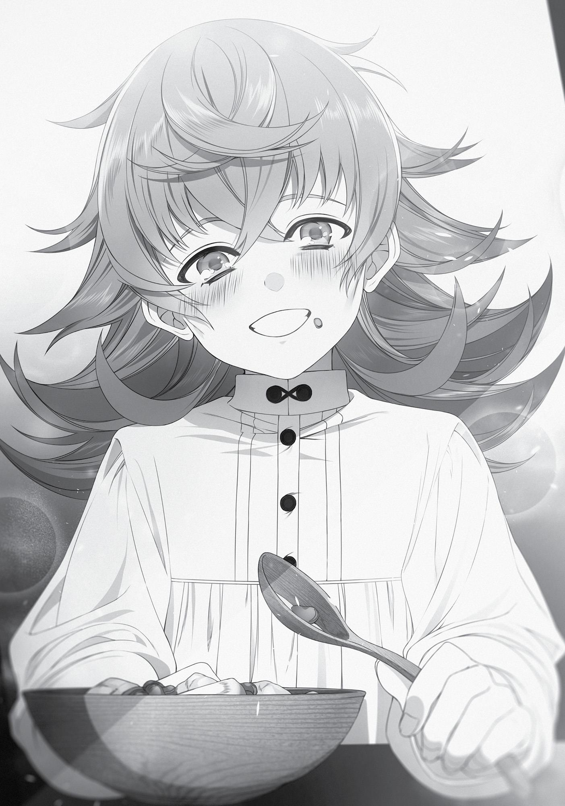

+++
title = "Chapter 6: An Unreachable Power (Part 2)"
date = 2026-07-20
weight = 6
[extra]
volume = 8
chapter = 7
+++

Chapter 6:
An Unreachable Power
(Part 2)

“N

ICE TO MEET YOU.

I’m, um, Fitz.”

Master Fitz was a bit nervous meeting Zanoba. Zanoba, on the
other hand, marched right up to him. “I am Third Prince of the
Shirone Kingdom, Zanoba Shiro—aaah!”
He was acting so arrogant that I hit him in the knees, forcing him
to stoop. I usually wouldn’t police how people conducted themselves
with a superior, but Fitz was an upperclassman, and Zanoba could
stand to lower his head a little at their first meeting, surely.
“Zanoba, Master Fitz is the one who proposed the solution
we’re using. Show him the appropriate amount of respect.”
When I said that, Zanoba bent at the waist. “Understood,
Master. It’s a pleasure to make your acquaintance. My name is
Zanoba Shirone, Third Prince of the Shirone Kingdom.”
“N-no, you don’t have to be so, um… formal. You’re a member
of the royal family, so please don’t stand on ceremony.” Master Fitz
waved his hands frantically as he positioned himself behind me.
Zanoba’s eyes widened. A great dissonance existed between a)
the rumors about Master Fitz, b) Master Fitz’s physical appearance,
and c) his actual mannerisms and speech. He was called Silent Fitz
and feared as a magician who could wield voiceless magic, but when
you actually talked to him, he was just any other person his age.
A kind upperclassman who looked out for his juniors.
“Well, now that the two of you have met, let’s get going.” With
that, the three of us moved out.
The slave market was in the Commerce District. The buying and
selling of slaves was a quiet affair on the Millis Continent and in the
Central Continent’s southern region, but the Northern Territories
were different. Here, most countries had legalized the buying and
selling of slaves, and some even endorsed it. The slave trade was an
essential part of the economy in the northern regions of the Central
Continent, so much that some countries would never survive without
it.
People became slaves for various reasons. There were those
orphaned during wars. There were those who were sold as children
by their parents when crop harvests failed and they had no other
options. There were also those who sold themselves as a way to save
their family. There was even a rumor that a slave ranch existed in the
darkest parts of the Thieves’ Guild. The Magic Nations were generally
prosperous enough that their citizens never had to resort to such
means, but further to the east were several desolate villages that
periodically sold off their children to slavers. Those slaves were then
recruited by the Northern Territories’ militia or mercenary bands, or
bought by the government to serve as cannon fodder during war.
Most importantly, the Asura Kingdom had its own connections
to the slave trade, buying up the most skilled or most good-looking
slaves they could find. They were a rich country; even the people at
the very bottom of their social ladder never knew hunger. Slaves
who made it to the Asura Kingdom were winners—though you’d
already kind of lost everything the moment you became a slave.
Slaves from the north tended to be hardy and talented, so many
traveled all the way up here to purchase them. As long as there was
someone out there selling people, there were buyers to be found.
Before setting out, I had gathered some information from the
Adventurers’ Guild. Large cities had multiple slave markets, and this
particular one had five. The less savory markets would sell off slaves
who were sick or even on the brink of death, and though there were
bargains to be found there, beginners like us wouldn’t know the
difference between a good deal and a scam. So instead, we made
our way to a market that was both beginner-friendly and aimed at
clientele with deeper pockets.
“Hm, this is quite unlike the market in my home country.”
Zanoba nodded in approval, as if he were impressed.
At a glance, the slave market looked like any other building. It
was plain, comprised of three mud-and-stone buildings. Above the
entryway were the words Rium Group - Slave Market. A brazier
crackled near the entrance, and beside it stood a man clad in thick
Arctic clothing topped with leather armor. He was thickly bearded,
but didn’t give off a disreputable vibe, though that might just have
been because I’d gotten used to seeing such types in my time as an
adventurer.
“So it’s not outdoors, huh?” Fitz remarked in surprise.
Slave markets were generally indoors affairs in the Northern
Territories. For a simple reason.
“Let’s go inside.”
A blast of hot air enveloped us when we entered. Crackling fires
were spread throughout the interior of the building, as were eight
stages where naked slaves were lined up—obviously, not something
you could do out in the cold if you cared about the slaves’ health at
all. The market I’d been advised against visiting was held outside.
“Hm, there’s lots of shops here. Master, where should we go?”
Zanoba asked.
“I’ve never done this before. Let’s just have a look around first.”
The eight different stores were all owned by slave merchants
under the jurisdiction of the Rium Group. They had rows of slaves for
purchase, ones they’d either bought or gathered from various places.
I wondered if they kept going until they sold all of their wares, or if
they were required to swap out with other sellers at a specific time?
The clientele gathered around them were fairly diverse: There
were adventurers like me, people in noble attire like Zanoba and
Master Fitz, townspeople, peasants, students, and merchants,
including some merchants shopping for resale opportunities. There
were even a few slaveowners in the mix, standing around with their
newly-purchased slaves and merrily chatting amongst themselves
The most shabbily-dressed characters might have been
pickpockets—no, they wouldn’t be able to slip into a guarded market
like this. Maybe they were slaves themselves, sent by their masters
to find additional slaves to purchase. I further secured the coin bag
hidden beneath my robes. Zanoba was the one funding the purchase
of the slave, but I was the one handling his wallet. We’d be in deep
trouble if someone came and along and swiped it from him, after all.
“Uh, um, wow… they really are all naked.” Fitz was looking at
the shops, his eyes wide with surprise. His face was bright red. I
couldn’t be sure because of his cloak, but he seemed to be
squirming, toes turned inward. “They, um, sure are big. So that’s
how they look…”
I followed his gaze to a group of lean, muscled slaves, probably
warriors. The female warrior in the center was particularly nice. She
was big. Not just her height, but the bulge of her chest, which was
enough to make your mouth water. You might think melons like
those would get in the way in combat, but I knew from watching
Ghislaine fight that that wasn’t the case.
“Is this your first time coming here, Master Fitz?”
“Huh? Oh, um, yeah.” Master Fitz scratched at the back of his
ear while shyly drawing his cloak tighter around himself, probably
trying to hide his erection. Exactly the kind of reaction you’d expect
from a virgin. I’d been like that once, though of course, I had a
different reason for not reacting now. “S-so, Rudeus, you’re used to
this?”
It made me feel a little triumphant to think I might have more
sexual experience than an upperclassman, but I’d only done it once,
myself. And my partner ran off after it. Nothing to be proud of.
Still, it was true that I felt calmer now that I’d experienced it
once. A bit too calm, as far as my lower half was concerned.
“I’m sure you’ll feel more at ease once you get some
experience,” I assured him.
“Y-you sure about that? Hey, wait, that means you have
experience…” He looked suddenly crestfallen.
Ah, you’re still so young, I thought.
“Master, we don’t want warriors, do we? We’re searching for a
race with dexterous hands that can use magic, right?” Zanoba jerked
his chin at us, as if to say that our conversation was irrelevant to him.
He had no interest in women, it seemed, even though he’d
technically been married once. Guess his libido was just entirely
absent.
“A race with dexterous hands—that’s gotta be a dwarf, right?” I
asked.
“A dwarf that can use earth magic. Though the latter is more
important than their race,” Fitz replied as we made our way around
the shops.
Despite the size of the market, there weren’t many dwarves
among the slaves. Most of the people on sale were clearly warriors,
and none had the dexterous hands we were looking for.
“Um, I think we could make do with a child even if they can’t use
magic yet, since Rudeus can always teach them that later,” Fitz said.
“Why a young one?” I asked.
“It’s easiest to learn voiceless magic when you’re young.”
“Oh, really, is that true?”
“Yeah, it’s almost impossible to learn once you’re older than
ten.”
Seriously? Although, come to think of it, Sylphie had been able
to use voiceless magic but Eris hadn’t. Perhaps their age had
something to do with it after all. “So it’s connected to age, huh?”
“Yeah. I might be mistaken, but this is the conclusion I’ve come
to on the basis of my personal experience, my master’s, and the
words of our professors. Also, if you start using magic by the age of
five, the size of your mana pool will drastically increase. If you want
to teach the slave how to make figurines using your method, then
the bigger the mana pool they have, the better.”
“I thought the size of a person’s mana pool was fixed at birth,” I
said.
“That’s incorrect. The textbooks may say so, but the truth is that
a person’s mana pool ceases to grow once they reach the age of
ten,” Master Fitz explained.
I see. That would explain why I had such a vast mana pool,
having started using magic when I was about two or three. And since
Master Fitz had said he was speaking from personal experience, he
probably harbored an impressively large mana pool, too. “Have you
also been using magic since you were pretty young?”
“Yeah. Well…a long time ago, my master saved me and I asked
him to teach me, which is how I learned.”
“Aha.” Maybe his master had saved him from monsters in a
forest, or something. No—if he’d been a child then, it was more
likely that he’d been kidnapped. There was a thriving business in
trafficking children in this world, and even with the sunglasses on,
Master Fitz was good-looking. “So your master can use voiceless
magic, too?”
“Yes. He’s amazing. I respect him deeply.”
“That’s great. I’d love to meet him,” I said. Meeting another
teacher of voiceless magic could help me improve my own abilities.
Master Fitz gave a bitter laugh. “Uh, I’m pretty sure that’s
impossible.”
“Really? I guess he must be a pretty important person.” Master
Fitz was bodyguard to a princess, after all, so his master might be a
court magician or something. Maybe he’d wound up being saved by
such a person, become their pupil, and as he grew older, the
princess’s bodyguard. Voiceless casting would be a piece of cake for
an Asuran court magician.
“He’s, um… not highly-ranked, but he is from the Fittoa Region.”
“Ah…” Someone who got caught up in the Displacement
Incident? So Fitz probably didn’t know where he was now. “I’m not
really sure what to say, then… I hope he’s still alive.”
“He’s still alive. I’ve found him, in fact.”
Come to think of it, he had said that he’d started looking into
teleportation to search for an acquaintance. So that was his master,
huh? “Wait, then why can’t I meet him?”
“Hehe. That’s a secret.” Fitz grinned toothily.
Why was it that my heart seemed to pound when I saw his
smile? Sure, I might swoon over fictional otoko no ko, but I wasn’t
gay. Maybe this was my body taking drastic measures in its pursuit of
recovery.
In keeping with Master Fitz’s suggestions, we settled on three
criteria as we searched for a slave.
One, they had to be around five years old (any younger than
that and there was a high probability they wouldn’t have a grasp of
language).
“Yeah, that seems fine.”
Two, they had to be a dwarf (for their dexterous hands).
“Most dwarves are good with their hands and have an
understanding of the fine arts.”
And third, they had to be a cute little girl (my personal
preference).
“A girl? I don’t mind either way, but Master, aren’t you losing
sight of our goal here?”
“Rudeus…”
It was my last requirement that led to both of them scolding me.
“Huh??”
We were all men here. It’d thought they’d agree with me, but I
guess they weren’t that type. Elinalise would probably have agreed
with me…actually, no, she might suggest a cute little boy instead.
She’d recently awoken to a love for shota, after all.
“That said, we can’t expect a five-year-old to have had much
education. If all they speak is the Beast God tongue, then we can
forget about trying to teach them magic.”
“I speak Beast God. I can educate them.”
“Truly, Master, you know the Beast God language? You never
fail to impress!”
“Heh, I guess.” I puffed up in pride at his compliment. I might
not look it, but I was multilingual, after all! I’d even taught a fiveyear-old in the past.
Speaking of which—I wondered how Sylphie was doing?
Elinalise and Master Fitz were testament to my fascination with
elves, whose slender beauty—both men and women—would appeal
to any old school fans of fantasy.
Sylphie had elf blood in her, and she would be about fifteen
right now. I bet she’d grown into a green-haired beauty, and judging
by what Paul had said, her magic skills had really advanced, too. Her
fame should be spreading far and wide, and I’d know her the instant
I saw her, I was sure. But I hadn’t heard a single whisper about
anyone fitting her description. I wondered where she was right now?
“At any rate, we’ve decided on our requirements, so let’s try
asking one of the merchants.”
I headed to the Information Center. Behind the desk was a
macho dude with a slick, bald head and a mustache. He seemed
puzzled when he saw Master Fitz and I, but then nodded in
satisfaction once he spotted Zanoba.
“Um, excuse me, we’re actually looking for…”
Macho ignored me and instead addressed Zanoba. “Hey there,
welcome. Whatcha lookin’ for? A fighting-type that can act as a
bodyguard? We have some available right now that can be taught
how to wield a sword. We do have some magicians as well, but you’d
probably be better off going to the university in that case. Or are you
interested in the type that can, uh, you know? Nah, you don’t even
have to say. I can tell by your mug that you don’t exactly attract the
ladies. We have one curvy girl in her twenties. A former prostitute,
so she’s pretty skilled, and of course she doesn’t have any diseases—
aaaah!”
The man took an iron claw to the face and was lifted into the air.
“Don’t ignore my master. I’ll rip out that ridiculous waggling
tongue of yours, and take your jaw off while I’m at it.”
“H-hey now! What are you doing?!”
Two guards swarmed in to subdue Zanoba, but he didn’t budge
an inch. In fact, all he had to do to fling them off was to shrug
slightly. Impressive, I thought. This tall, underfed otaku had totally
overpowered two brawny guards without even trying. So this was
the might of a Blessed Child, huh? Well, strength did seem to equal
power!
Oh, wait, I shouldn’t be spectating. “Stop! Zanoba, knock it off.
Down, boy!”
“Yes, sir!”
At the sound of my voice, Zanoba released the man. Now that
he’d stopped, that gave the security guards pause as well. I flipped
around to face them and bowed my head, as if that were the exact
moment I’d been waiting for. I wasn’t proud of it, but I’d perfected
the speed of my bow in these past couple of years. Speed equaled
swiftness!
“I’m terribly sorry about that, he just got a bit excited.”
“No, it’s fine… just, try not to go too wild, okay? We’ll draw our
swords next time.” They happily let it slide, and I pretended not to
notice the fear in their eyes.
The most unexpected thing, however, was Master Fitz’s
reaction. The moment the guards seized Zanoba, he stepped in front
of me with his wand raised. His movements were incredibly fast, but
unsurprising for a princess’s bodyguard. I guess I was the only one
acting like a chicken.
Well, whatever, on with the conversation!
“We’re looking for a dwarf, about five years old,” I said,
repeating our request to Macho.
The man trembled as he ran his eyes over the inventory list in
front of him. He flipped page after page and his eyes narrowed. “We
don’t really have many dwarves ’round here to begin with, especially
five-year-olds.”
It seemed our requirements were too specific, after all. Dwarves
mostly lived on the Millis Continent, to the south of the Great Forest
at the base of the Blue Wyrm Mountains.
“It doesn’t have to be a dwarf. If they’re dexterous with their
hands, that’ll do.”
“Oh, we do have one. Just one.” Macho tapped his finger against
a spot on his inventory list. “A six-year-old dwarf girl. Her parents
were in debt, so her entire family were sold off to slavery. She’s not
in the best of health, though. Malnourishment, I guess. Well, she’ll
probably be just fine once you get some food in her. She doesn’t
speak the human tongue, and since she’s only six, she can’t read,
either.”
“I see. And what’s the status of her parents?”
“We already sold them both.”
Come to think of it, I’d heard something in my adventuring days
about dwarves who thought they could make it anywhere as long as
it had a mountain. That logic worked fine if they left the Millis
Continent to work in the King Dragon Mountains, but every so often,
you’d get misinformed morons who came up north and found
themselves unable to do anything productive. This was a perfect
example of a worthless father whose entire family had to pay for his
stupidity.
“Well, why don’t we just go ahead and meet her then?”
Macho called out, and a merchant showed up. He was darkskinned and heavyset, most likely from the Begaritt Continent or
born to a parent from there. He was also sweaty, wiping himself
often with the damp cloth around his shoulders, but the market was
hot. I’d taken off my robe, and Zanoba had removed his cloak; only
Master Fitz remained fully-clothed. In fact, he seemed perfectly
comfortable, judging by the look on his face. Well, okay, his face was
bright red, but that was for an entirely different reason.
The merchant introduced himself, extending his hand in
Zanoba’s direction. “Greetings, I’m the branch manager for the
Domani store, a subsidiary of the Rium Group. My name is Febrito.”
Zanoba was reaching for the man’s face, so I forcefully took his
hand into mine and gave it a shake. “A pleasure, my name is Rudeus
the Quagmire.”
When I offered my name, the man looked dubious for a
moment, but his expression quickly shifted into a broad smile. “Oh,
so you’re Quagmire! I’ve heard of you. They say you took out a
straggler last year.”
“I was just lucky. My opponent was also weakened.”
Febrito took a brief glance over at Zanoba and Master Fitz. “I
hear you’re looking for a dwarf today?”
“Yes, this man over here will be funding the opening of a new
business venture. We’re looking for a child to drill with the necessary
skills from a young age.” It was a haphazard explanation, but it
wasn’t a lie.
“I see, I see. I can’t really recommend this particular individual
to you, but…why don’t you have a look first? This way, please.”
We followed Febrito out back and to the slave storage. Well, I
called it ‘storage’, but it was just lines of steel cages connected to
pulleys. Each cage was just about a single tatami mat wide, with one
or two people crammed inside. The merchants probably washed and
oiled them to give them a sheen before putting them on display, but
they were filthy right now, and a whiff was enough to make me
crinkle my nose. Upon closer inspection, I saw weeping children and
others with piercing glares full of murderous intent directed our way.
There were a few others like us, conversing with other merchants in
the storage area.
Febrito walked swiftly through the gaps between the steel
cages, calling out to someone standing at the edge of the pathway.
“Hey, is that one dwarf kid still alive?”
“Yep, she’s hanging on.”
“Where?”
“Over here.”
We went deeper into the storage area. The heaters didn’t seem
to work all the way back here, so it was a bit chilly. Febrito’s
subordinate stopped in front of a cage that held a girl with a blank
look in her eyes, seated with her knees drawn up to her chest.
“Well, bring her out.”
“Roger that.” Febrito’s subordinate nodded and opened the
steel cage, dragging the girl out.
The child had a collar around her neck and shackles around her
feet. Her skeletal body was covered by pathetic rags. Her hair might
have been orange once, but was now a disheveled, filthy mess with
strands of gray peppered throughout. Her face was pale and her eyes
were hollow as she wrapped her arms around herself, trembling. I
realized it was chilly, but that didn’t seem to be the only reason for
her quivering. It was a painful sight to behold.
“Strip her.”
Her shivering didn’t seem to bother Febrito’s subordinate, who
quickly ripped the rags right off her. Her deathly thin,
undernourished and underdeveloped body was left completely
exposed.
Master Fitz’s face screwed up as he watched. “Rudeus…”
Even I felt no desire for the equivalent of a child who might
appear in a Pulitzer Prize-winning photograph. I just wanted to hurry
up and buy her so we could get her a meal and a hot bath. However,
the girl’s eyes did concern me. Those empty eyes. I’d seen them
somewhere before.
“As you can see, she’s a dwarf. Six years old, so she doesn’t
really have any skills to speak of. Both of her parents were dwarves.
Her father was a smith, and her mother crafted jewelry. She should
have the dexterous hands you desire, assuming she’s inherited their
skill, but the only language she knows is the Beast God tongue. We
didn’t really think we could sell her, so her health isn’t in the best
condition, either. We’ll give you a discount on that account.”
Master Fitz looked troubled as he approached the girl, putting a
hand to her cheek. After a few seconds, her complexion improved a
bit. He’d probably cast something on her.
“And she’s a virgin, of course, so you needn’t worry about any
sexually transmitted diseases in the future. We’ll detox her just in
case, if you decide to buy her. Though I can’t really recommend it.”
Master Fitz looked at me like a child that had found an
abandoned puppy and brought it home with them. The girl met our
criteria…but those eyes really bothered me. I had to check for
myself.
“Hello there, miss.” I knelt down and called out to her in the
Beast God language. First, a conversation. An interview. “My name’s
Rudeus. What’s yours?”
“…”
“You see, there’s something I’d like you to do.”
“…”
“Um…”
She just stared back at me with those blank eyes, not offering a
single word in reply. Febrito’s subordinate reached for the whip
resting at his side, but I stopped him with my hand.
“Master, what is it?” Zanoba queried.
“She’s lost all hope. She’s got the look of someone who doesn’t
want to live anymore.”
“You’ve seen someone like that before?”
“Many times. Long ago.”
Both Zanoba and Master Fitz looked concerned, but I didn’t
intend to volunteer any more information about my past life if I
could help it. Nothing good could come of it.
The emptiness in the girl’s gaze brought back memories. I’d had
the same look in mine when I was around twenty. I had no schooling,
no hope for the future, no job prospects. All I could do was eat, crap,
and survive. My eyes had been empty back then, too.
In hindsight, it hadn’t been too late for me to turn things
around. But instead, I’d sunk further into despair, become even more
of a shut-in. My eyes had gotten even emptier. I’d lost all hope. I’d
wanted to die.
“Do you not want to live anymore?” I asked in Beast God.
“…”
“You feel like everything’s hopeless. I understand what that’s
like.”
“…”
Her gaze slowly settled on me.
“If it’s that bad, should I just end it for you?” My tone was lighthearted, but I meant what I said. There had been a time when I
genuinely wanted to die. And when I didn’t, I kept on living for a
long, long time that I’d come to regret.
I couldn’t save this girl. I could buy her clothes, I could feed her,
I could even offer her kind words. But I knew better than anyone that
that didn’t equate to saving her. It wasn’t saving a person to force
them into something that they didn’t want. If that were the case, it
was better to end it for her. If, like me, she could die and be reborn
into a better life, it might be best for her to call this one quits and try
harder in the next one.
There were plenty of people out there who, for their own selfsatisfaction, believed in platitudes like “you can do it if you put your
mind to it.” This girl was still young. She was just a child. after all.
Things might get better from here as long as she gave it her all—or at
least, that was what I wanted to say. But I couldn’t do it, even though
I’d continuously been told the same thing. Nothing short of death
had cured my stupidity.
I had no idea whether this girl was the same as me. Ultimately, it
all came down to whether the person concerned had the will to keep
trying. I couldn’t make that decision for her.
“…”
“Say something,” I said in Beast God.
The girl didn’t even flinch. She just very slowly opened her
cracked lips. “I don’t want to die,” she muttered in a small voice.
It was a half-hearted response, but it would do. It was okay if
she didn’t “want to live.” She at least didn’t want to die, and that
enough for now.
“We’ll buy her.”
I wrapped the robe I was carrying around her shoulders. Then I
used magic to warm her up and chanted a detoxification spell.
Healing magic wouldn’t do anything for her stamina, so we’d just
have to get some food in her.
“Mister Febrito, how much?”
She was the equivalent of ten Asura large copper coins. That
was her price.
We took the child to a wash area at the edge of the slave market
to bathe her, then headed to the Commerce District to purchase
clothes and other necessities. We finally wound up at a ritzy café—
not somewhere I’d have gone by myself, but Master Fitz was the one
who picked it. He fit right in, while Zanoba was completely unfazed,
as befitting of royalty. The girl we’d just purchased was wholly
focused on gulping down food, soiling the dress we’d bought her in
the process. I was the only one who felt uncomfortable in such fancy
surroundings.
Master Fitz seemed to be in good spirits. “Glad you like it,” he
said, as he stroked the girl’s head. “By the way, Rudeus, what’s her
name?”
“What’s your name?” I asked in Beast God.
The girl looked at me, puzzled. “Name?”
Huh? Was I not communicating the words clearly enough? I
hadn’t used the language for about three years now, but I’d done
fine in the Great Forest. Maybe those in the Doldia village had
indulged me the same way someone from Japan might indulge an
American who showed up in Tokyo and claimed to be fluent in
Japanese?
“Um, what are you called?”
“The child of Bazar of the Holy Steel and Lilitella of the Beautiful
Snow Ridge.”
I had no clue what was going on, so I just translated her words
verbatim. When I did, Master Fitz simply replied, “Oh, okay,”
nodding to himself with a knowing look on his face. “Dwarves don’t
get an official name until they’re seven,” he explained.
“An ‘official name’?”
“When they turn seven, they receive a name that’s fashioned
after something they’re good at, something they’re attracted to, or
something they like.”
So that was it. Master Fitz was knowledgeable as always. “Still,
we need something to call her,” I said.
“Her parents are gone. We’ll just have to name her ourselves.”
“We’re going to decide on your name, now. Do you have any
preferences?” I asked the girl myself, but she merely tilted her head.
I was starting to worry about her apparent cluelessness. Was she
really going to be able to make figurines?
“She’s a little girl. Let’s give her a cute name.” Master Fitz’s
reasoning sounded like something a girl would say. It made me want
to do the opposite and give her a tough-sounding name… but no, I
couldn’t do that. We had to do this right.
“Zanoba, let us hear your opinion!”
Zanoba glanced my way. “Hm? Are you sure it’s alright for me to
decide?”
“You’re the one who funded this venture, after all.”
“Then Julias it is,” he said, with no sign he’d given it any
consideration at all.
“Isn’t that a boy’s name?”
“Yes, it was once the name of my poor little brother. The one I
killed when I misjudged my own strength.”
I couldn’t quite control my face when he said that. I knew that
Zanoba had killed his little brother, and been dubbed the HeadRipping Prince for it, but didn’t know how to react to the indifference
with which he spoke. Master Fitz just looked confused.
“She’ll be staying in my room, won’t she? She should bear a
name that I feel a connection with.”
True. Zanoba’s room was one fit for royalty, and hence very
spacious. My room would have worked, too, especially since I spoke
a language she understood, but it just seemed more natural for her
to stay with Zanoba, given that he was the one with all the money.
You needed a permit to buy slaves and then have those slaves live
with you, and such permits were easier for royalty to obtain.
“Well, that’s fine, but at least make it Juliette. She is a girl, after
all.”
“That’s fine with me. Juliette it is, then.”
“Juli… ette, hehe, that’s a good name.” Master Fitz laughed
merrily, as if he found something about the name amusing.
“From today, your name will be Juliette,” I relayed to the girl in
Beast Tongue.
“Julie…?”
“Juliette.”
“Julie,” she said with a clumsy grin. Close enough.

And that was how Juliette (nicknamed Julie) came into Zanoba’s
care. As Zanoba and I started training her, she began to slowly follow
after and support him in various aspects of his otherwise messy life.
At night, I tutored her in voiceless magic and the human tongue.
Before she went to bed, Zanoba would brainwash—I mean, instruct
her by means of rambling lectures on dolls and figurines. He also
made her go through dexterity-developing exercises with him,
probably because he still wanted to be able to make figurines by
himself someday.
In the meantime, there was still no sign that I’d achieve my true
objective any time soon.
