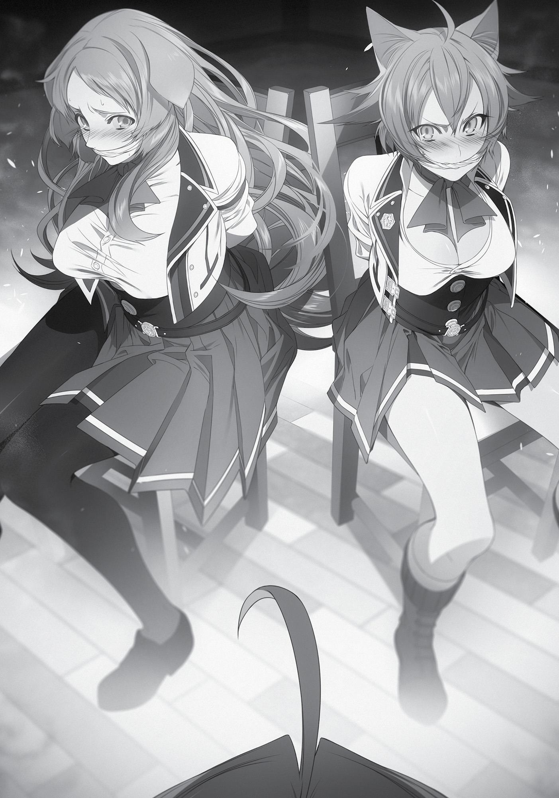
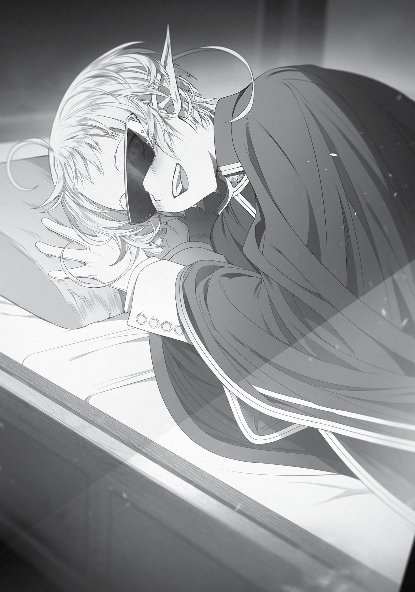

+++
title = "Chapter 8: The Kidnapping and Confinement of Beast Girls (Part 2)"
date = 2026-07-20
weight = 8
[extra]
volume = 8
chapter = 9
+++

Chapter 8:
The Kidnapping and Confinement of Beast Girls
(Part 2)

W

E RETURNED

to my room. Before us were two beast girls in

uniforms, one with cat ears, the other with dog ears. Their hands
were bound behind their backs with cuffs made of earth magic, and
gags were stuffed in their mouths. Zanoba and I both sat in chairs,
waiting for them to wake up.
What, you ask? Wasn’t I going to take the opportunity to do
something while they were out? Don’t be a fool! I was a gentleman.
“Mrggh?!”
“Mmm! Mmm!”
The two of them woke. They realized the situation they were in
at once, and started groaning noisily.
“Good morning,” I said quietly before standing up, looking down
at the both of them.
They twisted their bodies and looked up at me. There was
concern in their gaze, but they were still glaring at me.
“Mmm!” A groan of resistance. They clearly didn’t understand
the situation they were in.
“Now then… where should we start this conversation?” I put my
hand to my chin as I regarded them both. Their skirts had flipped up
from all the twisting around they were doing, exposing their tenderlooking thighs. Truly a sight to behold.
“Mm?!” Pursena realized what I was looking at. She wiggled her
nose, sniffing, and her expression turned to one of unease. Her sense
of smell told her what it was I was looking at and thinking about. In
contrast, Linia seemed clueless, still glaring me down and huffing at
me. It seemed Pursena had the better nose.
Page | 183

Page | 184

In all actuality, given the illness that plagued me, there
should’ve been almost no scent of arousal coming from me.
“Hm.”
It was then that I suddenly thought of something. I had two high
school girls with animal ears bound before me, their clothes
disheveled, completely unable to move. It was insanely stimulating.
Perhaps it could cure my condition?
I’d heard Asura’s noblemen were prone to perverted fetishes. It
was possible that losing my virginity had awakened something
similar in me. I certainly hadn’t had anything against this kind of
thing in my previous life, though it wasn’t what I would’ve called a
fetish, either.
My mind made up, I decided to test it out. I wiggled my fingers
as I reached toward the enormous mountain range on Pursena’s
chest. She snapped her eyes tightly shut, a terrible look on her face,
like she was being tortured. Like I was doing something horrifyingly
cruel to her.
You know, there are women out there in the world that do the
same thing to mens’ chests without showing any restraint, I thought.
That aside, her breasts felt amazing in my hands. They really
were huge, after all. But I only felt a faint sense of arousal. No cries
of joy from my little man, no signs that he might be waking from his
long slumber.
When I released my hold on her, the arousal dimmed instantly
and only that suffocating sense of loneliness remained. The same
sensation I always felt. I guess this wasn’t going to do the trick,
either.
Pursena looked confused when I released her. She sniffed the
air again and her expression turned to one of relief, before a
conflicted look came over her face.

Page | 185

“Master? Is that how you’re going to punish them?” Zanoba
asked.
I looked at Linia. The moment our eyes met, she glared at me
angrily, so I went and felt her up too. Her chest was smaller than
Pursena’s, but she still had quite the impressive assets. Doldia
women seemed to be well-endowed in general.
But as before, it wasn’t enough to delight my tom cat. The only
noticeable change was the mounting humiliation and anger in Linia’s
gaze.
I’d heard BDSM enthusiasts got off on watching such a gaze
grow distorted as the person sank deeper and deeper into despair.
I’d had some appreciation for such fetishes in my previous life, but
seeing something on a computer screen was completely different
from seeing it in real life. There was nothing for me to get out of this.
The experiment was over.
“Do you understand why you’re in this predicament?” I asked
them. The girls exchanged glances and shook their heads. Linia
looked ready to shout, so I removed Pursena’s gag instead.
After thinking for a moment, she blurted out, “I’m pretty sure
we haven’t done anything to you.”
“Oh, so you’ve done nothing to me, huh?!” I purposefully
repeated her words, snapping my fingers. Zanoba timidly carried
over a box. Once opened, it revealed the tragically fragmented Roxy
figurine. “Aren’t you two the ones who did this?”
“Ugh… what about that creepy figurine?”
“Creepy!” I repeated her words again. Was she calling Roxy
creepy?! The Roxy that I’d poured such care into?! The one that sold
instantly because it was such a masterpiece—that was creepy?!
No, calm down. Let’s be cool about this. Deep breaths. Breathe
in… and out. Breathe in… and out!

Page | 186

“This is a symbol of my God.”
“Y-your God?”
“That’s right. I was able to go out and discover the world
because she saved me.” I moved to the edge of my room as I spoke.
There sat my altar. The altar that was the first thing I’d set up when I
came to this room. I opened its twin doors and let them see the
interior.
“Mm!”
“Wh-what’s that?”
“M-Master, is that…?”
“…”
They were both struck by the divinity of the object of worship
that was enshrined within. Even Zanoba shrank back, and Julie
grabbed the hem of his shirt, looking like she was about to cry.
“That figurine was created in the image of my God. And the two
of you kicked it, trampled it, and shattered into pieces.”
Linia and Pursena widened their eyes, looking back and forth
between my face and the altar, then slowly to Zanoba and Julie,
before finally turning back toward me again. Their faces had gone
absolutely pale. And by pale, I mean blue. Blue like a computer
bluescreening. But at least it seemed they understood what they’d
done now.
“Now, do you have some way of justifying your actions?”
Pursena took a few seconds to think over my question. Then she
said, “Y-you’ve misunderstood! The one who stepped on it was Linia.
I told her to knock it off.”
“Mm?!”
Instead of apologizing, she made excuses. Very well then. This
seemed like it’d make for an interesting spectacle, so I removed

Page | 187

Linia’s gag. When I did, the two of them started screeching at each
other in shrill voices.
“Pursena’s the one who said, ‘You don’t need something like
this, it’s creepy,’ mew!”
“But you’re the one who stepped on it!”
“My foot slipped, mew. Besides, you also kicked it up in the air
at the end, mew! And you giggled when you saw Zanoba searching
for the fragments all the way into the night, mew!”
So he’d searched for the fragments all night—some of them, like
the shattered ankle, were as small as the tip of my little finger.
Zanoba, my pupil. My affection for him increased threefold. He was
headed straight down my romance route. Way to go, Zanoba!
Anyway. Back to business.
“Shut up! You are both equally responsible.” First, I put an end
to their disgraceful attempts to throw each other under the bus.
Then, I declared judgment. “Heretics must be punished. That said,
my religion is newly established, so I haven’t yet decided on the
punishment in these cases. How would such a crime be punished in
your village?”
“I-If you do something weird to us, my father and grandfather
will have your head, mew! They’re the two strongest warriors in the
Great Forest, so… ah…” Linia paused, seeming to remember that I
knew Gyes and Gustav, too. This made me remember my
punishment back in the Great Forest.
“Mister Gyes? Ah yes, I remember. He wrongfully accused me of
doing something reprehensible to the Sacred Beast, so he had me
stripped naked, had freezing cold water poured on me, then left me
inside a cell for seven days. Right, then. Why don’t we do the same
thing to you two?”
Just to be clear, I wasn’t holding a grudge over that stuff at all.
I’d been a bit peeved about it at the time, but it’d been an overall
Page | 188

enjoyable experience in the end, despite the circumstances—not
that Linia and Pursena knew that. They were speechless, their faces
turning ghostly white. Apparently, that method of punishment was
considered a horrific form of torture to the beastmen.
“N-no, we’ll do whatever you want, so anything but that, please,
mew!”
“You can do whatever you want to Linia. So at least have mercy
on me!”
“What she said, mew! You can do whatever you want to me…
gwah?!”
What a farce. They both showed no signs of remorse.
Particularly the mutt.
“You Doldia were cruel in your punishment when it came to
your beloved Sacred Beast, you know? Granted, they did apologize
once they realized I’d been wrongly accused… but in this case, the
two of you are definitely guilty.”
“Please, forgive us. We didn’t know that figurine was so
important!”
“I’m sure you didn’t,” I agreed.
“And we won’t do it ever again.”
As if I’d ever let it happen a second time! You could never get
back something that had been destroyed. These two could never
understand what it felt like to watch something precious to you be
ruined before your very eyes. Even now, I remembered the sight of
my younger brother smashing my computer in with a bat. I had no
intention of dredging up those old feelings, but I could still taste the
despair I felt at that time. The feeling of having my only source of
support shattered into pieces!
“We’ll apologize, mew. We’ll even show our bellies to you,
mew.”
Page | 189

“That’s right, it’s embarrassing but I’ll do it!”
Show me their bellies? Ah, that beastfolk form of kowtowing
that Gyes did for me. An insincere kowtow wouldn’t be enough to
quell my emotions.
“If you want me to forgive you, put my figurine back together
the way it was!”
R-o-x-y, R-o-x-y!
“That’s right! Even Master is incapable of restoring it to its
former glory!” Zanoba chastised them.
But Zanoba, my pupil, that isn’t true…
The pieces were all there, and the most important part, the
staff, was completely unharmed. My skills had also improved since I
first created it. I could now make figures smoother, without any
noticeable lines where the segments joined together.
Wait.
That’s right! I could fix it. It wasn’t as if it was beyond repair.
“…”
As soon as I realized that, my anger quickly dissipated. They’d
apologized, and were reflecting on their actions. Maybe I should
forgive them? In fact, what I was doing right now was a crime. If
word of this got out, I might be the one in hot water. Such as, for
example, if a certain spear-wielding baldy were to happen upon this
spectacle…
No! That wasn’t the problem here! The issue was that these two
had no compunction about destroying something that was precious
to someone else. And if I were to show them kindness here, they’d
surely just do the same thing again! I needed to drill this lesson into
them so that they understood! Upon my name as a follower of Roxy!
But now that I’d cooled down, I couldn’t think of any satisfyingly
diabolical forms of punishment.
Page | 190

“Zanoba, do you have any ideas?” I asked.
“Let’s have them face the same fate as my figurine!” He had a
ruthless look in his eye. . It seemed his heart was still full of anger,
which made sense—he’d witnessed the crime.
If I agreed, the two of them would likely be torn to pieces like
the shattered Roxy figurine. Zanoba would violently rip them apart
with his hands. He’d become the tyrant Splatinus. He’d do it. This
man would definitely do it. The Head Ripping Prince was still alive
and well.
“No. Killing them would be going overboard. I don’t like
murder.”
“Then let’s sell them off as slaves. The sale of Doldia tribesman
is forbidden I believe there is a family in Asura with an intense love
for them. Someone would surely pay handsomely for slaves like that,
even if it meant breaking the treaty.”
…now he wanted to start a war with the beastfolk? This was
going a bit too far.
“That might be difficult, considering the family you mentioned is
on the brink of destruction right now,” I said.
On that note, I wondered how the Boreas family was currently
doing? I hadn’t heard much about them since I’d been in the
Northern Territories. They were in a bad position. It seemed only a
matter of time before the whole family was wiped out.
“Listen to me, Zanoba. Jokes aside, they are princesses. We
need to choose something with a low impact, or we’ll suffer the
consequences later.”
“You never cease to amaze me, Master. Even as angry as you
are, you still have the mind to think of self-preservation.”
Hmm. What to do with them? I wouldn’t feel satisfied just
releasing them as-is. In fact, it might be better to just keep them like
Page | 191

this forever as a feast for the eyes. They weren’t really my type, but
they were still beautiful women.
No, no, no. I might have already gotten myself into trouble by
kidnapping them in the first place. I couldn’t hold them here for long.
I could restore the figurine, and they did seem to be reflecting on
their actions.
I wanted to do something to bring this incident to a satisfying
end, but… hmmm.
“And that’s what happened.” Unsure of what to do, I had turned
to Master Fitz, as had become a habit of mine lately. He had an
answer for just about anything I brought to him.
“W-wait just a second. So they’re being held in your room right
now?”
“Yes, they are. Don’t be alarmed, though, I’ve already informed
their teachers that they won’t be attending classes today.”
“Um, so you’re saying you captured them and, uh, confined
them, with Zanoba’s help?”
That sounded about right. I’d imprisoned two animal-eared
beauties. It sounded like something I’d have put on my bucket list in
my previous life. Granted, it would have been for what came after
the confinement, but that was something I was unable to accomplish
in my current state.
“Rudeus, um, uh, since you imprisoned them, did you…?”
Master Fitz’s face was bright red as he looked at me, eyes filled with
disapproval.
Oh no, it seemed he’d misunderstood. “No, no, I haven’t done
anything perverted to them.”
Page | 192

“R-really?” Master Fitz asked.
“The worst I did was grope their chests,” I assured.
“S-so you did touch their chests…!”
“I wanted to test something.”
“Huh..? So you didn’t touch them for other reasons?”
Other reasons? He was probably asking whether I’d touched
them with sexual intent. I suppose you could say that I had, broadly
speaking, but from my perspective, it was really an attempt to treat
my condition. Just a single experiment. “No, it wasn’t for other
reasons.”
Master Fitz’s expression relaxed slightly. “A-alright then. But
there is one problem. Despite how they behave, they are still
descendants of tribal leaders.”
“Don’t worry. I’m acquainted with the Tribal Chief and Warrior
Leader.”
“What?! Seriously?”
“Yes. So if I tell them I knocked the girls down a peg because
they were slacking off at school, I’m sure they’ll understand.”
“J-just how did you get to know the Tribal Chief? The Doldia are
so aloof toward other races… It’s exceedingly rare to ever meet
someone like the Tribal Chief.”
I told Master Fitz the story of my time in the Great Forest. I
realized as I talked about it that it was quite a pathetic episode for
me. I’d tried to rescue children, only to be captured, then spent
every day since my release playing with a dog and creating figurines.
“Wow, you really are amazing, Rudeus.” It was a pitiful story,
and yet, Master Fitz let out a breath of astonishment as I finished.
What part was he impressed by? “For the Sacred Beast to take such a
liking to you… That’s amazing.”

Page | 193

Oh, that part. Now that I thought about it, why had the Sacred
Beast come to see me all the time? Surely, it wasn’t just because it
liked me.
“I suppose even a mutt can tell when someone is their savior.”
“You better not use that word in front of the beastfolk,” Master
Fitz warned.
Of course not. I’d be furious if someone mocked Roxy in front of
me by calling her a disgusting demon, after all. I knew some lines
shouldn’t be crossed. ‘Mutt’ was a term of endearment between the
Sacred Beast and I, not a term of condescension.
“That aside, I could use your wisdom on this matter. How can I
teach them a lesson without incurring resentment or revenge down
the line?”
“That’s a difficult question.” Master Fitz hummed in thought. “I
do agree that ganging up on someone, then destroying their
belongings, is unforgivable.”
I’d thought he might tell me to just release them both, but his
anger seemed to be stoked by the fact that they’d targeted someone
he knew. Considering his actions in the slave market, Master Fitz
might be a person with a strong sense of justice.
“Okay! I have a good idea,” he said.
A line like that was usually asking for bad luck in fiction, but oh
well. Master Fitz and I set off together toward my room.
An acrid smell drifted through the air in my room. The floor was
damp, the room stank, and Linia and Pursena were limp with
exhaustion. Perhaps I should’ve let them use the bathroom.

Page | 194

They both looked uncomfortable, so I used magic to clear up the
mess and opened the window to let in fresh air. I stripped them of
their soiled skirts and underwear and wiped them down. Their
clothes went in the laundry. Hey, they weren’t completely naked.
That was enough.
I glanced at both of their faces, to find that each had a look of
complete surrender.
“You can be violent with us if you want, mew. But even if you’re
going to keep us in your room, at least unbind us, mew. It’s painful
not being able to move at all, mew. Please, we promise we won’t
run, mew.” Being tied up for almost twenty-four hours must’ve been
hard for a cat-type beastfolk.
“At least let us eat something. We’ll be good. I won’t howl at
night. I won’t bite you, either. I want some meat… I’m so hungry.””
Apparently, Pursena was the gluttonous type. Now that I
thought about it, she’d been chowing down on some meat back
when we first met. Still, I couldn’t believe they’d both given up after
just one day. Must be the lack of food. People were weak in the face
of hunger, after all.
I released them both, and they knelt in front of me. An
extremely arousing sight, given they weren’t wearing anything on
their lower halves. My lips curled in delight at the sight, but of
course, my crotch didn’t show the same interest.
“Rudeus,” Master Fitz cautioned. He was nearby, washing their
skirts and underwear.
“Oh, right. It looks like you’re both remorseful, so I’m
considering forgiving you. I know that probably doesn’t do much to
alleviate whatever emotions you’re feeling right now. It’s rough not
being able to move for a whole day. You must’ve been scared stiff,
stuck in a dorm full of sex-hungry men.”
“That’s right, mew.”
Page | 195

“Every time I heard footsteps, I thought it was the end…”
Actually, as far as I knew, there weren’t any such men here. It
wasn’t like the dorm residents were being confined within these
walls. If they were that horny, they could visit the pleasure district,
or pay a visit to one of the recent first years, an elf woman rumored
to be a beauty. Perhaps that Linia and Pursena feared danger
because of the resentment they’d provoked in other students? Then
again, there were quite a few people who, if they found two girls tied
up, would just carry them off to the slave market.
“We’ll do what you say from now on, mew. We’ll be your
followers, mew.”
“Please forgive us,” Pursena added. It seemed they had given a
lot of thought to their actions.
“You don’t have to be my followers. But the one thing I won’t
tolerate is you making fun of Roxy.”
They both paled and nodded quickly. “Of course not, mew. If
you mock someone else’s God, you deserve to die, mew.”
“I remembering being chased by those Temple Knights… it was
terrifying,” Pursena said.
“My aunt is a member of the Temple Knights, actually.”
As I said that, the two girls turned an even ghastlier shade of
white. Connections sure were a valuable currency in this world.
When Fitz was done, they gladly slipped their clothes back on.
(Why was it so arousing, I wondered, to watch a girl put her
underwear on? For me, personally, it was even more stimulating
than watching them take it off.)
With the immediate danger gone, and their clothes returned,
the girls regained some of their usual spirit.
“Even though I said we’d do whatever you say, anything that
might result in a child is off the table, mew,” Linia told me. “I want to
Page | 196

date someone properly first, then get married and have children,
mew.”
“Agreed,” said Pursena. “But I’ll allow you to feel up Linia’s
boobs occasionally.”
“Yeah, mew. Occasionally you can—wait, why me?!”
“I cost too much. You can only touch mine if you give me
expensive meat.”
Apparently, despite being delinquents, they had firm stances on
their chastity. I should’ve expected as much, given that they were
princesses. That aside, it seemed the meek attitude they’d had up
until a moment ago had partly been an act. I hoped they really were
reflecting on their actions.
“Careful, Rudeus,” Master Fitz warned. “Don’t let your guard
down around them.”
“Mew?! Hold on there, Fitz, don’t say stuff like that, mew!”
“Yeah!” Pursena agreed.
“The boss is a monster with a few screws loose! If he defeats us
again, there’s no telling what he’ll do to us, mew! We’re not dumb
enough to try!”
Who were they calling a monster? How rude. Though I’d sleep
soundly at night if I knew that was what they thought of me.
“Boss, can we go home now?” Pursena asked, tilting her head
slightly. Wait, why was she calling me boss? Not that I minded… “I’m
hungry. I want to go back to my room and eat my stockpile of jerky.”
“Yeah, we’ve been here since last night without any food or
water, mew.”
What the heck? Now they were making me sound like the bad
guy. Maybe they still hadn’t learned their lesson, after all.
“You haven’t learned your lesson, have you?” Master Fitz said.

Page | 197

“Fitz, this has nothing to do with you, mew.”
“That’s right. Fuck off.”
Master Fitz looked stunned.
“Both of you, sit down!” I yelled.
“Yes, sir!”
“Woof!”
“Master Fitz, I changed my mind. Please do as we discussed.”
As the two of them sat there, their legs neatly folded before
them, I gave Fitz the go-ahead and he retrieved some items from his
pocket. This had been his aforementioned good idea—a bottle full of
black paint and a brush.
Once it was over, my anger had almost completely dissipated.
“…Fitz, we’ll remember this, mew.”
“Fuck.”
Linia and Pursena had bitter looks on their faces. Their brows
had been connected in a unibrow with eyes doodled on their eyelids.
Each had a mustache painted around their lips. Finally, on their
cheeks were the words “I’m a dog who lost to Rudeus,” and “I’m a
cat who lost to Rudeus,” respectively.
A whole new kind of body paint. It was actually kind of arousing.
“This special paint is used by a certain tribe to pattern their
bodies,” Master Fitz explained. “If I chant the right incantation, the
marks will become permanent.”
Such paint actually existed? Must be this world’s version of a
tattoo. Come to think of it, I was pretty sure I’d seen something
similar in my time as an adventurer.
Page | 198

“Even water will never wash it off. If you ever turn on Rudeus,
I’ll use the incantation and you’ll have those marks on your faces
forever!”
“F-fine, we get it, mew. You don’t have to yell, mew.”
“We get it. We’ll obey. We swear.”
They nodded, trembling with fear. Well, their faces did look
pretty gruesome. If they had that paint on them for life, it would play
havoc with their marriage chances. Master Fitz was quite cruel.
“You can go home for now, but you need to keep that on your
faces all of tomorrow. Then I’ll take it off. But I won’t remove the
paint on your bodies for the next six months, so keep that in mind!”
We’d written some pretty obscene things on their backs.
“We get it already, give us a break, mew.”
“…sniff.” Pursena had tears in her eyes.
It would raise questions if the girls were seen walking down the
halls, so they left through the window. We were on the second floor,
but they were more than equal to the task of climbing down—or at
least, I assumed so.
Before they left, Linia turned to me as if she’d just thought of
something. “Boss, you were able to predict our movements, even
though you’re just a magician. What kind of training did you do for
that?”
“Nothing special. I followed my master’s teachings and moved
accordingly, that’s all.”
Most likely, it was proof that my training with Eris had been
productive. I’d always thought of myself as weak. In contrast to how
fast Eris grew, I felt like I wasn’t growing at all. But maybe it was just
that we were growing at different speeds, and I had gotten stronger
in my own right, after all.
“Who is your master, mew?”
Page | 199

“Uh, that’d be Ghislaine, I guess.”
“Ghislaine? Do you mean Ghislaine of the Doldia tribe, mew?
The Sword King Ghislaine?”
“The very same.” That was right—since Linia was Gyes’s
daughter, that made Ghislaine her aunt.
“I see then, mew.” Linia looked as if it all made sense to her
now. “See ya, mew.”
“Later, boss. We’re really sorry about the figurine.” And the two
of them left.
Once that was over, Master Fitz heaved a sigh. “Sorry, Rudeus. I
got a bit carried away.”
“Not at all. I got to see them both look terrified, so I think that
went well.” But more importantly… “You said something about a
special incantation that makes the paint permanent. What if there’s
someone else here who knows that incantation, too?”
Since this was a tool that existed in the world, Master Fitz
couldn’t be the only person who knew the incantation. I’d feel bad
for the girls if someone else used the chant on them.
“What? Oh, that was a lie,” Master Fitz said coolly. “Magic paint
does exist, but the one I used was just the cheap kind used for
drawing magic circles. It’ll disappear if you wash it away with mana.”
He giggled as he spoke. Almost like a child who’d successfully
pranked someone. It was incredibly endearing.
Master Fitz stayed in my room for a while. He was fidgety for
some reason, as if he couldn’t calm down. He wandered aimlessly
Page | 200

about, only pausing when he found something peculiar so he could
ask me about it.
“What is that? Is there something in it?” His discerning eyes
turned toward my altar.
“It houses a relic of my religion’s God,” I replied.
“Huh? So you’re not a follower of Millis, then. Do you mind if I
take a peek to see what’s inside?”
“It’s called the Roxy Faith… please don’t open that!” I hurriedly
stopped him when he tried to open the altar’s doors. The relic within
was so divine it would be dangerous for human eyes to look
upon…and it might put him off to see me keeping women’s
underwear. I must’ve lost my mind, showing it off to so many people
yesterday.
“Oh, I’m sorry.” He quickly withdrew his hand. As he continued
to look around the room, his gaze traveled to my bed. He lifted my
pillow. “This makes a rustling sound when you touch it.”
“I made it myself.” It was filled with the seeds of a Mustard
Treant, one of the monsters that lived in the forests of the Northern
Territories. If you broke the seed open there was a nut inside that
looked similar to a walnut, but its shell resembled buckwheat chaff.
I’d broken it down and stuffed it into a pillowcase, then covered the
outside with beast fur. With that, my restful sleep was assured.
“Wow. Do you mind if I try it out?”
“Go ahead.”
Master Fitz put the pillow down and settled upon on the bed.
“This is a good pillow.”
“You’re the only one who’s ever said that.” Admittedly, the only
other person who’d tried it out was Elinalise, who said, “I’d prefer a
man’s arm over a pillow.”

Page | 201

Fitz kept his sunglasses on even as he lay on the bed. He must
be particular about them. I wondered if eventually he’d let me see
his face some day. Unless those sunglasses were just a part of him. I
wondered…what would happen if I reached out and took them off?
No—he’d said there was a reason he kept them on. Maybe he
had a complex about his looks, for example. Let’s just forget about it,
I thought. I didn’t want him to hate me.
Silence fell between us for a while. Realizing that I was looking
at him, Master Fitz lifted himself up. For some reason, I thought that
his cheeks looked red, but it was probably just my imagination.

Page | 202

Page | 203

“You want to see?”
My heartrate accelerated the moment he said that. What was
this? Did I want to see what? What was it that he thought I wanted
to see? “See what?”
It was such a stupid question. His face, of course. The answer
was so obvious based on context.
“My face.”
Yeah, see. His face. Why didn’t I think of that first? Like I was
anticipating he’d show me something else. He was a man, so what
was I getting excited about seeing? Just what part of him did I want
him to show me?
We gazed at one another through his sunglasses. I felt like my
face was heating up. Maybe my cheeks were getting red, too. “I want
to see.”
“Okay,” he said, placing his fingers on the edge of his frames.
But they just stayed there, frozen still. His lips tensed nervously, and
his hands seemed to tremble. It had the same vibe as a girl with her
fingers hooked on her panties; a girl who was standing in front of a
man, about to take off the last article of clothing covering her body.
Somehow, I felt nervous too. No—what the heck was I feeling
nervous for? Comparing this to a girl stripping was totally out of
place!
Did he consider revealing his face to be an intimate act? No, that
was absurd. He probably just had some prominent feature he was
self-conscious about. Like a big burn scar, or eyes that bulged like a
chameleon’s! Yeah, that had to be it. No doubt.
“Just…” Fitz finally spoke. “Just kidding! Sorry, but these are
Princess Ariel’s orders. I’m not allowed to show my face to anyone. I
have a baby face, and it would destroy the reputation I’ve built as
the fearsome Silent Fitz.”

Page | 204

I was wrong. It was royal orders, apparently. Well, that made
sense. What kind of nonsense had I been dreaming up?
“O-oh, so that’s it. Well, I have no intention of forcing your
hand.”
“Um, thanks, I appreciate you saying that,” he said, hastily rising
from the bed. “I better hurry to attend to Princess Ariel.”
“Alright, take care.”
“Sure thing. See you later, Rudeus.”
“Thanks for your help today.”
“No problem.” Master Fitz also slipped out the window, just as
the two beast girls had done earlier. As much as I wanted to tell him
to use the hallway, going out the window was probably faster if he
was going to the girls’ dormitory. Oh well.
“Phew…”
For some reason, I felt kind of relieved. If Master Fitz had shown
me his face… I felt like it might lead to something we couldn’t take
back. It almost felt like I was being invited to step into a world that I
couldn’t leave once I’d entered. A world of gay desire, maybe.
I was now alone in a room that still held a lingering beastly
stench. I dusted it with some deodorizing powder typically used by
adventurers, then lay in bed. My pillow smelled unusual; I assumed it
was Master Fitz’s scent. It wasn’t unpleasant.
“That aside…”
I’d put myself in some pretty arousing situations with the
kidnapped girls, but still seen no signs of recovery. The erotic vistas,
the groping…none of it had helped. In fact, being alone with Master
Fitz had more effect than anything else. I felt like crying.

Page | 205

The next day, we showed Zanoba the graffiti we’d left on the
two before erasing it. The expression on his face said that wasn’t
enough to mollify him, but I chided, “It’s not like you really helped
out this time, did you?” Then I applied some emergency repairs to
the Roxy figurine, whereupon he immediately broke into a smile and
forgave the girls.
I also apologized to them for keeping them tied up for more
than a day, but…
“It’s no big deal, mew! Nothing happened, mew, we just lost
and he took us back to his room and drew on our faces, that’s all,
mew!”
“What she said. Nothing happened. Really, nothing. Brrrrr…”
If that was the version of the story they wanted to tell, so be it.
A happy ending for all.

Page | 206

Side Story:
Sylphiette
(Part 2)

I

SAW RUDY AGAIN TODAY,

walking down the hall. I’d been spotting

him often of late. Just a few months ago, he’d been trudging along
alone, but now he was usually accompanied by Zanoba, Julie, Linia or
Pursena.
Even then, I couldn’t talk to him. I was always busy attending to
the Princess. I wished Rudy would be the one to reach out to me, but
he didn’t seem to remember who I was. Our eyes had met countless
times, but he never showed signs of recognition. He must see me as
nothing more than one of the Princess’s Attendants.
In the meantime, I had to watch as Rudy and Pursena left to
attend a healing magic class. Why did it have to be Pursena? Was
Rudy into girls like her? Was it his relation to the Notos family that
gave him a preference for big breasts? Pursena’s ample bosom could
be seen from afar. All beast women were generously endowed,
including Linia, but Pursena was exceptional.
Linia and Pursena idolized Rudy, referring to him as “Boss.” They
were all special students, which made them closer. Perhaps he and
Pursena were already in a romantic relationship. I couldn’t think of
any other reason they would be taking a healing class together.
No—Rudy was an earnest student. He could be taking the class
for academic purposes. But why was Pursena taking it with him? He
might be sitting next to her during class, teaching her things. Just like
he used to do with me, so long ago. They might be sharing the same
textbook, leaning in close… Ugh! Just the thought made me
depressed.
“What’s wrong?”

Page | 207

I snapped out of it when the Princess called out to me. At some
point, we’d reached the student council room. We were alone now,
not a soul around us.
“It’s nothing.” I spoke formally when other people were around,
but preferred being more casual when I could. The Princess wouldn’t
reprimand me for it.
“If you’re certain. Just a moment ago, it seemed like you were
watching Rudeus.” The Princess smiled. A smile that wasn’t fake. A
smile that implied she found watching me entertaining.
I got a bit huffy. “I already said it was nothing.”
“Every time Rudeus passes by, you track him with your eyes.”
“Am I not allowed to?”
“No, I never said that,” she replied, though her smile clouded
over, as if to say, however… “I do feel a little irritated at Rudeus for
not remembering you.”
“Huh?”
“You’ve had such strong feelings for him, all this time, but it’s
like he doesn’t remember you at all.”
“Well… but, I mean, I haven’t told him my name. Who knows?
Maybe he does remember me.”
I’d recognized him the moment I saw him, but he still didn’t
know who I was, and that simple fact had turned me into a coward.
The Princess stared at me with surprise “You haven’t told him
your name?”
“Uh, um… no. I haven’t told him.”
“Oh… You told me that he didn’t remember you, so I just
assumed…” The Princess looked bewildered, glancing over at her
Knight.

Page | 208

The Knight had a complex expression on his face, as well. “You
haven’t even told him your name?”
“Well, it’s not like I have a choice. What if I tell him and he still
doesn’t remember me?” I said, pouting a little. The Knight pulled a
face that seemed to say he’d made a mistake. “What’s with the
face?”
“Ah, it’s nothing.” He seemed reluctant to say it. “Princess Ariel,
what do you think of this?”
“Hm, well, it seems she’s more of a coward than I thought.”
Ariel whispered those words, but I heard them. Of course, I had
nothing I could say in my defense. It was true that I was acting like a
coward.
“Personally, considering how striking Sylphie’s hair color is, I
think it’s a bit heartless of Rudeus to still not recognize her.”
“Agreed.”
I put a hand over my hair as they said that. My hair, which I’d
been relentlessly teased for when I was little. Even so, there was no
way Rudy would be able to recognize me from that alone.
“Princess Ariel, I’d like you to leave this matter to me,” I
requested.
“Luke, do you have any good ideas?”
“He is a descendent of the Notos line. If you throw a curvy
woman at him, I’m sure that will—”
“Absolutely not!” My cry echoed through the room. For a
moment I didn’t even realize I had spoken. It was only because the
Princess and her Knight looked right at me that I it hit me—I had
shouted. I instinctively put a hand over my mouth, then apologized
for raising my voice at two people higher in status than me. “I’m
sorry.”

Page | 209

Neither of them criticized me for it. Instead, they traded
complicated looks and began whispering to each other. This time
their voices were so hushed that I couldn’t hear the contents of their
conversation. They were probably discussing how to deal with me.
Or Rudy. Either way, I had a bad feeling about it.
“Sylphie,” said the Princess.
“Yes?”
“Can I ask you a question? It’s something I’ve asked you many
times before.”
The Princess didn’t seem to be angry. The look on her face
approached frustration, if anything. Maybe she was annoyed to hear
that I hadn’t even told Rudy my name yet.
“Isn’t there something you want to do?” she asked.
“There isn’t. Right now, all I want is to work in a way that
benefits you, Princess,” I said after a brief silence.
Upon hearing that, the Princess lifted her chin, as if she were
looking down at me. It was rare for her to do this. But even though
her eyes were narrowed, she was still smiling. “So that’s how you
feel.”
“Is there something wrong?”
“Perhaps you haven’t realized it yet.”
To tell the truth, I knew what she was trying to say. I knew, but I
couldn’t answer her honestly. It would be like betraying her if I did.
“Sylphie.”
“Yes?” I meekly looked up at her. When I did, she smiled. Not a
fake, doll-like smile, but a relieved one, the kind I only saw once or
twice a year. No, not even that often. When had I last seen her smile
like that?

Page | 210

As I stood there, bewildered, the Princess said, “I won’t rush you
on the Rudeus matter. I don’t mind if you use Fitz, either. Do
whatever you like.”
And then I remembered. I used to see her look like this more
often when we first met. But I hadn’t seen it since we arrived in the
Magic City of Sharia. A carefree smile.
That night, I huddled in my blanket, thinking things over. I knew
what it was that I wanted to do. In fact, I’d known all along. I wanted
to get closer to Rudy. I wanted to become friends like we used to be,
to share light-hearted laughter, to play together, to have him teach
me things, to rebuild our relationship and return to what we once
were. I didn’t want the same kind of relationship I had with the
Princess. I wanted to be Rudy’s equal, to stand beside him, shoulderto-shoulder.
That was what I wanted right now. No—it was what I’d wanted
ever since we lived in Buena Village. But it was surely not in line with
the Princess’ objectives.
The Princess wanted Rudy as one of her followers, but Rudy was
clearly avoiding her and her associates. Maybe he could sense her
intentions, considering how smart he was. If I got closer to him, so
would the Princess, and Rudy might misunderstand. He might think
I’d just done it for the Princess’s sake.
Or maybe he wouldn’t. Maybe he’d just come to adore her like
everyone else did, and serve her and assist in fulfilling her goals.
“Urgh…”
I didn’t want that. Why not?
I knew the answer. I didn’t want Rudy to become just like
everyone else. I didn’t want to see him become her follower, take a
knee and receive her commands. I knew that was why she’d
summoned him to the school, and I hadn’t objected at the time. But
Page | 211

Rudy was special to me, and I wanted him to remain that way. I
didn’t want him to be with someone else. I didn’t want him to serve
my friend.
“…”
I wanted to get closer to him. I didn’t want Linia and Pursena to
get closer to him. I didn’t even want him to become a follower of the
Princess, someone I was supposed to want to help. I knew what I
wanted, and I knew what it meant for me to want it.
“Urgh…”
As I reached that conclusion yet again, I was filled with
embarrassment. I instinctively hugged the blanket tightly around
myself and curled into a ball. I could feel my cheeks heating up as I
shut my eyes.
I wanted to have an exclusive relationship with Rudy.

Page | 212
