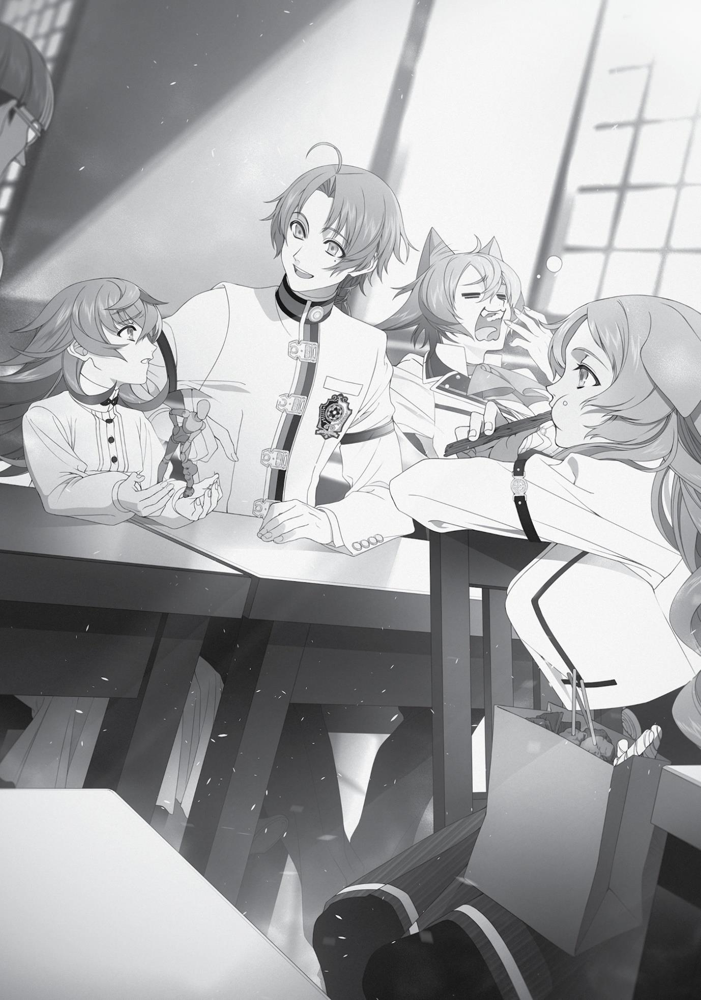

+++
title = "Chapter 1: The Prodigy's Secret (Part 1)"
date = 2026-07-20
weight = 0
[extra]
volume = 9
chapter = 1
+++

Chapter 1:
The Prodigy’s Secret
(Part 1)

C

LIFF GRIMOIRE,

the grandson of the Millis Church’s reigning

Pope, was a highly gifted young man with a particular talent for
magic. Unfortunately, Cliff was also hot-tempered, egotistical, and a
pompous braggart. As a result, he had no friends whatsoever. Cliff
was sixteen years old at present; in other words, he’d come of age a
little more than a year ago. But no one had celebrated that milestone
with him.
Still, the young man did have his virtues. For all his boastful talk,
he worked very hard to succeed, rather than leaning on his natural
talents. There were some, at least, who noticed this and respected
him for it.
Cliff had come to the Ranoa University of Magic for a simple
reason: he’d gotten mixed up in an ugly power struggle back home.
Following the attempted assassination of a Blessed Child near the
city of Millishion several years ago, an internal conflict within the
Millis Church had grown increasingly intense and violent. Cliff’s
grandfather, who happened to be the Pope, had shipped him off to
the far side of the world for his own safety.
Cliff remembered his grandfather’s parting words to him
perfectly: “You have the potential to be a great man someday, Cliff.
Don’t let yourself grow self-satisfied; know your flaws, and work to
overcome them.”
The young man knew that much was expected of him. And at
the time, he found that reasonable enough. He was a prodigy, after
all. Perhaps not as talented as the brilliant young swordswoman Eris,
whom he’d seen defeat a group of trained assassins in the blink of an
eye; but a prodigy nonetheless. He’d always believed himself to
possess special gifts.
The Kingdom of Ranoa, which Cliff reached following a long and
difficult journey, proved to be a harsh land. The food didn’t agree
with him, the climate was severe, and many of the locals behaved in
ways he found strange and off-putting.
Still, he trusted that his sheer talent would see him through any
challenge. He was a Special Student, the grandson of the pope, and
the man who’d one day take charge of the entire Millis Church;
surely that meant he was a cut above the rest.
To Cliff’s surprise, however, he was embarrassed twice in his
first year at the University.
The first humiliation came at the hands of a young man named
Zanoba Shirone. Zanoba was a Blessed Child, bestowed with certain
divine gifts at birth. He was a somewhat unstable individual, true.
But his physical strength was genuinely astonishing. Cliff had once
seen Zanoba seize a man three times his weight by the head, lift him
off the ground, and effortlessly toss him to one side.
Despite his fearsome capabilities, Zanoba had enrolled at the
University of Magic, where he studied spellcraft like all the others. By
Cliff’s standards, his progress was painfully slow, but it wasn’t like a
Blessed Child had much need of magic. In fact, some scholars
theorized that magic had originally been developed by the ancients
as a means to help common people imitate the divine powers. And,
of course, a Blessed Child was a human manifestation of those very
powers. There was hardly any reason for one of God’s elected to
trifle with casting spells.
Eventually, Cliff had approached Zanoba and pressed him for an
explanation. “Why are you even bothering to learn magic, Zanoba?”
“That’s simple enough,” the young man had responded. “I’m
pursuing a goal that means everything to me.” Reaching into a box
he carried with him, Zanoba retrieved a single figurine… which he
then proceeded to speak about at great length. The majority of this
monologue meant nothing to Cliff, but it was clear that Zanoba had
nothing but praise for the quality of the little figure’s design and
manufacture.
“I wish to apprentice myself to the man who made this figurine,
and to spread such wondrous figurines across the world. For this to
happen, I’ll have to learn to make figurines myself! Before I’m
reunited with my master, I must master at least the basic spells
necessary for this purpose. I’d be too ashamed to face him
otherwise! And of course, I have a few figurines I’m dying to create
with my own two hands.”
The man had a dream. This was something that Cliff himself
lacked. He had given up on his own dream some time ago. Given his
position in the world, there’d been no other choice but to do so.
Still… Zanoba, too, was a person of some importance. As a Blessed
Child, he carried the hopes of his countrymen on his shoulders. Once
he returned to Shirone, he would surely have no real leeway to
choose his own path in life. And yet, he still clung to some thread of
hope—planning for the possibility that some day, he might be free. If
he ever had the chance, he wouldn’t hesitate to choose his own
destiny.
Such were Cliff’s impressions, at any rate. They were based on
assumptions that were not entirely accurate. He knew nothing of the
events that had taken place back in Shirone, or of Zanoba’s actual
standing there. Still, his interpretation left a deep impression on him.
He found himself looking at Zanoba with real respect—even
admiration.
“Who is this ‘master’ you keep talking about, anyway?”
“He is a magician known as Rudeus Greyrat.”
Cliff found himself at a loss for words. Rudeus Greyrat. It was a
name he’d filed away in a dark corner of his mind, ever since the day
Eris had rejected him. He’d never expected to hear it again in this
place, spoken by a man he’d just come to respect.
It was a harsh blow to his ego.
The second of Cliff’s humiliations came at the hands of two
older students.
As one might expect, Cliff believed himself to be the single most
powerful mage enrolled in the University. There were plenty of
people who could overwhelm him in a close-range brawl, of course,
but he thought himself clearly superior as a magician at the very
least. He was a genuine prodigy, while the others were merely
students. Even the professors were often no match for his skills. In
short, he thought himself essentially invincible.
It took all of two months for him to be rudely disabused of that
notion. His defeat came at the hands of two beastfolk girls, said to be
among the strongest students in the University. Their names were
Linia and Pursena.
It was hard to say who exactly provoked the fight. Cliff was a
sharp-tongued young man, and he’d spoken to them with open
arrogance. Linia and Pursena were less aggressive than they’d once
been, but they weren’t about to let a cocky first-year talk down to
them. Cliff didn’t even recall exactly what he’d said to finally set
them off. But the fight itself he remembered very clearly. He’d
attempted to cast an Advanced spell; Pursena had quickly fired off
Beginner-level magic, interrupting his incantation and restricting his
movements. Linia then drew in close and beat him black and blue.
In the aftermath of this very public defeat, Cliff retreated to his
room to cry in solitude. He told himself that it wasn’t a fair fight.
He’d been outnumbered, after all. He hadn’t really lost.
But a few days later, he learned that another student named Fitz
had previously defeated both Linia and Pursena in an instant. And
that news came as a real shock.
There was always someone better out there. Obvious as it might
sound, Cliff had never learned this lesson personally until now. The
fact that he knew so much Advanced magic did not, in itself, make
him powerful in combat. This, too, was something he had just begun
to understand.
Cliff took all this very hard. Yet from that day he redoubled his
efforts to improve himself. He was too proud to learn from his
professors, let alone from other students. Instead, he tried finding
his own ways to refine his craft. It proved a struggle, but he kept at
it, doggedly seeking to eliminate his weaknesses.
In time, however, he entered his second year at the University…
and received another pair of shocks in quick succession.
The first shock was the enrollment of Rudeus Greyrat.
The boy wore shabby grey robes, and the uncertainty on his face
betrayed a lack of confidence. He was servile and submissive to
everyone he met, putting himself down at every opportunity; he also
routinely leered at every nearby woman. There was nothing manly or
appealing about him whatsoever.
He was, in other words, virtually the opposite of what Cliff had
pictured when he heard Eris and Zanoba speak of “Rudeus.” Was this
even really him? Could it be someone else with the same name? It
seemed like a legitimate possibility.
But Zanoba acknowledged Rudeus as his “master,” and the boy
knew about Eris as well. And so, Cliff concluded that he simply had to
be a fraud. Somehow, he had deceived both Zanoba and Eris with a
pack of lies and a few devious tricks.
The evidence seemed to support this theory. When challenged
by Linia and Pursena, the boy instantly bent and scraped to avoid a
conflict. If he was a truly powerful magician, he surely wouldn’t have
hesitated to put them in their place.
In conclusion, Cliff reasoned that Rudeus would be exposed as
the fraud he was soon enough. Linia and Pursena were fearsome
fighters, and Zanoba was a diligent young man with divine powers at
his disposal. Bluffing and trickery would only get you so far in an
environment like this one. There were rumors flying around that
Rudeus had defeated Fitz. But this was presumably either a
misunderstanding of some sort, or a lie that Rudeus himself was
spreading. If he had won somehow, he must have resorted to some
underhanded trick. Cliff felt quite confident of this.
However, Rudeus soon demonstrated that his skills were real.
He could cast magic freely without the need for incantations. In no
time at all, he made Linia and Pursena his loyal subordinates, and
somehow won even more admiration from Zanoba. Even Fitz
seemed to recognize his skills: soon they were seen studying
together at the library every other day. And despite Rudeus’ obvious
abilities, Cliff had even seen him attending classes—lectures on
elementary Divine and Barrier spells. He had no real need to learn
such basic magic, surely, but he seemed to have an innate hunger for
knowledge of all kinds.
Rudeus Greyrat was just as devoted as Cliff was, and
considerably more talented. More importantly, his actual
achievements were far more impressive.
This would normally have been very painful for Cliff to admit.
But for some reason, he found himself readily able to accept the
facts. Perhaps it was because he’d already met Zanoba, and lost to
Linia and Pursena. He could admit, to himself at least, that this
Rudeus was destined for greater things than he was.
This didn’t mean he liked the boy, of course. That was a very
different matter.
The next and final shock was of a somewhat different nature.
It struck Cliff without warning one evening, as he was walking
back to his dorm and happened to look upward.
He found himself gazing at a goddess. She was leaning on a
windowsill with a listless expression, letting her luxuriant golden hair
flutter in the breeze. The setting sun cast a red glow on her shapely
face.
Cliff was instantly smitten. He’d fallen in love at first sight. He
had always been drawn to beauty of this sort. Back in his more
childish days, when he’d dreamed of living as an adventurer, he’d
also pictured himself marrying a gorgeous woman. In fact, a pretty
young Healer who sometimes paid visits to the orphanage where she
grew up had been a big part of the reason Cliff developed such a
strong interest in adventuring.
All of a sudden, the woman in the window glanced down at Cliff.
With a small smile, she waved her hand.
It was all so… picturesque. So perfect. Cliff was deeply, deeply
moved.
I was born to meet this woman, he thought. And she was born to
meet me. In that instant, his first love Eris was demoted in his mind
to the status of an acquaintance.
Rudeus

T

HE TIME HAD COME

for my monthly appearance at homeroom. I

was sitting at my desk, closely surrounded by Zanoba, Julie, Linia,
and Pursena. It felt kind of nice to be at the center of my own little
group for once.
As usual, Linia was leaning back in her chair with her feet on the
desk, flaunting her shapely thighs without a hint of shame. Another
nice perk of my new position was getting to see those up close and
personal on a regular basis.
“You never stop starin’ at my legs, Boss,” said Linia with a
teasing smile. “Heheh. I guess you’re just another tomcat at heart,
huh? Can’t blame ya, though. I’m criminally sexy… Ehehehe. Go on,
take a little peek inside… Myaaah! Get your hand outta there!”
I’d reached under her skirt without hesitation or
embarrassment. But groping at her thighs just made me feel empty
inside. Nothing makes a man more miserable than a frustrated libido.
“Mew?! Don’t look all disappointed! You’re the one who
decided to grope me! What’s so bad about my legs, anyway?!”
To be perfectly honest, I found more pleasure in touching her
ears or tail lately. At least petting something fuzzy was relaxing.
“You’re such a moron, Linia,” muttered Pursena, munching away
on a slab of something just outside the range of my hands. That girl
never seemed to stop eating meat. Sometimes it was jerky,
sometimes it was grilled, and sometimes it was raw, but she was
always eating in some form or another. She herself was a tough,
cool-headed girl, but if you waved a little meat in her direction she’d
come trotting over to you with her tail wagging wildly. Her fur was
softer than Linia’s, and felt really nice under your hand. But unlike
Linia, she wouldn’t let me pet her unless I offered her some food
first.
On the other hand, if I did bring her some meat she’d let me do
basically anything I wanted. She seemed to have some fairly oldfashioned views about chastity, but I was a little worried someone
might take advantage of her.
“Hmm… Master, look here,” said Zanoba. “I’ve made the angle
of this ankle worse, haven’t I?”
“Let me fix that for you, sir,” offered Julie, looking over at the
figurine.
“I would rather that you called me Master, Julie. Take care to
address Rudeus as Grandmaster, also.”
“Okay, Master.”
Our resident prince seemed to be carrying on about the same as
ever. Still, it did feel like he’d fallen to the bottom of our little group’s
hierarchy. He’d tagged along for my fight with Linia and Pursena, but
I basically ended up defeating them singlehandedly. Linia had
compared him scornfully to a hyena skulking around in the shadow
of a lion.
For his part, though, Zanoba seemed more concerned with his
status as my “first student.” Of course, he was technically the fourth
person I’d taught, after Sylphie, Eris, and Ghislaine. With Ghislaine
there’d been a mutual exchange of information, so you could
probably take her off the list… but that would still leave Zanoba at
number three.
When I mentioned this to him, however, he looked so
heartbroken that I instantly regretted it. To soften the blow a little, I
told him he was my first student when it came to making figurines.
Julie, my second figurine-making student, always listened
intently to Zanoba’s lengthy diatribes about his beloved Roxy
figurine. He’d communicated enough of his passion to her that she
sort of understood what he was talking about; I’d noticed her
growing interest in making figurines on her own initiative. Still, it
would be some time before she could discuss the finer points of
design and technique the way Zanoba and I did.
Just as importantly, though, she’d started to take her first
clumsy steps as a silent spellcaster. Master Fitz was right on the
money when he suggested that learning magic at an early age was
the best way to master that skill.
“…I couldn’t do it, Grandmaster.”
“That’s okay.”
For all of Julie’s progress, she was still young and made many
mistakes. This time, the figurine’s legs had come out swollen like
water balloons. She didn’t have the control necessary to use Earth
magic precisely on such a small scale. I never got angry or frustrated
with her, of course. I encouraged her to keep trying, telling her not to
worry about her mistakes. Success never comes easily, and giving up
after one failure is a good way to turn yourself into a sulky shut-in
loser.
“I guess you’re not quite ready to be fixing dolls yet, huh?”
“I’m sorry…”
No matter how kindly I spoke to Julie, there was always fear in
her eyes when she looked at me. Apparently, I intimidated her.
“Meeeew… I’m so sleepy…”
“Yeah. It’s getting warmer out and all.”
“Hey, Boss. We’ve got a great spot for midday naps, ya know?
How about we show you sometime?”

“Hmm? Can I do naughty things to you while you sleep, Linia?”
“…Do you ever think about anything but sex, Boss?”
“Don’t be absurd. Figurines are always first in my master’s
thoughts.”
“Ah, pipe down, Zanoba. No one asked you.”
“But I—”
“Put a sock in it. How’s about you go buy us some meat?”
“Ain’t much time till the teacher gets here, mew.”
“Guess he better run, then.”
“Master Zanoba, I can go instead…”
“I’m not going to let a little girl run errands for you. Why don’t I
go instead?”
“Mew? Don’t be stupid, Boss! I’d rather go myself!”
“Oh yeah? Well, knock yourself out, then.”
“Meow?!”
The five of us were chattering pretty loudly. I imagine it was
pretty annoying; we weren’t the only people in this room, after all.
There was one other student in the classroom. Namely, Cliff
Grimoire, who’d been studying all by himself up front during our
entire conversation.
All of a sudden, he jumped to his feet and turned back to us, his
shoulders trembling with fury. “Will you people please shut up?! I
can’t concentrate! If you’re just going to play around, go back to
where you came from and do it there!”
I immediately shut my mouth. Zanoba also stopped chattering,
and returned to quietly instructing Julie.
Our two ex-delinquents, however, chose to interpret Cliff’s
outburst as a challenge.
“Who d’you think you’re mouthing off to, kid?”
“From now on, your money is my meat!”
You might expect them to be a little more hesitant to pick a
fight, given that I’d beaten them solidly. But I’d heard they went a
round with Cliff soon after he enrolled and had beaten him easily;
after that, he’d devoted himself wholeheartedly to his studies.
I had to admire a guy who used his setbacks to motivate himself.
It wouldn’t be right to harass such a diligent student. “Sorry about
that, Cliff,” I said, interrupting. “Didn’t mean to distract you from
your studies. We’ll keep it down from now on. Come on, you two.
Down. Down!”
“…If mew say so, Boss.”
“Fuck…”
Linia and Pursena flounced back into their seats, looking rather
surly.
“Hmph,” Cliff snorted. “Well, that’s all I wanted. Honestly, you
people are ridiculous… I can’t believe you’ve roped Zanoba into your
nonsense.”
Linia and Pursena clicked their tongues, clearly irritated. Still, I
didn’t see any reason to mess with someone who was working hard
to get ahead in life. I didn’t think of myself as a slacker, either, but
Cliff and I were clearly heading down very different roads. We’d
never be anything more than acquaintances.
Or so I thought at the time, at least.
A week later, I was researching teleportation with Master Fitz at
one of our regular library sessions.
Recently I’d begun to understand that teleportation bore certain
similarities to Summoning magic. The magic circles used were very
much alike, and the color of the magical energy they released when
activated was almost identical.
They were totally different in one respect, though. It was totally
impossible to summon a human being. There was simply no known
way to do it, even with the most advanced and complex of
techniques. You could call forth fiends, spirits, and even plants, yes.
But not a person. I’d pored through countless records, myths, and
ancient histories without finding a single reference to anyone
summoning a person. There were many races in this world, including
the various tribes of Demonkind, but this rule seemed to apply to all
of them equally.
This didn’t have any direct relevance to what we wanted to
know, of course. Maybe it wasn’t a meaningful insight. But there was
something about it that nagged at me. You couldn’t summon a flesh
and blood person. Fair enough. But what about their soul?
I didn’t voice these thoughts, but I did file them away quietly. If I
ever met a real expert in this field, I’d have to ask them about the
possibility of summoning the spirit of a dead man from another
world.
“Master Fitz, could you try to find out if there are any professors
who know a lot about Summoning for me?”
“Huh? Well, sure. But they don’t really teach that here, you
know? Except for Enchantment, I guess. I’m not sure we’ll find
anyone who knows about the kind of stuff we’re researching…”
Come to think of it, I’d noticed a distinct lack of Summoning
classes on the list of courses offered here… although Enchantment
was technically a subcategory, from the sound of things. Had I read
something about that in one of my textbooks? “Well, it can’t hurt to
poke around and see what you find, at least.”
To be honest, a small seed of uncertainty was growing inside me
at this point. I didn’t let it show, of course. I was probably mistaken.
The Displacement Incident had occurred when I was ten—a whole
decade after I was reincarnated in this world. Surely those two things
weren’t connected? Ten years had passed without anything
happening, after all…
With a hint of anxiety still lingering in my mind, I left the library
and headed for my dorm by the light of the setting sun. The latest
snowfall had mostly melted away; patches of red-brown earth were
visible across the courtyard, and the paved stone path was clear. As I
followed it toward my destination, I heard a shout somewhere
nearby.
“Get back here, you little shit!”
“You think we’re gonna let you cast a spell?!”
In the next instant, a young man burst out from behind a school
building, followed by a group of six older men who were obviously
chasing him. The young man was trying to gain enough distance from
his pursuers to cast an Advanced spell, but they kept interrupting his
incantation. He switched to Beginner-level magic, trying to slow
them down, but it wasn’t enough. The group of six closed in and
knocked him to the ground, then kicked at him viciously as he curled
into a ball.
I’d stumbled across a blatant case of schoolyard bullying, from
the looks of things. It was painful just to watch; I couldn’t stop myself
from intervening. “Hey, c’mon. Give it a rest, guys,” I called out as I
trotted over. “No need to pick on that poor turtle.”
The six bullies turned and glared fiercely in my direction. They
were all a little taller than I was, so I guess they were trying to
intimidate me. “Who the hell are you supposed to be?”
After a moment, though, one of them recognized me. “H-Hey,
that’s Quagmire…”
“Quagmire? Wait, you mean Rudeus?!”
“That Rudeus?! The guy who locked Linia and Pursena in a room
and trained them?!”
Now, now. There wasn’t any training involved, I assure you.
“That story’s a load of bull.”
“But I saw Pursena wag her tail and calling him Boss…”
“She wags her tail for anyone who gives her meat!”
“But they do what he tells them now, right?”
“Yeah. I saw them in class with that writing on their faces.”
“What did it say again? ‘We are Rudeus’ love slaves,’ right?”
“Well, I don’t remember exactly how it went…”
“Damn. He beat them up and then enslaved them?”
“They’re Doldia princesses, man!”
“The guy doesn’t even think about the consequences…”
After loudly whispering these highly inaccurate rumors, the
group of bullies swallowed in unison and stared at me in something
like awe. They looked each other in the face, nodded, and then
turned their attention to the boy lying at their feet. “All right, kid.
We’ll let you off the hook for today.”
I quickly pounced on that comment. “For today? Are we going to
have a repeat on our hands tomorrow, then? You planning to gang
up on him again?”
The six bullies grimaced in irritation.
“Tch…”
“Look, uh… Mr. Greyrat. This doesn’t really have anything to do
with you, does it?”
Guys like this loved trotting out that line. Yes, yes. This wasn’t
any of my business. I knew that before I stuck my nose into it. “I
don’t know what happened, but six-on-one just isn’t a fair fight.”
The group exchanged looks, then shook their heads. They were
evidently pretty good friends, judging from their ability to
communicate silently. “Okay. Fine. We’ll leave the kid alone,” said
one of the group. “But just so you know, it’s not like he’s the victim
here.”
With that, he turned and walked off, heading behind the
building. The other five followed. Maybe they had a little base of
operations set up back there or something.
Once they disappeared, I let out a small sigh of relief. It wasn’t
easy keeping cool when six people were glaring at me like that. I’d
worked out some strategies for fighting when I was outnumbered,
but it still took some effort to keep myself from turning tail. I was
fine staring someone down one-on-one at this point, though.
“Hey. You all right?” I walked over to the bullied boy as he
struggled to his feet. He brushed the dust off his clothes, quickly
murmuring the incantation for a Healing spell. In this place, even the
kids who got picked on were apparently competent magicians…
The boy turned to face me. It was Cliff.
“…”
Honestly, most of my interactions with this guy had been pretty
unpleasant. Whenever we bumped into each other, he was openly
hostile toward me. He was probably going to say something like “I
didn’t ask for your help!” and then stalk off angrily.
“I didn’t ask…” Halfway through the sentence, Cliff paused and
frowned in thought. After a moment, he let out a small sigh. “…Sorry.
I appreciate the help, Rudeus.”
“Oh. You’re welcome.”
The young mage bowed to me just a little, then walked briskly
off. I stood there and watched him go, feeling a little startled. It was
true that I’d come to his rescue, but that sudden change in attitude
seemed very weird. It almost made me think he was plotting
something.
Still, it was probably best to take things at face value for the
moment. Cliff had been hostile to me for some time, but I’d never
snapped back at him. Maybe he’d finally figured out that I wasn’t his
enemy. Honestly, I didn’t understand why he’d decided to hate me in
the first place, but…
“Well, whatever.” I shrugged, and walked off toward my dorm.
The next day, Cliff asked me to speak with him behind our
school building.
He was angry. I didn’t have the first idea why, but it was written
all over his face. It seemed like this might come to violence, so I’d
activated my Eye of Foresight beforehand and was carefully
monitoring my surroundings. I also had a good bit of mana gathered
in my right hand waiting to be used.
Honestly, though. Turtles these days. Talk about ingratitude.
“Okay, we should be fine here.”
After checking that there was no one else in the area, Cliff
turned to face me. His face was flushed an interesting shade of red.
I quickly realized that I’d misinterpreted the situation. He hadn’t
called me here to fight me. If anything, this looked more like a classic
love-confession scene. This was a little awkward. True, I hadn’t been
able to perform with the ladies lately, but that didn’t mean I was
ready to start studying Male Anatomy 101.
It’s tough being so sexy, heh heh.
“S-So here’s the thing, Rudeus…”
“Yes?” I already knew how I’d reply, of course. It was important
to give him a clear, definite answer. We were going to start off as
friends. And also end that way.
“Well, I’ve fallen in love with someone,” Cliff continued,
scratching his cheek and bashfully studying the ground.
“N-no kidding?” Man, was I really going to have to shoot this
poor guy down? The thought made my stomach hurt. I couldn’t help
thinking about how I might have reacted if he was a girl… but my
sword had its preferences, and they weren’t about to change.
To my surprise, however, Cliff looked up and pointed off to the
side. “That’s her, right there.”
He was indicating a building a little way off in the distance.
There was someone inside, looking out an open window. Her long
blonde hair fluttered in the breeze as she gazed at the setting sun
with a melancholy expression on her face.
“I saw you two talking this afternoon. You know her, right?
Uhm… would you be willing to introduce us?”
“…Er, sure.”
The person standing at that window was a woman I knew all too
well. She was a notorious troublemaker, the subject of countless
rumors—and a voracious predator who chewed through her fellow
students with all the vigor of a succubus.
In other words, it was Elinalise Dragonroad.
