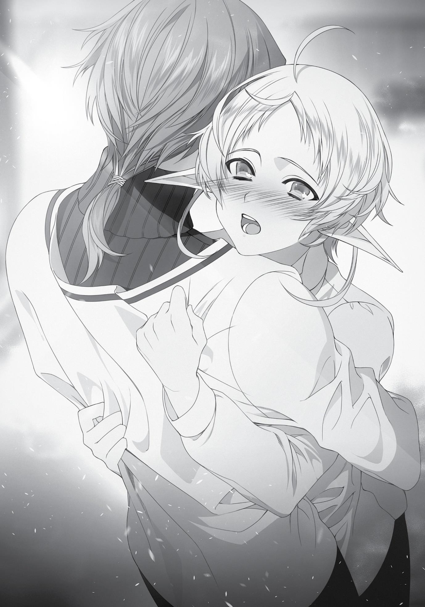

+++
title = "Chapter 11: The Final Push"
date = 2026-07-20
weight = 12
[extra]
volume = 9
chapter = 13
+++

Chapter 11:
The Final Push

I

T TOOK THREE DAYS

for me and Rudy to make it back to the city of

Sharia. In that time, we talked about all sorts of things. One of the
major topics of conversation was what Rudy had gone through in the
last few years. He’d apparently been abandoned by a young lady
named Eris, which had left him kind of traumatized. Ever since then,
he’d been having trouble “performing” with women.
I’d heard a few rumors about this Eris Boreas Greyrat at the
royal court, actually. People said she was uncontrollable and violent,
more like a wild beast than a well-bred girl. From what Rudy told me,
she probably wasn’t quite as bad as I’d imagined her… but still. He’d
escorted her from the Demon Continent all the way to Asura, and
then she’d just tossed him aside because he wasn’t good enough?
That was just unbelievable. I told Rudy that if I ever met her, I’d give
her a piece of my mind. But he went white as a sheet and told me
that was a very bad idea. If nothing else, Eris was a highly skilled
swordswoman.
I can’t say hearing all this made me feel very happy. At the end
of the day, though, it was only thanks to Eris dumping Rudy that
we’d been reunited here. At least some good had come of it.
…Had Rudy really come here because of his condition, though?
Wasn’t he investigating the Displacement Incident?
Well, maybe he’d just been pursuing two goals at once.
Finally, we arrived back at the front gates of the University. By
this point, I was back in my usual attire—the costume I wore when I
was “Fitz.”
“Okay then,” I said. “I’m going to go report to Princess Ariel, I
guess.”
“Sure,” said Rudy, with a slightly embarrassed smile. “I’ll…see
you soon, right?”
It took a moment for me to figure out exactly what he meant by
that. Then I put the pieces together, and my face got very hot. I was
blushing all the way out to my ears again. “Yeah… of course!”
The two of us were officially dating now, weren’t we?
That made me really happy. My body felt almost weightless. I’d
never known what people meant when they talked about “walking
on air” before, but now I understood. I headed straight over to the
student council room to give Princess Ariel an update on the
situation. It was lunchtime now, so she’d almost certainly be there.
I thought about all sorts of stuff as I walked. There were so
many things I’d always wanted to do with Rudy. Like…go shopping in
the city together, for example. I’d have to be dressed up as a boy for
that, though. People might give Rudy some funny looks.
S-Still, that didn’t really matter, right? Not as long as we loved
each other.
Then again…boys tended to think about love in a really physical
way, didn’t they? Luke always said “If you’re not sleeping together,
you’ll eventually drift apart.”
Rudy didn’t seem too interested in my body, though…
Wh-What am I supposed to do about that?
When I stepped into the student council room, Princess Ariel
took one look at my face and sighed. “It didn’t work after all, I see.”
“Huh? Uhm, Princess Ariel…?”
“It seemed like a perfect plan at first, but in retrospect…even if
there was some risk of you freezing to death, it was silly to expect
that he’d tear the clothing off a friend.”
She seemed to have jumped to the wrong conclusion for some
reason. That part had gone just fine, actually…
“It’s all right, Sylphie,” interjected Luke. “Just tell us exactly what
happened as calmly as you can.”
“Uh, okay. The plan you came up with actually worked really
well, Princess Ariel.”
Princess Ariel twitched an eyebrow upward in surprise, but
managed to keep her voice steady. “Is that so? I must say, you don’t
look particularly overjoyed.”
“Uhm, yeah. About that…”
“I’m sorry. You can explain that later. Start your report, please.”
“Oh, right.”
Trying to calm myself down a little, I described the outcome of
our operation step by step. Things had gone exactly as planned for
the most part, really. We’d taken shelter in the cave and told each
other how we felt next to the fire. In hindsight, it almost sounded like
something out of a dream. I could tell I was blushing again.
Princess Ariel looked at me with growing confusion, though. She
was obviously wondering what the problem was.
“So anyway, uh… Rudy got a little depressed after that. He said
he came to the University to find a cure for his condition, actually.”
“Wait, what?”
“Huh? Uh, you know. He was looking for a way to cure his, uh,
impotence.”
“I see. Pardon me. I was a little startled, that’s all.”
Princess Ariel had pressed a hand to her mouth, a disbelieving
expression on her face. I could tell what she was thinking: I’d heard
the rumors, but never thought they might be true. Why would you
enroll at the University of Magic for such a reason? This is a place to
learn magic, not a medical facility.
“I must say, I’m a bit disappointed in this Rudeus. A man’s got to
perform when it counts, doesn’t he? I thought he was oblivious, but I
hadn’t expected him to embarrass a lady in this way. Especially one
who was brave enough to make the first move.”
Princess Ariel’s words were harsh, but she was probably just
trying to keep herself cool and in control. She knew I’d get angry;
once I did, she could slip into a soothing, apologetic tone, and move
the conversation forward without revealing her confusion. It was a
trick she used very frequently.
But to my surprise, Luke stepped in to object before I could say
a word. “Princess Ariel, I think you’re being quite unfair. At times, a
man simply can’t help these things; Rudeus didn’t make a conscious
choice to spurn Sylphie. In fact, I think this explains why he’s been so
hesitant up until now.”
“L-Luke…?”
“I’d wondered why he always looked so insecure. Poor man. He
must have come here out of sheer desperation, with no idea where
to turn for help…”
Luke could be frivolous and even rude sometimes, but he almost
never talked back to Princess Ariel. Sometimes he offered her his
advice, but he wasn’t the type to flatly dismiss his liege’s opinions in
this way. I couldn’t remember him ever speaking to her this firmly
before, in fact.
The princess seemed a little taken aback. “…My apologies. I
suppose I went a bit too far.”
“It’s all right, Princess Ariel. I wouldn’t expect a woman to
understand these things.” With a small nod, Luke turned to face me.
“Sylphie, do you want to cure Rudeus’ condition?”
“Huh? Uhm, yeah, of course.” I’d been worrying about myself
this whole time. But come to think of it, Rudy had been obviously
depressed by the situation. He’d started talking to me really formally,
and I’d seen something that looked like fear in his eyes. His hands
had been trembling, and not from the cold. “Rudy took what
happened really hard. If there’s anything I can do to help, I’ll do it.”
“Even if it’s difficult?”
“S-Sure. I’ll do anything it takes.” A long time ago, Rudy had
rescued me from a really miserable situation. I wanted to repay that
favor in kind, if I possibly could.
“Very well then. Wait here, will you? There’s something I need
to give you. Please excuse me for a moment, Princess Ariel.” Without
any further explanations, Luke strode quickly out of the student
council room.
Princess Ariel furrowed her brow slightly as she watched him go.
“I am sorry, Sylphie. I shouldn’t have said that about Rudeus.”
“It’s all right, I’m not upset. I’m a little surprised Luke argued
with you like that, though. He doesn’t do that very often.” On top of
that, I hadn’t expected Luke to stand up for Rudy. I had the
impression that he didn’t like him very much, and he didn’t seem like
the type to take the man’s side in a situation like this.
“In any case, this does sound like a rather serious obstacle.”
“Yeah. What should I do, Princess Ariel…?”
“Well, Luke seems to have a plan of some sort in mind… but I do
know of a few cures for impotence myself, as it happens.”
“Really?”
“Indeed. It’s one of those little things you’re taught as a member
of the royal family.”
That made some sense. When a princess got married off to
someone, it was really important for them to have children. Even if
their husband had a problem like Rudy’s, they’d still need to find a
way to make that happen.
“I was taught about this when I was rather young, and I’m afraid
I didn’t pay that much attention. I do remember a few things,
though. In general, you start off by getting them drunk.”
“Really? Hmm…” I found myself remembering what I’d seen in
the dining hall the other day. Rudy, Zanoba, and King Badigadi had
been drinking together, and they were all in a really good mood. I
didn’t have experience with alcohol myself, but I knew that it made
easier for people to behave more boldly than usual. It put you in an
altered state of mind, basically… but if Rudy’s condition was already
abnormal, maybe that meant it would make him “normal,” instead?
Princess Ariel went on to list a number of specific methods for
seducing men. Rather than physically curing impotence, most of her
tips seemed to be about arousing an otherwise disinterested target.
Still, I didn’t doubt they’d be effective. The royal family of Asura
made sure its members were well-educated in all sorts of things.
“…after that, you say you’re feeling hot, and slip your dress
down your shoulder just a little.”
“Would that really work?”
“Oh, I imagine it would. You’re extremely cute, after all. Once
the mood’s right, all you really need is a good finishing line…”
By the time Luke returned, we’d worked out the general
outlines of a plan. He listened to us talk for a few seconds in silence,
then abruptly interrupted. “What sort of a fool complains about the
heat in this frigid weather? Your whole approach is misguided,
anyway. Sylphie’s not curvy enough to tempt a man with her body.”
“Ah…”
I found myself at a loss for words, and Princess Ariel shot Luke a
reproachful look. “Did you have to put it so bluntly, Luke? The poor
girl’s worried sick about this.”
“…Princess Ariel, the men of the Notos Greyrat family are
traditionally attracted to women with large breasts. As a case in
point, I myself feel no attraction to Sylphie whatsoever.”
The Notos Greyrats loved busty girls. That was common
knowledge among anyone who associated with the Asuran nobility,
just like the Boreas family’s unnatural love of beastfolk. “S-So you’re
saying I can’t seduce him with my body?”
“You can try. It just won’t work.”
I have to admit, hearing that stung a little. Luke’s insults usually
didn’t bother me at all, but right now I had no confidence at all in my
own attractiveness.
“However…if you convince him to drink this, you’ve got a
chance.”
Luke handed me a small bottle that fit neatly in the palm of my
hand. I looked down at it in confusion. “What is this thing, Luke?”
“A powerful aphrodisiac that invigorates and arouses anyone
who drinks it.”
“An aphrodisiac?!”
Luke nodded deeply. “It was made years ago, in the Fittoa
Region, from the petals of the Vatirus flower. The method of its
manufacture was known only to the mayor of Roa, who monopolized
its sale. Following the Fittoa region’s disappearance, all production
ceased. I’m afraid no one knows how to make it anymore. This is very
rare stuff, in other words. Its current street price exceeds a hundred
gold coins per bottle.”
Back when Luke bought it, it had been worth about fifteen
Asuran gold coins. He’d bought five at the time, and had already
used two of them himself. The effect was supposedly remarkable.
“I’d thought to hold onto this for a rainy day and sell it if I ever found
myself in urgent need of money. But I’ll give it to you, Sylphie.”
“What? You’re just going to give me something this valuable?”
“That’s right.”
With a small nod, Luke proceeded to list off several things I
needed to be aware of. Once a man took this stuff, his libido
essentially went into overdrive. If I couldn’t keep up, it was best for
me to take some as well. Also, both of us using it would probably
mean our first time wouldn’t be the gentle, romantic occasion I
might have pictured.
“Luke… thank you so much.”
“Think nothing of it, Sylphie. You’ve saved my life often
enough.”
Luke and I had formed an odd friendship of sorts over the years.
I was deeply grateful for that now.
There was another person in the room, however, and she didn’t
like being left out of anything. “You two get along so well, don’t you?
I suppose I ought to chip in as well.”
Smiling like a saint, Princess Ariel handed me two Asuran gold
coins. Which might not sound like much, but it was enough to buy
almost anything I wanted in this city.
“But Princess Ariel! This is your personal money, isn’t it?”
“That’s right. Everything I got for this month.”
Since arriving at the University of Magic, we’d put a lot of effort
into securing financial resources, and we had a good stash of money
by now. But those were our war funds, reserved for our future plans.
We kept it separate from our day-to-day spending money. Princess
Ariel was well aware that both she and Luke tended to get careless
with their spending, so she’d agreed to strictly limit their access to
our funds.
“Now that things have reached this point, this is about the most
I can do to help you.”
“You’ve done so much already, Princess Ariel… I’m sorry for all
the trouble.”
“Heh. As benevolent as always, your Highness.”
The three of us had gotten a little carried away, in retrospect.
We were all feeling very proud of ourselves for putting our friendship
first. Still, this episode did bring us closer together. That’s got to
count for something, right? The three of us had united to stand fast
against a common enemy: my new boyfriend’s erectile dysfunction.
“Good luck out there, Sylphie.”
“Thank you both so much! I’m going to do this!”
Energized for the long battle ahead, I walked confidently out of
the student council room. I was heading for Sharia’s Commerce
district. For a liquor store, to be precise.
Night had fallen, and I was standing in a hallway with two
bottles of pricey liquor in my bag. To be perfectly honest, I didn’t
know much about alcohol. I’d never even drunk the stuff before, for
one thing. And I had no idea what Rudy liked. However, I felt
confident that stuff this expensive couldn’t be too bad.
I’d also changed into a new set of underwear before coming
over. I was wearing the set that Princess Ariel had picked out for me
a little while ago. It felt like a good time to give my Steelsilk Bustier
the night off.
Of course, I also had a certain small bottle in the pocket of my
uniform.
“Okay…” Everything was ready. I was going to be fine.
Still, I had to give myself a minute to take a few long, deep
breaths. Mom and Dad… give me your blessing, please. I’m going to
become a woman tonight…
Once I’d finally steeled my nerves, I reached out and knocked on
the door in front of me. Was there any chance that Rudy would be
off with Zanoba at this time of night? No, no, this was going to be
fine. He’d said he was going to rest up tonight.
“Yes…? Oh, Syl— Master Fitz. Come on in.”
When Rudy opened the door, he looked surprised to find me
standing there. At his invitation, I stepped into his room. I also took
the liberty of closing and locking the door behind me.
“What’s the matter?” Rudy asked, his voice gentle.
We’d both agreed it would be best to take a night to recover
from our trip, but here I was anyway. “Uhm… I came to spend the
night, actually.”
“…Oh. O-Okay! Well, why don’t you sit down, then?”
I got the impression Rudy wanted to make a comment about
this, but he kept it to himself and just offered me a chair instead. His
expression actually looked a little…discouraged. I wasn’t interrupting
anything, was I? This was going to work, right?
I sat down slowly, took off my sunglasses, and took the two
bottles of liquor out of my bag. I set them down on the table along
with a little snack I’d made—some mixed nuts with spicy flavoring.
I’d also picked up some smoked meat in case Rudy didn’t care for
them.
“What’s all this?”
“Well, I thought we could… celebrate our reunion or something,
you know?”
“…Right, of course. Yeah, we really should commemorate the
occasion, huh?” Scratching at his cheek, Rudy sat down as well.
At this point, I realized we didn’t have any cups. That was kind of
a problem, unless we were going to start guzzling it straight out of
the bottle. Did I need to go back and get some?
“Don’t worry, I’ve got cups. I do have some possessions, you
know.” Somehow reading my mind, Rudy stood up with a wry smile
and took a pair of cups from a shelf at the side of the room.
They were grey and had a perfectly smooth surface. Were these
made of some sort of rock, maybe? They felt a little heavy in your
hand. Apart from the weight, though, they looked like something an
Asuran noble might have owned. “These look expensive.”
“I made them myself with Earth magic, actually. Guess that
makes them priceless.”
“No kidding? Wow, that’s incredible.” It made sense, though. He
really was good at this sort of thing, wasn’t he?
I opened the first bottle and poured some of the amber-colored
liquid out into our cups. Rudy narrowed his eyes slightly as he
watched. “That looks like pretty strong stuff.”
“Yeah. I don’t know anything about liquor, but I brought some
expensive ones.”
“You sure that’s a good idea?”
“Hm? Oh, it’s fine. This is a special occasion, after all.”
Was he worried about how much I’d spent on these? I’d have to
keep it to myself that Princess Ariel had given me the money for
them. Knowing Rudy, he’d probably feel like he owed her something.
In any case, I’d poured the drinks and put out our snacks. So far
so good. The aphrodisiac… was supposed to come out later in the
evening. Right.
“Well then, let’s have a toast. To the reunion of two old friends
from Buena Village!”
“…And to our future together, Sylphie.”
“Ch-Cheers!”
O-Our future together…? Honestly, sometimes Rudy said the
most embarrassing things out of nowhere. Feeling myself blushing
again, I took a big gulp from my cup—
And promptly choked on it.
What was this stuff? My throat was on fire!
“Are you all right? Maybe we should have watered it down after
all.”
“Watered…it down…?”
“When you’re drinking something this strong, people usually
dilute it a little bit to make it easier to drink.”
Wait, really? Nobody bothered mentioning that to me. Rudy had
a slightly amused smile on his face, which ticked me off a little.
“Well, how would I know that? I’ve never even tried this stuff
before.”
“Hey, I’m not laughing at you or anything. Hold on just a second,
okay?” Rudy moved the majority of the liquid in my cup over to his,
then summoned some steaming hot water into mine using magic.
“Go ahead, try that.”
Slightly reluctant, I took a tentative sip. The painfully strong
smell that had lingered in the back of my nose was washed away,
replaced by a gentler and more pleasant aroma. This was actually
pretty good.
“That reminds me…that hot water trick was the reason I started
learning magic from you, wasn’t it?”
“Hmm. Was it?”
“What, did you forget? One of those bullies had thrown mud on
me in the street, and you washed it off.”
That really brought me back. Even as a child, Rudy could silently
cast combined magic without even thinking twice about it. I still
couldn’t pull that off the way he could; I had to use different spells in
quick succession to produce a similar effect.
“Oh, right. Wow, that brings back some memories…”
“Yeah.”
That got us started reminiscing about the good old days. My
memories of Buena Village were beginning to grow a little fuzzy, but
when we started talking about the subject, lots of things came back
to me.
We could never go back to that period of our lives again. For
one thing, Buena Village was gone for good. That hill we’d played on
was still there, but the tree had disappeared. They had been good
times, though. I spent my days playing and practicing magic without
a care in the world, and the progress I made day by day always left
me overjoyed. I still got excited when I managed to improve my skills
or learned something new, though these days, I was usually thinking
about how I could put a spell to use in battle.
“I really miss those days…” The longer we talked, the more
mellow I felt. Was this what it felt like to get drunk? Hmm. “Oh!
Wait. Before I forget…”
Snapping out of my nostalgic haze, I took the little bottle out of
my breast pocket and slowly placed it on the table.
Rudy tilted his head quizzically. “What’s this?”
“Uhm, well… it’s a special kind of medicine. For your problem.”
I’d been really unsure about the best way to get Rudy to drink
the aphrodisiac. I could have mixed it into his drink without him
noticing, but that felt like a pretty nasty trick to play on someone you
cared about. Then again, coming out and admitting I’d brought an
aphrodisiac might cause him to misunderstand some things. I didn’t
like that idea very much either. So I’d decided to call it “medicine.”
That wasn’t exactly a lie, either.
“Really…? Hmm. I feel like I’ve seen this stuff somewhere
before.”
“Yeah, really. Uhm, I was hoping you’d give it a try, Rudy.”
Rudy smiled a little sadly at this. It was obvious he wasn’t
optimistic. He’d probably tried many supposed cures, none of which
had ever worked. Still, he took a swig from the bottle without a
word, draining two-thirds of its contents at once. I was a little
amazed how readily he’d swallowed all that dangerous-looking pink
liquid just on my word. What if it had been poison or something?
Oh. I’d forgotten to tell him how much to take.
“It’s okay to take this stuff with alcohol, right?” asked Rudy.
“Uhm, they said it was fine to mix it in a drink, even. A-Also, it
uh… takes effect really quickly, from what I hear.”
I was already taking off my cloak as I spoke these words. That
left me wearing nothing but my shirt and bra up top. I felt a little
chilly, honestly. According to Luke, I didn’t need to bother showing
off my shoulder as long as he could see my neck and my breasts
clearly.
“If it does start working, well… you don’t have to hold back,
okay?”
Rudy’s eyebrows twitched at that. His gaze was fixed on my
upper body. It was kind of embarrassing when he stared at me this
openly. But I guess I was… seducing him, wasn’t I? Hopefully I wasn’t
coming off as totally shameless… It was going to be okay, right? He
wouldn’t mind, would he?
I felt like I was getting more nervous than he was. I’d been
hoping that the alcohol would give me a little more courage than
this, honestly.
Maybe I needed to commit myself more fully.
…O-Okay then. With a small nod, I reached out for the little
bottle of aphrodisiac.
“What? Are you taking some too, Sylphie?” Rudy asked,
understandably confused.
Instead of answering, I drained all the pink liquid that remained
inside. It was thick and slightly bitter, but I washed it down with a
little alcohol and swallowed hard.
Almost instantly, I could feel a strange warmth growing down
around the pit of my stomach. Trying to distract myself, I reached
out for the bowl of nuts. After eating three handfuls, I took another
swig of liquor. My first glass was empty now.
“You shouldn’t drink too quickly, Sylphie. You might make
yourself sick.”
“Yeah, I know. I’m just kind of nervous, that’s all.”
“Ah, right. I guess it is your first time drinking…”
Rudy sipped steadily at his own drink as we spoke. He hadn’t
watered down his glass, so he wasn’t gulping it down the way I was.
After a few moments, he reached for the bottle and poured me a
little more, diluting it with hot water just like before.
For a while after that, the two of us ate and drank in silence. The
smoked meat turned out to be too salty and not particularly good,
but for some reason I couldn’t stop nibbling at it. After a while, my
whole body started to get hot. The area just above my thighs, in
particular, was practically throbbing. The stuff sure seemed to be
working.
Was it doing anything for Rudy, though?
He looked the same as ever. Just as handsome as always. Maybe
more handsome than always, in fact.
My eyes kept finding parts of him I didn’t usually pay much
attention to. His neck, his mouth… I was starting to get in a kind of
naughty mood. Was it just my imagination, or was Rudy’s face
getting redder?
Our eyes met. Rudy was staring straight at me. It was an intense
stare, too. He hadn’t looked away from my eyes for a while now. I
could hear him breathing roughly.
Wait, no. That was me, wasn’t it? How embarrassing. But it
wasn’t exactly my fault, was it? I’d taken that aphrodisiac, and my
head was spinning from the liquor. That meant it wasn’t my fault.
Yeah. Not my fault.
I felt so hot.
I undid the top button of my shirt, exposing more skin to the air.
I’d thought it was kind of chilly in here at first, but now I was burning
up. Rudy was staring at my breasts now, but I didn’t feel
embarrassed anymore.
I took another swig from my cup. Hot liquid slid down into my
stomach, spreading even more warmth throughout my body. I was
all done with my second glass. I reached out for the bottle…only to
be intercepted.
“Oh…” Rudy had reached out and grabbed my hand. His grip
was strong enough that I knew he wasn’t planning to let go. Not that
I had any intention of running from him, of course. “Sylphie…”
Staring at me with bloodshot eyes, Rudy rose to his feet. He
circled around the table to come beside me, still grasping my hand.
And then, a little hesitantly, he tugged me upward. I let him pull me
up out of my chair, making no effort to resist.
“You, uh… can’t contain yourself, huh?”
Rudy nodded silently. He slipped a hand around my waist and
caressed my bottom, then pulled my body tightly to his. Something
very hard was pressing up against me.
It worked. Oh wow. It worked.
The moment had finally come. It was time to break out the
closing line I’d worked out in advance with Princess Ariel. “O-Okay
then. Go ahead and eat me up, Rudy…”
The instant those words left my mouth, he pushed me onto the
bed.
And then—

Rudeus

I

OPENED MY EYES

and stared up at the underside of the top bunk.

I was in my room. And I remembered the events of last night clearly.
Not too long after we started drinking, I’d suddenly gotten so
aroused that I couldn’t even control myself. I’d practically thrown
myself on Sylphie. That “medicine” she’d brought over was
amazingly effective. I’d never known such a thing existed, but I
couldn’t shake the feeling I’d seen the stuff somewhere before.
…Oh, right. It was that aphrodisiac I’d seen a merchant selling in
the city of Roa, wasn’t it?
This was the first time I’d ever tried the stuff, but it was
incredibly potent. My little man had popped out of his room in a
frenzy to go on a total rampage. By the time the madness finally
ended, I was so drained I felt like I might melt into a puddle. Clearly,
there was a reason that stuff had been going for ten gold coins back
then.
As impressed as I was, though, I also found myself struggling to
hold back a wave of fear and anxiety. I’d acted like a madman last
night, yes. But I did remember everything I’d done. To be honest, I’d
been really rough with Sylphie. She’d tried very hard to keep up with
me, but she’d obviously been in some pain. It was her first time, after
all.
She never complained or even asked me to slow down, though.
It was obvious she was pushing herself, but she just kept saying I’m
fine, I love you, and it feels good on a running loop. I hadn’t paid any
attention to her body language. I hadn’t spared a thought for how
she was feeling. The way she’d whispered in my ear just got me more
excited. I hadn’t taken it easy on her at all.
This was only the second time in my long life that I’d slept with
someone. I wasn’t at all confident that I’d done a good job. In fact, I
was convinced I’d behaved even worse than I did on my first time.
Even worse than I’d behaved on that night.
And the morning after that… Eris wasn’t lying next to me in bed.
Slowly, I looked over to the side. My eyes met someone else’s.
“Good morning, Rudy.”
Sylphie was there. Smiling bashfully at me.
I reached out slowly and touched her hair to confirm that she
wasn’t a hallucination at least. Sylphie closed her eyes and let me
stroke her head with a look of pleasure on her face. Her hair was
short, but it was also wonderfully silky.
I let my hand keep moving—first, down her neck and to her
slender shoulders. They felt so delicate every time I touched them.
But I wasn’t finished, of course. I brought my hand down to her
breasts and squeezed.
“Hyaah! Wha… Rudy!” Sylphie flinched in surprise shot me a
look of protest. She didn’t move away, though. Her face went red,
but she let me continue.
Sylphie’s chest was truly modest. There wasn’t much to grab
hold of. Still, there was definitely a distinctive softness cradled in my
palm. For a moment, I saw the ghostly image of an old man giving me
the thumbs up and shouting the wise words “All breasts are created
equal!” in my direction.
Thank you, Wise Old Hermit. Long time no see.
Sylphie was lying there next to me, all right. No doubt about it.
And thanks to the softness of her body, my monolith was rising
toward the skies once again. Imposing and manly, it towered above
its surroundings, as it was always meant to do.
Gazing down at it in awe, I was convinced of something very
important. “I’m cured.”
I hugged Sylphie. I hugged her very tightly. And I started crying…
just a little.
“Uhm, Rudy…? What do you think? My body’s…okay, right?”
Perhaps a little confused by my sudden dramatics, Sylphie
tentatively asked for an explanation. But if she had any memory of
last night, she had to know that question didn’t need to be
answered.
“Thank you.” Instead of telling her something she already knew,
I just expressed my gratitude. It was the only thing I could do, in that
moment.
My mind was full of happiness and embarrassment. I was afraid
I might say something extremely idiotic if I tried to talk right now.
Something like… “Thanks for the meal.” Or “The service was top
notch.” Or, god help me, “You’re vewy, vewy kyoot!”
I didn’t want to make a total fool of myself. So instead, I just
hugged her tightly to express my gratitude.
At long last, my struggle had come to an end.
