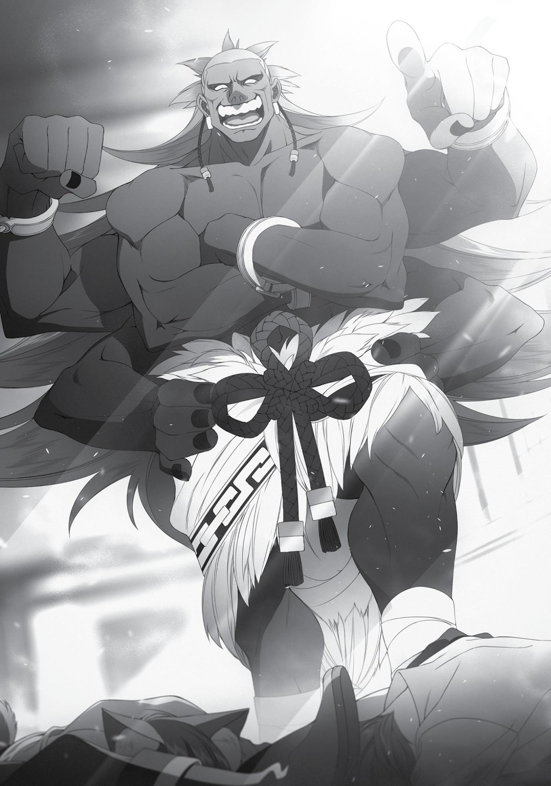

+++
title = "Chapter 3: The Impervious Fiancée (Part 1)"
date = 2026-07-20
weight = 3
[extra]
volume = 9
chapter = 4
+++

Chapter 3:
The Impervious Fiance
(Part 1)

HALF A YEAR had passed since I enrolled at the Ranoa University of

Magic. It was autumn now—the harvest season. Fall never lasted for
very long up in the Northern Territories, but it was a very important
time of year, when food was prepared, harvested, and laid in storage
for the painful winter ahead. There were even a few festivals held
across the different towns and cities.
For the beastfolk, it was also mating season… a lengthy cultural
event that came with a complicated set of rules and rituals. All of
them were noticeably restless as it approached, men and women
alike.
There weren’t that many of their kind enrolled in the University,
relatively speaking. I’d guess they made up 5% of the student body,
which numbered roughly 10,000 in total. That would put their
numbers at 500 or so—a large group in a sense, but not that
impressive given the size of our campus. Still, once autumn began,
they seemed to be everywhere, fighting one-on-one duels that
typically pitted a man against a woman. For several months after
their duel, the couple would be glued to each other. Eventually,
they’d get married. Whoever won the initial duel would take on the
role of boss in the new “pack” they were forming.
These rules weren’t set in stone, or anything. It was just an old
tradition that some of them respected more than others. Still, some
beastfolk actually travelled here from distant lands to challenge our
students to one of these romantic duels.
In other words, we had outsiders wandering onto our campus.
This was something the administration would normally have tried to
prevent, but the mating season was a very delicate subject because
of its importance in beastfolk culture. Any attempt to ban their
traditions would probably result in actual riots. As a compromise, the
school allowed non-student beastfolk to enter its grounds under the
pretense of “auditing classes,” as long as they applied for permission
beforehand.
Anyway… this brings us to Linia and Pursena.
The two of them were basically unattainable to your average
beastfolk guy. For one thing, they were probably the two strongest
beastfolk fighters in the entire school. And just as importantly, they
were Doldia princesses. If you proposed to one of them, fought her,
and won, you’d become a candidate for leader of the entire tribe.
You wouldn’t be handed power immediately, of course. But when
the time came to choose the next leader, there was no doubt that
you’d be seriously considered for the role.
Of course, Linia and Pursena had come to this far-off land to
study, not to find a husband. They couldn’t very well pick out a
partner here without talking to their family first, and thus, they’d
flatly rejected all of the proposals they were bombarded with after
turning fifteen.
Yet despite their very public disinterest in marriage, there had
been even more suitors the following year. The two of them were
very popular. Apparently, some beastman had even launched sneak
attacks on them, trying to win their compliance by force. They’d
beaten off these attackers easily enough…but when fall rolled
around again this year, they decided to shut themselves in their
dorm. It wasn’t like the girls’ dormitory was an impenetrable
fortress, but any man who tried to sneak in would be piled on by all
the residents. So Linia and Pursena stayed put in their rooms, even
skipping homeroom.
I guess it was medical leave, in a sense. They were presumably
in heat themselves at the moment, after all. The thought of them
writhing around in their rooms meowing and woofing passionately
was kind of exciting. Not that it got me ready to mate or anything.
The two of them had sent me a letter, the gist of which was
“Sorry for the hassle, Boss, but we’ll leave things to you for now.” I
wasn’t sure exactly how I was supposed to be helping out, though.
Maybe they just wanted me to answer for them when the professor
did roll call or something.
In any case, it wasn’t just the beastfolk who were “in heat”
around this time of year. Fall coincided with a rise in sexual assault
cases around campus, as some people took advantage of all the
chaos. Those strict rules about who could enter what dorm made a
little more sense to me now. When it was two beastfolk in heat, you
could sort of write off some aggression as a natural or cultural
phenomenon… but apparently, some of the victims were human
first-years who didn’t even know what the hell was going on.
The school rules strictly forbid this sort of thing, of course. To
keep things under control, the administration had security guards
patrolling the campus. Consensual duels were permitted, but you
couldn’t just attack someone who refused to fight you. That was the
line they drew. Our homeroom professor even gave us an explicit
warning about the situation, telling us not to casually accept any
duels this time of year. He also encouraged those who weren’t
confident in their self-defense skills to travel in groups at all times.
Master Fitz also told me to be careful, actually. He seemed to
think some girls might challenge me to a duel under false pretenses,
claiming that they just wanted to practice against a powerful
magician. His advice was to turn them down flatly, ignore their
attempts to provoke me, and leave the area quickly without letting
down my guard for a second.
Girls in heat, huh…?
Back in the old days, I might have been tempted to duel every
single one of them and make myself a harem. But in my current
condition, I’d basically just be rubbing salt in my own wounds.
Mating season was one event I wouldn’t be participating in any time
soon.
I’ll leave it to those youngsters over there. See? The human boy
and his elf girlfriend, who’s “studying” while sitting in his lap? That
woman’s in heat all year long.
Honestly, those two never gave it a rest. I could practically see
the hearts floating over their heads. Still… Cliff was obviously a whole
new man, but it seemed to me like Elinalise was treating him the
same way she treated all her other lovers. I wasn’t going to say
anything, of course, but this whole thing still kind of looked like a
sham to me. Was this actually going to work out for them?
At some point while I was watching Cliff and Elinalise enjoy
themselves, Zanoba had walked up to my desk. “Master, don’t you
think it’s about time to start in on a new creation?”
“A new creation, huh…?” Up until a few days ago, I’d been
working on a 1/8 scale figurine of Eris as sort of a therapy exercise,
but I ended up blubbering so much that I had to quit halfway
through. Since then, I hadn’t been able to motivate myself to make
anything. I’d fallen into a bit of a slump without even noticing. “Yeah,
I guess you’re right. Any ideas?”
“Perhaps making some sort of an animal or monster would be a
nice change of pace.”
“Hmm, sure. I think a Red Wyrm might be fun, then.”
“Oh! Indeed! The very monster that you once slew singlehandedly, yes?”
“Yeah. That wasn’t easy, by the way. I thought I was dead for
sure.”
“Hahaha. You’re far too modest.”
“Master Zanoba, what are you talking about?”
Julie seemed to be a little curious, so I told her the story of my
battle against a Red Wyrm straggler from back in my adventuring
days. Before long, her eyes were sparkling, and her face flushed with
excitement. Kids in this world seemed to love stories like these. It
was easy to forget sometimes, but she was still only six.
“Hm, okay then. Why don’t I make a Red Wyrm figurine for you,
Julie?”
“What…? M-Master, what about me? Won’t you make anything
for me?!”
“Zanoba, you’re supposed to be my student, right? How about
you offer to help me make this?”
“Oh! Of course, Master! I’ll assist you in any way that I can.”
This life wasn’t so bad, really. I wasn’t in peak condition lately,
but at least I’d settled into a decent routine here. My Beginner-level
Divine and Barrier magic classes would be wrapping up soon, and I
had to decide what to take next. Perhaps Intermediate
Detoxification? I’d gotten by just fine with only the Beginner-level
spells so far, though. It didn’t seem like there was a need to learn
anything more advanced than that.
I could always try Advanced Healing instead. But again, I felt
relatively satisfied with my current level of expertise there. The
Intermediate spells were enough to deal with most situations.
There was always Enchantment, which I’d never dabbled in
before. It was technically a form of Summoning magic, so maybe it
would be more relevant to my research. From what I heard, though,
it mainly involved learning how to create various magical
implements. I still wasn’t sure what that had to with
Summoning…but at least it would be something new.
Of course, I was free to not take any new classes at all. I could
just spend more time in the library instead. I started to feel like I’d hit
a dead end researching the Displacement Incident, but it might be
interesting to try and teach myself more languages. If I did go that
route, I could try asking Cliff to tutor me in Divine magic on the side…
He’d been spending all his time with Elinalise lately, though. It was
probably smart to leave them alone for a while. Didn’t want to make
a nuisance of myself.
Maybe I could try going in a completely different direction and
learning something unrelated to magic. It might be fun to learn how
to ride a horse, for one thing…
The days slipped by peacefully as I tried to make up my mind.
And then, things suddenly weren’t so peaceful anymore.
“I take you to be Quagmire Rudeus, the A-ranked adventurer
who cut down a stray Wyrm single-handedly! I challenge you to a
matrimonial duel, sir!”
On my way to the library, I found myself on the receiving end of
a challenge.
I turned around and found myself looking at a beautiful girl. Her
skin was tanned, and her silky dark-blue hair was tied in a neat
ponytail. She looked maybe 17 or 18. She had a strong, dignified
face, and her lips were pursed tightly together; you could tell at a
glance that she was the “lady warrior” type. Instead of a school
uniform, she wore a light swordfighter’s outfit in a striking shade of
deep blue.
She had a modest bust, but her muscles were impressive. She
didn’t look like a bodybuilder or anything, but she was clearly in very
good shape. By her side was a long, curved sword—the kind
commonly used by swordfighters of the Sword God Style.
The girl was staring in my direction.
To be more precise, she was staring in surprise at the person
standing just in front of me—the big, hairy beastman who’d just
loudly challenged me to a duel.
Yeah. I neglected to mention the muscular, canine beastman,
but that was him who’d shouted at me. He didn’t look the slightest
bit like a magician, either. The girl with the sword had probably just
been passing by. Given the time of year, she might have thought he
was talking to her.
“Uhm…”
Well, anyway. Let’s forget the pretty girl for now.
There was a pretty fundamental problem here. I was a guy, and
this guy was also a guy, and he’d just challenged me to a duel. That
was slightly awkward. “A matrimonial duel? Like… one of those
things where you get married later?”
“Indeed!”
Gaah… “I’m sorry… I don’t know if there are rumors going
around or something, but I’m actually straight. Not really interested
in experimenting, either. I’m going to have to decline your offer.”
The beastman’s ears twitched. “You seem to be
misunderstanding the situation.”
“Oh no, is it this late already? You know, I’ve actually got piano
practice today. I’m going to have to leave now, sorry…”
Now that I’d declined his offer, I turned around and started to
walk away, totally ignoring his attempt to continue the conversation.
Following Fitz’s advice to the letter, in other words.
“Hold on there!”
But to my surprise, my hairy new friend leapt up, soared several
feet over my head, and landed with a loud thump right in front of
me. The guy jumped like a Reverse-Joint mech. He would have made
a solid Dragoon.
“You have no right to refuse me. My name is Brook Adoldia! I’ve
come to duel for Miss Pursena’s hand in marriage, so that I might
one day become the leader of my tribe!”
“Uh, Pursena’s resting up in her dorm room until this whole
mating season thing blows over. Maybe you could head over there
instead?”
“I sent Miss Pursena a letter in advance, informing her of my
intentions! She explained that you are now the boss of her pack. I
learned of your prowess as a warrior from Sir Gyes, and I’ve heard
that you cut down a stray dragon by yourself. Clearly, you are the
strongest man in this University. You ought to make a worthy
opponent for me!”
Okay, I didn’t really cut down anything, though… I’m a
magician, not a swordsman… “What happens if I refuse?”
“As leader of the pack, you are obligated to fight me!”
I took a moment to try and piece all of this together.
After I managed to beat Linia and Pursena in a fight some time
ago, they started calling me their boss. Apparently, you had to defeat
the boss of a “pack” if you wanted to marry someone who belonged
to it. So if this guy beat me in a fight… he’d be able to claim Pursena
as a prize?
I hadn’t intended to become the leader of any packs, but I felt
like this guy wasn’t going to care about that. This was some primal,
animal-kingdom stuff. If I threw this fight, I’d be removed from my
position as the boss, and Pursena would get married off to this
random hairy guy.
“Now then… to battle!”
Brook didn’t wait for me to say anything in response. Howling
ferociously, he charged forward at me.
“Quagmire.”
Since he was coming at me in a straight line, he promptly ran
right into my swamp…
“Stone Cannon.”
And one well-placed stone projectile knocked him out.
Slightly anti-climactic. It seemed his bark was worse than his
bite. I’d basically taken him out on reflex rather than thinking it
through, but in retrospect, it wasn’t like I had much reason to let him
win. Pursena didn’t seem interested in getting married to anyone at
the moment, for one thing.
This did explain that letter they’d sent me, at least. I wasn’t
super happy about them dumping this whole thing on my shoulders,
but I could deal with a few guys like this, no sweat. It probably wasn’t
that big a deal.
My feelings on the subject changed over the course of the next
few minutes, as I came under attack five different times on my way
over to the library.
It felt like half of the Doldia tribe had been waiting eagerly for
this day to come. Linia and Pursena were in seriously high demand.
What was so appealing about those two, anyway? Their bodies,
maybe? That didn’t make much sense, though. Lots of these men
had probably never even seen them in person. It had to be the whole
“princess” thing. That first guy had said something about becoming
the leader of his tribe, after all.
Was being number one really that important to them? What
was this, a whole tribe of Starscreams?
From the looks of things, they’d even worked out an order to
challenge me in. One guy tried to barge in halfway through and got
yelled at for “cutting in line.” Maybe it was another one of those
beastfolk traditions or something.
Fortunately, they didn’t go so far as to pursue me inside the
library itself. I guess the administration had made it clear to them
that they weren’t allowed to barge into any of the school’s facilities…
or the beastfolk had some ancient rule about that, too.
I didn’t care either way. At least I could take refuge here for a
little while.
A few hours later, in the early evening, Fitz showed up at the
library as well. His gaze was a little bit reproachful. “It’s quite a scene
out there, Rudeus. What did you do to upset all those people?”
“Nothing. They just want to beat me in a fight so they can marry
Linia or Pursena.”
“Wait, what?”
As Fitz blinked in confusion, I proceeded to explain all the ugly
details about my status as the “boss” and the way the beastfolk
traditions apparently worked. By the time I was done, Fitz was
frowning sourly. “That makes no sense at all. You’re not the leader of
the Doldia tribe or anything. Who cares if you beat them in a fight
once? That doesn’t mean you have any right to hand them out as
prizes to random strangers.”
True enough. If I had that much power over them, they wouldn’t
be scratching me in the face every time I touched their legs. “You’re
right. But how do I convince the people out there?”
Fitz put a hand to his chin, and nodded slowly. “You have every
right to just ignore them, really… but it might be easier to just beat
them in a fight. They’ll probably give up and go home.”
“…so at the end of the day, I should duel them after all?”
“That’s probably for the best.”
Easy for him to say. I wasn’t sure how many people were waiting
out there for me, but from the sound of things it was probably in the
dozens. And of course, this was a crowd of big, smelly macho men
who wanted to rule their tribe. I’d have to knock every one of them
unconscious. “I’d really prefer not to make violence a part of my
daily routine, you know.”
“I know that, Rudeus. But unless you do something about them,
you’ll be stuck in here forever. Oh, and they might just lose their
patience and charge in here, too. We don’t want them making a
mess of the library, do we?”
“Yeah, I guess you’re right. Ugh… just what I needed, a fighting
tournament against a horde of sweaty, furry men…” I couldn’t find
anything to look forward to there, no matter how hard I tried. It just
sounded like a pain in the butt.
“Uhm, it’s not just men, actually. I did see one girl out there
too.”
“Seriously? Was she cute?”
“Rudeus… Please don’t tell me you’re going to accept that
duel?”
“No, no. Of course not. Uh…”
I shook my head, mainly so that Fitz would stop glaring at me.
Still, I was a little intrigued. I wanted to know what she looked like, at
least. And where she’d even heard about me. “I’m just curious, that’s
all.”
When someone expresses interest in you, it’s perfectly natural
to be a little intrigued in return. Not that things could move too far
forward until my condition was cured, of course.
“Oh? You’re curious, huh? Hmm.” For some reason, Fitz
sounded displeased with me. He had warned me against dueling girls
at great length just the other day, to be fair…
Oh, maybe Luke had gotten himself into trouble that way at
some point? Yeah, that made sense. Fitz had probably been forced to
clean up the mess afterward, so he was irritated to see me treating
the situation so casually.
“Well, never mind that,” I said. “It sounds like this causes a lot of
chaos every year, huh? Can’t the student council do anything?”
“We don’t intervene in anything related to the mating season. If
we tried to ban it, things would probably just get worse.”
From what Fitz told me, the student council had their hands full
this time of year as it was. They focused most of their energy on
protecting less combat-proficient students during this chaotic
season, doing things like patrolling the campus in small groups,
stopping any misconduct they found before it got out of hand. Fitz
was scheduled to participate in one of those patrols that very night,
in fact.
“So you’re trying to protect the peace, right? You could totally
help me out, then!”
“Oh, please. Why don’t you just take care of it yourself, Rudeus?
I don’t think you need our help.”
For some reason, Fitz’s voice wasn’t very friendly today. Had I
said something to upset him? Wait…maybe he was thinking about
what happened during my entrance exam. He claimed my victory
didn’t bother him, but if I started running from fights like this, people
might start to think that he’d lost to a coward. That wouldn’t be
good for his reputation, either.
Fitz had been helping me out a lot recently. I still wasn’t thrilled
about any of this, but I owed it to him to make an effort. “All right
then. For the sake of your good name, Master Fitz, I’ll go slaughter all
of them.”
“What?! Don’t kill them, Rudeus!”
“It was just a joke. Sorry.”
People did take these duels seriously, but there was an
unwritten rule that nobody was supposed to die as a result. Still,
there might be some powerful fighters waiting for me among that
crowd. I couldn’t let myself get careless.
Finally resigned to my fate, I stepped outside the library for the
first time in hours.
“…What the hell?”
I was greeted by a mildly surprising scene. Dozens of bodies lay
scattered across the ground, limp and motionless. It felt like I’d
wandered onto a battlefield or something.
All of them were male beastfolk of various races, shapes, and
sizes. Some of them wore school uniforms, but many didn’t.
Oh, wait. There’s one girl, too.
It was the swordswoman I’d seen earlier. Had she gotten mixed
up in his somehow? Or maaaaybe… she was in wuv with me all
along?
As I pondered this extremely important question, a burst of
laughter boomed through the air. “Bwahahahaha!”
One man stood tall amidst the fallen, holding the last of his foes
up in one hand.
“I give you credit for challenging me, my young friends! It was a
truly bad decision on your part, yes, but a brave one! The students of
this ‘University of Magic’ clearly have some guts!”
Fitz and I stood frozen in place, gawking in astonishment. After a
few seconds, I finally managed to offer a tentative “Uhm…”
Tossing aside the last beastman warrior, the man turned to face
us. “Ohoh! Those young men told me to beat them if I didn’t want to
wait my turn, and so I did! And now you’ve come out to meet me,
right on schedule! Excellent, excellent. I like a man who keeps his
promises!”
It was obvious at a glance that this man was a demon. His skin
was as black as obsidian, and he had six arms. The top set was
folded, the middle pair were pointing at us, and the bottom two
were resting on his hips. His long hair, which reached all the way
down to his waist, was an interesting shade of purple.
“I am the immortal Demon King Badigadi!”
Did he just call himself a Demon King? Were we talking about
the same kind of Demon King here? Like, the guy who kidnaps young
ladies from the nearest village to satisfy his wicked appetites? The
guy who gets to do anything he wants, as long as he fights off the
occasional “hero” who comes around to slay him?
Yeah, probably not.
The more important question right now was: what the hell was
a Demon King doing here?

“I see you have the Eye of Foresight, boy! You must be Rudeus
Greyrat, then! I’ve heard tell of you from my fiancée, the Demon
Empress Kishirika!”
Well, at the moment he was stomping up to me…
“I challenge you to a duel!”
Okay. Well, he knew how to get to the point, at least.
Unfortunately, I still had no idea what the hell was going on here.
Maybe he’d let me off the hook if I offered him two slightly furry
young maidens as a sacrifice…?
