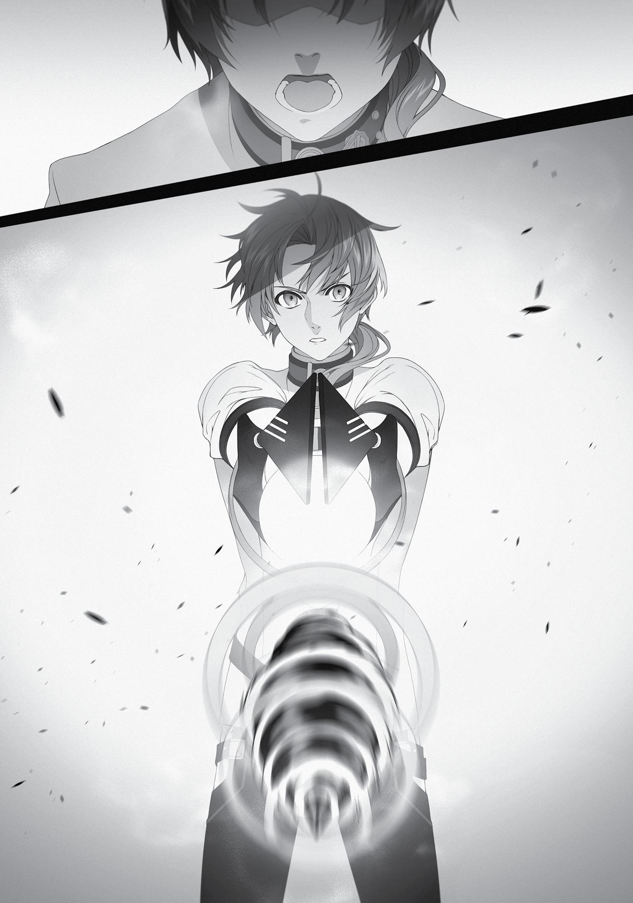

+++
title = "Chapter 4: The Impervious Fiancée (Part 2)"
date = 2026-07-20
weight = 4
[extra]
volume = 9
chapter = 5
+++

Chapter 4:
The Impervious Fiance
(Part 2)

W

ORD SPREAD

throughout the countries near the Ranoa

University of Magic with remarkable speed: A Demon King had
appeared.
Normally, news of a Demon King would have reached them well
before his actual arrival. But this particular Demon King had moved
so quickly that they only found out in the moment he was crossing
through their territory. The rulers of these nations were thrown into
a state of confusion and panic.
This was understandable. As a basic rule, Demon Kings never
ventured off the Demon Continent. There had been warlike,
aggressive Demon Kings long ago, of course, but virtually all of them
were exterminated in the Laplace War centuries ago. The survivors
who now ruled over the Demon Continent were peaceful or cautious
by nature, and largely disinterested in conflict.
Yet regardless of their personalities, these kings were still
powerful enough to take control of a piece of the terrifying Demon
Continent. If one of them decided to go on a rampage in humanity’s
territory, the damage would be incalculable. Ranoa, Neris, and
Basherant all reacted instantly to Badigadi’s arrival, dispatching all
the knights at their disposal to intercept him; they also called upon
the Adventurers’ Guild for emergency assistance. But their forces
were still some distance from the University of Magic.
As an emergency stopgap, the small units of Magic Nations
soldiers already garrisoned in the city of Sharia joined all the local
adventurers and members of the Magic Guild and surrounded the
campus. If it came to the worst, they were ordered to slow down the
Demon King until the main forces could arrive.
Page | 67

However, the Demon King’s purpose in coming here remained a
total mystery. It wasn’t difficulty to identify him. There was only one
Demon King with jet-black skin and six arms: Badigadi the Immortal.
He was one of the ancient kings who’d lived since before the Laplace
War. His most notable power, as his name suggested, was literal
indestructibility. Thanks to his peaceful nature, little was known of
his capabilities in battle, but some historians believed he’d once
fought against Laplace himself. That would mean even the fearsome
Demon God had failed to totally destroy him.
Why had such a person suddenly appeared in the Ranoa
University of Magic? And why had he wandered around its campus,
knocking both innocent students and visiting beastfolk unconscious
as he went?
It would be a while before anyone learned the answers to these
questions.
Rudeus

A

T THE MOMENT,

I was standing at the center of the University’s

Advanced Magical Training Ground… which was their fancy name for
this flat, empty courtyard. Facing me was the Demon King Badigadi.
I held my head high and folded my arms in an attempt to project
some confidence, but to be perfectly honest, I was freaking out a
little. Can you really blame me, though? How calm would you be if
you had a massive six-armed tank of a demon glaring at you like
that?
Okay, fine. I’d started to feel like I was pretty powerful lately. I
have to admit that much. But we were talking about a Demon King
here. That was a couple levels above what pretty powerful could deal
with. It felt like the universe was punishing me for getting cocky. I
wanted to run screaming for the hills, honestly.
Page | 68

I looked behind us and saw that we’d attracted a huge crowd of
rubberneckers. It seemed like an even mix of male and female
students, with a good number of professors as well. If I turned tail
and ran here, what were they going to think of me?
On reflection, I didn’t give a crap about that, actually. But it felt
like I’d lost my chance to escape.
All of a sudden, someone broke through the crowd of spectators
and trotted toward me at a brisk jog. It was an older man who wore
a slightly conspicuous wig. The look worked on him, though. “I’ve
heard about the situation from Jenius. My apologies, but could you
please buy us some time? We’re gathering our forces as quickly as
we can.”
With that said, he turned around and returned to the crowd.
Who was that guy supposed to be, anyway? I felt like I’d seen
him somewhere before. It wasn’t coming back to me right now, but I
understood what he was trying to tell me, at least. Vice-Principal
Jenius was aware of the situation, and he was going to get me out of
this mess if I managed to stall for long enough. It was nice to have
people with pull on your side sometimes.
“Hrm,” said Badigadi, watching me with all of his arms folded.
“The boy’s certainly taking his time…”
“I don’t think it’ll be much longer,” I replied.
Right now, Fitz was off fetching me my trusty staff Aqua Heartia.
At my request, Badigadi had agreed to wait until it got here. I hadn’t
expected Fitz to take this long, though. It wasn’t that far from the
library to my dorm, and I’d left the staff standing right next to my
bed with a cloth draped over it. It should have been easy enough to
find.
“Mm. I hurried over here because I know you humans are
always in a rush, but you seem to be quite composed, boy. I’d expect
no less from someone who intrigued my fiancée.”
Page | 69

“Your fiancée… by which you mean, uh… Empress Kishirika,
yes?”
“Indeed,” Badigadi nodded firmly.
I hadn’t forgotten about the Demon Empress Kishirika Kishirisu,
of course. She was the one who’d gifted me my Demon Eye. At first I
hadn’t believed she was the real deal, and she’d left so abruptly
afterward that I was too stunned to make sense of what had
happened…
Still, why the hell was her fiancée showing up to fight me now,
after all this time? Surely he wasn’t looking to marry Linia or Pursena.
“You know, your Majesty, I only had one brief conversation with the
empress. Although she did grant me this Demon Eye.”
“Well, she’s always talking about how impressive you are, boy!
It’s been ages since I heard her speak of anyone with such
excitement in her voice. I’m a very tolerant man, of course, but I’ll
admit I was a bit jealous!”
Jealous? Seriously? It wasn’t like I’d done anything with her,
right? Why would he be angry at me? Was it that joke I made about
wanting to have a go with her? That didn’t amount to anything,
though. She turned me down because she had a fiancée… which
would be this guy. Right.
“Th-There’s nothing special about me, I assure you,” I said, in
the calmest voice that I could muster. “I’m just a sad, pitiful mouse of
a man, honestly. I can’t imagine why a Demon King like yourself
would be jealous of me… the Demon Empress must have been
exaggerating somewhat.”
Badigadi responded by bursting into laughter, as if I’d cracked a
truly hilarious joke. “Bwahahahaha! Don’t be modest, boy! I’ve heard
all about that astonishing pool of mana you’ve got inside you.”
Astonishing felt like a strong word. Yes, it was becoming obvious
that I had way more mana than most people did. But surely it wasn’t
Page | 70

anything impressive enough to make a genuine Demon King jealous…
right?
Come to think of it, though, Kishirika had made some comment
about this as well. What were her words exactly? All I could really
remember was her cackling with laughter for no apparent reason…
“Uh… well, yes. I do seem to have a bit more mana than most
people.”
“Ahahahaha! ‘A bit more’, eh? Yes, indeed!” Badigadi proceeded
to roar with laughter at some length. After a while, he abruptly fell
silent and dropped to the ground with a loud thump. “Sit down,
boy.”
I quickly took a seat. Badigadi was still enormous, even seated. It
felt like I was conversing with a mountain of muscle. It was a pity I
hadn’t been blessed with that kind of a physique.
“It seems you don’t understand what it means to be called
‘astonishing’ by the Demon Empress Kishirika Kishirisu.”
“…Well, I guess I don’t, no.”
“She told me you had an amazing amount of mana. More than
Laplace, even. You’re the first person she’s ever said that about.”
Laplace? Like… the Laplace?
Apparently, I had more mana than a Demon God. That didn’t
feel right to me, honestly. I hadn’t run out of mana in a very long
time, true, but it wasn’t like my body was overflowing with power or
anything.
“The Demon God Laplace had one of the biggest total mana
pools in recorded history. In other words, yours is also one of the
largest ever.”
“Oh, come on. That can’t be right.”
Despite my mild protestations, my heart still jumped with
excitement. After all, I was talking to a Demon King here, someone
Page | 71

with centuries of experience in battle. It almost felt like a pro athlete
telling me I had “potential” or something.
“I don’t know the truth of it myself. Kishirika can be a little
sloppy at times, after all. There is a chance she misjudged you.”
Badigadi’s expression turned slightly sour as he spoke these
words. Maybe he was remembering some costly mistake his fiancée
made in the past? She did seem the type who made some careless
errors, honestly.
“Well, I’ll admit I’ve made an effort to deepen my mana pool
over the years. I don’t know about having more than anyone else in
history, though. Wouldn’t that mean anyone could break the record
if they trained themselves like I did?”
“No. Such a thing would normally be impossible.”
Maybe this had something to do with the fact that I’d been
reincarnated from another world, then? Or maybe the Man-God had
somehow “cheated” on my behalf without me even noticing…
“There’s one thing I’d like to ask you, your Majesty. If you don’t
mind.”
“What’s that? Feel free to pose any inquiry.”
“Uh, just to be clear, I’m not a lackey of the person I’m about to
name. So I’d appreciate it if you didn’t suddenly attack me.”
“I already agreed to wait, boy. A Demon King never breaks a
promise.”
Really? Well, that’s good to know, at least. I’m gonna take you
at your word on that one, okay? No violence, please…
“Does the name Man-God mean anything to you?”
“…Where did you hear that name, boy?”
“He’s someone who appears in my dreams sometimes.”
Folding his upper set of arms, Badigadi began to stroke his chin
thoughtfully. “Hmm, I see. Your dreams, eh?”
Page | 72

“Do you know something about him, your Majesty?”
Badigadi paused for a moment, apparently deep in thought,
then shook his head. “I can’t say! I think I’ve heard the name before,
but I can’t recall where! It’s been a few centuries since anyone spoke
of him to me, at the very least.”
“Is that so? Well, thank you anyway.” A few centuries… that’s
kind of vague. I guess he doesn’t have the best memory…
“Not a problem! If I remember, I’ll be sure to let you know!
Bwahahahahaha!”
“I’d appreciate that.”
“You’re so damn dull, boy. Laugh with me for once!
Bwahahahaha!”
Badigadi certainly seemed like a man who enjoyed his life. I
hadn’t said anything especially funny in this entire conversation, but
he never seemed to stop laughing.
I found myself remembering the night I met Ruijerd. We’d first
connected on a personal level by sharing a laugh, hadn’t we? Maybe
laughter was a kind of common language here. If the person I was
speaking to was laughing, it was probably rude not to respond in
kind.
All right then, let’s do this. “Bwaaahahahahahaha!”
“Good! That’s the way, boy! It’s like Kishirika always says: laugh
first, think later! Come to think of it, she was laughing the last time
she died, wasn’t she?! Bwahahahaha!”
Badigadi laughed yet again. Despite his fearsome appearance,
he didn’t seem like such a bad guy.
As we laughed, the group of spectators behind us started to get
a little rowdy. I turned back to see what was going on. It looked like
there was some sort of commotion in the middle of the crowd. I
could barely pick out the sounds of shouting voices.
Page | 73

“Let me go! I need to give him his staff!”
“Stop it! If you give it to him, he’ll have to start the duel!”
“But what if the duel starts anyway? Are you just going to stand
here and let him die?!”
“Th-That’s not what I’m—”
“Leave this to me!”
“Ah! Zanoba!”
“Zanoba Shirone?! Unhand me! Unhand— Ow! Ow ow ow!”
Suddenly, Master Fitz burst free from the crowd and rushed
toward me with ferocious speed. The guy was seriously quick on his
feet. He had to be moving three times faster than I could. Maybe we
should paint him red and stick a horn on his head…
“Hah… hah… I’m sorry, Ru… Rudeus. The professors tried to stop
me…” Gasping for air, Fitz came to a stop in front of me. He had my
staff cradled in his arms.
“You’re, uh… one hell of a runner, Fitz.”
“Huh…? Hah… No. My shoes are magic items, that’s all…”
I looked down at the boots that Fitz always seemed to be
wearing. I hadn’t even realized they were magical in nature. His cloak
was probably enchanted too, wasn’t it? He never took it off, even
when it was hot outside. “No kidding? Are those sunglasses magical,
too?”
“Hah… hah… Oh, these. Yeah, they’re… uh, wait. Sorry, that’s a
secret…” Fitz laughed softly and smiled in embarrassment.
Why did this guy have to look so damn cute when he laughed,
anyway? He was doing weird things to my heartbeat.
“Hah… Anyway, here you go. Good luck, Rudeus… just don’t
push yourself, okay? If you realize you can’t win, then just apologize

Page | 74

and run for it. You’re up against a Demon King here. No one’s going
to blame you. Your life’s more important than your pride.”
Nodding, I took Aqua Heartia from Fitz. It had been a while
since I fought a real battle with this thing in my hands. Let’s do what
we can, partner. If we make it through this in one piece, I’m going to
head straight home and marry my beloved Pineapple Salad…
Throwing up a lazy death flag just for the hell of it, I pulled the
cloth off Aqua Heartia. Fitz drew a sharp breath of surprise. A
mischievous thought popped into my head, and I found myself
unable to resist. “…Fitz, take a look at the magic stone on my staff.
What do you think?”
“I-It’s really big…”
Oh wow. I think something downstairs just twitched. Whatever
could that be?
Well, enough playing around.
Badigadi had already risen to his feet and was happily flexing all
six of his shoulders. Had I managed to buy enough time? It seemed
unlikely. But I had no idea how I was supposed to talk his ear off long
enough for all the soldiers in town to gather, honestly.
Fitz trotted back toward the crowd, looking a little reluctant to
leave me. I wouldn’t have minded if he stuck around, personally.
Some backup might be nice right now. Seriously. Help? Please?
“Are you ready, boy?”
“To be honest, I’d rather spend a bit more time chit-chatting…”
“Bwahahahaha! Time enough for that later!”
Did that mean he wasn’t going to kill me? No, it wasn’t safe to
assume anything. This guy seemed careless enough he might
accidentally knock my head off, assuming anyone with lots of mana
could take a hit or two.

Page | 75

I considered saying something. Could it hurt to ask him for a
non-lethal duel…?
Badigadi stood there casually, hands on his hips. He wasn’t
going to come charging at me, from the looks of things. Maybe he
was waiting for me to signal that the fight was underway. Just as an
initial precaution, I activated my Eye of Foresight.
“…Huh?”
To my surprise, it showed me… nothing. There was literally
nothing standing where I knew Badigadi was.
“What’s got you looking so astonished, boy? Ah, I see. You
already tried the Demon Eye Kishirika gave you, right? Sorry, but
those things don’t work on me.” Badigadi let out a snort of pride as
he announced this off-handedly.
Wait, seriously? The Demon Eye’s completely useless against
him? I guess I should have expected as much from a Demon King…
This was definitely a problem. My chances of managing to avoid a
fatal blow had just gone down dramatically. I was nothing special,
physically speaking; if he hit me in the wrong place, that might be it
for me. “Your Majesty…”
“Badi’s fine. I permit those who laugh when I ask it of them to
call me by that name.”
“King Badi, then. I have a request to make.”
“What sort of proposal?”
“I’d like to ask that you spare my life, even if I lose this duel.”
Badigadi burst into laughter once again. “Bwahahahaha!
Begging for your life before we’ve even started? You never cease to
amuse me!”
“Well, a life’s a tragic thing to waste, don’t you think?” I said.
“Ah, yes. You humans die so quickly as it is! I hear many of you
feel that way!” the Demon King replied with a cackle. “But why are
Page | 76

you so sure you’ll lose? One would think such a massive pool of
mana would lend a man some confidence.”
“I was nearly killed by someone called the Dragon God not too
long ago. That probably has something to do with it.”
Badigadi’s laughter came to an abrupt halt. “The Dragon God?
You mean Orsted? You fought him and lived?”
“By the skin of my teeth. If he hadn’t spared me on a whim, I
wouldn’t be standing here today.”
The Demon King’s face was suddenly very serious. This seemed
less than ideal. I’d let down my guard when he didn’t react to the
name Man-God. What if Orsted was the one I shouldn’t have
mentioned? Talk about careless…
“Tell me, boy. Were you able to wound the Dragon God in that
fight, even slightly?”
“Huh? Yeah, I guess. I managed to tear a little skin off the palm
of his hand. That’s it, though.”
Badigadi pulled his mouth tightly shut and stared at me fiercely.
The effect was slightly intimidating.
C-Come on, why don’t we start laughing again? Bwahahaha…
“In that case, I’d like to make a request of my own.”
“O-Oh really?” I said as meekly as I could, watching Badigadi’s
expression. “What would that be?”
“You get one shot.”
“…”
“Hit me with your very strongest magic. I’ll give you one chance,
no more. Use the spell that hurt the Dragon God, perhaps. Should it
manage to pierce my battle aura and do me harm, then you win. If I
am undamaged, then I win. How does that strike you?”

Page | 77

Ooh. Sounds good to me! I couldn’t have asked for a better
offer, really. I wouldn’t even have to get my face punched in,
though? “Uh, sure, but isn’t that a little one-sided?”
“One-sided? One-sided, you say? Hm, true enough! Very well
then. If you can’t scathe me with your magic, then I’ll hit you with a
counterattack. It will be a single blow, no more!”
Dammit. I just dug my own grave.
One attack from this monster would probably be enough to
pulverize my heart. I should probably stop talking right now before I
managed to dig myself even deeper.
“I understand. Let’s go with those terms, then.”
“Very well!”
At long last, I held Aqua Heartia forward and began to
concentrate.
“Whooo…”
I drew in a long, deep breath, and began to gather as much
magic power as I possibly could into my staff. I was casting Stone
Cannon, one of the spells I was most familiar with. But I made sure
this projectile was far harder than the one I’d fired off at Orsted. I’d
cast that spell quickly, out of sheer desperation. I hadn’t been
holding my staff, and I’d only used one hand. This time, there was no
rush at all. Once I gathered enough mana, I should be able to make
my spell several times more powerful.
Projectile: Solid and incredibly hard.
Creating the ‘bullet’ wasn’t fundamentally any different from
how I made a figurine. But I focused entirely on its hardness, ignoring
properties like toughness and resilience. I shaped it like a spindle,
tapering to a fine point, and added a pattern of grooves.
Modifications: Rapid rotation.

Page | 78

The faster it spun, the better. I focused until my bullet was just a
blur. I had no idea how many rotations per second I was even looking
at.
Velocity: Maximum.
This was the most critical part, so I devoted as much mana as I
possibly could to it. I’d never used so much mana on a single Stone
Cannon before. Given the amount of time it took to prepare, this
version of the spell wouldn’t be much use in real combat…and for
most monsters, it would probably be overkill. But this man was a
Demon King. He might very well just shrug it off. At the very least, I
hoped I could put a scratch on him. I really didn’t want those massive
arms smacking me in the face.
“Okay then. Here goes.”
“Excellent! Have at me!”
I fired off the spell.

Page | 79

Page | 80

My bullet tore through the air with a high-pitched whine. There
wasn’t any recoil; for whatever reason, there never was with magic.
But that didn’t make its power any less real.
The stone slammed into Badigadi with an enormous bang. His
entire upper body was blown apart; his six arms disintegrated
instantly. His lower half, still intact, soared dozens of meters
backward and plopped limply to the ground.
“…Huh?”
What was left of Badigadi didn’t even twitch. I’d been expecting
my attack to just…bounce off him with a “twang” or something.
What was this?
Slowly, fearfully, I walked over to Badigadi’s body and looked
down at him. The intact part of his body wasn’t bleeding for some
reason. Was that just how it worked with a Demon King? Given how
much he laughed, I’d figured he didn’t have much use for tears… But
maybe there wasn’t any liquid in his body whatsoever.
“…Huh?” Wait, really though? This isn’t happening…
Is he dead?
I still didn’t understand what had just happened. When I turned
around, I found the crowd of spectators staring at me in total silence.
Their gazes made me cringe. Nobody was even moving.
I swallowed reflexively. The sound my throat made seemed
weirdly loud. Had I actually killed him?
That can’t be right. I mean, come on. He seemed so totally
confident. Huh? He said he was immortal, right? He told me to give
him his best shot! He didn’t seem worried at all! What the hell?!
I needed to calm down. And make sure I understand exactly
what I’d done.
Slowly, fearfully, I turned around to look at Badigadi once again.
Page | 81

“Bwahahahaha! I am REVIVED!”
I very nearly fired off another Stone Cannon immediately.
Badigadi was standing right in front of me, alive once again…
and about half as big as before. He was roughly my height now, but
his head wasn’t any smaller than before. The effect was a bit bizarre.
That wasn’t really important right now, though.
“Oh. You’re alive…”
That was definitely a relief. I’d convinced myself that I’d killed a
man without even meaning to. Good thing I wasn’t up against a
normal human being.
“Bwahahaha! I thought I was done for, boy! In any case, now it
all makes sense. It was wise of you to prevent a real battle. Had we
fought in earnest, this whole area would have been reduced to a
barren wasteland!” Badigadi let out a sustained burst of laughter. I
guess he found the idea amusing.
Over the next few moments, all six of his arms came crawling to
him across the dirt and rejoined his body. He was growing steadily
larger, although he wasn’t quite back to normal yet.
“You certainly sent me flying quite a distance, boy. Looks like it’ll
take some time before I’m my old self again!” Badigadi seemed
inexplicably excited about this. “You win this one, Rudeus!” he
continued gleefully. “Feel free to call yourself a hero!”
“I don’t think I will, but thanks anyway.”
“At least give the crowd a victory cry, then! Bwahahaha!”
Badigadi seized my right hand, still holding my staff, and pulled
it up into the air like a referee announcing the winner of a boxing
match. “Uh…”
Well, whatever. If he says I win, I guess I win.
“I wonnnn!”

Page | 82

The spectators responded to my cry with total silence. For
whatever reason, nobody made a sound.
After a long moment, Badigadi nodded to himself. “They aren’t
much fun, are they? Well, all right then. Time for you to take my
punch.”
“What?!” That wasn’t the deal!
Before I could object, he smacked me straight in the face. With
three fists at once.
He was still holding my arm, of course, so I had no chance to
defend myself. The blow knocked me unconscious.
You… big liar…
Following this, Badigadi apparently went off somewhere with
that toupee guy, a handsome middle-aged man in armor, and an old
guy in a robe. It sounded like the bigshots had a few things to discuss
in private.
As for me, I lay in the infirmary for a while before regaining
consciousness. Once I came to, Vice-Principal Jenius took me to a
room in the Teachers’ Building and offered me some tea and snacks
while I recuperated.
He didn’t have much to tell me. It sounded like he wasn’t
entirely clear on what was going on himself. The Demon King had
shown up out of nowhere, wandered around knocking out both
students and beastfolk alike, challenged me to a duel, allowed me to
claim victory, and then knocked me unconscious. That was all we had
to go on, and it wasn’t enough to make sense of the situation. Still, it
seemed no one Badigadi knocked out had actually died from their

Page | 83

injuries. He was supposedly a peaceful guy by nature, so that
probably made sense.
A number of very important people were trying to figure out his
objectives as we spoke. The guy with the toupee was actually the
principal of this school. It took me a minute to recall his name was
Georg, a King-tier Wind magician. I’d seen him once before, back at
the entrance ceremony. Joining him in his talks with Badigadi were
the leader of the Magic Guild and the captain of the Magic Nation
knights stationed in this city.
“But I must say, Rudeus, that was a truly remarkable effort. You
struck down a Demon King with a single preemptive strike, and he
even acknowledged you as the victor! The principal believed a lone
adventurer like yourself could only buy us a little time… but surely no
one could have expected this! Why, you got my blood pumping for
the first time in years!”
There was genuine excitement in the vice-principal’s voice. It
sounded like the crowd hadn’t heard my discussion with Badigadi
before the duel began. None of this was that impressive when you
considered that he’d let me take the first shot, and I’d never really
been in danger.
Jenius fawned over me for a while longer before finally letting
me go on my way. He did tell me to stay put in my dormitory until
everything was fully figured out.
As I left the Teachers’ Building, Zanoba came running up to meet
me. “Ah, there you are, Master! I saw every second of your duel. It
was truly impressive! But I suppose I should have expected you to
triumph.”
I shook my head. “He just let me spar with him, that’s all.” My
spell had broken through his aura, true. But he hadn’t even tried to
evade it or defend himself. And given the fact that he could
Page | 84

regenerate completely when defeated, I couldn’t possibly have
beaten him in a real battle.
“You’re too modest by far!” said Zanoba with a chuckle.
“Sparring evenly with a Demon King is impressive enough, I assure
you.”
When I glanced at Julie, she looked even more frightened than
usual. I guess it had been a pretty gruesome spectacle, even at a
distance. Hopefully I hadn’t scarred her for life.
On the way back to my dorm, I ran into Cliff and a very pleasedlooking Elinalise. “Hello there, Rudeus. What was all that commotion
about earlier?”
“Uhm, what were you two up to for the last few hours?”
“Oh, you know… this and that. Hehehehe.”
Cliff blushed red as Elinalise giggled. “You don’t have to tell
him!”
It seemed these two had been indulging in some grownup fun
for the entire duration of the Demon King’s assault on the University.
Good for them, I guess. “The Demon King Badigadi showed up out of
nowhere and challenged me to a duel. I managed to win.”
“Huh?” said Elinalise, looking mildly surprised. “He’s here
already?”
…Already? What the heck is that supposed to mean? “Did you
know he was coming, Elinalise?”
“Yes, I did. But he was staying with the Ogre tribe… he said he’d
be staying there for some time, so I should go ahead by myself.
Demons like him tend not to pay much attention to the passage of
time, you know? I thought he’d be there for another decade or so at
least, and it’s only been two years since we parted…”

Page | 85

You probably would get pretty careless with time after living for
a few thousand years, wouldn’t you? I know the years slipped by way
faster after I passed 30 in my previous life… although that wasn’t
exactly comparable.
“In any case, he’s not a bad man, is he?”
I nodded. “He seems like a decent guy, yeah.” He was probably
better than most royalty, at least. That cheerful personality of his
was kind of endearing. He did break his promise, but it seemed only
fair to hit back when someone blasted your head off.
“Uh, what are you two talking about?”
“Oh my. Are you feeling jealous, Cliffy dear? Don’t worry! I
belong to you now, body and soul.”
“That’s not the p— Gah, stop clinging to me. Rudeus is
watching…”
“Let’s show him a thing or two, then…”
The two of them began making out, so I shrugged and walked
away. As I turned the corner, I heard Cliff protesting “But a Demon
King wouldn’t just show up here!”
Yeah. That’s what I thought too, buddy.
Master Fitz was waiting for me at the entrance to my dorm.
When he spotted me, he assumed an expression that I couldn’t
quite decipher. Was this excitement, maybe? His cheeks were a little
flushed, and his hands were clutched into fists. It almost looked like
he was too fired up to put his thoughts into words. “You’re… You’re
really strong, Rudeus!”
Wow. Not very eloquent today, huh?
“I never thought you’d take him down in one shot like that!”

Page | 86

“Well, we agreed that I got to fire off one free attack at him, and
its power would determine who won. So I just used the strongest
spell I have.”
“The strongest spell? But that’s the same one you used on me in
your test, right? Was it a better version of that?”
“Yeah, it was Stone Cannon. I just charged it up as much as I
could.”
“So even an Intermediate spell can be that powerful if you’re a
real master, huh…?” With an admiring hum, Fitz turned aside and
conjured a rotating stone bullet of his own. After a moment, he fired
it off; it whistled through the air and pierced into the ground some
distance away.
“Well, I’m not sure I’d call myself a real master or anything.”
“Don’t you mostly use Earth magic, though?”
“Yeah, I guess. For a while there I was relying on Water spells,
but a few years ago I switched over to using Earth almost
exclusively.”
“I knew it! You definitely get better with a discipline when you
use it over and over again, right?”
Was that actually true? It sounded plausible, I guess. I felt like I
was getting steadily better at making figurines, for one thing.
“…Yeah, I guess so. I think I’m getting a little more precise, at least.”
“You can use more mana when you keep at it, too!”
“Right, for sure. Making those figurines actually takes a lot of
power, you know?”
Fitz seemed to really be enjoying this conversation. Come to
think of it, we hadn’t discussed magic like this very often, had we?
“Oh, I’m sorry to go on like this. You must be tired, right? I didn’t
mean to hold you up. Go get some rest.”
“Uh, right. Thanks.”
Page | 87

With that said, Fitz broke away and trotted off toward the
school buildings. I’d sort of wanted to keep the conversation going,
but he was probably busy. In the aftermath of that incident, the
student council likely had a lot to deal with.
At last I was back in my room. I leaned my staff against the wall.
Today had been a very long day, what with the Demon King and all.
Physical and mental fatigue washed over me the moment I glanced
over at my bed.
I lay down and let myself relax.
The next month passed by somewhat uneventfully. After some
careful negotiations, the three members of the Magic Nations had
decided to recognize Badigadi as an official state guest for the
duration of his stay in their countries. Badigadi, for his part,
apologized for the hassle he’d caused by offering one of his arms to
the Magic Guild so they could study his immortality. He’d also agreed
to act as a temporary martial arts instructor for the knights stationed
in Sharia.
But that wasn’t all…
At our next homeroom session, my two furry subordinates were
once again in their seats. Badigadi had dealt with all their suitors, so
it was apparently safe for them to venture out to class again.
“You’re the man, Boss! Thanks again, mew. We’ll give you
somethin’ for the trouble soon!”

Page | 88

“Didn’t expect a Demon King to show up, though. We’re too
damn sexy for our own good, yeah? Well done protecting us. I’ll give
ya my permission to squeeze Linia’s breasts.”
“Appreciate it.” Since I’d been given authorization, I went right
ahead.
“Myaaaaa!” Linia responded by scratching my face.
What happened to my permission, huh? What happened to
giving me something for my trouble? How purrfectly atrocious.
Every girl has a pair of these, right? What’s the big deal if I
touch a few?
“You’re always so… fearless with women, Master,” said Zanoba
thoughtfully. “And yet, you never seem to pursue them seriously…”
“Hey!” Cliff hissed. “Cut it out, Zanoba! You remember his
condition, don’t you?”
“…Ah yes, of course. My apologies.”
Lately, Cliff had been sitting closer to us. It sounded like Elinalise
had been telling him a few things about me here and there. I didn’t
know exactly what she was saying, but it can’t have been that bad,
since Cliff was considerably more friendly now.
Incidentally, everyone seemed to be assuming that Eris had
dumped me because of my condition. Not that it mattered, anyway.
I’d forgotten all about her by now. Really!
On a different note, Cliff and Elinalise weren’t making out in
public nearly as much these days. It didn’t seem like they’d broken
up or anything, though. Every couple days, I’d notice Cliff stumbling
around the campus looking like a zombie. Elinalise was clearly
keeping him very busy at night. They’d probably just reached an
agreement to cut back on the public displays of affection.
Still, wasn’t all this fun going to give Cliff trouble with his
studies? I wasn’t going to meddle, of course. It was his life, and he
Page | 89

could live it how he wanted. If anything, I was kind of jealous. Just a
little.
“…Grandmaster, I don’t have enough mana to harden this part.
Will you do it for me?”
Julie was devotedly working on her figurines, day and night. I’d
started giving her some tutorials on making them by hand, in parallel
with our lessons on the magical method. That wasn’t my specialty,
though, so we were getting some assistance from a dwarf in the
same year as Zanoba.
As for Demon King Badigadi… I still only had a very vague outline
of the situation. He’d said that he came all this way because he was
jealous of me. Would that mean I’d be held partially responsible for
all the damage he’d caused? I wanted to think that Jenius wouldn’t
have that. He was the one who’d recruited me, after all.
My train of thought was derailed by the sound of the classroom
door swinging open. With the exception of Silent, all of the special
students were already in their seats. And it was too early for the
professor to arrive. Had Silent actually showed up for once?
“Bwahahahahaha!”
A booming laughing echoed through the classroom. An instant
later, he strode inside.
Without a moment’s hesitation he marched up to the podium
and gazed down at us like an emperor surveying his domain.
“Behold! It is I, Badigadi—the immortal Demon King!”
Is this seriously happening? Is he seriously…wearing a school
uniform?!
The Demon King Badigadi had formally enrolled at the Ranoa
University of Magic as sort of a publicity stunt. He wasn’t studying
much of anything, of course, but he made a habit of sitting in on

Page | 90

classes and speaking to students who caught his eye… which usually
resulted in them desperately fleeing for help. Those who were brave
enough to stick around were supposedly rewarded with tidbits from
his vast stores of knowledge, but they were few and far between.
One way or another, though, things had come to a relatively
peaceful conclusion.

Page | 91
