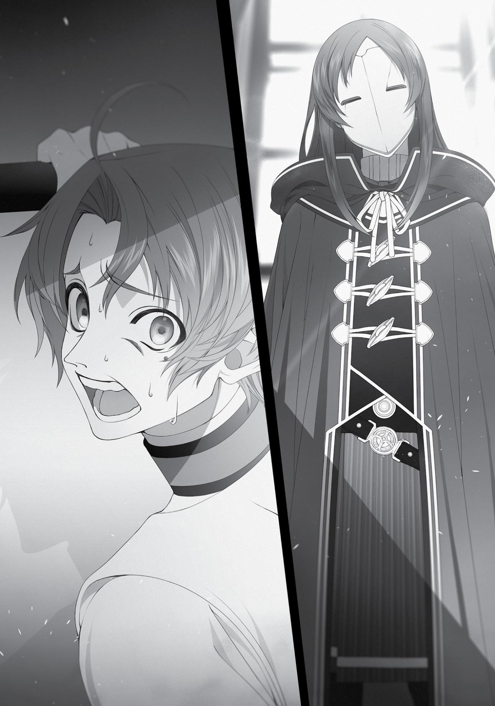

+++
title = "Chapter 5: The White Mask (Part 1)"
date = 2026-07-20
weight = 5
[extra]
volume = 9
chapter = 6
+++

Chapter 5:
The White Mask
(Part 1)

R

ECENTLY, IT SEEMS LIKE

some people are a little frightened of me.

And by “some people,” I mean basically every student attending the
University of Magic.
At first, I just thought everyone was avoiding me for some
reason. Not that I was exactly wrong about that. Case in point:
sometimes I’d find myself walking down a hallway toward a group of
tough guys headed in my direction. Naturally, I’d step out of the way
so they wouldn’t harass me, right? But for some reason, they were
already moving out of my way. Sometimes they’d even look out the
window and talk about how nice the weather was, despite the fact
that it was snowing.
I was just happy they weren’t hassling me, of course. But in
retrospect, maybe they were thinking the exact same thing
themselves.
I only figured out what was going on after an incident that took
place when I was heading back from my Intermediate Detoxification
class one afternoon. When I stepped out of our classroom following
the lecture, I spotted Goliade in the hallway just outside. Yes, that
Goliade—the human wrecking ball who’d falsely accused me of
stealing underwear on my very first day here. She noticed me the
same moment that I noticed her. Our eyes met.
The two of us were technically acquainted, and she’d been here
longer than I had. It seemed like it might be rude to just walk off
without even saying hello… and I felt like I should probably apologize
for our last encounter, too.
As I walked over, though, Goliade twitched and averted her
eyes. She squeezed in her broad shoulders to make herself as small
as possible, and looked into the distance with a fearful expression,
consciously trying not to see me.
“Uh, hi, Goliade. I’ve been meaning to talk to you about what
happened on my first day here…”
When I actually spoke to her, she immediately started trembling
like a newborn faun. “I’m… I’m sorry about that,” she squeaked out
weakly. “Really… really sorry. Please, I didn’t know…”
Her attitude seemed slightly different from the last time we’d
met. I was actually a little taken aback. This almost made me feel like
I was threatening her or something. “Er… I was going to apologize to
you, actually. I didn’t know the rules about the dormitories at the
time, you know? But I won’t be making that mistake again, so…”
As I stumbled through what I’d planned to say, a group of
spectators began to gather around us.
“Hey, look, it’s Rudeus.”
“Is he still holding a grudge about what happened on his first
day?”
“Oh man. Poor Goliade…”
“He’s the one who broke the rules, right? What a bully…”
“Shut up, stupid. What if he hears you?”
Their whispers were critical of me, and full of pity for Goliade. I
could see tears welling up in her eyes. I kind of felt like crying too,
honestly. What the heck was going on here? The way they looked at
me really hurt.
“What’s all this, mew? Who’s fighting in the hallway?”
“Somebody’s got too much fuckin’ energy, huh?”
At this exact moment, Linia and Pursena happened to show up.
They pushed through the crowd, and spotted me and Goliade. After
studying her tearful face for a moment, they smiled and nodded to
each other, then pushed their way confidently in between us. “Hey,
Boss. Why don’tcha leave it at that, mew? Goliade didn’t mean to
tick you off, really. Could you cut her a break for us? We gotta look
out for the other beastfolk girls.”
“Go on, Goliade, yer fine. Just don’t get on the Boss’ bad side
again, got it? You were lucky his right-hand girl was passin’ by. If it
weren’t for me, he mighta chopped you into mincemeat.”
“O-Okay! Thanks!” Goliade gratefully bowed to the two of them,
spun around and walked off quickly, looking considerably smaller
than she really was.
“The rest of you get lost too, mew!” Linia shouted. “This ain’t a
show!”
The crowd of onlookers promptly scattered like a nest of baby
spiders. I let out a small sigh of relief. But when I turned to Linia and
Pursena, hoping for some sort of explanation, I found they’d already
started one of their trademark banter sessions.
“Okay, Pursena. So what was that supposed to mean?”
“What’re you talkin’ about, Linia?”
“I’m the Boss’ right-hand girl, obviously!”
“He’s been pickin’ up lots of new flunkies lately. You’re too
dumb to keep things runnin’ smoothly.”
“Mew?! Your grades are just as bad as mine!”
“Come on, you two,” I finally interrupted. “You can both be my
right-hand girl, okay?”
“Mew just don’t get it, Boss. We gotta have a pecking order!”
“That’s right. It’s fuckin’ important.”
I could understand that beastfolk liked hierarchies, but I didn’t
remember establishing any kind of gang, and I didn’t care which of
them was which hand. That aside, they’d just bailed me out of
trouble. I should get them something to express my gratitude. Would
raw fish and a slab of meat do the trick?
“Anyway, that Goliade sure was stupid to tick you off, Boss.
What’d she do to you, mew?”
“Uh, she mistook me for an underwear thief on my first day
here, but…”
“Huh? I remember that! Wait, so that phantom panty thief was
you all along, Boss?!”
“That’s so messed up, man.”
Suddenly, the two of them were looking at me with scorn in
their eyes. How about you let me finish my sentence? I was falsely
accused! Maybe I should gift them a second helping of despair and
humiliation, rather than meat and fish.
“Now that I think about it, Goliade was boastin’ about that for a
while. She said she caught some cowardly first-year red-handed, but
Fitz protected him. I guess she’s the coward now, huh? Hilarious.”
“She was talking trash about you, and you let her off the hook?
That’s real big of you, Boss, but we oughta send a message here.
We’ll take care of it, mew.”
That sounded kind of ominous. Hadn’t these two moved past
their delinquent phase by now? “Don’t do anything to her, please. I
don’t want to go around making enemies over nothing.”
“Pfft. You really gotta get more ambitious, Boss! Who cares
about mew enemies? We could rule every dorm in this school if we
teamed up to take down Ariel!”
“She’s right, ya know. Ya beat Fitz, Boss, so you could conquer
this school in no time.”
What was it with beastfolk and wanting to seize power,
anyway? Seriously, they were all a bunch of fuzzy Decepticons. “Let’s
say I did seize power over the dorms and everything. What would I
even do with that authority?”
I couldn’t care less about being at the top of things. I was
fundamentally trying to avoid conflict where possible, and taking on
a leadership position basically guarantees somebody’s going to hate
your guts. In this world, walking down the wrong road at the wrong
time was enough to get you stabbed through the heart. It was just
safer to be friendly and respectful to everyone you met.
“You could do anything you want, mew. Well… I guess you
couldn’t do much with the girls, actually… ooh, I know! We could
bring you a pair of panties from all the girls in the dorms at the start
of every year!”
“Good idea. Boss loves panties so much he has them on display
in his room, right? He’d be super happy.”
“N-No I wouldn’t…”
It wasn’t like I had those there because I loved panties. I mean, I
kind of liked them, sure… but that didn’t mean I wanted a bunch of
underwear from girls I didn’t even know, right? I did know Goliade,
and I knew I didn’t want her underwear, either.
Then again, you did see some really cute girls walking around
campus sometimes. Although most of them weren’t really my type.
Honestly… I wouldn’t have turned down a pair from Linia and
Pursena. Those two did have a slightly musky smell, but at the end of
the day, they were still sexy girls. And the scent of their fur wasn’t
half-bad at close range.
Still…right! Fitz. Fitz wouldn’t like me doing that sort of thing.
That means it’s out of the question. There we go. The matter’s been
settled at last! I won’t be tempted again. Get behind me, Satan…
“I’m not at all interested in the panties of some random girls. If
you want to steal their underwear, do it yourselves. But if you cause
Master Fitz any trouble, I won’t be taking your side.”
Phew. There we go. That was a close one, girls of the
University. If it wasn’t for my condition, you might have ended up in
some serious trouble.
“Guh… W-Well, if you wanna keep things calm, that’s your call,
Boss.”
“…Yeah. We’ll do what ya tell us.”
In any case, this incident finally made the nature of my situation
clear to me. I was evidently feared by quite a lot of people. It wasn’t
hard to understand why, once I’d picked up on it. I’d beaten Fitz, who
was the most powerful student in this school. I’d won dominion over
all the infamous special students. And then, I defeated a Demon King
with one spell in a very public duel. It wasn’t remotely surprising that
the other students found me intimidating.
From what Badigadi told me after the fact, his battle aura
couldn’t be penetrated by anything less than King-level spells or
sword techniques. Which meant you’d need to be on the level of a
Ruijerd or a Ghislaine to even stand a chance against him. Since he
relied on this to protect himself in combat, though, he apparently
had a hard time beating people above that level.
Anyway… assuming he was telling me the truth, my fullycharged Stone Cannon was now as powerful as a King-tier spell. That
was definitely nothing to sneeze at.
Of course, I was also a complete glass cannon. The
swordfighters of this world could sheathe themselves in the
protective veil of a battle aura without even thinking about it, but no
matter how hard I trained, my body never gained that superhuman
strength and speed that Eris and Ruijerd tapped into so easily. My
muscles did get bigger, but that was about it. All I really had going for
me was my attack power. I did supposedly have the mana capacity of
a Demon God, for whatever that was worth, and thanks to my Eye of
Foresight, I could go toe-to-toe with enemies a bit above my level.
But my body itself remained totally ordinary. I’d basically stand no
chance against a truly powerful adversary.
But I couldn’t expect the students here to figure all that out.
They’d seen a demonstration of my firepower and were probably
assuming my abilities were just as impressive across the board. You
could hardly blame an average student for steering clear of someone
“more powerful than a Demon King.”
“Still, you gotta have more confidence in yourself, Boss! I bet
that would help with your condition, mew!”
“Yep. But once you get that working, make sure you jump on
Linia instead of me.”
Confidence, huh? Was that the root cause of my issues
downstairs? It kind of sounded plausible, actually. I’d lost my fight
against Orsted, gotten dumped by Eris, and then screwed up with
Sara. I couldn’t find a way to use my strengths effectively, and I’d
ended up sinking into a funk. Maybe some confidence really was
what I needed to get over this hump. And now, a chance to regain
some had been dropped into my lap. Everyone here was afraid of
me, after all.
Just to try it out, I tried walking through a crowded hallway with
Linia and Pursena following closely behind me. The mass of bodies
parted magically in front of me.
This was definitely a brand-new experience. I sort of felt like the
director of a hospital doing his rounds, or maybe Moses parting the
Red Sea. It was hard not to swagger. Out of the way, kids, this here’s
my hallway…
The moment this thought crossed my mind, though, I stopped in
my tracks. What if the guys who’d bullied me in my previous life had
started off this exact same way?
That realization took all the fun out of it instantly. Whatever I’d
accomplished so far in this life, the fact was that I’d spent my entire
last one at the very bottom of the totem pole. That was never going
to change, even if my condition did cure itself. And if I forgot about
it, I’d probably end up repeating the exact same mistakes I’d made
before. I had a more positive outlook on life now, sure, but I was still
the same person deep down. I couldn’t let myself forget that.
This time around, I wasn’t going to end up a shut-in.
A little while after all this, I was in the library, pursuing my
research as usual.
I was still focusing on Teleportation and Summoning, of course.
The more I studied them, the more similarities I noticed. Calling
something to you was fundamentally different from sending
something elsewhere, but in many other respects they were
comparable. It felt like I needed to make an effort to actually learn
Summoning magic. I’d been thinking about this for a while, but there
wasn’t a single professor in the University who specialized in that
discipline. There were supposedly a few members of the Magicians’
Guild who could at least cast the spells, but even they were mostly at
the Beginner or Intermediate tier. All they could call forth were
harmless familiars and mindless, obedient spirits. I wanted to learn
from an actual expert.
There were some people in the town who’d risen to the
Advanced tier in Enchantment magic, but that seemed to be very
different from conventional Summoning. They certainly wouldn’t be
able to tell me anything about Teleportation. The vice-principal had
bragged about the quality of the staff here, but evidently he was all
talk.
Then again, maybe this was just how things were. I hadn’t
encountered any magicians who specialized in Summoning during my
time as an adventurer, either. It seemed possible there weren’t
many of them at all. Or maybe it was more like Barrier and Divine
magic, where one specific country essentially monopolized the
methods.
Still, I kind of felt like I’d met at least one person with some skills
in Summoning. I couldn’t remember who it was, though. I felt like it
would come back to me if I ran into them again. I probably hadn’t
seen them in a while, whoever they were.
In any case, I’d read through most of the promising books on
Summoning magic in the library at this point. It felt like I’d hit a dead
end, honestly. Studying by myself couldn’t take me any further than
I’d gotten.
It was Fitz who ended up finding me a way forward. “I finally
found someone, Rudeus! There is one person here who’s researching
Summoning magic on an expert level!”
“Ooh! Really?!”
“Yeah. I found out about them from the principal and viceprincipal, actually,” said Fitz with a slightly mischievous grin. “Who
do you think it is?”
Well, it probably wasn’t a professor. There were a handful of
other students trying to learn Summoning as best they could, but
surely none of them knew anything more than Advanced spells at
best. What did that even leave us, then? “…Someone from the
Magicians’ Guild, maybe?” It wouldn’t be surprising if they had a few
experts in the field somewhere. Maybe one of their researchers was
borrowing some of the school’s facilities to conduct their
experiments.
“Hmm, sort of. They are an A-ranked member of the Guild,
supposedly.”
“Wow…” Based on what I’d learned about their structure, an Aranked member of the Magicians’ Guild was the equivalent of a
branch manager, while being S-ranked meant you were part of the
central leadership group. Principal Georg was an S-ranked member,
and the vice-principal was ranked B. “Doesn’t that mean they’re
pretty high up in the hierarchy?”
“Yeah. That’s really something, don’t you think?”
Even B-ranked members were entitled to some very nice perks.
You could start up a school for magicians anywhere you wanted, and
the Guild would offer you financial and logistical support.
“So… who is it, then?”
“Well, I think you probably know their name already, at least…”
Did I? I felt like I would have remembered someone that
important. “Come on, tell me already.”
“Heheh. Okay then. It’s Silent Sevenstar, from the special class.”
Ah. Now this makes sense. I’d heard the name before, yes. And
more than just the name. I’d heard about the things they’d
accomplished at this school as well.
First of all, there were their improvements to the menus at the
dining halls. They’d arranged for a regular supply of food from the
Kingdom of Asura, allowing them to use ingredients you’d normally
never see in the Northern Territories. In addition, they’d introduced
the world to something they called kerry soup, which was
supposedly their own invention. It was made by stewing ingredients
like potatoes, carrots, onions, and others in a pot, with a complex
spice blend thrown in for flavor. You ate it by spooning the thick,
brown soup onto a hunk of bread. It was curry, basically. The flavor
was very different from the curry I remembered, true, but the idea
was very similar.
Silent was also the one who’d proposed our official school
uniforms. They had connections with designers and manufacturers
back in Asura, and had arranged for them to be created there. The
introduction of a universal uniform allowed the University to present
its student body as a single group with a common purpose, rather
than a chaotic mixture of different tribes and races that happened to
be occupying the same campus. It improved their public image
significantly.
Even the blackboards found in all the classrooms were one of
their innovations. Writing on a pure-black surface with a small stick
of limestone was a simple enough concept, but the professors had
found it exceptionally helpful.
There were many other little improvements they’d made, if you
went looking for them. They’d contributed to the University in many
small, subtle ways. In recognition of these accomplishments, the
Magicians’ Guild had granted them a high rank in their organization.
All that said… their “innovations” were also very familiar. They
seemed like novel concepts to the residents of this world, but not to
me. I wasn’t the sharpest tool in the shed, but I’d had my suspicions
for some time. I thought I knew something about Silent’s origins.
Up until this moment, though, I hadn’t voiced my suspicions. I
don’t know why. Maybe I wanted to believe I was special. Maybe I’d
assumed I was something totally unique—the one and only person in
this world with memories from another. But of course, there was no
logical reason why that should be the case.
To be honest, I was a little frightened by the idea of Silent. I’d
been hoping to avoid ever meeting them. I didn’t want to meet
someone who’d been given the same advantages as me and made
much better use of them. I was afraid they’d ask me why I was
wasting time playing around when I could have accomplished so
much more. I knew how badly hearing that would hurt.
But when I heard Fitz speak Silent’s name, I quickly decided that
the time had come. “Got it. Thanks, Master Fitz. I’ll see if I can track
them down.”
I’d probably gotten a little cocky, in retrospect. I’d won the
loyalty of a Blessed Child, beaten the two top delinquents in the
school, earned the sympathy of its foremost genius, and even made
friends with a king from the Demon Continent. Half of the student
body looked at me in awe. I was trying not to let it go to my head,
but I think it did.
They can’t turn up their nose at me after everything I’ve done
here, right?
I learned Silent’s whereabouts from Vice-Principal Jenius
without any fuss at all. The school had granted them a laboratory,
consisting of three large rooms at the very back of the third floor in
the main research building. They spent almost all their time there,
only emerging on very rare occasions.
I decided to visit them by myself, for reasons I wasn’t totally
sure of. It might have made more sense to take Fitz along with me.
But somehow, I felt like I needed to go alone.
I paused in front of the door that led to their chambers to take a
deep breath and try to steady my nerves. I wasn’t going to let myself
flinch, even if Silent really was like me.
I knocked lightly on the door.
“…Come in.”
There was a tinge of irritation in the voice that answered from
within. Slowly, I pushed the door open.
The back of the room was dominated by countless scattered
piles of books and papers. Strange magic implements of unclear
purpose were everywhere; magic stones and crystals lay in giant
heaps. This was a laboratory, all right.
Someone sat near the very back of this cluttered space. When
they turned to face me, I was struck speechless.
“…Ah. We meet again.”
It was a woman. A black-haired woman.
She wore… something I remembered vividly. Something I’d
never forget.
A smooth, nearly featureless white mask.
“Gyaaaaaaaaaaaaah!”
I fled the room, screaming in terror. It was the girl in the mask.
The one who’d been with Orsted. I couldn’t remember her name, but
I remembered Orsted just fine. Orsted! Why Orsted?! I’d been ready
to meet another reincarnated person, but not Orsted!
The terror I’d felt when he killed me flooded back into my mind.
The fear I’d been almost numb with in those final instants
overwhelmed me. I felt the pain from when he’d crushed my lungs. I
felt the helplessness of watching him brush aside all my attacks. I felt
the shock of him piercing my heart. And I felt… the terror of staring
death in the face.
All I could do was run. I ran, and I ran, and I ran. I didn’t have the
first idea where I was going.
When I turned around, though, I found the girl following me. I
didn’t understand why. Why hadn’t I gotten away from her by now?
Was she that fast?

That wasn’t it, of course. I was just slow. I’d barely gotten
anywhere, despite what my mind was telling me. It was just my heart
dashing along at a hundred miles an hour.
I ran even further, desperate and clumsy. I tripped and fell. I
stumbled like a drunkard.
I’d worked so hard on my legs in case something like this ever
happened, but they weren’t cooperating with me at all. It almost felt
like I was dreaming; my legs wobbled weakly underneath me with
every step I managed to take.
Silent was still following me closely. I’d faced down a Demon
King without trembling, and yet…
I looked down the flight of stairs in front of me. Fitz was
standing at the bottom. He’d help me. He’d get me out of here. I felt
myself relaxing slightly.
“You shouldn’t scream at the sight of someone’s face, you know.
It’s a little rude.”
Someone tapped me on the shoulder. When I turned around, I
was face to face with her.
“Aheee!”
With a weird little shriek, I twitched backward in terror… and fell
down the stairs, knocking myself unconscious in a slightly
embarrassing fashion.
Someone was stroking my head gently. It was deeply
comforting, for some reason. It almost felt like their hand was
emitting some sort of healing energy.
I glanced upward to investigate, and found the face of Master
Fitz. His hands were warmer than I would have expected. They were
also oddly slender, soft, and feminine.
For no particular reason, I reached up to grab one.
“Oh. You’re awake, Rudeus? You really worried me there, falling
down a whole flight of stairs all of a sudden.”
“…I was having a terrible dream. A woman in a white mask was
just about to murder me.”
“Err…” Fitz responded to this with an awkward little smile. I
wasn’t sure why.
I wasn’t sure where I was, for that matter. This clearly wasn’t my
room in the dorms… or even the dorms at all, for that matter. I’d
been here before, though. There were beds lined up in a row behind
Fitz…
Oh, right. It’s the infirmary.
I sat up and slowly looked around the room. The place looked
almost empty, except for Fitz, myself, and the resident healer.
I turned my head a little further…
“Gaaaah!”
She was here as well.
The woman in the white mask was sitting on the other side of
my bed.
I tumbled out of my bed and hit the floor with a painful thump.
The woman responded by letting out an irritated sigh. “So very rude.
Why are you so terrified of me, anyway? I saved your life last time,
didn’t I? Or… ah, wait. You were nearly dead, weren’t you? I guess
you wouldn’t remember, then.”
That settled it. It was definitely her. This was definitely the girl
who’d been travelling with Orsted. “W…Where’s Orsted?!”
“He’s not here,” she replied casually. “He’s a very busy man, you
know.”
He isn’t here? Really? Really really? It wasn’t like she had any
reason to lie about that, right?
“I wouldn’t worry about him, anyway. He won’t be coming after
you anytime soon.”
“‘Anytime soon’? Does that mean he’ll get around to killing me
eventually, or what?”
“I don’t think he has any plans to do so… but the possibility does
exist. It all depends on you.”
At the very least, I wasn’t going to get murdered right now. As
soon as this fact registered, a huge wave of relief washed over me.
I’ve always been a pretty short-term thinker, I guess.
“Uh, I don’t quite understand what’s going on here. Would you
mind explaining?” said Fitz, scratching his ears uncertainly as he
turned from me to the masked girl. “First of all, who are you to
Rudeus?”
“We’re perfect strangers,” said the masked girl bluntly.
Fitz puffed out his cheeks in irritation. “I’ve never seen Rudeus
this upset about anything before. You obviously did something to
him, didn’t you?”
His tone was unusually hostile. He sounded very much like a
protective upperclassman stepping in to protect his helpless firstyear friend. Honestly, the support was much appreciated.
“The last time we met, he was beaten rather badly by the
Dragon God. I imagine he was remembering all of that.”
“The Dragon God…? Uh, one of the Seven Great Powers?”
“That’s right.”
“Are you the Dragon God?”
“Of course not. We just travelled together for a while.”
Answering Fitz’s questions in a disinterested tone, the masked
girl pushed back her hair with one hand. I’d only just noticed, but she
was wearing the University of Magic uniform. “Still, I must admit I
didn’t expect to meet you here…” She turned back to me. Even with
the mask, I could tell she was watching me closely. “But maybe that’s
just the nature of this route. That encounter at the Red Wyrm’s
Lower Jaw set the flag for us to find each other at this school.”
Before I could even try to respond, the masked girl reached into
her cloak and pulled out a piece of paper.
“I’m going to ask you three questions. Answer them honestly,
please.”
Her tone was suddenly so commanding that I just swallowed
and nodded.
“First of all, do these look familiar to you?”
I took the paper she handed me. Someone had written the
words “Shinohara Akito” and “Kuroki Satoshi” on it.
In Japanese.
I instantly recognized them as names. And at the same time, I
realized my initial hunch had been correct.
“Second, can you understand what I’m saying? Third, which of
these two are you?”
Her final two questions were spoken in Japanese as well. There
was no longer any doubt about it whatsoever. She was just like me.
As for the names on that piece of paper, though, they meant nothing
to me. I hesitated for a moment. But I’d braced myself for this by
now.
Slowly, I replied in Japanese. “I’m neither of them. I don’t
recognize these names.”
“I see. But you do speak Japanese, at least.”
“Huh?” said Fitz, peering down at the paper in confusion.
“What… language are you two speaking? Rudeus?”
“The two of us share a homeland, that’s all,” said Silent calmly.
“What? That can’t be right!”
I wasn’t sure why Fitz felt so confident about this, but that was
hardly important at the moment. Slowly, anxiously, I asked the
crucial question. “So you’re like me, then?”
Silent nodded. “That’s right. I was tossed into this world out of
nowhere, without any warning.”
As she spoke, she reached up and took off her mask. And at the
sight of her face, something clicked inside my head.
It was the girl. The one from the last moments of my old life.
The high-school kid who’d been fighting with some boy, and nearly
got run over by that truck. Or at the very least, it was someone who
looked exactly like her.
I was sure of this, but something felt a little strange about it. It
took me a moment to figure out why. Then I realized her face was
exactly the same.
Fifteen years had passed since that day, but she didn’t look any
different at all. That was just bizarre. Wouldn’t she have changed at
least a little in all that time?
No… hold on. Why does she look anything like she used to? If
she’d been reincarnated here, she should have been reborn into an
entirely new body, just like me.
Before I could ask her anything, though, she answered my
questions pre-emptively. “I don’t know how I was transported to this
nightmare of a world, but I’m stuck here for now.”
If she’d been transported, our situations were actually rather
different. I’d been reincarnated into a new body, with only my
memories intact. But unless I was misunderstanding her, she’d
basically been warped here just as she was—in the same body, at the
same age.
“My name is Nanahoshi Shizuka, and I’m Japanese. I’ve been
using the name Silent Sevenstar lately, though.”
Confusion and doubt swirled through my mind, tangling in my
thoughts until I couldn’t think of a single word to say. But my silence
didn’t seem to discourage her. “Where were you from, anyway?
America? Or maybe Europe? You’re obviously Caucasian, but you
speak Japanese… is one of your parents Japanese? Or maybe you’re a
foreigner who lived there?”
I felt like she’d gone well past the three questions she asked for
at this point, but I wasn’t in any shape to object. My tongue was
thoroughly tied.
“In any case, this is clearly an important step forward. I was
right to let you live. I suspected something like this the moment
Orsted said he didn’t recognize you.”
The girl was speaking rapidly now, with a hint of excitement in
her voice. She didn’t even seem to notice the fact that I was
bewildered. “Well, let’s see if we can find a way to work together…
Uhm, what’s your name?”
“R…Rudeus. I’m Rudeus Greyrat.”
“That’s just the false name you’re using in this world, right? I
mean your actual name.”
I didn’t want to speak the name I’d used in my previous life. I
really, really didn’t.
When I clammed up, Nanahoshi nodded agreeably. “Ah, that’s
all right. I understand. You’re wary of me, right? I can certainly
understand that, especially after what happened at our last meeting.
Don’t worry, though—we’re on the same side.
“Still, I wasn’t even sure there were others like me here until
now. You’re the first other person from Earth I’ve met in this world,
you know? It’s kind of comforting.”
Nanahoshi reached out to grasp me by the hand. Fitz frowned,
but she didn’t even seem to notice. “Let’s find a way back home
together, okay?”
Somehow, those words cut through all the confusion and
uncertainty in my mind. A clear, definite answer came to mind
instantly: Hell no.
I knocked her hand aside. “I never want to go back to that
world again.”
“Huh…?” For the first time in a while, Nanahoshi was speechless.
“Uhm… Rudeus, Silent… would you two please talk in a language
I can understand?” Fitz, of course, was even more lost than before.
The mood in the infirmary was suddenly extremely awkward.
