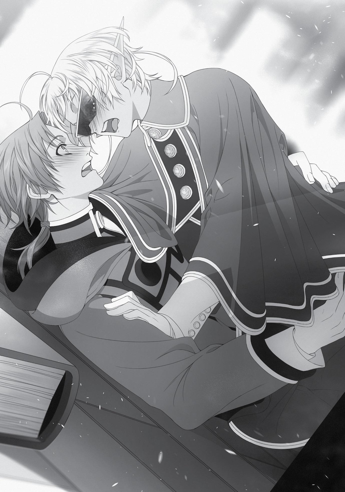

+++
title = "Chapter 8: Clueless, but Perceptive"
date = 2026-07-20
weight = 9
[extra]
volume = 9
chapter = 10
+++

Chapter 8:
Clueless, but Perceptive

W

INTER HAD ARRIVED,

and the city of Sharia in the Kingdom of

Ranoa was covered in snow. Thanks to the city’s famous magic
implements, the roads and major pathways were kept clear, but
massive piles of snow quickly built up to the sides and behind the
main school building.
Not long after this season began, a letter found its way to me. It
was from a certain Soldat Heckler, S-ranked adventurer and head of
the party Stepped Leader, and it informed me that Soldat had just
arrived in town. Apparently, there was some kind of clan conference
taking place here. Thunderbolt, the clan Stepped Leader belonged to,
had been officially summoned to this city to fight the Demon King
Badigadi. But when that request was cancelled prior to their arrival,
they ended up hanging around in town for some time anyway, and
eventually decided to hold their yearly clan meeting here. Every
winter, they took two or three months to talk things over and make
plans for the future.
Soldat was an S-ranked adventurer and a member of the clan
leadership. Choosing not to attend the conference wasn’t an option,
so he’d been forced to come all the way to the Kingdom of Ranoa.
The man didn’t get along too well with his clan’s leader, and he’d
honestly been dreading this. He was convinced he had a couple long,
dreary months ahead of him. But then, on his way up here, he
remembered that his old buddy Quagmire happened to be staying in
this city. Since fate had brought us back together, we might as well
take the chance to reconnect. Thus, he sent me this letter inviting me
to catch up over a meal.
The idea appealed to me as well. Soldat was a good guy, and I
owed him a lot. He had a past with Elinalise, so I felt like it might be a
little awkward introducing him to her devoted new boyfriend…but he
was made of tougher stuff than me. He’d probably get over it easily
enough.
With that decided, I let Nanahoshi know that I’d be taking a
break from our experiments on the next day off. I invited Fitz to join
me but he frowned and shook his head. “Sorry, I’ve got something
else that afternoon. I’m guarding Princess Ariel.”
The life of a bodyguard wasn’t easy. Everybody else might be off
for the day, but he was on duty from dawn to dusk. Talk about a
slave to the machine.
No, no. I was being rude to Master Fitz. He was just devoted to
his work. In any case, I couldn’t ask him to ditch his responsibilities. It
was a pity he couldn’t make it, but that’s just how things went
sometimes. It seemed only Elinalise, Cliff, and I were going to meet
Soldat.
When the day came, the three of us walked over to the
Adventurers’ Guild together. The roads in town were clear enough,
but their surface was still white with a trampled layer of snow. The
stuff was removed regularly throughout the day, but often the
snowstorms grew more intense at night, and the city’s magical snow
removal couldn’t keep up.
“Hey! Are you even listening to me, Rudeus?”
“What? Of course I’m listening.”
For the last few minutes, Cliff had been boasting about his plans
for his own research. He’d been studying curses intensively for some
time now, with the ultimate goal of lifting Elinalise’s. But curses had
been around since ancient times, and were the subject of ongoing
study throughout history, so lifting one wasn’t as easy as you might
hope. For all of Cliff’s bravado, six months of dedicated research
hadn’t yet brought him any major successes.
“Isn’t it tough, working that hard with nothing to show for it?”
“I’m not worried in the slightest,” said Cliff, his voice full of
genuine confidence. “I’m a genius, so I’ll figure something out
eventually!”
You had to admire the guy. I knew there were some things I’d
never accomplish no matter how hard I tried; I probably couldn’t
have motivated myself to slam repeatedly against a brick wall like
that. Smashing your way into a whole new frontier nobody had ever
reached before really was something only a “genius” could ever hope
to do.
“Still, if you know anything about curses, I hope you’ll share
your knowledge with me.”
“Hm…?”
I paused a moment to think this over. I felt like I’d heard the
word curses pop up quite a few times during my journey from the
Demon Continent to this city. “Uh, let’s see…”
Where had I heard it, exactly? Curses, curses… for some reason,
the sound of the word made me want to cringe in fear. That was
probably because Orsted had a few of them. It was the Man-God
who’d told me that, right?
Come to think of it, I’d heard the Demon-God Laplace was
cursed as well. He’d supposedly transferred his into the spears he
gave the Superd, dooming them to centuries of persecution.
“Well, I’ve heard that Laplace once transferred his own curse
into a number of objects, and used them to pass it onto a certain
tribe of demons.”
“Objects…?”
“Right. To be specific, the spears the Superd used during the
Laplace War. Thanks to the curse on those weapons, they lost their
sanity and ended up getting a reputation as mindless killers.”
Cliff opened his eyes wide. “What? I’ve never heard that before!
Is that actually true?!”
“Well, I only heard it secondhand, so I can’t say for sure.”
Was it the Man-God who’d told me that as well? Yeah, that
sounded right. It was probably safe to take him at his word on this
one. I couldn’t see what he’d stand to gain by lying to me about it.
“Either way, that is a most intriguing concept. I didn’t know it
was possible to transfer a curse into an object.” Cliff put his hand to
his chin and nodded thoughtfully, apparently pondering the idea.
“I don’t know how you’d do it, though. Sorry.”
“That’s all right. Just knowing that it’s been done before is very
helpful in itself.”
Had anybody other than Laplace even pulled it off, though? It
seemed like the sort of evil trick you’d expect a Demon God to use,
but it wouldn’t have surprised me if there was some ancient taboo
against messing around with that sort of thing.
That said… Blessed and Cursed children were supposedly the
exact same thing, right? Maybe there was some precedent for trying
to move a blessing into a different vessel, at least. “Hmm. Cliff, do
you know if anyone’s ever tried to transfer a blessing, rather than a
curse?”
“Hm? What do the Blessed have to do with anything?” said Cliff,
tilting his head curiously.
Strange. It felt like we weren’t working from the same starting
point here. “Uh, well, Blessed Children are the same as Cursed ones,
right? They’re all born with something strange about their mana,
which gives them odd powers. The only difference is whether the
effect happens to be positive or negative.”
“…That’s news to me.”
I looked over to Elinalise for backup, but she was also looking at
me in surprise. Evidently neither of them had heard this before.
Maybe it wasn’t widely known? I seemed to remember someone
telling me about it really casually, though…
Wait, that was the Man-God too.
All of this was Man-God information, wasn’t it? That guy needed
to stop dropping obscure arcane knowledge on me like it was
nothing.
“Still, this is all very interesting… Objects, eh? Very interesting
indeed… Perhaps I could try that…” Cliff was squirming with
excitement. He looked convinced that I’d handed him an important
clue. To be honest, I think he was swallowing everything I told him a
little too readily, but whatever.
Either way, it felt like curses had some connection to the socalled gods of this world. The Man-God, the Dragon God, and the
Demon God all had at least one. And then there were the Blessed
Children, who were supposedly “divine” somehow. Was there some
meaningful connection here, or was it just a coincidence?
“Thank you, Rudeus. I think you’ve helped me hit on
something!”
Cliff’s face was full of optimism and energy. While he was at it,
maybe he could find a way to fix the “curse” afflicting my private
parts.
“Hey, Quagmire! Long time no see!”
Soldat and his buddies greeted me with easy smiles; within a
few minutes, we’d made our way to a nearby tavern and settled
down around a large table.
When they heard about Cliff and Elinalise’s relationship, the
members of Stepped Leader were…shocked, to put it mildly. “What
the hell?” someone piped up, stifling a laugh. “Are you seriously
getting married? And here I thought you were a slut for life.”
Cliff exploded with anger, obviously. But Soldat and the others
just found that hilarious, which drove Cliff to new heights of fury. For
a moment, I thought things might come to blows. Fortunately,
Elinalise somehow talked her boyfriend down while simultaneously
changing the subject. The woman was seriously impressive
sometimes, especially when it came to anger management.
Come to think of it, I’d never once seen her get angry or break
down in tears. She’d gotten sulky a few times, sure, but never
seriously upset. Paul was the only person she’d ever mentioned
hating. What the hell had my old man done to her, anyway?
While I pondered all of this, the topic somehow shifted to my
outfit. I’d worn my school uniform, as usual. “It’s funny seein’ you in
that outfit, Quagmire! Makes you look just like another random
rookie!”
Some students from the University of Magic made a habit of
coming over to the Adventurers’ Guild still wearing their uniforms,
with at most a cloak thrown on above them. Almost all of them were
rookies at rank F or E, so they didn’t interact directly with Soldat’s
party very often. But sometimes, they’d come up begging for an
invitation to Thunderbolt.
“Hmm. Well, if I’m a rookie now, why don’t I act like it and carry
your luggage for you?”
“Hah! Nice try, kid. Nobody touches our stuff but us!”
“Right, right. I seem to remember you hauling back all the
goodies from that stray dragon…”
“Ah man, that was one profitable day…”
It was kind of fun reminiscing about this stuff. When I’d taken
down that Red Wyrm, the whole party had carried its meat and
scales all the way back to town to split up equally.
“Oh, right. That reminds me, Quagmire! So we were up in the
Neris Tundra the other month, and—”
From this point on, the conversation shifted from reminiscing
about the past to stories of Stepped Leader’s recent adventures. Cliff
still looked pretty sulky for a while, but as Soldat and the others went
on, his eyes began to sparkle with excitement. Come to think of it,
he’d once dreamed of becoming an adventurer, right? I guess he is
still just a teenager. It’s easy to forget, given how he usually acts.
“—So we got outta there in one piece, at least. Anyway, it’s
about time we moved to a new place, right? What’s next?”
We’d all finished our food, and the story was at an end. It
seemed like a good time to find ourselves a new tavern and start
really drinking, but… A messenger from the clan came out of
nowhere just as we were leaving. “Hey, Soldat. They’ve just called
another meeting.”
“What, again? Are you serious? We just had one this morning!”
“Sorry, but it’s happening. The leader’s really full of energy
today, I guess.”
From the sound of things, Soldat was being called to a sudden
gathering of party leaders, and declining to show up wasn’t an
option. “Shit. Sorry, Quagmire. I was lookin’ forward to killing a
whole day getting drunk with you, but I guess it ain’t happening this
time. Let’s pick up where we left off another day, okay?”
“No problem, Soldat. Send me a message any time you’re free.”
With a firm nod, Soldat strode off down the street.
In any case, we’d lost the host of our party, so it was probably
time to call it a day. It was only early afternoon, though—maybe 2:30
at the latest. If I went home now, I’d be left with a lot of time to kill.
“What should we do now?” I asked, looking around the group.
“Well, actually,” said Elinalise, “I was hoping we could teach Cliff
a thing or two about adventuring.”
“Oh yeah?”
Interesting. Elinalise must have noticed how excited her
boyfriend got over Stepped Leader’s stories and had decided to show
off her chops as an adventurer.
“Ooh, now that sounds like fun. Gonna educate a rookie, huh?”
“Can we tag along too?”
The other members of Stepped Leader seemed to approve of
the idea as well. After a little more discussion, everyone was
generally on board with giving Cliff a taste of the adventuring life.
The idea was to take on a request to slay an A-ranked monster and
get him some real experience. Cliff was a little grumpy about the
vaguely condescending way everyone was talking about him, but his
excitement seemed to override that.
“What about you, Rudeus?” asked Elinalise.
“Well… I think I’ll pass, actually.” I could give Cliff some advice
on how to contribute in a party with multiple mages, but somehow, I
didn’t think he’d want to get lectured by someone younger than him.
In situations like this, it was easier to swallow your pride when
everyone teaching you was older.
Also, it wasn’t a great idea for me to go spend a couple days
hunting down some elusive monster. If I didn’t run it by Nanahoshi
first, I could imagine her getting very, very cranky. Despite her selfimposed isolation, the girl seemed weirdly hungry for company. She
got sulky every time I went a day or two without helping her. If she
wanted to be a real shut-in, she needed to learn how to savor the
loner lifestyle. Of course, it seemed like she missed Japan a lot, so I
could understand her wanting someone to speak her native language
with. But as someone who’d decided to keep living in this world, it
was hard to resist telling her to go outside more often.
“All right then. Will you let everyone know where we’re going,
then?”
“Yeah, no problem. You be careful out there, Elinalise. You’ve
got a beginner with you, so don’t drag him anywhere too
dangerous.”
“Don’t worry, Rudeus. Unlike a certain someone, we’re not
planning to go challenge a Red Wyrm or a Demon King.”
It wasn’t like I’d fought Badigadi because I wanted to, but okay.
Whatever.
After saying my goodbyes, I headed back toward the University
alone. From the Adventurers’ District, that meant walking across
Sharia’s central commercial plaza. As I entered the area, the
tempting scent of grilled meat on sticks wafted through the air to
me. I looked toward the scent, and found that a number of
merchants had set up outdoor stalls, despite the snow everywhere.
Must be rough doing business out here in this cold, man…
Still, I had some free time to burn. I could head back to the
dorms, but there wasn’t much to do there except studying,
practicing, and making figurines. Maybe it would have been smarter
to just tag along with Cliff and company, instead of overthinking it.
Too late now, though.
“Well, I’m out here already. Might as well look around a little.” I
aimlessly set out down the streets of the Commerce District.
I didn’t need anything in particular, but maybe I’d spot
something interesting. After that discussion with Cliff, I was
somewhat interested in the various kinds of magic items. Those
cursed spears Laplace gave the Superd were presumably magical
implements of some sort, after all. I hadn’t given much thought to
magic items up until now, since the ones on sale were all incredibly
expensive. But Fitz was apparently equipped with some, and
Nanahoshi had a few handy artifacts of her own. Sharia was basically
the hometown of the Magicians’ Guild. Maybe I’d find a few
interesting things for sale here. I wasn’t planning to actually purchase
them, but a little window-shopping never hurt anyone.
Incidentally, though I’d originally got the two categories
confused, magic items and magical implements were two distinct
things. Magical implements were man-made objects with magic
circles engraved on them. When the user chanted a specific
incantation, their mana would flow through these, producing some
effect. As long as the user’s mana wasn’t exhausted, they could be
reused indefinitely. Magic items, on the other hand, were objects
infused with their own supply of mana. You activated them through
some sort of gesture or action. They could only produce their effects
a few times per day, but their internal mana supply would
regenerate over the course of several hours.
Basically, magical implements could be used quickly many times
in a row, but they cost you mana, whereas magic items had limited
uses, but didn’t require anything from you. Magic items were
generally considered to be more practical and useful, since you
didn’t need to expend your precious mana or memorize an
incantation to use them. But most of those in existence had been
found deep inside various labyrinths, and their capabilities were kind
of random. As a result, those with powerful effects tended to fetch
astronomical prices. Those boots Fitz wore, for example, were
probably worth considerably more than every piece of property I
owned combined. As a side note, though, some of the weapons
known as “magic swords” were man-made but also had the qualities
of a magic item.
Of course, I had more than enough mana to go around, so magic
implements were also alright by me. Even ones that used too much
mana to be practical for most people might prove useful to me. I was
kind of hoping I might stumble across something like that,
misclassified as a “defective” product, if I searched the shops here
thoroughly enough.
But then, as I was walking down some random street, I noticed
two familiar faces. “Hm?”
Luke and Fitz were chatting with each other in front of a clothing
store of some sort. Fitz was looking at some trinket in the show
window with a delighted expression on his face. Luke was smiling
too, although he also looked slightly exasperated. He was already
carrying a large shopping bag in one hand. It almost looked like they
were out on a date.
Didn’t Fitz say he’s guarding Ariel today? Is it okay for them to
be hanging out here like this? Well, whatever. Can’t hurt to say hello,
at least…
“Good afternoon. I wasn’t expecting to run into you two out
here.”
“What th— Rudeus?!”
Luke spun around, his face stiffening in shock. As always, the
man didn’t seem to be especially fond of me. I was doing my best not
to tread on their turf or anything, but I guess I’d gotten myself too
much attention lately. That was probably a source of some irritation
for them. All I really cared about was staying on good terms with Fitz,
though.
“…Hm?”
Somehow, Fitz seemed…different today. Was he dressed
differently, maybe? No. This was something else. I couldn’t seem to
put my finger on it. “Master Fitz, did you change up your look or
something?”
As soon as the words left my mouth, Fitz twitched and looked at
me with an expression of pure shock on his face. Was it the way he
held himself, maybe? His body also seemed a little more…rounded
out, somehow.
As I continued to study him, Fitz turned his face away from
mine. An instant later, Luke slipped himself in between the two of us.
“Hello there, Rudeus. What are you doing here? Did you need
something from us?”
It felt like he was hiding Fitz from me… like an overprotective
boyfriend or something. His tone was calm, and although his gaze
was sharp, it wasn’t openly hostile. Still, there was definitely some
tension in his voice. Had I come across them at an inconvenient
moment?
Were the two of them actually out on a date? Maybe Luke
actually swung both ways, and the two of them had an
arrangement? It would make sense for them to try and keep that a
secret. There might be something of a stir if everyone found out that
Ariel’s guardians were lovers.
I didn’t seriously think that was the case, of course. But for some
reason, the thought still made me flinch. “Not really. I just saw the
two of you and thought I’d say hello… Uhm, Master Fitz?”
Fitz hadn’t even glanced in my direction for a while now.
…Huh? Is he giving me the cold shoulder? But why, though? Was it
something I said?
“I see. Thank you for the greetings. I have to remind you,
though, that Fitz isn’t supposed to speak while he’s guarding the
Princess. I’m sure you understand, yes?”
His words were superficially friendly, but Luke was trying to
chase me off. One thing was clear, at least. I’d definitely come by at
an inconvenient moment. Still, it seemed really harsh of Fitz to
ignore me completely like this…
Fitz still wasn’t looking at me. Well, no. He was shooting me
glances now and then, but they weren’t exactly friendly. I could tell
he was frowning. His body language made it very clear that he was
waiting impatiently for me to leave. I can be a bit oblivious at times,
but even I could see that he was snubbing me.
“What’s the matter?” asked Luke calmly.
“It’s nothing. Please excuse me.”
I turned and walked off quietly. I don’t think I gave anything
away on the surface, but on the inside, this was hitting me hard.
Being shunned like that by Fitz hurt so badly that I could hardly even
think straight.
I’d lost all interest in window-shopping. It was time to go home.
The road in front of me was covered in a coating of slightly
grimy snow. It was coming down again, of course.
The wind felt very cold today.
Slowly, I made my way back to the University campus.
I thought things over at some length as I walked, but I couldn’t
come up with any explanation for why Fitz had treated me like that.
As far I recalled, I hadn’t done anything to upset him recently. I kind
of wanted to talk to someone. Or maybe just vent.
Zanoba was off at the Magicians’ Guild today, helping them with
their research into Blessed Children. He’d probably taken Julie with
him. Linia and Pursena were technically an option, but I wasn’t too
optimistic that they’d take this seriously. It would probably end up
with them jumping to conclusions and teasing me ruthlessly. Elinalise
and Cliff weren’t an option, of course. Badigadi didn’t seem to be on
campus today, either. And Nanahoshi… kind of had her hands full
with her own problems.
I couldn’t think of anyone else to turn to. I didn’t have that many
friends.
In the end, I headed straight over to the library. At times like
these, it was best to sit somewhere quiet and lose yourself in a
stupid book for a couple hours. A tale of heroism or adventure might
be nice right about now. Had any tales about Kishirika and Badigadi
been turned into a book? That was the sort of thing I wanted right
now: the tale of two peerless warriors, smacking pitiful magicians
around as they cackled with laughter…
I stepped into the library, nodding slightly at the guard. We’d
never had an actual conversation, but I’d been here often enough
that he let me pass automatically. I paused for a moment to brush
the snow off my clothes, used a silent spell to quickly dry myself off,
and then headed for my usual seat with a small sigh of relief.
The building was, as I’d expected, nearly empty. There weren’t
many students here who spent their days off in the library. In this
world, reading wasn’t that big a thing in general… the literacy rate
wasn’t especially high, after all.
“…Huh?”
Somehow, Fitz was in here. He was sitting at the table we
usually shared, reading a book with his head propped in his hands
and a mildly bored expression on his face.
“Oh! Hi there, Rudeus.” When he noticed me approaching, he
looked up with his usual bashful smile. “Back already? I thought
you’d be staying out later. Did you meet your friend, at least?”
“Uh, yeah…” I sat across the table from Fitz, and studied his face
carefully. He seemed… normal. His clothing and his mannerisms were
the same as always.
There was something very strange about this. I’d run into him
outside, and then headed straight over to the library. The path I’d
followed here was basically the shortest possible route. How the hell
was he sitting here right now?
“Uh, what’s wrong? Is there something on my face?” said Fitz,
running his hand over it anxiously.
This was the other thing, right here. Why was he acting like this?
He’d snubbed me to my face five minutes ago, but now he seemed
totally relaxed and trusting.
“Why did you ignore me like that earlier?”
The question popped out of my mouth before I could stop
myself. Fitz’s smile froze in place. After a moment, he carefully
assumed a serious expression. “Well, you know… I’m actually not
supposed to talk to anyone when I’m on guard duty. I’m Silent Fitz
and all, you know? My voice is kind of childish, so people don’t take
me seriously when I speak. When I’m in public, particularly when I’m
guarding Princess Ariel, she wants me to keep quiet as much as
possible.”
“Is that right? I didn’t see Princess Ariel around, though.”
“Oh, she was inside one of the nearby stores. It’s a place we
know we can trust. Luke and I aren’t her only guards, either. The
others were keeping watch at her side while we kept an eye on
things from a distance. Uhm, don’t tell anyone else about that,
though.”
Fitz’s words came out smoothly, without a moment’s hesitation.
Almost as if it was something he’d rehearsed in advance.
“I see. Well, I’m sorry for getting in your way while you were
working, then.”
“Oh, that’s okay! I’m sorry, too. I wasn’t trying to be rude or
anything.”
I was starting to get an idea about what was actually going on
here. I couldn’t be completely sure, but…it was likely Princess Ariel
had somehow taken on Fitz’s appearance as a disguise. There was
probably a magic item or implement involved somehow. She hadn’t
spoken to me because her voice wasn’t affected by its powers.
Maybe the color of her eyes didn’t change, either? That would
explain why Fitz always kept his eyes hidden. Otherwise, it would be
a dangerous giveaway when Ariel needed to disguise herself as him.
Yeah. The more I thought about it, the more it seemed to fit.
The reason “Fitz” had shunned me earlier was simple enough. I was
friendly enough with the actual person that I would have seen
through her attempt to imitate him.
Right. I hadn’t done anything to make him angry, after all.
Seemed like a good explanation to me. I’d take it.
“That’s a relief, though. I thought you hated me now, Master
Fitz. It got me really worried there for a minute.”
“Ahaha… Don’t be ridiculous, Rudeus. I couldn’t hate you if I
tried…”
Fitz scratched at the back of his ears in embarrassment. He
made that gesture all the time, but lately it got my heart beating
faster every time I saw it. Why did such an adorable person have to
be a guy, anyway?
…Assuming he really was. I still wanted to believe otherwise.
Fitz had been on my mind a lot lately.
As always, we only ran into each other once every few days. And
it wasn’t like we had that much to talk about when we did. But even
so, I couldn’t seem to stop thinking about him. Sometimes I’d catch
myself remembering the little gestures he made. The way he
scratched his ears. The way he stretched out when he’d finished up
some task. At other times, I thought about his scent—the way I’d
catch a whiff of it when he walked past me in the hall. Above all else,
I thought about his smile. That bashful little grin of his just wouldn’t
get out of my head.
It was no different on the days when I didn’t see him. Whenever
I saw a crowd of students, I’d find myself searching it for him.
In my defense, he was in the middle of a crowd more often than
not. Princess Ariel and her retainers were famous in this school.
When they went around on student council business, a handful of
them often attracted a large crowd of onlookers. And even among
that eye-catching group of people, Fitz in particular got a lot of
attention. Silent Fitz rarely spoke in public, but he was one the
Princess’ most trusted guards, and one of the most skilled mages in
the entire University. It wasn’t surprising that people would be
interested in him.
I was one of them at this point. Whenever I did see him, my eyes
always seemed to follow him.
I recognized what all these symptoms meant, of course. I was in
love. I’d fallen for a guy. Assuming he really was one, which I wasn’t
totally convinced of.
This seemed like an important question. Depending on his
gender, I’d have to come to terms with the fact that I was gay, or
possibly bisexual. Not that it really mattered in the short term, given
that my “condition” still hadn’t improved.
I was still kind of hoping he turned out to be a girl, though.
Once I finally managed to admit my feelings to myself, I set out
to gather some information on this subject.
The easiest and most ethical approach would be to ask the guy
himself, but that was going to be my last resort. For all I knew, he
might be self-conscious about that charmingly girly face of his.
I started off by heading to the Teachers’ Building. There were
presumably student records on file in the offices here, with the
actual truth recorded in them. I expected them to have some policy
about protecting the students’ privacy, but maybe I could convince
them to help me out just this once.
After some hunting around, I managed to find the professor in
charge of the fourth years, who was serving as Fitz’s advisor. I put
the question to him straight. “Can you tell me what Master Fitz’s
gender is, Professor?”
“I can’t give you any information about Fitz.”
“Are you sure? Couldn’t you bend the rules a little, just this
once?”
The professor cringed slightly as I spoke. Apparently, he found
me somewhat terrifying. These days a lot of students went pale
every time they saw me, but I’d hardly expected this from a member
of the faculty. Maybe I could use this to my advantage. “If you really
can’t be flexible, maybe I’ll shoot a nice thick Stone Cannon up your
backside and see if that helps…”
“Eee! Wait, I… I…”
“Hmm? Maybe you’d prefer a vigorous blast of water instead?”
“…I-I’m very sorry, but I simply can’t tell you anything!”
The man proved to be a stubborn nut to crack. It was nice to see
the faculty here didn’t give in to threats, at least. “I was only joking,
Professor.”
Giving up on the simple intimidation approach, I headed off to
find Jenius instead. If I couldn’t get answers from the guys at the
bottom, I’d go straight to the top instead.
I found our beloved vice-principal in the midst of a spirited
battle with a mountain of paperwork. Given the size of this
university, there were probably plenty of forms to sign off on in any
given day. I felt a bit bad about interrupting him, but it wasn’t like
this should take too long. “Hello, Vice Principal Jenius.”
“Ah. Good day, Rudeus.”
“You seem fairly busy, I have to say…”
“Oh, not at all. Thanks to you keeping our problem children
under control, my life’s gotten much easier of late.”
Problem children? Was he talking about Badigadi and Zanoba,
maybe…? Not that they were really children in most senses of the
word.
“In any case, what can I do for you today?”
“Actually, I wanted to ask you for some information about
Master Fitz.”
The Vice Principal’s eyebrows twitched. “I’m terribly sorry, but
the people calling the shots gave us some rather strict instructions
regarding him and his employer.”
“Is that so?” I was slightly tempted to tell him that I didn’t give a
damn, but something about the exhaustion on his face made me
reconsider. The administration had their own problems, clearly. They
might have secured themselves crucial support of some kind by
accepting the second princess and her retinue. “Could you at least
tell me what Fitz’s gender is, though?”
“His gender…? Hmm…” Jenius offered me one of his famous
awkward smiles. These really were his specialty. For about a minute,
he thought over my request. A minute could feel like a very long time
when you were waiting in total silence, though.
“Fitz… is a man.”
In the end, that was the extent of his reply.
Ultimately, I still wasn’t sure about Fitz’s gender.
Jenius had backed up the official story, but he was clearly under
some pressure, and he’d thought it over for a weirdly long time. It
was hard to say if he was truthful with me or not. Of course, he’d
automatically used the pronouns “him” and “his” for Fitz before he
even heard my question… did that mean he’d told me the truth after
all?
No, there was no point over-analyzing it. I didn’t have the
evidence to make up my mind either way.
Without realizing it, I’d made my way over to the library and to
the table where I always worked with Fitz. I sat down and let out a
soft little sigh. What was the point of finding out about his gender,
anyway? Could I even bring myself to tell him how I felt? Could I tell
someone that I had feelings for them? Me, of all people?
It was good to get these things off your chest, in theory… but
the idea felt kind of wrong. I wasn’t approaching this the right way.
First off, what did I even want to happen after I confessed?
That was important. Very important, in fact.
I couldn’t take things too far with my body in this condition. My
crane didn’t want to move, but it wasn’t like I had a shortage of
gasoline. My brain was full of dirty, evil thoughts at all times. At
some point, I wouldn’t be able to restrain myself. But I wouldn’t be
able to do anything when I tried. That just sounded like torture.
Right. Let’s put aside the pretty words that people always
throw around. No more euphemisms about my “feelings.”
I want to sleep with Fitz. I want to do all sorts of things with
him. I want to experiment. I want try a little this, a little that… well,
maybe that’s taking things too far…
“God, I wish I could jerk off, at least…”
Just as I muttered these words to myself, a hand dropped to my
shoulder. I turned and looked upward, and found myself face to face
with Fitz. “Jerk what off?” he said, tilting his head curiously to one
side.
“Waaaagh!” I leapt up violently, tangling my feet in the legs of
my chair.
“Whoa! Watch out!” Fitz reached out and grabbed me by the
hand, trying to steady me. But he wasn’t strong enough to pull me
back.
“Aaaah!”
We ended up falling together, still tangled up with the chair,
pushing back the table as we went.
And when we hit the ground… Fitz landed on top of me. I was
lying on my back, holding him in my arms.
Fitz’s face was very close to mine.
Thanks to those huge sunglasses, I couldn’t fully make out his
expression. But I could see the bridge of his nose and his slender lips
only inches away. I felt the warmth and weight of his body on top of
me. Not that he weighed very much at all.
A pleasant smell filled my nostrils. It was Fitz’s scent, at a
greater intensity than I’d ever experienced it before. I could have
spent a whole day savoring it.
My arms had somehow wrapped themselves around his hips
and bottom as we hit the ground. His waist was slender and
feminine. His bottom wasn’t exactly plump, but it was soft. The
sensation alone had my naughty little guy standing…at attention…
Holy shit.
“Ah! S-Sorry, Rudeus!” Flushing bright red, Fitz quickly tried to
push himself up and off me.
“Master Fitz…you really are a girl, aren’t you?”

He looked at me in shock, then gaped wordlessly for a few
seconds before finally managing to shake his head. “N-No! I told you,
I’m a man!”
Jumping up to his feet, he...or she...backed away from me for a
few paces, then turned around and sprinted for the exit. Fitz had left
a number of books behind on the table. Maybe she’d been picking up
some reference documents for a class, like on the day of our first
meeting here.
And she was definitely a girl.
But there was something even more important on my mind right
now.
“I got a boner…”
After three long years of silent slumber, my little corporal was
finally saluting the flag once again. After all that frustration and
disappointment, just touching Fitz had gotten me aroused.
Gingerly, I reached down with one hand to make sure I wasn’t
just hallucinating. “…Wow. It’s not a dream, is it?”
In this moment, I finally understood the meaning of the ManGod’s advice. This was why he’d told me to poke around the library.
That said…I’d known from the very start that Fitz was hiding
things from me. Whatever his gender, if he was concealing anything,
it had to be for a good reason. I didn’t want to blow his cover with
my theories and my blundering.
I was in love with Fitz. Fitz wanted to be known as a man. Would
it be fair to prioritize my feelings under those circumstances? Or my
desires, for that matter?
Obviously not.
I had no right to expose her secrets. If anything, I had a
responsibility to respect her wishes and help her keep up the act.
That felt like the only safe approach, actually. If I didn’t force myself
to think that way, I was afraid I might sneak up and whisper, I’ll keep
my mouth shut, so come over to my room tonight in her ear. That
would be one hell of a way to repay her for everything she’d done for
me…
‘I never thought you were such a scumbag,’ she says bitterly,
getting down to her underwear… and then, at long last…
No, no. Nooo! Bad thoughts! Very bad thoughts!
He’d…or she’d…helped me out so many times, in so many ways.
It would be truly unforgivable to betray her like that. And I didn’t
want her thinking of me as a scumbag, either! I was a gentleman at
heart, really. Sort of.
I’d just have to treat her the same way I did before. And if she
ever seemed in danger of being exposed, I’d quietly step in to help
out. She’d done the same for me on my first day at this school, after
all, even though it had probably been a risky move for her.
Complaining about the dorm’s regulations could have put her on
some seriously shaky ground. But even so, she’d jumped in to help
me. She’d come to my rescue, though I still didn’t know why.
If that situation was ever reversed, I’d have to return the favor.
I’d help Fitz, just like she’d helped me.
“Wait a second, though. If Fitz is really a woman…”
At this point, my mind went off on something of a tangent, and
a few memories flashed vividly through my head.
I was suddenly recalling all the dirty jokes I’d made in front of
Fitz in the past. My one-liner at the slave market, the stuff I said
when I captured Linia and Pursena… oh god, and that thing I made
him say when he brought me my staff!
I writhed in agony for a while.
Once I’d finished up with this delightful trip down memory lane,
I found that my little soldier had resumed his lifestyle as a shut-in. No
matter how I urged him, he stubbornly refused to emerge. I guess he
was less obnoxious about it than the old me, at least, since he didn’t
start pounding on the floor when I pestered him.
I’d really wanted to give the little twerp a proper jerking for the
first time in years… but apparently, I was still far from being totally
cured.
Oh well. At least I had reason to be hopeful now. No point
rushing things. For the time being, I headed back to my room to try
and fix that wonderful sensation in my memory.
The next morning, it took a serious effort to pull my sluggish
body into a sitting position. I’d been so preoccupied with my
partner’s brief recovery that I hadn’t managed to get much sleep.
The little guy in question was still pretending nothing had happened,
sadly.
My mind was filled with thoughts and images of Fitz, but I didn’t
get so much as a twitch of a reaction from that traitor downstairs.
When was he going to stop sulking and help me blow off some of the
steam that was building up inside me? Maybe memories just weren’t
enough to please him?
I still didn’t know exactly what had set him off. It might have
been her scent, her voice, or the feeling of her body. Either way,
something about Master Fitz was clearly the key to curing my
condition. The Man-God was right on the money all along. I hadn’t
realized it for months, but the medicine I needed had been close at
hand all along.
Still, when I slowed down to think about this rationally, one
major problem still remained. How was I going to get myself a
prescription?
Fitz couldn’t reveal her real identity, and I didn’t want to do
anything that would make her uncomfortable or angry. Curing my
condition was important, but so was keeping Fitz’s trust. If I’d
thought Fitz was a girl six months earlier, I might have courted her
more aggressively, caring more about my own problem than her
opinions. But now I had actual romantic feelings for her. I didn’t want
to repeat the mistake I’d made with Eris and get physical too early. I
didn’t want Fitz to walk out of my life without a word.
“I guess I’ll just see where things go.”
Hah. So now I was the guy who was counting on the
crossdressing bodyguard of a princess to cure his impotence, huh?
Sounded like an amusing concept for a show. If you’re enjoying this,
Man-God, how about throwing me a tip?
With a sardonic little smile, I rolled out of the bunk bed which I
still had to myself and stretched. I couldn’t suppress a loud, long
yawn; this was definitely going to be a long day.
I walked over to the empty bucket I’d left in one corner of the
room and filled it up with warm water. The face that stared up at me
from inside it was relatively handsome. I’d inherited a mixture of
Paul’s bad-boy womanizer look and my mother’s softer features. By
the standards of my old world, at least, the result wasn’t bad,
although it wasn’t what people in this one thought of as perfect. No
matter how many times I looked at this face, I couldn’t think of it as
mine, but I’d gotten used to that by now. It was a better one than
what I had last time, and that was good enough for me.
Did it appeal to Fitz at all, though? That was the important thing.
Okay, stop. There’s no point even thinking about this. Fitz was a
man, and I wasn’t going to do anything to him. That was my official
stance for now.
As I began to wash my face, I noticed a hint of something on my
chin. When I tugged on it, my skin stretched out a little with it. It was
a whisker. A single soft, downy whisker.
“Guess I’m getting to that age now, huh…”
Humans didn’t age too differently in this world, from all
appearances. My dad wasn’t a hairy guy, so it had taken a while for
me to develop anything on my face, but I had hair growing in the
other places you’d expect by now.
I wasn’t sure how that worked for people from the other races,
like Fitz. Were elves different somehow? Did he have hair down
there yet?
Hm…?
Something about that thought nagged at me, for some reason. I
felt like I was on the verge of remembering something, but it just
wasn’t coming to me.
“Ah, whatever.” With a shrug, I shaved off the stray hair on my
chin.
Two days passed without any progress whatsoever.
I had no contact with Fitz at all in that time. I wasn’t going to risk
doing anything suspicious, like trying to track him down. Nothing to
see here, officer. Everything was the same as always.
On the third morning after the incident, however, I found Luke
waiting for me in the hallway of the boys’ dormitory. I didn’t panic.
I’d been expecting something like this to happen eventually. “Hello
there, Master Luke,” I said as brightly as possible. “What are you
doing here at this hour?”
Luke didn’t seem too chipper himself. Something about the way
he looked at me suggested he wasn’t in the best of moods. “I need to
speak to you regarding Fitz.”
As expected. But I had my response to this line of questioning
worked out in advance. “I don’t know what you mean.”
“Oh? Is that a fact?” Luke’s tone was challenging. Was he
looking for more information on what had taken place the other
day?
…Maybe he thought I wasn’t sure about Fitz’s gender, one way
or the other. I had blurted out my thoughts when we were lying on
the ground together, but she’d never confirmed the fact that she
was female. And it wasn’t like I’d grabbed her breasts…or stripped
her naked, Son Goku-style. They might be hoping they could still hide
the truth from me if they pushed the issue hard enough. And I was
fine with letting things go in that direction, of course.
Still, was it really that much of an issue if I knew Fitz’s secret?
Maybe it had something to do with the fact that I was technically a
Greyrat. I’d cut my ties with the Boreas family at this point, but I
didn’t know what they thought of Paul. Whatever the case might be,
it seemed like a good idea to express my intentions very clearly now
that I had the chance.
“Just to reiterate, Luke… I have no intention of making enemies
of you people. And I don’t know anything about Fitz, or any secrets
he might be hiding.”
“…You’re willing to pretend not to know anything? Why?”
“Well, I’m not connected to the Boreas or the Notos families at
this point. And more importantly, it would be a little scary to get on
Princess Ariel’s bad side.”
A look of pure surprise flashed across Luke’s handsome face,
and he fell silent. Had I said something dangerous? Maybe it would
have been smarter to keep up the pretense that I literally didn’t
know a thing. “Anyway, that’s all I’ve got to say.”
“Right. Sorry to have bothered you…”
With this final exchange, I walked off and left Luke standing in
the hallway.
After finishing up my classes that same day, I headed over to
Nanahoshi’s rooms for our regularly scheduled experiments. For
some reason, though, I found Fitz standing just outside.
As I recalled, she wasn’t supposed to come help me out again
for a few more days, until she had a break from her duties as the
Princess’ bodyguard. She wasn't off-duty today; I was fairly sure of
that. But she'd showed up anyway. She’d come to Nanahoshi’s lab,
rather than sticking with the Princess.
Presumably, there was a reason for that. And presumably, it had
something to do with certain recent events: my close encounter with
Fitz the other day, and my conversation with Luke this morning. Fitz
and Ariel had no reason to take me at my word. If anything, they had
plenty of good reasons to distrust me. That was a natural
consequence of uncovering someone's secrets.
In other words, Fitz was probably here to keep an eye on me.
Maybe she wanted to confirm if I really meant the things I’d said to
Luke.
Heh. I’m too damn clever today, man.
“…”
I’d been silent for a while, and Fitz’s face was visibly tense. After
a few minutes of this, Nanahoshi muttered, “What is this? Did you
two have a fight or something?” while drawing up a new magic
circle.
“N-No! We didn’t have a fight or anything!”
Fitz’s response was hilariously awkward. He really was adorable
when he got flustered. Still, it was obvious that he still doubted me.
How were you supposed to earn someone’s trust in a situation like
this, anyway?
Maybe I would’ve been better off just bending the knee and
offering tribute to Ariel. All I could really think of was to buy him a
nice box of pastries or something…but given how cautious they were
about me right now, that might backfire badly.
“Look, I don’t really care either way,” said Nanahoshi, her voice
distinctly irritated. “Just don’t drag me into your nonsense.”
The girl had a strict policy of avoiding trouble as long as she was
stuck in this world. Fitz was deeply involved with Asuran royalty, and
Nanahoshi clearly didn’t want to get mixed up in any conflict
between the two of us. Of course, if she went around talking that
rudely to people, she’d probably make some trouble of her own
eventually. But I was basically the only person she interacted with
right now, so maybe it wasn’t that big a deal.
Well, whatever. If she didn’t want to get involved in this world,
that was her call. I didn’t really have any right to an opinion on the
matter. I felt like it wouldn’t hurt for her to try and be a little more
outgoing…but she was currently spending every single day frantically
drawing up hundreds of magic circles. It was hard to suggest that she
set aside some energy for socializing.
“…Tch.”
Normally, I carried out these experiments while chatting idly
with Fitz or Nanahoshi, but today we were all silent. The only sound
was the occasional click of the tongue from Nanahoshi. The
atmosphere was strained, to say the least.
“…Okay, that’s it. We’re done for now.”
After a few hours of this, Nanahoshi called it a day, her voice
low and tired. Once again, we’d made no real progress.
As we made our way back toward the dorms, Fitz and I still
couldn’t seem to start a conversation. I wanted to talk about
something. I wanted to act like I normally did. But what was I
supposed to say? If I opened my mouth without thinking, I was afraid
I might ask to see her naked or something.
Before I could hit on anything, we reached the fork in the road
that led to the girls’ dorms.
“Hey, Rudeus…” Fitz walked a few steps ahead, then spoke to
me in an oddly tense tone.
“Yes? What is it?”
Her hand, which she’d been holding to her mouth, moved
downward. She made it into a fist and squeezed it against her chest.
He was obviously going to say something important. Maybe
something about his gender. I braced myself as best I could.
“…Sorry. It’s nothing, actually. Bye.”
“Okay then. See you…”
Fitz looked at the ground as he turned and quickly trotted off
toward his dorm. Exhaling softly, I watched him go with an
unpleasant hazy feeling in my chest. I’d decided not to cause him any
trouble if I could possibly avoid it, but…to be honest, this was a little
hard to take.
