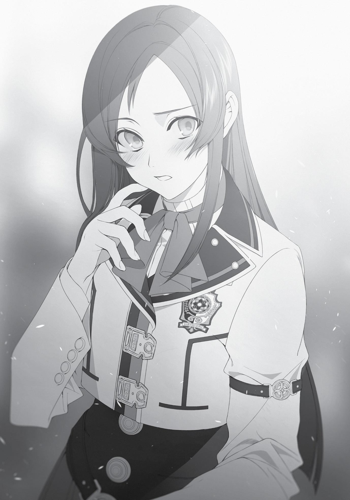

+++
title = "Chapter 11: Three Heads Are Better Than One"
date = 2026-07-20
weight = 10
[extra]
volume = 10
chapter = 11
+++

only just begun my research, so I’ve never even drawn a proper circle
yet myself, but…”
“Wait, doll? You mean the one from before? Let me see.”
“Master, is that all right with you?” Zanoba asked.
“Yeah, of course.”
Zanoba fetched us a sliver of the doll’s arm. Cliff studied it with
great interest before declaring, “The person who created this was a
genius!”
It had to be remarkable if someone as self-important as Cliff said
that.
“I’ve never seen a magic circle like this before,” he continued.
“Grr, I have no idea what the mechanics behind this are. Are these
two magic circles, one on top of the other? No, that’s not it, there’s
more than that. It couldn’t move properly without all of them
together. But it was still able to move even though it was broken.
Why? Dammit, what the hell is with this circle?!” Cliff gritted his
teeth in frustration. Almost like Vegeta witnessing Goku’s power
level—it was over 9,000!
“I don’t know all the details yet myself, but, according to the
book, this circle apparently controls the movement of the elbow.”
Zanoba answered Cliff’s question so casually that the latter looked as
if he might burst into tears.
Elinalise rushed over immediately and pulled his head into her
breasts, stroking his hair. “There, there, you’re a genius yourself,
Cliff. You would be just as knowledgable had you researched the
matter yourself.”
“I-I know that!” His face went red as he regained his composure.
Perfect, Elinalise. I knew I could count on you. But can you save
the bedroom stuff for later? We’re kind of busy right now.

Page | 177

“Master Cliff. If we used the same technique that was used for
the doll, do you think it would solve Silent’s problem with her
circle?”
“No clue. But it’s worth a shot.”
It was a lead, at least. Nanahoshi had only ever drawn her circles
on a single flat surface. Perhaps she’d never thought about layering
them or folding them. Then again, maybe there was a reason she
hadn’t tried that yet. I prayed it was the former, and that it would be
enough to motivate her once again.
The next day I took Nanahoshi with me to her research room. I’d
spent the previous day putting the unkempt room in order, and it
was in those premises, clean and yet still disorganized somehow,
that Zanoba and Cliff awaited us. The two of them were looking
through the research data that Nanahoshi had collected over the
years.
Seeing them, Nanahoshi just snorted derisively. “What’s this?
Did you bring me here so you could all ravish me?”
Really? Just how far down the path of self-destruction had she
gone? All because she’d failed once? Well, I guess it did only take a
single big failure to disrupt a person’s entire life.
“How dare you?! I’m a devout follower of Millis!” Cliff was
indignant. The Millis faith’s tenets regarding chastity were similar to
those of Christianity’s. Monogamy, no adultery, etc. etc. Very
austere.
“If you say so.” Nanahoshi just drifted unstably and took a seat.
Then she slumped back in her chair.

Page | 178

“Master Cliff, Zanoba, let’s just talk about what we came up
with yesterday.”
Nanahoshi listened with disinterest as I showed her a version of
her circle that Cliff had corrected with red pen. Then Zanoba’s
proposal of multi-level structures based on his research. And finally,
the idea I’d come up with: three-dimensional circles. She listened to
it all without a hint of emotion on her face, sitting perfectly still as if
she were frozen.
Then our gazes met. It wasn’t that she was disinterested. She
was just expressionless, concentrating.
“Ah.” Nanahoshi suddenly spoke. “It might work,” she mumbled.
Then she leaped out of her seat. “So that’s it, that’s what it is. There
was no reason for me to get so caught up in drawing on a flat
surface. That makes sense, of course. Putting it on paper will provide
depth. If I layer those papers, I can make as big of a magic circle as I
want. Why couldn’t I think of such a simple thing so much sooner?!”
Nanahoshi anxiously paced around the room three or four
times. She took pen and paper from her desk and began to draw. She
would write something that looked like a formula, quickly erase it,
then start again. “Urgh, no! This isn’t it!”
“Hey, isn’t this what you mean?” There went Cliff, blissfully
unaware, inserting his head into the cage of the bear that was
Nanahoshi. He’d produced a red pen out of nowhere and annotated
her memo. That’s our Cliff, I thought sarcastically. The air in the room
changed for the better and he, of course, still can’t read it.
“Oh, so that’s it. You’re pretty clever,” she commended.
“Of course I am. I’m a genius.”
“Then how about this? What should I do here? I’ve been unsure
about this part for a while.”
“Uh, hold on a sec.”

Page | 179

Cliff and Nanahoshi…were working well together. They stood
shoulder to shoulder, jotting things down on a sheet of paper. I
glanced at their work, but it just looked like a child’s scribbles to me.
“Zanoba, do you get what they’re doing?”
“They’re far beyond my understanding.”
The two of us had been left out in the cold. Still, Cliff sure was
amazing. It hadn’t been that long since he first began researching
magic circles himself. Well, whatever. Nanahoshi seemed to be in
good spirits. Even if she didn’t succeed this time, at least she had a
foothold once more, and reason to hope.
“Sorry, Zanoba, but I’m going to have to ask you to stay and
watch these two.”
“Where are you going, Master?”
“I’m going to get Elinalise. She wouldn’t like her man getting so
cozy with another woman when she isn’t around.”
I could hear the excitement in Nanahoshi’s voice as I left the
research room. It was the first time I’d ever heard such emotion from
her.
A week later, Nanahoshi had completed her magic circle. She
consulted with Zanoba and Cliff to fix the problems in the previous
version, and with their input, recreated the underlying mechanism.
In a magnificent display of intense concentration, she finished the
circle in a matter of days. She glued together five layers of paper,
creating a magic circle that looked as if it were made of cardboard.
“Now then, let’s begin.”
As Cliff and Zanoba looked on I began pouring my mana into the
circle.
Page | 180

The circle began to emit a vibrant light that illuminated the
room like it was noon. As the mana flowed from me, something
gradually began to take shape in its middle. Once the light dissipated,
we could see the object from another world that we’d successfully
summoned.
It was a plastic bottle. One with no label or cap. A simple plastic
bottle.
“Ooh, most impressive.”
“What the heck is this? Glass? No, it’s softer than glass.”
Zanoba and Cliff couldn’t hide their excitement at seeing a
500ml plastic bottle for the first time. Elinalise and Julie also peered
at it with intense interest. Nanahoshi looked at what she’d
summoned, clenched her hand into a fist and let out a barely
audible, “Yes, I did it.”
A plastic bottle. It was both insignificant and significant at the
same time. In that brief moment, our previous world became
undeniably connected to this one. We’d brought over an inanimate
object, and an incomplete one to boot, but still…we’d brought
something to this world that had not previously existed in it.
“You succeeded,” I said to Nanahoshi.
She nodded firmly, looking truly pleased with herself. “Yes, I did.
Now I can finally move on to the next step! As I probe deeper into
layered magic circles, I should be able to summon just about
anything. If I can organize the circle better, then by just changing out
two or three of the layers, I can most likely …”
Nanahoshi suddenly snapped back to reality. She averted her
eyes, looking a bit awkward. “Sorry. F-for causing you so much
trouble.”

Page | 181

Page | 182

“It’s give and take, right? Next time I’m in a bind, lend me a
hand, okay?”
“I-I’d already planned on that.”
Suddenly I noticed Elinalise staring. “You two sure are close,
huh?”
“You’re always quick to assume a love affair, Miss Elinalise,” I
replied.
“Well, you are a man and a woman. But it’s not very
appropriate.” Her eyes looked like those of a reproachful mother-inlaw.
I had no intention of cheating. Plus, Sylphie knew what we were
up to.
Nanahoshi voluntarily put some distance between us. “That’s
right, you are newly married. Wouldn’t be good if your wife
misunderstood.”
Elinalise laughed cheerfully, wrapping her arms around
Nanahoshi’s shoulders. “Heh heh, there’s no need for you to worry
over that. Ah, I know! Let’s go to the pub today! It’ll be your treat, of
course!”
Nanahoshi smiled wryly at Elinalise’s proposal. “I guess I have no
choice. But that makes me even with all of you, then.”
“Sounds wonderful, wouldn’t you agree, Cliff?”
Cliff, who’d been crumpling the plastic bottle in his hands,
looked back at us. “Huh? Yeah, sure! That makes us even. But you’re
pretty exceptional yourself, so I wouldn’t mind you helping me out
with my own research next time!”
Elinalise giggled.
And so our group headed to the pub that afternoon. For some
reason, Linia and Pursena joined us as we were making our way
Page | 183

through the school building, saying things like, “We don’t want to be
left out,” and “Take us along too, mew.” How in the world had they
managed to sniff us out?
As our little congregation filed outside, Ariel stopped to ask
what we were doing. When I explained the situation she said, “Then I
should have someone chaperone you,” and sent Sylphie along.
Clearly “chaperone” was an excuse and Ariel was just being
considerate. By the time we made it out the school gate, Badigadi
had joined us at some point and was hanging out at the very rear of
our group. No, seriously, just when had he snuck in here?
On our way, we stopped by the Magicians’ Guild, where
Nanahoshi went to withdraw some money. She was apparently using
it as a bank, and had an impressive amount stashed there.
The pub we selected was one of Badigadi’s favorites. Despite
the early afternoon hour, there were other patrons present.
Nanahoshi didn’t pay that any mind, however. She went to the
counter and slammed down her bagful of gold. “Reserve the whole
place for us,” she said.
“Huh? Are you serious?”
Seeing the barkeep looking flustered, Badigadi cut in. “Hold on
there.” He took out a bag of gold from his own pocket and slammed
it down. Now there was twice the amount. “It’s a day of celebration!
Let all those who come this day enjoy their alcohol free of charge!”
he declared. The man sure had a dignified presence about him. Just
as one would expect of a king.
He’s my idol! I want to be him! I thought inwardly, mimicking
the lines of a certain pair that idolized an infamous, immortal blond
vampire from a popular manga series.
Acting as if it were the most natural thing in the world, Badigadi
planted himself at the biggest table in the pub. There he demanded,
“Bring all the food you have on your menu!”
Page | 184

Once in my life, I wanted to try using that line myself. Since I
wasn’t the one paying, I was fine with him ordering whatever he
wanted, but were the twelve of us really going to be able to eat all
that food? Ah well. I was sure it’d be fine.
When the first of the food was delivered, the Demon King stood
and said, “Now then, what are we celebrating today?”
“The success of Silent’s research,” Elinalise helpfully cut in.
“All right. Well then, Silent, stand up. You must give your
commencement speech.”
Coaxed to her feet, Nanahoshi rose. She looked reluctant.
“Thanks for today.”
“Okay, now cheers!”
“Cheers!”
And thus the celebration began, not unlike that of the wedding
celebration we’d had not so long ago.
It was an enjoyable party. When good things happened, people
made merry and drank. I’d never participated in a gathering like this
in my previous life, not even once. Even in this world, I’d only done it
a couple of times. When I was an adventurer, I did occasionally drink
alongside the parties I worked with, but I always had a sense of
cynicism about it. I thought only fools got drunk, noisy and wild. I
would tut inwardly at their lack of consideration for those around
them. But now that I was in the fray myself, I finally understood how
those people felt. Sometimes, I thought, you just needed to let loose
and have fun.
My belief in that felt especially justified as I looked at
Nanahoshi, who was stroking Linia’s ears as she sang anime theme
Page | 185

songs in Japanese. If you didn’t occasionally cut loose and forget
your troubles, you wouldn’t be able to go on. Life was full of pain,
after all. If you didn’t try to find the good where you could, you’d
crumble. Elinalise and Badigadi probably knew that better than any
of us, given how long they’d lived.
Sylphie and I were going to drink to our hearts’ content today.
We never drank at home; it just wasn’t something either of us was
used to. And—although it had nothing to do with why we didn’t
drink at home—I finally understood just how bad a drunk Sylphie
really was.
No, it wasn’t that she was bad. She wasn’t bad at all. She was
just the clingy type of drunk.
“Hey, Rudy, pat my head.”
“Okay, okay. Good girl.”
“You can eat my ears too, you know?”
“Don’t mind if I do.”
“Ha ha, that tickles.”
When drunk, she turned into an unbelievably adorable creature.
It was phenomenal. I was going to have to approach her about
drinking more often. Ah, but her behavior made me worry about her
drinking by herself. Maybe I should tell her not to drink outside our
house, but then I wondered if that would be too controlling of me.
No, that doesn’t matter, I decided. She was mine. What was
wrong with doing whatever I wanted to something that belonged to
me?
“Rudy, hug me?”
“Yes, yes, I’m going to hug your hips tight.”
“Hee hee. I’m so happy.” The way she laughed sounded so
naughty somehow. Ahh, just thinking about going home with her and

Page | 186

making love to her made me feel like I understood why the world
was so full of love songs.
“Rudy, um, you know what, lately, well, I’ve been feeling
jealous.”
“What, seriously? Of whom? I won’t go near them anymore. I’ll
completely cut ties.”
“Actually, it’s Mister Ruijerd. You told me about him recently,
remember? When you talk about him you just look so…you know?”
“Yeah, but I just really look up to him. Please try not to let it get
to you.”
“I don’t like it. I only want you to only pay attention to me!”
That wasn’t what she’d said when I told her about Ruijerd. This
must be how she really felt. I always thought it was scary how she
seemed to accept everything with such perfect equanimity, but
maybe it only seemed that way because she worked hard to make it
so.
Just as I pulled Sylphie onto my lap and the two of us started to
fool around, Nanahoshi came over. She was drunk and trying to pick
a fight. “So sweet I could puke. Knock it off already. Do you even
know how many years I’ve been without my boyfriend?”
Was she already done singing? I’d be happy to sing a duet with
her. As long as she picked a fairly mainstream song, I would probably
be familiar with it. Then again, it might be that generational gap all
over again.
“At least go somewhere people won’t have to look at you if
you’re going to make out.”
“C’mon, don’t be like that. They’ve got alcohol here. Let’s have
some fun together.”
“Besides, I’ve been wanting to say this to you for a while now.
Even from inside my room—smooch smooch, creak creak. What the
Page | 187

hell is marriage anyway? Huh? What is it? I mean it’s fine, whatever.
But what the hell? There I was, totally down in the dumps, and you
two were having sex. I could even hear your voices echo at night,
god—eek!”
Badigadi suddenly lifted Nanahoshi into his arms. “Bwahaha!
Come along! Today you will sing me your bizarre songs!”
“They’re not ‘bizarre;’ they’re popular in my world!”
“How very interesting! I know not what world it is you come
from, but sing them for me! Go on then, sing as much as you can!”
“Hold on, I have something to say to Rudeus first!”
“Bwahaha! You are better off singing if you have nothing nice to
say to the man who helped you! Now, sing!”
“I was just leading into what I really wanted to say!” Nanahoshi
barked in protest.
She probably wanted to express her gratitude. Still, I only did
what anyone would do for a friend in trouble. She didn’t need to
thank me. Besides, she had to have quite the social status to warrant
being kidnapped by a Demon King. It was almost as if she were the
princess of some kingdom. That is, if said princess had been carried
off to a pub instead of a cell. And there was always a stage in a pub.
After a bit, Nanahoshi began singing. An accompaniment joined
in belatedly. At first, I thought maybe a troubadour was here, but it
turned out to be Badigadi holding the instrument. I didn’t know he
could play. Also, he’d asked her to sing for him and yet he was
performing alongside her? I definitely didn’t understand him.
All that aside, it was a familiar song. I couldn’t quite place where
it came from…ah, that’s what it was. “Gandhara,” the ending theme
to the TV series Monkey. That definitely wasn’t something I’d expect
her generation to know. Then again, it was pretty famous, though.

Page | 188

That said, she sucked. Badly. Horribly. Maybe it was because she
wasn’t syncing with the accompaniment. Nah, they both sucked and
that was why they couldn’t even sync up with one another.
Still, they seemed to be enjoying themselves. Besides,
Nanahoshi was the star of our group today. It was fine if she was
terrible. Even though her song was awful, it still conveyed her
feelings.
Did she really want to go home that badly? That was something
I couldn’t understand. My country of love was right here.
Even so, it was an enjoyable party. We should do it again
sometime.
The party came to an end when its star, Nanahoshi, got
completely tanked. Linia and Pursena carried her off to their dorm
room, where they were apparently going to have a sleepover. The
rest split off into groups. The heavy drinkers decided to visit a
different pub for another round.
Sylphie and I opted to return home. In her drunken state, she
giggled and clung to my arm. Her legs were a bit unstable, so I kept
an arm around her waist to support her, suddenly gaining insight into
how playboys felt when they went on group dates and knew they
were going to score.
Of course, I had no such impure thoughts—though that would
change once we got home.
“Rudy, isn’t it kind of noisy?” Sylphie said suddenly.
“Hm?” Now that she mentioned it…
I strained my ears. I could hear the sound of someone banging
on something, and voices arguing. Sounded almost like when cats
Page | 189

fought. As we approached our house, we saw a group standing at the
door, noisily banging on it. From afar, all I could see were their
silhouettes. Some neighborhood brats, maybe, or thieves of some
sort.
My mind was still muddled from the alcohol, but I activated my
demon eye to be safe. Sylphie slapped at her cheeks and, though still
unsteady, stood on her own two feet. “Rudy, I’m going to detoxify
us.”
“Got it.”
Sylphie voicelessly cast detoxification on me, and I could feel the
alcohol inside me evaporate. It didn’t completely sober me up, but
my head felt clearer. Careful to make sure our would-be thieves
didn’t spot us, I crept quietly toward them. That’s when I heard their
voices.
“The whole reason it got this late was because you got us lost,
Norn!”
“Same goes for you, Aisha. You’re the one who said it was
definitely that way.”
“Besides, we don’t even know if this is really the place or not!
What are you going to do now? All the inns are already closed! Now
we’re going to have to make camp outside in the cold!”
“I don’t like this either, but you’re the one who said we’d stay at
his place, so we didn’t need a room today. I didn’t want to stay at his
house, but you forced me to come along—”
“That’s because we told Ginger we’d be all right! Getting a room
after that would be stupid!”
“You’re always like that, always acting like you’re better.”
Screeching voices. Children’s voices, ones that sounded a bit
familiar to me. And in the midst of their exchange, I heard names
that I knew. Then finally…
Page | 190

“Both of you, calm down. This is definitely the place. There’s a
familiar presence here.” A composed man’s voice. The instant I heard
it, a whirlpool of indescribable emotion rose within me.
I let out a sigh of relief and stepped in front of them.
“Ah!”
“Big brother!”
My two little sisters, who’d both grown considerably, stood
dressed in matching arctic outfits in different colors, like the
characters from Ice Climber. Norn Greyrat and Aisha Greyrat. The
one with a complex expression on her face was probably Norn and
the one with a look of fierce determination was probably Aisha.
“Big brother, I missed you!” Aisha came flying at me, wrapping
both arms and legs around my torso like a little monkey. She rubbed
her cheek against mine. Her skin felt cold, though I might just have
been warm from the alcohol. “Ooh, you feel so warm! And you stink
of alcohol!”
“And you’re making me cold. Please let go.” As I peeled Aisha off
of me, I looked over at Norn, who had her lips firmly pursed. She
dipped her chin in greeting.
“You drink alcohol?” she asked.
“Yeah, we had a bit of a celebration.”
She looked perturbed, and I didn’t think it was just because she
was shy. Paul had mentioned she wasn’t my biggest fan…
Then, behind Norn was…
“It’s been a while, Rudeus,” said the bald man with a scar on his
face. A proud warrior wielding a lance. Looking no different than I’d
seen him last, three years ago.
“It has been a while, Mister Ruijerd.”
I was hit with a wave of nostalgia, remembering the days we
traveled together, just the three of us. How we met, how we parted.
Page | 191

What I should say? While I was searching for words, Ruijerd suddenly
looked behind me. “I heard at the Adventurers’ Guild that you’d
gotten married, but…I see it wasn’t to Eris.”
The person he was gazing at was Sylphie. Her expression turned
to surprise, but she quickly bowed. “Um, Rudy, for the moment, why
don’t we invite them inside?”
“Oh, yes, that’s right. Come on in.” I unlocked the door and
gestured them in.
It had barely been a month since the letter arrived. They were
here much, much earlier than I’d expected.

Page | 192

Chapter 12:
Nostalgia and Frustration

I

WAS CURRENTLY PERCHED

on one of the living room couches. Seated

across from me was Ruijerd. Sylphie had guided Aisha and Norn off
to the bath. Sylphie and I had both sobered up. The smell of alcohol
still probably lingered on our breath, but detoxification magic had at
least lifted the inebriation.
As I looked at Ruijerd’s face, illuminated by the crackling fire, I
remembered the first time we’d met. Other memories flooded in:
the time we’d traveled with Eris, just the three of us, and other
things.
“It really has been a while,” I said.
“Yeah.” Ruijerd also narrowed his eyes and lifted the edges of
his mouth. Just the way I remembered.
“First of all, I guess I should say thank you for escorting my little
sisters here.”
“No thanks needed. Protecting children is only natural.”
Right—that was Ruijerd for you. I remembered jokingly calling
him a lolicon when we were traveling together. Still, I was surprised
to see the person Paul mentioned in his letter was Ruijerd, after all.
I’d considered the possibility that it might be Ghislaine, but given
that the task was escorting children, Ruijerd was the best man for
the job. So much so, in fact, that I would have hired him on to be
Aisha and Norn’s bodyguards for life, if that were possible.
At any rate, it had been a long time since the two of us had
talked. What had we even talked about, back then? Ruijerd was
quiet, not the kind who went in for small talk.

Page | 193

“By the way, what happened to Eris?” Ruijerd asked, bluntly. It
was a question I didn’t really want to answer, but he deserved to
know.
“A lot of things. Let me start from the beginning.”
I told him about what happened after we parted ways in front of
the refugee camp. About how Eris and I slept together. How,
immediately afterward, she disappeared and I fell into the depths of
despair. How I couldn’t recover from it. How I spent the intervening
two years searching for my mother. How I met Elinalise and heard
about what was going on. How I followed the Man-God’s
recommendation and enrolled in this school. How, in turn, that led
me to reuniting with Sylphie and how she’d helped me recover. Then
about our wedding.
“I see.” Ruijerd listened quietly the whole time without saying a
word. Finally, he said, “That happens often.”
“It happens often?” I repeated.
He just nodded. “It’s an outlook warriors often get bogged down
by. I’m sure Eris doesn’t hate you.”
“But she said the two of us weren’t ‘well-balanced’.’”
“I have no idea whether she meant those words literally, or if
you just misunderstood her meaning.”
“Misunderstood?”
“Yes. Eris was never very good with words.” Ruijerd would
know—he wasn’t, either. “At the very least, she liked you when we
were traveling together. If you have the opportunity to meet again,
keep a cool head and talk to her about it.”
Had I gotten it all wrong? When she said we weren’t wellbalanced, did she just mean that she wasn’t at my level? Had she left
to get stronger, so she could achieve that balance and then return?
In which case, maybe her meaning had been, Wait for me.
Page | 194

Even so, it was too late to be told that now. No matter what
she’d meant, I’d still spent three years suffering. Three years in which
I hadn’t heard a peep from her. The person who finally saved me was
Sylphie, not Eris. What was I supposed to do now, toss Sylphie aside
and make up with Eris? There was no way.
Besides, honestly, I was still a little terrified by the thought of
meeting Eris again. It wasn’t as if I didn’t trust what Ruijerd was
saying, but there was the possibility that she really had just gotten
fed up with me. It would be a real blow to my feelings if I approached
her with the intention of reconciling, only for her to punch me and
refuse to look me in the eyes.
Let’s stop thinking about it, I told myself. Whatever the truth
was, I couldn’t change the past. Dwelling on it wouldn’t help.
I changed the topic. “What have you been doing all this time,
Mister Ruijerd?”
“Ah, yeah.” He looked like he still had something he wanted to
say, but still nodded. “After I parted ways with you two, I headed for
the forest area in the southern region.”
Apparently Ruijerd had guessed that the Superd Tribe hiding in
the Central Continent would be in a forest. He made his way to the
dense forest to the south of the King Dragon Mountains, where he
conducted an exhaustive search for two years. Ultimately, he found
no trace of the Superd, though he did find several items belonging to
people believed to have died during the Displacement Incident. He
delivered those to the closest town.
His search of the forest yielding nothing, Ruijerd headed south
along the coast and arrived at East Port. He’d planned to catch up on
the information coming out of Millis there, then head north to search
the Conflict Zone. However, as luck would have it, he ran into Paul.
After that, everything happened just as Paul had written in his letter.

Page | 195
