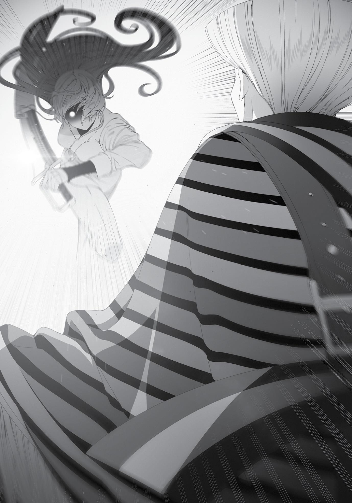

+++
title = "Chapter 12: Nostalgia and Frustration"
date = 2026-07-20
weight = 11
[extra]
volume = 10
chapter = 12
+++

When Paul hesitated over whether or not to send his two girls away,
Ruijerd volunteered to act as an escort.
“Oh, I met your master too.”
“Master Roxy?”
“Yeah.” Ruijerd had a strained smile. “She was a little different
from your description.”
“Really? In what way?”
“The second I said my name and she saw the gem on my
forehead, she was completely terrified.”
Come to think of it, Roxy was the one who’d told me that the
Superd Tribe were terrifying killers. As a member of the Migurd, who
lived in fear of the Superd, her reaction was probably inevitable. I
wished I could have seen it, though—Roxy trembling in terror at the
sight of Ruijerd.
“So I heard you traveled alongside Miss Ginger all the way
here?”
“Yeah. We arrived in the evening and went to the university but
couldn’t find you there.”
They’d thought I lived in the dorms. Of course, I’d already left
for the pub at that point, and I guess no one they asked knew where
I’d gone, so they asked for my address instead. To make sure they
didn’t somehow miss me, the three of them went looking for my
house while Ginger split off to cover more ground. However, they
got lost along the way, either because Aisha or Norn got the street
wrong, or because the person who’d explained the house’s location
had done so incorrectly. As they wandered the city, Ruijerd picked up
my footprints and followed them to our house.
“So that’s what happened,” I said. “I must convey my gratitude.
Thank you.”
“There’s no need to thank me.”
I couldn’t help but smile at his words. One of my greatest
sources of pride was being recognized as a friend by this man.
“Anyway, you guys sure got here fast,” I said. The letter had only
arrived last month. I’d thought it would take them two or three
months to get here, at the earliest.
“Your little sister was eager.”
“Which one?”
“Aisha. It was thanks to her we were able to travel so quickly.”
According to Ruijerd, Aisha had proposed they accompany a
merchant caravan so they could travel at night, too. Such caravans
generally didn’t accept outsiders, so Aisha offered them Ruijerd and
Ginger’s services as guards in exchange for letting her and Norn ride
along. It was a good deal, though the negotiations hadn’t been easy.
Every time their current caravan reached its destination, they
would move to the nearest town in search of another one. It was
through this rapid changing of caravans that they were able to travel
so efficiently. They would gather information on the caravans’
schedules and locations, sometimes even retracing their steps to a
previous town to hop on a caravan that suited them better. When
the three of them asked Aisha why they had to double back, she said,
“Because this way is faster.” Amazing.
“That must have been rough for you, though? If you were
moving around in the daytime and acting as a bodyguard at night,
that means you had to be awake all the time.”
“It wasn’t. I’m used to traveling continuously without rest, and
have been for a while now. But…”
“But?”
“It was the first time in a while that I felt like I was being
ordered around.” He gave a thin smile as he said that. Perhaps he
was recalling the time of the Laplace War.
Aisha, that little stinker. “Well, I’m not really sure what to say,
but it seems my little sister caused you a great deal of—”
“It’s just a funny story.” As usual, Ruijerd was soft when it came
to children. But even if he didn’t mind it, we couldn’t raise Aisha to
be the kind of person that ordered people around. I’d have to give
her a piece of my mind later.
“But she just slept like a log while you worked nonstop, didn’t
she?” I argued.
“She wasn’t sleeping. She was constantly calculating our route,
planning for us to travel in the most efficient way possible.”
Hm. Okay, so she hadn’t been making Ruijerd do all the work. If
that was the case, then I couldn’t fault her.
“She’s still a child, though,” he added.
Aisha’s gleeful no-breaks plan apparently didn’t account for
their stamina. Partway through the journey, she and Norn both
collapsed from exhaustion. According to Aisha’s internal schedule,
she planned for them to arrive before winter, when the weather
would make it difficult for them to travel. That was how they made it
here faster than the letter suggested.
“Miss Ginger must have had a rough time of it as well. How was
she?”
“She was actually quite happy with our pace. She said she
wanted nothing more than to see His Majesty as quickly as possible.”
There were a lot of people in this world with muscles for brains,
it seemed. Ginger sure was a loyal one. She’d probably been reunited
with Zanoba by now. How would she react when she saw Julie? I
wished I could be there to see it.
“She intends to resume serving the Prince, apparently,” Ruijerd
confirmed.
“I see. By the way, how long do you plan to stay here?” I asked
nonchalantly. I assumed the answer would be about a week. It
wouldn’t take that long for me to introduce him to all of my friends. I
was sure Zanoba would be delighted. Linia and Pursena would
probably also have something to say. Who knew what Cliff would
think? Ruijerd and Badigadi might already be acquainted, actually.
Those thoughts came to a crashing halt when I heard Ruijerd’s
response: “I leave tomorrow.”
“That’s quite…soon.”
“I heard someone saw a devil deep in the woods to the east. I
plan to check that out.”
Ruijerd had already sniffed out his next stop. I did think he could
afford to stay a bit longer, but it would be insensitive of me to keep
him.
“Besides,” he said, “I have no intention of getting in your way.”
“Of course not. You’d never be in my way.” I would never treat
him like a nuisance.
“It’s also a bit…difficult to be here.”
There was a loneliness to his voice. Perhaps it came as a bit of a
shock that Eris and I weren’t together. I didn’t know exactly how
Ruijerd felt, but if I were in his position, I might also find it a bit
difficult to watch me cozying up so lovingly to Sylphie. “I guess I can’t
blame you for that.”
It felt like a rift had formed in our friendship. Maybe Eris was the
foundation that kept us together.
“Rudeus.”
I lifted my head when he called my name. Apparently, I’d
averted my eyes at some point. Ruijerd gave me a thin smile. “Don’t
make that face. I’ll come back again.”
It was all I could do to force a smile in return. I didn’t regret the
fact that I had married Sylphie. However, I did feel as if I’d made
some kind of mistake, here.
“If I happen to meet Eris, I’ll see what she has to say.”
“Please do,” I replied, looking straight into his eyes. I found a
gentle light burning within them.
Soon after, Sylphie emerged from the bath. Norn apparently fell
asleep mid-bath, while Aisha had been quite rambunctious in the
water, but collapsed into sleep the moment she got out. Such was
the relaxing effect of a bath. Warm water did wonders for an
exhausted body.
“Thanks for doing all that.”
“Aisha seemed to remember me. She guessed who I was right
away. Quite unlike someone else we both know.”
“Your hair is longer, you’re not wearing sunglasses, and you’re
not in boy’s clothes, so it doesn’t count.”
“But Norn didn’t seem to remember me.”
“It’s rare for a three- or four-year-old to remember other
neighborhood kids.”
“I guess.”
Sylphie had changed the girls into pajamas and tucked them into
the same bed. Talking to them would have to wait till tomorrow.
“Um, it’s a pleasure to meet you. I’m Sylphiette Greyrat.”
“Yeah. I’m Ruijerd Superdia.”
Sylphie and Ruijerd awkwardly shook hands. They’d both
suffered for their green hair in the past, though neither of them
sported that color anymore. Ruijerd had shaved it all off, while
Sylphie’s had turned white during the Displacement Incident.
“Umm, Mister Ruijerd, what would you prefer in terms of a
room?”
“Anything is fine.”
“Rudy, should we have him use the big room? He’s an important
guest, isn’t he?”
I didn’t think Ruijerd would be particularly concerned about the
size of the room. Besides, he wouldn’t use the bed, anyway. “Sleep
wherever you like. Think of our home as yours.”
“Yeah, I’ll do that then. Well, I’m off to sleep.” Ruijerd finished
speaking, then stood up.
“All right, good night.”
Sylphie and I just stood there stiffly, listening as he moved
through the house. Apparently, he’d entered the room where the
children were sleeping. That lolicon bastard! Nah, just kidding. When
we’d traveled together, he never took his eyes off of us even when
we slept. That was just the kind of man he was. Besides, he’d let us
hear his footsteps on purpose. If he were up to something
suspicious, he would have silenced them and moved with stealth.
“Did I do something to offend him?” Sylphie asked anxiously.
Ruijerd had been a bit curt. It seemed he had some conflicting
feelings about my marriage to Sylphie, after all.
“No, you haven’t done anything wrong. He takes a bit to warm
up to people he’s just met, that’s all.”
“If you’re sure that’s all it is.” Sylphie had a slightly wounded
look.
“Let’s go to bed, okay?”
“Okay.”
I’d skipped dinner that night, but I wasn’t even hungry. Oh, I
should’ve at least provided Ruijerd something to snack on, I thought
as I put out the fireplace and checked the lock on the front door. We
already had the most useful security system in the house, but I still
wanted to be safe.
After turning off the lights, Sylphie and I headed up to the
second floor together. Then we slipped into bed.
There, Sylphie said, “Let’s, um, just skip today, okay?”
“Huh? Oh, yeah, sure.”
We held off on the sex that night—the first time we’d skipped
for a reason other than her period.
The next morning, I woke up in bed just as I always did. Sylphie
was still asleep. Normally she was curled into a ball, using my arm as
a pillow, but today she was using her own pillow and had a tense
look on her face. Ordinarily, my affection for her came unbidden,
together with a pinch of sexual desire, and I would reach out to
touch her chest. Then, as I had that source of perfection nestled in
the palm of my hand, a wave of bliss would wash over me.
But I didn’t feel that sensation today. Instead, I felt under the
weather. It wasn’t a good day for my rising dragon. I should’ve been
happy since Ruijerd was here, but it seemed Eris was really weighing
on my mind. I felt gloomy and restless.
Though I didn’t feel too motivated, I decided to start my daily
training anyway. I was sure that five minutes—no, ten minutes—of
exercise would perk me up. With that thought in mind, I stepped
outside.
A chilling scene awaited me.
Someone else was already standing at our front entrance. Two
towering figures, actually: one a bald warrior, a man who’d shaved
his hair in order to hide its green hue. He wore none of the arctic
clothing common in the region, but was dressed in civvies, bearing a
lance. It was Ruijerd.
Then there was the other man. He had a large and brawny body,
with skin as black as pitch, and purple hair. Badigadi had his six arms
folded together over his chest, giving off an immensely imposing
aura as he stood in front of Ruijerd.
The chill in the air was intense. Volatile. If someone lit a match,
it might explode.
Badigadi wasn’t smiling, which was rare. In fact, he wore no
expression at all. Ruijerd had his back to me, so I couldn’t see his
face.
Did this mean they knew each other, after all? They’d both been
alive since about the time of the Laplace war: one the captain of
Laplace’s imperial guard, the other in the moderate faction on the
opposite side. Ruijerd currently despised Laplace with all his heart,
but back then, their circumstances had probably been quite
different.
“Hm.” Badigadi gave me a glance. Then he looked at Ruijerd
once more. “So that’s it.” He nodded, apparently having satisfied his
curiosity. Then, without saying anything more, he turned on his heel.
The snow crunched beneath his feet as he disappeared into the
distance.
Ruijerd silently glanced over his shoulder at me. He looked a bit
anxious. It was a rare thing to see him in a cold sweat.
“Did something happen between you and King Badi?”
“A long time ago.”
I could infer the rest from his short reply. I’d heard the madness
of the Superd Tribe had led them to attack any who crossed their
path, be they friend or foe, and that had to have included some of
Badigadi’s people. Regardless of how uncommitted he was to ruling,
he was still a king.
I wondered what their relationship had been like after the war?
I couldn’t picture someone as optimistic as Badigadi seeking revenge
on the Superd. If anything, he’d probably championed the powerless
citizens the Superd had hurt. Even if Laplace had been the cause of
the Superd’s destructive tendencies, Ruijerd had still killed people,
and Badigadi had gotten his revenge for it. I was sure that was it.
No, wait. It was possible Badigadi didn’t know how or why what
went down with the Superd Tribe was Laplace’s fault. I should talk to
him about it next time we met.
Come to think of it, how would he react if I told him that I
planned to mass-produce and sell Ruijerd figurines in the future?
“Mister Ruijerd, just to be clear, that man has been good to me
ever since he came to this city. I can only imagine what must’ve
happened in the past, but…”
“Don’t worry. I have no intention of fighting him.” Ruijerd smiled
stiffly as he said that. Yet he’d clearly exhibited the intent to kill
moments ago. If I hadn’t come out when I did… “Still, I never thought
I’d see him here of all places.”
“Apparently, he came here to see me,” I said.
“Ahh, well, that does fit his character.” Ruijerd forced another
smile before returning to the house.
The whole encounter had thrown me for a loop. I would have
thought cheerful, easy-going Badigadi could get along with anyone.
When I returned to the house, Sylphie was awake and preparing
breakfast. Aisha, who had donned a maid outfit for some reason, was
helping out as well. Norn appeared to still be asleep. Intending to
rouse her, I headed upstairs. I knocked on the door and immediately
began reaching for the doorknob, but a sense of foreboding stopped
me from opening it. Instead, I called out to her. “It’s about time for
breakfast, so please come downstairs.”
There was no answer, but when I strained to listen, I heard the
rustling of clothes. Apparently, she was in the midst of changing. I’d
avoided triggering a surprise naked scene! I wasn’t a dull-witted
protagonist anymore, after all.
“…Okay.” Once I heard her voice from behind the door, I felt
relieved and returned to the first floor.
The five of us ate breakfast together. Aisha seemed to have
good table manners for her age and ate beautifully. As usual, Ruijerd
only used a fork. Norn, still looking half asleep, didn’t eat very
gracefully. Well, at least I could say she was using a fork. That was a
step up from Eris, who just stabbed her meat with a knife and put it
in her mouth.
“Well then, it’s time for me to be off.”
As soon as our meal was finished, Ruijerd prepared to depart.
He had very little in the way of baggage, so he wasn’t carrying much.
The five of us set out for the city exit to see him off. Ruijerd claimed
that wasn’t necessary, but it wasn’t a problem of necessity. It was
only natural to see a friend off.
There wasn’t much conversation as we walked. Eventually Norn
grabbed onto the hem of Ruijerd’s shirt, quiet enough it could almost
go unnoticed. Ruijerd, however, did notice and slowed his pace a bit.
I eased up to match them.
Norn didn’t seem to want to part with Ruijerd, and I understood
the feeling. Perhaps I should beseech him to stay, after all? One night
just wasn’t enough to catch up, and there were people I wanted to
introduce him to, and a mountain of things I wanted him to see.
But the thought of Eris held me back, as expected. I didn’t want
to cause Ruijerd discomfort. It wasn’t any fault of Sylphie’s; it was
just that I felt like I couldn’t really talk to Ruijerd until I’d cleared the
air with Eris. Yet, right now, I didn’t even know where she was.
As I debated these things, we arrived at the city entrance. “Well
then, stay safe,” Ruijerd told me.
“You as well,” I said.
Our goodbyes were short. There was so much I wanted to say. I
just couldn’t find the words in the moment. Well, it wasn’t as if this
was goodbye forever. I just had to talk to him again once things had
calmed down more. As for Ginger, she had apparently already said
her farewells to him yesterday.
“Thank you for taking care of us!” Aisha cheerfully bowed. She
surely understood her fast travel schemes would never have worked
without Ruijerd. that. I was sure Ruijerd had protected them from
dangers unbeknownst to them, too.
“Aisha, don’t demand too much of Rudeus.”
“Yes, I know!”
Ruijerd smiled stiffly and patted her on the head.
“U-um, uh, Mister Ruijerd…” Norn still hadn’t let go of Ruijerd’s
shirt. She had an anxious look that clearly said she didn’t want him to
go.
“Don’t worry, we’ll meet again.” Ruijerd offered her a small
smile as he rested his hand on her head. Seeing the two of them
stirred up old memories. Back when I made that same anxious
expression, Ruijerd would also stroke my head.
Norn looked down, then lifted her face. She tried to say
something, then pursed her lips. Her face contorted into several
different expressions until she finally made up her mind. “I-I want to
go with you!” she declared.
Ruijerd looked troubled as he stroked her head, saying nothing.
However, as the seconds passed, Norn’s eyes quickly filled with
tears.
“Rely on Rudeus from now on, not me,” he said.
“But I can’t! He and Father—”
“That’s in the past. He’s already reflected on his actions. Your
father did as well. I told you about the hardship he’d been through as
we traveled. Even you accepted that.”
“But yesterday he was drunk! And he’s with a different girl this
time than he was last time! I can’t trust him!”
The air around us seemed to grow chill when she said that,
though maybe it was just my imagination. After all, I had already told
Sylphie about Eris. It wasn’t cheating, and it wasn’t as if I were trying
to be a playboy—though that probably wasn’t how it looked to Norn.
Ruijerd looked at me and then Sylphie before forcing a smile.
“That’s just the way of things between men and women. It happens.
It absolutely doesn’t mean your brother is disloyal.” He took his hand
away from her head. “Over there, you. Will you tell me your name
one more time?”
“Oh, yes. I’m Sylphiette.”
“Sylphiette. I leave these two and Rudeus in your care.”
“O-of course!”
Ruijerd finally exchanged words with Sylphie at the very end. His
feelings toward her were surely complicated, but I prayed he held no
ill will.
“Well then, let’s meet again.”
I watched him go until I couldn’t see him anymore. There was a
time when I’d watched as his figure receded into the distance, filled
with gratitude toward him. I was sure that right now, Aisha and Norn
felt the same.
Side Story:
The Sharpening of Fangs

O

N A NAMELESS CAPE,

just an hour’s journey on foot north of the

Sword Sanctum, a lone girl was swinging her sword—a simple swing
with no technique that belonged to the Sword God Style or anything
else. The girl’s name was Eris Greyrat.
Eris Greyrat mindlessly swung her sword. There in that space, all
by herself, with no other soul around. Just mindlessly, mindlessly
swinging. A swing weighed down by idle thoughts was a meaningless
one. A swing that merely mimicked the motions of others was
meaningless, too. But if your sword was pure, empty of thought,
then each swing would sharpen your skills.
She would keep honing her abilities, cutting away slice by thin
slice until the way before her was clear enough that she could see
through to the other side. Each slash made her that much stronger.
How much more repetition was required? Just how long would she
have to continue before she’d reach Orsted’s level?
Eris didn’t know. No one did. Perhaps she would never be able
to reach that level, no matter how hard she worked.
Such thoughts were exactly the meaningless kind she was
supposed to avoid. “Tsk.” Eris clicked her tongue. She shook her head
and sat down to think.
It was annoying. She wanted to defeat Orsted, but the more she
thought about it, the further he seemed to get from her. At one
point, her master Ghislaine had told her, “Think.” Eris, however, was
bad at thinking. No matter how much she wracked her brain, she
couldn’t produce an answer that satisfied her.
Compared to that, her second teacher, Ruijerd, had been much
better. “Do you understand?” he would ask. He would knock her
down, then just ask whether she understood or not. Over and over
again, he would keep going until she finally got it. Without her having
to use her head, as if they were equals.
Eris respected Ghislaine. She also respected Ruijerd.
Frustratingly, the Sword God’s teachings combined the good parts of
both of the people she respected. He had ordered her thusly: “Just
swing your sword without thinking. Don’t think, just swing, and when
you get tired, then think. When you’re tired of thinking, stand back
up and swing again.” So she did just that. She swung, sat, swung, sat.
When she got hungry, she ate. Then she repeated the process of
swinging her blade and sitting all over again.
At first, she did this at the training hall. When she did that,
however, someone would inevitably get in her way. The usual
culprits were other girls from the training hall. They would say, “Hey,
we’re doing fighting practice this morning, join us,” or, “Hey, food is
ready, so come eat,” or, “Hey, can you train with me a bit?” or, “Hey,
you stink, go take a bath.” Things of that sort.
It had become so annoying that Eris just left the training hall.
She left and continued walking until she found an unoccupied bit of
land and started practicing there. She ate what she’d brought with
her from the training hall’s kitchen, or whatever monster
occasionally tried to attack her. When it was cold outside, she
fetched logs from the training hall and used magic to light them for
warmth. When she got tired, she would return to the training hall
and sleep as much as she wanted.
This had been her daily life for the past six months.
There was one thing that Eris did understand. Mastering the
sword was difficult. When she was younger, she’d thought swordplay
so much simpler and more suited to her than studying. Well, that
part was still true: Swordplay suited her far better than book learning
ever had. But it definitely wasn’t simple at all. In fact, you might even
say book learning was simpler, as long as you had someone else
teaching you.
All she did was raise her sword and bring it back down again. Yet
for some reason, she couldn’t get good at it. She should be able to
raise it faster. She should be able to strike faster. But she hadn’t
managed to achieve her desired speed. She had to be faster now
than she had been six months ago, but Ghislaine was still faster.
Ruijerd was faster. The Sword God was faster. And Orsted, of course,
was faster.
She tried to recall the way they fought—the Sword God, Ruijerd,
and Orsted. How had they each moved? She tried to imitate their
movements, from the tips of their fingers to their shoulders, all the
cells in their body. Then she tried to go beyond that, to transcend
them.
Except she didn’t know how. There was no way she could.
Eris was bad at thinking.
Once she was exhausted by the endless cycle of thoughts
running through her head, she stood back up and started practicing
her swings again. She swung without thinking about anything. Up,
down. Faster. Up, down. Faster. She went through ten repetitions, a
hundred, then a thousand. When she did, idle thoughts began to
filter in again. That happened when she got tired.
“Tch.” She clicked her tongue once, then took a seat. Her hands
hurt. Blisters had broken open on them. She produced cloth from her
pocket and disinterestedly wrapped it around her hands.
It hurt, but it wasn’t painful. She could always recall what
happened three years ago at the Red Wyrm’s Lower Jaw. Compared
to that, she felt like she could withstand anything. Pain meant
nothing to her; not the ache in her hand, not her frustration. Not
even the fact that she was by herself right now, without him by her
side.
“Rudeus.” She breathed out his name.
Eris didn’t think about it any further. She was bad at thinking.
She also wasn’t very good at staying positive. The more she thought,
the more she realized she could break.
“Phew.”
Three years. She thought she’d gotten stronger, but it still
wasn’t enough.
Eris stood up and started swinging her sword again.
Tamping down her drowsiness, Eris headed back to the training
hall. At its entrance stood a man she didn’t recognize—a striking
man, at that. His robes were dyed in rainbow hues, and below them,
he wore only knee-length boots, with four swords at his waist. On his
cheek was a peacock tattoo, and his hair was gathered up in a style
that fanned open at the top, like a parabola. When he spotted Eris,
he bowed his head slightly and attempted to greet her.
“I am the North—”
“Move.” Eris spoke a single word to the man standing between
her and the training hall. She did not care to say anything more.
She’d sharpened herself to her very limits with all the swinging she’d
done. The glint in her eye as she glared was that of an aggressive
beast. Murderous intent swelled from her like an all-consuming
blaze. She was a wild animal that wouldn’t let anyone come close.
“What…?!” The man immediately drew his sword.
“You’re in my way.” Eris took a step forward as she spoke. To
her, the man before her was nothing but an obstacle. One standing
between her and her nest.
“Wh-what in the world is this creature…?” At first, the man
didn’t even understand that words had come out of her mouth. For a
moment, all he saw was a starved beast looking for a meal. Then Eris
drew a blade of her own, and he finally realized she was human, and
a swordfighter at that.
“You may refer to me as Auber, the Peacock Blade,” he said. “I
see that you are a student of the Sword God Style. Might I request
that you guide me to meet with the Sword God—”
“I told you to move.” Irritated, Eris took another step forward.
She was telling him to get out of her way. However, those words
didn’t register with the man called Auber. The only thing that did was
Eris’ murderous intent. That and the realization that talking was
pointless. With that, Auber—with one sword in his right hand—
reached for the shorter sword at his waist with his left. However, he
wielded his weapon in reverse, brandishing the flat side of the blade
at her.
At striking distance, Eris decided she would remove the obstacle
in her path by force. Shkt! Her blade whizzed through the air. She
was using Sword of Light, an ability honed through all of her practice.
A normal opponent had no hope of countering the Sword God Style’s
most lethal technique.

“Hmph!”
That was only if they were a normal opponent, however. Auber
gripped both swords in his hands and used them to brush off the
attack. Eris had perceptively anticipated his reaction and was now
swinging her blade back in the opposite direction.
“Ah…!”
Eris’ sword was stopped by the one in Auber’s left hand. She
was using two hands to wield hers, where he was using only one, but
he easily deflected her attack. Her blade slid off to the side, merely
clipping the edge of his hair. Eris’ body followed the momentum of
her blade, causing her to stumble on her pivoting foot. At that exact
second, Auber’s right hand flew toward her exposed neck.
“Tch!” Eris discarded her sword and dropped to the ground in a
crouch. Auber’s weapon plowed through the empty space where
she’d just been. Eris moved like a cat, flipping herself back over. She
was trying to retrieve her sword.
Auber kicked her weapon away and it vanished into the snow.
Normally, that would be the end of the match. But Eris didn’t stop.
The moment she realized her sword was lost, she flew at Auber with
her fists instead. Auber slammed the center of his blade against her
cheek with enough force to shatter her cheekbone. It left a single cut
on her face.
However, even after that, Eris still didn’t stop. “Graaah!” She
swung at his jaw.
Auber tried to stop her by using the weapon in his left hand.
“Mrgh!” Her hand tangled with his. Her fingers hooked around the
hilt. Auber felt a chill run down his spine as he realized she was trying
to steal his sword from him. This beast wouldn’t stop until he killed
it.
He gave the woman coiled around him a hard kick, sending her
hurtling through the air. Then he readjusted his grip on his weapon,
so the blade was now facing her.
Luckily for Eris, when he launched her through the air, she fell
right where her sword had landed earlier. Her breathing was uneven
as she took up the weapon. She had to kill him.
It was then, as Auber wielded his blade in earnest and began
emitting a murderous intent of his own, that a voice suddenly cut in.
“That’s enough.”
The bloodlust ended. Eris was already frozen in place, having
sensed the change in demeanor from her opponent. The Sword God
had appeared without them realizing and was now standing at the
entrance of the training hall. Auber put away his sword, and Eris
flopped down on her back. She stared at the sky, still breathing hard.
Her face was twisted in frustration.
Auber put his right hand to his chest and bowed his head. “It has
been too long, Master Sword God.”
“So you came, North Emperor.”
“I read your letter. And then that girl attacked.”
“Ahh, incredible, isn’t she?”
“It’s the first time I’ve seen a swordfighter that relentless. She
was almost like a beast. Ahh, so this is the child they refer to as the
Mad Dog.”
Eris listened to their conversation as she stood up. The way she
drifted unsteadily forward made her look unearthly. Seeing her,
Auber readied his sword again. But Eris just glowered at him and
entered the training hall, vanishing into the building without a
second glance at the man who was left dumbfounded in her wake.
She wiped at the wound on her cheek as she headed down the
hall toward her room, not bothering to brush off the snow clinging to
