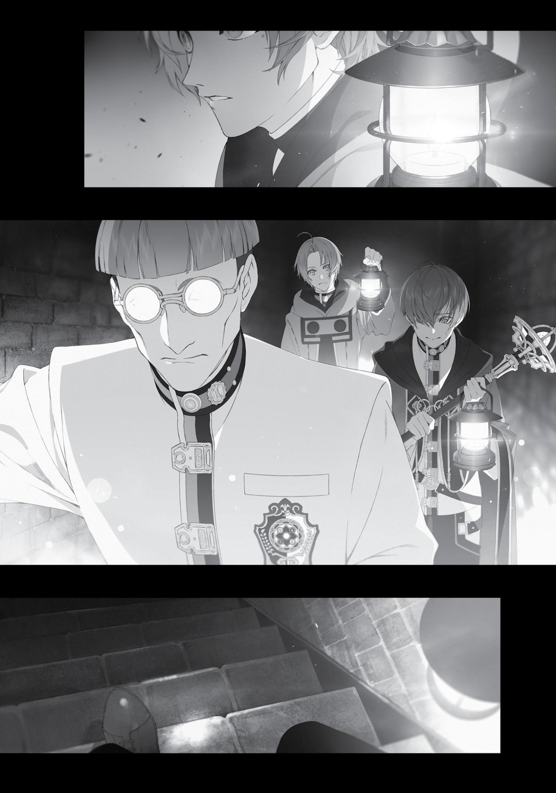

+++
title = "Chapter 3: Things to Prepare Before Marriage (Part 2)"
date = 2026-07-20
weight = 2
[extra]
volume = 10
chapter = 3
+++

creaking noise. Creepy. Probably just a monster that was squatting
here, though what kind, I didn’t know. I didn’t think it could be too
powerful, considering we were in the middle of a city. Then again,
low-ranking adventurers sent to clear out the house had been
brutally murdered. We couldn’t let our guard down.
Perhaps the truth was actually simple: bandits using the house
as a hideout, for instance. The creaking sound could be caused by
them picking the lock to the front door. No—the front door was
broken. Then maybe the back door? But there were no signs of
anyone living here at all.
Yeah, I was stumped. Maybe I should have brought Elinalise and
the others along, too. She’d seen a lot in her long life; she might’ve
been able to help us. Though, now that my little man was back in
action, I wasn’t confident being around her wouldn’t turn me on. I
could just imagine it—I’d be keeping watch in the middle of the
night, and a shadow would come creeping up to me, whispering
temptations into my ear. But Cliff is sleeping right beside us, I’d say.
And she’d respond, So what?
“Stay alert,” I declared as we stood in the second-floor bedroom
area. “The spirit might not show itself right away, so we’ll be
spending the night.”
“Hm. I’m worried about Julie.”
“I’m worried about Elinalise.”
Julie was a clever kid. She knew her status as a slave, and she
wasn’t going to rashly provoke anyone—not when she was living in a
section of the dorm primarily occupied by nobles. Zanoba had no
reason to worry about her. Elinalise, on the other hand, was both
popular and capricious. She might well use Cliff’s absence to have an
affair.
My thoughts went to Sylphie, who was probably serving as the
Princess’ bodyguard again, just as she always did. There was nothing
Page | 42

to worry about. Wait, I did tell her that I was going out today, but I
hadn’t mentioned I’d be staying the night. What if she came to my
room to talk to me before bed, and I wasn’t there? She might hover
in that cold hall, waiting for me, mumbling to herself, “Rudy sure is
late.”
“The sun’s about to set,” Zanoba interjected.
I could see the evening sun reflecting off the bedroom window.
If I left now, it would be nightfall by the time I made it back to
campus. Sylphie would probably already be back at the girls’ dorm.
Even if I didn’t say anything to her directly, I should at least leave a
note on my door, saying that I wouldn’t be there tonight. Right?
All right, let’s do it. Let’s go right now.
No, wait. What if these two got themselves killed while I was
gone? That wouldn’t do. I was, after all, the leader of this party.
Just calm down, I told myself. It wasn’t a big deal. As long as I
explained everything afterward, Sylphie would understand.
Although…wait. I’d heard something about this a long time ago. That
all the instances in a relationship where you found yourself saying,
“Just this once” tended to accumulate, ultimately leading to a rift
between you and your partner. Crap. Now I had a bad feeling about
this.
The solution was obvious: intentionally raise my own death flag.
“Zanoba.”
“Yes? What is it?”
“I’m getting married once we finish this mission.”
“Indeed. Let’s finish it quickly so we can have a grand
celebration here,” Zanoba said, his head slightly cocked as he
nodded.
Wait. Now that I’d actually said it, my uneasy feeling had gotten
even worse. If I said something like, “A celebration, yes! That’s
Page | 43

exactly what we need!” in reply, I had a feeling I wouldn’t survive
long enough to get married. Maybe I should put something hard in
my chest pocket for now. Except I didn’t have a chest pocket. If a
bullet from a .357 Magnum suddenly came flying at me, I’d have no
way to stop it.
Cliff inserted himself into the conversation again. “Make sure
you invite me and Lise.”
“Of course. Why wouldn’t you be invited?”
“Just making sure. It’s one thing if I’m left out, but I’d be sad to
see it happen to her.”
Cliff really couldn’t read the room…which was probably why he
was always left out of those kinds of gatherings. I’d be sure to invite
him, though, and Elinalise too, of course. Anyway, I was tired of this
sausage fest. I wanted to hurry up, finish this, and go home to
Sylphie and her breasts—No, focus. I could touch her as much as I
wanted to later.
Day turned to night as I busied myself with those thoughts.
Meanwhile, back at the girls’ dorm, Sylphie had already caught
wind of the fact that Rudeus had gone house-shopping. She was
currently in her bed, arms snug around her pillow, rolling around as
she fantasized the possibilities.

Page | 44

Chapter 3:
Things to Prepare Before Marriage
(Part 2)

W

E TOOK TURNS

standing watch. One person would stay awake

to alert the other two if anything weird happened. I specifically
instructed my companions that if they heard a creaking sound, they
should not investigate, but wake the others at once instead.
We were sleeping where the previous resident had been
murdered: the bedroom at the edge of the second floor. The location
might have something to do with whether the evil spirit appeared or
not. I didn’t really think it was bandits or the like, though it sure
would be nice if that was all it was. I could arrest them, turn them in,
and add the resulting cash reward to our marriage funds. If it was
just a regular monster, even better. All we had to do was search and
destroy. Easy as pie.
“Rudeus! Wake up; it’s that sound!”
It happened when Cliff was on lookout.
I immediately woke and jumped up, checking the time. To
ensure that we slept lightly, each person only got two hours of sleep
at a time, using an hourglass to keep track. Right now, it was on its
second flip, which meant it was about two or three in the morning.
The perfect time for an evil spirit to appear.
“Wake Zanoba up.” After giving Cliff that short command, I
headed over to the door and strained my ears.
Kree… kree…
Page | 45

Klak… klak…
Kee… kee…
Oh crap. I really could hear it—quite clearly, too. It sounded like
a creaking chair. It was actually kind of terrifying now that I heard it
for myself. My lips pinched as I activated my Eye of Foresight.
“Aahh.” Zanoba rubbed his eyes as he let out a big yawn.
Once I confirmed he was awake, I put my hand on the
doorknob. Then, slowly, making sure it didn’t make a noise, I opened
the door. I looked down the hallway. Nothing. Just to be sure, I
looked the opposite way too. Nothing. Then up and down. Nothing.
I strained my ears, but I couldn’t hear anything. The sound had
stopped.
Zanoba got up and came over behind me. “How does it look out
there?”
“I don’t see anything in the area.”
We could either search the manor or wait for something weird
to happen. The previous owner had ignored the noise, thinking he’d
misheard it, and then died, so we probably shouldn’t copy him.
“Let’s search for the source,” I decided.
“All right then. We’re using the same formation as before, I take
it?” Zanoba asked.
“Yeah. Be careful.”
“As long as you’re guarding my back, Master, I have nothing to
fear.”
He took hold of his club. Cliff followed him, looking nervous.
“Master Cliff, do you remember what you’re supposed to do?”
“D-divine magic.”

Page | 46

“That’s right. I’m counting on you.” Zanoba would be our shield,
Cliff would use divine magic, and if that didn’t work, I would use my
Stone Cannon. We were all set. “Zanoba, let’s move out.”
Our nighttime investigation began.
I was already familiar with the house’s layout from our daytime
search, and the investigation moved smoothly. First, we searched the
entirety of the second floor. No abnormalities to be found. After that
we cautiously descended to the first floor. We moved through each
room, checking each place where something might be hiding, such as
the fireplace and the kiln. Once again, nothing. All of the rooms were
empty.
“Master, all that’s left is the basement.”
“Yeah.”
We headed down the steps toward the basement. It was dark.
There’d been nothing here when we searched during the day, but
now, I sensed something ominous below.
I was getting nervous. My heart drummed loudly. I took a deep
breath, keeping my guard up in case anything attacked us from
behind as we made our way down the stairs. It felt like we were
descending into hell. Finally, we arrived at the basement.
“How is it?” I asked.
“There’s nothing here,” Zanoba answered.

Page | 47

Page | 48

I used my lamp to illuminate the area. There was nothing, not
even at the edges of the room. Besides, the previous owner had
surely checked the basement out. It was the most suspicious place in
the manor, after all.
“Let’s return to the bedroom and prepare ourselves.”
We cautiously crept out of the basement and back to the second
floor. We walked down the hallway to the room we’d been stationed
in.
“Zanoba, there’s a chance it might be lurking in the room we
were sleeping in, so be careful when you open the door.”
“Understood.” He tightened his grip on his club and gently set
his other hand on the doorknob before opening it.
“…”
Nothing happened.
“Looks like it’s all clear.”
There was nothing. No attack.
“Phew.”
We could rest for now. Perhaps it was time to consider that the
creature only attacked while people were asleep. Or while they were
in the loo. Come to think of it, we hadn’t checked the garden. I
should take a closer look at that tomorrow.
That’s when I suddenly looked behind us.
There it was.
It was at the end of the hallway, low to the ground, almost as if
it were crawling. Only its upper half showed over the top of the
stairs. It had its head cocked as it looked our way. At first, I thought it
could be human. It had eyes, a nose, a mouth, but no hair or ears.
I also, somehow, didn’t get the sense that it was alive.
“…”
Page | 49

It painted a haunting, pale silhouette in the darkness as it
watched us. For a few seconds we just stared at one another.
“Oh,” I started, trying to say something.
That was when it moved. Its body rose and it leaped onto the
second floor. It was human-sized…but it wasn’t a human. It had four
arms and four legs. In the pitch black of night it came, brandishing
what looked like a stake, loping silently on all four legs as it streaked
at an unbelievable speed straight toward—
“Whoaaah!”
My legs gave out, and I landed on my ass while hastily launching
a Stone Cannon. Fear that I might destroy my own house rose within
me. I hesitated, but ultimately weakened the strength of my attack.
The ball of earth shattered against our enemy’s shoulder, but all it
did was make the inhuman thing stagger. It came at me with its
stake, and I used my demon eye to try and avoid it, but—
“Master!” Zanoba flew in front of me. The creature swung down
hard with its weapon. It went straight for his heart.
“Zanoba!”
It didn’t pierce through. Zanoba’s blessed skin was too tough for
the creature’s attack. Y-yeah! That’s my pupil; not even a scratch, I
thought.
Zanoba grabbed the thing’s face with both hands. All eight of its
limbs scrabbled in the air as it rained punches on Zanoba.
Cliff peeked slightly out of the room to chant an incantation. “I
call upon thee, God who blesses the land which nurtures us! Deliver
divine punishment to those foolish enough to defy the natural ways!
Exorcise!” White light from his staff struck the four-legged
figure…but didn’t stop it from moving. So it wasn’t a spirit?
In that case, it was time for me to use my magic. “Zanoba, get
out of the way. I’m going to use Stone Cannon!”
Page | 50

“Please wait, Master!” Zanoba wouldn’t move. Even though the
stake was tearing his clothes to shreds, he wouldn’t step aside. Why?
“Enough, move! I’ll handle it!”
“Please wait! Master, I beg of you!” Zanoba threw his arms
around the thing, almost as if he were trying to protect it from me. It
continued scrabbling, reducing his clothes to rags. His back, now
exposed, looked so frail you wouldn’t believe he possessed
superhuman power.
A few seconds passed like that. Then, minutes. The enemy
continued its violent struggle, but its movements were gradually
becoming duller until it stopped.
“Phew.” Once Zanoba was certain it had stopped, he pulled off
his torn garments and used them to bind the inhuman thing’s hands
and feet. “Master, let’s return to the room.”
“All right…”
Cliff stood in the middle of the room, trembling with terror. “Ddon’t get the wrong idea! It’s not like I ran away. I just figured I’d be
in the way in that cramped hallway.”
“Ah, I see. Good thinking.”
“R-right?”
His excuse wasn’t even remotely convincing, but then again, I’d
gotten scared too. I wasn’t going to say anything.
“Master…”
“You saved me back there, Zanoba. But that was dangerous, you
know. Unlike a certain Demon King, you’re not immortal.”
“This is amazing, Master. Here, please have a look.” Zanoba was
extremely excited. He completely ignored me as he set down our
bound attacker, which was making unexpectedly light clattering
noises. Zanoba grabbed a lamp to shine upon it.
“I-It’s…a doll?”
Page | 51

Before us was a white-painted wooden mannequin, crumpled
over. It had four arms and legs. Despite its strange shape, it was
definitely a construct. I’d wondered why I hadn’t heard its footsteps,
and now I knew. Pitch-black cloth was wrapped around each of its
feet. What I thought had been a stake was just a broken arm—two of
its four arms were broken. It had a pitiful excuse for a nose and
mouth on its face, with glass balls for eyes. Those cold and unfeeling
eyes were what I’d been looking at before.
To be honest, it was entirely too creepy to bear…and it might
start moving again any minute. Cliff was of the same mind. He had
his staff at the ready, cautiously fixing his gaze on the doll.
“Master, this is an incredible discovery!” Zanoba, on the other
hand, couldn’t seem to hide his excitement.
“Zanoba, I don’t care how much you love dolls—” I started to
say.
“This one moved! A moving doll!”
When he said that, I realized he was right. This doll had attacked
us. “A moving doll.”
A moving doll! A doll that moved all on its own. So…an
automaton. Like a robot. Like…a maid robot. Oooh! As those words
flashed through my mind, the fear I’d felt instantly dissipated.
“You’re right,” I said. “This is incredible.”
“You finally understand?”
“Yeah. I’m glad we didn’t destroy it. Zanoba, your judgment was
flawless.”
“Heh heh. I knew what it was at first glance.”
“I’d expect no less. Your eye for dolls has already surpassed
mine,” I said, offering my proudly grinning pupil some praise.
That aside… A moving doll. Come to think of it, there were other
inanimate objects in this world that moved, like armor. This doll was
Page | 52

carved from wood, but maybe I could make stone figures move as
well? And if I could find a way to make the figures move by
themselves…and if I could develop a substance like silicon to give
them skin, like humans…
The possibilities were endless.
“Zanoba, what should I do? My heart is pounding so hard!”
“Mine too. I can feel the tears coming!”
For now, we’d take the doll back home. Then we could research
the mechanism that allowed it to move.
“Hey, you two, enough is enough!” Cliff suddenly lost his
patience with us. I looked over to find him glaring at us, his staff
tightly gripped in both hands. “This isn’t the time to be talking about
that kind of stuff!”
“Not the time to be talking about what ‘stuff’?!” Zanoba
grabbed Cliff’s face in one hand and lifted him up into the air. Ah, it’d
been a while since I’d seen him pull this trick.
“Aggghhhhh!” Cliff grabbed at Zanoba’s arm, but the latter
didn’t even flinch.
“The doll moved! Do you not understand how remarkable that
is?!”
“Ow, ow, ow! There are monsters out there like that, like armor
that moves on its own!”
Monsters. Hearing that made me recall our initial objective. The
reason we’d come here wasn’t to catch a doll that could move; it was
to secure this house. Not that I couldn’t kill two birds with one stone.
“Zanoba, please release him.”
“Grr…but, Master—”
“Master Cliff has a point.”

Page | 53

As soon as Zanoba let him go, Cliff immediately chanted healing
magic to recover. What a baby.
“This doll is likely the ‘evil spirit’ we were looking for.”
“Hrm.”
“And there’s no guarantee it’s the only one. Let’s find and
capture any others on the premises. Maybe we can find some
information about how they were made, while we’re at it.”
“I understand!” Zanoba nodded, finally convinced.
“We won’t be sleeping tonight. We need to do an exhaustive
search of the house and figure out where this doll was hiding.”
That was how our third sweep of the building began.
We were looking for a place big enough to hide a human-sized
doll, but had found nothing of the sort in our second round of
searching the house. I thought it might be in the garden, since we
hadn’t checked there, but that lead didn’t pan out. The doll’s
footprints were clearly imprinted on the snow, but led nowhere.
I was beginning to suspect there was a hidden room in the
house. It had clearly been designed to be completely symmetrical, so
perhaps we needed to look for anything that wasn’t symmetrical.
With that in mind, I searched the house’s first and second floors for
anomalies in the layout, but didn’t find anything. The lack of light
made it hard to tell.
“It might be better to look again tomorrow, when we have
daylight,” Cliff suggested.
We agreed. Before we quit for the night, however, we decided
to move the doll to the university. We bound its arms and legs tightly
and put it in Zanoba’s room. In better lighting, we could tell that it
was quite old. It had looked pale white before, but I could see now

Page | 54

that the original white paint was beginning to peel, and there were
patches of mold.
“Master, is this a…new doll?” Julie asked. I’d thought she might
be afraid of it, but instead, she just seemed curious. “Shall I…clean
it?”
When Zanoba brought home random dolls from the market, she
was in charge of cleaning them up. Zanoba thought the best way to
increase her appreciation for figurines was to have her practice
cleaning and polishing them, and it seemed his education was
working.
“How do we get it to move again?” Zanoba wondered.
“We’ll look into that after we deal with the manor.” I
understood his impatience, but he needed to calm down. For now,
we sealed the thing up in a box made with my earth magic. I didn’t
want it attacking Julie while we were away.
We returned to the manor, stopping to buy a bunch of lamps
along the way. I decided to search the fireplace again, crawling into it
to give it a thorough examination this time.
“Hm, this isn’t it, huh?”
I batted away soot and spiderwebs as I finished my search. Then
it struck me…there wasn’t any soot on the floor. It was almost as if it
had been cleaned, completely wiped away. Now that I thought about
it, the cloth wrapped around the doll’s feet had been black. Was it
cleaning the place up every night?
Now for the second floor, first floor and basement, of which the
basement was definitely the most suspicious. We ventured down
once more with our lamps. I left the door cracked open to ensure we
wouldn’t run out of oxygen and lined up lamps so the space was
thoroughly illuminated. If I were a children’s storyteller I might have
exclaimed, See, look, it’s as bright as day in here!

Page | 55

There was a darkened square shape on the wall: a hidden door
that we hadn’t noticed in the dark. When the house was first built, it
had probably blended in, but as time passed, the wear from
repeated openings and closings had darkened the area around the
hinges. There were also marks on the ground where the door swung
open.
“Well, let’s go in!” Cliff happily reached to open the door. I
readied myself for a possible attack and trained my eye on the door,
but then Cliff paused.
“What’s wrong?” I asked.
“I don’t know how to open it.”
I took a look for myself. He was right. There was neither a
doorknob nor notch in the door to help you pull it open. It didn’t
seem like you were supposed to lift it open, either.
“Master, shall I break it?” Zanoba proposed.
I shook my head. Even if I was going to renovate the majority of
the house, I still didn’t want to damage anything if I could help it. I
looked at the scuff marks on the ground. I had no doubt that the
door could be opened, and that it opened toward us.
“Hm?”
I noticed something strange about those marks. They began
three boards over to the left, not aligned with the wear on the wall.
In my previous life, we’d gone on a school trip to a former ninja
village that had a hidden door. With that memory in mind, I tried
pressing on the door’s left edge. There was a creak, but the door
didn’t open. It was heavy.
“Zanoba, push this part right here.”
“Hrm.”

Page | 56
