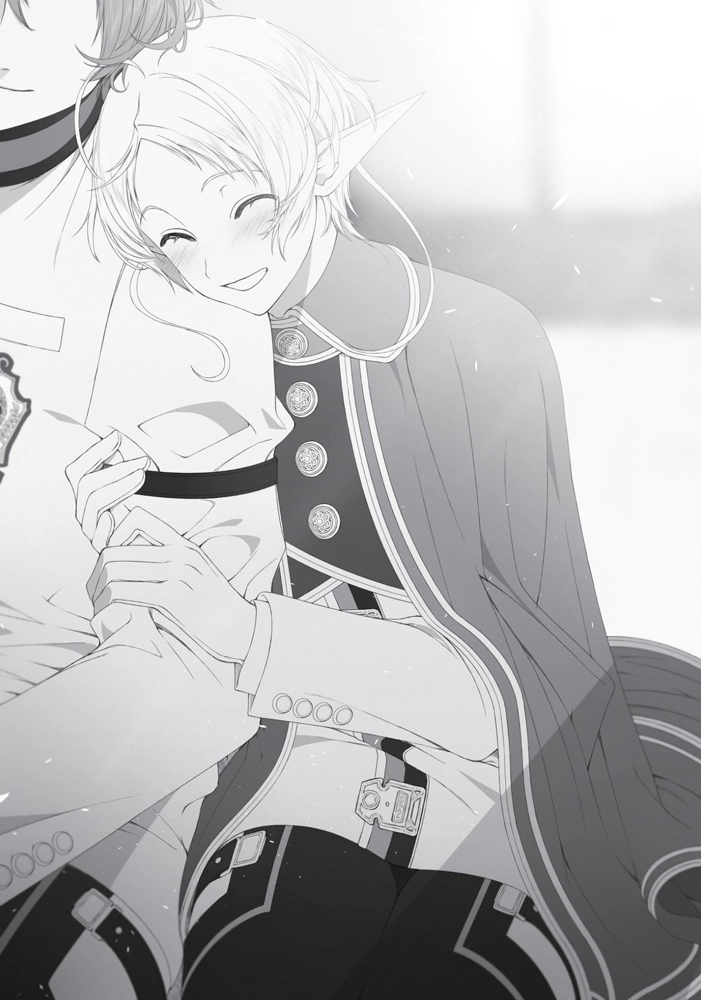

+++
title = "Chapter 5: Wedding Reception Preparations"
date = 2026-07-20
weight = 4
[extra]
volume = 10
chapter = 5
+++

Page | 76

“Sylphie, it’s been approximately three weeks since I announced
our betrothal. I realize that isn’t a long time, but we have taken a bit
of a break from discussing it.”
“Y-yes.”
The reason I was talking so stiffly was because this was a serious
conversation.
Sylphie had to realize that too, because she straightened up.
“Even though I said we’d get married, to be honest, I don’t know
what I’m supposed to do. I went ahead and bought this house, but
honestly, I can’t help feeling like I’ve rushed on ahead.”
“I-I don’t feel that way at all. I’m really happy with everything
you’ve done. In fact, I’m the one wondering if it’s really okay for me
to live in such a luxurious place.”
“Really? I’m glad to hear that you have no issues, but I wish to
discuss what happens in the future.”
The future. When I said that, her face went red, and for some
reason, she started fidgeting. “Um, I’m fine with however many you
want. But elf blood runs strong through my veins, so it might be
difficult to get me pregnant.”
“Y-yeah.”
That was incredibly sexy to hear. This wasn’t modern Japan,
after all. I’d have been disappointed to hear she wanted to put off
having kids for financial reasons even though we just got married.
That’s right. I was loyal to my instincts. And by that, I meant the
natural animal instinct to reproduce. In other words, make babies.
Even so, I intended to be understanding about her career. “But
what are you going to do about your work for Princess Ariel?”
I didn’t know what the Princess thought about all of this, but I
didn’t see how Sylphie could continue her work as a bodyguard if she

Page | 77

got pregnant. I supposed I or someone else could fill in on the
battlefront, but that wasn’t the only aspect of being a bodyguard.
“What do you mean?” she asked.
“Wouldn’t it be difficult to do both at the same time?”
“I’ve already spoken with the Princess about that.” Huh. Made
sense. “We plan to stay in this country for the next two years at the
very least, and even then, it’s not as if we’ll make tracks for the Asura
Kingdom the instant we graduate. We’re looking at roughly five more
years. So, um…”
It seemed Sylphie had no intention of quitting her bodyguard
work. The fact that quitting had never even been mentioned spoke
volumes about the strength of her bond with Ariel and Luke. I
wondered what the old Sylphie, the one who was entirely dependent
upon me, would say. Perhaps she’d offer to throw it all aside to
follow me. That would make me happy too, but…
“Sorry. Now that I think about it, it’s unfair to you, isn’t it?
You’ve provided me with such a magnificent home, but I won’t be
able to spend much time in it because of my work with Ariel. I guess I
don’t really deserve to be your wife, do I?” She lowered her head,
face full of sorrow.
It wasn’t a hard-and-fast rule here that the man worked while
the woman stayed at home, perhaps because there wasn’t quite as
much of a social power gap between men and women in this world.
Still, it was the norm more often than not.
“Am I not good enough after all?” Sylphie asked, eyes welling up
with tears.
I felt kind of guilty. I’d spent two years in abstinence. Once my
libido was finally restored, the white-hot emotion that had been
bottled up for those two—no, three years—came bursting forth, and
the only thought in my head was Sylphie = someone who will let me
have sex with her.
Page | 78

I didn’t think that was necessarily a bad thing. Sylphie had
initiated it, after all, even giving me an aphrodisiac and letting me
have my way with her even though it was her first time. Even though
I was such a sex fiend that even the beastfolk were turned off by me.
If she’d found me scary, she’d shown no sign of it. When I woke the
next morning, she’d looked at me and smiled.
If not now, then when? If not Sylphie, then whom? If I hesitated
again, and she ended up marrying someone else, I was sure I’d regret
it for the rest of my life. If she were taken from me—wait, that was
right. Sylphie already belonged to me.
“You’re mine, Sylphie.”
“Eh?! Uh, yes. I’m yours, Rudy.”
“So please—marry me.”
Come to think of it, this might be the first time I’d explicitly
asked.
“…Yes.” Her cheeks heated up as she nodded. Then she let out a
small sigh of relief.
“Please don’t worry about your work as a bodyguard. I’ll take
care of the house. You just do what you need to do.”
“Yeah.”
“Well, I would like you to sleep with me every few days or so if
possible, though.”
“Huh?”
Ooops. My sexual desires had come spilling out.
“By sleep, do you mean that?” she asked.
“No, no, only if you want to, of course. If you’re not up for it,
just let me grope your tiny breasts and we’ll be fine.”
“Um, I’ll try my best, okay? I don’t want to make you restrain
yourself, you know?”
Page | 79

“Yeah, but don’t push yourself, either. When you’re exhausted,
you need to recuperate. If you let me just touch you a little bit either
before we go to bed or after we get up, I’ll take care of it myself.”
My desires were just falling right out my mouth. Then again,
there was no point in playing it cool for Sylphie, anyway. This was
who I was.
“Do you like my breasts that much?”
“I love them,” I said.
“But Luke said there’s nothing appealing about them.”
“Don’t trust anything a young whippersnapper like that says.”
The younger a guy was, the more obsessed he was with breasts
being bigger or smaller. That wasn’t the important part, though. It
was the heart. Right, you breast-loving hermit?
“But my chest isn’t much different from yours?”
“That’s not true. Mine are chiseled pectorals, yours are small,
beautiful breasts. They’re totally different. If you don’t believe me,
why don’t you try touching mine?”
“Sure, okay.”
I puffed my chest out and Sylphie gently reached over to cop a
feel. “You’re right, they’re completely different. Yours are kind of
hard.”
“Hmph!” I grunted.
“Whoa!”
I flexed my chest, prompting Sylphie to panic and retract her
hand. “These pectorals belong to you, so you’re free to touch them
whenever you like.”
“M-mine belong to you too, but keep in mind the time and place
when you touch them.”
“How about now?”
Page | 80

“B-but we’re having an i-important conversation right now,
aren’t we?”
Oh yeah. We’d gotten a little off track.
“Right—back to what I wanted to talk about. Let’s communicate
openly with each other openly when we need something or when
we’re dissatisfied with something, okay? That’ll keep our married life
peaceful,” I hurriedly summarized.
Sylphie nodded. “Yeah, I agree.”
“And on that note, is there anything you want to tell me now?”
Sylphie considered it for a moment, then lowered her eyes. With
a sad look on her face, she smiled and said, “Just don’t suddenly
disappear on me, okay?”
“Yeah.” That was right. It was heartbreaking when someone
suddenly left. “I understand. I won’t suddenly disappear.”
I knew painfully well how much it hurt when someone you cared
about suddenly disappeared on you.
With that, our important conversation was basically over. There
were still probably some things left we needed to talk about and sort
out, but for the moment, this was enough.
“Well, then, may I?”
“G-go ahead.” She had a nervous look on her face as she thrust
her chest toward me.
I reached a hand out to touch them, but stopped myself. Last
time I’d gone at her like a beast. This time I wanted to prioritize
being gentle with her over my own desires. So I softly took her in my
arms and slowly pushed her down onto the bed.
“Y-you’re not going to grope?”
“That’s for morning and night.”
“O-okay.”
Page | 81

We stared at each other, faces close together. I could see my
face reflected in her moist eyes. She softly closed them. I patted her
head and gave her an awkward kiss.
That night, I dragged my lethargic body down to the basement.
There was nothing in the underground storage area, since we’d just
moved in. It was bare, save for a few shelves that had been installed.
I walked deeper inside and put my hand on the hidden door that had
been restored by the dwarven artisan.
BEFORE:

It was a noisy door that creaked and groaned when being
opened or closed. Despite being called a hidden door, the edges
were so dirty you could spot it at a glance.
NOW:

The device that opened and shut the door had new metal put in,
with an ample application of oil to ensure it would be soundless. The
wallboards for the basement had also been completely restored. No
one would have any idea there was a door hidden here.
I quietly opened the door. Tucked within was a small shrine of
unvarnished wood. It was there, inside an altar constructed of
lustrous black stone, that my idol was enshrined. The dusty old
research room had been thoroughly cleaned and transformed into a
space of divinity. There, in the quiet of night as everything else slept,
I offered a prayer to my god from this new holy land.

Page | 82

Chapter 5:
Wedding Reception Preparations

A

WEEK HAD PASSED

since the renovations were completed. Ariel

had given Sylphie seven days off as a gesture of consideration, and I
took full advantage of that time to have Sylphie pamper me, and I
her in return. We spent romantic nights together, sweet as honey.
…I wish. That wasn’t how it went at all.
Now that I was the king of my own kingdom, there were things I
needed to do. In this world, it was apparently the norm for newly
married couples who’d just bought their own place to invite close
friends over for a meal. It wasn’t just a housewarming thing, but
something you did specifically if you were getting married and
buying a new house. In other words, a wedding reception.
Sylphie and I sat on one of the living room couches with our
foreheads pressed close. Below us was the subject of our gazes: the
list of people to whom we would be sending party invitations. There
was also a chart to determine seating.
“We really do have a diverse group of friends…”
I would be inviting Elinalise, Zanoba, Julie, Cliff, Linia, Pursena,
and Badigadi. Then I had to decide whether or not I would invite
Jenius and Soldat. Sylphie would be inviting Ariel, Luke and two
others. All together, there would be eleven people, give or take a
few. I’d like to have Paul and my family there, but I couldn’t invite
people who were a million miles away. I’d put a letter in the mail
informing them of my marriage, but who knew how long it would
take it to reach them?
“We’ve got royalty, beastmen, a demon, a slave, an adventurer,
and some of them can’t keep their mouths shut. I foresee trouble.”

Page | 83

Linia and Pursena still bore Ariel a grudge, and I could very easily
imagine sparks flying when they met face to face. If this were a
marriage ceremony in my previous world, we could just seat them at
opposite ends of the venue to keep them from meeting, but even the
biggest rooms in this house were no ballrooms.
“You think so? Princess Ariel wouldn’t cause a stir in a situation
like this,” Sylphie said.
“Still, I wouldn’t want her to go home in a sour mood because of
something that happened at a party at our house. Perhaps it would
be better if we split the party into two, separating the
troublemakers.”
“Hmm. But Princess Ariel really wants to meet the others,
considering some of your friends will hold important positions in the
future.”
I pictured Ariel getting fired up and putting on her makeup,
saying, “This is my chance! There’s a lot of sexy men at wedding
receptions that you don’t normally get to see!”
No, I knew that wasn’t what she was after. She wanted to make
connections with the other special students. Ariel was calculating,
after all.
“All right, then let’s invite her with the understanding that she’s
responsible for managing herself. Which just leaves the problem of
seat order.”
I didn’t think we could just let them sit wherever they wanted. It
would be difficult to seat them in order of importance, though. What
order could we choose that wouldn’t offend anyone? Badigadi was a
reigning Demon King, so he had the most authority, but after that
was Ariel, Zanoba, Linia and Pursena. A veritable crowd of royalty, or
the equivalent thereof. Also, Cliff seemed the type who would
complain if we put him at the end of the table. No, wait—despite his
personality, he had been taught courtly etiquette. Surprisingly, he
Page | 84

might be just fine with it. Plus, as long as we seated Elinalise with
him, she would cover for us.
Julie had the lowest status of them all, as a slave, so she’d be
seated last. I didn’t want to separate her from Zanoba, though. She
was still a child and not yet completely fluent in the language. Plus,
she was my pupil as well. There had to be something I could do.
“What sort of status do the Princess’ attendants have?”
“Um, they’re mid-ranked nobility.”
Based on what Sylphie had told me, I assumed they were both
women. Figuring out where to seat them was proving difficult. The
same could be said for Luke. It was probably best not to put him too
far from the Princess. I didn’t think it was likely, since the guests
were just my friends, but it would be bad if Ariel somehow wound up
assassinated.
“Hm? Haven’t we forgotten someone?” Sylphie asked as she
studied the list.
I looked over. Had we forgotten someone? Who could it be? I
didn’t feel like we had. Unless she meant Miss Goliade?
“Oh, that’s right! Miss Nanahoshi! We need to invite her too!”
I checked the names and sure enough, Silent Sevenstar wasn’t
among those listed. I’d genuinely forgotten about her. However…
“I wonder if she’ll even come,” I said.
“I’m sure she will.”
“I guess we can invite her, at least.” I hadn’t intended to exclude
her, but it did seem like she’d completely shut this world out. “After
we’ve done all this preparation, what are we going to do if no one
shows up?”
The Christmas episode from a certain anime came to mind. A
character had gone all out and made a cake for the occasion, but
then lost it after no one showed up. It was a heartrending episode.
Page | 85

“I can promise you that Princess Ariel and Zanoba will be there,
at least. Princess Ariel would like to get to know you better, and
Zanoba knows it would absolutely destroy your trust if he doesn’t
come.” In a single breath, Sylphie managed to allay my anxiety. Of
course Ariel would come with her three followers, and my two
pupils, Zanoba and Julie, would also be there. Those six would
definitely attend. Even if we didn’t invite Zanoba, he would probably
prostrate himself in front of our gate on the day, begging us to let
him take part. “I guess you do worry about these kinds of things after
all, huh?”
I-It’s not like they particularly bother me. I’m not the type who
sweats small stuff like that. I’m a laid-back guy!
“I’m sure Linia and Pursena will come too. Beastfolk aren’t the
type to refuse an invitation from someone of superior status,”
Sylphie remarked.
“Really?”
“Yeah, and if they don’t come, we’ll just have to put them in
their place again.”
Sylphie said that was the way things were done in beastfolk
custom. Now that I thought about it, Gyes might have prostrated
himself in front of me because he thought Ruijerd might go berserk
otherwise. He didn’t even complain when Eris kicked him, either.
“I guess Cliff will definitely attend too, since he specifically asked
for an invitation,” I said.
“Personally, I’d like for Elinalise to come,” Sylphie murmured.
Elinalise? I wondered why. I’d never really seen the two of them
talk before.
“There’s a little something I’d like to ask her,” Sylphie explained.
“It’s not really a big deal or anything, though.”

Page | 86

I wondered what it was. Maybe she wanted to ask if Elinalise
and I had slept together? Well, there was nothing between the two
of us, so it didn’t bother me if she wanted details.
At any rate, we now had a plan going. With over ten guests
attending, we’d need to serve up quite the meal, so we decided to go
shopping. Together, we walked side-by-side toward the Commerce
District.
“Before we get groceries, I’d like to buy some new clothes for
you, Rudy,” Sylphie proposed.
I looked at what I was wearing. I was in my usual gray robe.
There was no need for heavy coats to keep warm during the day.
“Um, I do like how you look in your robe, but there are people
who pay attention to those kinds of things, and if they saw you in
something that tattered…um, well, you know? Or are you just really
attached to that robe?”
I didn’t really put much thought into my wardrobe. When I was
an adventurer, I’d seen people who looked far more unkempt. It was
true that it would call Sylphie’s character into question if I looked
disheveled, though. I couldn’t shame her that way.
“I guess so. It was the first robe I bought in the Demon
Continent, so I’m attached to it, but it is tacky-looking.”
The only other thing I had was a fur vest. It didn’t really fit the
look of a magician, so I hadn’t worn it in a while. Plus, it was a bit too
shabby to wear when I was with Sylphie. I’d just look like a bandit.
“Then let’s go to a clothing store. Pick whatever outfit you like,”
I said.
“Thanks. Just leave it to me.”
We headed for a ritzy shop, not a place I’d ever set foot in of my
own accord. Sylphie had put on her sunglasses and returned to her
Fitz persona.
Page | 87

“Ah, Lord Fitz, good to see you. Thank you for your continued
patronage.” The owner bowed deeply at Sylphie. It seemed she was
a regular—in other words, it was Princess Ariel patronizing the place
while disguised as Fitz. A place that catered to Asuran royalty. Could
we afford it? This was anxiety-inducing.
“Could you show me some robes for magicians?”
“Certainly. This way, please.”
Apparently, even fancy stores like this still had robes for
magicians. I guess that made sense; magicians were everywhere,
especially in Sharia. This was a city where even the children of
nobility became magicians.
We were guided to a section with dozens of resplendent
garments made of expensive-looking materials. It seemed magician’s
robes came in essentially the same shape and style regardless of the
retailer, though these did have some delicate embroidery.
“Excuse me, may I ask what elements you favor?” the owner
asked.
“Oh, yes. I guess those would be water and earth.”
“In that case, how about this one here? It’s made from the hide
of a rainforest lizard from the Great Forest and is quite waterresistant. The designer is Foglen. They design for Ranoa’s royal court
magicians.”
Hmm. If memory served me right, the rainforest lizard didn’t
have particularly high resistance to water. We had fought them along
our travels, but they’d frozen easily when I used my water magic on
them.
“If you prefer earth, this might suit you as well. Made from the
hide of a great earthworm from the Begaritt Continent, it can
weather even a sandstorm. The designer is the promising newcomer,
Flone. They’re known for their highly creative use of colors. Plus, it’ll
make it difficult for monsters to spot you.” He held up a desert
Page | 88

camouflage-patterned robe as he spoke. I wondered if naming the
designer was an essential aspect of these fancy stores.
I didn’t dislike the camouflage, but something about it wasn’t
quite right. If I was going to go with this kind of design, I’d prefer
winter camouflage instead.
“Syl—I mean, Master Fitz, which do you prefer?”
“Let’s see…how about this one? It’s quite like the one you’re
wearing right now,” she said, pulling out a robe that was an even
darker shade of gray than the one I was wearing, almost black. What
did they call this color again? Charcoal gray? It was more
complicated than my current one, too. There were pockets and black
buttons to fasten back the sleeves, and a cord that could be used in
place of a belt.
“That one is made from the hide of a lucky rat from the Demon
Continent. The designer is Kazra. Known for their subdued designs,
which tend to be popular with the slightly older crowd.”
“A lucky mouse?”
“No, no, a lucky rat, sir. A superior species to the mucky rat, and
the equivalent of a D-class monster. Their coats are splendid, with a
strong resistance to poison and acid.”
Incidentally, I’d seen the latter creature while traveling the
Demon Continent. The mucky rat was twenty inches tall, and the
lucky rat was even bigger. I’d been horrified the first time I saw
them. A horde of those enormous vermin had infested a warehouse,
with a single lucky rat among them. I think I stood in the background,
flabbergasted, while Ruijerd and Eris made short work of them.
That aside, I did like the robe itself. My wife had good taste.
What concerned me was the price tag—and now that I took a look at
it, yes, it was expensive. You could buy a house on the Demon
Continent with how much this cost.

Page | 89

“Well, they do say that names represent nature,” I said. “If
‘lucky’ is in the name, maybe it’ll bring me good luck. I guess we’ll go
with this.”
“Names represent nature? Pardon my manners, but might I ask
for your name?”
“Oh, yes. My name is Rudeus Greyrat.”
“Oh my, you’re a member of the Greyrat family? Forgive my
rudeness. Master Luke is a treasured patron of our establishment, so
I’ll give you a discount on your purchase this time.”
Was this what I thought it was? A way to curry favor with Luke?
No, that wasn’t it. Maybe he was just trying to encourage us to come
here again for our next purchase. Whatever the case, I was glad of
the discount.
“Does Luke come here often?” Sylphie asked.
“Surely you’re aware of that, Lord Fitz?”
“Oh, yes. Um, I mean aside from when he comes with me.”
“Yes, he’s always coming here with different women.”
While Sylphie continued chatting with the owner, I was pulled
aside by one of the shop’s staff to have my measurements taken. The
robe we looked at had just been for display; they would tailor one to
my size. The female staff member used a measuring tape to take my
vital statistics, and I wondered if they sold those at a magical item
shop. I wanted to try some role-play with Sylphie that involved
measuring hers.
“We have the materials on hand, so this will be finished within
three days. If you’ll tell us your address, we can have it delivered.”
Feeling happy and a bit embarrassed, we shared the address of
our new home.

Page | 90

After that, we went grocery shopping. First, we purchased
spices. Then the non-perishables. Thanks to the distribution routes
that Nanahoshi had developed, we were easily able to get our hands
on cooking oil as well. We also snagged some some frozen fish and
vegetables that would keep a while, then ordered some meat that
we’d pick up at a later date.
“Can you cook, Sylphie?”
“Yeah. I learned from my mom and Miss Lilia. Oh, but I’m not
sure if my cooking will suit your tastes.”
“I’ll be sure to tell you it’s delicious, even if it’s half-burnt
charcoal.”
“Half-burnt charcoal? Come on, who do you think I worked so
hard to learn to cook for?”
A good fashion sense, and good at cooking. Come to think of it,
she said she could do laundry and cleaning too. Contrary to her
appearance, my wife was quite the capable woman.
“Miss Sylphiette, you’re such an ideal wife that I can’t help
feeling nervous that I’m not worthy of you,” I said.
“You know you’re my ideal husband, too.”
“W-well, if you there’s some part of me that isn’t so ideal, I’m all
ears. I’ll work hard to match your expectations.”
“In that case, be more assertive. You’re a bit too submissive
sometimes.”
More assertive? And what would happen to me if I did that. and
my actions somehow soured the mood of some god passing by?
There were people in this world that beat you to death for the crime
of looking at them funny.
Then again, would I want to be married to a man with no
confidence who did nothing but sit hunched over in the living room,
reading the paper? Nope.
Page | 91

All right, then. I’ll act with more confidence from now, I guess.
Starting today, I’ll be a smug asshole!
“Hmph. Sylphie. Make sure to show how much you love me.
Don’t slack off.”
“Um, that’s not quite what I meant, but sure. I’ll do my best,”
Sylphie said as she clenched her hand into a fist.
Aww, my Sylphie is sooo cute! I just wanna smoochie-woochie
with her!
But I restrained myself. Sylphie wasn’t a fan of PDA on crowded
streets. If I tried to touch her here, she’d definitely scold me. But she
wouldn’t mind if I put my arm around her shoulder, right? No, maybe
I should try holding her hand first? Of course, despite my internal
debate, both my hands were currently occupied with shopping bags.
Grrr.
“We need to buy some large plates as well. Oh, guess you can
just make them.”
“As long as you’re okay with plates made out of stone,” I said.
“The ones you make don’t look like they’re made out of stone,
so it’s fine.”
So it was a question of appearance, huh? Well, if she really
wanted something pleasing to the eye, then I’d make one and polish
it so spectacularly that she could see her reflection in it. The baked
type of pottery that Japan was known for didn’t seem so popular
here. Apparently, they preferred something more posh than the
Japanese wabi-sabi aesthetic. Maybe I should really go all out and
create something like porcelain? Though it would still be gray or
brown, whatever I did.
“Is there anything else we need?” I asked.
“Um, some tea to serve our guests.”

Page | 92

Black tea and teacups, huh? Okay, no problem. Maybe we
should buy a rug while we were at it. Might be a good idea to
prepare a guest room as well, just in case.
“Shall we go ahead and buy a couple of things like a bed and a
closet for guests?”
“Ah, good idea.”
Our house was so large that furnishing it was slowly but surely
draining my funds. I was glad I hadn’t wasted any money on
purchasing magical implements and the like. I still had some cash
left, thanks to the discount I’d gotten on the house, but it was being
depleted with each purchase. Maybe I should earn a little extra by
hunting down some monsters? No, I couldn’t do that. How stupid
would it be if I went and got killed on an elimination quest for that
trivial a reason?
Suddenly, I could kind of understand why Paul had returned to
his position as a knight in order to get a steady paycheck.
“Um, Rudy, don’t worry. I have money coming in from my work
with Princess Ariel.”
“Ugh, sorry.”
I supposed that if the need ever arose, I could join Soldat’s party
or someone else’s. Wait, no. Adventurers left their houses for days at
a time for relatively little pay in return. Maybe I should start looking
for a steady job myself.
Marriage sure was complicated.
That night, I invited Sylphie to join me in the bath, supposedly to
teach her how to use it. My real motivation was to spend some
quality time together in the bath. If this were a book, it might be
Page | 93

narrated thusly: A pervert was poised to sink his fangs into an
adorable young girl.
I’m going to do it tonight. I’m going to do it! Just you watch,
Father!
Wait, “Father” would be Paul, right? Then I’d rather he not
watch.
“Now then,” I explained. “The etiquette for bathing in our house
is a little different from that of the Asuran royal family.”
First, we moved to the washing area, which doubled as a
changing area. There, I told her, she was meant to take her clothes
off and put them into one of the baskets. This time, I removed them
myself, then folded them and tossed them into one of the baskets.
Sylphie had a petite figure that lacked extra body fat, but she
wasn’t all bones. While she was thin, she also had muscles. Though
her breasts were small, they were still soft and shapely. My
breathing turned erratic just looking at her.
“Um, uh, is it necessary for you to undress me?” Sylphie asked.
“Nope.”
“And why are you breathing so heavily?”
“Because I’m turned on.”
“Um, and is getting turned on necessary for entering the bath?”
“Nope.”
I gave the appropriate answer to each question as I briskly
undressed so we could enter the bathing area. There was no shower
or mirror, but there was a bucket and a chair. Just for kicks, I’d
inscribed “Kerorin” on the bucket, just like the aspirin ad you often
saw printed on the buckets at public baths in Japan.
“You’ll be pouring water over your shoulders before you get in
the bath. So take a seat here and use this cloth and soap to wash
your body.”
Page | 94

“Hey Rudy, why is there a hole in the middle of this chair?”
“To make it easier to wash your body, of course.” I moistened
the cloth with warm water, sudsed it up, and started washing
Sylphie’s body. I mainly focused on the back of her ears, the hollow
of her collarbone, her back, and other areas that got dirty easily. I
used my hand for the softer areas, ones that I couldn’t scrub with the
cloth. That was why the hole was there.
“Um, you haven’t been using the cloth for a while now, and
you’re only focusing on those places. Plus, your thing is pressing up
against me.”
“Oops, my bad.”
Apparently, my desires had gotten ahead of me. We couldn’t
have that. This wasn’t a part of bathroom etiquette in our house.
“Um, if you really can’t restrain yourself, um, well, we can go
ahead and do it if you want?”
“We’ll do that after the bath is finished.”
The bath came first. We had to wash our bodies.
“Once you’re done washing every corner of your body, next is
your head. Now close your eyes.”
“O-okay.” Sylphie squeezed her eyes shut. How cute. It made
me want to kiss her and pull her toward me for some sexytimes, but I
shoved the thought to the back of my mind. Letting my guard down
even for an instant could be fatal. Phew, this whole washing thing
sure was hell.
“Once you’ve wet your hair with water, use the soap to lather it
up. Not just on your head, but all the places hair grows on your body.
You probably don’t have to wash your hair all that often.” I
continued to shampoo her hair as I talked. It was short and easy to
clean. “Once you’re done, make sure to rinse all of it out with warm
water.” I used magic to conjure water and rinse out her hair.
Page | 95

She giggled. “This kind of reminds me of when we first met.”
Oh, yeah…I’d used warm water to rinse her off back then, too.
That had been back in Buena Village, around the time I started being
able to walk about the town. I’d found Sylphie sobbing as the
neighborhood kids bullied her. She’d been delivering her father’s
lunch when they accosted her and started throwing mud balls at her.
So I saved her, then used warm water to wash her off and a warm
breeze to dry her. She looked like a boy back then, in part because
her hair was short.
Ah, it really did bring back memories. I could never have
dreamed that that little boy would become my adorable wife. Life
sure took you to some unexpected places.
“Once you’re done washing up, next is the bath. Be careful; it’s
easy to slip.”
Sylphie followed my instructions and slid herself in, sinking into
the water. I kept the water gently warm so we could enjoy a long
soak together.
“Ah, I can feel the warmth seeping into my arms and legs. It
feels good.”
It seemed it was just right. Very nice.
Once I was satisfied that Sylphie was enjoying the bath, I started
to wash myself. Honestly, I kind of wished I could soap Sylphie up
instead and use her body to wash mine, but I was holding off on that
for today. There was no need to do everything at once. I was going to
treat her carefully, gently.
“…”
Suddenly, I realized Sylphie was peeking over at me. I thought
maybe she was watching to get an outside perspective of how to
wash one’s body before getting in the bath, but that didn’t seem to
be it. She must’ve been intrigued by the sight of that one body part I
had and she didn’t. Curiosity, I assume.
Page | 96
