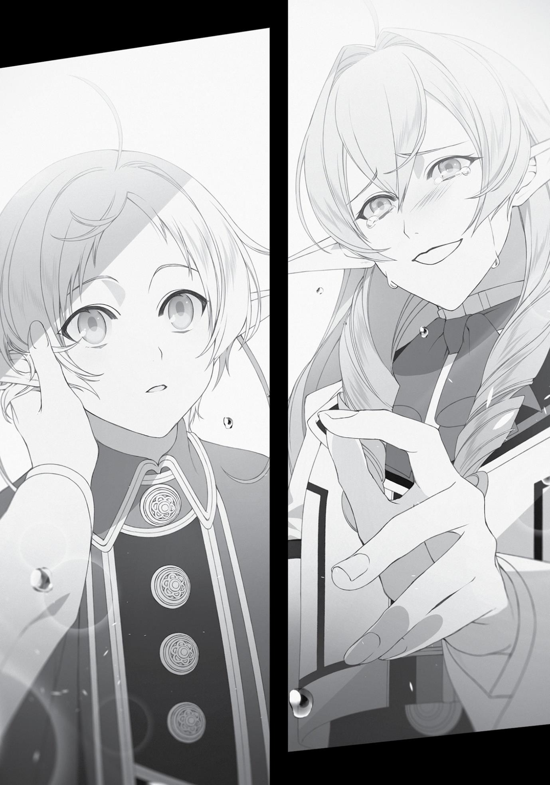
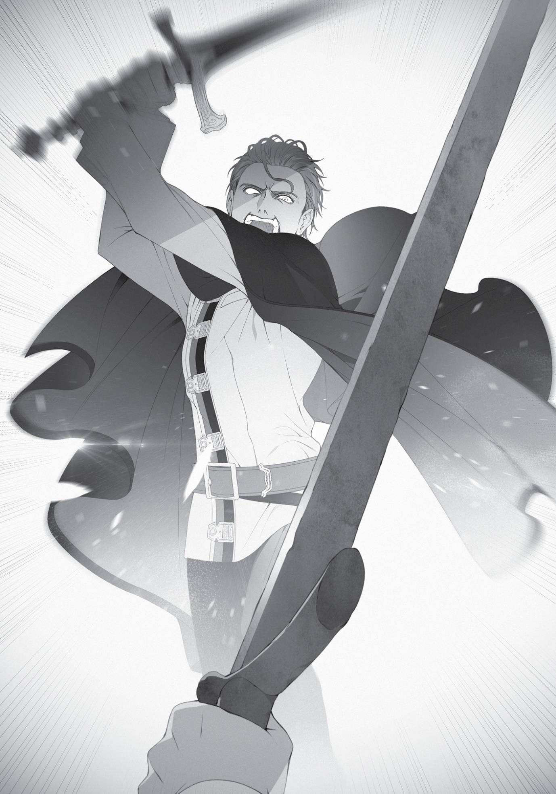

+++
title = "Chapter 7: End of the Wedding Reception"
date = 2026-07-20
weight = 6
[extra]
volume = 10
chapter = 7
+++

“Well, that’s unfortunate, isn’t it? Since it wasn’t in the cards for
us, let’s just continue being friends, then.”
“Yeah, let’s keep it that way.”
Elinalise turned her attention to Sylphie, a gentle expression on
her face. “Miss Sylphiette, congratulations. I pray for…for
your…happiness from…from the bottom of…” Tears started rolling
down Elinalise’s cheeks. She continued looking at Sylphie as a sob
escaped from her throat.
I was dumbfounded. I had no idea why she was crying all of a
sudden.
Elinalise reached out to touch Sylphie’s cheek with a trembling
hand. Then her legs started to shake and gave out from under her.
Her face was a complete mess, but she just continued to look at
Sylphie. “I’m sorry. I can’t believe I’m doing this…”
Sylphie had to be shocked, too. Or at least, I thought she would
be—but instead, she looked only mildly puzzled, not surprised.
“Um,” Sylphie said. “I’ve been meaning to ask you this for a
while, but Miss Elinalise… are you perhaps my grandmother?”
I wasn’t the only one flabbergasted. Cliff—and Elinalise—looked
utterly dumbfounded, too.
“Father told me that my grandmother was one of Rudy’s
father’s companions,” Sylphie explained.

Had he really said that? Wait…that made sense, actually. Laws
had said he and Paul became friends while he was helping guard the
village. Maybe he’d figured out Paul’s connection to Elinalise through
their conversations, though I doubted Paul knew of it.
It was a small world. Now that I thought about it, the woodcarved pendant that Sylphie made me had the same shape as the
pendant on Elinalise’s sword. In fact, their facial features were
similar, too.
“Miss Elinalise, is that really true?” I asked.
“Y-you’re mistaken. There’s no way your grandmother could be
a whore like me.”
“My father told me it was because of you that he was chased
out of the Great Forest, and that people opposed him marrying my
mother,” Sylphie said.
“What…?!”
“He said you were devastated by guilt, and might not reveal
who you really were, even if we met.”
I would never have guessed Elinalise and Laws had such
history…though I could understand why people had opposed his
marriage to Sylphie’s mother. I’d hesitated, too, when Cliff asked me
to introduce him to Elinalise. I could see how being Elinalise’s son
might have tarnished Laws’ reputation.
“I…I…!” Elinalise broke out into a sob. She tried to say
something, but the words wouldn’t form. Sylphie looked a bit
flustered, as if worried she’d said the wrong thing.
“Master Cliff?” I said.
He looked completely flustered, too. “Wh-what is it?”
“Please take Miss Elinalise to one of the bedrooms on the
second floor so she can rest.”
“R-right. Yeah, I-I got it.”
“Sylphie, how about you continue your conversation with her
after she’s calmed down?”
“O-okay,” she said.
Cliff was pulling Elinalise along by the hand when she looked at
me, terrified. “R-Rudeus, I-I know I might be a mess, but, um, Laws
was a completely normal boy. And of course his child, Sylphie, is too.
So please…”
So please what? Don’t look at them with prejudice? She really
didn’t have any faith in me. To be fair, I had been avoiding her lately.
Maybe that had caused some misunderstanding.
I put my mouth to her ear. “Please don’t worry. I’m not going to
break up with Sylphie because of you.”
“But—”
“More importantly, don’t you think you should be more
concerned about the fact that now you’re related to Paul, whom you
hate so much?”
Elinalise smiled weakly. “Heh, Rudeus. You really do say some
entertaining things sometimes.”
I relaxed a little. She probably just needed to calm down a bit.
“You can take your time and talk to Sylphie, just the two of you, a bit
later.”
“Yes. I appreciate you being so considerate.”
After that Cliff guided Elinalise off and they retreated upstairs.
Time to step it up, Cliff. Do a good job comforting her, I thought.
Badigadi never came over to congratulate us. He set himself in
one corner of the room, bellowing out his usual “Bwahaha!” laugh,
and kept the mood boisterous. I was grateful for his presence.
Chapter 7:
End of the Wedding Reception

T

HE RECEPTION

was a success. We didn’t seal our promise with a

kiss or exchange rings, but spent the whole time eating, drinking,
chatting, and having a good time. I appreciated the ease and
informality of it all.
People broke into groups of two or three when it was time to go
home. The first to bid us goodbye were Linia and Pursena. Perhaps it
was considered good manners among the beastfolk not to linger too
long?
“Well, mew… Enjoy yourself, Boss.”
“Now you really are the boss of the school. I’m looking forward
to next semester.”
After saying that, the two of them began trudging home through
the snow.
The second to leave was Nanahoshi, with whom Luke had
randomly struck up a conversation. Most of it was him trying to hit
on her, though he wasn’t being completely transparent about it. He
made a concerted effort to talk about food and clothes, topics it
seemed Nanahoshi might be interested in. He was good at sounding
interested in a topic the other person cared about, even though he
was a bit out of his element here. Still, it was educational. Not that I
intended to make use of such knowledge.
Nanahoshi, on the other hand, made no attempt to disguise
how clearly bothered she was by him. She looked at him in
annoyance; she sighed in annoyance. In the end she ran to the
bathroom just to escape him. When she re-emerged, she came
straight over to where I was, looking agitated. “It’s about time for me
to leave. That one’s annoying me.”
“All right, then. I’m sure you’re exhausted. Thank you for coming
today,” I said.
“I’ll be counting on your help again tomorrow. And one more
thing.”
“What’s that?”
“Sometime in the future, can I use your bath?”
Apparently, she’d gotten a look at our bathroom while on the
way to the restroom. As a fellow Japanese person, she probably
missed baths. Her name was Shizuka after all. “Sure. But you might
have Nobita peeking in at you—”
“Forget I said anything.”
“No, I’m just joking, honestly. You can come any time.”
Nanahoshi nodded and started to leave. The sun hadn’t set yet,
but I wondered if she would be safe walking home alone, even
though she’d come here herself, and had magic items for her own
protection.
“Escort Master Silent back to her residence, please.”
“Yes, Princess.”
While I was hesitating over what to do, the Princess moved to
send one of her attendants as an escort. I should’ve expected it of
someone with such charisma. However, Nanahoshi stubbornly
refused the offer and went home by herself.
Next were Zanoba and Julie, then Badigadi. Badigadi, Zanoba
and Ariel had all shared drinks while happily chatting amongst
themselves. Since I knew of Badi’s affinity for alcohol, I’d prepared an
appropriate amount just to be sure. But it apparently hadn’t been
enough. Before I knew it, two of the three wine casks I’d stashed in
the basement were empty. I debated sending out for more, but
before I could, Zanoba got hammered.
“Bwahaha! You sure are weak for a ‘Blessed Child’,” Badigadi
chortled.
“Ha ha ha…urgh, I’m ashamed. It seems I got carried away.”
“Master, are you okay?” Tiny Julie was trying to support Zanoba
as he stumbled.
“Hee hee hee. Maybe you should rest in one of the rooms
here?” Ariel suggested. She hadn’t drunk that much herself—keeping
her wits about her was probably part of her training as a highborn
lady. Everything she did was poised elegantly, from the way she
tipped her cup to the way she laughed. She was probably a bit tipsy,
but the faint blush the alcohol had given her just made her more
charming.
“No. As a pupil, and a proud member of the Shirone Noble
family, it already brings me shame to be so utterly inebriated in my
own master’s house. I’ll take my leave while I can still walk.”
Zanoba came to say his farewells to me. Personally, I’d have
been fine with him staying in our guest room… Well, whatever he
wanted to do.
“Suppose I should be off, too. Princess of Asura, stay well!” said
Badigadi.
“Yes, your highness. I hope you will stay in good health as well.”
“Bwahaha! I don’t get sick or injured!”
And so, both Zanoba and Badigadi took their leave. Huh. I’d
thought for sure they would be the last ones to leave.
The reception drew to a close as Ariel and her group prepared to
depart. While they were doing that, I decided to check on Elinalise. I
went up to the second floor and peeked into the guest room.
I was greeted by an exciting display—no no, not the sexual kind.
Just Elinalise using Cliff’s lap as a pillow. Apparently, he was done
comforting her, and they’d moved on to the lovey-dovey bits. I felt
kind of envious. I’d have to do the same with Sylphie later.
“Um, Mister Cliff, I’d like to talk to grandmo—I mean, Miss
Elinalise. Do you mind?” Sylphie asked timidly as she crept up behind
me.
Cliff looked to me as if he were asking for help. Elinalise lifted
herself up and nodded at me. I nodded back. At that, Cliff stood up
and left the room.
“Thanks, Rudy.” Sylphie smiled softly before heading inside.
Cliff and I headed down the stairs together. He looked anxious.
“Are those two going to be okay?”
“If they aren’t, we just have to be there for them afterward,” I
replied as we made our way to the ground floor.
When we arrived, Ariel and her lot had just finished their
preparations to depart. The two attendants were helping Ariel slip
her coat on. When she saw me, she dipped her chin. “Lord Rudeus.
Thank you for today.” The rest of her party likewise bowed deeply.
I bowed in return, Japanese-style, though I was pretty sure I
wasn’t supposed to do that in this situation.
“How is Sylphie doing?” Ariel asked.
“She’s talking to Elinalise right now.”
“I see. It was certainly a surprise to find out Sylphie had family
here. I thought she’d lost them all.”
“Indeed. It really is a small world.” Not to mention that Elinalise
and Sylphie were as different as day and night. Mainly in terms of
chastity.
“In any case, this is the perfect opportunity. Lord Rudeus, may I
have a moment of your time?”
Her words hinted at an ulterior motive, but I nodded anyway.
“Very well, then. Come this way.” As she spoke, Ariel quickly cut
across the room and moved into the hallway. From there she
proceeded to the front entryway, opened the door and headed
outside. As if it came as naturally as breathing to them, the other
three tailed her. I followed suit.
Outside, the sun was beginning to set. Ariel stopped along the
path where people had been walking and the snow had barely had a
chance to pile up. She turned back to look at me.
“Lord Rudeus. I realize it might be inappropriate of me to ask…”
A moment’s hesitation. “Would you agree to a duel with Luke? No
magic, just sword against sword.”
A very sudden request. Unable to respond, I pursed my lips.
Luke looked completely composed, his hand resting on the hilt of his
sword. This was clearly not something Ariel had decided on the spur
of the moment. “Could you explain your reasoning, at least?”
She just smiled softly. “Just for fun.”
“‘For fun’?” I said, and Luke unsheathed what was a very real
sword. Considering it was double-edged, he wasn’t going to be
hitting me with the blunt side. “Can we use wooden swords, at least?
I don’t even have a real sword.”
“I don’t mind if you conjure one for yourself,” she replied.
“I thought you said no magic?”
“I’m fine with you using it to create a weapon.”
Very well, then. I used my earth magic to create a stone blade. I
made it thick and durable, which meant that it was heavy, too. I did
practice my swings every day, so I could wield it just fine, but if it hit
someone in the wrong spot and the worst came to pass, they could
die. It wasn’t something you should hit someone with “for fun.”
“Don’t worry,” Ariel said. “This is something Luke requested.”
“Luke did?”
“I don’t mind if you use your full power to beat him senseless.”
Without my magic, I was just an average swordsman. There was
no guarantee I could beat him senseless.
“For reference, Luke is an intermediate in Sword God Style and a
beginner in Water God Style. His sword is a magic item, made to cut
through steel shields as easily as butter. His boots are the same as
Sylphie’s, giving a boost to the wearer’s speed. His cloak can block
heat, his gloves increase his strength, and beneath his uniform, he’s
wearing swordproof clothing.”
“That’s incredible.” So he was garbed head to toe in a dashing
hero’s gear! Even selling my freshly renovated house wouldn’t get
me enough money to pay for all of that. “In other words, I might be
the one getting beat senseless.”
“I doubt it. But if you do sense your life is in danger, feel free to
use magic.”
“I’ll just pray he doesn’t cut me in half before I get the chance.”
Why had he proposed this in the first place? None of us would
benefit from someone dying here.
“Before we begin, I’d like you to tell me why we’re doing this.
Have I done something to upset you?” I asked.
“No. It’s just for fun. Of course, you can refuse if you’d like.”
“Whether I accept or not, this troubles me. Even this stone
sword is deadly enough that it could kill someone if it hit them in the
wrong place.”
“Luke is prepared for that possibility.”
Well, I wasn’t. I was newly married and I didn’t want to kill or be
killed.
“Please,” Ariel said. Her voice was somber.
What was this match going to prove? Maybe it was some kind of
Asura Kingdom tradition. I could easily picture old man Sauros
saying, “If you want to take Eris as your wife, you must defeat me
first!”
But Sauros was dead.
“Rudeus. Please accept. If you’re a man, then you should
understand,” Luke said.
There it was—the “if you’re a man” line. An unfair remark. It
was almost like he was saying I wasn’t a man because I didn’t
understand.
Ah, well. It’s not like we were seriously going to go at each
other’s throats.
“All right. Please be gentle with me, then.” I was going to use my
Demon Eye of Foresight, at least. I didn’t want anyone to die
accidentally.
“Thank you for accepting our request.”
I still didn’t understand why they were doing this, but at Ariel’s
words, Luke readied himself. As soon as Cliff saw that, he called out
to me, confused. “H-hey, Rudeus, you sure about this?”
“Oh, Master Cliff. If things start looking bad, please cast a
healing spell immediately.”
“Y-yeah. I was already planning on that.”
Stone sword in hand, I slowly took a stance of my own. We were
about three steps apart. That meant one step and we could swing at
each other. It was closer than the distance I normally set for myself
in my simulations.
“Now then, are you ready?”
“Yes.”
After hearing my confirmation, Ariel said sharply, “Begin!”
“Haaaaah!” Luke bellowed and kicked off from the ground. As
the snow scattered, he launched his body toward mine.

He was slow. No—compared to the average person, he probably
wasn’t that slow. He was probably about as quick as Linia, but still,
slow enough that I could predict his movements. He was nowhere at
Eris’ or Ruijerd’s level, never mind Orsted’s. He was probably a step
behind Soldat, too. This was all he could muster, even with a magic
item?
Luke closed in, swinging his sword diagonally. “Hah!”
His form was technically correct, and he was putting his weight
into the swing. He wasn’t relying too much on his magical items,
either. But he still moved much more slowly than my mental
simulations.
“Hah!”
I aimed for his forearm. Sword God Style – Initial Strike, Arm
Chop! It was a skill I’d learned long ago, a movement ingrained in me
through hundreds of thousands of practice swings.
“Guh!”
The weight of my blade broke his arm in a single swing. He
dropped his sword and it disappeared into the snow below.
“Not yet!” Luke immediately tried to pick it up with his left
hand.
“No, it’s over.” I prevented him from grabbing the sword by
slamming a foot into his chest, sending him flying. He went rolling
through the snow. When he tried to get up again, I pointed my sword
at him.
“That’s enough!” Ariel’s exclamation ended the duel.
“Grr!” Luke punched the ground with his broken hand, then
groaned in pain and cradled his arm.
“Ellemoi, heal him.”
At the Princess’ command, one of her attendants raced over to
him. She held his broken arm so close that her enormous breasts
threatened to swallow it whole, and then cast healing magic.
“Amazing,” Cliff said admiringly. He didn’t know the first thing
about swordplay, so he had no idea the match had been a joke.
There were plenty of swordsmen and warriors out there more skilled
than I was, such as Soldat or Eris. I was sure I couldn’t defeat either
of them without using magic and my Demon Eye. Luke was merely a
normal swordsman. If I hadn’t used my Eye, we might have traded a
few blows, but it was just as Ariel had said. He was no match for me.
“Master Luke, are you all right?”
“I’m fine.”
Once I heard his calm reply, I tossed my stone sword aside. It
sank through the snow.
Luke stood up and looked my way. His usual superficial smile
was nowhere to be seen. He looked serious. “Take good care of
Sylphie.”
“Of course.” Was he was testing to see if I was strong enough to
protect Sylphie? “It would help if you’d explain your reasoning.”
“It’s not terribly important,” Ariel remarked. “Luke just had his
own feelings on the matter. Male pride, I suppose.”
“Male pride? What, is he in love with Sylphie too?”
I hadn’t mean to make fun of him, but Ariel furrowed her brow
at my question. Crap. Maybe that was a rude thing to ask.
“We all love Sylphie, but not in a romantic sense of the word,”
she said. “As comrades who’ve been through life and death
situations together, we share a powerful bond.”
“My apologies. It was a rude thing to ask.”
“As long as you understand.” Ariel’s expression regained its
usual composure. She looked toward the house, where Sylphie and
Elinalise were likely still talking. “Eventually I will return to the Asura
Kingdom. There are only two paths from that point: Either I take the
throne, or I die. There is a significantly higher probability that it will
be the latter and the palace will be my grave.”
“Do you have to go back?”
“If I didn’t, I’d betray the memories of those who died to get me
this far. It is my duty to return to Asura.”
Privilege came with responsibility. Despite her grim words, there
was no emotion on Ariel’s face. Hers was the face of someone who
didn’t doubt for a moment that they were doing what they must. Not
that I was in a position to judge, but as far as I was concerned, that
conviction made her a good candidate for the throne.
“Sylphie, however, has no such duty,” she continued.
True. Sylphie was neither a royal nor a noble; just an outsider
who’d been tossed into the royal palace during the Displacement
Incident.
“Sylphie saved my life. She’s been there for me as my friend this
whole time—even after she found out her parents had passed. I’ve
depended on her so much. But enough is enough. It’s about time I
stopped relying on her and left her to walk her own path.”
Even so, Sylphie had every intention of following the Princess.
They’d been through so much together. I could understand why
Sylphie wanted to see things to the end. If Ruijerd had decided to
challenge Laplace to battle, for instance, I’d probably have gone
along with him, my legs trembling the whole way.
Wait, that probably wasn’t a good comparison. But the feeling
of wanting to fight alongside your friend was the same. If Sylphie
chose to follow Ariel, I would be proud of her. But if I thought it was
a fight she had no chance of winning, I would want to stop her.
“Sylphie intends to stick with me to the end,” Ariel said. “But
she’s married now, and if the two of you try your hardest, I’m sure
you’ll eventually have children. When that happens, I expect her
resolve to follow me will wither of its own accord.”
I wasn’t so sure about that. When that time came, would I even
be able to stop her? I didn’t think so. If anything, I’d probably go with
her to help.
“Having said that,” Ariel continued. “If you mistreat Sylphie,
then I will take her back. I’m sure we can’t defeat you with a raw
show of power, but there are plenty of other methods. So please,
don’t make me feel like she would be better off coming with us.”
“I’ll take those words to heart.”
“Well then, Lord Rudeus. Please take good care of Sylphie.”
Ariel turned on her heel. Her two attendants bowed to me. Luke
gave me a look of acknowledgment as he picked up his sword. Then
the four of them left, shuffling through the snow until they
disappeared, not even waiting for Sylphie to come downstairs.
As I watched them leave, I thought to myself, When that day
comes, no matter what Ariel says, we’re going to be there for her.
When we returned to the house, Elinalise and Sylphie were just
coming down the stairs. The former’s eyes were swollen, but she
looked like a weight had been lifted off her shoulders. “Oh, Rudy.
Where is Princess Ariel?”
“She just left.”
“Oh. I’m sorry for not being there. Did she say anything?”
“Just ‘Take good care of Sylphie.’”
I was still debating how best to mention the duel, but Cliff cut in
front of me. “Luke suddenly challenged Rudeus to a duel! But leave it
to Rudeus. He countered Luke with a single blow. Ahh, I wish I could
show you the way that insufferable jerk cowered as he held his
broken arm.”
