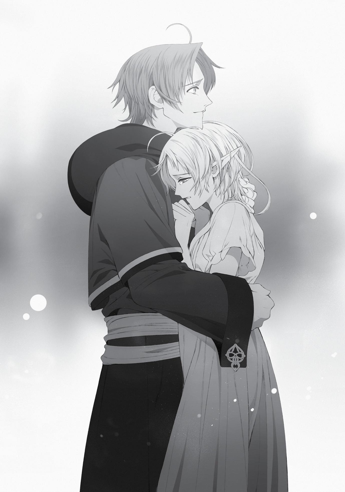

+++
title = "Chapter 10: Natural Predator"
date = 2026-07-20
weight = 10
[extra]
volume = 11
chapter = 11
+++

From what we knew, Paul was traveling in a party of six people.
Probably seven, assuming he’d joined up with Geese. We’d just have
to swear all of them to secrecy.
Incidentally, I’d made sure to warn Sylphie and my sisters not to
tell anyone about the teleporters. Just to drive the point home, I
mentioned that a very scary guy who could beat down Ruijerd in an
instant might get really angry with them if they blabbed.
With our basic plan nailed down, Elinalise and I got to work on
the details.
I already had my gear sorted out. I’d be bringing my trusty staff
Aqua Heartia and a robe that Sylphie had picked out for me. The only
other thing that came to mind was the summoning spell that
Nanahoshi had given me earlier. I didn’t know when it might prove
useful, but I decided to bring ten copies of the scroll along with me. I
could make a new printing plate in a single day, but I didn’t want to
be lugging ink around in the desert. The scrolls were much lighter
and less fragile. And if I ended up needing more, I could always try to
buy some ink in Rapan.
On that note, I didn’t have any local currency. I wasn’t even sure
what kind of money they used over there. It was probably easiest to
just bring something I could easily exchange for cash.
Other than that, I just needed food rations for the journey. This
was my first trip to Begaritt, so I had no idea what sort of tools or
equipment I might want. I’d have to obtain them locally as the need
arose.
Since our journey was only going to last six weeks now, I had
some free space in my bags to work with. I could technically bring
along some things I didn’t really need.
That didn’t mean it was smart to weigh myself down with
nonsense, though. It was probably best to travel light. We’d be
reaching Bazaar in a week, so it wasn’t like we’d be wandering the
wilderness for long. Still, I decided to bring along a book that
contained some specifics on teleportation magic, given the potential
risks we were facing. I knew Orsted had used these things in the past,
but that didn’t mean it would be safe for us.
I headed back to the faculty offices, flattered Jenius for a while,
and got permission to borrow a few titles from the library on a longterm basis. I picked up the book I had in mind, An Exploratory
Account of the Teleportation Labyrinth, and grabbed a volume called
The Begaritt Continent and the Fighting-God Tongue while I was at it.
I felt like that one might come in handy if I had trouble making
myself understood.
I seemed to remember that Ginger knew a thing or two about
horses, so I asked her to accompany me to a local stable. I took the
chance to let Zanoba know about the situation.
“I see! You’ll be able to return in roughly half a year, then?”
“Yeah. I can’t explain how, though.”
“Is that so? Hmm…you know, I could order Ginger to go along
with you, if you’d like.”
“Don’t be ridiculous, Zanoba.” Why would I go out of my way to
make an enemy of the poor woman?
“Hrm. Well all right, then.”
“Don’t worry about me, okay? Just worry about looking out for
Sylphie and my sisters.”
“There’s no need to worry yourself on that account. Perhaps I
could even assign Ginger to protect them in your absence.”
I snorted. “Is it just me, or are you trying to get her out of your
hair?”
Zanoba glanced over in Ginger’s direction, then leaned over to
whisper in my ear. “The woman is something of a nag, Rudeus. Ever
since I was a child, she’s lectured me about every single mistake I
make. And lately, she’s been just as strict with Julie as well. It’s
getting tedious.”
The guy sounded like a college student complaining about his
mother. I guess he was in his mid-twenties, come to think of it. I
could sort of understand how he felt. Sort of.
Mostly, though, I just felt bad for Ginger. She was still young
herself. The girl was wasting her twenties taking care of an oversized
baby.
“What do you think about this, Julie?” I asked.
Our junior pupil had tagged along on the horse-shopping
expedition. I’d have to encourage her to keep at her training while I
was gone. We could resume the Ruijerd figure project after I
returned.
“Miss Ginger just…points out Master Zanoba’s…bad habits.”
“Well, there we go. Better shape up, Zanoba. You need to set a
good example for her.”
“Hrm…”
Yeah, this really did remind me of a mom barging into the filthy
apartment her two kids had been filling up with junk. It was kind of
heartwarming, in a way.
“Anyway. Make sure you keep practicing like you promised
while I’m gone, okay, Julie?”
“Yes, Grandmaster. I’ll do my best.”
Julie wasn’t stumbling over her words much at all lately. We had
Ginger to thank for that as well.
At this point, the woman in question came back over to us,
leading a horse along by the reins. “Here you are, Sir Rudeus. I
believe this one should serve your needs.”
“Ooh…”
The horses in these parts tended to be bulky creatures, since
they had to push their way through the snow most of the year. Up
close, this one almost looked like a different species from the slender
racehorses I was familiar with. It wouldn’t sprint as fast, but it looked
like it could keep going for days at a time. Horses in this world were
monstrously strong in general.
For no particular reason, I decided it was worthy of the name
Matsukaze.
“Thank you, Ginger. You’ve been a great help.”
“That’s quite all right. It was no real trouble.”
“Want me to ask Zanoba to do something for you? Maybe
massage your shoulders?”
“Sir Rudeus…I have great respect for you, but I wish you’d show
a bit more—”
“Right, right. Sorry. It was just a joke.”
Judging from the way she was glaring at me, Ginger didn’t find it
very funny.
Anyway. I had my horse, and I’d let the most important people
in my life know what was going on. Was I forgetting someone?
Maybe. I felt like I’d spoken with all my friends, though. Badigadi still
wasn’t around, but there wasn’t anything I could do about that.
Well, whatever. I’d checked every item off my to-do list, and I’d
sworn everyone who knew about the teleportation circles to secrecy.
We were good to go.
On the day of our departure, my wife and two sisters saw me off
at the front door.
“I’ll be back before you know it, Sylphie.”
“Rudy…”
Sylphie threw her arms around me with tears in her eyes. I’d
gotten accustomed to holding her over the last six months. Her body
was small and radiated warmth. It felt like hugging an affectionate
little animal sometimes.
But today, her shoulders were trembling, and she was sniffling
softly. This wasn’t making it too easy to leave, honestly.

…Should I just stay behind after all? Maybe I could wait for my
child to be born before I help the old man.
I mean, think about it. Normally, it would have taken me
almost a year just to get out there. Couldn’t I stay home for another
seven months and leave after my child’s born? The journey should
only take six weeks now, so I could still make it on schedule.
I wasn’t strong enough to keep the thoughts from flitting
through my mind. But at the end of the day, Geese had been
desperate enough to send an express message from the Begaritt
Continent. Those services weren’t cheap, even for the briefest of
letters; it wasn’t something you did unless you had to. Time was
probably of the essence.
And if I left now, I could still make it back to see my child be
born. I just had to think of it as a kind of business trip, basically.
Wiping away Sylphie’s tears, I spoke to my sisters, who were
standing awkwardly behind her in the foyer. “Aisha, Norn, I’ll see you
later. Take care of things for me, okay?”
I wasn’t entirely sure myself what that was supposed to mean,
but the two of them nodded emphatically.
“Don’t worry, brother dear. I’ll keep matters well in hand here.”
“Of course, Rudeus! Be careful out there!”
I nodded. “Good to hear. Try not to fight with each other,
okay?”
They replied “Yes!” in perfect unison. I couldn’t help smiling at
the grimly serious expressions on their faces.
“Sylphie!”
Elinalise chose this moment to ride up dramatically on our
horse. He was carrying two full weeks of provisions on his back, but
didn’t even seem to feel the weight. Our Matsukaze really was a
beast.
“Be brave, dear, you’ll be all right! You don’t need a husband
hanging around to give birth, anyway. Trust me, I’m speaking from
experience on this one.”
“I guess so,” said Sylphie with a weak smile. “You be careful out
there too, Grandma.”
“Oh, don’t worry about me. I’ll manage just fine.”
Elinalise flipped her hair upward in a gesture of supreme
confidence. The woman could be cool when she wanted to. She
looked like a lady knight from a fairy tale or something.
It was a shame I’d seen her throwing a tantrum just the other
day. The memory of that kind of tainted the whole experience.
Well, I guess everyone has their weak spots, right?
I certainly wasn’t lacking a few of my own.
“Okay, then. We’d better get on the road.”
Not wasting any more time, I hopped up behind Elinalise. She
was a slender woman, but she sat ramrod straight in the saddle. It
was kind of reassuring to know she had the reins.
It wasn’t unpleasant having my arms around her either. I felt a
little stab of guilt, but…hey, I was only borrowing her from Cliff for a
little while, right?
“Rudy?”
Sylphie tilted her head curiously at me. Not that I was doing
anything fishy! Really! I had to hold on tight so I wouldn’t fall off—
that was all.
“All right, everyone. See you soon.”
At last, our journey got underway.
It took five days for us to reach the forest to the southwest of
Sharia.
During that first leg of the journey, we were accompanied by an
adventurer we’d hired from the guild. He’d be responsible for taking
our horse back to the city afterward. Horses would only slow you
down in a dense forest, and we didn’t know the size of the teleporter
we’d be using. It would be convenient to have a beast of burden for
our travels across the desert, but it was smarter to just procure one
over there. We’d probably find something better suited to the local
climate.
All in all, it made more sense to have someone just escort the
horse back to Sharia for us. He hadn’t come cheap, so I had every
intention of keeping him.
I’d never learned how to ride, so I mostly spent the trip clinging
to Elinalise from behind. Of course, I did keep myself occupied…in a
perfectly platonic way. I spent an entire day charging up that magical
diaper Cliff had created. This did involve wrapping my arms around
Elinalise’s waist, so I caught our hired sword shooting me a few
envious glances.
After arriving at the forest, we said our goodbyes to Matsukaze.
Hopefully he’d hit it off with Aisha and the others.
Now we had a forest to investigate. I forget exactly what its
name was. Something like the Lumen Forest, maybe? A word that
meant “stomach” in some language or the other.
That choice made sense once you were inside the place. The
vegetation was incredibly dense; there were so many tall, old trees
that their branches blocked out the sun. Kind of a gloomy place,
really. The ground was thick with roots, so it often felt like you were
walking on top of a lumpy, uneven wooden floor. You had to watch
your step constantly. The bigger trees had much larger roots, and in
some places, they even formed natural staircases of sorts. It was
almost like an outdoor dungeon.
Even an experienced ranger could easily get lost in a place like
this. And once you wandered off the path, it would be all too easy to
become a monster’s prey, or to slip and fall off a wooden “platform.”
Many human bodies had no doubt been digested by this forest over
the centuries.
It didn’t look like any woodcutters came out here too often.
Maybe the monsters here were relatively strong? Or numerous? Or
maybe there were other forests in the area that were just more
conveniently located. It was probably some combination of the
three, honestly.
Just to be clear, the woodcutters of this world weren’t anything
to scoff at. A team of lumberjacks were often more organized and
capable than an average band of adventurers. Forests offered
plentiful lumber, but they were also home to many monsters.
Cutting down a single tree was a dangerous task. People had to form
teams—and sometimes even hire bodyguards. A typical expedition
involved some serious combat on top of the actual woodcutting, so
the woodcutters’ guild was home to plenty of formidable characters.
Besides, their work had a vital function in this world. If trees
didn’t get cut down on a regular basis, you’d eventually get swarms
of dangerous Treants.
“You remember the formation we discussed earlier, Rudeus?”
Elinalise said. “Let’s take our positions.”
“Got it.”
Still, this wasn’t nothing to for veteran adventurers like us. We
were alert, of course, but calm. Elinalise took the lead, and I followed
behind her at a set distance.
As you might expect from an elf, she knew how to navigate this
terrain. And thanks to her excellent hearing, we had advance
warning whenever enemies tried to ambush us.
“Three monsters at two o’clock!”
“Got it.”
On command, I fired off a Stone Cannon ahead and to my right.
The projectile struck a green boar just as it broke through the foliage,
sending it flying backward in a spray of blood. Its two companions
immediately turned tail and fled.
Elinalise was handling the “search” part, and I was on “destroy”
duty. So far, we were wiping out every threat before they even got
close to us. We hadn’t engaged in any real combat so far, which was
fine by me. Elinalise seemed to be guiding us around dangerous
areas where animals were congregating in larger numbers. This was
evidently a skill she’d picked up over the years, rather than some sort
of natural elven instinct.
“I think I found it. This is the monument we were looking for,
right?”
After some time, Elinalise spotted the thing we were here to
find. It was a flat stone slab with a symbol carved on its surface,
standing in front of a thick wall of vegetation. I’d resigned myself to
the possibility we’d be combing this forest for two or three days, but
we’d managed to find the thing before the sun set. Maybe the
woman had skill points in Find Secrets or something.
The carving on the stone was familiar to me from the
monuments to the Seven Great Powers. It bore the crest of the
Dragon God—a sharp, angular pattern made up mostly of triangles. It
reminded me a little of the magic symbol that appeared on some
anime character’s forehead when he powered up, although the
specific details were totally different. Maybe they were both
supposed to be representations of a dragon’s face.
Still…had I seen this crest on its own before?
Oh, right. It looked a lot like the symbol on those papers I’d
found in the basement of my house. There were some subtle
differences, but they were definitely similar. Maybe the man who
created that killer robot had some connection to the Dragon God?
Well, there were probably a bunch of similar symbols out there.
In my old world, lots of countries had similar flags.
“Is something the matter?”
“Nah, it’s nothing.”
Elinalise had noticed me studying the symbol at length, but I
decided not to pursue this line of thought any further. We had other
priorities at the moment.
“I’ll get started on removing the barrier, then,” I said.
“All right.” Elinalise turned around to watch my back while I
worked.
I placed a hand on the stone’s surface and opened Nanahoshi’s
journal to the page where she’d written her notes. There was a
specific incantation I was supposed to use.
“The wyrm lived only for his ideals. None could escape the reach
of his mighty arms. He was the second to die—a Dragon General, his
scales green and gold, his life the most ephemeral of dreams. In the
name of the Holy Dragon Emperor Shirad, I break his seal.”
The instant the final word left my mouth, I felt mana flowing
from my arm into the tablet, and the world began to distort before
my eyes. The air itself seemed to swirl strangely for a moment; when
this passed, the thick wall of trees and plants in front of me had
disappeared, leaving a stone building in its place.
“Whoa!”
“I’ve never seen an enchantment like this,” said Elinalise, staring
at the structure in astonishment.
It wasn’t anything I’d seen before, either. But the way that
tablet had sucked mana out of me was familiar. The thing was
probably an oversized, stationary magical implement. If we broke it
in half, we’d probably find a bunch of complex magic circles etched
inside.
Still, this incantation struck me as a Dragon God original, what
with all the, uh…references to various dragons. That Holy Dragon
Emperor Shirad guy was one of the Five Dragon Generals from the
old stories, right?
This incantation seemed to be incomplete, given that it lacked
the name of the spell itself. But if you had the entire thing, maybe it
would allow you to imitate the power of this tablet and dispel
magical barriers freely. It seemed disturbingly plausible.
“Let’s get going, then.”
“Uh, all right.”
I kind of wanted to uproot this tablet and take it home with me,
but that seemed like the sort of thing that might get me murdered by
Orsted. I’d had enough of that for one lifetime.
The building before us was a squat, single-story structure. Vines
of ivy ran along its walls, and there were places where the stones
had crumbled away over the years.
“Hmm…the place looks like a pretty typical ancient ruin, doesn’t
it?”
“I’ve seen a few labyrinths with entrances that looked a bit like
this,” Elinalise said. “Oh, right. You don’t have any experience with
labyrinths, do you, Rudeus?”
“Nope. I’ve explored some old ruins and such, I guess, but not
an actual labyrinth.”
“In that case, make sure you follow close behind me. Only step
where I do.”
“Sure, I can do that. But, uh, I don’t think this place is a
labyrinth, is it?”
“It’s better to be safe than sorry.”
Fair enough. There might be traps in there, for all we knew.
Still, Elinalise wasn’t a rogue or anything. Was she even capable
of finding traps? Just to be on the safe side, I activated my Eye of
Foresight. It wasn’t much of an advance warning system, but it might
help me cope a little better with any sudden ambushes.
“Okay then, Rudeus. Let’s go. Be ready to cover me if things turn
ugly.”
“Got it.”
Cautiously, Elinalise and I stepped inside the stone ruin
together.
“…”
The interior was also made of stone. Here and there, you could
see vines or tree roots poking through the walls. A classic “forest
ruins” situation, basically.
It wasn’t that large a structure, though. In fact, it looked like
there were only four rooms. We moved through them slowly, making
sure to investigate every corner.
The two rooms nearest to the entrance were completely empty
spaces about seven square meters in size. The third had a small
closet in one corner; when we opened the door, we found winter
clothing in a man’s size stored inside. These clearly hadn’t been
sitting here for decades. Somebody had changed their clothes here
relatively recently. And by somebody, I mean Orsted.
The teleportation circle was supposedly going to drop us in the
middle of a desert, and this region was blanketed in heavy snows for
a good part of the year. I had to imagine it would be hard to buy
appropriate clothing for that weather in Begaritt, which was
probably why he’d left these here for his next visit.
If I’d known we could leave things behind like this, I could have
carried a little more luggage. There was no point crying over spilled
milk, though.
“What’s the matter? Is there some reason you’re staring at
those clothes?”
“Nah. Just wondering if there’s anything we could leave behind
for our return trip.”
“Hmm…I don’t think so. We’d basically be throwing supplies
away if we left them here.”
To be sure, the food we had with us wasn’t going to stay edible
if we left it sitting here for months. Barrier or no barrier, there were
probably bugs in here.
“Let’s be on our way, then,” said Elinalise, turning toward the
exit.
“Right.”
In the fourth and final room, we found a set of stairs leading
down into darkness.
“Oh, my. Now this looks suspicious.”
Elinalise scrutinized the area around the stairs and checked
every corner of the room like an FPS player clearing an area. I guess
staircases were popular places to set traps.
“Okay, then…I think we’re all right.”
In the end, though, she didn’t find anything. I wasn’t too
surprised. If someone wanted to trap this place, they’d probably
have put a few at the entrance too.
“I’ll head down first. Watch my back, Rudeus.”
“Got it.”
Elinalise took the stairs down very slowly and carefully. I made
sure to follow exactly in her footsteps. Oddly, the ruins didn’t get any
darker as we descended.
The reason for this became clear when we reached the bottom
of the stairs.
“…Well, there it is.”
There was a huge magic circle on the floor in front of us—as big
as one of the rooms upstairs. In size, at least, it was comparable to
the one I’d been trapped in back in the royal palace of Shirone. And it
was emitting a steady bluish-white light.
“This would be the teleportation circle, then?”
“I’d have to assume so, yes.”
Just to be sure, I took Nanahoshi’s journal from my bag and
reviewed her notes. The thing in front of us looked very similar to her
sketch of a two-way teleporting circle. There were some minor
differences, but all the major features were there. All we had to do
was step into this thing, and we should theoretically find ourselves in
the Begaritt Continent.
Elinalise, however, seemed to be in no hurry to try it out. She
was staring at the magic circle with a hesitant expression on her face.
“Something the matter, Elinalise?”
“I have some rather painful memories involving teleporting,
that’s all.”
Painful memories? Was she talking about some incident from
her days as an adventurer?
“Yeah, well…you’re not the only one.”
“Ah. I suppose not.”
Elinalise shook her head and looked at the magic circle again.
This time, there was a grimly determined expression on her face.
“If this thing drops us in the middle of the ocean,” I added
helpfully, “let’s make sure Nanahoshi regrets it.”
“All right,” said Elinalise. “I’ll hold her down while you jam it in.”
“Could we go with something less sexual?”
“Sexual? I didn’t specify what you’d be jamming into where,
dear. You could always just stick a finger into her nose or something.
You’ve got a rather dirty mind.”
“Sticking your finger into a girl’s nose still sounds kind of sexual
to me, actually.”
“Does it really? Hmm. I’ll have to see if Cliff wants to try it later.”
“Don’t blame me if he takes you up on that.”
Smiling, Elinalise took me by the hand. Her grip was strong,
despite her slender fingers. This was the hand of an adventurer. It
was also a little warm and sweaty, and it made my heart start to beat
a little faster.
Of course, I had Sylphie, and Elinalise had Cliff. If something
happened between us, we’d both be committing adultery. And it
wasn’t like we had feelings for each other in that sense, anyway.
“I hope you’re not misunderstanding, Rudeus. It’s important for
us to be in physical contact when we teleport, if we want to make
sure it keeps us together.”
“Oh, right. Yeah. Sorry about that.” Whoops. That’s kind of
cringeworthy.
I wasn’t a virgin anymore, so I had no excuse to keep making
these kinds of mistakes.
“There I go again, seducing my granddaughter’s husband
without even trying to,” Elinalise sighed. “It’s simply criminal to be
this beautiful, I suppose.”
“Yeah. Better atone for your misdeeds by filing for divorce.”
“Hey! Come on, now you’re just being rude.”
That was better. If we turned the awkwardness into a joke, it
defused the sexual tension. Elinalise really knew how to handle these
sorts of situations.
“Okay, then, shall we go?”
“Let’s do it.”
The two of us stepped into the teleportation circle together.
Chapter 10:
Natural Predator

T

ELEPORTING FELT

a bit like snapping awake out of a doze. Maybe

I’d actually lost consciousness for a moment.
Looking beside me, I saw Elinalise was just as startled.
“I guess we’re here,” she said after a moment.
“Well, maybe…”
We were still standing in a stone ruin, just as we had been
before. And the chamber didn’t look particularly different at first
glance.
After a few seconds, though, I started to notice small piles of
sand in the corners, and a lack of vines on the walls. The stone was
tinged a slightly browner color, too. We’d been teleported
somewhere, all right.
I stepped gingerly out of the magic circle.
My body seemed to be functioning normally. I had my
belongings too. And I hadn’t swapped minds with Elinalise or
anything.
Once we stepped completely out of the teleporter, it began to
emit that bluish-white light once again. Apparently, it was ready and
waiting to return us to the other side.
That was convenient and all, but I didn’t see any magic crystals
powering this thing. How exactly was it getting the mana that it
needed? Maybe it had a power source buried under the floor? What
if it was somehow absorbing mana from the air around it? If there
was a way to do that, I really wanted to know it.
“Oh, wait. We should check to make sure we can get back to the
other side, right?”
“That seems prudent, yes.”
This was supposedly a two-way teleporter, but we had no way of
knowing if it worked properly or had any limitations. If we’d taken a
one-way trip out here, we’d need to hoof it back home the hard way.
That would put an end to my plan to make it back before Sylphie
gave birth.
“I guess I’ll—”
“No, I’ll go. If I’m not back in a few minutes, you can go on
without me,” said Elinalise, pushing me back gently. “I don’t fancy
the idea of telling Paul that you disappeared because of a
malfunctioning teleporter.”
“Well, all right then. I’ll leave it to you.”
It didn’t matter that much either way at this point. I wasn’t even
sure we were on the right continent yet, for one thing.
“Okay, sit tight.”
Elinalise hopped back into the magic circle and abruptly
disappeared. I thought I caught a brief glimpse of her being sucked
down into the floor.
This was my first time actually seeing someone get teleported,
come to think of it. Did these things move you through the ground
somehow?
“…”
For the moment, there wasn’t much to do but wait. I trusted
Nanahoshi’s memory, and from what she said, you didn’t need some
magic incantation or special technique to use these things properly.
There was a chance Orsted had used some sort of magical
implement, but we’d made out here easily enough. I wanted to think
the return trip would be just as smooth.
Five minutes passed. Then ten. Then fifteen.
“She’s sure taking her time… Hmm?”
Just as I was beginning to get concerned, Elinalise finally showed
up again. It was like watching the teleport happen in reverse: she
popped up out of the floor in a fraction of a second.
She looked a bit woozy for a moment, but nodded when she
met my gaze. “We’re all right, Rudeus. It works just fine.”
“Really? I was starting to get worried. You took longer than I
expected.”
“What? I didn’t spend more than a few seconds on the other
side.”
The teleportation process wasn’t literally instant, then. But a
few minutes to take a trip halfway across the world wasn’t a bad
deal. It sounded like we were looking at maybe seven minutes of lag
per trip.
Come to think of it, I’d heard something about the Fittoan
Displacement Incident that seemed relevant. There had supposedly
been an odd delay between the disappearances and when people
reappeared elsewhere. Was it Sylphie who’d told me that?
Teleportation might be a rapid means of travel, but it wasn’t
instantaneous. Maybe it was more like a Boson Jump.
“Well, no big deal. You made it back, and that’s what matters.”
“I suppose so.”
If these things were too dangerous, Orsted wouldn’t be using
them. And we’d at least confirmed that we could get back home.
“Shall we be on our way, then?”
Feeling somewhat reassured, I made my way over to the stone
stairs leading upward.
The instant we reached the first floor, I noticed a sharp increase
in the temperature.
The air was brutally hot. It didn’t feel too humid, at least, which
made sense if we were in the middle of a desert, like we were
supposed to be.
The first floor looked virtually identical to the ruin we’d left
behind in the forest. The main difference was the sand carpeting the
floors and the lack of vegetation on the walls. I noticed a few
footprints here and there. Those were Orsted’s, presumably. If we
bumped into each other, I’d have to grovel at his feet faster than he
could kill me.
There were four rooms here as well, and the layout was
identical. In one of them, however, we found a few thick white capes
and water canteens. More of Orsted’s possessions, presumably.
“What should we do about our footsteps? Think I should erase
them?”
“Are you worried about that Orsted person? I think it’s rather
unlikely that we’ll run into him…”
True, but I was still kind of scared. Maybe I should leave behind
a message? Tell him Nanahoshi had told me about this place, and I
was only using it because of a family emergency? Promise to keep it
secret, and beg him not to be angry with me?
…Then again, there was no telling when he’d even be here next.
He might never find out we’d been here in the first place, in which
case, leaving a letter would just be asking for trouble. After a few
moments, I decided not to bother.
We took some time to look through the ruin, just in case, but
there wasn’t anything else of note. Orsted wasn’t lurking on the
premises either, of course.
After exploring the ruin thoroughly, we set foot outside for the
first time.
