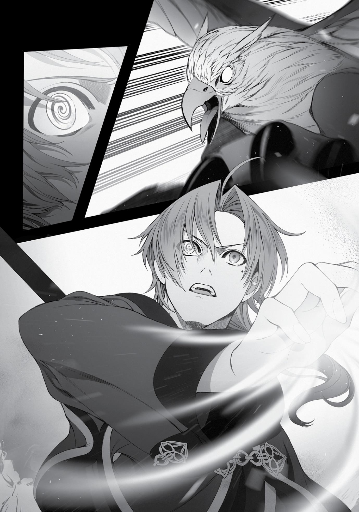

+++
title = "Chapter 12: Traversing the Sands"
date = 2026-07-20
weight = 12
[extra]
volume = 11
chapter = 13
+++

Even in my previous life, I had a soft spot for Succubi. The ones
in that world tended to wear a ton of makeup, but that was fine, as
long as they never let you see what was really underneath the paint.
You just had to let yourself believe the illusion.
Long story short, it wasn’t my fault if I got really horny and
grabbed Elinalise from behind after we cleared out the last of the
Giant Bats. I was a victim of the circumstances.
“Hey! Rudeus? Get a hold of yourself! Use that Detoxification
spell already! Gah, stop rubbing yourself against me!”
“Come on! Please? Just a little? I won’t even put it in all the
way! Why don’t I just use the back entrance? That doesn’t count as
cheating, right?!”
“Stop being such an idiot!”
“Guhoh!”
My persistent groping was answered with a vicious shield chop.
If Elinalise was a character in a visual novel, they’d probably call her a
“childishly violent heroine” on the internet. Not that she wasn’t fully
justified, of course.
In any case, the pain restored my sanity somewhat, and I used
my Detoxification spell.
“Haa… haa…sorry for the hassle, Elinalise…”
“That’s all right. It’s the monster’s fault, not yours.”
Man, it really hurts where she smacked me… she swings that
thing like a club…
“Honestly, I hope we’ve seen the last of those awful creatures…
Ugh, now you’ve got me all worked up.”
Smacking her flushed cheeks, Elinalise shook her head
vigorously. My mating rituals had apparently done some damage this
time. It was the Succubus’s fault, at the end of the day, but that
didn’t matter. She’d been justified in hitting me.
Page | 237

My jaw was going to be aching for a while, but these things
happen.
“Those bats seemed like they were under the Succubus’s
control, didn’t they?”
“Yeah, I guess so.”
The Central Continent had monsters that commanded weaker
monsters as well. The first monster I’d ever seen in this world was
one of them, in fact. What was it called, again? I’d only seen it that
once, so it had slipped my mind. Some kind of boar-like creature that
walked on two legs.
Apparently, the Succubi could control swarms of Giant Bats in
the same way. When they saw men and women traveling together,
they’d order the bats to attack the women, and take that
opportunity to seduce the males. They brought the men back to their
lairs, where they’d wring them dry and then literally eat them.
I could take the things down at a distance with a single attack,
but a swordsman or warrior used to melee combat would probably
be in deep trouble. How could you possibly deal with that scent up
close? The longer the fight lasted, the harder it would be to focus.
Even the most pure-hearted of knights would eventually fall to their
knees.
Gay men were probably the only people who stood a fighting
chance.
“…What is it this time?”
Not long after our battle with the Succubus, a two-legged lizard
that resembled a velociraptor popped up over a nearby sand dune.
More quickly followed, and soon they were moving toward us.
They weren’t especially large, but there were more than a dozen
of them. A few made an immediate beeline for the fallen Giant Bats
and started to feed on them.

Page | 238

“I’ve never seen these things before,” said Elinalise, raising her
shield warily. I also readied my staff and watched the creatures
carefully.
“I’m surprised. I thought you knew about every creature out
there, Elinalise.”
“I’m not a professional monster researcher, you know…”
For once, Elinalise couldn’t rattle off the name of the enemy we
were facing. That probably meant it was a species only found on the
Begaritt Continent.
When they spotted us, the raptors hissed loudly, and a few
jumped to attack. It looked like they were trying to protect their
meal more than anything else. Not that they’d really earned it,
considering that we’d killed the bats.
The raptors were quick, and they had sharp claws, but they
weren’t particularly dangerous. The two of us took out seven of
them in a few seconds, cutting their numbers to about ten. The
survivors, realizing the danger they were in, backed away from us
warily.
It seemed easiest to mop up the survivors with a single big Earth
spell, but—
“Rudeus! Be careful! Something huge is coming!”
A group of larger monsters had been sneaking up on us during
the fight. They were giant chickens, maybe five meters in height—
basically feathered dinosaurs. Their crests were an eye-searingly
bright shade of red.
Apparently, these things were natural predators of the
“velociraptors.” The pack immediately assaulted the lizards, killing
most of them and sending the others fleeing frantically. The chickens
consumed their victims violently on the spot.
“That’s got to be a variety of Garuda…”
Page | 239

On its own, a Garuda was considered a C-rank monster, but
those that moved in packs were usually classified as B-rank threats.
These ones were unusually large to boot. We were probably in Arank territory here. Since their battle with the raptors was happening
some distance from us, though, the oversized chickens were content
to throw a few threatening cries at us rather than attacking.
The few surviving lizards were still desperately trying to escape,
but they wouldn’t last long at this rate. And once the Garuda finished
eating them, they’d probably turn on us next. We might be able to
handle them, but…
“Let’s get out of here while the getting’s good, Rudeus.
Something even bigger is coming.”
Elinalise’s sharp senses had already picked up on a truly massive
predator approaching from behind the monstrous chickens.
“Got it.”
As we retreated, Elinalise managed to grab one of the smaller
raptor corpses to take with us. It would probably make better eating
than the bats.
After putting some distance between us and the site of our
battle with the raptors, we found a quiet spot to make a temporary
shelter. This would be where we spent the rest of our night.
Rather than relying on our provisions, we decided to cook and
eat the dead raptor that very night. We still had plenty of food, but
any adventurer worth their salt tried to supplement their supplies
when they could.
Today had taught us that the desert was a very different place at
night. Once the sun went down, the monsters had just kept coming.
If we’d stopped to fight the Garuda, we’d probably have found
ourselves facing down a new threat only minutes later.

Page | 240

Elinalise speculated that the Succubus’ pheromones had
attracted the other creatures to that spot. The scent was sweet to
males and intolerably foul to females. It was hard to say if that
applied to monsters too, but perhaps they’d learned that there was
prey to be found when they followed that odor.
And of course, the Succubi targeted human males…which meant
that groups of people would naturally attract swarms of monsters in
this desert. The first Succubus we’d encountered hadn’t brought any
Giant Bats or other creatures with it, but there had been a magical
barrier protecting that area. Maybe that Succubus had just managed
to slip inside alone, somehow.
Oh, crap. What if it was a friend of Orsted’s or something?
N-nah, that can’t be right… it wouldn’t have just attacked me,
in that case. It would have asked if I knew him or something, right?
Hold on, though. What if it was all just a big cultural
misunderstanding? What if that was just how a Succubus said hello?
In Japan, people like to get to know someone by taking a bath with
them. Foreigners could never seem to wrap their heads around that
one. Maybe this was something similar.
That would be really unfortunate, then. I might have
accidentally killed an old friend of Orsted’s. Was it too late for us to
go back and dig her a grave or something? Maybe he’d be less
outraged if he saw we’d shown her some respect…
No, no. If he’d posted a guardian out there, Nanahoshi would
have mentioned it. And thanks to his curse, most people instinctively
hated Orsted. That probably applied to humanoid monsters too.
It was probably just a coincidence, all things considered.
“Fwaaah… I must say, the Begaritt Continent’s not much like
what I envisioned.” Elinalise’s yawn echoed inside our little shelter. I
envied her ability to relax. Maybe she’d be a little less carefree if she
had any idea what Orsted was like.
Page | 241

Still, I was just overthinking things at this point. We couldn’t
start worrying about whether every monster we encountered was
actually somebody’s friend. The thing had tried to eat me. We’d
fought back to protect ourselves. It was that simple.
Pushing this unproductive line of thought away, I turned to
reply. “Yeah, I guess so. There’s a lot more monsters than I
expected.”
In terms of the encounter rate, this place seemed even worse
than the Demon Continent. Hopefully we hadn’t screwed up and
landed ourselves on the Divine Continent by mistake or anything.
“Well, we’re managing all right for now, and that’s what
matters.”
“Sure. Doesn’t mean we can get careless, though.”
“I don’t need you to tell me that, dear. Still, if we can keep doing
what we did today, we should be able to deal with anything that
attacks us.”
“Just make sure you’re ready to deal with it if a Succubus gets
me again, okay?”
“How about you be a little more careful?”
Our first day in the desert was finally over. It had felt more like a
week, honestly.
We had a long road ahead of us.

Page | 242

Chapter 12:
Traversing the Sands

O

UR SECOND DAY

on the road proved no less eventful. In fact, we

ran into even more monsters. For how barren this desert looked, it
was crawling with critters.
The Sandworms were particularly nasty. They didn’t pose a real
threat if you stayed alert and spotted them ahead of time, but
sometimes you just had other things demanding your attention. Like
monsters, for example. At one point, we blundered into a Sandworm
in the midst of fending off a Twin Death Scorpion. The thing
swallowed me whole instantly and started to drag me underground.
Startled as I was, I managed to instantly fire off the intermediate
spell Wind Slice to rip it apart from the inside.
After using earth magic to tunnel my way back above ground, I
found that Elinalise had taken a hit from the scorpion’s poisonous
stingers. She was down on her knees and her face was purple. She’d
been so alarmed to see the Sandworm swallow me that she’d lost
her focus. I quickly killed the scorpion and used my Detoxification
magic to save her life.
Neither of us had really screwed up this time, honestly. We’d
just gotten unlucky.
“Nice work getting us out of that mess, Rudeus. I can see why
you acquired such a reputation as an adventurer.”
Elinalise certainly didn’t blame me for the situation, even
though she’d nearly died, and I was the one who’d been more
careless. The woman was definitely mature.
“Don’t look so miserable, all right?” she said. “No matter how
alert are you, sometimes things just get the better of you. We
managed to pull through, and that’s what matters.”

Page | 243

The risk of failure was ever-present—as was that of death.
Elinalise had been well aware of that from the start.
Fortunately, that was our only brush with real danger on that
day. We did catch a glimpse of a colossal monster in the distance at
one point. It was trudging along slowly, but every step it took sent up
a huge cloud of sand visible even from a great distance. The thing
had to be hundreds of meters in size. It was hard to describe. I guess
you could say it was like a blue whale with the legs of an elephant.
“That’s a Behemoth, Rudeus.”
“Huh. You’ve seen one of those before, Lise?”
“Oh? Somebody’s gotten a bit more casual all of a sudden.”
“I don’t know about that. I just try to be respectful with my
elders.”
“Zanoba’s older than you too, you know?”
“Well, sure, but he’s basically just a big kid…”
Apparently, the Behemoth was one of this continent’s more
famous monsters. They ranged in length from a hundred to a
thousand meters.
It wasn’t clear what the things ate, but they were only ever
sighted in the desert. They had peaceful dispositions, for monsters,
and tended to leave people alone unless attacked.
A few adventurers claimed to have slain one and found massive
numbers of magic stones inside its belly. Hearing these rumors, some
people had tried to hunt them for profit, but bringing down a
Behemoth was much easier said than done. Their outer hide was
extremely tough, and given their sheer size, your average adventurer
was barely going to scratch them. They had no particular attacks or
natural weapons, but simply thrashing their massive bodies around
was enough to kill most of their enemies.
Page | 244

What if you attacked them from a distance, then? Well,
apparently the creatures were capable of burrowing deep beneath
the sand when things started to heat up. Almost no one had actually
succeeded in killing one. Additionally, despite their massive size,
nobody had ever found a Behemoth corpse. This had given rise to
rumors that there was a hidden “Behemoth burial ground”
somewhere. An exciting concept—it reminded me of similar myths
about elephant graveyards back in my old world. But realistically
speaking, their corpses were probably just eaten by other monsters.
“You know, you might be able to take one down if you tried,
Rudeus.”
“I’m not planning to go around assaulting harmless herbivores
for no good reason.”
Still, if I ever found myself seriously hard up for money, it might
be worth a shot to throw some magic at one from a safe distance.
On our third day in the desert, we encountered our first
sandstorm.
Maybe encountered isn’t the right word. We were just walking
along when we saw something that looked like a wall in the
distance—and when we got closer, it turned out to be a wall of sand.
Elinalise and I considered the possibility of waiting for it to die down,
but from the looks of things, this was a static storm that blew
constantly in this one location. It didn’t look likely to rush past us or
disappear. And we were in a hurry, of course.
I ended up using my magic to clear the storm until we’d pushed
through the area. My professors had told me it was best not to
meddle with the weather too much, but this felt like a case where I
was justified.
When I turned to look back after about an hour of walking, I
found that the sandstorm had reappeared exactly where it had been
Page | 245

before. It seemed plausible that it was a sort of magic barrier in its
own right—a natural-looking defense of the road that led to Orsted’s
teleporter, maybe. Nanahoshi hadn’t mentioned it, but I seemed to
remember her saying that she’d been kind of out of it during their
trip through the desert.
On our fourth day, the number of monsters we encountered
decreased sharply. Maybe that sandstorm kept them sealed off in
the area we’d just left.
There were creatures in this part of the desert too, of course,
but they were totally different from the region around the ruin. The
scorpions only had one tail, and there were no armies of ants. The
Sandworms were only about as thick as Elinalise’s waist now. Also,
there didn’t seem to be any Giant Bats flapping around at night. We
spotted a few raptors here and there in the twilight hours, but they
were smaller, and so were their packs. There was no sign of any
Garuda.
Most importantly, there were no more nocturnal ambushes
from the Succubi. I guess that was for the best, but maybe a part of
me was disappointed?
Nah, let’s say not.
Day five was more of the same. We trudged through the same
old sand, staring out at the same old featureless landscape.
When you’re walking through a place without any visible
landmarks, it’s supposedly easy to end up going in circles when you
think you’re moving straight forward. It has something to do with the
difference in the length of your stride when you’re moving your
dominant leg.

Page | 246

I was confident Elinalise was keeping us on track. But I was still
starting to feel like I’d seen some of these sand dunes before. Doubt
crept into my mind. Could she actually be lost?
My growing mistrust wasn’t a problem in itself, as long as I kept
it to myself. Elinalise would be very annoyed if I voiced any of these
thoughts, and if it threw off our teamwork, we might end up dead.
The only thing I could do here was be understanding. If she did
screw up, I needed to say, “That’s okay!” with a big smile. This was a
no-negativity zone.
“…Hm. Rudeus, I think I see something in the distance.”
In the end, my resolve wasn’t actually tested. I could indeed
make out a vague blur shimmering on the horizon in the direction
Elinalise was pointing,
There was definitely something out there. My eyes weren’t
sharp enough to tell what it was, but its color suggested it wasn’t just
part of the desert. There was still a possibility it was just a mirage,
though.
We made our way toward the blur, staying on high alert.
Come to think of it, we hadn’t run into any monsters today at
all. Maybe this area just wasn’t home to any… Not that I was going to
let my guard down, of course.
As I was thinking this, the shape ahead of us grew larger and
clearer. It was a giant rock formation that made me think of Ayers
Rock, and it was maybe fifty meters in height.
The wall facing us looked very steep, if not totally vertical.
Climbing to the top would probably be challenging. And it stretched
from one side of the horizon to the other, with no end in sight.
“Should we try to find a way around it?” Elinalise asked.
“No, let’s get up on top of it. I’ll use my magic.”

Page | 247

With a simple Earth spell, I created a pillar of stone; taking
Elinalise into my arms, I rode it upward like a makeshift elevator.
There was no telling what might try to ambush us up there, so I took
it fairly slowly.
Suddenly, I noticed an odd sensation. Something was…rubbing
my butt?
“Uhm, Elinalise?”
“What is it?”
“Is there some reason you’re groping me?”
“Oh, just force of habit. Think nothing of it.”
For the several minutes it took us to rise to the top of the rock
shelf, Elinalise continued feeling me up.
“…”
Maybe her curse was starting to affect her. I was keeping Cliff’s
invention supplied with mana, but all it did was buy us more time,
and it had been about ten days since the last time she’d been with
Cliff. She could probably hold out a while longer, but the thing was
just a prototype; we couldn’t trust it blindly. The sooner we got to a
city, the better.
In the worst-case scenario, I’d have to sleep with her myself. But
no matter how I tried to spin it, that would be cheating on my wife. It
would still be a betrayal, even if I could blame it on the curse. We’d
decided beforehand that I wasn’t going to sleep with Elinalise on this
trip, and I needed to keep that promise.
If Bazaar had a brothel where she could hire a male prostitute,
that would be ideal. That way, it would just be a business
transaction. She could see to her needs without either of us feeling
too guilty about it.
“Elinalise, we’re at the top now.”
“Yes, I suppose we are.”
Page | 248

Elinalise was still clinging to me, and she seemed to be staring at
my shoulders with some passion in her eyes.
“…You can get off now.”
“Ah, right. Pardon me.”
Elinalise stepped off the pillar and away from me, but her eyes
quickly drifted downward to my lower body. I was definitely starting
to sense some danger here.
Maybe holding her like that on the way up had been a mistake.
If I’d just taken a few minutes to think, I could have figured out
another way to get us both up here. In retrospect, I felt like she’d
been consciously trying to avoid physical contact with me these last
few days. And now I’d gone and thrown a wrench in the works.
We needed to get to this Bazaar place fast.
“Let’s get going, then,” she said after a moment.
“Sure.”
Only a few seconds after we began to walk, though, a shadow
flitted across the ground toward us.
“Rudeus! Get down!”
As Elinalise shouted out a warning, I threw myself down and
forward without even looking upward. An instant later, something
zoomed past above me, and a cold tingle ran down my spine.
I quickly jumped back to my feet and looked up. We’d been
attacked by a monster with the body of a lion and the head of an
eagle. Beating its massive wings loudly, it thumped to the ground
some distance away from us.
“That’s a Gryphon!” shouted Elinalise, drawing her sword.
I quickly focused my thoughts on the battle at hand. Readying
my staff and turning to face the creature would leave me in an
awkwardly exposed position, and Elinalise was currently behind me,
a reversal of our usual formation. But even in a situation like this, she
Page | 249

could probably maneuver her way to the frontline without getting in
my line of fire, and then I could fall back to safety.
Or so I thought at first.
“There’s two of them, Rudeus! You deal with that one!”
A loud flapping sound from behind confirmed that we’d been
caught in a pincer attack. I’d have to deal with Gryphon A over here
by himself. If I dodged out of its path, it would charge right past me
and hit Elinalise from behind.
Still, maybe that was the safer route. If she could hold off both
of them for a few moments, I’d be able to pick them off one at a
time. That would be more like our usual pattern, at least…
But we hadn’t worked out any plan to that effect in advance.
She’d told me to deal with this one. So if I didn’t kill it, she’d be taken
by surprise.
Right then.
The Gryphon was standing with its body bent forward, its beak
half-open, glaring fiercely at me. It wasn’t far from me, and it looked
like an agile creature. It might be able to dodge my Stone Cannon, or
even shrug it off. I wanted to be absolutely sure I killed this thing.
It had wings. I wasn’t sure how far it could fly on them, but
Quagmire probably wouldn’t be too effective either. That left my
wind magic.
The Gryphon’s back legs tensed up suddenly. I was out of time
to think. Launching itself forward with a powerful kick, the monster
rushed at me with its legs outstretched like a pouncing tiger.
I ducked down and cast the advanced spell Earth Hedgehog at
the ground. A circle of three-meter earthen spikes burst up all
around me.
“Kyeeaah!”

Page | 250

The Gryphon instantly beat its wings. But my Eye of Foresight
was kind enough to show me what it was planning.
It adjusts its course in mid-air, dodges to the side, and tries to
take its distance.
Whipping my left hand forward, I fired off a wind spell, creating
a shock wave in mid-air that robbed the Gryphon of its mobility. It
spun helplessly for an instant; but before I could follow up, it twisted
its body around with cat-like agility, trying to brace itself for a
smooth landing.
I fired off a Stone Cannon at the spot it was falling toward. The
projectile whistled through the air and struck home, passing straight
through the creature’s body with a wet crunch. The Gryphon
staggered backward a few steps, then collapsed loudly to the
ground.

Page | 251

Page | 252

The thing looked dead already, but I finished it off with a fire
spell to be absolutely sure, and then spun around to see how
Elinalise was faring.
Fortunately, she was okay. I saw her fending off the Gryphon’s
swipes with her shield while striking at it with her rapier. The
Gryphon’s front legs were red with blood; she’d obviously been
targeting them persistently, trying to reduce its ability to attack.
“Heads up, Elinalise! Stone Cannon!”
“…!”
After a shout of warning, I fired off another deadly projectile.
Elinalise sidestepped nimbly out of its path.
The Gryphon didn’t follow her. It had noticed me and was trying
to dodge into the air. But Elinalise stabbed out with her rapier,
striking a shallow blow on its leading leg that dropped it back down.
The sharpened stone hit the Gryphon at the neck and tore
through its body, severing its spine on the way out. It crashed to the
ground headfirst and began to convulse. Elinalise strode forward and
stabbed the creature in the head to put it out of its misery. I
proceeded to burn its body with fire magic.
The two of us took a few moments to look around the area for
any additional reinforcements before finally letting out a sigh of
relief.
“Sorry about that, Rudeus. I got a little careless.”
“Nah, I’m the one who wasn’t looking above me.”
After apologizing to each other for our slip-ups, we turned our
attention to the road ahead. The top of the rock shelf had a coating
of sand here and there, but for the most part, it was solid stone. At
least we wouldn’t have to worry about anything lurking under the
surface.
“Let’s make sure we watch the skies from now on.”
Page | 253

“Yes, let’s.”
With that brief battle analysis complete, we set off once again.
On day six, we figured out that the rock shelf was a Gryphon
nesting ground. Multiple creatures seemed to have divided up the
area into their own territories, judging by the steady pace of the
attacks we faced.
Gryphons were B-rank monsters. They didn’t use any magic, but
they were physically powerful and had limited flight capabilities. That
added mobility made them much more challenging for a magician
like me to target. Most of the time, we encountered them alone, but
sometimes you’d get small family packs of two to five. The creatures
were clever and could organize coordinated attacks and ambushes,
so in a group, they were considered an A-rank threat.
They weren’t any match for us without the element of surprise,
though.
Night fell, but no Succubi appeared to harass us. They
presumably avoided Gryphon turf. From the looks of things, the
Gryphons were pretty territorial. Once you beat off the locals, there
wasn’t much risk of another group barging in to attack you that same
day.
In other words, we were safe here for the moment. For the first
time in a while, we made ourselves a campfire and roasted some
Gryphon meat for dinner.
The last group we’d beaten was a male, a female, and their
child, so we went with the youngest of the three. Young animals
tended to be more tender and tastier. I did feel a little bit conflicted,
as someone who was going to be a father himself before too long,
but we do what we have to in order to survive. People are selfish
creatures, at the end of the day.
Page | 254

Fortunately, I’d picked up a few tricks when it came to cooking
monster meat—like carrying my own spices with me. The raptors
hadn’t been particularly tasty, but the Gryphon was basically part
bird and part mammal, so I had higher hopes this time around.
For the seasoning, I used one part ground Kokuri nuts to two
parts Awazu seeds and Abi leaves. After mixing and grinding them
together, I tested the blend by licking my finger. Mmmm. Nice and
spicy.
I rubbed the seasoning evenly across the surface of the cut we’d
butchered out of the beast, taking care to rub it in well. After adding
a sprinkle of salt, I moved on the cooking part. Once the surface was
done, I moved the meat a little further from the fire to lower the
heat and waited a bit longer. Once the fat was visibly sizzling, we
were good to go.
Trying not to burn my tongue, I took a cautious experimental
bite.
The meat was both tender and juicy. It had a slightly odd flavor
to it, but the spices almost completely masked that. Given the way
I’d done things, it wasn’t cooked completely all the way through. But
that wasn’t an issue—and once you chewed off the surface, you
could just sprinkle a little more seasoning on.
“Ah, this really takes me back,” said Elinalise. “Geese always
used to carry around little bottles of spice like that too.”
“Yeah, that seems pretty common with rogue types, doesn’t it?”
After Eris dumped me, I’d spent several years living the
adventurer life. Naturally, I’d spent some of that time working in
parties. It felt like there was always one guy in every group who’d
make his own spices and carry them around. For some reason, it was
usually the dagger-wielding, lock-picking, trap-disarming sorts. I’d
often noticed them squirrelling random nuts and leaves away for
later.
Page | 255

Foraged materials weren’t just useful for cooking, though.
Sometimes you’d run into a monster that recoiled from the strong
tastes and smells of certain plants. Some plants also made a decent
insect repellant in a pinch. I’d even seen one guy who even tossed
some kind of powder in his enemies’ eyes to blind them.
“I like the way you seasoned this quite a lot, Rudeus.”
“Well, that’s good to hear.”
Elinalise was openly licking the fat from her fingers. You
wouldn’t usually catch her doing that when she was eating in a
random tavern. Not unless she was trying to seduce someone.
“Your table manners aren’t the best today, Elinalise.”
“Goodness. Now you sound like Zenith.”
“Did Mom used to nag you about that?”
“Oh, yes.” She’d flush bright red and hiss, “You’re a lady,
Elinalise! Try to act like it!”
Elinalise’s imitation of Zenith didn’t quite line up with the
woman I remembered. But I guess they’d known each other well
before I was born.
I found myself wondering about where Zenith was now for a
moment, but I shook the thought out of my head. There was no
point in making myself anxious.
“Were you just as promiscuous back then, too?”
“Promiscuous? That’s rather rude. I suppose I was, though. But
back in those days, we all used to sleep in our underwear, or the
nude. Ghislaine didn’t even know what a bra was at first! You should
have seen the way Paul ogled her…”
It was hard to imagine Ghislaine being quite that shameless…but
maybe she was just clueless. That would fit with what I knew of her.
As for Paul, well…not to excuse the guy’s behavior, but I probably

Page | 256
