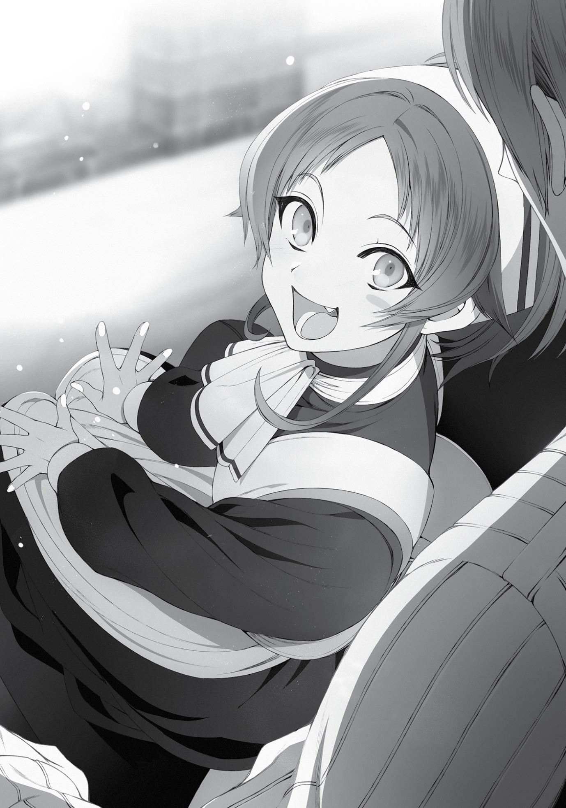

+++
title = "Chapter 2: The Live-In Maid and the Boarding School Student"
date = 2026-07-20
weight = 1
[extra]
volume = 11
chapter = 2
+++
That afternoon, I walked home with Norn and Aisha from the

University of Magic.
They’d both taken a standard written test. It was a general
exam, given to most potential students regardless of their age. Some
sections covered various academic subjects, while others covered
the six fundamental disciplines of magic. It didn’t sound anything like
the test I’d been given, but that was only to be expected.
In any case, Aisha had aced her exam.
The Kingdom of Ranoa had some fundamental cultural
differences from Millis. I was pretty sure the curriculum they taught
their children was at least a little different. And yet, Aisha had scored
perfectly on the first test she’d ever taken in this country.
I had to admit I was impressed. Jenius, likewise, had been so
shocked to see a ten-year-old perform so well that he’d offered to
admit her in as a special student, under certain conditions. But, of
course, that wasn’t what I’d promised my sister.
“All right, then. I held up my end of the bargain!” Aisha
announced triumphantly as we entered the house. “I’m now officially
your servant, Rudeus!”
“You really want to become the family maid, then? Even though
you’re a part of the family?”
“No, no. I’m your maid, not the family’s!”
So her goal was…to be her brother’s personal servant. That
struck me as a little bizarre, but I couldn’t exactly back out of the
bargain now.
“Well, all right. In that case, uh… make sure you do what I tell
you from now on, okay?”
“But of course! I’m at your disposal, Master!”
It was kind of nice to hear a girl calling me that for once, rather
than Zanoba. If it wasn’t my little sister saying it, I’d probably have
gotten excited.
Let’s just put aside the fact that I was currently a married man.
“That said, let’s keep an open mind about your future,” I said. “If
you end up wanting to study something, just let me know.”
“Well, I’m sure there are a few things I still need to learn.
Perhaps you’d be so kind as to teach me personally, young master…”
Putting a finger to her lips, Aisha fluttered her eyes at me.
I caught her drift, but decided it was easiest to play dumb. If the
kid ever came out and asked me to teach her how to make babies,
I’d have to sit her down and give her a thorough sex ed lecture.
Without any hands-on demonstrations, of course.
“By the way, is there a reason you’re calling me ‘master’ all of a
sudden?”
“Well, I’m going to be your servant from now on, sir. It’s only
natural that I address you appropriately.”
Oh, great. Now she was back to the ridiculous formal language.
“I liked it better when you just called me Rudeus, to be honest.
Can’t we stick with that?”
“I’m terribly sorry, but I need to maintain at least a semblance of
professionalism.”
The kid had a solid vocabulary. No wonder she’d done so well on
that test.
No point in pushing the issue for now. Sylphie might look at me
a little funny for a while, but I felt like Aisha had earned the right to
do what she wanted. “Okay, then. Make sure you consult Sylphie
before you take on any jobs for yourself, got it?”
“Of course. My mother taught me all about the duties of a maid,
I assure you. Leave everything to me.”
Folding her hands in front of her, Aisha bowed deeply to me.
Apparently, I now had a little sister maid. I had to admit, the words
had a strangely powerful ring to them…
They sounded better than housekeeper or dropout, anyway.
Which is probably what they would have called her back in Japan.
Norn’s results had been completely ordinary.
From what Jenius told me, she’d scored slightly below average
for her age. To be fair, the kid had spent a solid year traveling to this
city, and then I’d thrown a test at her before she even had time to
get her bearings. She’d probably have done much better if I’d
arranged for a few tutoring sessions first. In other words, she’d
performed just fine…except in comparison to Aisha.
I didn’t see the need to read too much into this. We’d just have
to help her improve bit by bit. She might never be at the very top of
her class, but what did that matter? As long as she learned the basic
skills she needed to function in society, that was good enough for
me. You don’t have to stand out from the crowd to live a happy,
fulfilling life.
“Do you have any thoughts on what you’d like to study, Norn?” I
asked.
My sister didn’t respond. She was hanging her head again,
pouting slightly as she avoided my gaze. It didn’t seem like she was
warming up to me at all. I’d been hoping to break the ice between
us, but I had no idea where to start.
“I don’t know all the options that well off the top of my head, I
guess,” I said. “But I think you usually start off with two or three
years of general classes before you have to pick a department,
anyway. The University has a lot of interesting introductory courses,
so maybe you can try a bunch and see if there’s a subject you like?
Oh, and if nothing particularly interests you, you could always go
with healing magic. Our mom used to be a healer too, remember?
There aren’t many healers in these parts, so you could land a job
easily once you graduate.”
Norn wasn’t responding to anything I said, so I ended up
prattling on for quite a while in this vein. Eventually, I noticed that
she was looking at me with an expression that suggested she wanted
to speak. I shut my mouth and waited.
“I think I want to try living in the dorms there.”
Her voice was tense and anxious, but she’d managed to get the
words out. I took a moment to think over what she’d said.
“The dorms, huh…?”
It would have been easy enough to flatly refuse, but I resisted
the impulse. It had obviously taken a lot of courage for her to even
raise this subject.
My initial reaction was that she was just too young. Ten-year-old
girls didn’t usually strike it out on their own. However, living in the
university dorms wasn’t quite the same as renting a place of your
own. You almost always had a roommate, for one thing.
Norn knew almost no one in this city, and she didn’t have any
friends here. If she lived in the dorms, that could change quickly. Her
age might be a bit of a problem on that front, but the University was
open to students of all ages. I knew for a fact that there were some
kids even younger than her living there. The dorms were a safe
environment with some fairly clear rules everyone had to follow.
Even a child of Norn’s age could live comfortably there, in theory.
Personally, I would have liked to get to know my sister better by
living with her. But from the looks of things, forcing her to stick
around might just make her resent me even more than she already
did.
In my previous life, I’d spent many years as a shut-in. I’d refused
to engage with the rest of the world, locking myself up in my room
instead. For a while, my family tried all sorts of schemes to get
through to me. They tempted me with expensive gifts, bought me
delicious food, and talked about my future in bright, optimistic tones.
And every single time, it just made me withdraw further from them.
It felt like they saw me as an animal in need of training, rather than a
human being.
I didn’t want Norn to feel like that. I didn’t want her to feel
trapped here. I didn’t want us both to be on edge every single day,
trying to read each other’s moods and thoughts.
Maybe it would be better for me to keep an eye on her from a
distance. If she found a place where she could feel a little more
comfortable, maybe it would be easier for us to see each other
clearly.
There was the Aisha thing to consider, too. She tended to be
condescending with her sister. I’d warned her to be careful, but she
didn’t even seem aware that she was doing it half the time. Fixing
that was going to be a long-term project. As long as she was living in
this house, Norn would be constantly exposed to her sister’s scorn.
And she’d see me, the brother she despised, every single day.
On top of it all, both Aisha and I both had some unusual natural
talents. I didn’t think of myself as a world-class magician or anything,
but most people considered me highly skilled.
It’s tough to grow up “normal” in a house where your siblings
are exceptional. I’d been through that myself the last time around.
In the worst-case scenario, I could go so far as to imagine Norn
running away from home someday. And I knew how badly that might
turn out, especially for a young girl. Some sick bastard might take her
in and start demanding favors or something. Compared to that, she’d
be much better off moving into a safe dorm room now.
Sylphie spent a lot of time in those dorms too. She did come
back to stay here every third night, but in between those visits, she
stayed with Princess Ariel. If something came up, she’d be right there
to help Norn out, and fortunately, Norn seemed to like her. Maybe
they’d opened up to each other in the bath that first night or
something.
The more I thought about this, the more it sounded like a
decent idea.
Ten was a young age to be living in a dorm… but the experience
might be good for her. She’d have to learn how to socialize and
cooperate with other kids around her age.
“Okay, Norn. If that’s what you want, I think I can arrange it. I’ll
submit the application for you.”
“Wait, what?!” shouted Aisha, her mouth gaping in disbelief.
“Why are you letting her do what she wants? She didn’t even get a
good score!”
So much for all that talk about professionalism. It must have
slipped her mind at some point in the last five minutes.
“Aisha, I—”
“I worked really hard for this, Rudeus! It isn’t fair!”
I could understand where Aisha was coming from. From her
perspective, it must have looked like I was playing favorites with
Norn. As far as Aisha was concerned, she’d earned the right to do
what she wanted by getting a perfect score on her test. I had to
assume she’d done a lot of secret studying over the last week to
make that happen.
Norn, on the other hand, hadn’t done much of anything, but I’d
decided to give her what she wanted, anyway. It must have seemed
blatantly unfair.
What had my parents in my past life said when I kicked up a fuss
about things like this? I couldn’t remember exactly, but I felt like it
was mostly just variations on “You’ll do what you’re told” or “We
know what’s best for you, young man.”
Had those words ever satisfied me? Well, no.
Would the stern approach work on Aisha, then? Nah. Probably
not.
She was a very clever kid, of course. If I explained my reasoning
in detail, she might understand…maybe? If I was lucky?
It couldn’t hurt to try and talk this out, at least.
“Aisha, I’m not rewarding Norn for anything. I just gave it some
thought, and I came to the conclusion that living in the dorms might
be what’s best for her.”
“But—”
“Norn doesn’t know anyone in this city yet, and…I don’t think
she likes being around me that much either, unfortunately. I don’t
want to keep her trapped in this house if she’s going to be miserable
here.”
“But Dad… Dad said we’re supposed to live together!”
Hm. That was a decent point. Now I sort of felt tempted to take
it all back.
No, no, that wouldn’t be right. My job here wasn’t to follow my
marching orders blindly. Paul made plenty of mistakes himself, right?
My judgment wasn’t perfect, of course, but I had to trust it for now.
“I’m still going to take care of her, of course. You’re both my
family, and I’m here for you no matter what. But it seems like Norn
isn’t happy here, and I think living in the dorms might help her find
her footing.”
“…”
Now it was Aisha’s turn to hang her head in sullen silence. For
some reason, there were tears in her eyes.
“Are you being nicer to her because my mom’s just the
mistress?” she said.
The question took me completely by surprise. The instant I
heard the word mistress, though, I knew we were in some dangerous
territory.
“Lilia isn’t a mistress, Aisha. Who told you she was? Was it Dad?
I hope it wasn’t Norn.”
“Mom said it herself! And…Norn’s grandma said it, too…” The
tears were rolling down her face now.
Lilia and Norn’s grandma… So Zenith’s family, then.
It was one thing for Lilia to put herself down. I knew she still felt
guilty about the whole thing. That was why she’d consciously
continued to play the role of the family maid, rather than acting like
my mother’s equal. Maybe it was natural that she’d expect Aisha to
behave the same way toward Norn, Zenith’s daughter. I had to
assume that Paul treated both his girls the same. But in Lilia’s mind,
at least, the two of them weren’t equal.
As for the Latria family… From what I’d heard, they were an
aristocratic house with a storied history. I’d only met my aunt,
Therese, who wasn’t a bad person, but as a group, they probably had
some very fixed ideas about adultery and social status. They’d
probably doted on Norn while ignoring Aisha altogether. They
weren’t related to her by blood, after all.
Logically, it was hard for me to blame them or Lilia for their
actions.
“Do you like her better…because I’m just your half-sister…?
Hic…” Aisha was sobbing now, rubbing her fists against her crumpled
face.
But whatever their reasons, they’d still hurt an innocent child.
I’d been operating under some mistaken assumptions here.
Neither of my sisters was going to be easy to take care of.
“Aisha, I’ve never thought of Lilia as my Dad’s mistress. And as
far as I’m concerned, you and Norn are both my sisters, plain and
simple.”
“But I…I studied so hard for that test… I tried so hard…and Norn
just…just gets to…”
In between sniffles, Aisha stammered out more complaints.
So she had crammed secretly for the test. That must have
been…stressful. I’d only given her a week’s warning, after all. She’d
obviously earned that perfect score.
“Listen, Aisha.”
“Wh-what?”
“It might be hard for me to explain this, but I do understand. I
know you worked really hard, and I’m proud of you. That’s why I
agreed to let you do what you wanted.”
“But you said…you said Norn can go live in the dorms, and
she…” Aisha sniffled loudly at this point, letting her lower lip quiver.
It was an effective technique, but I didn’t back down. I wasn’t
actually being unfair here.
“That’s different, Aisha. I’m taking this on a case-by-case basis,
okay? If you told me you wanted to go live in the dorms right now,
you’d have my permission to do so. But if Norn said she wanted to
stay here and do housework instead of going to school, I wouldn’t
allow that. You earned the right to do that with your score on that
test.”
Aisha frowned and fell silent.
And after a painfully long pause, she finally replied, “Okay.” My
arguments clearly hadn’t satisfied her, but she’d ultimately accepted
them.
Norn just looked on quietly, not looking particularly happy
herself.
If nothing else, I felt like I was beginning to get a sense of the
situation here. Zenith’s family had treated Aisha as the illegitimate
daughter of Paul’s mistress, and Aisha had channeled that into trying
to be better than Norn at everything. My dad probably hadn’t
treated them differently, but circumstances still drove a wedge
between them. Their relationship had been twisted out of shape long
before they reached me.
Still, the Latria family was a very long way from us now. No one
in this city was going to sneer at Aisha because of who her mother
was. As long as I played my part carefully, this problem would
eventually fade away.
“By the way, Norn, there is one condition on that offer. I want
you to come visit us here once every ten days, at a minimum.”
Norn frowned at this. “Why?”
“Because I’m worried about you.”
Also, I had a responsibility to keep an eye on her. It wouldn’t
feel too good to tell Paul that I tossed his darling daughter into a
dorm and then forgot about her.
“…Okay, then.” Though she looked extremely reluctant, Norn
did at least agree.
Now that we’d finally worked out an initial plan, it was time for
us to rearrange our lives to accommodate it.
I arranged to have Norn enrolled at the University of Magic, and
I applied to secure her a spot in the dorms. Of course, I also
explained the situation with Sylphie and asked her to help Norn out if
she ran into any trouble there.
“What? You’re really going to push Norn away like that?”
Sylphie was critical of my plan at first. Her first impulse was to keep
Norn in our house so we could shower her with affection until she
started to trust us a little more. It wasn’t an unreasonable option,
but based on how uncomfortable Norn had looked in that first week,
I couldn’t convince myself it was our best bet.
“I think Aisha and Norn might be better off living separately for
a little while,” I said. “It seems like my mom’s family gave Aisha a
hard time about being the daughter of a ‘mistress,’ you know? I
don’t want to push Norn away, but I think they both need some
space right now.”
“Hmm… Well, I didn’t know any of that. All right, then. I guess I’ll
just have to keep an eye on Norn whenever I can.”
Sylphie wouldn’t be there every day, but it was better than
nothing. Hopefully, this would all work out for the best.
Aisha, for her part, quickly assumed her new role as our
household maid.
She was very good at it too. As soon as she started taking over
the housework, our lives got noticeably easier. She was already
handling both the cleaning and the laundry, which basically meant all
my chores had disappeared. I couldn’t rub my face against Sylphie’s
dirty underwear anymore, but I’d just have to deal with that as best I
could.
Sylphie was still in charge of the grocery shopping and the
cooking, at least. That was one role she wanted to hold on to. But
Aisha was always there to help her out.
Apart from these primary tasks, my new maid also began to deal
with a number of things that had never even occurred to me before.
She went around greeting our neighbors, for example, and arranged
to have our chimney swept. The girl was sharp as a tack and a hard
worker to boot. She excelled at everything she put her mind to, and I
never saw her make a major mistake. I had to imagine a lot of work
went into maintaining that image of perfection.
For whatever reason, it seemed she was serious about making
this maid thing into her full-time occupation. When she was on the
job, she dropped the clingy little sister act and turned into an almost
robotic professional. Lilia’s training had obviously been very
thorough.
In general, Aisha spent most of her working hours helping out
around the house. When we got home, she’d help Sylphie with
dinner or help me get a bath ready. When we were bathing, she’d lay
out a change of clothes for us, then brush Sylphie’s hair afterward.
And on the nights when Sylphie went back out for her night shift,
she’d bring her coat to the door and see her off with a polite bow.
Sylphie, who wasn’t used to being fussed over like this, reacted
awkwardly to Aisha’s attention. It was always fun to watch them
interact.
When we had guests over, Aisha also made sure to keep them
happy and entertained. Not that this happened very often. The only
person who’d stopped by recently was Nanahoshi, seeking to
formally thank me for my earlier help. She’d apparently ordered
something for me as a reward: the magic circle for a specific
Summoning spell that I might find helpful. She promised to hand it
over and explain how to use it before we moved on to the second
stage of her experiments.
Aisha had jumped at the chance to lavish her hospitality on our
guest. She’d drawn a bath for Nanahoshi, prepared her a change of
clothes, and even helped her wash up in there.
Nanahoshi had seemed distinctly aggravated by all the
attention. When she left, she’d grumbled something at me about
what a “monster” I was for “working my own little sister to the
bone.”
I think she preferred her baths to be peaceful, quiet, and
solitary. I’d have to remember to ask Aisha to give her some privacy
in there next time.
The girl didn’t even relax after dinner. When I settled down in
the living room, she’d bustle around keeping the fire roaring or
bringing me warm drinks. To be honest, it felt kind of weird to have
my own sister acting like my personal servant. But Aisha seemed
happy with the arrangement, so I was willing to let things continue
like this for a while. I didn’t want to force her to do anything she
didn’t want to.
After reaching this conclusion, though, I remembered my theory
that your mana capacity is partially determined by how much you
use magic as a child. If Aisha wasn’t going to attend school, I could at
least give her a little training in magic. At the age of ten, her mana
capacity probably wasn’t going to change that much, but it wasn’t
set in stone either. And she’d be better off knowing at least
Intermediate-tier offensive magic too. The Beginner spells were
enough for an ordinary person living a peaceful life, but the
Intermediate ones were more useful if you ever needed to defend
yourself.
“Aisha, come over here. Let’s practice magic for a while.”
“Ooh! Are you going to teach me, Rudeus?! Really?!”
Aisha trotted over to me with a big smile on her face. For all her
discipline, the kid tended to let the “cool-headed maid” character
drop whenever she got emotional about something. She still had a
ways to go before she’d be a match for Lilia.
“Yeah, I think it’s a good idea for you to learn a little more. I
know you might not be that interested, but—”
“But I am, though! Of course I am!” she said, hopping up into my
lap. “Please go right ahead!”
The girl could be awful cute when she wanted to.
Our first tutoring session was a productive one. Aisha already
had a good grasp of the fundamentals; she hadn’t taken the time to
learn the Intermediate spells, but I got the feeling she could have
picked them up fairly quickly from the right textbook. She wasn’t
capable of silent spellcasting, though. Ten was probably too late to
learn that particular skill.
I ran through a few things, then gave her a simple homework
assignment: to use as much magic as she could every day, until her
supply of mana ran dry.

That night, Aisha clambered onto my bed and asked, “Can I
sleep with you tonight, Rudeus?”
After seeing her break down in tears the other day, I couldn’t
bring myself to say no. And it wasn’t like it could do any harm,
anyway.
“Sure thing. C’mon.”
Without a word of complaint, I pulled back the covers and made
room for her.
Aisha was smaller than Sylphie, of course, but also warmer. In a
cold climate like this, it never hurt to have another heated, huggable
pillow in your bed.
Of course, this was all purely innocent. Apart from the fact that
she was my sister, she was also just a kid. She seemed to have
learned a few double entendres at some point, but she probably
didn’t really understand them. There was no reason to feel too
awkward about any of it.
If Aisha did eventually develop some sort of a crush on me, I’d
just have to convince her to give it up. I don’t know if sister-kissing
was inherently immoral or anything, but I liked my family the way it
was.
And that was how things generally went on the nights Sylphie
was away.
The real problem arose on the next night my wife was around.
Specifically, when we got into bed together.
Now that my little sisters were living with us, I’d decided to hold
off on our intimate activities for a while. But when I had a beautiful
woman lying next to me, it proved impossible to resist.
Normally, I could have contained myself. But normally, I had the
opportunity to blow off some steam on my own. Unfortunately,
Aisha tended to follow me all around the house. I had no privacy
these days, and I wasn’t about to start pleasuring myself in the
school bathrooms or something. The idea was kind of depressing,
especially for a happily married man.
Unable to find a good solution, I ended up letting things build up
for quite a while. I was a young, energetic man. After a solid week
with no release at all, I was about ready to explode. And right next to
me, there was a cute woman. A cute woman who loved me, never
said no, and had earnestly promised to have my baby.
The idea of holding back seemed ridiculous. So I didn’t.
“Phew…”
I ended up going a little overboard, though. I’d locked the door
beforehand and used some basic earth magic to muffle the sounds,
but…hopefully Aisha hadn’t peeked in through the keyhole or
anything.
“Wow, you were…really something today, Rudy…”
By the time it was over, Sylphie was exhausted. She was
drenched in sweat, and her hair was all messed up in a very alluring
way.
After a few minutes of pillow talk, we wiped ourselves down
with towels, put on our usual nightclothes, and sat down on the bed
together.
Our nightclothes were made of a soft, comfortable fabric, but
they were a bit plain-looking—more like sweatsuits than pajamas.
Sylphie seemed to think hers wasn’t too flattering, but I personally
disagreed. When I looked at her sitting on the bed, it felt like I’d
coaxed a girl from the track team into my room or something. The
lack of explicit sexiness only made it more exciting.
You wouldn’t get this effect with flashy red lingerie, like the set
Eris had. Or with a curvier girl like Linia or Pursena. Plainer clothes
just worked on Sylphie, for some reason.
“…”
“Hm? What’s up, Rudy?”
At some point while I was thinking all this, I’d started running
my hands along my wife’s slender body from behind.
I was very fond of her body. Sylphie wasn’t the most
curvaceous, but she wasn’t flat either. There was almost no fat on
her, but she was still soft to the touch. Just touching her like this was
enough to get my lightning rod pointing toward the heavens.
“Uh…do you want more?”
“No, no. You’ve got, uh, work tomorrow and everything. I’ll be
good! Just let me…rub your chest in the morning? Please? I’ll be
okay.”
“Don’t be silly. There’s no need to hold back.” Sylphie lay back
on the bed, opened her legs, and smiled shyly up at me. “C’mere,
Rudy.”
My self-control instantly collapsed into its component parts and
disappeared into the wind. The word restraint no longer held any
meaning for me. Ripping off my clothes roughly, I pressed my hands
together and executed a beautiful swan dive toward my waiting wife.
Moving on, then…
Norn had been rather docile for the last few days as we
prepared for her move to the school dorms. She didn’t say much of
anything to me, but it wasn’t like she was being hostile either. She
came when I called for her, and she listened when I asked her to do
something. But it sure didn’t feel like we were getting any closer.
I was still hoping to improve our relationship, of course. I’d
actually tried inviting her to take a bath with me the other day,
thinking it might be a decent way to break the ice. Unfortunately, she
just grimaced and said, “No.”
Aisha promptly popped her head into her room and volunteered
to go with me instead. She ended up washing my back and giving me
a nice little massage.
That girl really could do anything she set her mind to. She was
even good at rinsing people down…not that I wanted her pursuing
any career where that was relevant.
Within a few days, I managed to finalize the arrangements for
Norn’s enrollment at the University. Her roommate was a fourthyear student, like Nanahoshi. I’d been hoping for a fifth- or sixthyear, since I knew more people in those classes.
The girl also turned out to look something like a parrot-human
hybrid. She had a big, colorful crest on her head that twitched when
she was excited or upset. I wasn’t sure if her people were demons or
beastfolk, but it didn’t really matter. In any case, her name was
Marissa, and I hadn’t heard anything bad about her.
Come to think of it, this school had a really diverse student
body, with lots of mixed-race people. I’d have to remind Norn to
mind her manners and not say anything that might offend someone.
I did try to introduce myself to Marissa, by the way. But when I
approached her with a smile, she flinched in fear and ran for her life.
I didn’t even get to say a word to her. Given that reaction, it was
probably best if Norn didn’t mention she was related to me at
school. Lots of people seemed to think I was the boss of some sort of
gang. The last thing I wanted was for my reputation to scare kids
away from making friends with her.
No point in worrying about that now, anyway. Trying to fix all
Norn’s problems for her would be way too overbearing. If I needed
to, I could always turn to Sylphie, Luke, and Ariel. They were
incredibly popular and always seemed to draw a crowd wherever
they went. Spending time with them might help Norn learn some
social skills.
Then again…there was a chance their fans would just get jealous
of her. But maybe that was the kind of adversity she needed to learn
how to face…
Hrrm. Why does this stuff have to be so damn complicated,
anyway?
At the end of the day, Norn needed to face up to this herself. It
was best for me to keep out of it until something actually went
wrong. For now, my job was to watch quietly.
I was still nervous as hell about it, though.
Soon enough, the day of Norn’s departure arrived. When I saw
her that morning, she was already wearing her new uniform and
carrying her bag.
Before she left, I gave her a few important things to remember.
First, she needed to respect the dorm rules. Secondly, she needed to
take her studies seriously. And thirdly, she needed to be respectful to
any demons she ran into.
I had a lot of other things I wanted to say, but it seemed best to
keep it simple for now.
“Oh, right. One more thing… If you get into any trouble at
school, make sure you tell me or Sylphie about it.”
“Okay,” Norn replied quietly, studying the door frame next to
me. Was she ever going to start looking me in the eyes? I was
starting to feel kind of anxious about it.
“Remember to brush your teeth when you wake up and before
you go to bed.”
