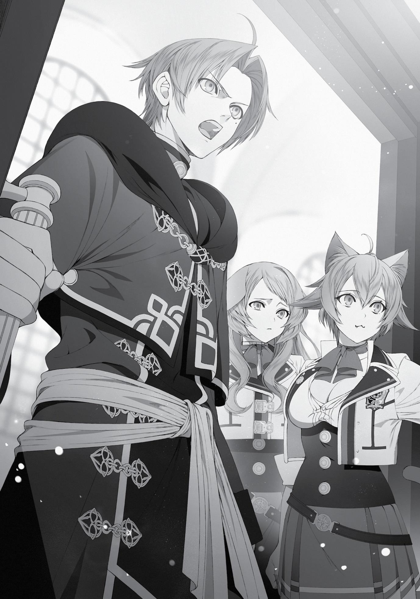

+++
title = "Chapter 4: A Brother's Feelings"
date = 2026-07-20
weight = 4
[extra]
volume = 11
chapter = 5
+++

“Of course not!” protested Sylphie, shaking her head vigorously.
“I-I wouldn’t tell anyone about that! How did you even find out
about this, Princess Ariel?!”
I did believe her. I knew the two of them were close friends, but
I couldn’t see a girl as shy as Sylphie talking about her sex life to
anyone. Not that it would be that big a deal if she did…as long as she
wasn’t complaining about my performance or whatever…
“Well, I didn’t,” replied Ariel lightly. “I was just fishing for a
reaction. I’m glad to hear you’re enjoying each other’s company,
though.”
Okay, well played.
Anyway…what were Pursena and Linia thinking? Gathering up
an entire bag of freshly worn underwear had to be their stupidest
idea yet. Had I ever done or said anything to make them think I
wanted… Wait a second. Didn’t they say something about bringing
me a bunch of panties as tribute a while ago?
Oh, crap, they did.
I’d assumed it was just a joke at the time, but maybe they’d
been serious about it. Well, whatever. This still wasn’t my fault,
right? Yeah. Definitely not.
“I think this was a misguided attempt at doing me a kindness, so
I’d appreciate it if you let me scold Linia and Pursena myself,” I said.
“Oh, and could you arrange to have the underwear returned to their
owners? Just to be clear, I haven’t even looked inside, let alone
touched anything.”
I handed the bag over to Ariel without hesitation.
Linia and Pursena might not have meant badly, but I’d have to
be firm with them about this. The only panties I liked were freshly
removed ones. It didn’t do anything for me if I didn’t get to see them
coming off.
Wait, no. That’s not the issue here.
“Very well, then.”
Ariel peeked briefly inside the bag, then nodded once again. It
seemed we’d managed to resolve the matter neatly.
“I must say, though,” Ariel continued, shooting a glance over at
Sylphie, “this is quite a lot of underwear. Aren’t you a bit
disappointed to lose such a treasure trove, Rudeus?”
“Not at all. I don’t have an underwear fetish or anything.”
“…I see. Well, my apologies for doubting you.”
“That’s quite all right. I’m glad we managed to clear up the
misunderstanding.”
Honestly, I was lucky it had played out like this. If I’d actually
taken those panties home with me…well, I didn’t know how I would
have gotten rid of them. It was all too easy to picture myself freaking
out for a while, then soaking them in booze to make an experimental
“panty beer.” Which would inevitably lead to Sylphie and Aisha
finding them, and then I’d never hear the end of it.
“Well, that’s a relief,” said Sylphie softly. “I was worried I wasn’t
satisfying you, Rudy.”
Ariel and Luke looked over at her with amused expressions on
their faces. It took her a second to realize exactly what she’d just
said, but then a bright red blush spread across her face.
And at that exact moment, the bell rang. Our lunch period was
over.
“Oh, that’s not good. We’re going to be late for class.”
“I’m very sorry for all the hassle Linia and Pursena caused you,
Princess Ariel…”
“It’s all right, Rudeus. These things happen.”
Luke held the door open and invited me to step through it. Ariel
and Sylphie followed, after which he came out himself and locked
the door behind him.
“Let’s get going, then.”
Ariel fell in beside me as we walked. Sylphie and Luke followed
slightly behind. Maybe I was supposed to be hanging back too? I
wasn’t too clear on the etiquette here.
“Oh…”
Before I could make up my mind, though, we turned the next
corner and ran into Norn. She was loitering in the hallway, looking
around uncertainly. She pressed her lips together tightly at the sight
of me.
“What’s the matter, Norn?” I asked. “Class is about to start.”
Instead of replying, Norn turned her face away from mine. By
sheer coincidence, she met Princess Ariel’s gaze instead.
“Hello, there. I’m Ariel, the president of the student council,”
Ariel said.
When Ariel favored her with a pleasant smile, Norn’s face
instantly went red. The princess tended to have that effect on
people, I guess. “I’m, uh… Norn Greyrat.”
“Nice to meet you, Norn. Is something wrong? Your next class
will be beginning soon.”
“Uhm, well… I’m not sure where the third practice room is…”
“Ah, I see.”
So she’d been left behind when her class changed rooms, huh?
Poor kid. It might sound insignificant, but things like that really hurt
when they happened to you as a kid. It seemed my concerns about
her turning into a loner might be justified.
“Luke, would you show her the way, please?” Ariel asked.
“Of course. This way, Norn. It’s not far.”
Gently placing a hand on Norn’s back, Luke led her off down the
hallway.
My sister’s face was crimson with embarrassment. It was
understandable, since Luke was a handsome guy, but I’d have to
warn her about him later. The man was a born playboy.
Just before they turned the corner, Norn paused to look back at
us. Her gaze darted between me, Ariel, and Sylphie for a moment.
But then she turned around again and left. Without having said a
single word to me.
It made me feel a little sad.
Once classes were over, I had Linia and Pursena meet me in the
back of the main building. I had a great deal to say to them about the
events that had taken place today.
The two of them showed up in high spirits. I think they liked the
idea of a secret meeting behind the school. It was exactly the sort of
place you’d have a dramatic scene in some romantic drama, after all.
“What’s up, Boss? Why’d you have us come all the way back
here?”
“Finally ready to admit you’re in love with us? Well, you better
run the plan by Fitz first. Don’t want her gettin’ mad at us.”
I almost felt bad about spoiling their good mood. Almost.
“We need to talk about that bag you gave me,” I said. “I handed
it over to Princess Ariel at lunch and asked her to give its contents
back to their owners.”
At first, their faces were blank with confusion. But a moment
later, they started elbowing each other in the side and hissing at
each other.
“I told you so! He didn’t want ’em after all!”
“It’s your fault, Linia. You said the boss loved panties.”
“What? You thought so too!”
“I wanted us to test the waters first. By giving him yours.”
“Why just me?! That wouldn’t be fair!”
“Yeah. That’s why we grabbed the dorm kids’ too.”
“That’s not what I mean! You coulda given him yours, too!”
“Nope. I’ve got big boobs, so he wouldn’t be interested.”
It was kind of entertaining to watch their pathetic attempts to
blame each other for the situation, but also kind of irritating. Why
did they think I only liked flat-chested girls, anyway?
“Okay, pipe down!” It felt like they could have gone on forever,
so I clapped my hands sharply to interrupt. “Do you remember what
I told you before, girls? I told you not to pick on anyone weaker than
you. You do recall this, right?”
That got them trembling.
“W-we didn’t pick on anyone, Boss. Honest!” Linia whined.
“T-that’s right. We just asked ’em real nicely,” added Pursena
with a whimper.
Oh, come on. As if some poor little freshman girl was ever going
to say no to a pair of terrifying bullies twice her size.
“Look, you’re beastfolk, aren’t you? I’d expect you to
understand how humiliating it is to have your clothing torn off you.”
“B-But we gave them new underwear and everything! It was just
a trade!”
“Oh, really? From the sound of things, a whole bunch of girls
ended up pretty shaken afterwards.”
“Their new ones probably didn’t fit right, that’s all! We didn’t
take any panties from the girls who said no, I swear!”
Hm? This sounded different from the way Ariel had described it.
That brought me some relief. I’d feel terrible if they’d forcibly ripped
anyone’s clothes off. I might have been tempted to make them walk
around naked in public for a while, just so they’d understand how
humiliating it was.
“You said you wouldn’t get mad, Boss! You promised!”
“It was just a misunderstanding, y’know? Cut us some slack
here, man…”
The two of them were obviously more scared of being punished
than anything else. At the end of the day, though, they’d gone to a
lot of trouble for my sake. They’d noticed I was feeling down and
tried to cheer me up. That was their only motivation here.
It was still a nice gesture, in that sense, even if I didn’t like their
present. I had sympathy for their victims, but they’d basically meant
well. It wasn’t like they’d deliberately set out to humiliate anyone,
like the bullies who’d targeted me in my previous life.
Yeah. They were more like a pair of innocent kids who’d gone
around collecting cicada shells, honestly. Would it really be fair for
me to slap them with some massive punishment?
“All right, fine. But if I find out you actually traumatized anyone,
I’m going to make you grovel naked in front of them and apologize.”
“O-okay, Boss.”
“We’re sorry…”
I had a feeling Ariel would make sure their victims were taken
care of. With that in mind, I couldn’t find it in myself to get too angry
at them, which actually surprised me a bit. Maybe I was biased
because they were my friends?
“Tell me something, though. Why the heck did you decide to
give me a bunch of underwear as a present, anyway?”
The two of them looked up at me in blank confusion, as if I’d
asked the strangest question in the world.
“I mean, you worship panties, don’tcha?”
“Yeah. You got that one pair in your special altar and
everything.”
Ah, right. So this was ultimately my fault. I should never have
allowed these two idiots to lay eyes upon my holy idol, not even for a
second.
“You’ve got the wrong idea,” I said. “I’m not worshiping the
panties themselves. They just belonged to someone who I do
worship. They’re a holy relic, basically.”
“Wait, really?”
“We totally thought you were in a panties cult or something.”
I did have a certain fondness for panties, but I’d never taken
things that far. “Well, now that that’s cleared up…make sure you
don’t repeat this mistake, all right?”
“You got it, Boss!”
“We’ll be good from now on.”
Was there anything else that needed to be said? Hmm…oh,
right.
“If you really feel the need to give me panties, I’d prefer ones
you take off yourselves right in front of me.”
“Huh?”
“Huh?!”
Whoops, maybe that part didn’t need to be said.
Now I had the two of them smirking at me knowingly.
“I knew it! You do wanna mate with us, Boss!”
“Well, of course he does. Deep down, he’s just another dude.
We’re irresistible.”
Wow, this was extremely annoying. It also didn’t make that
much sense. Shouldn’t they be grossed out or something, instead of
teasing me like this? Did they have a crush on me?
Nah, that wasn’t it. This was something different. I could tell
they liked me, but it wasn’t in the same way that Sylphie did. I
couldn’t put my finger on the exact difference, though. For now, I’d
just think of it as a weird kind of friendship.
I’d said everything else I needed to, which brought this meeting
to an end. My reputation was probably going to take a hit as a result
of this incident, but I could live with that. I didn’t care that much
what people said about me behind my back, anyway.
As the three of us emerged from behind the building, we
bumped into a group of first-year students. They were all carrying
their school bags, so it seemed they were heading back to the dorms.
The moment they spotted us, they all shifted over to the side of the
path to get out of our way.
As they were moving, though, I spotted Norn at the very back of
the group. She looked at me, and then at Linia and Pursena. Her
expression shifted from surprise to one of outrage and disbelief, and
then, as she passed us, she shot me a nasty glare.
Linia and Pursena turned around to watch her go, looking none
too pleased themselves.
“What’s that kid’s problem? She’s got a real attitude.”
“No fuckin’ kiddin’. We oughta teach her who’s on top around
here.”
“Just so you guys know, that was my little sister,” I said mildly.
Linia and Pursena cringed, their ears visibly drooping. “Uh, well,
good to see she’s got some spirit!”
“Yeah. She’s a real cutie, too.”
Talk about transparent.
With a smile, I thumped the two of them on the shoulders. “Try
to keep an eye out for her, okay?”
“You got it, Boss!”
“We’ll play nice.”
Still, this silent treatment from Norn was really starting to get to
me. I wanted us to least get to where we could have a basic
conversation…but as long as she was managing okay on her own, it
didn’t seem right for me to force the issue.
For a while, things were relatively uneventful. I wasn’t getting
any closer to Norn, but she was stopping by the house once every
ten days like she’d promised.
I was a little surprised that she didn’t disobey me more often,
considering the fact that she obviously disliked me. But for the most
part, she didn’t push back at me directly…although she did grimace
sometimes.
When you thought about it, though, I hadn’t spent much time
with either of my sisters after their infancy. Maybe it was stupid of
me to expect they’d think of me as family right off the bat. Aisha’s
friendly attitude was probably the more unusual of the two. Just
because you’re related to someone doesn’t mean you’ll
unconditionally enjoy each other’s company. I knew that all too well.
In fact, family members can often be the people we resent most
bitterly—and most persistently.
I’d punched my father in front of Norn. Paul and I had made up
quickly and put that incident behind us, but the memory probably
still smoldered in my sister’s heart. If she ever brought it up, I’d have
to apologize sincerely. Even if it seemed like ancient history to me,
the pain and anger might still be fresh for her.
There was no need to rush things, though. The two of us would
probably be living close to each other for years, or even decades. If it
took a year or two for her to warm up to me, I could live with that.
It wasn’t like siblings had to be best friends with each other. We
just needed to find a relationship that felt comfortable for both of us,
and that might take some time.
Only a few days after I reached this conclusion, I got some
alarming news.
Norn had shut herself in her room.
Chapter 4:
A Brother’s Feelings

I

LEARNED ABOUT THE SITUATION

as I headed to school with Sylphie one

morning.
Linia and Pursena were waiting outside the gates for me. As
soon as they saw us approaching, they ran over and explained that
Norn had shut herself in her room the day before and was refusing to
come out.
“I’m going to go take a look!” Sylphie was off and running
toward the girls’ dormitory pretty much instantly.
On the other hand, I was frozen in place. I should probably have
been following my wife, but the news had thrown me into a state of
panic. The word shut-in had some very heavy connotations for me, I
guess.
“Aren’t you going too, Boss?”
“You gonna just ignore this?”
I didn’t know what to say.
What was I going to do? What was I supposed to do? My mind
was blank. In my case, it had all been over the minute I locked myself
into my room. I’d stayed a shut-in for the rest of my life.
Why did I never come back out? Because I thought the outside
world was a dangerous place, full of people who wanted to do me
harm. I thought I’d be bullied again if I went back to school. Yeah—it
was the bullying that started it. I knew they’d make me miserable all
over again if I ever tried to emerge from my isolation.
I had to address the cause of Norn’s behavior if I wanted it to
change. Before I tried to coax her out, I had to figure out the reason
she was hiding in her room.
A memory from my past flashed through my mind. I was in the
cafeteria at my old school, standing patiently in line. But just as it
was finally my turn, a bunch of scary-looking punks barged in ahead
of me. Full of righteous anger, I stupidly decided to stand up for
myself. I lectured them loudly enough for everyone to hear, even as
they sneered at me and told me to fuck off.
I could see other students starting to glance over at us. Feeling
increasingly proud of myself, I stubbornly pressed the issue,
demanding an apology. Instead, they beat me viciously. By the time
it was over, I thought they’d crippled me for life.
That one mistake turned my life into a living hell.
If there was any chance Norn was going through something
similar right now, I needed to help her. I’d beat down the bullies who
were harassing her until she felt safe again.
Their friends or relatives might come after me later, but I’d deal
with them too if I had to. I didn’t care if they were rich aristocrats, or
even royalty. I’d fight them with everything I had. I’d make sure they
lived to regret antagonizing me.
There was a possibility Norn had set off the initial conflict. But
whatever they were doing to her in response had obviously crossed
the line.
Norn was my sister. It didn’t matter if she hated me and Aisha,
or if she didn’t want to live with us. She was still part of my family.
And it’s the big brother’s job to protect his siblings, right?
A few minutes later, I was striding down the hall toward the
first-year classrooms with Linia and Pursena following close behind
me. I’d considered doing this by myself, but I didn’t think my face
was especially intimidating. At least with these two standing next to
me, everyone should recognize that I meant business.
“Uh, Boss…”
“Don’t, Linia. Can’t you see how mad he is? It’s kinda scary.”
The two of them seemed a little dubious about this. That was
understandable. I was dragging them into a seriously embarrassing
situation. But right now, I wasn’t about to let my sense of shame
stop me. Right now, I was in full helicopter parent mode.
Before long, we reached Norn’s primary classroom. Homeroom
was already underway.
“Excuse me,” I said, throwing open the door and stepping right
inside.
“Uh, M-Mister Greyrat? We’re in the middle of—”
“I’d like a moment of everyone’s time, if you don’t mind.”

“But—”
“It won’t take long.”
Shouldering the professor out of the way, I took her place
behind the podium.
Before getting underway, I looked around the classroom.
Everyone was staring up at me in surprise. But somewhere in this
crowd, there had to be a bully who was picking on my little sister.
Had they punched her? Kicked her? Maybe they’d only insulted
her for now. Maybe they’d just made fun of a sad, lonely little girl
who was isolated in an unfamiliar city.
“As I believe most of you know, one member of this class was
absent yesterday.”
No one had anything to say to that.
“What you may not be aware of is that she’s my little sister.”
That got a reaction. I heard murmurs from all around the
classroom.
“I haven’t heard the details from my sister yet, but there aren’t
many reasons why a kid her age would stop coming to class. I think
someone in this room is probably responsible.”
I scanned the room as I spoke, looking for a reaction. A number
of students looked down at their desks when I made eye contact
with them. Most of these were tougher-looking kids who were
already starting to bend the dress code slightly. Did they have a
guilty conscience, maybe?
Looking more closely, I realized that one of them was that
delinquent I’d met some time earlier. I couldn’t remember his name
off the top of my head. Could he have been the one?
Slow down. It’s too early to start jumping to conclusions.
“I don’t expect much of those responsible,” I said. “Maybe they
were just playing around, or trying to get to know my sister, and
things took a weird turn. Maybe she provoked them somehow.”
I was watching every face in the classroom very closely now.
Who was it? Who’s bullying her? Is it that rich brat over there?
Or maybe that sullen demon kid? No, it could just as easily be an
ordinary girl. The average kids can be the nastiest bullies of all,
sometimes.
“I’d very much appreciate it if anyone involved would step up
and admit it. I’m not going to yell at you. I just want you to recognize
what you did and apologize to my sister.”
And after that, I’ll chop you into mincemeat.
Some of the kids in this room were about as young as Norn, but
the majority were older. Some were even in their late teens. There
were probably at least a few who’d looked the other way. There was
even a chance they’d all been in on it. The more I thought about it,
the angrier I got.
For a few long moments, no one said a word. Everyone just
stared at me, their eyes wide with surprise.
“U-Uhm…”
Finally, one girl in the group hesitantly raised her hand. It took
some serious willpower to keep myself from firing off a Stone
Cannon at her.
She was beastfolk, maybe thirteen years old, who looked a bit
like a raccoon dog. She had a round face, timid eyes, and a bob
haircut. Not the kind of kid you’d expect to be a bully, honestly. It
was easier to imagine her getting bullied.
“I w-was actually talking to Norn the other day, and—”
“You accidentally said something mean to her?”
As long as it was just a few nasty words, maybe I’d take it easy
on her.
“No, no! It’s just, uhm… I’ve heard a lot of stories about you, Mr.
Greyrat. But Norn’s more of an ordinary girl, right? I just pointed out
that you’re pretty different from each other, and then she got really
mad at me…”
That didn’t make any sense. Why would Norn get mad about
that? She didn’t want to be like me. She didn’t even like me.
“Oh…”
The professor standing off to the side of the room seemed to
have remembered something. I turned my attention to her. At a
glance, the woman looked like an ordinary middle-aged magician. It
hadn’t even occurred to me that a teacher might be the culprit, but
adults can obviously be bullies too.
“Did something come to mind, Miss?”
“Well, I was giving Norn her homework back yesterday, and—”
“She couldn’t finish all the assignments you’d dumped on her,
so you made her stand naked in the faculty office for an hour?”
“What? N-No, no! She didn’t do too well on the assignment, so I
told her to learn from your example and try a little harder next
time.”
“…”
“I thought she was going to cry for a moment, but then she
nodded and said she’d do her best.”
Wait, what? She nearly cried?
“Oh, wait, that reminds me…”
All of a sudden, there were multiple people chiming in from all
around the classroom. And all of them had similar stories to share.
